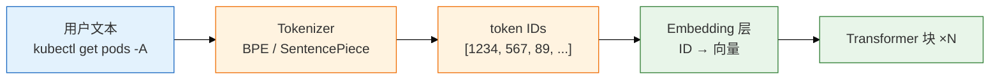
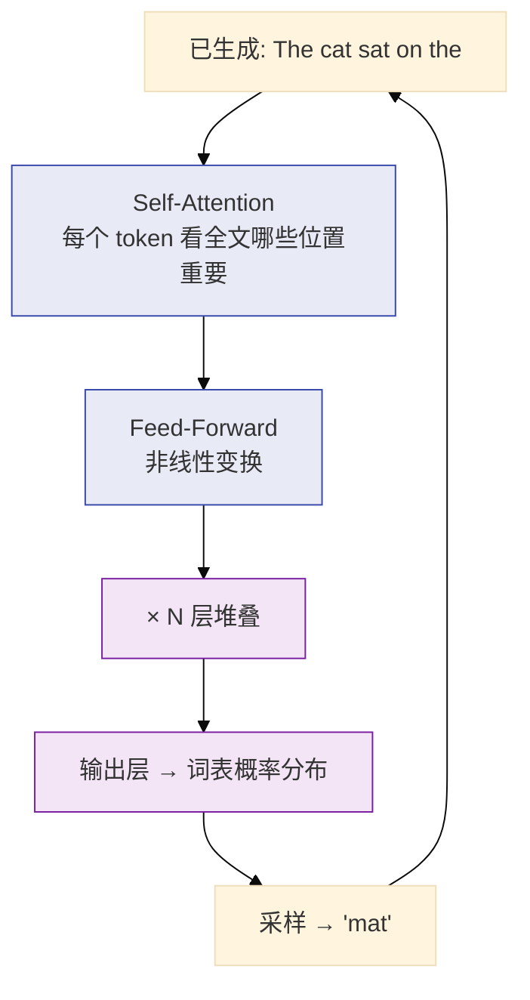
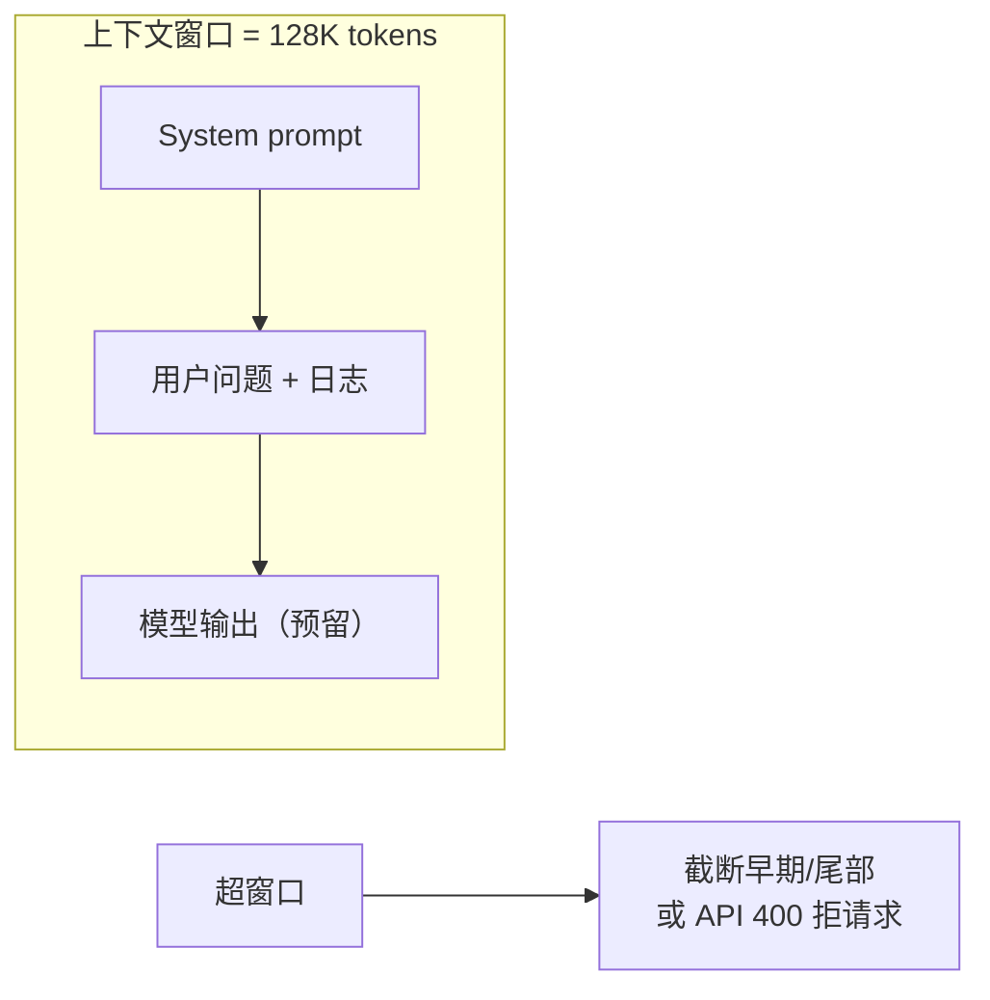
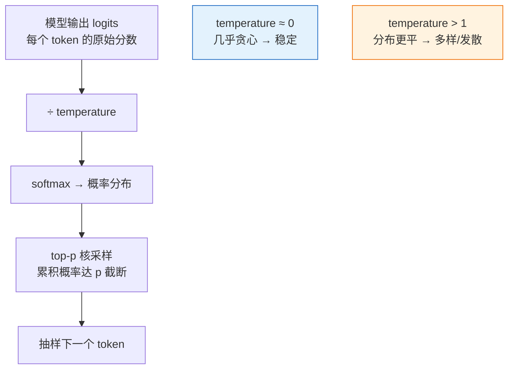
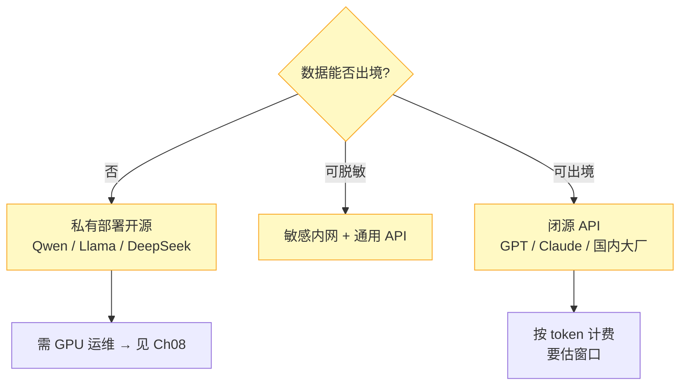
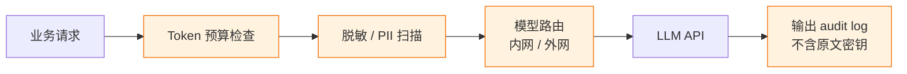
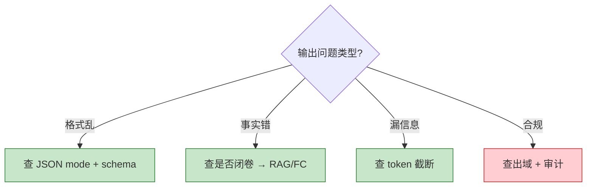

# 01｜LLM 与 Transformer 基础

> **加分项定位**：大厂 SRE 面试常用来测「懂不懂 AI 边界」——不是要你推公式，是要你说清 LLM 是什么、不是什么。  
> **红线**：生产数据/密钥不出域；模型会幻觉；低温 ≠ 事实；LLM 不是搜索引擎也不是执行器。

---

## 面试怎么考

| 频率 | 典型问法 | 30 秒要点 | 2 分钟要点 |
|:----:|----------|-----------|------------|
| ★★★★★ | LLM 和搜索引擎有什么区别？ | 闭卷续写下一个 token，不查库不执行；像不像 ≠ 对不对 | 自回归：Tokenizer → Transformer 堆叠 → 采样出下一个 token；训练学分布不是记事实；运维用它读日志/写草稿，不能让它 ssh |
| ★★★★★ | 上下文窗口怎么算？超了会怎样？ | 输入 + 输出一起占窗口；超了截尾巴或拒请求，不会报警 | 128K 不是「能塞 128K 字」；token 与字符比因模型而异；长日志要先摘要再塞；留 output 预算给 JSON 答案 |
| ★★★★ | temperature 和 top-p 干什么？ | 控随机性；流水线用低温；不能当事实开关 | temperature 拉平/锐化概率分布；top-p 核采样截断长尾；排障 JSON 用 0~0.3；创意文案才升温 |
| ★★★★ | 什么是幻觉？怎么挡？ | 自信地错；材料+校验+人审；不能靠「换大模型」 alone | 闭卷必然幻觉；RAG 开卷、FC 查实时、schema 校验、引用原文、拒答策略；值班责任在人 |
| ★★★★ | 开源闭源怎么选？ | 先问数据能不能出境、合规、成本；不是先问谁最强 | 闭源 API：快、强、数据出境风险；开源私有：控数据、要 GPU 运维；混合：敏感内网、通用外网 |
| ★★★ | Transformer 直觉是什么？ | Self-Attention 让 token 互看；堆叠层提取模式；不推公式 | Q/K/V 注意力：当前 token 看上下文哪些位置重要；FFN 做非线性；多层堆叠从局部到全局；运维只需懂「看上下文续写」 |

---

## SRE 边界

| 该用 | 禁止 |
|------|------|
| 告警/日志 **摘要草稿**（人审后发群） | 把含 UID/支付/kubeconfig 的原文贴公有云 |
| 排障 **方向建议**（「先查 X 指标」） | 让模型「直接给出 kubectl 变更命令并执行」 |
| Runbook/脚本的 **初稿** | 不经 review 把 AI 生成的 YAML apply 上线 |
| 内网私有部署 / 脱敏后再调 API | 默认认为「GPT 说的就是对的生产真相」 |
| 低温 + JSON schema 做 **结构化草稿** | 用 temperature=0 当「不会错」的保证 |

---

## 原理讲透

### 3.1 Token 与 Tokenizer

**一句话**：模型读的不是「字」，而是 Tokenizer 切出来的 token 序列；同一个词在不同模型里 token 数不同，直接影响窗口占用和账单。

**白话解释**：

- **Token** 是模型最小处理单位。英文常 1 词 ≈ 1 token；中文往往 1 字 ≈ 1~2 token；代码、JSON 标点也会占 token。
- **Tokenizer** 用 BPE 等算法把文本切成词表内的子词。运维估窗口：中文日志按「字符数 × 1.5~2」粗算 token 更安全。
- **账单**：API 按 input + output token 计费。把整段 `kubectl describe` 无差别塞进去，既超窗口又烧钱。
- **面试口径**：「我先估 token，能摘要就摘要；窗口是输入输出共享的硬上限。」

| 现象 | 原因 | 运维动作 |
|------|------|----------|
| 同样 1000 字中文，两家 API 价格差 2 倍 | token 切分策略不同 | 用目标模型 Tokenizer 试算，别凭感觉 |
| JSON 里大量重复 key | 重复结构每个符号都是 token | 先压缩/提取字段再喂模型 |
| 代码块特别「费 token」 | 缩进、符号、长变量名 | 只贴相关函数，不要整文件 |

---

### 3.2 自回归与 Transformer 直觉

**一句话**：LLM 每次只预测「下一个 token」，把预测结果拼回去再预测下一个——像极快的中文联想，不是数据库查询。

**白话解释**（不推公式，面试够用）：

1. **自回归（Autoregressive）**：生成「the mat」时，模型条件于前面所有 token，逐字往后写。没有「先想好整段再输出」的内部机制。
2. **Self-Attention**：当前 token 对上下文每个位置算「相关性权重」，远距离依赖（如日志里前后出现的 Pod 名）靠多层 attention 捕获。
3. **堆叠**：浅层抓局部（标点、关键字）；深层抓模式（「OOM → 先查 limits」这类训练分布里的写法）。
4. **和运维的关系**：它擅长「像 SRE 会怎么写」的文本，不保证「你们集群实际是什么状态」。查状态要靠 FC/MCP/人。

> **记住**：LLM = 闭卷续写器。你塞进去的材料是这一次它「能看见的全部世界」。

---

### 3.3 上下文窗口（Context Window）

**一句话**：窗口是 input + output 共享的 token 上限；超了要么拒请求、要么静默截断——不会提醒你「后面被砍了」。

**白话解释**：

| 概念 | 说明 |
|------|------|
| 共享预算 | 128K 窗口 ≠ 能塞 128K 字日志；要留 2K~8K 给回答 |
| 截断策略 | 多数实现截 **最早** 或 **中间** 的 token；被截部分模型完全看不见 |
| 无状态 | 每次 API 调用独立；模型不「记住」上次对话除非你把历史再塞进去 |
| 长上下文模型 | 窗口大 ≠ 注意力都有效；中间「lost in the middle」现象存在，重要信息放首尾 |

**运维估窗口四步**：

1. Tokenizer 试算 system + user 总长。
2. 日志超 50% 窗口 → 先规则提取（ERROR 行、最近 5 分钟）。
3. 仍超 → 分段摘要（Map-Reduce 或滑动窗口），再合成。
4. 预留 output：`max_tokens` 设够，避免 JSON 写一半截断。

---

### 3.4 采样：Temperature 与 Top-p

**一句话**：Temperature 和 top-p 控制「随机性」，不控制「真实性」；生产流水线默认低温，但仍要人审。

| 参数 | 效果 | SRE 推荐 |
|------|------|----------|
| `temperature=0~0.3` | 输出稳定、可复现 | 告警分类、JSON 提取、Runbook 匹配 |
| `temperature=0.7~1.0` | 措辞多样 | 对外公告润色（仍人审） |
| `top_p=0.9~0.95` | 砍掉低概率长尾 token | 与低温配合，防偶发怪 token |
| `top_k` | 只从 top K 里抽 | 部分 API 支持；不如 top-p 常用 |

> **记住**：低温让「同样输入多次输出更像」，不是「更真」。幻觉在低温下仍会 confidently wrong。

---

### 3.5 幻觉（Hallucination）

**一句话**：模型用训练分布「补全」它不知道的事，且语气自信——这是机制不是 bug，要靠架构挡。

| 幻觉类型 | 例子 | 挡法 |
|----------|------|------|
| 事实幻觉 | 编造不存在的 kubectl flag | 只读 FC 查 `--help`；人核对 |
| 引用幻觉 | 「根据 wiki 第 3 章…」但无此文 | RAG 强制引用片段 ID；无引用则拒答 |
| 数值幻觉 | 「CPU 90%」实际没查 | 工具查 Prometheus；禁止模型报具体数值 |
| 时效幻觉 | 讲已下线架构 | 文档元数据 + 过期下架 |

**三层防护（面试背）**：

1. **材料层**：RAG / FC 给真实上下文或实时数据。
2. **约束层**：Prompt 要求「仅基于引用」「不知道就说不知道」；JSON schema 校验。
3. **人审层**：变更、对外、Silence 必须人签字。

---

### 3.6 开源 vs 闭源选型

**一句话**：SRE 选型顺序是 **合规 → 数据出域 → 成本 → 能力**，不是 GitHub star 排行。

| 维度 | 闭源 API | 开源私有 |
|------|----------|----------|
| 能力 | 通常更强、迭代快 | 7B~70B 看场景；小模型易幻觉 |
| 数据 | 出域/合规条款要审 | 数据留内网 |
| 成本 | 按量；高峰账单波动 | GPU 固定成本 + 运维人力 |
| 延迟 | 依赖网络 | 内网可控；要自己做推理服务 |
| 运维 | 几乎零运维 | vLLM/TGI、监控、扩缩容 |

**API vs 私有部署决策表**：

| 场景 | 建议 |
|------|------|
| 内网 wiki 问答（含架构图） | 私有 + RAG |
| 公开技术博客润色 | API 可接受 |
| 含玩家 UID、支付、密钥 | **禁止** 出域；私有或本地 |
| 活动高峰临时扩容 | API 弹性；私有要提前 HPA/GPU 池 |

---

### 3.7 API 调用参数速查（SRE 视角）

**一句话**：除了 temperature，SRE 要会设 `max_tokens`、stop sequence、seed（若有），并在网关层做 token 预算与审计。

| 参数 | 作用 | 运维推荐 |
|------|------|----------|
| `max_tokens` | 输出 token 上限 | JSON 摘要 512~2048；长 Runbook 4096 |
| `temperature` | 随机性 | 流水线 0~0.3 |
| `top_p` | 核采样 | 0.9~0.95 与低温配合 |
| `stop` | 遇到字符串停止 | 多轮工具链时可设 `\n\nHuman:` |
| `seed` | 固定采样（部分 API） | 评测对比 prompt 版本时用 |
| `response_format` | JSON mode | 告警分类、字段提取 |
| `timeout` | 客户端超时 | 设比网关 SLA 短 5~10s，便于重试 |

**网关层必做**（不是模型参数，但是 SRE 责任）：

| 网关策略 | 说明 |
|----------|------|
| 单请求 input 上限 | 如 32K tokens，超过走摘要服务 |
| 每日配额 | 防脚本死循环烧钱 |
| 模型路由 | 含 `password`/`secret`/`kubeconfig` 关键字 → 拒绝或强制内网 |
| 响应缓存 | 相同告警 fingerprint 5min 内复用摘要（注意 stale） |

---

### 3.8 生产排障：窗口、幻觉、出域

**一句话**：LLM 相关线上问题三类——超窗/截断、幻觉误导、数据出域——按现象对表排查，别一上来换模型。

| 现象 | 先做 | 别做 |
|------|------|------|
| 答案「漏看」堆栈前半 | 查 input token 数；是否 silent truncate | 加 temperature |
| JSON 字段缺一半 | 查 `max_tokens` 和 finish_reason=length | 无限增大窗口 |
| 同样 prompt 前后不一致 | 查 temperature>0；有无 seed | 当 bug 报给模型厂商 |
| 分类准确率骤降 | 查 prompt 版本是否被改；数据漂移 | 直接 fine-tune |
| 摘要里出现 plausible 假指标 | 加强「不得编造数值」；接 FC 查 Prometheus | 让 Oncall 信摘要 |
| 安全扫描告警外发 | 立即轮换泄露凭证；改内网路由 | 继续用公有 API |

---

### 3.9 多轮对话与状态管理

**一句话**：模型 API 本身无状态；「聊天记忆」是应用层把 history 再塞回窗口——占 token、会累积幻觉，运维助手通常 **单轮** 或 **短窗口多轮**。

| 模式 | 适用 | 风险 |
|------|------|------|
| 单轮 | 告警分类、日志提取 | 低 |
| 短多轮（≤5） | 排障追问「还有呢」 | history 膨胀超窗 |
| 长多轮 | 不推荐生产 Oncall | 早期错误被滚进 context |

**实践建议**：

1. 每轮只带 **摘要后** 的材料，不带完整 history 原文。
2. 用 **session store** 存结构化中间结果（已提取字段），而非全文对话。
3. 关键结论写回工单系统，不靠模型「记住」。

---

## 落地场景

### 场景 1：告警风暴下的群消息摘要

**背景**：P1 活动高峰，200 条 Alertmanager 通知涌入飞书群，Oncall 需要 30 秒内知道「是不是同一根因」。

**做法**：

1. 告警聚合器先把 firing 告警 JSON **脱敏**（去掉内网 IP 末段、实例 ID 哈希）。
2. 调内网 LLM API，`temperature=0.2`，Prompt 要求输出：根因假设（≤3 条）、建议先看哪 2 个面板、**禁止**给出变更命令。
3. Oncall 人审后 pin 到群；若摘要提到具体 Pod，人工 `kubectl` 核实。

**边界**：摘要是 **草稿**；Silence / Scale / Rollback 必须人点。

### 场景 2：排障助手（不是替值班）

**背景**：战斗服 OOM，Junior SRE 把最近 500 行日志贴进内部助手。

**做法**：

1. 平台先规则提取 `OOMKilled`、`exit code`、`container name`。
2. LLM 输出：**可能原因排序** + **建议执行的只读命令清单**（如 `kubectl top pod`、`describe` 哪些字段）。
3. 执行任何命令仍由人在跳板机操作；助手无 ssh 权限。

**翻车点**：若直接把未脱敏日志贴公有云 ChatGPT → 数据出域 + 模型可能编造 `kubectl` 子命令。**正确姿势**：内网模型 + 脱敏 + 只读建议。

### 场景 3：FinOps — token 账单异常飙高

**背景**：活动后 LLM 网关账单环比 ×8，FinOps 质疑是否被刷。

**排查**：

1. 按 caller 聚合 input tokens：发现某「日志分析」脚本把全量 access log 每 5 分钟送一次。
2. 加 **单请求 input 上限** + **caller 日配额**。
3. 脚本改为：先 grep ERROR + 超 8K token 走本地摘要器。

**口径**：「LLM 成本 = token × 单价 × QPS；窗口管理是 FinOps 问题，不是只属算法团队。」

### 场景 4：模型选型 POC 对比

**背景**：平台要在 Qwen2.5-72B 私有 vs 闭源 API 做 wiki 摘要 POC。

| 维度 | 量法 |
|------|------|
| 质量 | 100 条脱敏告警，人工评 1~5 分 |
| 延迟 | P50/P99 端到端 |
| 成本 | 私有：GPU 月租；API：token 账单 × 预估 QPS |
| 合规 | 数据路径是否出内网 |

**结论模板**：「敏感场景私有；POC 通过评测集 + 成本模型决策，不凭体感。」

---

## 口述模板

### 【30 秒】

「LLM 本质是 Transformer 自回归模型，每次预测下一个 token，不是搜索引擎也不是执行器。运维用它做告警摘要、排障方向、脚本草稿，但要控上下文窗口、用低温增稳定，幻觉靠 RAG、工具查实时和人审来挡。选型先看数据能不能出境，再看成本和 GPU 运维能力。」

### 【2 分钟】

「从机制上说，文本经 Tokenizer 切成 token，过多层 Self-Attention 和 FFN，输出下一个 token 的概率分布，采样后拼回去继续生成——所以叫闭卷续写。上下文窗口是 input 和 output 共享上限，超了会截断或拒请求，长日志要先摘要。temperature 和 top-p 控随机性，流水线用 0~0.3，但不能当事实开关，幻觉是机制问题，要靠检索、Function Calling 和 schema 校验。选型上，含生产数据的场景默认不出域，能私有就私有；通用文案可以用 API。我们线上用 LLM 做告警聚合摘要和 Runbook 匹配草稿，变更和 Silence 一定人审，模型永远不直连生产写接口。」

### 【常见追问】

| 追问 | 答法 |
|------|------|
| 128K 窗口是不是能塞 128K 汉字？ | 不能，token 数通常大于字符数；还要预留 output |
| 为什么低温还会胡说？ | 低温只是选最高概率 token，训练数据里没有的事实仍会「像样地编」 |
| 和 RAG 什么关系？ | LLM 是生成器；RAG 先检索再给材料，减少闭卷幻觉 |
| 小模型能不能上生产？ | 可以辅助分类/摘要，关键路径要评测；7B 幻觉率高于 70B |
| Transformer 和 CNN/RNN 区别？ | Attention 并行看全局上下文；RNN 顺序传递，长依赖弱 |

---

## 必会 · 常考

### 对错表

| 说法 | 对错 | 纠正 |
|------|:----:|------|
| LLM 理解了代码语义所以不会错 | ✗ | 学的是统计模式，不是形式化验证 |
| temperature=0 保证事实正确 | ✗ | 只保证更 deterministic，不保证真 |
| 上下文越大越好，整段日志全塞 | ✗ | 贵、慢、中间信息可能被忽略；要先提取 |
| 开源模型数据一定不出域 | ✗ | 不出域指部署在内网；贴到公有云照样出域 |
| 幻觉可以通过 prompt 完全消除 | ✗ | 只能降低；架构上要有拒答和人审 |
| Token 和字节是一回事 | ✗ | Token 是模型词表单位；UTF-8 字节是另一套 |
| 多轮对话模型会「记住」上周内容 | ✗ | 无状态；历史要靠应用层再传入 |
| Self-Attention 让模型能看长距离依赖 | ✓ | 这是 Transformer 核心优势 |

### 易混

| A | B | 区分 |
|---|---|------|
| LLM | 搜索引擎 | 前者生成文本；后者检索索引 |
| temperature | max_tokens | 前者控随机；后者控输出长度上限 |
| 上下文窗口 | 训练数据 cutoff | 窗口是推理时一次能看多少；cutoff 是训练知识截止日期 |
| 幻觉 | 模型过时 | 幻觉是编造；过时是训练/文档未更新，RAG 可解后者 |
| 闭源 API | 私有开源 | 出域与运维责任不同，不是能力绝对高低 |

### 数字参考（口径题）

| 项 | 参考值 | 备注 |
|----|--------|------|
| 排障 JSON 提取 temperature | 0 ~ 0.3 | 仍要 schema 校验 |
| 预留 output tokens | 512 ~ 4096 | 看答案复杂度 |
| 中文粗算 token | 字符 × 1.5~2 | 用官方 Tokenizer 更准 |
| 7B vs 70B | 能力/成本差一个量级 | 边缘任务 7B；复杂推理 70B+ |

---

## 合上书，问自己

1. 用一句话向面试官解释「LLM 不是搜索引擎」——机制上差在哪？
2. 128K 窗口的一请求里，input 和 output 怎么分预算？超窗口会发生什么？
3. temperature 和 top-p 各解决什么问题？为什么低温不能防幻觉？
4. 含 kubeconfig 的 `kubectl` 输出能不能贴公有云 API？为什么？
5. 开源私有和闭源 API，你的选型决策树前三问是什么？
6. Self-Attention 直觉是什么？为什么 SRE 只需要懂「续写」而不必推公式？

---

**本章不讲**：结构化 Prompt、注入防护 → [02 Prompt 工程](../02-Prompt工程/)；RAG 开卷 → [03 RAG](../03-RAG检索增强/)；调监控只读工具 → [04 FC](../04-Function-Calling与Tool-Use/)；推理部署 → [08 GPU](../08-GPU与推理服务运维/)。
