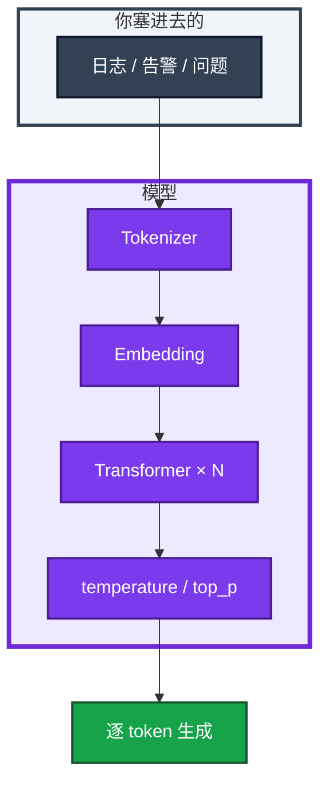
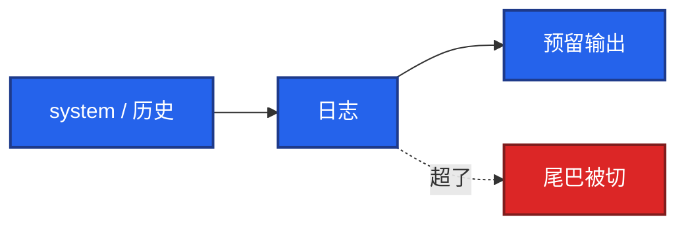
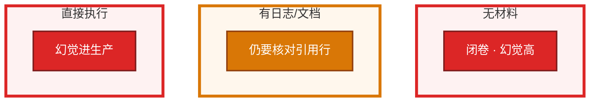
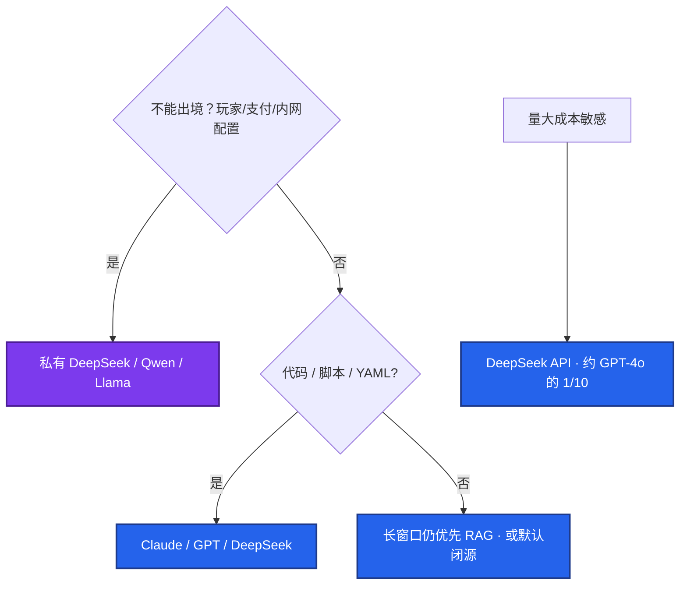

# 01｜LLM 与 Transformer 基础 · 练习题

先自己画图或口述，再对照解答。每题标了覆盖范围：

| 标记 | 含义 |
|------|------|
| **核心** | 不懂整章就没建立起来 |
| **必会** | 值班和面试都要能讲 |
| **常用** | 线上会反复碰到 |
| **常考** | 白板和追问的高频口径 |

## 本题目录

- [Q1 是什么、在算什么](#q1)
- [Q2 Token / 窗口](#q2)
- [Q3 temperature / 幻觉](#q3)
- [Q4 错命令直接跑吗](#q4)
- [Q5 开闭源 / 玩家数据](#q5)
- [Q6 API 还是私有](#q6)
- [Q7 日常提效与边界](#q7)
- [Q8 system / seed](#q8)
- [Q9 长窗口还要不要 RAG](#q9)
- [Q10 编码助手 vs 选模型](#q10)
- [合上书](#合上书)

---

## Q1

**★★★★★｜贴一段日志给模型，它实际在算什么？画架构**

**覆盖**：核心 · 必会 · 常考

### 场景

白板：「夜班把战斗服 `describe` 丢进对话框。它不是把手册检索了一遍吗？」有人开始背 Attention 公式。

### 完整解答

它在做 **下一个 token 的概率预测**，不是查库。文本先被切成 token，过 Transformer 堆叠块，再在采样层吐字。没有检索、没有执行器时，只拟合「像不像」。

所以会写出看起来合法、集群里没有的 kubectl flag。开卷靠 RAG（03），执行靠工具调用（04），都不是这张图自带的能力。

### 再追问

- 运维要不要会推 Attention 公式？——不用。记住 tokenize、窗口、采样、幻觉。堆叠块当黑盒。
- 和规则引擎差在哪？——规则引擎查表执行；LLM 闭卷续写，不查真相。

---

## Q2

**★★★★★｜Token 和上下文窗口怎么影响贴日志？超了会怎样？**

**覆盖**：核心 · 必会 · 常用

### 场景

把完整 `access.log` 贴进去，模型后半段答得像没看见 10:32 的报错。另一次 API 直接 `context_length_exceeded`。

### 完整解答

Token 是计费和窗口的单位。中文大约 1 字 1～1.5 token，英文大约 4 字符 1 token。窗口是 **输入 + 输出之和**（system、历史、工具 schema、RAG 片段、`max_tokens` 预留都算）。超了就拒请求或从尾巴截掉，模型对截掉的部分等于没看见——不会报「我没读完」。

处理：按故障时间窗切、关键字过滤；仍不够走 RAG。不要赌「号称 1M 就能替代知识库」——贵、慢、中间段落易稀释。输出长脚本时把 `max_tokens` 调大，同时给输入留余量。多轮和 Function Calling 会把窗口占满，旧红线会被挤掉。

### 再追问

- 128K 大概能塞多少中文？——数量级大约八万字再扣 system 和输出。先估再贴。
- `finish_reason=length` 是模型懒吗？——否。输出预算不够，JSON 会残缺。

---

## Q3

**★★★★★｜排障和出 JSON 时 temperature 怎么设？设 0 还会幻觉吗？**

**覆盖**：核心 · 必会 · 常考

### 场景

流水线用模型给告警打 P0/P1 标签，有时同一条告警两次结果不一样，有时编造指标名。有人说温度调到 0 就是事实模式。

### 完整解答

运维自动化、脚本、JSON 用 **temperature 0～0.2**；可把 `top_p` 固定为 1，避免两头一起拧。`max_tokens` 按输出长度留。system 写红线：只基于材料、不确定就说、不给写命令。

低温只压随机性，**不是事实模式**。训练分布里的错命令仍会高置信出现。防幻觉靠材料约束、schema 校验、人审，以及 RAG（03）。

### 再追问

- 要复现「当时模型说了什么」怎么办？——记录模型名、temperature、seed（若有）、原始 prompt 和材料。不记就不可复现。
- 排障分析能否略高？——0.2～0.4 可以；进程序仍走低温 + schema。

---

## Q4

**★★★★★｜模型写出一条像那么回事的 kubectl，你会直接跑吗？幻觉怎么防？**

**覆盖**：核心 · 必会 · 常考

### 场景

模型建议 `-o wide-events` 和 `kubectl delete pod --force`。值班急着止血。另一条命令能跑，但 namespace 指错了。

### 完整解答

**不直接跑。** 幻觉是自信的错误：错 flag、编 API、过时 K8s 写法、闭卷编案例。能跑但指错 namespace 是误操作，不是报错。生产命令 = 人审后才执行。AI 默认只出草稿和只读分析。

叠防：材料约束、强制说不确定、JSON+程序校验、关键命令人批、私有知识走 RAG。玩家 UID、支付流水、kubeconfig **不出域**。不要把 AI 吹成能替值班。

### 再追问

- 写了「请引用日志」就够了吗？——不够。它会编行号。把引用片段展示给人，对原文。
- 角色写成严谨 SRE 呢？——仍会编。角色锦上添花，约束、格式、人审才是底。

---

## Q5

**★★★★☆｜开源私有化和闭源 API 怎么选？游戏用户数据呢？**

**覆盖**：必会 · 常用 · 常考

### 场景

安全问：战斗日志能不能打到境外 API？成本同学问：能不能全上最强闭源。另有人要把所有聊天都上 70B 本地卡。

### 完整解答

先问能不能出境，再问任务类型、窗口、成本。不要从「哪个最强」开场。

日常写脚本用闭源 API 提速；**碰用户数据和密钥的自动化走私有化**。开源不是免费安全，你要运维 GPU、补丁、越狱和注入（08）。合同盯数据地域、是否用于再训练、子处理器、日志留存。

### 再追问

- 私有部署入口用什么？——试模型 Ollama，生产高并发 vLLM。细节在 08。
- 70B 24 小时空转更稳吗？——否。成本在利用率；活动日和 GM 问答抢卡。

---

## Q6

**★★★★☆｜API 和私有部署各适合什么？延迟和成本怎么权衡？**

**覆盖**：必会 · 常用

### 场景

内部 Copilot 要分析工单。法务不让原文出域。有人提议全部自建 70B。告警摘要 bot 已脱敏，每分钟几十次。TTFT 从 300ms 打到 8s。

### 完整解答

API：效果新、少维护，数据有出域和合同问题，按 token 计费。  
私有：数据留 VPC，卡时空闲也烧钱，效果受卡和版本限制，延迟可控。

告警摘要已脱敏走公有 API 往往更省；未脱敏复盘/支付 SOP 必须私有。错法：未脱敏登录日志 POST 到公有 API。对法：脱敏或私有推理；写操作人批。

TTFT 变高先看排队和显存，不是「模型变笨」。活动日 GPU 打满，先限流和排队，不要先删业务 Deployment（08）。

### 再追问

- 合同里要盯什么？——数据地域、是否用于再训练、子处理器、日志留存。技术选型过了，法务没过也不能上。
- LM Studio / Xinference？——同一类「模型变 HTTP」，按并发和 SLA 选，不按 GUI。

---

## Q7

**★★★★☆｜平时怎么用 AI 提效？告警摘要和排障助手边界在哪？**

**覆盖**：必会 · 常用 · 常考

### 场景

开场：「你怎么用 AI？」有人只答「用 ChatGPT 查命令」。产品想让摘要 bot 自动 silence，让排障助手自动重启。

### 完整解答

三块：写脚本/YAML 草稿（Cursor，见 07）；贴过滤日志要排障方向，自己跑只读命令；RCA/Runbook 草稿，事实外标待补充。原则：生产命令人审；敏感数据不出域。

故事：活动中 OOM，把 describe + 内存曲线摘要贴给模型，它给出「limit 贴满 / 泄漏」两条假设和 `kubectl top`、看 limit 的只读命令。人验证后走变更单调 limit。没有让它执行任何写操作。

| 场景 | 能做 | 不能做 |
|------|------|--------|
| 告警摘要 | 规则去重后低温 JSON 收束 | 自动 silence / ack |
| 排障助手 | 假设 + 只读命令 | 替值班变更、担责 |
| 文档草稿 | RCA 结构 | 臆造时间线后自动发群 |

局限：幻觉、训练截止、窗口有限、不能替你担责。解决方案：RAG、人审、只读工具。不要吹成智能运维大脑。

### 再追问

- 生成的脚本直接跑吗？——不跑。
- MCP / Agent？——指到 05、06，本章不展开。

---

## Q8

**★★★☆☆｜system prompt 和 seed 在运维流水线里干什么？**

**覆盖**：常用 · 常考

### 场景

同一条分类 prompt，有人把角色写在 user 里每次乱改；复盘对不上当时输出。

### 完整解答

system 放稳定红线（SRE 角色、只基于材料、不给写命令）。user 放本次数据和任务。seed 用于同一入参要可复现时，不是所有厂商都保证。流水线把模板版本和参数写入审计。

### 再追问

角色设了「严谨 SRE」还会编命令吗？——会。角色是锦上添花，约束、格式、人审才是底。

---

## Q9

**★★★☆☆｜长窗口模型（到 1M）还要不要 RAG？**

**覆盖**：必会 · 常考

### 场景

有人说 Gemini 能塞整本 wiki，知识库项目可以砍。「战斗服 OOM 上次怎么收」要把半年复盘全文贴进去。

### 完整解答

偶尔贴一份大配置可以用长窗口。手册会更新、要权限隔离、要引用和拒答、要控成本时，仍用 RAG。长窗口贵、中间内容易被忽略，也不能解决出域问题。半年复盘是错误检索，走 03，不是把窗口当硬盘。

超长日志第一刀：切时间窗和关键字，不是先换 1M 模型。

### 再追问

无状态是什么意思？——「模型读过这份 wiki」≠ 这次请求还记得。窗口外等于不存在。

---

## Q10

**★★★☆☆｜编码助手 Copilot / Cursor / 终端 Agent 和「选模型」是一回事吗？**

**覆盖**：常用 · 常考

### 场景

「我们用了 Cursor，所以不用管开闭源了吧？」终端 Agent 要直接 apply 生产。

### 完整解答

不是。Cursor / Copilot / Claude Code 是 **使用界面**，背后仍要选模型、决定数据是否出域、是否允许 Agent 跑命令。界面在 07 展开。本章要能说：补全、整仓编辑、终端 Agent 是三种形态，安全红线和选型逻辑不变。

终端 Agent 不能直接 apply 生产。默认只读和草稿，写操作人批准。

### 再追问

要调监控 / 只读命令选什么？——工具调用能力强的模型，见 04。纯聊天接不上 Prometheus。

---

## 合上书

- [ ] 能画出 tokenize → 堆叠块 → 采样，并说明不是查库
- [ ] 能说出窗口 = 输入 + 输出；超了拒请求或截尾巴；128K 数量级
- [ ] 能把 JSON 温度讲到 0～0.2；低温 ≠ 不幻觉
- [ ] 能拒绝直接跑 `-o wide-events`，并叠五层防幻觉
- [ ] 能按出境 / 任务 / 成本选型；玩家数据走私有化
- [ ] 能区分 API vs 私有；TTFT 高先看排队不是先换模型
- [ ] 能讲告警摘要 / 排障助手边界：不 silence、不替值班、不自动变更
