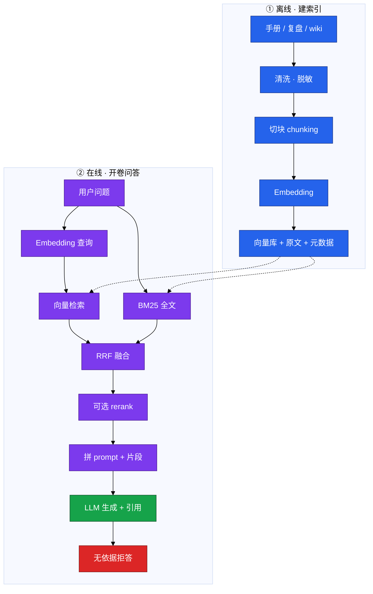
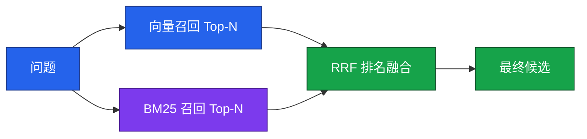
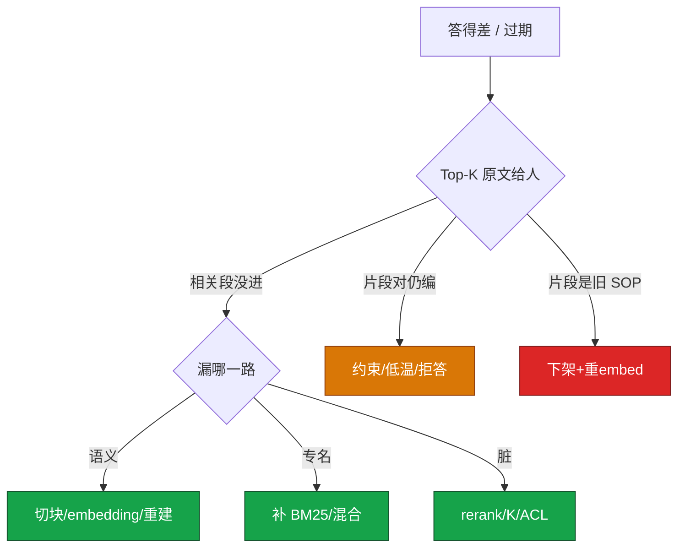

# 03｜RAG 检索增强

> **加分项定位**：RAG 是 SRE 让 LLM「开卷答运维题」的标准解法——考你会不会 chunk→embed→retrieve→generate，混合检索和评测，而不是闭卷硬聊。  
> **红线**：生产数据、密钥、玩家 UID 不进库；RAG 输出是草稿，kubectl apply 必须人审；过期 SOP 要下架，否则开卷考的是过期卷。

---

## 面试怎么考

| 频率 | 典型问法 | 30 秒要点 | 2 分钟要点 |
|:----:|----------|-----------|------------|
| ★★★★★ | RAG 是什么？和微调怎么选？ | 先检索片段再生成；改事实用 RAG，改口吻才微调 | 离线建索引 + 在线检索生成；可追溯、可更新；微调慢、黑盒；约九成「懂业务」用 RAG |
| ★★★★★ | RAG 链路怎么画？ | chunk→embedding→向量库；问→混合检索→Top-K→LLM | 离线清洗切块 embed 入库；在线 embed 查询、向量+BM25、RRF 融合、可选 rerank、拼 prompt 生成 |
| ★★★★ | 为什么运维要混合检索？ | 专名多：向量懂语义，BM25 抓工单号/错误码 | 「内存爆了」≈ OOM 靠向量；`INC-044`、`Xid` 靠 BM25；RRF 融合两路排名 |
| ★★★★ | 切块怎么切？ | 按结构切 H2/H3；overlap 10~20%；别把 SOP 步骤拆开 | 固定长度易从「不要重启」中间切断；表格/kubectl 示例整块保留；元数据带来源/时间/权限 |
| ★★★★ | 答得差怎么排？ | 先摊开 Top-K 原文：检索差还是生成加戏 | 相关段没进→改切块/混合/rerank；片段对仍编→约束 prompt/低温/拒答；旧 SOP→重 embed 下架 |
| ★★★ | 向量库怎么选？ | 有 ES 先做混合；量大再上 Qdrant/Milvus | pgvector 少组件；HNSW 吃内存；100 万×1536×4B≈6GB；换 embedding 整库重建 |
| ★★★ | 怎么评测 RAG？ | 检索命中 + 生成忠实度 + 端到端延迟 | 50~100 条真实值班问题；拒答率不是越低越好；RAGAS/人工抽检 |

---

## SRE 边界

| 该用 | 禁止 |
|------|------|
| 手册、复盘、SOP、wiki 做 **只读** 知识库 | 密钥、玩家数据、完整内网拓扑进库 |
| 混合检索 + 低分 **拒答** | 相似度低硬答「显得智能」 |
| 答案带 **citation**（文档名+章节） | RAG 接写工具自动 kubectl apply |
| 按身份 **ACL** 过滤可检索子集 | 全公司 Confluence 无过滤灌进库 |
| 文档更新后 **24h 内** 重 embed | 只改 markdown 不重 embed |
| 告警旁挂「相似案例」卡片（只读引用） | 把 RAG 吹成能替值班签字变更 |

---

## 原理讲透

### 3.1 全链路：chunk → embedding → retrieve → generate

**一句话**：闭卷靠记忆会幻觉；开卷先找块再生成——检索错了，后面模型再强也是错答。



**白话**：

1. **离线**：文档不是整篇 embed，而是切成块；每块单独向量化，带元数据（路径、章节、更新时间、ACL）。
2. **在线**：问题也 embed，去向量库找语义近邻；同时 BM25 抓专名；两路融合后进 prompt。
3. **生成**：LLM 只基于桌上片段写答案；片段里没有的必须拒答，不能闭卷发挥。

三个角色别混：

| 角色 | 干什么 | 不是什么 |
|------|--------|----------|
| Embedding 模型 | 文本→固定长度向量 | 对话模型（GPT/Qwen 不负责 embed） |
| 向量库 | 存向量+原文；ANN 近邻 | 自动执行变更 |
| 生成 LLM | 基于片段写答案 | 保证不幻觉（仍会加戏，要约束） |

> **记住**：图上没有箭头从「模型闭卷记忆」指向 SOP 数字——数字必须来自库里的块。

---

### 3.2 切块 chunking

**一句话**：检索命中的是 **块** 不是整篇文档；切坏了，向量语义对、内容却缺半句。


**案例**：复盘写「先看 limit，再查泄漏，**不要重启有状态服**」。固定 500 token 从「不要」中间切断，检索只拿到上半，模型就会建议重启。

| 策略 | 适用 | 注意 |
|------|------|------|
| 结构切（H2/H3/SOP 步骤） | 运维手册、Runbook | 「先 cordon 再 drain」不要拆开 |
| overlap 10~20% | 所有生产切块 | 0 overlap 则边界句只在一边 |
| 固定长度 | 快速原型 | 易切断命令/表格 |
| 语义切 | 长文、质量优先 | 成本高，难运维 |

每块元数据必备：`source_path`、`section`、`updated_at`、`acl_tag`。

**优化顺序**：切块 → 混合检索 → rerank → 换 embedding → 换大模型。很多「模型不行」其实是块切烂了。

---

### 3.3 Embedding 与向量库

**一句话**：Embedding 只出向量；换模型必须整库重建——新旧向量不能混比。

```
「服务器内存爆了」 → [0.12, -0.8, ...]
「OOM 被杀」       → [0.11, -0.79, ...]   ← 余弦近，能召回
「今天天气不错」    → [0.9,  0.2, ...]    ← 远
```

| Embedding 选型 | 说明 |
|----------------|------|
| BGE / m3e | 中文运维文档常用 |
| bge-m3 | 中英混用 |
| text-embedding-3 | 云 API，按 token 计费 |
| 用 GPT 做向量 | ✗ 不对口，且贵 |

**向量库选型**：

| 方案 | 适合 |
|------|------|
| FAISS / Chroma | 原型、单机 |
| pgvector | 已有 PostgreSQL、少组件 |
| ES / OpenSearch | **已有日志栈、要混合检索** |
| Qdrant | 中小生产 |
| Milvus / 云托管 | 大规模 |

**容量粗算**：

```
向量数 × 维度 × 4 字节(float32) = 原始大小
100 万 × 1536 × 4B ≈ 6GB（HNSW 索引还要加内存）
```

ANN 算法：HNSW（快、准、吃内存）；IVF+PQ（省内存、精度略降）。已有 ES 时 **不必** 为了「专业向量库」再运维一套——先 ES 加向量字段做混合。

---

### 3.4 混合检索与 RRF

**一句话**：运维专名多，**默认混合**；只走向量会漏工单号，只走 BM25 会漏同义词。



| 路 | 擅长 | 运维例子 |
|----|------|----------|
| 向量 | 语义：「内存爆了」≈ OOMKilled | 口语化值班提问 |
| BM25 | 字面：errno、Pod 名、工单号 `INC-044` | 错误码、GPU `Xid` |

**RRF（Reciprocal Rank Fusion）**：把两路 **排名** 转分数再加，不必分数同量纲。也可加权融合。

**K 值经验**：

| 阶段 | 条数 | 说明 |
|------|------|------|
| 宽召回 | 20~50 | 求别漏 |
| 进 prompt | 3~5 | 求别脏、别稀释窗口 |
| 低于阈值 | 0 | **直接拒答** |

---

### 3.5 Rerank 与生成约束

**一句话**：召回求宽，rerank 求准；开了卷模型仍会编——要低温 + 引用 + 拒答。


rerank 没开：Top-5 里可能混进另一条业务线的 OOM。开了：支付 SOP 不该出现在战斗服问答——若出现，是 **ACL 过滤** 问题，不是 rerank 的锅。

**生成约束**（写法细节见 [02 Prompt 工程](../02-Prompt工程/)）：

```
只基于下列资料回答。
资料没有的，说「知识库中未找到」，不要编。
每条结论标注来源（文档名 + 章节）。
```

| 手段 | 作用 |
|------|------|
| temperature 0~0.2 | 减采样发散 |
| 强制 citation | 值班可核对 |
| 低分拒答 | 弱相关不硬聊 |
| 返回引用片段 | 人可对照源文档 |

> **记住**：RAG 降低幻觉，不消灭幻觉。按 RAG 步骤去 kubectl apply 之前，人要打开源文档。

---

### 3.6 RAG vs 微调 · 评测 · LangChain 一句

**一句话**：改事实用 RAG；改说话腔才微调；LangChain 只是把上述链路组件化编排，不是魔法。

| 维度 | RAG | 微调 |
|------|-----|------|
| 注入知识 | 改文档即生效 | 重训、等实验 |
| 更新速度 | 近实时（改库+重 embed） | 慢 |
| 可追溯 | 能 cite 片段 | 黑盒 |
| 成本 | 切块+embed+检索 | GPU+数据+评测 |
| 适合 | 事实、SOP、案例 | 口吻、固定格式 |

**LangChain 一句**：LangChain/LlamaIndex 等框架把 DocumentLoader、TextSplitter、VectorStore、Retriever、Chain 串成 pipeline——**原理不变**，仍是 chunk→embed→retrieve→generate；框架帮你少写胶水，不替你做切块和 ACL。

**评测三层**（基线 **50~100** 条真实值班问题）：

| 层 | 指标 | 说明 |
|----|------|------|
| 检索 | 相关文档进 Top-K 吗 | 人看原文能不能答 |
| 生成 | 忠实度、相关性、该拒否拒 | 每句能否在片段找到依据 |
| 工程 | P99 延迟、成本、采纳率 | embed/检索/rerank/生成拆开看 |

拒答率 **不是越低越好**——库没有的问题硬答就是幻觉。

**延迟拆开**：embed 查询 → 向量检索 → rerank → LLM 生成。P99 高先看哪一段，不要先换大模型。

**RAG 排障决策树**（答得差时口述这张就够）：



| 现象 | 先做 | 别做 |
|------|------|------|
| 相关段没进 Top-K | 改切块、混合、rerank | 先换大模型 |
| 片段对但答非所问 | 约束 prompt、减 K | 再灌脏片段 |
| wiki 已改仍答旧数 | 重切块重 embed | 只改对象存储 |
| 支付 SOP 进普通会话 | ACL 事件 | 当 rerank 的锅 |
| rerank 5xx | 降级融合 Top-K | 整接口跟着挂 |

**生产参数速查**：

| 参数 | 推荐值 | 改错后果 |
|------|--------|----------|
| 切块 | 按 H2/H3 结构 | 固定 500 从「不要」切断 |
| overlap | 10~20% | 0 则边界句丢失 |
| 宽召回 | 20~50 | 太小漏、太大脏 |
| 进 prompt | 3~5 | 太大稀释窗口 |
| 相似度阈值 | 低于则拒答 | 弱相关硬聊 |
| rerank | 有评测再加 | 第一期非必选 |
| 文档更新 | 24h 内向量跟上 | bot 答旧阈值 |

---

## 落地场景

### 场景 1：战斗服 OOM「上次怎么收的」

**背景**：值班在告警卡片旁追问「game/gw-1 OOM 上次怎么收的」，闭卷 LLM 编了一套从没发生过的步骤。

**做法**：

1. 知识库收录脱敏复盘，按 H2 结构切，overlap 15%，元数据带 `updated_at`。
2. 在线混合检索：向量抓「内存打满/OOM」，BM25 抓 `gw-1`、`OOMKilled`。
3. rerank 取 Top-3 进 prompt；生成带 citation；无相关块则拒答并建议查 Grafana。
4. 输出标注 **草稿**；执行步骤人打开源文档核对，不自动变更。

**指标**：Top-5 检索命中 >85%；忠实度抽检无依据句 <5%；文档更新 24h 内向量跟上。

### 场景 2：限号阈值改了 bot 仍答旧数

**背景**：活动前策划改限号规则，wiki 已更新，RAG bot 仍引用三个月前合服文档里的旧阈值。

**根因链**：

1. 只改了 Confluence，**没重 embed** → 检索仍是旧语义。
2. 作废合服页 **没删向量** → 开卷考过期卷。
3. 没展示 `updated_at` → 值班无法判断时效。

**修复**：下架/标废弃 → 删向量 → 重切块 embed → 回答展示更新时间 → 该问题进评测集回归。

### 场景 3：告警旁挂「相似案例」卡片

**背景**：P1 告警进 Tier-1，值班不想开第二个聊天窗口搜复盘。

**做法**：

1. 告警 JSON 脱敏后作为检索 query（alert_name + 关键 label）。
2. 混合检索 Top-3 复盘片段，卡片展示 citation + 只读建议步骤。
3. 无命中则显示「暂无相似案例」，不硬答。
4. 点击「展开全文」链到源 wiki（权限校验），不在卡片里灌整篇。

**和纯聊天 bot 的区别**：卡片是 **被动推送**，命中率高、采纳率高；完整 bot 适合自由追问。两者知识库共用，ACL 一致。

**指标**：卡片点击率、有帮助率；每周抽 10 条看 citation 是否指向正确复盘。

---

## 口述模板

### 【30 秒】

「RAG 就是先检索相关片段再让 LLM 生成，适合把 SOP、复盘、wiki 注入助手。链路是 chunk、embedding、混合检索、可选 rerank、拼 prompt 生成。运维默认向量加 BM25，专名靠 BM25。答得差先摊开 Top-K 看是检索还是生成问题。生产数据不出域，输出是草稿，变更必须人审，过期文档要下架重 embed。」

### 【2 分钟】

「离线侧清洗脱敏、按结构切块带 overlap 和元数据、embed 进向量库。在线侧问题 embed，向量语义检索加 BM25 专名检索，RRF 融合，宽召回 20 到 50 条，rerank 后进模型 3 到 5 条，低分拒答。生成要低温、强制引用、资料没有就拒答。和微调比，改事实用 RAG 因为可追溯、可更新；微调改口吻。向量库有 ES 先做混合，换 embedding 要整库重建。评测分检索命中、生成忠实度、工程延迟三层，50 到 100 条真实问题做基线。LangChain 只是把链路组件化，原理不变。红线是 ACL、脱敏、只读、不自动 apply。」

### 【常见追问】

| 追问 | 答法 |
|------|------|
| 长窗口塞整本 wiki 行不行？ | 不行：贵、慢、中间稀释；不是穷人 RAG |
| 只用向量检索够吗？ | 不够：工单号、错误码要 BM25 |
| 切块和换模型哪个优先？ | 切块往往是第一刀 |
| rerank 必须上吗？ | 有评测再说；第一期可 Top-5 直接进 LLM |
| RAG 能自动修故障吗？ | 不能：只读建议；执行走人审 |
| 拒答率高怎么办？ | 分两类：库真没有→正常；该有却没有→查检索 |

---

## 必会 · 常考

### 对错表

| 说法 | 对错 | 纠正 |
|------|:----:|------|
| 注入业务知识应该先微调 | ✗ | 改事实用 RAG |
| 微调了就不会幻觉 | ✗ | 仍会编，且黑盒 |
| 长窗口塞 wiki = 穷人 RAG | ✗ | 贵、慢、更新要重贴 |
| 切块不如换大模型值钱 | ✗ | 切块往往是第一刀 |
| 「先 cordon 再 drain」可以拆开切 | ✗ | 步骤拆开会召回半套 |
| 运维只用向量检索就够 | ✗ | 专名要 BM25；默认混合 |
| 召回 5 条再 rerank 50 | ✗ | 宽召回 20~50，进模型 3~5 |
| 相似度低也要硬答 | ✗ | 低分拒答 |
| Embedding 和对话模型是同一个 | ✗ | embedding 只出向量 |
| 换 embedding 可混旧向量 | ✗ | 整库重建 |
| 只改 markdown 检索就会变 | ✗ | 必须重 embed |
| 删文档不删向量 | ✗ | 会召回作废 SOP |
| 拒答率越低越好 | ✗ | 该拒拒、该答答 |
| 已有 ES 必须上 Milvus | ✗ | 先用 ES 混合 |
| RAG 可以接写工具自动修 | ✗ | 只读；变更人审 |
| 全公司 wiki 无过滤灌库 | ✗ | 垃圾进垃圾出；ACL |

### 易混

| A | B | 区分 |
|---|---|------|
| 检索差 | 生成加戏 | 前者 Top-K 缺段；后者片段对仍编 |
| 向量检索 | BM25 | 语义 vs 字面专名 |
| 召回 | rerank | 宽 vs 准；20~50 vs 3~5 |
| RAG | 微调 | 事实 vs 口吻 |
| RAG | 长窗口 | 可更新 cite vs 贵且稀释 |
| Embedding 模型 | 对话 LLM | 只出向量 vs 生成文本 |
| HNSW | Flat | ANN 快 vs 暴力准 |

### 数字

| 项 | 值 |
|----|-----|
| overlap | **10~20%** |
| 宽召回 | **20~50** |
| 进 prompt Top-K | **3~5** |
| 评测基线 | **50~100** 条 |
| 100 万×1536 向量 | ≈ **6GB** float32 |
| 文档更新向量跟进 | **24h** 内 |
| 生成 temperature | **0~0.2** |

---

## 合上书，问自己

1. RAG 离线到在线怎么画？chunk→embed→retrieve→generate 各干什么？
2. 为什么运维默认混合检索？RRF 解决什么问题？
3. 切块太大/太小各会怎样？结构切 + overlap 怎么做？
4. 答得差怎么分检索差、生成加戏、过期卷三种？
5. 换 embedding、改文档、删文档各要做什么？
6. RAG 四条红线（ACL、脱敏、只读、人审）你怎么口述？

---

**本章不讲**：Prompt 约束写法 → [02](../02-Prompt工程/)；工具调监控 → [04 FC](../04-Function-Calling与Tool-Use/)；标准插头 → [05 MCP](../05-MCP协议/)；Agent 多步 → [06](../06-Agent智能体/)。
