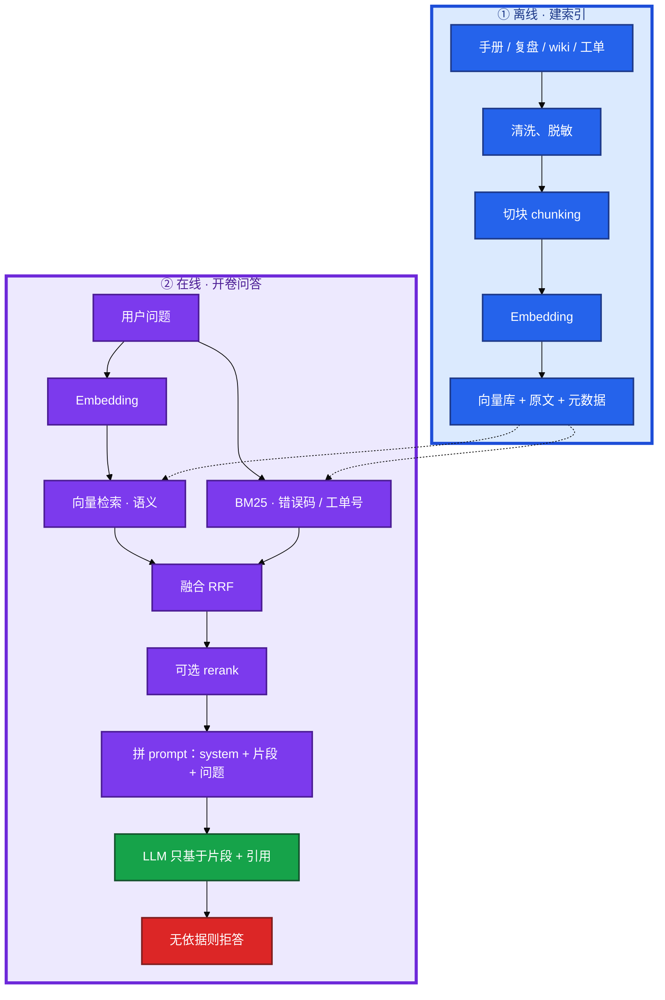
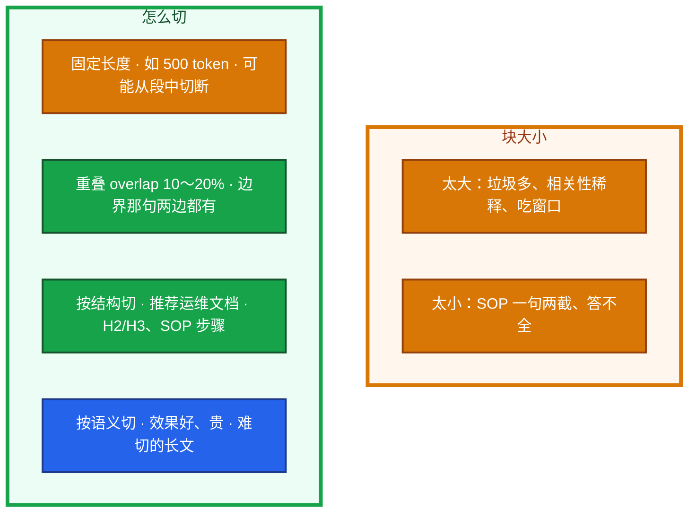
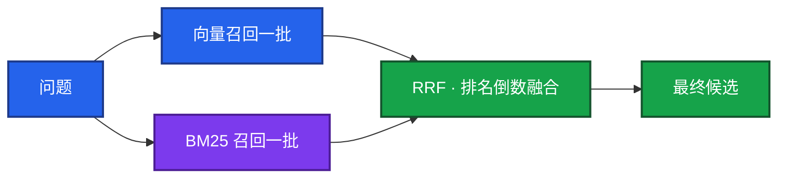
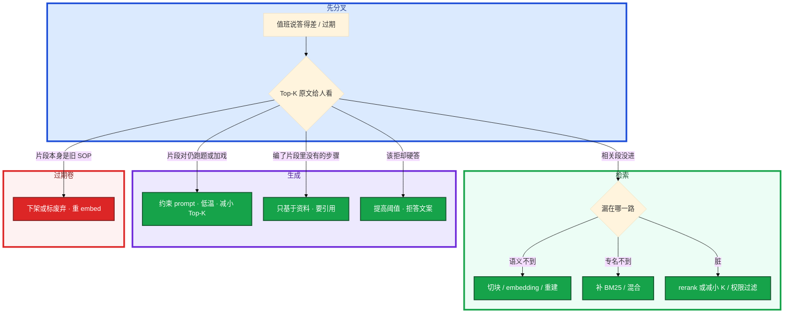

# RAG 检索增强


活动高峰，模型把三个月前已作废的合服步骤讲得像现行 SOP。值班问「战斗服 OOM 上次怎么收的」，它闭卷编了一套从没发生过的案例。

先别动手。这一章后半全是你会落地的：**怎么切块、怎么混合检索、怎么 rerank、怎么拒答、过期页怎么下架。** 前面的概念，是为了让你动手时不把「换大模型」当成第一刀。

**读完你能：** 画出离线建索引到在线开卷；答得差分清检索还是生成；运维默认混合检索；权限、时效、脱敏、只读试点说得清。

## 本章目录

缩进 = 上下级。3 下面才是 3.1。

想钉在**正文左边**跟着滚：菜单 **查看 → 打开视图 → 大纲**。Markdown 预览做不到独立左栏，目录只能写在文章开头。

- [1. 基本概念](#1-基本概念)
- [2. 架构图](#2-架构图)
- [3. 原理](#3-原理)
  - [3.1 切块](#31-切块chunking成败关键)
  - [3.2 召回](#32-召回向量--bm25--rrf)
  - [3.3 重排](#33-重排宽召回再精排)
  - [3.4 Embedding](#34-embedding-与相似度)
- [4. 落地选型](#4-落地选型)
  - [4.1 RAG vs 微调](#41-为什么是-rag-不是微调)
  - [4.2 向量库](#42-向量库怎么选)
- [5. 核心配置](#5-核心配置)
- [6. 常用做法](#6-常用做法)
- [7. 常用操作](#7-常用操作)
  - [7.1 生成约束](#71-生成约束开了卷仍会编)
  - [7.2 更新与下架](#72-文档更新与下架)
  - [7.3 评测](#73-评测怎么证明有用)
  - [7.4 知识库红线](#74-运维知识库红线)
- [8. 生产排障](#8-生产排障)
- [9. 必会 · 常考](#9-必会--常考)
- [合上书](#合上书问自己)

**本章不讲：** 窗口塞不下、幻觉机制 → [01](../01-LLM与Transformer基础/)；拼进 prompt 的约束写法 → [02](../02-Prompt工程/)；检索后还要调监控接口 → [04](../04-Function-Calling与Tool-Use/)；Agent 长期记忆 → [06](../06-Agent智能体/)；本地 Ollama 试 embedding → [08](../08-GPU与推理服务运维/)；告警旁挂相似案例 → [09 AIOps](../09-AIOps落地/)。不训模型、不微调行为风格。切块、embedding、向量库、检索和生成约束都在本章。

---

## 1. 基本概念

RAG（Retrieval-Augmented Generation）= **先把相关片段找出来，再让 LLM 照着答**。私有手册、复盘、wiki、工单，模型权重里没有，也不该靠微调每周重训。改文档即生效、能引用、比微调便宜，这是运维落地最高频的一条路。

一句话：闭卷靠记忆会幻觉；开卷先找资料。检索错了，后面的模型再强也是错答。**切块质量往往比换大模型更值钱。**

| 在 RAG 里 | 不在 RAG 里 |
|-----------|-------------|
| 切块后的原文 + 向量 + 元数据（来源/章节/时间/权限） | 模型权重里的「我们业务」 |
| 向量语义近邻 + BM25 专名 | 「整篇文档的灵魂」——命中的是块 |
| 生成时桌上的 Top-K 片段 | 自动 kubectl apply；知识库是只读的 |

三个角色不要混：

| 角色 | 干什么 |
|------|--------|
| **Embedding 模型** | 文本 → 固定长度向量。BGE / m3e / text-embedding-3。不是对话模型 |
| **向量库 / 检索引擎** | 存向量 + 原文；ANN 近邻；常和 BM25 共存 |
| **生成 LLM** | 只基于片段写答案；仍会无视材料发挥 |

> **记住**：生产数据、密钥、玩家 UID、内网 IP 不进库。答案是草稿，执行变更仍要人审。过期页要下架，否则开卷考的是过期卷。不要把 RAG 吹成能替值班——它缩小查找范围，不签字、不变更。

活动前夜：策划改了限号规则，wiki 更新了，模型还在背旧阈值。没有 RAG，你得等下次训模型；有 RAG，改库、重建该文档的向量，值班立刻问到新规则。前提是 **过期页要下架**。

---

## 2. 架构图

先把整条链路钉住。后面切块、召回、rerank、排障都对着这张图说话。



图上三条线：

1. **没有箭头从闭卷记忆指向 SOP 数字。** 数字来自库里的块。
2. **召回求别漏，rerank 求别脏，生成求别加戏。** 三步坏了症状不一样。
3. **相似度低于阈值直接拒答**，不要用一堆弱相关片段硬聊。

告警摘要那 80 条可以塞窗口；半年复盘不能。值班下一句「上次怎么收」该上场的是这条链路，不是把窗口当硬盘（01）。

---

## 3. 原理

原理只保留动手和面试会用到的：块怎么切、两路怎么召回、何时 rerank、换 embedding 为什么要重建。

**本节 4 块：** 3.1 切块 · 3.2 召回 · 3.3 重排 · 3.4 Embedding

### 3.1 切块：chunking 成败关键

用「战斗服 OOM 上次怎么收」走一遍切块。复盘里有一段「先看 limit，再查泄漏，不要重启有状态服」。固定长度 500 token 可能从「不要」中间切断，检索只拿到上半，模型就会建议重启。

每块单独 embedding。检索命中的是块，不是「整篇文档的灵魂」。切坏了，命中的向量语义对、内容却缺半句。



优化顺序：**切块 → 混合检索 → rerank → 再考虑换 embedding / 大模型。** 很多「模型不行」其实是块切烂了。先把检索到的 Top-K **原文摊开给人对**。人对着片段都答不出，就别先换 GPT。人对得上、模型却加戏，那是生成约束的问题（7.1），不是切块。

运维实践：

1. 手册按标题层级切；一条「先 cordon 再 drain」不要拆开。
2. 每块带元数据：来源路径、章节、更新时间、权限标签。
3. 表格、kubectl 示例、回滚步骤尽量不切断。
4. 相邻块留 10～20% overlap。

### 3.2 召回：向量 + BM25 + RRF

值班问的是「OOM」，手册写的是「内存打满」；工单号是 `INC-20260318-044`。只走一路会漏。

| 路 | 优点 | 缺点 | 运维谁靠它 |
|----|------|------|------------|
| **向量** | 懂语义：「内存爆了」≈ OOMKilled | 错误码、Pod 名、工单号、纯数字不敏感 | 同义、口语 |
| **BM25 / 全文** | 字面命中 errno、kubelet、活动 ID | 同义词对不上 | 专名、工单号、`Xid`、`nvidia-smi` |



只向量：搜工单号返回一堆「看起来像故障」的无关复盘；「CrashLoopBackOff」有时不如「镜像 pull 失败」近，专名漏召回。  
只 BM25：问「内存爆了」捞不到标题写着 OOM 的那篇。  
混合：OOM 复盘和工单号都能进 Top-K。

RRF（Reciprocal Rank Fusion）把名次变成分数再加，不必两路分数同量纲。也可以加权。目标是：语义近的和字面命中的都能进最终候选。运维专名多，**默认就该混合**。

卡住先看哪：先把两路的原始命中摊开，看漏在哪一路。已有 Elasticsearch / OpenSearch 时，BM25 本来就在，加上向量字段就能混，不必先上专用向量库。量到亿级、延迟极苛再考虑 Milvus / Qdrant。告警摘要里的错误码、Pod 名，必须能被 BM25 抓住，再拿去检索相似案例。GPU 打满时搜 `Xid`、`nvidia-smi`，同理。

### 3.3 重排：宽召回再精排


召回求「别漏」，rerank 求「别脏」。Top-K 太小漏依据；太大把窗口塞满、注意力稀释、账单涨。运维经验值：召回 **20～50**，进模型 **3～5**。相似度低于阈值 **直接拒答**。

rerank 没开时，第三条可能是另一条业务线的 OOM。开了之后，支付 SOP 不该出现在普通战斗服问答里——若出现，是权限过滤没做，不是 rerank 的锅。

数据少、问题简单时，混合检索 Top-5 可能已经够；有评测再说 rerank 值不值。不要第一天上线就把 rerank 当必选项。第一期只有 500 篇 SOP，可以不上。rerank 模型挂了：降级到融合后的 Top-K 直接进 LLM，并告警。不要让整个问答接口跟着 rerank 一起返回 5xx。

延迟拆开：embed 查询、向量检索、rerank、LLM 生成。P99 高先看哪一段，不要先换大模型。GPU 推理池打满时，生成那段会先爆，检索本身往往还好。

### 3.4 Embedding 与相似度

Embedding 模型把文本映射成固定长度向量，语义近则方向近。它 **不是** 对话模型：BGE、m3e、OpenAI text-embedding-3 这类只出向量；GPT / Qwen 负责生成。中文运维文档要选中文表现好的 embedding，中英混用看多语言模型（如 bge-m3）。不要「用 GPT 做向量省一个模型」。

```
「服务器内存爆了」 → [0.12, -0.8, ...]
「OOM 被杀」       → [0.11, -0.79, ...]   ← 近，能检索到
「今天天气不错」    → [0.9,  0.2, ...]    ← 远
```

常用余弦相似度（cosine）：看方向夹角，文本一般先归一化，归一化后点积 ≈ 余弦。欧氏距离少用于这段文本检索。

换 embedding 模型 = 维度和语义空间都变了，新旧向量不能混比，**整库重建**。提前算时间和钱。同一集合维度必须一致，否则索引直接废或结果无意义。长文本超过 embedding 输入上限：先切块再 embed，不要截断关键句（「不要重启有状态服」没进向量就会召回残句）。建库的 API / GPU 费用要算进项目，不是「免费语义搜索」。本地试 embedding 可以用 Ollama，生产高并发仍是 08 的账。

---

## 4. 落地选型

### 4.1 为什么是 RAG，不是微调

值班要的是事实（SOP、阈值、上次怎么收），不是换一种说话腔。事实变了改文档；腔调变了才谈微调。

| 维度 | RAG | 微调 |
|------|-----|------|
| 注入知识 | 改文档即生效 | 重训、等实验 |
| 更新速度 | 近实时（改库） | 慢 |
| 可追溯 | 能给出来源片段 | 黑盒 |
| 成本 | 切块 + embedding + 检索 | GPU + 数据 + 评测 |
| 幻觉 | 仍可能编，但有据可查 | 仍可能编 |
| 适合 | 事实、SOP、案例 | 改口吻、固定格式、领域腔 |

结论：大约九成「让它懂我们业务」用 RAG。微调只在要改行为/风格、并且真有大量标注时才上。两者可叠加——微调管口吻，RAG 管事实——运维先别急着微调。合服 SOP 每月改，不要先申请 GPU 去做微调。

微调改的是权重，下次请求才可能带上新知识，中间要数据、GPU、评测。RAG 改的是库里的向量和原文，下次检索就能捞到。wiki 改了限号阈值，RAG 答新数（还要确认向量已重建）；微调模型在下次训完之前仍答旧数。闭卷 LLM 两个都没有，只会编。

常见误判：觉得微调了就不会幻觉。权重里的错法加业务细节，照样能编。另一误判：把整本 200 页手册塞进长窗口当「穷人 RAG」。贵、慢、中间段落稀释，更新还要重贴。

### 4.2 向量库怎么选

暴力搜（Flat）最准最慢。生产用 ANN（Approximate Nearest Neighbor）：HNSW 分层图，快、准、吃内存；IVF 先分桶再搜，省一点；IVF+PQ 量化省内存、精度略降。少引入组件是美德。量不大、要混合时，不必为了「专业向量库」再运维一套。已有 ES 时先用 ES 做混合。

| 方案 | 适合 |
|------|------|
| FAISS / Chroma | 原型、单机、量不大 |
| pgvector | 已有 PostgreSQL、中等量、少引入组件 |
| ES / OpenSearch | 要混合检索、已有日志检索栈 |
| Qdrant | 中小生产、运维相对简单 |
| Milvus / 云托管 | 大规模、不想自建索引细节 |
| Redis RediSearch | 已有 Redis、要低延迟、量可控 |

容量粗算：

```
向量数 × 维度 × 4 字节(float32) = 原始大小
100 万 × 1536 × 4B ≈ 6GB，HNSW 索引还要再加一截内存
```

HNSW 常驻内存，容量规划别只报磁盘。成本还包括 embed 的 API/GPU、检索计算。砍：低维模型、PQ、只索引有价值文档、冷热分离、批量 embed。高质量少量优于海量低质。十年工单不要全塞：要脱敏、要权限、要过期策略。全量灌入等于把脏数据和注入面扩大。

监控：检索延迟、召回抽检、内存、写入吞吐。批量写入比一条条 embed 便宜、快。活动前把「限号 / 排队 / 合服」相关页标成热点，检查更新时间和权限。过期页宁可拒答，不要开卷考旧卷。

---

## 5. 核心配置

只动有证据的项。改切块或换混合检索，先在 50～100 条评测集上对比，不要一改就上值班群。

| 参数 | 生产怎么用 | 改错会怎样 |
|------|------------|------------|
| 切块策略 | 按结构切；表格/命令整块 | 固定 500 从「不要」切断 → 建议重启 |
| overlap | **10～20%** | 0 则边界句只在一边 |
| 召回条数 | **20～50** | 太小漏；太大脏 |
| 进模型 Top-K | **3～5** | 太大稀释窗口和注意力 |
| 相似度阈值 | 低于则 **拒答** | 弱相关硬聊 = 幻觉 |
| rerank | 有评测再加；可降级关掉 | 第一天当必选；挂了整接口 5xx |
| embedding | 中文选中文好的；混用 bge-m3 | 换模型不重建 = 召回废 |
| 维度 | 同一集合必须一致 | 混用索引废 |

> **记住**：etcd 不是水平扩展的写存储——RAG 也不是「块切得越多越好」。容量优先少而准、按时重建、过期下架，不是把十年工单灌进去。

---

## 6. 常用做法

| 目的 | 做法 | 看什么 |
|------|------|--------|
| 答得差先定位 | 摊开 Top-K 原文给人 | 人答不出 = 检索；人能答模型加戏 = 生成 |
| 运维检索默认 | 向量 + BM25 + RRF | 工单号和「内存爆了」都能进 |
| 延迟拆开 | embed / 向量 / rerank / 生成 | P99 高先看哪一段 |
| 文档改了 | 重新切块 → 重新 embed → 更新向量 | 只改对象存储不够 |
| 删文档 | 同时删向量 | 否则召回已作废 SOP |
| 挂告警旁 | 相似案例卡片，比单独聊天机器人易用 | 见 09 |

生成必须写死（写法细节在 02）：

```
只基于下列资料回答。
资料没有的，说「知识库中未找到」，不要编。
每条结论标注来源（文档名 + 章节）。
```

拒答文案：「知识库未找到依据，请查某某系统或找 oncall」，并建议人用的只读命令，不编步骤。游戏回档/踢全服类 SOP 尤其不能硬答。

---

## 7. 常用操作

### 7.1 生成约束：开了卷仍会编

检索只是把材料放到桌上，模型仍可能无视材料发挥。片段进了上下文窗口，模型照样可以采样出训练分布里更「像那么回事」的句子。开卷降低幻觉，不消灭幻觉。

配合：temperature 0～0.2；把引用片段一并返回给值班核对；低分拒答。AI 仍然只是草稿；**按 RAG 步骤去 kubectl apply 之前，人要打开源文档。**

游戏 SOP 里若有「删库、回档、踢全服」，RAG 可以引用，执行必须走变更单。知识库是只读的，不要接写工具。GPU 相关 SOP 若写着「删推理 Deployment」，那是给人看的应急项，不是给模型自动执行的。

### 7.2 文档更新与下架

文档更新必须 **重新切块 → 重新 embedding → 更新向量**；只改对象存储里的 markdown，检索仍是旧语义。删除文档要删向量。wiki 改了限号阈值，bot 还在答旧数字 = 向量没重建。已下架的合服步骤仍被捞到 = 删文档没删向量。

时效：过期文档下架或标废弃；元数据带更新时间，回答里展示。文档更新后 **24 小时内**，对应问题是否已换成新阈值——不是「wiki 改了」就算。

### 7.3 评测：怎么证明有用

分三层，不要只报「准确率 95%」这种说不清的数。用值班真实问题当集：告警摘要后追问的那句「上次 OOM 怎么收」、GPU TTFT 升高时「上次推理打满怎么收」。

1. **检索：** 相关文档有没有进 Top-K（命中 / 召回）。
2. **生成：** 忠实度（有没有脱离片段）、相关性（切不切题）、拒答是否发生在该拒的时候。
3. **工程：** 端到端延迟、成本、值班采纳率 / 「有帮助」按钮。

拒答率不是越低越好。知识库没有的问题硬答就是幻觉。该拒拒、该答答，才是目标。工具可用 RAGAS、TruLens，或先人工标 50～100 条问答当基线，改切块前后对照。

你改切块或换混合检索，应先在这 50～100 条上对比 Top-K 命中，再看生成忠实度。忠实度抽检：抽回答，看每句能不能在引用片段里找到依据。找不到就记一次幻觉。检索命中升了、值班仍说「答得飘」，是生成加戏。检索命中没变、生成变好了，才是 prompt 约束生效。

### 7.4 运维知识库红线

数据源：手册、复盘、故障案例、SOP、wiki、工单。  
形态：告警旁「相似案例」；新人问「合服检查单」；oncall 助手给只读步骤。挂在告警摘要卡片旁，比单独做一个聊天机器人更易被值班用到（09）。

1. **权限：** 支付应急 SOP 不能被全员 bot 检索到，按身份过滤能搜的子集。
2. **时效：** 过期下架或标废弃；展示更新时间。
3. **脱敏：** 密钥、玩家数据、完整内网拓扑不进库。生产数据不出域。
4. **只读：** 检索不到就拒答；带来源；先小范围试点；有反馈闭环。
5. **不自动变更：** RAG 给出的 kubectl 是建议，执行走人审。责任在执行的人，设计上让「照幻觉操作」变难。

常见误判：把全公司 Confluence 无过滤灌进库，然后怪模型把测试环境的删除步骤推荐给生产值班。垃圾进、垃圾出。

怎么看线上 RAG 是否在腐烂：

1. 抽 20 个值班真实问题，看 Top-5 片段人能不能据此作答（检索）。再看模型有没有加戏（忠实度）。
2. 文档更新后 24 小时内向量是否已换成新阈值。
3. 延迟拆开四段。
4. 权限审计：一次检索命中了哪些 ACL 标签。支付 SOP 进了普通值班会话就是事件。

---

## 8. 生产排障

三问：相关段落进没进 Top-K？进了模型有没有加戏？库是不是过期卷？

**RAG 答得差 = 先摊开片段，不是立刻换 GPT。** 知识库挂了不该让模型闭卷顶上硬答。



| 现象 | 先做什么 | 不要做什么 |
|------|----------|------------|
| 相关段落没进 Top-K | 改切块、混合检索、rerank | 先换大模型 |
| 片段对但答非所问 | 约束 prompt、低温、减小 K | 再灌更多脏片段 |
| 编片段里没有的步骤 | 只基于资料、拒答、要引用 | 相信「已开 RAG」 |
| wiki 已改仍答旧数 | 重切块重 embed | 只改对象存储 |
| 支付 SOP 进了普通会话 | ACL 事件 | 当 rerank 的锅 |
| 检索 P99 高 | 拆四段；生成先爆看 GPU（08） | 先换 embedding |
| rerank 5xx | 降级到融合 Top-K | 整接口跟着挂 |
| 十年工单灌爆内存 | 冷热分离、PQ、只索引有价值页 | 再加机器硬扛 HNSW |

活动前夜限号阈值改了、bot 仍答旧数。正确处理：确认向量重建 → 抽该问题 Top-5 → 过期页下架。不要让值班按旧阈值限号。

---

## 9. 必会 · 常考

白板和追问高频，能一口回：

| 说法 | 对错 | 口径 |
|------|:----:|------|
| 注入业务知识应该先微调 | 错 | 改事实用 RAG；改口吻才微调 |
| 微调了就不会幻觉 | 错 | 仍会编，还是黑盒 |
| 长窗口塞整本 wiki 就是穷人 RAG | 错 | 贵、慢、中间稀释，更新要重贴 |
| 切块不如换大模型值钱 | 错 | 切块往往是第一刀 |
| 「先 cordon 再 drain」可以拆开切 | 错 | 步骤拆开会召回半套 |
| 运维只用向量检索就够 | 错 | 专名要 BM25；默认混合 |
| 召回 5 条再 rerank 50 | 错 | 宽召回 20～50，进模型 3～5 |
| 相似度低也要硬答显得智能 | 错 | 低分拒答；硬答就是幻觉 |
| Embedding 和对话模型是同一个 | 错 | embedding 只出向量 |
| 换 embedding 可以混着旧向量用 | 错 | 整库重建；维度必须一致 |
| 只改 markdown 检索就会变新 | 错 | 必须重 embed |
| compact 之后……等等，删文档不删向量 | 错 | 会召回作废 SOP |
| 拒答率越低越好 | 错 | 该拒拒、该答答 |
| 已有 ES 必须再上 Milvus | 错 | 先用 ES 做混合 |
| RAG 可以接写工具自动修 | 错 | 只读；变更走人审 |
| 全公司 Confluence 无过滤灌进库 | 错 | 垃圾进、垃圾出；ACL |

数字：overlap **10～20%**；召回 **20～50**；进模型 **3～5**；评测基线 **50～100** 条；100 万 × 1536 × 4B ≈ **6GB**；文档更新 **24h** 内向量跟上。

易混：检索差 vs 生成加戏 vs 过期卷；向量 vs BM25；召回 vs rerank；RAG vs 微调 vs 长窗口；HNSW vs Flat；embedding 模型 vs 对话模型。

---

## 合上书，问自己

1. RAG 从离线到在线怎么画？哪一步最影响效果？
2. 为什么注入知识用 RAG 不是微调？能一起用吗？
3. 切块太大/太小各怎样？结构切 + overlap 怎么做？
4. 为什么运维要混合检索？RRF 是什么？K 怎么定？
5. 换 embedding、改文档、删文档各要做什么？
6. 权限、时效、脱敏、拒答、不自动变更怎么讲？AI 能不能替值班执行 SOP？

六题都能口述，这一章就过了。下一章让模型说出要查什么，由你的代码去查：意图和执行分开。
