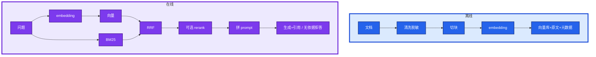
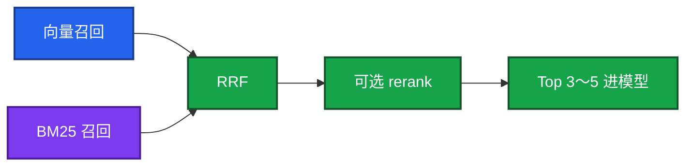

# 03｜RAG 检索增强 · 练习题

先自己画图或口述，再对照解答。每题标了覆盖范围：

| 标记 | 含义 |
|------|------|
| **核心** | 不懂整章就没建立起来 |
| **必会** | 值班和面试都要能讲 |
| **常用** | 线上会反复碰到 |
| **常考** | 白板和追问的高频口径 |

## 本题目录

- [Q1 离线到在线](#q1)
- [Q2 RAG vs 微调](#q2)
- [Q3 答得差分检索/生成](#q3)
- [Q4 混合检索 / RRF](#q4)
- [Q5 评测 / 拒答](#q5)
- [Q6 权限时效脱敏](#q6)
- [Q7 Embedding](#q7)
- [Q8 向量库选型](#q8)
- [Q9 文档更新仍旧](#q9)
- [Q10 容量与工单](#q10)
- [Q11 不上 rerank](#q11)
- [Q12 有片段仍要拒答](#q12)
- [合上书](#合上书)

---

## Q1

**★★★★★｜把 RAG 从离线到在线画出来。哪一步最影响效果？**

**覆盖**：核心 · 必会 · 常考

### 场景

「你们内部问答是怎么做的？」有人开始背微调。值班下一句是「战斗服 OOM 上次怎么收的」。

### 完整解答

离线建索引，在线开卷答题。本质是闭卷改开卷。检索错了，后面的模型再强也是错答。

生产数据、密钥不进库。答案是草稿，执行变更仍要人审。不要把 RAG 吹成能替值班执行 SOP。

### 再追问

哪一步最影响效果？——切块。太大稀释、太小碎语义。很多「模型不行」其实是块切烂了。先摊开 Top-K 原文给人对。优化顺序：切块 → 混合检索 → rerank → 再换 embedding / 大模型。

---

## Q2

**★★★★★｜为什么注入业务知识用 RAG 而不是微调？**

**覆盖**：核心 · 必会 · 常考

### 场景

合服 SOP 每月改。有人申请 GPU 去做微调。另有人要把 200 页手册塞进 1M 窗口当「穷人 RAG」。

### 完整解答

RAG 改文档即生效、能引用、成本低、有据可查。微调要重训、更新慢、黑盒、贵、仍会幻觉。改事实用 RAG；改口吻/格式且有大量标注才微调。运维九成场景 RAG 够。

长窗口塞整本 wiki：贵、慢、中间稀释，更新要重贴，不能替代知识库。80 条告警可以塞窗口；半年复盘不能。

### 再追问

能一起用吗？——能：微调管风格，RAG 管事实。先上 RAG，微调的投入产出通常不划算。微调了就不会幻觉？——会。

---

## Q3

**★★★★★｜RAG 答得差，怎么分检索问题和生成问题？切块怎么改？**

**覆盖**：核心 · 必会 · 常用

### 场景

值班问 OOM 处理，系统答了过期的「重启节点」步骤。复盘里「不要重启有状态服」被 500 token 从「不要」切断。

### 完整解答

先把检索到的片段拿出来看。

| 现象 | 定位 | 处理 |
|------|------|------|
| 相关段落根本没进 Top-K | 检索 | 改切块、换 embedding、混合检索、rerank |
| 片段对但答非所问 | 生成 | 约束 prompt、低温、减小 Top-K |
| 编片段里没有的步骤 | 约束不足 | 只基于资料、拒答、要引用 |
| 该拒却硬答 | 阈值 | 低相似度直接拒 |
| 片段本身是旧 SOP | 过期卷 | 下架或标废弃，并 **重 embed** |

切块：按 Markdown 标题/SOP 步骤切；10～20% overlap；表格和命令不切断；元数据带来源和时间。别把「先 cordon 再 drain」拆开。人对着片段都答不出，就别先换 GPT。人对得上、模型加戏，才是生成约束。

### 再追问

只改文件存储够吗？——不够。过期 SOP 必须下架并重 embed。

---

## Q4

**★★★★★｜为什么运维要用混合检索？RRF 是什么？K 怎么定？**

**覆盖**：核心 · 必会 · 常考

### 场景

「内存爆了」能搜到 OOM，但工单号和 errno 经常搜不到。只向量时搜 `INC-20260318-044` 返回一堆像故障的无关复盘。GPU 现场要搜 `Xid`。

### 完整解答

向量懂语义，对专名、错误码、ID 弱。BM25 精确，不懂同义。运维文档专名多，两路都要。RRF（Reciprocal Rank Fusion）用两路排名的倒数融合，不必对齐分数量纲。

已有 ES 时先用 ES 做混合，不必急着上专用向量库。告警里的错误码、Pod 名必须能被 BM25 抓住。

召回太小漏依据，太大稀释窗口。经验：召回 **20～50**，进模型 **3～5**。低于阈值拒答。

### 再追问

只向量漏什么？只 BM25 漏什么？——只向量漏工单号/errno；只 BM25 漏「内存打满」对不上 OOM。

---

## Q5

**★★★★☆｜怎么评测 RAG？拒答率是不是越低越好？**

**覆盖**：必会 · 常用

### 场景

产品只报「准确率 95%」，值班说经常瞎编。改了切块就直接上值班群。

### 完整解答

三层：检索命中/召回；生成忠实度、相关性、该拒时是否拒；工程延迟、成本、采纳率。用 RAGAS 或人工 50～100 条 QA 做改切块前后对照。先对比 Top-K 命中，再看忠实度。不要一改就上值班群。

拒答率不是越低越好。库里没有的硬答就是幻觉。要的是该拒拒、该答答。忠实度抽检：每句能不能在引用片段里找到依据。检索命中升了仍「答得飘」= 生成加戏。

### 再追问

延迟怎么拆？——embed 查询、向量检索、rerank、LLM 生成。P99 高先看哪一段。GPU 池打满时生成先爆。

---

## Q6

**★★★★☆｜给运维搭知识库，权限、时效、脱敏怎么做？**

**覆盖**：必会 · 常用 · 常考

### 场景

把全公司 Confluence 灌进 bot。支付应急步骤被普通值班搜到；三个月前的删库演练被当成现行。

### 完整解答

权限：按身份过滤可检索子集，支付 SOP 不是全员可见。进了普通会话就是事件，不是 rerank 的锅。  
时效：过期下架，展示更新时间；更新后 24h 内向量跟上。  
脱敏：密钥、玩家数据、完整拓扑不进库。  
上线：检索不到就拒答、带来源、小范围试点、反馈按钮。只读，不接写工具。变更步骤标人审，不自动执行。责任在执行的人。

垃圾进、垃圾出。活动前把限号/排队/合服页标热点，检查更新时间和 ACL。

### 再追问

怎么防止照着错误步骤误操作？——时效治理 + 必须带来源 + 变更标人审 + 不自动执行。RAG 不能替值班 apply。

---

## Q7

**★★★★☆｜Embedding 是什么？和对话模型是一个东西吗？**

**覆盖**：必会 · 常用 · 常考

### 场景

「我们用 GPT 做向量吧，省一个模型。」中英混用的手册召回很差。有人换了 embedding 没重建。

### 完整解答

Embedding 把文本变成固定长度向量，语义近则方向近，所以「内存爆了」能靠近「OOM」。对话模型负责生成。RAG 里两者配合：embedding 建库和检索，LLM 基于片段生成。中文选中文效果好的 embedding（BGE / m3e 等）；中英混用看多语言模型（如 bge-m3）。

相似度常用余弦；文本先归一化，归一化后点积 ≈ 余弦。欧氏距离少用于这段。长文本先切块再 embed，不要截断关键句。

换 embedding 模型 = 整库重建。维度和语义空间都变了，新旧向量不能混比。要评估全量 embed 的时间和钱。同一集合维度必须一致。本地试可用 Ollama，生产高并发是 08。

### 再追问

召回突然变差常见原因？——换 embedding 没重建，或混了两种维度。

---

## Q8

**★★★★☆｜向量库怎么选？已经有 ES 还要不要 Milvus？HNSW 呢？**

**覆盖**：必会 · 常用

### 场景

原型 2 万条手册；生产已有 OpenSearch 存日志和 wiki。有人要为「专业」再运维一套 Milvus。

### 完整解答

原型：FAISS / Chroma。有 PG：pgvector。要混合检索且已有 ES：直接用。大规模再 Milvus / Qdrant / 云托管。已有 Redis 且量不大：RediSearch。少引入组件是美德。量不大、要混合时，不必为专业向量库再运维一套。

Flat 最准最慢。HNSW 是 ANN，快、准、吃内存。内存紧用 IVF+PQ，精度略降。容量：向量数 × 维度 × 4B，100 万 × 1536 ≈ 6GB，再加索引。容量规划别只报磁盘。

### 再追问

监控看什么？——检索延迟、召回抽检、内存、写入吞吐。批量写入比一条条 embed 便宜。

---

## Q9

**★★★★☆｜文档改了，检索仍是旧内容，为什么？**

**覆盖**：必会 · 常用 · 常考

### 场景

wiki 已改限号阈值，bot 还在答旧数字。已下架的合服步骤仍被捞到。

### 完整解答

库里是旧 embedding。必须重新切块、重新 embedding、更新向量；删除页要删向量。只改对象存储不够。「wiki 改了」不算完成，看 24h 内对应问题是否已换成新阈值。

### 再追问

维度混用会怎样？——同一集合维度必须一致，否则索引直接废或结果无意义。

---

## Q10

**★★★☆☆｜向量库容量和成本怎么估、怎么砍？工单要不要全量进？**

**覆盖**：常用

### 场景

要把十年工单全塞进去。内存按磁盘报了个盘符。

### 完整解答

原始大小 ≈ 条数 × 维度 × 4B，HNSW 再加内存。成本还包括 embed 的 API/GPU、常驻内存、检索计算。砍：低维模型、PQ、只索引有价值文档、冷热分离、批量 embed。高质量少量优于海量低质。

工单要脱敏、要权限、要过期策略。全量灌入等于把脏数据和注入面扩大。

### 再追问

HNSW 容量只报磁盘行吗？——不行。常驻内存再加一截。

---

## Q11

**★★★☆☆｜两阶段检索不上 rerank 可以吗？rerank 挂了怎么办？**

**覆盖**：必会 · 常用

### 场景

第一期只有 500 篇 SOP。有人第一天就要交叉编码器「架构完整」。

### 完整解答

可以不上。数据少时混合检索 Top-5 可能够。有评测再证明 rerank 提升命中，再加交叉编码器（更准更贵更慢）。不要为架构完整第一天上两阶段。

rerank 挂了：降级到融合后的 Top-K 直接进 LLM，并告警。不要让整个问答接口跟着 rerank 一起返回 5xx。支付 SOP 出现在战斗服问答里是权限过滤没做，不是 rerank 的锅。

### 再追问

召回 50 再 rerank 5，和召回 5 再 rerank 50？——宽召回 20～50，进模型 3～5。反了。

---

## Q12

**★★★☆☆｜生成阶段已经给了片段，为什么还要拒答？**

**覆盖**：核心 · 必会

### 场景

相似度都很低，模型仍「根据经验」写了回滚步骤。游戏回档/踢全服 SOP 被硬答出来。有人按 RAG 步骤要 kubectl apply。

### 完整解答

检索只是把材料放到桌上，模型仍会无视材料发挥。开卷降低幻觉，不消灭幻觉。低分拒答、低温、强制引用、人核对原文。拒答文案：「知识库未找到依据，请查某某系统或找 oncall」，并建议只读命令，不编步骤。

游戏回档/踢全服/删库类尤其不能硬答。RAG 可以引用，执行走变更单。知识库只读，不接写工具。「删推理 Deployment」是给人看的应急项，不是给模型自动执行的。按 RAG 步骤 apply 之前，人要打开源文档。AI 不能替值班。

### 再追问

temperature 怎么配？——0～0.2；引用片段一并返回给值班核对。

---

## 合上书

- [ ] 能画出离线切块入库、在线混合检索再生成+拒答
- [ ] 能说明改事实用 RAG、改口吻才微调；长窗口不替代知识库
- [ ] 能用 Top-K 原文区分检索差 / 生成加戏 / 过期卷；会按结构切 + overlap
- [ ] 能讲清向量 vs BM25、RRF、召回 20～50 / 进模型 3～5
- [ ] 能三层评测，并说拒答率不是越低越好
- [ ] 能落地权限、时效、脱敏、只读试点；支付 SOP 进普通会话是事件
- [ ] 能说出换 embedding = 重建；改/删文档必须动向量；HNSW 吃内存
- [ ] 能决定何时不上 rerank、挂了如何降级；有片段仍拒答、不自动 apply
