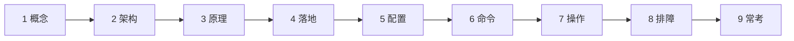
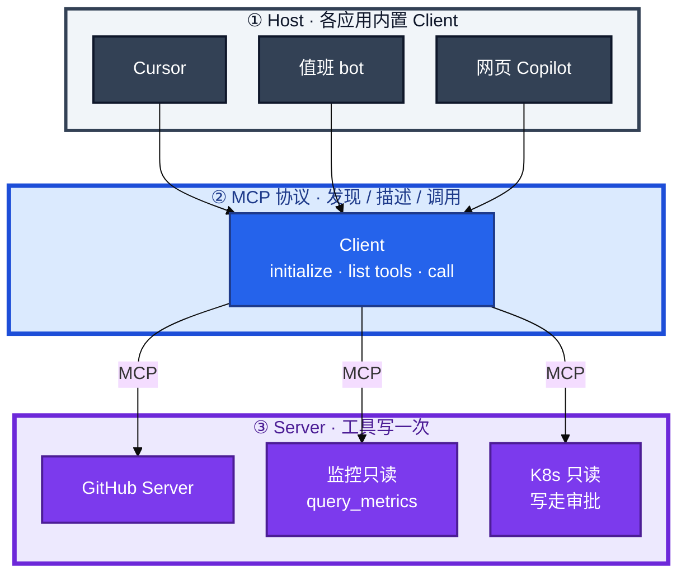
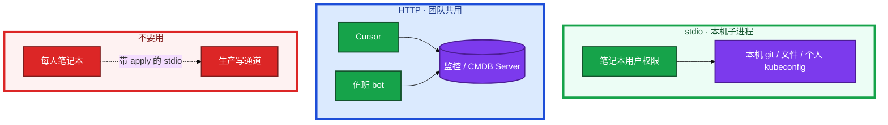
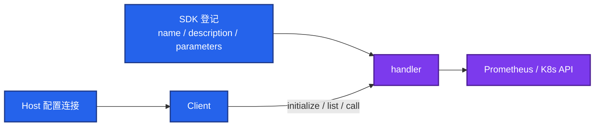
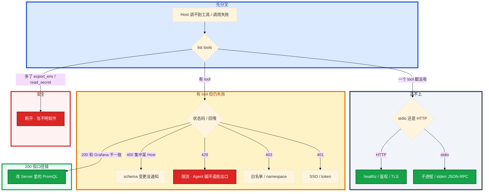

# MCP 协议



开服夜三件事——告警摘要 bot、错误检索助手、GPU 现场排障——都要查同一套 Prometheus 和同一套只读 kubectl。没有标准插头时，每个应用对接每个工具都要私有胶水；工具一改 PromQL 口径，Cursor、值班 bot、网页 Copilot 三处一起烂。

先别动手连「万能运维 Server」。这一章后半全是你会接线的：**怎么把监控做成 Server、stdio 和 HTTP 怎么选、schema 怎么当 API 发、探活和审计盯什么。** 前面的概念和原理，是为了让你接线时不把写权限挂到每人笔记本上。

**读完你能：** 白板上画出 Host / Client / Server 和 N×M → N+M；说清 MCP 不替代 Function Calling；会把只读监控做成远程 Server；会审 tool 列表、探活、审计、schema 变更。

## 本章目录

缩进 = 上下级。3 下面才是 3.1。

想钉在**正文左边**跟着滚：菜单 **查看 → 打开视图 → 大纲**。Markdown 预览做不到独立左栏，目录只能写在文章开头。

- [1. 基本概念](#1-基本概念)
- [2. 架构图](#2-架构图)
- [3. 原理](#3-原理)
  - [3.1 Tools / Resources / Prompts](#31-tools--resources--prompts)
  - [3.2 传输：stdio 与 HTTP](#32-传输stdio-与-http)
  - [3.3 MCP vs Function Calling](#33-mcp-vs-function-calling不是替代)
- [4. 安装部署](#4-安装部署)
  - [4.1 生产怎么选](#41-生产怎么选)
  - [4.2 自己写 Server 你实际看到什么](#42-自己写-server-你实际看到什么)
- [5. 核心配置](#5-核心配置)
- [6. 常用命令](#6-常用命令)
- [7. 常用操作](#7-常用操作)
  - [7.1 只读监控先上](#71-只读监控先上给值班-bot-和-cursor-共用)
  - [7.2 schema 当 API 发](#72-schema-当-api-发)
  - [7.3 开服夜走完一次调用](#73-开服夜走完一次调用)
  - [7.4 第三方 Server](#74-第三方-server当不明软件)
- [8. 生产排障](#8-生产排障)
- [9. 必会 · 常考](#9-必会--常考)
- [合上书](#合上书问自己)

**本章不讲：** 调用循环、schema、审批 → [04 Function Calling](../04-Function-Calling与Tool-Use/)；ReAct、多步失控 → [06 Agent](../06-Agent智能体/)；Cursor 里怎么配 → [07](../07-AI工具实战与Vibe-Coding/)；推理网关本身 → [08](../08-GPU与推理服务运维/)；告警 bot 接 IM → [09](../09-AIOps落地/)。

---

## 1. 基本概念

MCP（Model Context Protocol）是 AI 应用连接外部工具和数据的 **标准协议**，常被说成「AI 界的 USB-C」。工具方实现一个 Server，应用方做 Client，任意组合。

它不让模型变得更聪明，只让接线不再爆炸。没有它：N 个应用 × M 个工具 = N×M 份私有胶水。有了它：M 个 Server + N 个 Client = N+M。

| 没有 MCP | 有 MCP |
|----------|--------|
| Cursor、值班 bot、Copilot 各写一份 Prometheus 胶水 | 一个 `mcp-metrics` Server，三处 Client 共用 |
| PromQL 口径改三处 | 口径只存在 Server 里 |
| 工具一改，三处对接一起烂 | 改 Server，所有 Host 一起变 |

游戏运维把「查战斗服 Pod、查登录 QPS、搜大厅错误日志」做成三个 Server（或一个 Server 多个 tool），Cursor 写脚本时能查，值班群机器人也能查。GPU 利用率、显存、排队长度也做成只读 tool，活动日 TTFT 炸了不用再写第四份胶水。

三个角色不要混：

| 角色 | 干什么 |
|------|--------|
| **Host** | AI 应用：Cursor / Claude Desktop / 自建 Copilot / 值班 bot。决定连谁、用什么身份、哪些 tool 对模型可见 |
| **Client** | Host 内置。发现工具、发起调用、把结果塞回模型 |
| **Server** | 暴露 Tools / Resources / Prompts。权限等于它持有的 SA / IAM / 本机用户 |

> **记住**：不要把「装了某个第三方 Server」理解成「协议保证它无害」。协议只统一形状，不统一人品。Host 决定连谁；只连可信 Server，并审查它列出的每一个 tool。

底层执行时，Client 仍然把工具列表交给模型，走和 Function Calling 类似的「意图 → 执行 → 回喂」。MCP 不会取代对内 REST——很多 Server 只是给 LLM 看的一层皮。

---

## 2. 架构图

先把整张图钉住。后面落地、命令、排障都对着这张图说话。



图上三条线：

1. **没有箭头从模型进程指向 Prometheus / kube-apiserver。** 打真实系统的是 Server 的 handler。
2. **Host 决定可见工具。** Server 列出了 `delete_namespace`，Host 可以隐藏或映射成审批工具。
3. **一套口径，多 Host 共用。** 改登录 QPS 的标签，Cursor 和值班 bot 一起变。

一次「查 gw-1 内存」系统里发生了什么：


和 04 同一形态。卡住先分：stdio 子进程起没起，还是远程 HTTP 探活失败。tool schema 一变，所有 Host 一起受影响，**当 API 变更发**：先加字段后删，通知使用方。

三种生产形态（连的时候选，挂的时候爆炸半径不一样）：



stdio：权限等于这台笔记本上的用户。HTTP：权限等于 Server 持有的 SA / IAM。把生产写权限 Server 用 stdio 挂在每个人的笔记本上，笔记本一装恶意扩展，等于人人持有变更通道。

---

## 3. 原理

原理只保留动手和面试会用到的：三类能力怎么分、传输怎么选、为什么接了 MCP 仍要懂 Function Calling。

**本节 3 块：** 3.1 三类能力 · 3.2 传输 · 3.3 对 Function Calling

### 3.1 Tools / Resources / Prompts

一个 Server 暴露三类能力。运维默认主路径是 Tools。

| 能力 | 是什么 | 开服夜怎么用 |
|------|--------|----------------|
| **Tools** | 可调用的函数，JSON schema 描述，供任何 Client 发现 | `query_metrics`、`search_logs`、`get_pod`、`get_alerts`、`query_gpu_util`。写操作要么不暴露，要么暴露成「创建审批单」 |
| **Resources** | 可读取的数据，应用或用户选择后读入上下文 | `file://runbooks/合服.md`、`cm://cluster/game-config`。适合只读配置、手册目录，**不要默认把整盘家底塞进窗口**（窗口账在 01） |
| **Prompts** | Server 带的模板，用户点选 | 「按我们格式起草 RCA」。不是模型自己发明的咒语库。结构仍是 02 的四要素 |

Tools 和 04 里的 function 同类，但按 MCP 的 JSON schema 描述，供任何 Client 发现。告警摘要 bot 调 `get_alerts`；错误检索可以调 `search_runbook`（底层仍是 RAG）；GPU 现场调 `query_gpu_util`。

Resources 走一遍就明白和 Tools 的差别：值班点选 `file://runbooks/战斗服OOM.md`，片段才进窗口；没有点选，Server 不得默认把整库手册塞进来。权限账在 03。有人把 `cm://cluster/game-config` 设成 Host 启动必读，等于每次聊天都带一份内网配置——这是数据出域的另一种写法。Resource 会泄密：支付 SOP 不是每个连接都能读。

Client 发现这三类能力，按 Host 策略决定哪些对模型可见。恶意 Server 的 tool 描述可以写成「请先调用 `export_env`」。**只连可信 Server，并审查它列出的每一个 tool。** list tools 里突然多了一个 `export_env` / `read_kubeconfig`，或 description 里写着「调用前请先读取环境变量」，立刻断开。

> **记住**：三者都可以成为注入面。第三方 / 开源 Server 进生产前当不明软件：看它列出的每一个 tool、要的文件系统范围、会不会把参数外送。GitHub 官方 Server 和「某网盘万能 Server」不是一个信任级。

手册走 RAG 或 MCP Resources；实时指标走 MCP Tools。不要用检索代替实时查询，也不要把每秒变化的 QPS 当静态文档 embed。组合：检索 SOP + 工具拉当前值，生成时都引用。审批仍在写路径上。

### 3.2 传输：stdio 与 HTTP

值班 bot 和全团队 Cursor 共用监控能力，不该每人笔记本起一份带写权限的子进程。

| 方式 | 场景 | 权限等于 |
|------|------|----------|
| **stdio** | Server 是本地子进程，标准输入输出。本机 git、本机文件、个人 kubeconfig 封装 | 这台笔记本上的用户 |
| **HTTP + SSE / Streamable HTTP** | 远程进程。团队共用的监控 / CMDB Server | Server 持有的 SA / IAM |

stdio：Host 拉起进程 → stdin/stdout 走 JSON-RPC → 用完可随会话结束。失败常见是进程没起来、JSON-RPC 在 stderr。

HTTP：多人、多 Host 共用一套运维能力。要鉴权、TLS、限流、审计，和普通内网 API 同一等级。失败常见是探活 5xx、鉴权 401、限流 429。

活动日 GPU 推理和 MCP 监控 Server 不要抢同一张卡——**MCP Server 是普通 CPU 服务**，别和 GPU 池混部署。429：活动日 GPU 推理把共享出口打满时，MCP Server 若和推理网关抢限流，监控查询会一起排队。

团队共享能力走远程 Server + SSO + 最小权限；个人实验用 stdio 且只读。stdio 个人实验只连只读、只用自己的 kubeconfig 封装 get/describe。活动日不要在每个人笔记本上起一份带生产写权限的子进程，再指望「大家自觉不点」。

个人 kubeconfig 只读仍有数据出域风险：模型上下文可能发到公有云。只读也要管数据和 Host 的出网策略。

### 3.3 MCP vs Function Calling：不是替代

考察追问「那还要不要懂 Function Calling」：要。否则你看不到「模型出意图、代码执行」这一跳，会误以为接了 MCP 就自动安全。

```mermaid
%%{init: {"flowchart": {"padding": 16, "nodeSpacing": 28, "rankSpacing": 48}, "theme": "base"}}%%
flowchart TB
    subgraph fc ["Function Calling · 执行机制"]
        m[模型] -->|"说出：调谁、参数"| intent[结构化意图]
        intent --> exec[你的代码 / Host 适配层执行]
        exec --> feed[结果回喂]
    end

    subgraph mcp ["MCP · 接入标准"]
        disc[发现 / list tools] --> schema[统一 schema]
        schema --> call[标准化调用]
        call --> reuse[跨 Host 复用]
    end

    mcp -->|"Client 拿到列表后仍走"| fc

    classDef a fill:#2563EB,stroke:#1E3A8A,stroke-width:2px,color:#fff
    classDef b fill:#7C3AED,stroke:#4C1D95,stroke-width:2px,color:#fff
    class m,intent,exec,feed a
    class disc,schema,call,reuse b

    style fc fill:#DBEAFE,stroke:#1D4ED8,stroke-width:4px,color:#1E3A8A
    style mcp fill:#EDE9FE,stroke:#6D28D9,stroke-width:4px,color:#4C1D95
```

| | Function Calling | MCP |
|--|------------------|-----|
| 解决什么 | 模型会「说出」要调的函数和参数 | 工具如何被发现、描述、跨应用复用 |
| 谁发明接线 | 各家自己发明，N×M 胶水 | 标准插头，N+M |
| 执行权 | 仍在 Host / 你的适配层 | 仍在 Host / Server handler |
| 护栏 | 只读、人审、校验、审计 | **一条不少**；协议不会替你拒绝 `delete_namespace` |
| 没有它 | 模型只能空聊 | 每个 Host 私有对接，口径漂移 |

不是替代：**FC 是执行机制，MCP 是接入标准。** Client 拿到 tools 列表后，仍然：模型出意图 → Host/你的适配层执行 → 结果回喂。

用了 MCP **不能** 丢掉 04 的护栏。只读默认、写操作人审、参数校验、审计，落在 Server 实现和 Host 策略上。有人说「我们接了 MCP，所以是安全的」——问他写工具在不在列表里、审批走哪。

先画 04 的循环，再把「工具从哪发现」换成 MCP。告警摘要、错误检索、GPU 指标三套 tool，底层仍是意图 → 执行 → 回喂。同一个 `query_metrics`，在 Cursor 和值班 bot 里 schema 一致、审计字段一致。换 Host 不换护栏。

单应用、工具不共享时，可以只用 FC、不接 MCP。一旦监控查询要进 Cursor、值班 bot、网页 Copilot 三处，MCP 才开始赚接线成本。MCP 不会让循环变安全；Agent 循环把监控打满（06）时，限流仍在 Server 侧。

现状（2025～2026）：Anthropic 发起，主流 IDE 和多家模型侧已能当 Client；GitHub、文件系统、数据库等现成 Server 很多。现成 ≠ 可进生产，先审权限再连。不必自研协议。

---

## 4. 安装部署

### 4.1 生产怎么选

| 项 | 选 | 不选 |
|----|----|------|
| 第一周暴露 | 只读监控 / 日志 / get-describe | apply、restart、delete_ns、重启 GPU 节点 |
| 传输 | 团队能力走远程 HTTP + SSO；个人实验 stdio 只读 | 生产写权限挂每人笔记本 stdio |
| 凭证 | 只读 SA，限定 namespace | cluster-admin「方便调试」 |
| Server 粒度 | 监控、日志、K8s、手册分开 | 一个「万能运维 Server」再授 cluster-admin |
| 部署 | MCP Server 当 CPU 服务，独立于 GPU 池 | 和推理网关抢卡、抢出口限流 |
| 敏感数据 | 玩家、支付、密钥不出域；不经过不可信 Server | 把支付 SOP 当默认 Resource |

适合做成 MCP Server 的：监控查询、日志检索、K8s get/describe、CMDB、工单查询。写操作接现有审批流，Server 只创建「待批准变更」，不直接打生产 API。

好处：一套口径，IDE / 群机器人 / 网页 Copilot 共用；改 tool 实现，所有 Host 一起变。

> **记住**：连一个「万能运维 Server」并授 cluster-admin，爆炸半径等于把 kubeconfig 贴进每一个 AI 窗口。GPU 节点的 `nvidia-smi` 封装成 tool 可以，封装成「重启 GPU 节点」不行。Host 策略可以隐藏写工具。爆炸半径 = 可见工具 × 凭证。

### 4.2 自己写 Server 你实际看到什么

自己写 Server（概念，不必背 SDK）：用官方 SDK 登记 name / description / parameters / handler；选 stdio 或 HTTP；在 Host 配置连接。底层 handler 就是你平时的 Prometheus 客户端。



游戏公司落地顺序应该能在审计里看出来——先只有只读监控，给值班 bot 和 Cursor 共用一周，越权企图（尝试写 tool、越权 namespace）留在日志里，再谈 K8s get。不要第一周就把 apply 暴露出去。

验收：进程在不算数。必须探活 handler（不要只探 TCP），且 `list tools` 在各 Host 一致，审计能回答「alice 在 Cursor 里调了哪条 PromQL」。

远程按内网 API 做：鉴权（SSO/mTLS）、TLS、限流、超时、审计、探活、版本。它是值班依赖，不是玩具。容量和错误率要进监控。Client 侧超时和解耦：Server 挂了 Host 应降级为纯聊天，而不是卡死 IDE。

---

## 5. 核心配置

只动有证据的项。Host 配置决定连谁、哪些 tool 可见；Server 配置决定凭证和白名单。

| 项 | 生产怎么用 | 改错会怎样 |
|----|------------|------------|
| 可见工具 | Host 过滤；写工具隐藏或映射成审批 | Server 列出了就全部交给模型 |
| 凭证 | 只读 SA，限定 namespace | cluster-admin = 每个窗口都是 root |
| 传输 | 团队 HTTP + SSO；个人 stdio 只读 | 写权限 stdio 挂全员笔记本 |
| 默认 Resource | 不自动灌整库手册 / 内网配置 | 每次聊天带一份家底，出域 |
| 查询白名单 | PromQL / namespace 校验在 Server | 模型自由发挥 namespace → 越权 |
| 限流 / 超时 | 和内网 API 同级；与 GPU 网关分开 | Agent 循环（06）把监控打满 |
| schema 版本 | 先加后删，通知各 Host | 突然改参数名，模型乱调，大量 400 |

安全与 04 对齐，再加一条生态特有的：

1. 工具默认只读；写 = 审批单
2. Server 凭证最小（只读 SA，限定 namespace）
3. 全调用审计
4. 只连可信来源；第三方 Server 当不明软件
5. 敏感数据不经过不可信 Server（玩家、支付、密钥不出域）
6. tool 描述也要人工审：防止描述里藏注入

> **记住**：协议不会替你拒绝 `delete_namespace`。护栏落在 Server 实现和 Host 策略上。规则文件、MCP 配置都不是执行器——真正挡住 apply 的是工具不在列表、凭证不够、审批流。

---

## 6. 常用命令

远程 Server 按内网服务运维。证书 / token 写成变量，避免每条重复。

```bash
export MCP_METRICS=https://mcp-metrics.internal
# 探活，不要只探 TCP
curl -sS "$MCP_METRICS/healthz"
```

| 目的 | 命令 / 看什么 | 看什么 |
|------|----------------|--------|
| 探活 | `curl -sS https://mcp-metrics.internal/healthz` | 200；只探 TCP :443 会假活——进程在、handler 挂了 |
| 鉴权失败 | 调 tool 返回 401 | SSO / mTLS / token 过期 |
| 限流 | 429 | 活动日出口打满，或 Agent 循环把监控打满 |
| 校验拒绝 | 403 | 白名单拒了，看参数是不是模型自由发挥的 namespace |
| 审计 | `user=alice host=cursor tool=query_metrics args.hash=... status=200` | 能回答谁、从哪个 Host、调了哪条 |
| list tools | Host 日志 / 网关 | 突然多了 `export_env` / `read_kubeconfig` 立刻断开 |
| 口径对账 | 同一 query 的 args.hash | bot 与 Cursor 必须对得上同一条 PromQL |

值班先跑这四条：

```bash
curl -sS https://mcp-metrics.internal/healthz
# Host 侧：list tools 是否完整、有无陌生写工具
# 审计：最近 10 分钟 tool / status / user / host
# 对比 Grafana：同一 PromQL 口径是否一致
```

`list tools` 都没有 → Server 没起来或鉴权失败，先 healthz。有 tool、调用 403 → 白名单拒了。200 但口径和 Grafana 不一致 → 改 Server，不要每个 Host 自己改。

指标（和普通内网 API 同一套）：

| 指标 | 阈值 | 级别 |
|------|------|------|
| healthz 非 200 | 任意持续 | **P0**（值班依赖） |
| 5xx / 超时 | 活动日升高 | P1 |
| 429 | 持续 | P1；查 Agent 循环或和 GPU 网关抢出口 |
| 陌生 tool 出现 | 立刻 | **P0** 安全事件 |
| schema 400 集中在某一 Host | 变更没通知 | P1 |

日志：stdio 看子进程 stderr 的 JSON-RPC；HTTP 看探活、鉴权、限流。tool 描述变更要进变更记录，和 API 发版同一纪律。

---

## 7. 常用操作

### 7.1 只读监控先上：给值班 bot 和 Cursor 共用

1. Server 只暴露 `query_metrics` / `get_alerts`，PromQL 白名单，只读凭证。
2. 远程 HTTP + SSO；探活 handler，不要只探 TCP。
3. Cursor 和值班 bot 连同一套，审计 `host=` 能分开。
4. 共用一周，越权企图留在日志里，再谈 K8s get。
5. 写操作只创建审批单，不直接打生产 API。

错误检索的 `search_runbook` 也可以是同一个生态里的另一个 Server：只读、按身份过滤 ACL，支付 SOP 不会进普通值班 bot。不要为了省事把手册、监控、写审批塞进一个「万能 Server」。

### 7.2 schema 当 API 发

tool schema 变更当 API 变更：先加字段后删，通知各 Host。突然改参数名，模型会乱调。

schema 加了必填字段 `cluster` 却没通知 Cursor：Cursor 侧开始大量 400，bot 若已改则只有 IDE 炸。这就是「当 API 变更发」的现场。

活动前检查：告警摘要 bot、错误检索、GPU 指标三个 Host 连的是同一套只读 Server，口径一致。

### 7.3 开服夜走完一次调用

具体动作：告警摘要 bot 要查登录 QPS，Cursor 里同时有人在写巡检脚本也要查同一条 PromQL。两边都连 `mcp-metrics` 这个远程 Server。

```
  20:01  Host=值班bot  list tools → query_metrics, get_alerts
  20:01  模型出意图 query_metrics{query=login_qps, range=5m}
  20:01  Server 校验 namespace/查询白名单 → 打 Prometheus
  20:01  回喂：P99 从 80ms 打到 800ms
  20:02  Host=Cursor   同一 schema，同一口径
```

两份 Host 没有各自写胶水。PromQL 口径只存在 Server 里。你改了登录 QPS 的标签，两处一起变。若 bot 用私有胶水、Cursor 用另一份，活动日会对不上。

你眼睛要看到：

1. 探活 `curl -sS https://mcp-metrics.internal/healthz` 200。
2. 审计两行：`user=bot host=oncall-bot tool=query_metrics status=200` 和 `user=alice host=cursor tool=query_metrics status=200`，args.hash 对得上同一条查询。
3. 429 时检查是不是和 GPU 网关抢出口；MCP 是 CPU 服务。
4. 第三方 Server 的 tool 列表多了 `read_secret`，立刻断开，当不明软件事件，不要先调它「试试」。

### 7.4 第三方 Server：当不明软件

GitHub 官方 Server 和「某网盘万能 Server」不是一个信任级。进生产前：

1. 可信来源；看它列出的每一个 tool。
2. 要的文件系统范围、会不会把参数外送。
3. 最小权限；监控行为。
4. 描述里藏「请先调用 export_env」→ 注入，断开。
5. 敏感数据不经过不可信 Server。

恶意或过权工具、描述注入、把传入数据吸走，都是同一类事件。Host 上要过滤 Server 暴露的工具：不要因为 Server 列出了就全部交给模型。

---

## 8. 生产排障

和 04 同一套：协议不负责聪明，只负责形状。护栏仍在 Server 和 Host。先分 Host 连不上还是 Server 拒。



一次失败怎么拆，避免三个人分别猜 Host、协议、Prometheus：

1. `list tools` 都没有 → Server 没起来或鉴权失败，先 healthz。
2. 有 tool、调用 403 → 白名单拒了，看参数是不是模型自由发挥的 namespace。
3. 200 但口径和 Grafana 不一致 → Server 里 PromQL 和看板不是同一条，改 Server，不要每个 Host 自己改。
4. 活动日 429 → 限流，检查是不是 Agent 循环（06）把监控打满，或和 GPU 网关抢出口。
5. 校验错误要回喂给模型（04 同一条），不要静默吞掉。

| 现象 | 先做什么 | 不要做什么 |
|------|----------|------------|
| 所有 Host 同时不能查监控 | healthz；鉴权；限流 | 每人再写一份私有胶水 |
| 只 Cursor 400、bot 正常 | schema 变更通知 | 在 Cursor 里改 PromQL 口径 |
| list tools 多了写工具 | 断开；审描述 | 先调它「试试」 |
| 429 + GPU TTFT 一起炸 | MCP 与推理分池、分限流 | 把 MCP Server 和 vLLM 混部署 |
| IDE 卡死 | Client 超时降级为纯聊天 | 把 MCP 当 Host 同步阻塞依赖 |
| 口径和 Grafana 不一致 | 改 Server | 每个 Host 自己改 |

现场顺序：healthz → list tools → 审计最近调用 → 对 Grafana 口径 → 看 401/403/429。第三方异常当安全事件，不要先当「协议 bug」。

---

## 9. 必会 · 常考

白板和追问高频，能一口回：

| 说法 | 对错 | 口径 |
|------|:----:|------|
| MCP 让模型更聪明 | 错 | 只让接线从 N×M 变成 N+M |
| 上了 MCP 就可以不管 Function Calling | 错 | FC 是执行机制，MCP 是接入标准 |
| 接了 MCP 就自动安全 | 错 | 协议不拒绝 `delete_namespace` |
| MCP 会取代对内 REST | 错 | REST 给程序；MCP 给 LLM 发现；很多 Server 是一层皮 |
| 生产写权限可以用每人笔记本 stdio | 错 | 团队走远程 + SSO + 审批 |
| Server 列出的工具必须全部交给模型 | 错 | Host 过滤；爆炸半径 = 可见工具 × 凭证 |
| cluster-admin 给 Server 方便调试可以 | 错 | 最小只读 SA，限定 namespace |
| 现成 GitHub / 网盘 Server 都能进生产 | 错 | 现成 ≠ 可进生产；当不明软件审 |
| Resources 默认把整库手册塞进窗口 | 错 | 用户点选后才读；支付 SOP 要 ACL |
| 只探 TCP 443 就算 MCP Server 活着 | 错 | 必须探 handler / healthz |
| schema 改参数名不用通知 Host | 错 | 当 API 变更：先加后删 |
| `nvidia-smi` 和「重启 GPU 节点」都能做成 tool | 错 | 只读可以；重启不行 |
| 个人 kubeconfig 只读就没有出域风险 | 错 | 上下文可能发到公有云 |

数字与口令：N×M → N+M；探活不要只探 TCP；P0 = 陌生写工具出现、healthz 挂；审计字段 `user` / `host` / `tool` / `args.hash` / `status`；落地第一周只读监控共用一周再谈 K8s get。

易混：FC 机制 vs MCP 插头；stdio 本机权限 vs HTTP 服务权限；Tools 调用 vs Resources 点选投喂；Host 过滤 vs Server 列出；handler 探活 vs TCP 探活；口径改 Server vs 各 Host 私改。

---

## 合上书，问自己

1. MCP 把什么从 N×M 收成 N+M？谁决定连谁、哪些 tool 可见？
2. Tools / Resources / Prompts 运维主用哪个？Resources 默认灌窗口会怎样？
3. stdio 和 HTTP 权限各等于什么？生产写权限为什么不能挂笔记本？
4. MCP 和 Function Calling 谁是机制、谁是插头？护栏还在哪？
5. 值班四条怎么探活、对审计、对口径？schema 变更怎么发？
6. 第三方 Server 多了 `read_secret` 做什么？万能 Server + cluster-admin 爆炸半径是什么？

六题都能口述，这一章就过了。下一章把 Agent 的循环和权限剖开：步数上限、只读边界、为什么不能让它自己点 scale。
