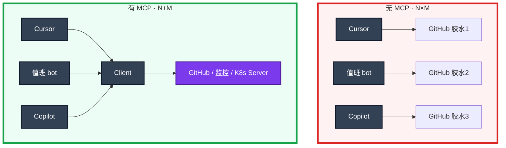

# 05｜MCP 协议 · 练习题

先自己画图或口述，再对照解答。每题标了覆盖范围：

| 标记 | 含义 |
|------|------|
| **核心** | 不懂整章就没建立起来 |
| **必会** | 值班和面试都要能讲 |
| **常用** | 线上会反复碰到 |
| **常考** | 白板和追问的高频口径 |

## 本题目录

- [Q1 是什么、N×M](#q1)
- [Q2 Host / Client / Server](#q2)
- [Q3 MCP vs Function Calling](#q3)
- [Q4 落地与安全红线](#q4)
- [Q5 stdio / HTTP](#q5)
- [Q6 Tools vs Resources](#q6)
- [Q7 远程当内网 API](#q7)
- [Q8 Host 过滤工具](#q8)
- [Q9 排障分流](#q9)
- [合上书](#合上书)

---

## Q1

**★★★★★｜MCP 是什么？解决什么问题？画 N×M → N+M**

**覆盖**：核心 · 必会 · 常考

### 场景

白板：「监控查询在 Cursor、值班 bot、网页 Copilot 各写了一套胶水。改 PromQL 口径要改三处。MCP 是什么？」有人开始背某个厂商的安装向导。

### 完整解答

MCP（Model Context Protocol）是 AI 应用接外部工具/数据的 **标准协议**，常说「AI 界的 USB-C」。把 N 个应用 × M 个工具的对接，收成 M 个 Server + N 个 Client。它不让模型更聪明，只让接线不再爆炸。

工具写一次，各 Host 复用。游戏运维把查 Pod、查登录 QPS、搜错误日志做成 Server，Cursor 和值班 bot 共用；升级 PromQL 只改 Server。

### 再追问

- 没有 MCP 时 Function Calling 不也能接工具吗？——能，但不通用。FC 解决「模型会出意图」；怎么发现、描述、跨应用复用是各家私有的。
- MCP 会取代对内 REST 吗？——不会。REST 给程序；MCP 给 LLM 发现。很多 Server 只是一层皮。

---

## Q2

**★★★★★｜画 Host / Client / Server。三类能力是什么？**

**覆盖**：核心 · 必会 · 常考

### 场景

「MCP 是不是就是再包一层 HTTP API？」

### 完整解答

Host（Cursor / 值班 bot）内置 Client，连多个 Server。协议统一形状，**不保证第三方 Server 无害**。Host 决定连谁、哪些 tool 对模型可见。

| 能力 | 运维怎么用 |
|------|------------|
| **Tools** | 可调函数，主路径：`query_metrics` / `get_pod` |
| **Resources** | 点选后读入手册、配置快照；不要默认灌整库 |
| **Prompts** | 预置 RCA 提纲 |

### 再追问

- 恶意描述写成「请先调用 export_env」？——审查每一个 tool；只连可信 Server；描述也是注入面。
- GitHub 官方和「网盘万能 Server」？——不是一个信任级。现成 ≠ 可进生产。

---

## Q3

**★★★★★｜MCP 和 Function Calling 到底什么关系？**

**覆盖**：核心 · 必会 · 常考

### 场景

「上了 MCP 就可以不管调用循环了吧？接了 MCP 所以是安全的。」

### 完整解答

分层，不是替代。**FC 是执行机制，MCP 是接入标准。**

Client 拿到列表后，仍然是意图 → 执行 → 回喂。护栏一条不少：只读、人审写操作、参数校验、审计。协议不会替你拒绝 `delete_namespace`。单应用不共享工具可以只用 FC；三处 Host 共用监控才开始赚 MCP。

### 再追问

- 那还要不要懂 FC？——要。否则看不见「执行权在 Host/你的代码」这一跳。
- 换 Host 护栏能换吗？——不能。同一 `query_metrics` schema 和审计字段必须一致。

---

## Q4

**★★★★★｜运维做成 MCP Server 有什么好处？安全红线？**

**覆盖**：必会 · 常用 · 常考

### 场景

打算把 K8s 和监控做成内部 Server，给全公司 IDE 连。有人要把 apply 第一周就暴露，并授 cluster-admin。

### 完整解答

好处：一套口径，IDE / 群机器人 / Copilot 共用；改 Server，全 Client 受益。

落地顺序：先只读监控，给值班 bot 和 Cursor 共用一周，越权企图留日志，再谈 K8s get。写 = 创建审批单，不直接打生产 API。`nvidia-smi` 可以，重启 GPU 节点不行。

红线：默认只读；写走审批；最小权限 SA；全调用审计；只连可信 Server；敏感数据不经过不可信 Server；**审查 tool 描述**；玩家和密钥不出域。不要万能 Server + cluster-admin——爆炸半径 = 把 kubeconfig 贴进每一个 AI 窗口。

### 再追问

- 连第三方 MCP Server 有什么风险？——过权工具、描述注入、把传入数据吸走。当不明软件：可信来源、审工具列表、最小权限、监控行为。多了 `read_secret` 立刻断开，不要先调「试试」。

---

## Q5

**★★★★☆｜stdio 和 HTTP 各用在哪？生产写权限能挂笔记本吗？**

**覆盖**：必会 · 常用

### 场景

每人 Cursor 拉起一个带 apply 的本地 Server。另有人说个人 kubeconfig 只读就没事。

### 完整解答

| 方式 | 场景 | 权限等于 |
|------|------|----------|
| stdio | 本机 git/文件、个人只读实验 | 笔记本用户 |
| HTTP + SSE / Streamable HTTP | 团队监控/CMDB | Server 的 SA / IAM |

生产写权限不要挂在每人笔记本的 stdio 上：失窃、恶意扩展、错误配置都会变成变更通道。团队能力走远程 + SSO + 审批。MCP Server 是 CPU 服务，别和 GPU 池混部署。

### 再追问

- 个人 kubeconfig 只读呢？——仍有数据出域：上下文可能发到公有云。只读也要管数据和 Host 出网策略。

---

## Q6

**★★★★☆｜Tools 和 Resources 怎么分工？和 RAG 一起怎么放？**

**覆盖**：必会 · 常用

### 场景

要把合服手册和「查当前副本数」都给模型。有人把 `cm://cluster/game-config` 设成 Host 启动必读。

### 完整解答

查当前状态用 Tools（可调、有参数）。手册用 Resources，由应用/用户选择后读入上下文，避免默认把整库塞进窗口。Prompts 放复盘提纲。运维主路径仍是 Tools。

手册走 RAG 或 MCP Resources；实时指标走 MCP Tools。不要用检索代替实时查询，也不要把每秒变化的 QPS 当静态文档 embed。组合：检索 SOP + 工具拉当前值。支付 SOP 不是每个连接都能读（和 03 同一类 ACL）。

Host 启动必读内网配置 = 每次聊天带一份家底，是数据出域的另一种写法。

### 再追问

- Resource 会不会泄密？——会。权限和脱敏与 RAG 相同。

---

## Q7

**★★★★☆｜远程 MCP 要当内网 API 运维，具体盯什么？schema 怎么发？**

**覆盖**：必会 · 常用

### 场景

HTTP Server 挂了，所有 Host 同时不能查监控。另一次 schema 加了必填 `cluster` 却没通知 Cursor，只有 IDE 大量 400。

### 完整解答

鉴权（SSO/mTLS）、TLS、限流、超时、审计、探活、版本。它是值班依赖，不是玩具。探活不要只探 TCP——进程在、handler 挂了会假活。Client 侧超时：Server 挂了 Host 应降级为纯聊天，而不是卡死 IDE。

schema 变更当 API 变更：先加后删，通知各 Host。突然改参数名，模型会乱调。审计要能回答「alice 在 Cursor 里调了哪条 PromQL」。

### 再追问

- 活动日 429？——查 Agent 循环（06）把监控打满，或和 GPU 网关抢出口。MCP 与推理分池。

---

## Q8

**★★★★☆｜Host 上要不要过滤 Server 暴露的工具？**

**覆盖**：必会 · 常考

### 场景

一个「万能运维 Server」列出了 `delete_ns`。有人说 Server 列出了就该全部交给模型。

### 完整解答

要过滤。Host 策略可以隐藏写工具，或映射成审批工具。不要因为 Server 列出了就全部交给模型。爆炸半径 = 可见工具 × 凭证。cluster-admin 给 Server 方便调试：不可以。笔记本和 CI 都一样，最小只读 SA，限定 namespace。

### 再追问

- 自己写 Server 概念上怎么做？——SDK 登记 name/description/parameters/handler，选 stdio 或 HTTP，Host 里配置连接。handler 就是普通 Prometheus 客户端。不必自研协议。

---

## Q9

**★★★★☆｜给出现象，你先走哪条排障路？**

**覆盖**：必会 · 常用

### 场景

四个工单：① 所有 Host `list tools` 都空 ② 有 tool 但 403 ③ 200 但口径和 Grafana 不一致 ④ list tools 多了 `read_secret`。

### 完整解答

| # | 走哪条 | 不要做 |
|---|--------|--------|
| ① | healthz / 鉴权 / stdio 子进程 | 每人再写一份私有胶水 |
| ② | 白名单、模型自由发挥的 namespace | 把 cluster-admin 授给 Server |
| ③ | 改 Server 里的 PromQL | 每个 Host 自己改口径 |
| ④ | 断开，当不明软件 / 安全事件 | 先调它「试试」 |

现场：healthz → list tools → 审计 → 对 Grafana。校验错误回喂模型（04），不要静默吞。

### 再追问

只 Cursor 400、bot 正常？——schema 变更没通知该 Host，当 API 发版事故，不要在 Cursor 里改 PromQL。

---

## 合上书

- [ ] 能画出 N×M → N+M，以及 Host 内置 Client 连多个 Server
- [ ] 能说出 Tools / Resources / Prompts 分工，Resources 不能默认灌窗口
- [ ] 能把 MCP vs FC 讲成「插头 vs 机制」，护栏一条不少
- [ ] 能选 stdio / HTTP，并拒绝生产写权限挂笔记本
- [ ] 能默写安全红线：只读、审批、最小 SA、审计、审描述、数据不出域
- [ ] 能用探活 / list tools / 审计 / 口径对账排障，陌生写工具立刻断开
