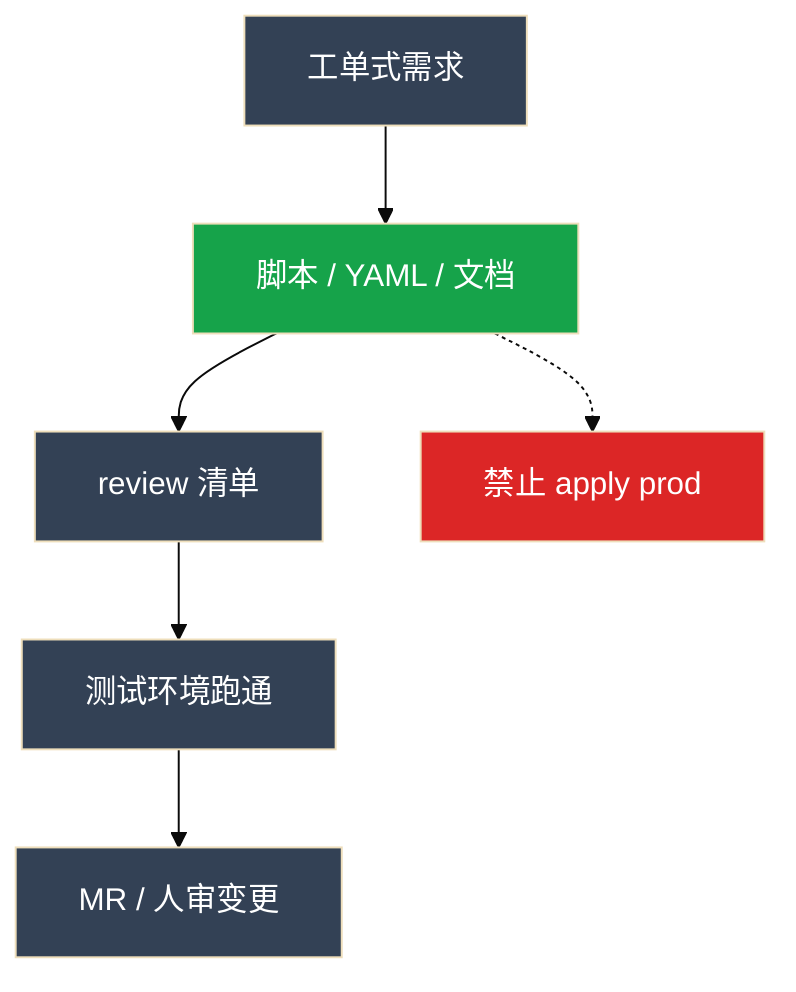
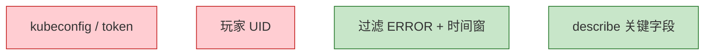

# 07｜AI 工具实战与 Vibe Coding

活动前夜，群里有人把 prod kubeconfig 贴进 ChatGPT 问「怎么扩容」；另有人让 Cursor Agent 一键 `kubectl apply -n prod`，diff 没看就合了——第二天大厅限流脚本把测试路径写死成生产，流水线重试删了两遍缓存。Vibe Coding 不是「不用懂代码」，是**人写工单、模型出草稿、人验收**。

> **加分项定位**：面试测「会不会用 Cursor/CLI 提效，又会不会挡出域和自动执行」——讲完整故事比背快捷键加分。  
> **红线**：生产数据/密钥/kubeconfig 不出域；生成稿必须 review；**默认不自动 apply/delete**；看不懂的代码不能合入。

---

## 面试怎么考

| 频率 | 典型问法 | 30 秒要点 | 2 分钟要点 |
|:----:|----------|-----------|------------|
| ★★★★★ | 什么是 Vibe Coding？ | 自然语言出草稿，人 review+测试+迭代；提效重复劳动，不替值班 | 人负责工单式需求和验收清单；模型出脚本/YAML/文档草稿；生产变更走人审 |
| ★★★★★ | Cursor / Copilot / Claude Code 怎么选？ | 多文件小工具用 Cursor；行内补全 Copilot；批量改仓用终端 Agent | 按形态选，不站队；敏感仓不出公网；能跑命令的工具默认危险品 |
| ★★★★ | 用 AI 写运维脚本要注意什么？ | checklist 七条；dry-run 默认开；对照官方文档 | `set -euo pipefail`、幂等、无硬编码密钥；测试环境跑通再 MR |
| ★★★★ | 什么绝不能交给模型？ | kubeconfig、UID、未脱敏日志、Secret；自动 apply prod | 出域=安全事件；Agent 弹 apply 直接拒；内网模型仍要最小必要 |
| ★★★★ | 排障怎么用 AI？ | 人先收证据；只要 3~5 假设+只读命令；同一会话迭代 | 不要开场「挂了怎么办」；delete/apply 不在自动路径；RAG 查手册不闭卷 |
| ★★★ | `.cursorrules` 能挡住生产变更吗？ | 不能 alone；规则锁生成，白名单才挡执行 | 和 04、06 同一层：命令白名单、关自动执行 |

---

## SRE 边界

| 该用 | 禁止 |
|------|------|
| Cursor Chat/Agent 写巡检脚本、改 YAML 草稿 | 贴完整 kubeconfig / 玩家 UID 到公有云对话 |
| Claude Code / Codex 批量改仓库、跑 `pytest` | 终端 Agent 自动 `kubectl apply -n prod` |
| Copilot 行内补全零散脚本 | 无监督 Agent 改生产配置 |
| 工单式 prompt：格式、约束、边界、dry-run | 200MB 日志整文件丢进窗口 |
| review checklist 当验收步骤 | 生成稿当唯一安全审计 |
| MCP 只连 **只读** 监控 Server（05） | 写权限 MCP Server 挂进个人 IDE |
| 本地 commit + 人看 diff | 自动 push 主分支 |
| 文档草稿：未知标「待补充」 | Runbook 生成完直接进 wiki 当 SOP |

---

## 原理讲透

### 3.1 Vibe Coding 闭环：人管两头，模型管中间

**一句话**：需求说清楚、结果验清楚；效率在重复劳动，不在替你承担变更责任。

**打个比方**：像外卖——你点单写清「不要香菜、微辣、送到 3 楼」，厨房出菜，**你尝一口再端给客人**；模型是厨房，不是店长签字。

**现场走一遍**（活动前夜要交 nginx 巡检脚本）：

1. 打开 Cursor，Cmd+L，贴工单式需求 + `@file scripts/check-framework.sh` 钉已有框架。
2. 模型生成 `check-nginx.sh` 骨架，屏幕出现带 `for host in ...` 的循环，但**没有** `set -euo pipefail`。
3. 选中循环段，Cmd+K：「加 `set -euo pipefail`、变量加引号、`--dry-run` 默认开」。
4. Cmd+I Agent 补 `tests/test_check_nginx.py` 和 README；面板列出将改 3 个文件、将跑 `pytest`。
5. 测试环境执行：

```bash
./check-nginx.sh --hosts hosts.txt --dry-run
```

6. 屏幕：

```text
[dry-run] would check nginx on host-a ... host-j (10 hosts)
summary: ok=10 failed=0 (dry-run, no remote calls)
```

7. 人过 checklist 七条 → MR；**生产变更另走变更单**，不是「模型生成了就能 apply」。

**输出解读**：

| 你看到的 | 说明什么 | 下一步 |
|----------|----------|--------|
| `dry-run` 在 summary 里 | 默认没真 SSH | 去掉 dry-run 在测试机跑一遍 |
| `failed=0` 但 hosts 只有 1 台 | 可能没读全列表 | 核对 `@file` 是否钉对 |
| Agent 弹 `kubectl apply -n prod` | 配置越界 | **直接拒**，不是功能 |

**面试怎么说**：「Vibe Coding 是模型出草稿，我负责工单式需求和七条 checklist 验收；测试环境 dry-run 跑通再 MR，生产变更走人审，模型不替值班。」



> **记住**：看不懂生成的代码就不能合入。模型会幻觉——语法对、逻辑错、API 过时都常见。

**进团队顺序（风险从低到高）**：辅助写代码 → 辅助排障（只读）→ 文档草稿 → 自动执行（默认禁止）。

---

### 3.2 工具形态：按活选人，不按信仰站队

**一句话**：多文件小工具用 Cursor；忘了 flag 用 CLI；敏感内容不走公网对话。

**打个比方**：修家电——换整个面板用 Cursor（多文件），拧一颗螺丝用 Copilot（行内），整栋楼布线用 Claude Code（批量改仓）；**别把家里钥匙寄给陌生维修店**（公网贴 kubeconfig）。

**现场走一遍**（同一仓库三种活）：

1. **新巡检小工具**（3 个文件）→ Cursor Cmd+I Agent，`@folder scripts/`。
2. **改一行 timeout** → VS Code 里 Copilot 行内补全 `timeout 3s`。
3. **10 个脚本统一加 `--dry-run`** → 终端 `claude` / Aider，跑 `pytest`，人看 `git diff`。
4. **忘了 `mtr` 某个 flag** → Copilot CLI 或网页对话（**只问语法，不贴日志**）。

**输出解读**：

| 工具 | 你点了什么 | 正常画面 | 危险信号 |
|------|------------|----------|----------|
| Cursor Agent | Cmd+I | 列出将改文件 + pytest | 出现 `kubectl apply -n prod` |
| Claude Code | 批量改仓 | `git diff` 可审 | diff 里出现硬编码 kubeconfig |
| 网页 ChatGPT | 问 flag | 纯文本答案 | 粘贴框里出现 UID/token |

**面试怎么说**：「按形态选：Cursor 多文件小工具，Copilot 行内补全，Claude Code 批量改十个文件；敏感仓不出公网，能跑命令的工具默认危险品。」

| 工具 | 形态 | 运维怎么用 |
|------|------|------------|
| **Cursor** | AI-first 编辑器 | 巡检工具、改一仓库脚本；Cmd+L/K/I |
| **VS Code + Copilot** | 补全 + Chat | 零散脚本、行内补全 |
| **Claude Code / Aider** | 终端 Agent | 批量改 10+ 文件、跑测试 |
| **网页对话** | ChatGPT / Claude | 语法草稿；**敏感勿贴** |

**分工口诀**：结构思考 → Cursor Chat；跨 10 文件机械改动 → 终端 Agent；仍禁止 `kubectl apply -n prod` 进白名单。

---

### 3.3 Cursor 能力地图：Chat 骨架，Inline 补丁，Agent 多文件

**一句话**：Chat 出骨架，Inline 改局部，Agent 多文件，@ 引用钉上下文。

**打个比方**：装修——Chat 是出平面图，Inline 是改某一堵墙的颜色，Agent 是同时改厨房+卫生间+电路图；`@file` 是告诉师傅「按这套小区标准施工」，别另起炉灶。

**现场走一遍**（补测试 + README）：

1. Cmd+L：「按 `@file scripts/check-nginx.sh` 风格，加并发 10、失败写 failed.txt」。
2. 生成代码缺引号 → 选中 `for host in $hosts`，Cmd+K：「变量加引号」。
3. Cmd+I：「补 pytest 和 README，列将改文件」。
4. Agent 面板：

```text
Will edit: scripts/check-nginx.sh, tests/test_check_nginx.py, README.md
Will run: pytest tests/test_check_nginx.py
```

5. pytest 绿 → 可点 Run；若出现 `kubectl apply` → **拒**。

**输出解读**：

| 面板字段 | 正常 | 异常 |
|----------|------|------|
| Will edit | 2～5 个相关文件 | 突然改 `kubeconfig`、`.env` |
| Will run | `pytest` / `shellcheck` | `kubectl delete` / `rm -rf` |
| 同一会话 | 上下文连续 | 每次新开窗口丢迭代 |

**面试怎么说**：「Chat 出骨架，Cmd+K 改局部，Agent 多文件但要列将改文件和将跑命令；@file 钉框架；弹 apply prod 直接拒。」

> **记住**：仓库若有 prod kubeconfig 能被 Agent 读到，先挪走或 `.cursorignore`，再谈效率。

---

### 3.4 Prompt 要像工单：漏一项，测试环境就删数据

**一句话**：漏 dry-run、漏超时并发，测试环境一次误跑就会删数据。

**打个比方**：给外包下工单——只写「做个健康检查」会收到随便什么；写清输入、超时、并发、失败怎么处理、禁止什么，才像 SRE 能验收的规格。

**现场走一遍**（对比差 prompt 和好 prompt）：

**差**（模型会自由发挥）：

```text
帮我写个健康检查脚本
```

生成结果可能：没 dry-run、硬编码密码、`ssh root@prod` 直连。

**好**（工单式）：

```text
输入：hosts 列表文件，一行一个
每台：systemctl is-active nginx，超时 3s
并发：10
失败：写入 failed.txt
结束：打印 summary
Shell：set -euo pipefail
必须：--dry-run 默认开
不要：硬编码密码；不要 apply 生产命令
参考：@file scripts/check-framework.sh
```

**输出解读**：

| prompt 里有没有 | 生成稿常见结果 |
|-----------------|----------------|
| `--dry-run 默认开` | 有 flag，误跑不伤生产 |
| `并发：10` | 不会 for 循环串行拖到超时 |
| `不要 apply` | 少出现 kubectl 写操作 |
| `@file` 框架 | 风格与仓库一致，少「另起一套」 |

**面试怎么说**：「prompt 像工单：输入、超时、并发、失败处理、Shell 规范、dry-run、禁止项；漏 dry-run 测试环境会误跑；迭代在同一会话里加 json 输出，不要一次堆完美稿。」

---

### 3.5 Review Checklist：七条是验收步骤，不是装饰

**一句话**：checklist 是验收步骤；第 7 条「对照官方文档」不是空话。

**打个比方**：飞机起飞前检查单——不是贴墙上好看，是**逐项打勾才能滑出**；AI 生成的脚本也一样。

**现场走一遍**（验收 `check-nginx.sh`）：

1. 打开生成稿，逐项打勾：

```bash
grep -E 'set -euo pipefail' check-nginx.sh    # ①
grep -E '"\$' check-nginx.sh | head            # ② 引号
./check-nginx.sh --bad-arg; echo exit:$?       # ③ 失败非 0
grep -iE 'password|kubeconfig' check-nginx.sh  # ④ 无密钥
./check-nginx.sh --dry-run; ./check-nginx.sh --dry-run  # ⑤ 幂等
grep dry-run check-nginx.sh                      # ⑥ 默认开
kubectl --dry-run=client -f deploy.yaml 2>/dev/null  # ⑦ YAML 时
```

2. 屏幕示例（④ 失败）：

```text
./check-nginx.sh:15: KUBECONFIG=/home/ops/.kube/prod
```

3. **不能合入**——删硬编码，改环境变量读取。

**输出解读**：

| # | 检查项 | 常见翻车 |
|---|--------|----------|
| 1 | `set -euo pipefail` | 测试碰巧能跑，hosts 有空格就炸 |
| 2 | 变量加引号 | `"$var"` 漏引号 |
| 3 | 失败有提示 | 失败 exit 0 |
| 4 | 无硬编码密钥 | kubeconfig 写进脚本 |
| 5 | 幂等 | 流水线重试删两次 |
| 6 | dry-run 默认开 | 清理脚本误跑 |
| 7 | 对照官方文档 | K8s 1.28+ 还用旧字段 |

**面试怎么说**：「七条 checklist：pipefail、引号、失败退出码、无密钥、幂等、dry-run、对照官方文档；终端 Agent 改动必须 git diff 人看。」

**YAML 技巧**：已有 Deployment 让模型 audit limits/探针/PDB，往往比从零生成更有价值。GPU 推理探针 delay 必须大于权重加载时间（08）。

---

### 3.6 什么 NOT 给模型：出域一次就是安全事件

**一句话**：出域一次就是安全事件；不是「下次注意」。

**打个比方**：把公司保险柜钥匙拍照发微信群——就算群是「内网群」，钥匙已经出柜了；kubeconfig、UID、Secret 贴进公有云对话同理。

**现场走一遍**（排障时什么能贴）：

1. 人先 `kubectl describe pod gw-1 -n game`，复制 **Status / Events / Limits** 字段。
2. **删掉** Pod 名里的内部编号若可关联玩家；**绝不贴** ServiceAccount token、完整 kubeconfig。
3. 日志用时间窗 + grep：

```bash
kubectl logs gw-1 -n game --since=5m | grep -iE 'error|oom|fatal' | head -30
```

4. 贴进 Chat 的是过滤后 30 行 + 「发版 v1.2.3、故障 20:05」背景。
5. 若同事已经把 UID 贴进 ChatGPT 历史 → **按安全事件流程**，不是「撤回消息就行」。

**输出解读**：

| 你给模型的 | 风险 | 正确处理 |
|------------|------|----------|
| 完整 kubeconfig | Agent 读进上下文；出域 | 挪走文件、`.cursorignore` |
| 玩家 UID / 手机号 | 隐私出域 | 脱敏或只给统计数字 |
| 200MB 原始日志 | 窗口爆、胡猜、贵 | 时间窗 + grep + 聚类 |
| 过滤后 ERROR 30 行 | 相对安全 | 仍不含 token/密钥 |

**面试怎么说**：「kubeconfig、UID、Secret、200MB 整日志绝不能给公有云；网页历史里出现 token=已出域；内网模型也要最小必要。」



---

### 3.7 排障辅助：先证据后 AI，只读命令迭代

**一句话**：人先 describe / grep / 记版本；模型只给假设和只读验证命令。

**打个比方**：去医院——你先验血拿报告，医生看报告开检查单；不是进门喊「我难受怎么办」让医生盲猜，更不是让医生自己动刀（auto apply）。

**现场走一遍**（发版后 gw-1 OOMKilled）：

1. **人先收证据**（5 分钟内）：

```bash
kubectl describe pod gw-1 -n game | tail -20
kubectl get deploy hall-gw -n game -o jsonpath='{.spec.template.spec.containers[0].resources}'
# 记下：发版 v1.2.3，20:03 上线
```

2. 屏幕 Events：

```text
Reason: OOMKilled
Last State: Terminated, Exit Code: 137
```

3. Chat 贴：背景 + 脱敏 Events + limits；要求「3～5 假设，每个配**只读**验证命令」。
4. 模型返回假设 B「limit 打满」+ `kubectl top pod` / PromQL——**人执行**，新证据贴回**同一会话**。
5. 定根因前：变更走人审；**不**让 Agent 自己 `kubectl delete pod`。

**输出解读**：

| AI 输出类型 | 你怎么用 | 不能怎么用 |
|-------------|----------|------------|
| 假设 + 只读命令 | 逐条验证 | 当「根因已确定」 |
| `kubectl delete` | **不执行** | 放进自动路径 |
| 「可能是内存泄漏」 | 待证假说 | 直接 restart 有状态服 |

**面试怎么说**：「排障先人 describe、记版本；过滤后贴 Chat；要假设和只读命令；同一会话迭代；delete/apply 不在自动路径。」

---

### 3.8 核心配置：规则锁生成，白名单才挡执行

**一句话**：`.cursorrules` 锁生成规范；真正挡住 apply 的是命令白名单。

**打个比方**：员工手册写「禁止带明火」——手册管不了有人真点火；**门禁和灭火器**（白名单、关自动执行）才挡得住。

**现场走一遍**（配 Cursor + 终端 Agent）：

1. 项目根 `.cursorrules`：

```text
- Shell 必须 set -euo pipefail
- 生产脚本必须有 --dry-run 默认开
- 不要生成会直接改生产集群的命令
```

2. Settings → Agent：**关闭**自动执行，或白名单仅 `pytest`、`shellcheck`、`git diff`。
3. 仓库根确认无 `kubeconfig`；`.cursorignore` 加 `*.kube`、`secrets/`。
4. 故意让 Agent 生成 apply 命令 → 面板弹出时**拒**；若没弹就执行了 = 配置错误。
5. MCP 只连只读 Prometheus（05），不挂写权限 Server。

**输出解读**：

| 配置项 | 挡什么 | 挡不住什么 |
|--------|--------|------------|
| `.cursorrules` | 生成风格、dry-run | 人手动粘贴 apply |
| Agent 白名单 | 终端自动执行 | 人点 Run 危险命令 |
| `.cursorignore` | 文件进上下文 | 人主动 @ 秘密文件 |

**面试怎么说**：「规则文件锁生成规范，白名单才挡执行；MCP 只读监控；本地 commit 可以，不自动 push main。」

---

## 落地场景

### 场景 A：Cursor 开服前夜交巡检脚本

**背景**：活动前要大厅限流巡检：hosts 列表、每台 `systemctl is-active nginx`、超时 3s、并发 10、失败写 `failed.txt`、summary、必须 dry-run。仓库有巡检框架，也有不该存在的 prod kubeconfig。

**时间线（面试可背）**：

1. Cmd+L：工单式需求 + `@file` 钉框架
2. Cmd+K：补 `set -euo pipefail` 和引号
3. Cmd+I：补测试和 README；看将改文件列表
4. 弹 pytest → 可点；弹 `kubectl apply -n prod` → **拒**
5. 测试环境 `--dry-run` 跑通 → MR；生产变更另走人审
6. prod kubeconfig 先挪走或 ignore

**拒绝点**：apply prod；凭证进上下文。

### 场景 B：Claude Code 给 10 个脚本补 dry-run

**背景**：10 个巡检脚本缺 `--dry-run`，流水线重试会把清理跑两遍。

**做法**：

1. 终端 Agent 读现有脚本+测试，统一加 dry-run、默认开、幂等
2. 跑 `pytest` / 脚本自测
3. **人看完整 diff**：有无误改生产路径、有无 kubeconfig 写进脚本
4. 可本地 commit，**不自动 push 主分支**

**讲时要有的细节**：「10 个脚本、统一 dry-run、我拒了自动 push、diff 里修了两处幻觉 `rm -rf` 写死路径」。

### 场景 C：发版后 OOM，先收证据再问

**背景**：发版 v1.2.3 后三分钟 `gw-1` OOMKilled。

**顺序**：

1. 人先 `kubectl describe`、截故障前后 5 分钟、记 v1.2.3
2. Chat：背景 + 脱敏日志；要 3~5 假设，每个配只读验证命令
3. 人跑 get/describe/logs/PromQL，新证据贴回**同一会话**
4. 「可能是泄漏」= 待证假说；变更走人审

---

## 口述模板

### 【30 秒】

「Vibe Coding 是用自然语言出代码草稿，人负责工单式需求和 review checklist 验收。Cursor 做多文件小工具，Copilot 补全，Claude Code 批量改仓。脚本七条 checklist，dry-run 默认开。kubeconfig、UID、未脱敏日志绝不能给公有云模型。Agent 弹 apply prod 直接拒。排障先人收证据，只要只读命令。提效重复劳动，不替值班。」

### 【2 分钟】

「闭环是：需求写清格式约束边界 → 模型出草稿 → checklist 验收 → 测试环境跑通 → MR，生产变更走人审。按形态选工具：Cursor Cmd+L/K/I 和 @file；批量改仓用 Claude Code；敏感仓不出公网。prompt 像工单，漏 dry-run 测试环境会误跑。七条 checklist 含幂等和对照官方文档。绝不能给 kubeconfig、UID、Secret、200MB 整日志。`.cursorrules` 锁规范，白名单才挡执行。排障先 describe 再 AI，同一会话迭代，delete/apply 不在自动路径。文档草稿未知标待补充，Runbook 进 wiki 前要测试回滚段。」

### 【常见追问】

| 追问 | 答法 |
|------|------|
| Vibe = 不用懂代码？ | 错；看不懂不能合入 |
| Cursor vs Copilot 站队？ | 按形态；多文件 vs 行内 |
| 规则文件能挡 apply？ | 不能 alone；白名单挡执行 |
| 内网模型能贴玩家表？ | 仍要最小必要和脱敏 |
| 效率怎么讲不加倍？ | 重复模板 2h→30min，时间在 review |

---

## 必会 · 常考

### 对错表

| 说法 | 对错 | 纠正 |
|------|:----:|------|
| Vibe Coding = 不用懂代码 | ✗ | 看不懂不能合入 |
| 可以讲「AI 替我值班 / 10 倍」 | ✗ | 讲 review 时间，不讲替值班 |
| Cursor / Copilot 必须站队 | ✗ | 按形态选 |
| Agent 弹 apply prod 可以点 | ✗ | 拒；pytest 可以 |
| 规则文件能挡住执行 | ✗ | 白名单才挡 |
| 排障开场「挂了怎么办」 | ✗ | 人先收证据 |
| 生成稿 = 唯一安全审计 | ✗ | 人和官方文档终审 |
| 内网模型可贴玩家表 | ✗ | 最小必要+脱敏 |
| 终端 Agent 自动 push main | ✗ | diff 人看 |
| Runbook 生成完直接进 wiki | ✗ | 测试回滚段；人过 |
| 200MB 日志整文件丢窗口 | ✗ | 时间窗+grep |
| MCP 写 Server 挂 IDE 方便 | ✗ | 只读监控 |

### 易混

| A | B | 区分 |
|---|---|------|
| Chat 新文件 | Inline 改选中 | Cmd+L vs Cmd+K |
| Agent 多文件 | 终端 Agent 批量改仓 | Cursor vs Claude Code |
| 规则文件 | 命令白名单 | 锁生成 vs 挡执行 |
| 待证假说 | 已确认根因 | AI 输出 vs 人签字 |
| 网页草稿箱 | 出域 | 语法可以；UID 不行 |
| 本地 commit | 自动 push main | 可以 vs 禁止 |

### 数字与口令

| 项 | 参考 |
|----|------|
| 进流程顺序 | 写代码 > 只读排障 > 文档 > 自动执行（禁） |
| Cursor | Cmd+L Chat / Cmd+K Inline / Cmd+I Agent |
| checklist | 7 条 |
| dry-run | 生产脚本默认开 |

---

## 合上书，问自己

1. Vibe Coding 闭环是什么？人负责哪两头？
2. Cursor / Copilot / Claude Code 各适合什么活？
3. 脚本 review checklist 七条是哪七条？
4. 什么绝不能交给模型？出域后怎么处理？
5. 故事 A/B/C 各有一次「拒绝」是什么？
6. `.cursorrules` 和白名单各挡什么？排障正确顺序是什么？

---

**本章不讲**：token/幻觉机制 → [01 LLM 基础](../01-LLM与Transformer基础/)；Prompt 四要素 → [02 Prompt](../02-Prompt工程/)；RAG 手册 → [03 RAG](../03-RAG检索增强/)；IDE 调监控 → [04 FC](../04-Function-Calling与Tool-Use/) / [05 MCP](../05-MCP协议/)；多步 Agent 护栏 → [06 Agent](../06-Agent智能体/)；Ollama/vLLM → [08 GPU](../08-GPU与推理服务运维/)；告警 bot → [09 AIOps](../09-AIOps落地/)。
