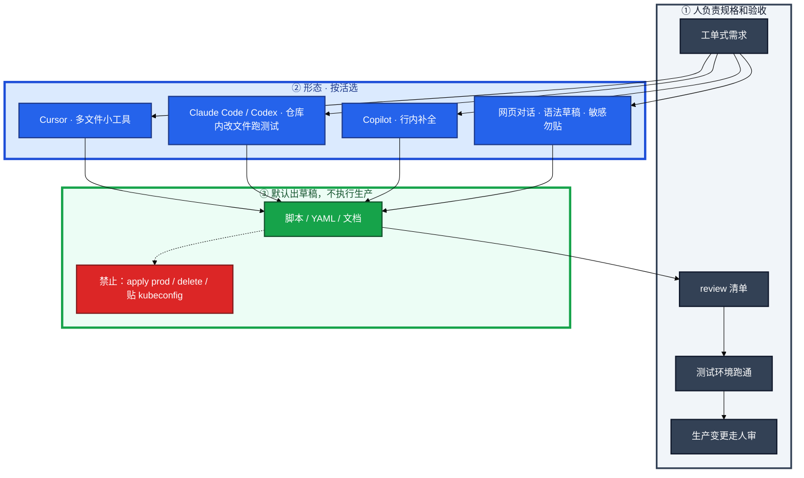
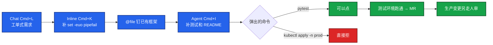
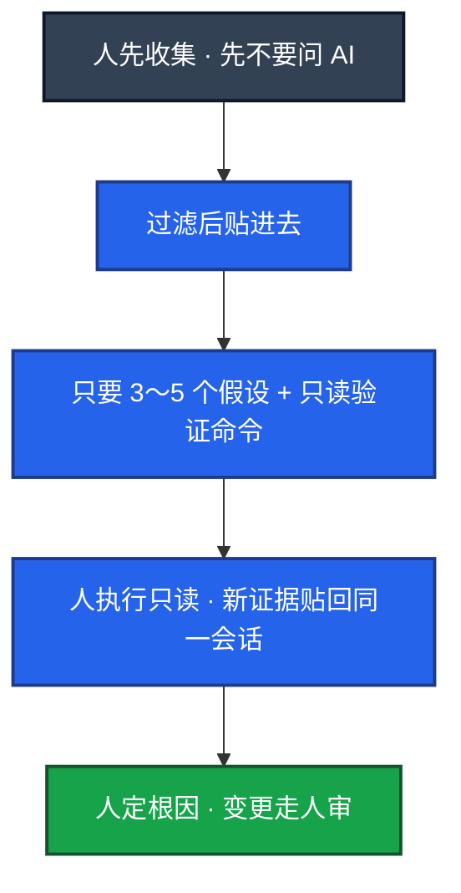
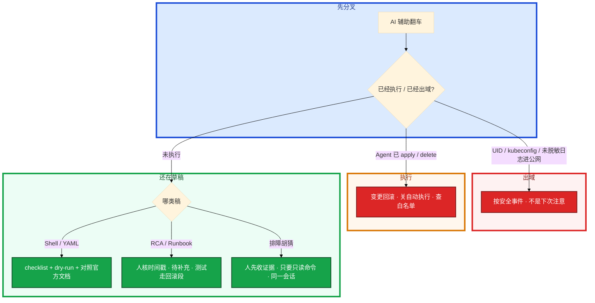

# AI 工具实战与 Vibe Coding


夜班要写一个 Nginx 日志统计、一份战斗服 Deployment、一封玩家通告，手写要两小时。随手把 kubeconfig 和玩家 UID 贴进网页对话框，或者把模型给的 `kubectl delete` 直接敲上生产——这就是这一章要挡住的现场。

先别开 Agent 自动执行。这一章后半全是你会动手的：**Cursor 怎么把巡检脚本从开口做到进仓库、Claude Code 怎么批量改 10 个脚本、排障怎么先收证据再问模型、review 清单怎么当验收。** 前面的概念，是为了让你动手时不把「提效」理解成「不用懂、不用验」。

**读完你能：** 用一个完整故事讲清 Vibe Coding；会按形态选 Cursor / Copilot / Claude Code；会写工单式 prompt 和 `.cursorrules`；会把生成稿按 checklist 验收；知道什么绝不能交出去。

## 本章目录

缩进 = 上下级。3 下面才是 3.1。

想钉在**正文左边**跟着滚：菜单 **查看 → 打开视图 → 大纲**。Markdown 预览做不到独立左栏，目录只能写在文章开头。

- [1. 基本概念](#1-基本概念)
- [2. 架构图](#2-架构图)
- [3. 原理](#3-原理)
  - [3.1 工具怎么选](#31-工具怎么选按形态不背广告)
  - [3.2 Prompt 要像工单](#32-prompt-要像工单)
- [4. 安装部署](#4-安装部署)
  - [4.1 故事 A：Cursor 巡检脚本](#41-故事-a开服前夜用-cursor-交出大厅限流巡检)
  - [4.2 故事 B：Claude Code 批量改仓库](#42-故事-bclaude-code-给-10-个脚本补-dry-run)
  - [4.3 故事 C：排障只读辅助](#43-故事-c发版后-oom-先收证据再问)
- [5. 核心配置](#5-核心配置)
- [6. 常用命令](#6-常用命令)
- [7. 常用操作](#7-常用操作)
  - [7.1 写脚本 / YAML](#71-写脚本--yaml)
  - [7.2 文档草稿](#72-文档草稿事实和待补充分开)
  - [7.3 排障贴日志](#73-排障贴日志)
- [8. 生产排障](#8-生产排障)
- [9. 必会 · 常考](#9-必会--常考)
- [合上书](#合上书问自己)

**本章不讲：** token、温度、幻觉 → [01](../01-LLM与Transformer基础/)；四要素、注入、JSON → [02](../02-Prompt工程/)；用手册回答「上次怎么修」 → [03](../03-RAG检索增强/)；在 IDE 里调监控工具 → [04](../04-Function-Calling与Tool-Use/) / [05](../05-MCP协议/)；多步 Agent 护栏 → [06](../06-Agent智能体/)；本地 Ollama 试模型 → [08](../08-GPU与推理服务运维/)；告警摘要机器人 → [09](../09-AIOps落地/)。

---

## 1. 基本概念

Vibe Coding：用自然语言描述意图，模型生成代码和配置，**人 review、改、跑测试、再迭代**。你从「每个字符手敲」转到「把需求说清楚 + 把结果验清楚」。它不是「不用懂」。看不懂生成的 Shell，就不能在生产用。

开服前夜三份活一起到：大厅限流巡检脚本、告警摘要 bot 要的 JSON 模板、一份给值班看的「GPU 打满先看什么」小工具。以前翻 awk 手册两小时；现在把意图说清楚，Cursor 出初稿，你 review、测试环境跑通。

| 传统 | Vibe Coding |
|------|-------------|
| 需求 → 自己写逻辑 → 调试 | 需求说清楚（格式、约束、边界、dry-run）→ 模型出草稿 → 人 review + 测试环境跑 → 不行就同一会话追问 → 行则提交；生产变更另走人审 |

**效率在重复劳动，不在替你承担变更责任。** 生产数据、密钥、完整 kubeconfig **不出域**。网页 ChatGPT 当草稿箱可以，贴战斗服玩家表不行。AI 默认只读和草稿；写生产必须人批准。模型会幻觉——语法对、逻辑错、API 过时都常见。

告警摘要的 prompt 模板、错误检索的切块脚本、GPU 节点上的 `nvidia-smi` 采集，都可以 Vibe；`kubectl delete` 和把 UID 贴进公网对话框，不行。

进日常的顺序，风险从低到高：

```
  辅助写代码 → 辅助排障（只读）→ 文档草稿 → 自动执行（默认不准）
```

> **记住**：看不懂生成的代码就不能合入。看不懂就无法验收，等于把生产交给幻觉。Vibe Coding 提效的是重复劳动，终审仍是人和文档。

三条原则：① Prompt 当工单：格式、约束、边界写清。② 迭代，不幻想第一稿完美。③ 模型生成，人验证；生产相关清单比信任重要。效率讲「重复模板从两小时到半小时，时间在 review 和测试」。不讲「AI 替我值班」。吹 10 倍容易露馅。

---

## 2. 架构图

先把整张图钉住。后面三个落地故事、规则文件、排障都对着这张图说话。



图上三条线：

1. **没有箭头从模型指向生产集群。** Agent 可以建议命令，人点确认；`kubectl apply -n prod` 默认拒。
2. **同一会话保留上下文。** 新开窗口会把线索丢光。
3. **规则文件锁规范，但规则不是执行器。** 真正挡住 apply 的是命令白名单，和 04、06 同一层。

能跑命令的工具默认当危险品，白名单收紧。仓库若有生产 kubeconfig，关掉自动执行或限制命令白名单，或先挪走 / ignore。MCP 监控 Server 可以给 Cursor 连只读工具（05），不要把写权限 Server 挂进个人 IDE。

---

## 3. 原理

原理只保留动手和面试会用到的：按形态选工具、prompt 怎样才像能进仓库的工单。

**本节 2 块：** 3.1 选型 · 3.2 工单式 prompt

### 3.1 工具怎么选：按形态，不背广告

按你要干什么选形态，不要按宣传页选信仰。写巡检脚本用能吃多文件的编辑器；忘了 flag 用 CLI；敏感内容不要走公网对话。

**编辑器**

| 工具 | 形态 | 运维怎么用 |
|------|------|------------|
| Cursor | AI-first 编辑器，能吃多文件 | 写巡检工具、改一仓库脚本 |
| Windsurf | 同类 | 同左 |
| VS Code + Copilot | 补全 + Chat 插件 | 零散脚本、模板补全 |
| Cline 等 | 可带终端执行 | 更危险，权限收紧 |
| JetBrains AI | IDE 插件 | 本来就用 GoLand / PyCharm 时 |

**终端 Agent**

| 工具 | 怎么用 |
|------|--------|
| Codex（OpenAI） | 在仓库里改文件、跑测试 |
| Claude Code | 读代码、复杂重构、批量改文件 |
| Aider | 开源，和 git 绑得紧 |
| Copilot CLI | 忘了命令 flag 时 |

**对话**

ChatGPT / Claude：快速问语法、贴一段过滤后的日志要方向。  
Perplexity：要带引用的公开文档。  
DeepSeek：成本低、中文和代码够用。敏感内容不要走公网对话。

Cursor 理解整仓、能多文件改，适合「做一个小工具」；Copilot 补全体验好，适合「正在敲的这一行」。复杂仓库用 Cursor，零散补全用 Copilot，都可以，别争信仰。都是界面，背后仍要选模型、管出域、禁止 Agent 自动 apply 生产。

选错形态的典型现场：在网页对话框里贴完整 kubeconfig 写 Deployment；或让带终端执行的插件在 Agent 模式里 `kubectl apply -n prod`。

卡住先看：数据能不能出境（01）、要不要改多文件、能不能跑命令。开源可自托管时，敏感仓优先不出公网。

个人习惯可以是：结构思考在 Cursor Chat，批量改文件用 Claude Code / Agent，提交前自己看 diff。终端 Agent 仍禁止生产凭证进会话。Agent 自动 git commit 可以本地提交，但消息和 diff 人要看。**不要自动 push 主分支。**

### 3.2 Prompt 要像工单

差：「帮我写个健康检查脚本」。  
好：输入文件、每台做什么、超时、并发、失败输出、summary、`set -euo pipefail`、使用说明。这就是 02 的四要素落在编码上。

模型按 prompt 采样代码。prompt 像工单，输出才像能进仓库的草稿。漏掉 dry-run，测试环境一次误跑就会删数据。第一轮先拿到能跑的骨架再加选项，比一次完美稿容易验收。迭代是工作方式，不是失败。

生成后 checklist，当验收步骤走，不要当装饰：

1. `set -euo pipefail` 或语言等价物
2. 变量加引号
3. 失败有提示，不静默
4. 无硬编码密码和机器路径
5. 幂等：跑两遍别删两次（流水线会重试；删两次、加两次防火墙规则，本身就是事故）
6. 生产必须有 dry-run
7. 关键外部 API 对照官方文档（模型训练截止会过时）

能讲的坑比能背的快捷键加分：Shell 变量没加引号，测试环境碰巧能跑、hosts 里有空格就炸；Python 客户端停在旧版参数，上线才 400；K8s 1.28+ 的字段它还在用旧写法。所以 checklist 里「对照官方文档」不是空话。

---

## 4. 安装部署

三个可讲的落地故事。面试开口不要说「我用 ChatGPT」，按 A → B → C 讲时间线、你点了什么、拒了什么、测试环境怎么验。

### 4.1 故事 A：开服前夜用 Cursor 交出大厅限流巡检

**背景（20 秒）：** 活动前要一份大厅限流巡检：hosts 列表、每台 `systemctl is-active nginx`、超时 3s、并发 10、失败写 `failed.txt`、最后 summary、必须 dry-run。仓库里已有巡检框架，也有一份不该存在的 prod kubeconfig。

**你怎么做（可按键讲）：**



| 能力 | 常见操作 | 这一步干什么 |
|------|----------|--------------|
| Chat | Cmd+L | 把工单贴进去：路径、超时、并发、失败文件、`set -euo pipefail`、dry-run 开关 |
| Inline Edit | Cmd+K | 只改选中段：漏掉的引号和 `set -euo pipefail` |
| @ 引用 | `@file` `@folder` | 钉住已有巡检框架，少让它另起一套风格（和 02 分隔数据同一件事） |
| Agent / Composer | Cmd+I | 多文件：补测试和 README；列将要改的文件和将要跑的命令，等人点 |
| 规则 | `.cursorrules` | 生成时自动带上团队红线 |

**你眼睛看到什么才算过：**

1. 生成稿开头有 `set -euo pipefail`；`--dry-run` 默认开；没有写死密码。
2. Agent 面板列出将改的文件。弹「将执行 pytest」可以点；弹 `kubectl apply -n prod` 直接拒。
3. 测试环境跑通再提 MR。生产变更不在 Cursor 会话里完成。
4. 仓库里的 prod kubeconfig 若仍能被 Agent 读到，先挪走或 ignore，再谈效率。

同一会话保留上下文，迭代比新开窗口稳。规则文件在生成时自动带上红线，但规则不是执行器——真正挡住 apply 的是命令白名单。

没有点确认就 apply 到生产，是配置错误，不是功能。

### 4.2 故事 B：Claude Code 给 10 个脚本补 dry-run

**背景（20 秒）：** 仓库里 10 个巡检脚本都能跑，但没有 `--dry-run`，流水线重试会把「清理」跑两遍。要批量改文件并跑测试，不是从零生成一个小工具。

**你怎么做：**

1. 终端 Agent（Claude Code / Codex / Aider）在 repo 里读现有脚本和测试，提出统一加 `--dry-run`、默认开、幂等。
2. 它改文件、跑 `pytest` / 脚本自测。Aider 和 git 绑得紧，diff 按提交看。
3. **人看完整 diff**：有没有误改生产路径、有没有把 kubeconfig 写进脚本、commit message 是否像人写的。
4. 可以本地 commit，不要自动 push 主分支。
5. 生产凭证不进会话。敏感仓优先自托管 / 不出公网。

和故事 A 的分工：结构思考、单文件打磨在 Cursor Chat / Inline；跨 10 个文件的机械改动用终端 Agent。仍禁止 `kubectl apply -n prod` 进白名单。

**讲的时候要有的细节：** 「10 个脚本、统一 dry-run、我拒了自动 push、diff 里修了两处把 `rm -rf` 写死路径的幻觉」。没有 diff、没有拒绝，就像没做过。

### 4.3 故事 C：发版后 OOM，先收证据再问

**背景（20 秒）：** 发版 v1.2.3 后三分钟 `gw-1` OOMKilled。有人先问网页对话框「出问题了怎么办」。模型没有你的集群。

**正确顺序：**



1. 人先 `kubectl -n game describe po gw-1`、截故障前后 5 分钟、记下刚发的 v1.2.3。不要开场丢一句「登录挂了怎么办」。
2. Chat 里指定输出：3～5 个假设，每个配一条只读验证命令，不要写操作。背景写清：游戏服、3 副本、刚发 v1.2.3，时间窗 10:28–10:35。
3. 人跑 get / describe / logs / PromQL，把新证据贴回**同一会话**。「上次怎么收」就 @ 手册或走 RAG（03），不要闭卷。
4. GPU TTFT 那条另贴 `nvidia-smi` 和排队长度，按 08 拆刀，不要让模型发明删 Deployment。
5. 「可能是泄漏」是待证假说。delete / apply / scale 不在自动路径。不确定就当写入。

网页对话框当语法草稿箱可以。战斗服玩家 UID、kubeconfig、未脱敏支付日志贴进去就是出域，走安全事件，不是「下次注意」。内网本地模型仍要最小必要和脱敏：落盘、越权、截图外传都还在。

不要换成「Agent 你自己 kubectl」。开服夜排障在 Cursor 里也走同一套。

---

## 5. 核心配置

`.cursorrules`（或项目规则）运维底稿，按仓库改。规则在生成时自动带上，但挡不住白名单外的执行——两者都要。

```
- Shell 必须 set -euo pipefail
- Python 必须有日志和错误处理
- K8s YAML 必须有 resources limits
- 生产脚本必须有 dry-run
- 密钥从环境变量读，禁止写死
- 不要生成会直接改生产集群的命令；只给只读或带确认的草稿
```

| 项 | 生产怎么用 | 改错会怎样 |
|----|------------|------------|
| Agent 自动执行 | 关，或命令白名单：本地 `pytest` 可以 | `kubectl apply -n prod` 被点过就等于事故 |
| 仓库凭证 | 不要放生产 kubeconfig；Agent 可读则先挪走 | 多文件任务把家底读进上下文 |
| MCP | 只连只读监控 Server（05） | 写权限 Server 挂进个人 IDE |
| 出网 | 敏感仓不出公网对话 / 公有 API | UID、token 进网页历史 = 已出域 |
| 会话 | 同一会话迭代 | 每个新线索新开窗口，上下文丢光 |

> **记住**：Cline 等可带终端执行的插件更危险，权限收紧。能跑命令的工具默认当危险品。

---

## 6. 常用命令

Cursor 快捷键当成值班会按的键；验收用仓库里的命令，不要用「感觉能跑」。

| 目的 | 命令 / 键 | 看什么 |
|------|-----------|--------|
| Chat | Cmd+L | 新文件草稿、解释、工单式生成 |
| Inline | Cmd+K | 只改选中那段 |
| Agent | Cmd+I | 将改的文件、将跑的命令，等人点 |
| 钉上下文 | `@file` `@folder` | 少让它猜 |
| 客户端验 YAML | `kubectl --dry-run=client -f ...` | 对照规范，不是 apply |
| 测脚本 | 测试环境跑；`--dry-run` 默认开 | 失败可见、幂等 |
| 看改动 | `git diff`；终端 Agent 的 diff | 人过再 commit |
| 探 GPU 现场 | 贴 `nvidia-smi` 数字，不贴删 Deployment | 见 08 |

```bash
kubectl --dry-run=client -f deploy.yaml
# 生产脚本
./check-nginx.sh --dry-run
git diff
```

CI：描述 GitHub Actions / Jenkinsfile 步骤让它出 YAML；Dockerfile 多阶段让它改完你再 build。流水线里的生产部署凭证不要放进 prompt。

---

## 7. 常用操作

### 7.1 写脚本 / YAML

K8s YAML 有 limits、探针、`terminationGracePeriodSeconds`、PDB、反亲和。让它「找这份 YAML 的生产问题」往往比从零生成更有价值。GPU 推理 Deployment 的探针 delay 必须大于权重加载时间（08），模型不一定知道你们的加载要几分钟，人要改。

工单示例（生成 Deployment）：

```
生成 Deployment：镜像 game-server:v1.2.3，副本 3，
CPU 100m/500m，内存 256Mi/512Mi，
HTTP /health :8080 初始延迟 10s，
terminationGracePeriodSeconds 60，
ConfigMap game-config 挂到 /app/config。
再给 HPA（CPU 70%，3～10）、PDB minAvailable=2、跨 AZ 反亲和。
不要包含会立刻 apply 到生产的命令。
```

巡检脚本第一轮：遍历所有 ns 的 Deployment；检查无 limits、副本为 0；输出 `ns/deploy/container/问题`；`--namespace` 过滤；API 不可达要友好错误；用官方客户端。第二轮：`--dry-run`、`--output json`、`--verbose`。Review：依赖是否安装、in-cluster 还是本地 kubeconfig、连接失败、输出格式、有没有写操作（巡检不应写）。

自己 `kubectl --dry-run=client` 和对照规范。脚本开头有 `set -euo pipefail`；关键步骤先打印将要做什么；密钥从环境变量读。

### 7.2 文档草稿：事实和待补充分开

RCA：给时间线和已确认根因，让它按影响 / 时间线 / 根因 / 止血 / 改进项写；未知标「待补充」，禁止编造时间点。开服夜的告警摘要可以当时间线原料，不能当已确认根因。人核时间戳。不能自动发群。

Runbook：前置检查、步骤、验证、回滚。错误检索用的 SOP 从这里来，写错会污染 RAG（03）。生成后第一件事：测试环境按步骤走一遍，验证回滚段是真能执行的命令。过期页要下架，否则下次错误检索开卷考旧卷。GPU 相关 Runbook 若写「先删业务 Deployment」，人审时改成「先 nvidia-smi、先 cordon」。

玩家通告：不写内部组件名，只写影响和补偿口径，法务/运营过目。

架构说明：组件列表你提供，它排段落，你对图。

文档幻觉会进 wiki 变成「现行 SOP」。草稿必须人过。

### 7.3 排障贴日志

给时间范围；给背景（游戏、副本数、刚发版）；先 grep 再贴；指定输出格式；同一会话迭代。几百 MB 整文件会打爆窗口（01）。超长走切分或 RAG（01、03）。不要每次新开窗口丢上下文。

监控图：能导出数值更好；截图依赖多模态且可能出域。优先贴查询结果数字。

---

## 8. 生产排障

这里的「排障」是 Vibe 流程本身翻车：贴出域、Agent 自动执行、幻觉进仓库、文档编造时间点。



| 行为 | 为什么不行 | 先做什么 |
|------|------------|----------|
| 直接执行它给的生产命令 | 幻觉 flag、错误 namespace | 只读或测试环境；写走人审 |
| 玩家数据、密钥、未脱敏日志打到公有 API | 出域 | 安全事件 |
| 无监督 Agent 改生产配置 | 不可控变更 | 关自动执行 / 白名单 |
| 用它当唯一安全审计 | 漏报 | 人和工具链 |
| 用它替代测试和对照官方文档 | 过时 API、错的默认值 | checklist 第 7 条 |
| 200MB 日志整文件丢进去 | 窗口爆、胡猜 | 时间窗 + grep |
| 模型补了没发生过的回滚时间进 wiki | 幻觉变 SOP | 人核；未知标待补充；过期下架 |

原则：AI 是助手不是决策者；prompt 越具体越好；同一会话里迭代；验证后再执行。进团队流程靠 **模板化 prompt + review 清单**，不是靠每个人会聊天。

网页对话框历史里出现 UID、token、kubeconfig——已经出域。Agent 自动执行了 `kubectl delete`——护栏没开。告警摘要、错误检索、GPU 排障三条线，模型都可以出草稿，都不能直接改集群。

---

## 9. 必会 · 常考

白板和追问高频，能一口回：

| 说法 | 对错 | 口径 |
|------|:----:|------|
| Vibe Coding 就是不用懂代码 | 错 | 看不懂就不能合入 |
| 效率可以讲「AI 替我值班 / 10 倍」 | 错 | 讲重复模板从两小时到半小时，时间在 review |
| Cursor 和 Copilot 必须站队 | 错 | 按形态：多文件小工具 vs 行内补全 |
| Agent 模式弹 apply prod 可以点 | 错 | 本地 pytest 可以；生产 apply 拒 |
| 规则文件能挡住执行 | 错 | 规则锁生成；白名单才挡执行 |
| 排障开场问「挂了怎么办」 | 错 | 人先收证据，只要只读验证命令 |
| 生成稿可以当唯一安全审计 | 错 | 漏报；人和官方文档是终审 |
| 内网本地模型就可以贴玩家表 | 错 | 仍要最小必要和脱敏 |
| 第一轮就把所有需求堆进 prompt | 错 | 先骨架再加选项，迭代是工作方式 |
| 终端 Agent 自动 push 主分支 | 错 | 本地 commit 可以，diff 人看 |
| Runbook 生成完直接进 wiki | 错 | 测试环境走一遍回滚段；人过；过期下架 |
| 把 200MB 日志整文件丢进窗口 | 错 | 时间窗、grep、同一会话 |

数字与口令：进流程顺序 写代码 > 只读排障 > 文档 > 自动执行（默认禁止）；Cursor Cmd+L / K / I；脚本 checklist 七条；dry-run 默认开；故事 A/B/C 各有一次「拒绝」。

易混：Chat 出新文件 vs Inline 改选中段 vs Agent 多文件跑命令；规则 vs 白名单；待证假说 vs 根因；网页草稿箱 vs 出域；Cursor 做小工具 vs Claude Code 批量改仓库。

---

## 合上书，问自己

1. Vibe Coding 的闭环是什么？人负责哪两头？自动执行默认准不准？
2. 故事 A：Cmd+L / K / I / `@file` 各干什么？弹 apply prod 怎么处理？kubeconfig 呢？
3. 故事 B：10 个脚本补 dry-run，人和终端 Agent 怎么分工？能不能自动 push 主分支？
4. 故事 C：发版 OOM 的五步顺序？「可能是泄漏」是什么？UID 贴进网页算什么？
5. 脚本 checklist 七条是哪七条？YAML 为什么常让模型找问题而不是从零生成？
6. 什么绝不能交给模型？文档幻觉进 wiki 怎么防？

六题都能口述，这一章就过了。下一章把 GPU 调度、显存账和推理框架剖开：先 `nvidia-smi`，别先删业务。
