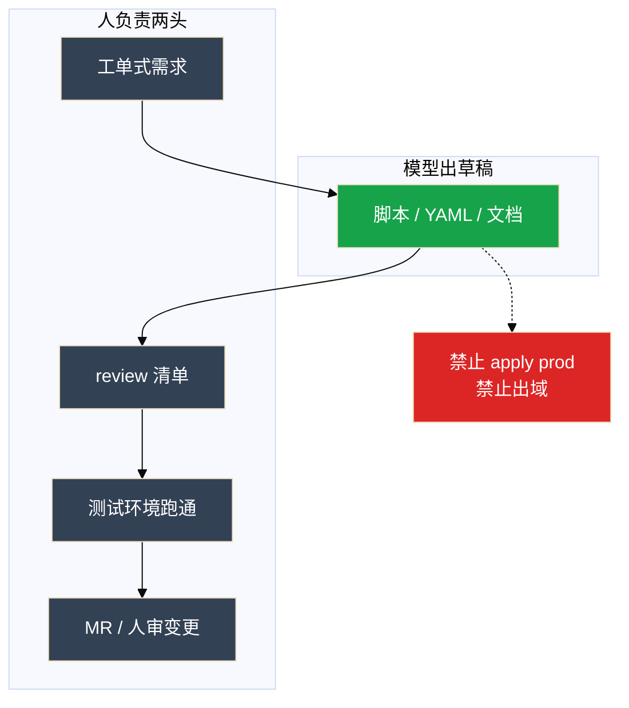
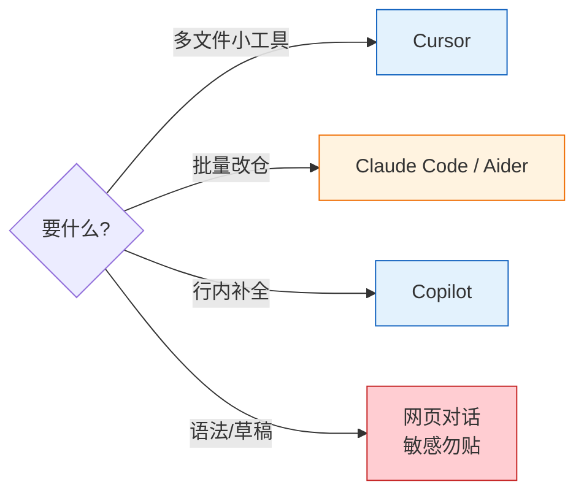
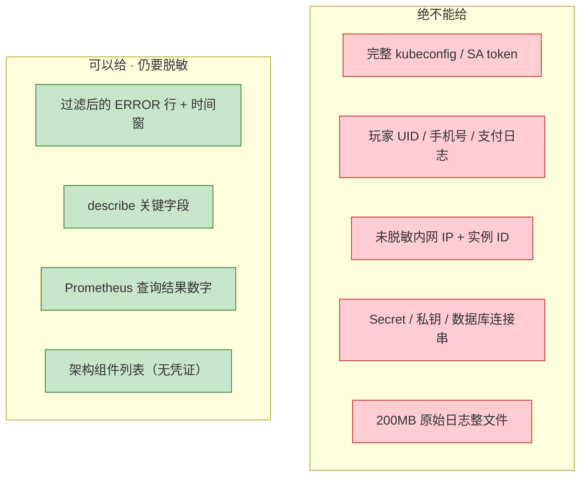
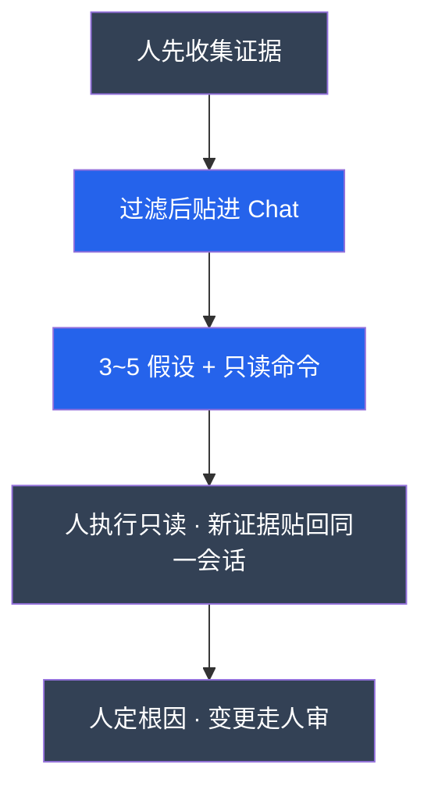

# 07｜AI 工具实战与 Vibe Coding

> **加分项定位**：面试测「会不会用 Cursor/CLI 提效，又会不会挡出域和自动执行」——讲完整故事比背快捷键加分。  
> **红线**：生产数据/密钥/kubeconfig 不出域；生成稿必须 review；**默认不自动 apply/delete**；看不懂的代码不能合入。

---

## 面试怎么考

| 频率 | 典型问法 | 30 秒要点 | 2 分钟要点 |
|:----:|----------|-----------|------------|
| ★★★★★ | 什么是 Vibe Coding？ | 自然语言出草稿，人 review+测试+迭代；提效重复劳动，不替值班 | 人负责工单式需求和验收清单；模型出脚本/YAML/文档草稿；生产变更走人审 |
| ★★★★★ | Cursor / Copilot / Claude Code 怎么选？ | 多文件小工具用 Cursor；行内补全 Copilot；批量改仓用终端 Agent | 按形态选，不站队；敏感仓不出公网；能跑命令的工具默认危险品 |
| ★★★★ | 用 AI 写运维脚本要注意什么？ | checklist 七条；dry-run 默认开；对照官方文档 | `set -euo pipefail`、幂等、无硬编码密钥；测试环境跑通再 MR |
| ★★★★ | 什么绝不能交给模型？ | kubeconfig、UID、未脱敏日志、Secret；自动 apply prod | 出域=安全事件；Agent 弹 apply 直接拒；内网模型仍要最小必要 |
| ★★★★ | 排障怎么用 AI？ | 人先收证据；只要 3~5 假设+只读命令；同一会话迭代 | 不要开场「挂了怎么办」；delete/apply 不在自动路径；RAG 查手册不闭卷 |
| ★★★ | `.cursorrules` 能挡住生产变更吗？ | 不能 alone；规则锁生成，白名单才挡执行 | 和 04、06 同一层：命令白名单、关自动执行 |

---

## SRE 边界

| 该用 | 禁止 |
|------|------|
| Cursor Chat/Agent 写巡检脚本、改 YAML 草稿 | 贴完整 kubeconfig / 玩家 UID 到公有云对话 |
| Claude Code / Codex 批量改仓库、跑 `pytest` | 终端 Agent 自动 `kubectl apply -n prod` |
| Copilot 行内补全零散脚本 | 无监督 Agent 改生产配置 |
| 工单式 prompt：格式、约束、边界、dry-run | 200MB 日志整文件丢进窗口 |
| review checklist 当验收步骤 | 生成稿当唯一安全审计 |
| MCP 只连 **只读** 监控 Server（05） | 写权限 MCP Server 挂进个人 IDE |
| 本地 commit + 人看 diff | 自动 push 主分支 |
| 文档草稿：未知标「待补充」 | Runbook 生成完直接进 wiki 当 SOP |

---

## 原理讲透

### 3.1 Vibe Coding 闭环

**一句话**：需求说清楚 + 结果验清楚；效率在重复劳动，不在替你承担变更责任。



| 传统 | Vibe Coding |
|------|-------------|
| 需求 → 手写 → 调试 | 需求写清 → 模型草稿 → review + 测试 → 迭代 → 合入 |
| 人承担全部编码 | 人承担 **规格 + 验收 + 变更责任** |

**进团队顺序（风险从低到高）**：

```
辅助写代码 → 辅助排障（只读）→ 文档草稿 → 自动执行（默认禁止）
```

> **记住**：看不懂生成的代码就不能合入。模型会幻觉——语法对、逻辑错、API 过时都常见。

---

### 3.2 工具形态：Cursor / Copilot / CLI Agent

**一句话**：多文件小工具用 Cursor；忘了 flag 用 CLI；敏感内容不走公网对话。

**编辑器类**

| 工具 | 形态 | 运维怎么用 |
|------|------|------------|
| **Cursor** | AI-first 编辑器，多文件上下文 | 写巡检工具、改一仓库脚本；Cmd+L/K/I |
| **VS Code + Copilot** | 补全 + Chat 插件 | 零散脚本、行内补全 |
| **Windsurf / Cline** | 同类，Cline 可带终端 | Cline 更危险，权限收紧 |

**终端 Agent 类**

| 工具 | 怎么用 |
|------|--------|
| **Claude Code** | 读代码、复杂重构、批量改 10+ 文件 |
| **Codex / Aider** | 仓库内改文件、跑测试；Aider 和 git 绑得紧 |
| **Copilot CLI** | 快速查命令 flag |

**网页对话**

ChatGPT / Claude / DeepSeek：语法草稿、过滤后日志要方向。**敏感内容不要走公网。**



**分工口诀**：

- 结构思考、单文件打磨 → Cursor Chat / Inline
- 跨 10 个文件机械改动 → 终端 Agent
- 仍禁止 `kubectl apply -n prod` 进白名单

---

### 3.3 Cursor 能力地图

**一句话**：Chat 出骨架，Inline 改局部，Agent 多文件，@ 引用钉上下文。

| 能力 | 快捷键 | 干什么 |
|------|--------|--------|
| Chat | Cmd+L | 工单式生成新文件、解释 |
| Inline Edit | Cmd+K | 只改选中段：引号、`set -euo pipefail` |
| Agent / Composer | Cmd+I | 多文件补测试/README；**列将改文件和将跑命令** |
| @ 引用 | `@file` `@folder` | 钉已有框架，少另起一套风格 |

Agent 面板弹出「将执行 pytest」可以点；弹出 `kubectl apply -n prod` **直接拒**。没有点确认就 apply 到生产，是配置错误，不是功能。

同一会话保留上下文，迭代比新开窗口稳。仓库若有 prod kubeconfig 能被 Agent 读到，先挪走或 `.cursorignore`，再谈效率。

---

### 3.4 Prompt 要像工单

**一句话**：漏 dry-run、漏超时并发，测试环境一次误跑就会删数据。

**差**：「帮我写个健康检查脚本」

**好**：

```
输入：hosts 列表文件
每台：systemctl is-active nginx，超时 3s
并发：10
失败：写入 failed.txt
结束：打印 summary
Shell：set -euo pipefail
必须：--dry-run 默认开
不要：硬编码密码；不要 apply 生产命令
```

这就是 02 四要素落在编码上：Role（巡检脚本）、Task、Context（已有框架 @file）、Format（输出结构）。

**迭代策略**：第一轮拿能跑的骨架，第二轮加 `--output json`、`--verbose`；不要一次堆完美稿。

---

### 3.5 Review Checklist（验收七条）

**一句话**：checklist 是验收步骤，不是装饰；第 7 条「对照官方文档」不是空话。

| # | 检查项 | 常见翻车 |
|---|--------|----------|
| 1 | `set -euo pipefail` 或语言等价物 | 测试碰巧能跑，hosts 有空格就炸 |
| 2 | 变量加引号 | `"$var"` 漏引号 |
| 3 | 失败有提示，不静默 | 失败 exit 0 |
| 4 | 无硬编码密码和机器路径 | kubeconfig 写进脚本 |
| 5 | **幂等**：跑两遍别删两次 | 流水线重试变事故 |
| 6 | 生产脚本必须有 **dry-run** | 清理脚本误跑 |
| 7 | 关键 API 对照官方文档 | K8s 1.28+ 字段模型还在用旧写法 |

**YAML 为什么常让模型「找问题」而不是从零生成？**

已有 Deployment 让模型 audit limits/探针/PDB/反亲和，往往比从零生成更有价值。GPU 推理 Deployment 探针 delay 必须大于权重加载时间（08），模型不一定知道你们的加载要几分钟。

**验证命令**：

```bash
kubectl --dry-run=client -f deploy.yaml
./check-nginx.sh --dry-run
git diff   # 终端 Agent 改动必须人过
```

---

### 3.6 什么 NOT 给模型

**一句话**：出域一次就是安全事件；不是「下次注意」。



| 行为 | 为什么不行 |
|------|------------|
| 贴 UID 到公有云 ChatGPT | 出域；进对话历史 |
| 仓库放 prod kubeconfig 给 Agent 读 | 多文件任务把家底读进上下文 |
| 内网本地模型贴玩家表 | 仍要最小必要；落盘/截图外传还在 |
| 直接执行模型给的生产命令 | 幻觉 flag、错误 namespace |
| 无监督 Agent 改 prod | 不可控变更 |
| 200MB 日志整文件 | 窗口爆（01）、胡猜、贵 |

**网页对话框历史里出现 UID/token/kubeconfig = 已出域**，走安全事件流程。

---

### 3.7 排障辅助：先证据后 AI

**一句话**：人先 `describe` / grep / 记版本；模型只给假设和只读验证命令。



**不要**：

- 开场「登录挂了怎么办」（模型没有你的集群）
- 「Agent 你自己 kubectl」
- delete / apply / scale 进自动路径
- 每次新开窗口丢上下文

**可以**：@ 手册或走 RAG（03）查「上次怎么收」；GPU 另贴 `nvidia-smi` 按 08 拆刀。

---

### 3.8 核心配置：`.cursorrules` 与白名单

**一句话**：规则锁生成规范；真正挡住 apply 的是命令白名单。

```
- Shell 必须 set -euo pipefail
- Python 必须有日志和错误处理
- K8s YAML 必须有 resources limits
- 生产脚本必须有 dry-run
- 密钥从环境变量读，禁止写死
- 不要生成会直接改生产集群的命令；只给只读或带确认的草稿
```

| 项 | 生产用法 | 改错会怎样 |
|----|----------|------------|
| Agent 自动执行 | 关，或白名单仅 `pytest` / `shellcheck` | apply prod 被点过 = 事故 |
| 仓库凭证 | 不放 prod kubeconfig | Agent 读进上下文 |
| MCP | 只连只读监控（05） | 写 Server 挂 IDE |
| 终端 Agent | 本地 commit 可以；**不自动 push main** | 幻觉 `rm -rf` 进主分支 |

---

## 落地场景

### 场景 A：Cursor 开服前夜交巡检脚本

**背景**：活动前要大厅限流巡检：hosts 列表、每台 `systemctl is-active nginx`、超时 3s、并发 10、失败写 `failed.txt`、summary、必须 dry-run。仓库有巡检框架，也有不该存在的 prod kubeconfig。

**时间线（面试可背）**：

1. Cmd+L：贴工单式需求 + `@file` 钉已有框架
2. Cmd+K：补 `set -euo pipefail` 和引号
3. Cmd+I Agent：补测试和 README；看将改文件列表
4. 弹 pytest → 可点；弹 `kubectl apply -n prod` → **拒**
5. 测试环境 `--dry-run` 跑通 → MR；生产变更另走人审
6. prod kubeconfig 先挪走或 ignore

**拒绝点**：apply prod；凭证进上下文。

### 场景 B：Claude Code 给 10 个脚本补 dry-run

**背景**：10 个巡检脚本缺 `--dry-run`，流水线重试会把清理跑两遍。

**做法**：

1. 终端 Agent 读现有脚本+测试，统一加 dry-run、默认开、幂等
2. 跑 `pytest` / 脚本自测
3. **人看完整 diff**：有无误改生产路径、有无 kubeconfig 写进脚本
4. 可本地 commit，**不自动 push 主分支**

**讲时要有的细节**：「10 个脚本、统一 dry-run、我拒了自动 push、diff 里修了两处幻觉 `rm -rf` 写死路径」。

### 场景 C：发版后 OOM，先收证据再问

**背景**：发版 v1.2.3 后三分钟 `gw-1` OOMKilled。

**顺序**：

1. 人先 `kubectl describe`、截故障前后 5 分钟、记 v1.2.3
2. Chat：背景 + 脱敏日志；要 3~5 假设，每个配只读验证命令
3. 人跑 get/describe/logs/PromQL，新证据贴回**同一会话**
4. 「可能是泄漏」= 待证假说；变更走人审

---

## 口述模板

### 【30 秒】

「Vibe Coding 是用自然语言出代码草稿，人负责工单式需求和 review checklist 验收。Cursor 做多文件小工具，Copilot 补全，Claude Code 批量改仓。脚本七条 checklist，dry-run 默认开。kubeconfig、UID、未脱敏日志绝不能给公有云模型。Agent 弹 apply prod 直接拒。排障先人收证据，只要只读命令。提效重复劳动，不替值班。」

### 【2 分钟】

「闭环是：需求写清格式约束边界 → 模型出草稿 → checklist 验收 → 测试环境跑通 → MR，生产变更走人审。按形态选工具：Cursor Cmd+L/K/I 和 @file；批量改仓用 Claude Code；敏感仓不出公网。prompt 像工单，漏 dry-run 测试环境会误跑。七条 checklist 含幂等和对照官方文档。绝不能给 kubeconfig、UID、Secret、200MB 整日志。`.cursorrules` 锁规范，白名单才挡执行。排障先 describe 再 AI，同一会话迭代，delete/apply 不在自动路径。文档草稿未知标待补充，Runbook 进 wiki 前要测试回滚段。」

### 【常见追问】

| 追问 | 答法 |
|------|------|
| Vibe = 不用懂代码？ | 错；看不懂不能合入 |
| Cursor vs Copilot 站队？ | 按形态；多文件 vs 行内 |
| 规则文件能挡 apply？ | 不能 alone；白名单挡执行 |
| 内网模型能贴玩家表？ | 仍要最小必要和脱敏 |
| 效率怎么讲不加倍？ | 重复模板 2h→30min，时间在 review |

---

## 必会 · 常考

### 对错表

| 说法 | 对错 | 纠正 |
|------|:----:|------|
| Vibe Coding = 不用懂代码 | ✗ | 看不懂不能合入 |
| 可以讲「AI 替我值班 / 10 倍」 | ✗ | 讲 review 时间，不讲替值班 |
| Cursor / Copilot 必须站队 | ✗ | 按形态选 |
| Agent 弹 apply prod 可以点 | ✗ | 拒；pytest 可以 |
| 规则文件能挡住执行 | ✗ | 白名单才挡 |
| 排障开场「挂了怎么办」 | ✗ | 人先收证据 |
| 生成稿 = 唯一安全审计 | ✗ | 人和官方文档终审 |
| 内网模型可贴玩家表 | ✗ | 最小必要+脱敏 |
| 终端 Agent 自动 push main | ✗ | diff 人看 |
| Runbook 生成完直接进 wiki | ✗ | 测试回滚段；人过 |
| 200MB 日志整文件丢窗口 | ✗ | 时间窗+grep |
| MCP 写 Server 挂 IDE 方便 | ✗ | 只读监控 |

### 易混

| A | B | 区分 |
|---|---|------|
| Chat 新文件 | Inline 改选中 | Cmd+L vs Cmd+K |
| Agent 多文件 | 终端 Agent 批量改仓 | Cursor vs Claude Code |
| 规则文件 | 命令白名单 | 锁生成 vs 挡执行 |
| 待证假说 | 已确认根因 | AI 输出 vs 人签字 |
| 网页草稿箱 | 出域 | 语法可以；UID 不行 |
| 本地 commit | 自动 push main | 可以 vs 禁止 |

### 数字与口令

| 项 | 参考 |
|----|------|
| 进流程顺序 | 写代码 > 只读排障 > 文档 > 自动执行（禁） |
| Cursor | Cmd+L Chat / Cmd+K Inline / Cmd+I Agent |
| checklist | 7 条 |
| dry-run | 生产脚本默认开 |

---

## 合上书，问自己

1. Vibe Coding 闭环是什么？人负责哪两头？
2. Cursor / Copilot / Claude Code 各适合什么活？
3. 脚本 review checklist 七条是哪七条？
4. 什么绝不能交给模型？出域后怎么处理？
5. 故事 A/B/C 各有一次「拒绝」是什么？
6. `.cursorrules` 和白名单各挡什么？排障正确顺序是什么？

---

**本章不讲**：token/幻觉机制 → [01 LLM 基础](../01-LLM与Transformer基础/)；Prompt 四要素 → [02 Prompt](../02-Prompt工程/)；RAG 手册 → [03 RAG](../03-RAG检索增强/)；IDE 调监控 → [04 FC](../04-Function-Calling与Tool-Use/) / [05 MCP](../05-MCP协议/)；多步 Agent 护栏 → [06 Agent](../06-Agent智能体/)；Ollama/vLLM → [08 GPU](../08-GPU与推理服务运维/)；告警 bot → [09 AIOps](../09-AIOps落地/)。
