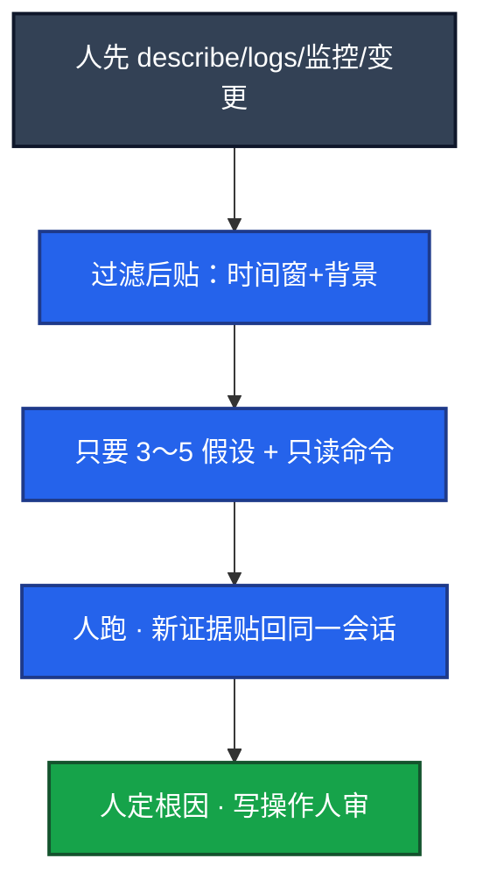

# 07｜AI 工具实战与 Vibe Coding · 练习题

先自己画图或口述，再对照解答。每题标了覆盖范围：

| 标记 | 含义 |
|------|------|
| **核心** | 不懂整章就没建立起来 |
| **必会** | 值班和面试都要能讲 |
| **常用** | 线上会反复碰到 |
| **常考** | 白板和追问的高频口径 |

## 本题目录

- [Q1 Vibe Coding 完整例子](#q1)
- [Q2 Cursor 键位与选型](#q2)
- [Q3 故事 A 巡检脚本](#q3)
- [Q4 故事 B Claude Code](#q4)
- [Q5 故事 C 排障](#q5)
- [Q6 什么不能交](#q6)
- [Q7 脚本 / YAML checklist](#q7)
- [Q8 文档与 RCA](#q8)
- [Q9 原则与效率怎么讲](#q9)
- [合上书](#合上书)

---

## Q1

**★★★★★｜怎么用 AI 提运维效率？讲一个完整例子。**

**覆盖**：核心 · 必会 · 常考

### 场景

开场就要具体例子，不要「我用 ChatGPT」。

### 完整解答

Vibe Coding：说清意图 → 模型出草稿 → 人 review / 测试环境跑 → 迭代。写巡检脚本最能讲清。人负责规格和验收；生产变更另走人审。敏感数据不出域。

```
  1. 描述：遍历 Deployment，找无 limits / 副本为 0，输出 ns/name/问题，支持 --namespace
  2. 生成初版
  3. Review：错误处理、无硬编码、kubeconfig 加载
  4. 迭代：加 --dry-run、--output json、verbose
  5. 测试环境跑通再合入
```

以前手写两小时的模板活，现在半小时到一小时，时间花在验收。进流程顺序：写代码 → 只读排障 → 文档 → 自动执行（默认禁止）。

### 再追问

生成代码质量怎么保证？——checklist：`set -euo pipefail`、引号、dry-run、无密钥、幂等、对照官方 API。不直接上生产。踩过的坑：Shell 作用域/引号、过时 Python 参数、旧 K8s 字段。看不懂就不能合入。

---

## Q2

**★★★★★｜Cursor 怎么用？和 Copilot 怎么选？**

**覆盖**：核心 · 必会 · 常考

### 场景

「你日常编码助手是哪个？」有人站队吵架。另有人 Agent 模式直接 apply 生产。

### 完整解答

按形态，不背广告。Cursor：Cmd+L Chat，Cmd+K 改选中段，Cmd+I 多文件 Agent，`@file` 钉上下文，规则文件锁规范。Copilot 是插件补全，融入 VS Code 好。复杂小工具仓库用 Cursor；零散补全用 Copilot。都是界面，背后仍要选模型、管出域、禁止 Agent 自动 apply 生产。

`.cursorrules` 底稿：Shell `set -euo pipefail`、Python 有日志、YAML 有 limits、生产脚本 dry-run、密钥走环境变量、不生成直接改生产的命令。规则锁生成，**白名单才挡执行**。

Agent 模式：关自动执行或命令白名单。本地 `pytest` 可以，`kubectl apply -n prod` 不行。仓库里不要放生产 kubeconfig；能被 Agent 读到就先挪走。MCP 只连只读 Server。Cline 等带终端执行的更危险。

### 再追问

Chat / Inline / Agent 眼睛看到什么不同？——Chat 出新文件草稿；Inline 只改选中那段；Agent 列将改文件和将跑命令，等人点。没有点确认就 apply 是配置错误，不是功能。

---

## Q3

**★★★★★｜故事 A：开服前夜用 Cursor 交出大厅限流巡检。按键讲一遍。**

**覆盖**：核心 · 必会 · 常考

### 场景

活动前要巡检：hosts、`systemctl is-active nginx`、超时 3s、并发 10、失败写 `failed.txt`、dry-run。仓库有旧框架，还有一份 prod kubeconfig。

### 完整解答

1. Chat（Cmd+L）贴工单式需求，含 `set -euo pipefail`、dry-run 开关。
2. Inline（Cmd+K）改漏掉的引号和 `set -euo pipefail`。
3. `@file` 钉住已有巡检框架，少另起风格。
4. Agent（Cmd+I）补测试和 README。弹 pytest 可点；弹 `kubectl apply -n prod` **直接拒**。
5. 测试环境跑通再提 MR。生产变更另走人审，不在 Cursor 会话里完成。
6. prod kubeconfig 先挪走或 ignore。

生成稿开头要有 `set -euo pipefail`；`--dry-run` 默认开；没有写死密码。同一会话迭代。

### 再追问

为什么第一轮不把所有需求堆进去？——先拿到能跑的骨架再加选项，比一次完美稿容易验收。迭代是工作方式，不是失败。

---

## Q4

**★★★★☆｜故事 B：Claude Code / 终端 Agent 给 10 个脚本补 dry-run。**

**覆盖**：必会 · 常用

### 场景

仓库里改 10 个脚本并跑测试。有人让 Agent 自动 push 主分支。

### 完整解答

终端 Agent（Codex / Claude Code / Aider）适合在 repo 里改文件、跑测试、和 git 集成（Aider）。与 Cursor 分工：结构思考在 Chat，批量改文件用终端 Agent，提交前自己看 diff。

人必须看到：统一 `--dry-run`、默认开、幂等；diff 里有没有幻觉路径 / 把 kubeconfig 写进脚本。可以本地 commit，消息和 diff 人要看。**不要自动 push 主分支。** 生产凭证不进会话。敏感仓优先自托管、不出公网。

讲的时候要有一次拒绝和一处幻觉被你改掉，否则像没做过。

### 再追问

Agent 自动 git commit 可以吗？——可以本地提交，不要自动 push 主分支。

---

## Q5

**★★★★★｜故事 C：发版 v1.2.3 后三分钟 OOM，怎么用 AI 辅助而不是让它指挥？**

**覆盖**：核心 · 必会 · 常用

### 场景

有人先问「出问题了怎么办」。另有人把 200MB 日志和玩家 UID 丢进网页对话框，并准备敲模型给的 delete。

### 完整解答



「可能是泄漏」是待证假说。get/describe/logs/PromQL 可跑；delete/apply/scale 不在自动路径。不确定就当写入。「上次怎么收」走 RAG / @手册，不要闭卷。GPU 贴 `nvidia-smi` 和排队，不要删 Deployment。不要换成「Agent 你自己 kubectl」。

贴日志：时间范围、背景（游戏、3 副本、刚发版）、先 grep、指定格式、同一会话。超长走切分或 RAG。监控优先贴数字，截图可能出域。

### 再追问

UID / kubeconfig 贴进网页？——已经出域，走安全事件，不是「下次注意」。内网本地模型仍要脱敏。

---

## Q6

**★★★★★｜哪些事明确不能交给模型？**

**覆盖**：必会 · 常考

### 场景

同事把 kubeconfig 和一段玩家 UID 日志贴进网页对话框，并把模型给的 delete 敲了生产。

### 完整解答

| 不能 | 原因 |
|------|------|
| 直接执行生产命令 | 幻觉 flag / 错误 ns |
| 玩家数据、密钥出域 | 合规 |
| 无监督改生产配置 | 不可控 |
| 当唯一安全审计 | 漏报 |
| 替代测试和官方文档 | 过时 API |

进流程顺序：写代码 → 只读排障 → 文档草稿 → 自动执行（默认禁止）。告警摘要、错误检索、GPU 排障都可以出草稿，都不能直接改集群。

### 再追问

内网本地模型就可以贴玩家表吗？——仍要最小必要和脱敏。落盘、越权、截图外传都还在。默认当敏感数据。

---

## Q7

**★★★★☆｜AI 写的 Shell / YAML 上线前 checklist？现场写一版巡检 prompt。**

**覆盖**：必会 · 常用

### 场景

脚本在个人机器能跑，生产路径有空格，变量没加引号。另一次要展示你会下规格。

### 完整解答

Checklist：`set -euo pipefail`；变量引号；失败可见；无硬编码密码路径；幂等；生产 dry-run；YAML 有 limits、探针、优雅退出。`kubectl --dry-run=client` 再对照规范。让模型「找这份 YAML 的生产问题」往往比从零生成更有用。GPU 探针 delay 必须大于权重加载（08），人要改。

巡检 prompt 第一轮：遍历所有 ns 的 Deployment；无 limits、副本为 0；输出 `ns/deploy/container/问题`；`--namespace`；API 不可达友好错误；官方客户端。第二轮：`--dry-run`、`--output json`、`--verbose`。Review：依赖、kubeconfig 来源、连接失败、输出格式、**巡检不应写**。

### 再追问

幂等为什么重要？——流水线会重试。删两次、加两次防火墙规则，本身就是事故。

---

## Q8

**★★★★☆｜文档和 RCA 怎么用 AI 而不把幻觉写进 wiki？**

**覆盖**：必会 · 常用

### 场景

模型补了没发生过的回滚时间，进了复盘页。GPU Runbook 写「先删业务 Deployment」。

### 完整解答

只给已确认时间线；未知标待补充；禁止臆造；人核时间戳。告警摘要可以当时间线原料，不能当已确认根因。玩家通告不写内部组件，运营过目。wiki 草稿必须人过，过期页下架（03）。不能自动发群。

Runbook 生成后第一件事：测试环境按步骤走一遍，验证回滚段是真能执行的命令。GPU Runbook 人审改成「先 nvidia-smi、先 cordon」。

### 再追问

架构说明？——组件列表你提供，它排段落，你对图。

---

## Q9

**★★★★☆｜Vibe Coding 三条原则？效率数字怎么讲才像真的？排障分流？**

**覆盖**：必会 · 常用 · 常考

### 场景

「心得」题。吹 10 倍容易露馅。另四个现场：出域、已 apply、Shell 幻觉、RCA 编时间。

### 完整解答

1. Prompt 当工单：格式、约束、边界写清。
2. 迭代，不幻想第一稿完美。
3. 模型生成，人验证；生产相关清单比信任重要。

效率讲「重复模板从两小时到半小时，时间在 review 和测试」。不讲「AI 替我值班」。

分流：已出域 → 安全事件；已执行生产命令 → 回滚 + 关自动执行；还在草稿 → checklist / 人核时间戳 / 人先收证据。进团队靠模板化 prompt + review 清单，不是靠每个人会聊天。

### 再追问

看不懂生成的代码能不能合入？——不能。等于把生产交给幻觉。

---

## 合上书

- [ ] 能用巡检脚本把 Vibe 闭环讲完，并说出进流程的风险顺序
- [ ] 能按形态选 Cursor / Copilot / Claude Code，并说出 Cmd+L / K / I、规则 vs 白名单
- [ ] 能按键讲故事 A（巡检）和故事 B（10 个脚本 dry-run），各有一次拒绝
- [ ] 能按五步讲故事 C（OOM 只读辅助），UID 出域当安全事件
- [ ] 能默写脚本 checklist 七条，并现场写巡检 prompt
- [ ] 能防文档幻觉进 wiki，能列出不能交给模型的五件事
