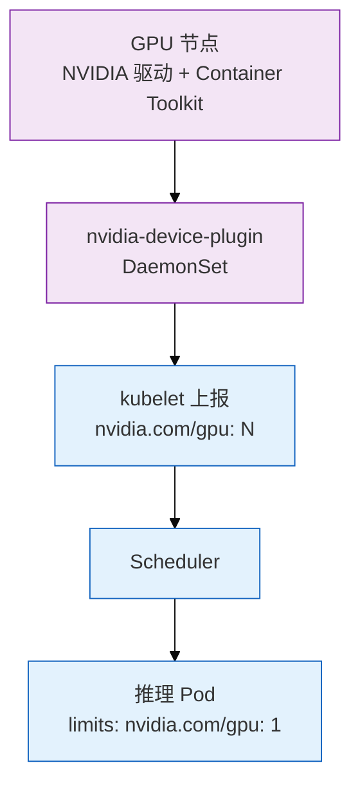
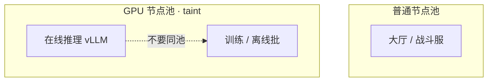
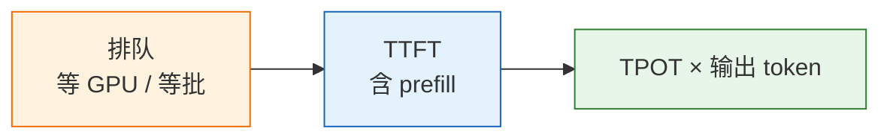
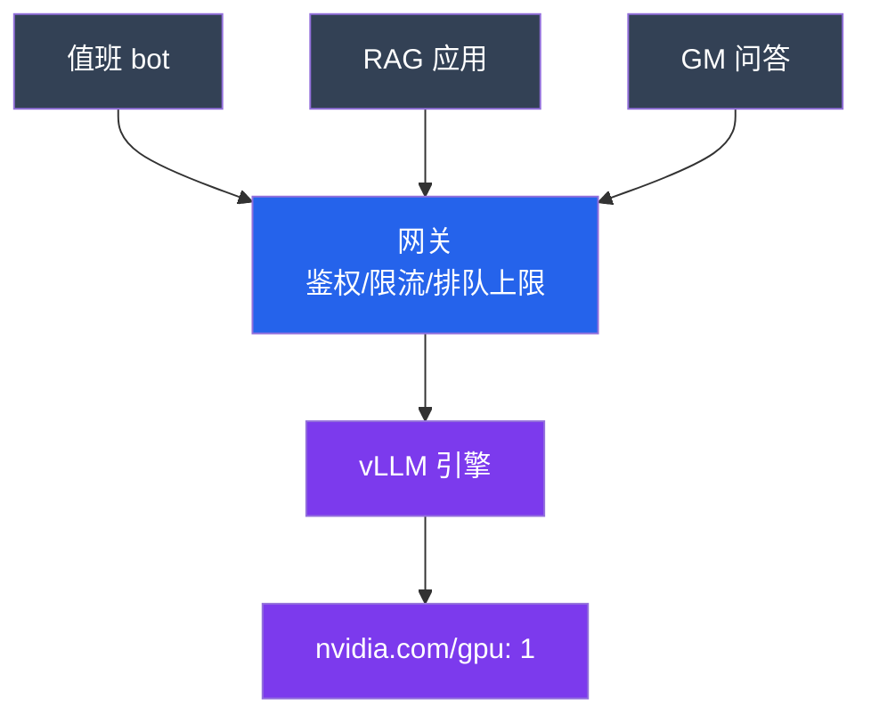
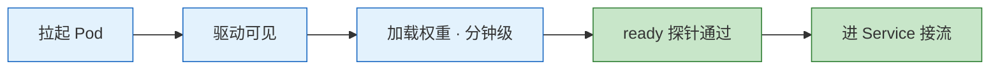
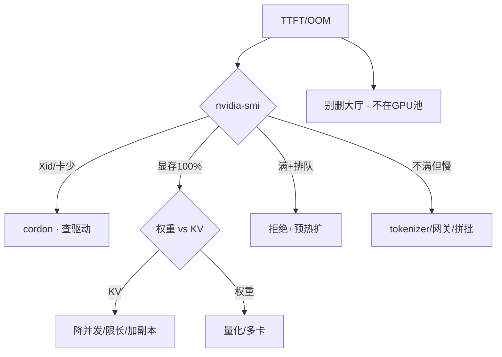

# 08｜GPU 与推理服务运维

> **加分项定位**：面试测「懂不懂推理服务不是拷模型文件」——调度、显存账、延迟拆解、引擎选型。  
> **红线**：删大厅腾不出 GPU；HPA 不能按 CPU 扩推理；Ollama 不扛活动峰值；权重钉版本禁 latest；**先 nvidia-smi，别先删业务**。

---

## 面试怎么考

| 频率 | 典型问法 | 30 秒要点 | 2 分钟要点 |
|:----:|----------|-----------|------------|
| ★★★★★ | K8s 怎么调度 GPU？ | Device Plugin 报 `nvidia.com/gpu`；整数卡或 MIG；独立池+taint | 不能像 CPU 写 0.3 卡；Scheduler 绑带 GPU 请求的 Pod；训练/推理分池 |
| ★★★★★ | 推理 OOM 怎么查？ | 显存≈权重+KV(并发×长度)；一放量就 OOM 常是 KV | 7B FP16≈14GB；72B≈144GB 仅权重；降并发/限长度/加副本；量化先质量回归 |
| ★★★★★ | TTFT / TPOT / 排队怎么拆？ | 排队等 GPU；TTFT 含 prefill；TPOT×输出 token | 先看网关队列；GPU 满+排队=真过载；流式不降低真实 TTFT |
| ★★★★ | vLLM 和 Ollama 怎么选？ | Ollama 试模型；活动 SLA 用 vLLM | continuous batching、PagedAttention、K8s 探针限流；Ollama 不按峰值设计 |
| ★★★★ | 推理 HPA 有什么坑？ | 看排队/GPU/显存；min≠0；probe delay>加载时间 | 按 CPU 扩无效；从 0 扩=自杀；新副本预热分钟级 |
| ★★★ | Xid 掉卡怎么办？ | cordon 节点；查驱动硬件；反亲和扛流量 | 删 Pod 没用；大厅不在 GPU 池 |

---

## SRE 边界

| 该用 | 禁止 |
|------|------|
| 独立 GPU 节点池 + taint；训练/推理再分池 | 普通大厅 Pod 调度到带卡机「只吃 CPU」 |
| 整数 `nvidia.com/gpu` 或 MIG 实例 | 无隔离 time-slicing 扛活动在线 |
| 活动峰值 **vLLM**（或 TGI 等生产引擎） | Ollama 原样接活动流量 |
| HPA：排队 / GPU 利用率 / 显存；**minReplicas ≥ 1** | HPA min=0；按 CPU 扩推理 |
| 探针 delay **大于**权重加载时间 | 只探进程端口 |
| 过载 **拒绝**新请求 + 小模型降级 | 无限排队拖死全体 |
| 权重/量化/上下文 **钉 hash**，禁 latest | PVC 静默换权重文件 |
| 活动前预扩 + 提前要 quota | 活动日现场买卡 |
| Spot 给可中断训练/离线批 | 活动日在线推理用 Spot |

---

## 原理讲透

### 3.1 K8s GPU 调度：Device Plugin 与节点池

**一句话**：NVIDIA Device Plugin 把 GPU 暴露成 `nvidia.com/gpu`；Scheduler 只给申请了 GPU 且能容忍污点的 Pod 绑到 GPU 节点。



**部署要点（生产 checklist）**：

| 步骤 | 说明 |
|------|------|
| 节点装驱动 + nvidia-container-toolkit | 版本匹配很重要 |
| 部署 `nvidia-device-plugin` DaemonSet | 官方或 NFD 标签选择 GPU 节点 |
| GPU 节点池打 taint，如 `nvidia.com/gpu=true:NoSchedule` | 普通 Pod 进不来 |
| 推理 Pod：`tolerations` + `resources.limits.nvidia.com/gpu: 1` | 整数申请 |
| `kubectl describe node` 看 `Allocatable` | 0 则新 Pod Pending |

```bash
kubectl describe node <gpu-node> | grep nvidia.com/gpu
# Allocatable: nvidia.com/gpu: 8
```

**共享方式对比**：

| 方式 | 隔离 | 生产在线 |
|------|------|----------|
| **整卡独占** | 强 | 大模型默认 |
| **MIG**（A100/H100） | 硬件切分 | 小模型多租；改 MIG 要腾空节点 |
| **Time-slicing** | **无** | 仅开发测试；两进程互相 OOM |

> **记住**：不能像 CPU 写 `0.3` 卡，除非 MIG 实例。删大厅 Deployment **腾不出卡**——卡不在普通池。



---

### 3.2 显存账：权重 + KV + OOM

**一句话**：显存 ≈ 权重 + KV cache（随并发×上下文长度涨）+ 激活/碎片；一放量就 OOM 常不是「模型太大」。

```
显存 ≈ 权重 + KV cache + 激活/临时 + 碎片

① 权重：参数量 × 每参数字节
   FP16 = 2B/参数；INT8 = 1B；INT4 ≈ 0.5B
   7B FP16 ≈ 14GB；72B FP16 ≈ 144GB（多卡或量化）

② KV cache：随 并发 × 上下文长度 涨
   高并发长窗口时可以比权重大 → OOM 元凶

③ 碎片：别把显存用到 100%，留 buffer
```

| 日志/现象 | 更像什么 | 对策 |
|-----------|----------|------|
| `failed to load weights` | 权重装不下 | 量化/多卡/换小模型 |
| `KV cache OOM` / 一放量就炸 | 并发×长度 | 降并发、限 max_tokens、加副本 |
| 告警摘要短 JSON 也慢 | 可能排队在网关 | 先查队列，不先怪模型 |
| 50 条 RAG 全塞窗口 | KV+窗口双爆 | Top 3~5 进模型 |

vLLM **PagedAttention** 减碎片、提高并发，但不是无限。量化（INT8/INT4）先 **质量回归** 再进生产；若爆的是 KV，只重量化权重帮助有限。

**心算口径（面试）**：

- 老板问「72B 要几张 80G？」→ 必须反问：上下文、并发、是否量化、是否张量并行
- 只答「大概两张」不够

---

### 3.3 延迟拆解：排队 + TTFT + TPOT

**一句话**：先拆三段时间，再决定加卡、限流还是修 tokenizer。



| 词 | 含义 | 用户感知 |
|----|------|----------|
| **排队** | 网关/引擎等待 | 半天不吐字 |
| **TTFT** | Time To First Token，prefill 大头 | 多久开始出字 |
| **TPOT** | 每个输出 token 时间 | 吐字快慢 |
| **总延迟** | 排队 + TTFT + TPOT × N | 输出不限 token = 尾延迟爆炸 |

**现场四刀（TTFT 300ms → 8s）**：

1. 网关排队长度？有队 → 容量/限流
2. `nvidia-smi` 利用率？满 → 真过载；不满 → tokenizer/网关/拼批
3. 显存 100%？分权重 vs KV
4. 新副本 ready？探针 delay < 加载 → 半加载接流

**常见误判**：

| 现象 | 误判 | 实际 |
|------|------|------|
| GPU 利用率低 | 没问题 | 排队在网关或 CPU tokenizer |
| GPU 100% | 健康 | 可能已在掉请求 |
| 开流式 | TTFT 低了 | 只改善感知，真实 TTFT 不变 |

**continuous batching**（vLLM）：动态插入新请求，提高吞吐；代价是单个请求排队和 P99 可能变差。在线盯 **P99**，不只报平均吞吐。

---

### 3.4 vLLM vs Ollama

**一句话**：Ollama 试 prompt/试模型；活动峰值 SLA 用 vLLM 或同类生产引擎。

| | **Ollama** | **vLLM（生产默认）** |
|--|------------|----------------------|
| 定位 | 本地一键跑，OpenAI 兼容 | 生产高并发推理 |
| 批处理 | 够用 | continuous batching |
| 显存 | 基础 | PagedAttention |
| 多卡 | 能玩 | 张量并行等 |
| 运维 | 笔记本试模型 | K8s、探针、限流、版本钉死 |
| 何时用 | 试 prompt、离线小工具 | 要 SLA 的在线服务 |

同类生产引擎：TGI、TensorRT-LLM 等——看 continuous batching、多卡、K8s 探针能否落地；**不要把试模型进程原样扛活动**。

**路由降本**：

- 告警摘要、错误检索 → 小模型 + 短 JSON + 低温（01、02）
- GM 问答、对局解说 → 大模型
- 全部打 70B → 活动日短请求挤满池子

---

### 3.5 架构全链路

**一句话**：客户端 → 网关（鉴权限流排队）→ GPU 池引擎 → 权重+KV 在显存。



Agent 循环（06）可以把推理网关打满——工具侧限流和 Agent max_steps 同一等级。

---

### 3.6 HPA 与扩容：像游戏服，不像 CPU 服务

**一句话**：看排队和水位；新副本预热加载权重分钟级；min≠0；probe delay > 加载时间。



| HPA 坑 | 后果 |
|--------|------|
| 按 CPU 扩 | GPU 100%、CPU 低，副本加不上去或加了没卡 |
| minReplicas = 0 | 从 0 扩 = 自杀（加载来不及） |
| probe delay < 加载 | 半加载实例接流，TTFT 爆炸 |
| 只探进程端口 | 进程在、权重没加载完 |
| 活动前不预扩 | quota 现场变不出卡 |

**HPA 信号（参考）**：

| 信号 | 说明 |
|------|------|
| 网关排队长度 | 最直接 |
| GPU 利用率 / 显存 | 配合看 |
| 自定义 metrics（TTFT P99） | 有 exporter 时 |
| **不要** 单独 CPU | 推理 Pod CPU 常很低 |

**扩容流程**：预发评测（质量+TTFT+成本）→ 金丝雀 → 全量；换权重 = 换行为，回滚切旧 artifact。

**Pod 反亲和**：单机掉电不团灭。在线推理 priorityClass 高于离线批。

---

### 3.7 值班命令与第一刀

**一句话**：TTFT 炸 / OOM / NotReady，第一刀永远是 `nvidia-smi`，不是删 Deployment。

```bash
nvidia-smi -L                    # 卡数对不对
nvidia-smi                       # 利用率、显存、温度、进程、Xid
nvidia-smi dmon                  # 采样
kubectl describe node <gpu-node> | grep nvidia.com/gpu
kubectl cordon <gpu-node>        # 掉卡先隔离
kubectl --dry-run=client -f ...  # 验 YAML，不 apply 生产
```

| 指标 | 阈值直觉 | 级别 |
|------|----------|------|
| 网关排队持续涨 + 错误率 | 活动日 | P0 |
| GPU 100% 且掉请求 | 过载 | P0：拒绝+预热扩 |
| 显存 100% OOM | 分权重 vs KV | P1/P0 |
| 卡数少 / Xid / ECC | 硬件 | P0：cordon |
| 证书/驱动/plugin 不匹配 | Pod Pending | P1 |

**排障决策树（简）**：



---

## 落地场景

### 场景 1：活动日 TTFT 300ms → 8s

**背景**：告警摘要 bot、RAG、GM 问答同时打满推理网关。

**五刀顺序**：

1. 网关排队长度 → 有队先限流拒绝超额
2. `nvidia-smi` 利用率 → 满则真过载；不满查 tokenizer/拼批
3. 显存 → KV 还是权重
4. 卡数/Xid/温度 → 掉卡 cordon
5. 新副本是否半加载接流 → 查 probe delay

**不要**：删大厅 Deployment；无脑重启所有推理 Pod（重新加载又分钟级 TTFT 再炸）。

### 场景 2：K8s 新上 GPU 推理池

**背景**：内网 Copilot 要上 vLLM，活动前两周。

**做法**：

1. 独立 GPU 节点池 + taint + Device Plugin
2. vLLM Deployment：`nvidia.com/gpu: 1`，反亲和，priorityClass
3. 探针：真实推理或引擎 ready；**initialDelaySeconds > 权重加载时间**
4. HPA：minReplicas=2，信号排队/GPU；活动前预扩
5. 权重 artifact 钉 hash；网关限流 + max_tokens
6. Ollama 留在办公机试 prompt，不进活动链路

**验收**：金丝雀看 TTFT P99 + 质量；Spot 不给在线池。

---

## 口述模板

### 【30 秒】

「推理服务是 Device Plugin 报 nvidia.com/gpu，独立池+taint，整数卡或 MIG。显存=权重+KV，一放量 OOM 常是并发×长度。延迟拆排队、TTFT、TPOT，先看网关队列和 nvidia-smi。Ollama 试模型，活动用 vLLM。HPA 看排队/GPU，min 不能 0，探针 delay 大于加载时间。TTFT 炸先 nvidia-smi，别删大厅。」

### 【2 分钟】

「K8s 里 GPU 经 nvidia-device-plugin 暴露，Scheduler 绑带 GPU 请求和 toleration 的 Pod。训练推理分池，time-slicing 无隔离不能扛活动。显存三块：7B FP16 约 14GB，72B 约 144GB 仅权重，KV 随并发和上下文涨，PagedAttention 减碎片不是无限。TTFT 含 prefill，TPOT 是逐 token，流式不降低真实 TTFT。vLLM 用 continuous batching 扛在线；Ollama 试 prompt 不进活动链路。扩容像游戏服：预热分钟级，HPA 不按 CPU，min≥1，活动前预扩 quota。权重钉 hash 禁 latest。Xid 掉卡 cordon 查硬件，删 Pod 没用。过载拒绝而不是无限排队，短请求路由小模型。」

### 【常见追问】

| 追问 | 答法 |
|------|------|
| 删大厅能腾 GPU 吗？ | 不能，卡不在普通池 |
| HPA 按 CPU 行吗？ | 不行，看排队/GPU/显存 |
| 量化一定能救 OOM 吗？ | 先分权重 vs KV |
| Spot 能省在线推理吗？ | 活动日不行，回收=掉服务 |
| Agent 和 GPU 队列关系？ | Agent 循环打满网关，要限流（06） |

---

## 必会 · 常考

### 对错表

| 说法 | 对错 | 纠正 |
|------|:----:|------|
| 推理 Pod 可申请 0.3 卡 | ✗ | 整数或 MIG |
| 普通业务可调 GPU 节点吃 CPU | ✗ | 独立池+taint |
| OOM 一定是模型太大 | ✗ | 常是 KV |
| HPA 按 CPU 扩推理 | ✗ | 排队/GPU/显存 |
| 删大厅腾 GPU | ✗ | 卡不在普通池 |
| Ollama 扛活动峰值 | ✗ | 试模型；生产 vLLM |
| 权重 latest / 静默换 PVC | ✗ | 钉 hash |
| 活动日在线用 Spot | ✗ | 回收=掉服务 |
| 只探进程端口够 | ✗ | 真推理；delay>加载 |
| HPA min=0 省钱 | ✗ | 从 0 扩自杀 |
| 利用率低=没问题 | ✗ | 队列可能在网关 |
| 流式降低真实 TTFT | ✗ | 只改善感知 |
| 重启所有推理 Pod 救命 | ✗ | 重新加载再炸 |

### 易混

| A | B | 区分 |
|---|---|------|
| 整卡 | MIG / time-slicing | 独占 vs 硬件切 vs 无隔离 |
| 权重 OOM | KV OOM | load failed vs 一放量就炸 |
| 排队 | GPU 满 | 网关 vs 算力 |
| Ollama | vLLM | 试 vs 生产 SLA |
| 预热探针 | 进程探活 | 权重加载完 vs 进程在 |
| Spot 训练 | Spot 在线 | 可中断 vs 不可 |

### 数字参考

| 项 | 参考值 |
|----|--------|
| 7B FP16 权重 | ≈ 14GB |
| 72B FP16 权重 | ≈ 144GB（还要 KV） |
| FP16/INT8/INT4 | 2B / 1B / ≈0.5B 每参数 |
| 权重加载 | 分钟级 |
| RAG 进模型 | Top 3~5 条，非 50 条 |
| GPU 利用率长期 20% | 超配信号 |

---

## 合上书，问自己

1. K8s GPU 调度和 CPU 差在哪？Device Plugin 报什么资源？
2. 显存三块是什么？7B/72B 怎么心算？KV OOM 怎么治？
3. 排队、TTFT、TPOT 各看什么？continuous batching 代价？
4. vLLM 和 Ollama 怎么选？为什么不能 latest？
5. HPA 有哪些坑？探针 delay 和 min=0 各会怎样？
6. TTFT 300ms→8s 五刀怎么拆？Xid 掉卡先干什么？

---

**本章不讲**：通用 K8s 调度污点 → [04-06 调度](../../04-Kubernetes/06-调度机制/)；节点 NotReady → [04-16 节点运行时](../../04-Kubernetes/16-节点运行时与升级/)；LLM 窗口 → [01](../01-LLM与Transformer基础/)；RAG 打推理 → [03](../03-RAG检索增强/)；Agent 步数 → [06](../06-Agent智能体/)；告警降噪 → [09](../09-AIOps落地/)。
