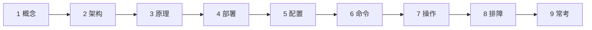
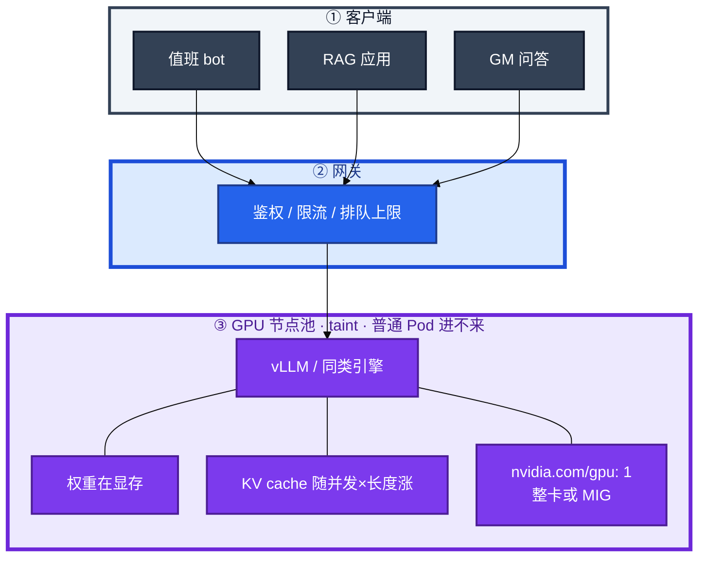
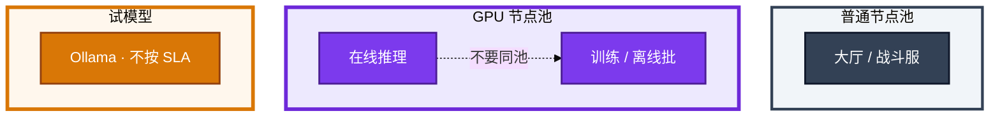
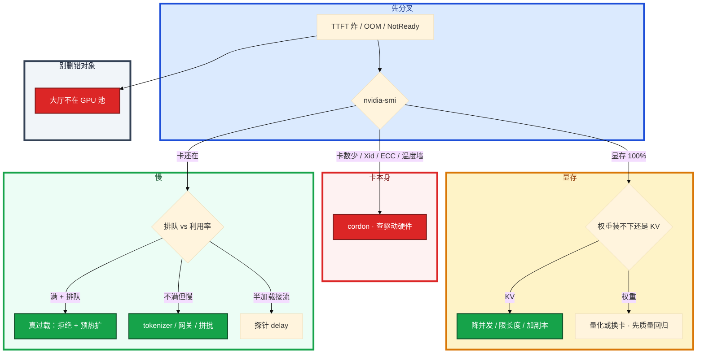

# GPU 与推理服务运维



活动日对话机器人 TTFT 从 300ms 打到 8s，显存 OOM，群里有人要删业务 Deployment；另一边开发用 Ollama 试模型，却把同一套当成生产高并发方案。告警摘要 bot、错误检索、GM 问答和对局解说可能同时打满同一套推理网关。

先别删大厅、别重启所有推理 Pod。这一章后半全是你会动手的：**怎么看卡和排队、显存账怎么算、vLLM 怎么扩、探针 delay 怎么设、Xid 掉卡先 cordon。** 前面的概念和原理，是为了让你动手时不选错池、不把 Ollama 扛活动。

**读完你能：** 白板上画出网关 → GPU 池 → 引擎；会按整数卡/MIG 调度；会算权重+KV；会区分 TTFT/排队/Ollama vs vLLM；故障第一刀 `nvidia-smi`，不删业务。

## 本章目录

缩进 = 上下级。3 下面才是 3.1。

想钉在**正文左边**跟着滚：菜单 **查看 → 打开视图 → 大纲**。Markdown 预览做不到独立左栏，目录只能写在文章开头。

- [1. 基本概念](#1-基本概念)
- [2. 架构图](#2-架构图)
- [3. 原理](#3-原理)
  - [3.1 GPU 调度](#31-gpu-调度整卡-mig-时间切片)
  - [3.2 显存账](#32-显存账oom-常常不是模型太大)
  - [3.3 延迟](#33-延迟排队--ttft--tpot)
  - [3.4 推理框架](#34-推理框架vllm--ollama-及同类)
- [4. 安装部署](#4-安装部署)
  - [4.1 生产怎么选](#41-生产怎么选)
  - [4.2 预热与探针你实际看到什么](#42-预热与探针你实际看到什么)
- [5. 核心配置](#5-核心配置)
- [6. 常用命令](#6-常用命令)
- [7. 常用操作](#7-常用操作)
  - [7.1 发布](#71-发布钉版本禁-latest)
  - [7.2 扩容](#72-扩容像游戏服)
  - [7.3 成本](#73-成本砍空闲和滥用)
  - [7.4 过载与降级](#74-过载与降级)
- [8. 生产排障](#8-生产排障)
- [9. 必会 · 常考](#9-必会--常考)
- [合上书](#合上书问自己)

**本章不讲：** 通用调度、污点 → [04-06 调度机制](../../04-Kubernetes/06-调度机制/)；节点 NotReady 驱逐 → [04-16 节点运行时与升级](../../04-Kubernetes/16-节点运行时与升级/)；模型怎么选、窗口 → [01](../01-LLM与Transformer基础/)；应用侧 RAG 打推理 → [03](../03-RAG检索增强/)；网关后的 Agent → [06](../06-Agent智能体/)；告警降噪不是 GPU 课 → [09](../09-AIOps落地/)；训练/推理/游戏分池、MIG vs vGPU 架构选型 → [10-04](../../10-SRE实践/04-大规模可靠性架构/)。不训模型。

---

## 1. 基本概念

推理服务不是「把模型文件拷到容器里就结束」。GPU 节点通过 Device Plugin 上报整数卡；推理引擎（生产常见 **vLLM**）把权重加载进显存，用 continuous batching 吃请求；前面还有网关做鉴权、限流、排队。本地 **Ollama** 是同一条故事的简化版：方便试，不按活动峰值 SLA 设计。

CPU 业务的 HPA 经验不能原样搬：GPU 稀缺、加载权重要分钟级、从 0 扩等于自杀。告警摘要变慢，不一定是模型变笨，先看排队。

游戏 GM 问答、对局解说生成、内部 Copilot，都可能在活动开始同时打满。活动前临时买卡常常买不到，quota 要提前要。

| 在 GPU 池里 | 不在 GPU 池里 |
|-------------|---------------|
| 推理 / 训练（再分池） | 大厅 / 战斗服等普通业务 |
| `nvidia.com/gpu` 整数或 MIG 实例 | CPU 那种 0.3 核的写法（无 MIG 时） |
| 权重、KV cache、引擎进程 | 网关上的排队（先看队列，别先怪模型） |

> **记住**：删大厅 Deployment 腾不出卡——卡根本不在普通节点池。有人要删业务「让卡出来」，先看这张图。

---

## 2. 架构图

先把整张图钉住。后面调度、显存、扩容、排障都对着这张图说话。



图上三条线：

1. **没有箭头从普通大厅 Pod 指向 GPU。** 独立节点池 + taint，防普通业务占带卡机只吃 CPU。
2. **训练 / 推理分池。** 训练打满会饿死在线 SLO。priorityClass：在线推理高于离线批。
3. **Ollama 不在这张生产主链上。** 笔记本 / 小团队试模型，OpenAI 兼容口；活动峰值用 vLLM。

两种不该混的形态：



Pod 反亲和：单机掉电不团灭。编排框架是调用方，不是推理引擎；简历没写框架项目一句带过即可。

---

## 3. 原理

原理只保留动手和面试会用到的：卡怎么申、显存为什么爆、延迟刀砍在哪、生产引擎和试模型差在哪。

**本节 4 块：** 3.1 调度 · 3.2 显存 · 3.3 延迟 · 3.4 框架

### 3.1 GPU 调度：整卡、MIG、时间切片

NVIDIA Device Plugin 把 GPU 暴露成 `nvidia.com/gpu`。kubelet 通过 Device Plugin 报卡。Scheduler 只给申请了 `nvidia.com/gpu` 且能容忍污点的 Pod 绑到 GPU 节点。普通大厅 Pod 没有容忍，进不来。

Pod 在 limits 里申请 **整数**。不能像 CPU 那样写 0.3，除非用 MIG 或时间切片。


| 实践 | 原因 |
|------|------|
| 独立节点池 + taint | 防普通业务占带卡机只吃 CPU |
| 训练 / 推理分池 | 训练打满会饿死在线 SLO；不要靠「口头约定晚上才训」 |
| priorityClass | 在线推理高于离线批 |
| Pod 反亲和 | 单机掉电不团灭 |
| 提前要云 quota | GPU 稀缺，活动前临时买不到 |

共享方式先认清：

1. **MIG**（A100 / H100）：硬件切成隔离实例，适合小模型多租。改 MIG 要腾空节点，当变更做。调度的是 MIG 实例，不是「0.3 张逻辑卡」随便切。合并小模型到一张卡要隔离和 SLO，生产优先 MIG 或独占。
2. **Time-slicing**：多 Pod 分时共用一张卡，**无隔离**，仅开发测试。生产在线推理独占或 MIG。时间切片没有显存隔离，两个推理进程会互相 OOM，测试可以，活动日不行。不要无隔离切片硬塞。

离线批可以设计成可杀的 Job，但不要和在线副本抢同一张卡而不隔离。in-place 抢占可以，前提是隔离。

常见误判：HPA 按 CPU 扩推理副本。GPU 利用率 100%、CPU 仍然很低——副本加不上去，或加上去也没卡。扩容看排队和显存，不看节点 CPU。`nvidia.com/gpu` 可分配是 0，新推理 Pod Pending。

### 3.2 显存账：OOM 常常不是「模型太大」

TTFT 炸的同时，推理 Pod 开始 OOMKilled。第一反应「72B 太大」经常是错的。容量规划要三个数：**模型大小、最大上下文、目标并发。** 只报「我们上了 72B」不够。老板问「72B 要几张 80G？」只回答「大概两张」不够——必须补问上下文、并发、是否量化、是否共享 KV。

```
  显存 ≈ 权重 + KV cache + 激活/临时 + 碎片

  ① 权重：参数量 × 每参数字节
     FP16=2B，INT8=1B，INT4≈0.5B
     7B FP16 ≈ 14GB；72B FP16 ≈ 144GB（多卡或量化）

  ② KV cache：随 并发 × 上下文长度 涨
     高并发长窗口时可以比权重大
     → OOM 元凶经常是并发/长度失控

  ③ 碎片和临时：别把显存用到 100%，留 buffer
```

权重加载时占一块相对固定的显存。请求进来后，每个并发、每段上下文都要 KV cache。告警摘要是短 JSON，KV 小；有人把两万行战斗日志当超长窗口硬塞（01），KV 爆。错误检索把 Top-5 片段进模型，不要把 50 条召回全塞进窗口——那既贵又涨 KV。

vLLM 的 PagedAttention 减碎片，提高同样显存下的并发，但不是无限。权重装得下、一放量就 OOM，就是并发×长度问题。引擎日志写 KV cache 不够，而不是「failed to load weights」。

对症：先看是权重装不下，还是 KV 涨爆。后者降并发、限 `max_tokens` / 上下文、加副本分摊，或量化权重。量化（INT8/INT4）先做质量回归，再进生产；若爆的是 KV，只重量化权重帮有限。INT4 之后权重缩小了，长上下文高并发仍可能要多卡或更多副本。三要素一起算。72B FP16 ≈ 144GB 仅权重，还要 KV 和碎片，通常多卡张量并行或量化。

### 3.3 延迟：排队 + TTFT + TPOT

一次 GPU 打满，用户感知的是「机器人半天不吐字」。把一次生成拆开，才知道刀砍在哪。


| 词 | 含义 | 用户感知 |
|----|------|----------|
| **排队** | 等 GPU / 等批 | 有排队 = 容量或批策略问题 |
| **TTFT** | Time To First Token，含 prefill（算第一段，TTFT 大头常在这） | 多久开始吐字；流式输出能遮一部分，**不降低真实 TTFT** |
| **TPOT** | 每个输出 token 的时间 | 吐字快慢 |
| **总延迟** | 排队 + TTFT + TPOT × 输出 token 数 | 输出不限 token，模型写小说，尾延迟爆炸 |

吞吐 vs 延迟：把请求拼成 batch 能打满 GPU、提高吞吐，但单个请求排队和尾延迟变差。**continuous batching**（vLLM）动态插入新请求，比静态整批等齐更适合在线。代价：吞吐和 GPU 利用率上去，单个请求排队和尾延迟可能变差。在线要盯 P99，不要只报平均吞吐。

网关把请求排队；引擎做 prefill 再逐 token 生成。batch 越大 GPU 越满，队越长。

现场四刀：

1. 先看排队长度。有排队 = 容量或批策略问题。
2. GPU 利用率满 + 排队 → 真过载：加副本、限流、拒绝，不要让队列无限涨。
3. GPU 不满但慢 → 瓶颈在 CPU tokenizer、网关、IO、批迟迟拼不齐。
4. `finish_reason` / 引擎侧 TTFT、吞吐指标。告警摘要 P99 从 300ms 到 8s，先看网关队列，再看 GPU。

读 nvidia-smi 的常见误判：利用率低就以为「没问题」。可能是排队在网关、tokenizer 在 CPU、或 batch 迟迟拼不齐。利用率 100% 也不等于健康——可能已经在掉请求。要和 TTFT、排队长度、错误率一起看。只看利用率会误判。

### 3.4 推理框架：vLLM vs Ollama 及同类

开发用 Ollama 试告警摘要的 prompt，很合适。把同一进程扛开服峰值，TTFT 会先教你做人。编排框架是调用方，推理引擎认 Ollama（试）和 vLLM（生产）两类即可。同类生产引擎（TGI、TensorRT-LLM 等）面试一句：看 continuous batching / PagedAttention（或等价显存管理）、多卡、探针与限流能不能进 K8s；不要把试模型进程原样扛活动。

| | Ollama | vLLM（生产默认） |
|--|--------|------------------|
| 定位 | 本地 / 小团队一键跑，OpenAI 兼容 | 生产高并发推理 |
| 批处理 | 够用就行 | continuous batching、PagedAttention |
| 多卡 | 能玩 | 张量并行等生产能力 |
| 运维 | 个人笔记本、办公机 | K8s、探针、限流、版本钉死 |
| 什么时候用 | 试 prompt、试模型、离线小工具 | 要 SLA 的在线服务 |

提吞吐、降本的手段：continuous batching、量化、PagedAttention、前缀/KV 复用、投机采样（复杂，按需）、弹性缩掉空闲卡。简单请求路由到小模型，规则层挡住不该上大模型的调用，输出 token 设上限。

告警摘要是短 JSON、低温、小模型就够（01、02）。错误检索的生成也可以中等模型。GM 问答和对局解说才需要大模型。全部打 70B，活动日一张池子先被短请求挤满。

浪费最大的图：满配 8 张卡跑内部 Copilot，GPU 利用率 15%；简单「改一句话」也走 70B 级；输出不限 token，模型写小说。利用率 15% 但账单很高——空闲卡时。利用率 100%、简单改写也在 70B 队列里——路由没做。

> **记住**：不要把 Ollama 直接扛活动峰值。Spot：训练和可中断批可以；活动日在线推理用按需/预留。被回收等于掉服务。

Agent 循环（06）可以把推理网关打满，工具侧要限流，和 Prometheus 同一等级。

---

## 4. 安装部署

### 4.1 生产怎么选

| 项 | 选 | 不选 |
|----|----|------|
| 节点 | 独立 GPU 池 + taint；训练 / 推理再拆 | 普通业务进带卡机；训练和在线同池 |
| 申请 | 整数卡或 MIG 实例 | 无隔离 time-slicing 扛活动 |
| 引擎 | 活动峰值 vLLM（或同类生产引擎） | Ollama 原样进 K8s 接活动流量 |
| 实例 | 在线按需/预留 | 活动日在线用 Spot |
| quota | 活动前就要到 | 现场现买 |
| 版本 | 权重/量化/上下文/并行度钉死，禁 latest | PVC 里静默换文件 |

### 4.2 预热与探针你实际看到什么

扩容像游戏服：看水位和排队，不看 CPU；新副本要 **预热加载权重**，probe delay 大于加载时间；HPA 最小副本不要 0；活动前预扩。卡稀缺，现场变不出来；新副本是空的（模型未加载），从 0 扩是自杀。


| 配错 | 现场 |
|------|------|
| 探针 delay < 加载时间 | 流量打到半加载实例，TTFT 爆炸 |
| HPA min=0 | 从零扩等于自杀 |
| 活动前不预扩 | 现场变不出卡 |
| 健康检查只探进程端口 | 进程在、权重没加载完，流量已经进来 |

探针要能完成一次真实推理或引擎 ready 接口。过载要拒绝，不要无限排队拖死。大模型挂了降级到小模型或缓存话术。

告警摘要和错误检索可以降级到小模型或缓存话术，不要靠删业务腾卡。

---

## 5. 核心配置

只动有证据的项。模型权重、量化方式、上下文长度、并行度 **钉版本、记 hash，禁用 latest**。静默换权重 = 行为变了无法回滚，和镜像 latest 同一类事故。告警摘要的分类结果隔夜对不上，先查是不是有人推了新权重。

| 项 | 生产怎么用 | 改错会怎样 |
|----|------------|------------|
| 探针 delay | **大于**权重加载时间；真推理或引擎 ready | 半加载实例接流，TTFT 爆炸 |
| HPA | 排队 / GPU / 显存；**min ≠ 0** | 按 CPU 扩：GPU 满、副本不动 |
| `max_tokens` / 上下文 | 上限；告警摘要短 JSON | KV 爆、写小说 |
| 排队上限 | 过载拒绝 | 队列无限涨，全体拖死 |
| MIG | 变更窗口腾空节点再切 | 在线改完指望旧 Pod 自动适应 |
| Spot | 仅训练/可中断批 | 活动日在线被回收 = 掉服务 |
| 路由 | 简单请求 → 小模型 | 短请求挤满 70B 池 |

> **记住**：换权重 = 换行为。发布：预发评测（质量 + TTFT + 成本）→ 金丝雀小流量 → 全量。质量掉了切回旧 artifact。金丝雀质量和延迟一起看。只看不挂进程会把「变傻」放到全量。

稳定性靠副本 + 反亲和。监控要能同时看到 GPU 利用率、显存、温度、TTFT、吞吐、排队、错误率、每 token 成本。

---

## 6. 常用命令

值班第一刀永远是节点上的卡，不是删 Deployment。

```bash
kubectl describe node <gpu-node> | grep nvidia.com/gpu   # 可分配卡数
nvidia-smi                                               # 现场第一刀
nvidia-smi -L
nvidia-smi dmon                                          # 利用率、显存采样
kubectl cordon <node>                                    # 掉卡先隔离
```

| 目的 | 命令 | 看什么 |
|------|------|--------|
| 可分配卡 | `kubectl describe node ... \| grep nvidia.com/gpu` | 0 → 新 Pod Pending |
| 现场 | `nvidia-smi` | 利用率、显存、温度、进程、卡数、ECC、Xid |
| 采样 | `nvidia-smi dmon` | 利用率、显存随时间 |
| 隔离 | `kubectl cordon <node>` | 先隔离，再修驱动/换卡 |
| 引擎 | TTFT / 吞吐 / 排队（按 exporter） | 和网关队列一起看 |
| YAML 验 | `kubectl --dry-run=client` | 不要 apply 碰生产 |

值班先跑这四条：`nvidia-smi -L` → `nvidia-smi` → 网关排队长度 → 引擎 TTFT / 错误率。

日志：KV cache 不够 vs failed to load weights；Xid / ECC；温度墙降频。

| 指标 | 阈值 | 级别 |
|------|------|------|
| 网关排队持续涨 + 错误率 | 活动日 | **P0** |
| GPU 100% 且掉请求 | 过载 | P0：拒绝 + 扩（预热） |
| 显存 100% OOM | 分权重 vs KV | P1/P0 |
| 卡数对不上 / Xid | 硬件 | **P0**：cordon |
| 证书/驱动/plugin 不匹配 | Pod 起不来 | P1 |

---

## 7. 常用操作

### 7.1 发布：钉版本禁 latest

钉死路径、hash、量化、上下文、并行度。换权重 = 换行为。预发评测质量+TTFT+成本 → 金丝雀 → 全量。回滚切回旧 artifact。有人把 PVC 里的权重换成新文件、没走发布，GM 问答开始胡答——按 latest 事故处理。

### 7.2 扩容：像游戏服

看排队和水位，不看 CPU。新副本预热，probe delay > 加载，HPA min≠0，活动前预扩。加上去也没卡 → 先看 `nvidia.com/gpu` 可分配和训练是否占池。

### 7.3 成本：砍空闲和滥用

成本主项是 **卡时**；长期 20% 利用率就是超配。砍空闲（保最小 SLO，弹性缩多余）、小模型路由、限制输出 token、过评测量化、批处理提高利用率、规则挡住不该上大模型的请求、showback 到团队。卡时空闲也烧钱。

Spot 给可中断训练/离线。活动日在线推理用按需/预留。

### 7.4 过载与降级

过载拒绝而不是拖死。大模型挂了降级到小模型或缓存话术。简单任务路由到小模型、给 `max_tokens` 设上限，比临时删业务有效。告警摘要 bot 和 GM 问答共用一池时，短 JSON 请求也会被长日志请求的 KV 挤爆。

MIG 切分当变更：要腾空节点、改实例规格、再让 Pod 申请对应 MIG 资源。不要在线改完指望旧 Pod 自动适应。

---

## 8. 生产排障

开服夜 GPU 打满的标准错误动作：删大厅、删战斗服、「重启所有推理 Pod」。标准正确动作：先 `nvidia-smi`，先分满载还是没吃满，先 cordon 掉卡节点。不要在池子里无脑重启所有推理 Pod——权重重新加载又是分钟级，TTFT 会再炸一波。



把「TTFT 300ms → 8s」按刀拆开，避免群里同时喊删大厅、删 vLLM、重启节点：

1. 网关排队长度？有队 → 容量/限流，先拒绝超额，再谈扩。
2. nvidia-smi 利用率？满 → 真过载；不满 → tokenizer/网关/拼批。
3. 显存 100%？KV（并发×长度）还是权重装不下。
4. 卡数 / Xid / 温度？掉卡先 cordon，别删 Deployment。
5. 新副本 ready 了吗？探针 delay < 加载时间 → 半加载实例在接流。

| 现象 | 先做什么 | 不要做什么 |
|------|----------|------------|
| Pod 起不来 | 驱动 / runtime / plugin 是否匹配，卡是否被占满 | 删业务腾卡 |
| 推理 OOM | KV（并发×长度）、碎片、同卡挤占 | 一上来换 80G「因为 7B 太大」 |
| 推理变慢 | 先分满载还是没吃满；先看排队 | 只看利用率 |
| 节点 NotReady | 驱动和设备是否被重置，先 cordon | 删推理 Deployment 重建 |
| 温度高降频 | 散热 / 机房 | 当模型变笨 |
| 卡数对不上 / Xid | 隔离节点，靠反亲和副本扛流量 | 无脑重启所有推理 Pod |
| `has GPU==0` Pending | quota / 可分配 / 训练占池 | HPA 按 CPU 猛加 |

Xid / 掉卡是硬件或驱动事件。控制面会把节点打 NotReady，驱逐细节在 04-16。你先隔离，靠反亲和副本扛流量，查驱动和硬件。硬件/驱动问题删 Pod 没用，还可能让调度更乱。隔离 → 查底层 → 修好再回池。大厅 Pod 不在 GPU 池，`kubectl delete deploy hall` 腾不出卡。

活动前清单比活动中发明更有用——quota、预扩、探针 delay、HPA min≠0、训练作业不进在线池、在线不用 Spot。这些在 20:00 之前做完，20:00 才有资格谈「模型」。

---

## 9. 必会 · 常考

白板和追问高频，能一口回：

| 说法 | 对错 | 口径 |
|------|:----:|------|
| 推理 Pod 可以像 CPU 一样申请 0.3 卡 | 错 | 整数卡或 MIG；无隔离切片仅测试 |
| 普通业务可以调度到带卡机吃 CPU | 错 | 独立池 + taint |
| 推理 OOM 一定是模型太大 | 错 | 常是 KV = 并发 × 上下文 |
| HPA 按 CPU 扩推理 | 错 | 看排队、GPU、显存 |
| 删大厅能腾出 GPU | 错 | 卡不在普通池 |
| Ollama 可以扛活动峰值 | 错 | 试模型用；生产高并发用 vLLM |
| 权重可以用 latest / 静默换 PVC | 错 | 钉 hash；换权重 = 换行为 |
| 活动日在线推理用 Spot | 错 | 被回收 = 掉服务 |
| 健康检查只探进程端口够 | 错 | 要真推理；delay > 加载 |
| HPA min=0 省钱 | 错 | 从 0 扩是自杀 |
| 利用率低 = 没问题 | 错 | 可能队列在网关 |
| 训练和在线可以同池口头错峰 | 错 | 必须分池 + 优先级 |
| 量化一定能救 OOM | 错 | 先定位权重 vs KV |
| 流式输出能降低真实 TTFT | 错 | 只改善感知 |
| 无脑重启所有推理 Pod 能救命 | 错 | 重新加载分钟级，TTFT 再炸 |

数字：7B FP16 ≈ 14GB；72B FP16 ≈ 144GB 仅权重；FP16=2B / INT8=1B / INT4≈0.5B；加载分钟级；Top-K 进模型 3～5 条不是 50 条；长期利用率 20% = 超配。

易混：整卡 vs MIG vs time-slicing；权重 OOM vs KV OOM；排队 vs GPU 满 vs GPU 空但慢；Ollama vs vLLM；脚本/网关限流 vs 删 Pod；预热探针 vs 进程探活；Spot 训练 vs Spot 在线。

---

## 合上书，问自己

1. K8s 里 GPU 和 CPU 调度差在哪？MIG 和时间切片生产怎么用？
2. 显存三块是什么？容量三要素？7B / 72B 怎么心算？
3. 一次生成延迟怎么拆？TTFT / TPOT / 排队各看什么？continuous batching 的代价？
4. vLLM 和 Ollama 怎么选？为什么不能 latest、不能 Spot 保活动？
5. 扩容为什么像游戏服？探针 delay 和 HPA min=0 各会怎样？
6. TTFT 300ms→8s 五刀怎么拆？Xid 掉卡先干什么？为什么不能删大厅？

六题都能口述，这一章就过了。下一章把 AIOps 的降噪边界钉死：模型不能自动修生产。
