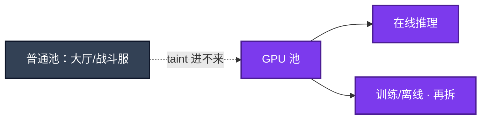
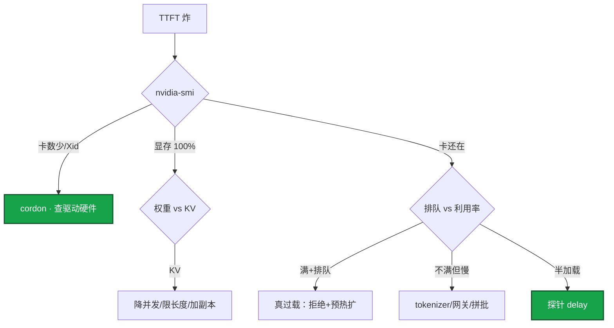

# 08｜GPU 与推理服务运维 · 练习题

先对照 [知识点](知识点.md) **面试怎么考** 自己口述，再对答案。每题标了覆盖范围：

| 标记 | 含义 |
|------|------|
| **核心** | 不懂整章就没建立起来 |
| **必会** | 值班和面试都要能讲 |
| **常用** | 线上会反复碰到 |
| **常考** | 白板和追问的高频口径 |

## 本题目录

- [Q1 调度与 CPU 的差别](#q1)
- [Q2 显存 / OOM](#q2)
- [Q3 TTFT / 排队](#q3)
- [Q4 vLLM vs Ollama](#q4)
- [Q5 版本与发布](#q5)
- [Q6 成本与 Spot](#q6)
- [Q7 掉卡 / Xid](#q7)
- [Q8 探针与 HPA](#q8)
- [Q9 排障五刀](#q9)
- [Q10 30 秒口述综合](#q10)
- [合上书](#合上书)

---

## Q1

**★★★★★｜K8s 里 GPU 调度和 CPU 有什么不同？**

**覆盖**：核心 · 必会 · 常考
**对应**：知识点 §3.1

### 场景

有人按 CPU 那样给推理 Pod 申请 0.3 卡；普通业务调度到了带卡机。晚上同池开训练，白天 GM 问答变慢。HPA 按 CPU 扩，GPU 100% 副本不动。

### 完整解答

**一句话**：GPU 按整卡或 MIG 申请，独立节点池+taint，训练推理分池，扩容看排队不看 CPU。

Device Plugin 上报 `nvidia.com/gpu`，Pod 在 limits 里申请 **整数卡**（或 MIG 实例）。不能像 CPU 那样写 0.3，除非用 MIG 或时间切片。



| 实践 | 原因 |
|------|------|
| 独立节点池 + taint | 防普通业务占带卡机只吃 CPU |
| 训练 / 推理分池 | 训练打满会饿死在线 SLO |
| priorityClass | 在线推理高于离线批 |
| Pod 反亲和 | 单机掉电不团灭 |
| 提前要云 quota | GPU 稀缺，活动前临时买不到 |

共享方式：MIG（A100/H100）硬件隔离，生产小模型多租可用，改 MIG 要腾空节点。Time-slicing 无隔离，仅开发测试。活动日在线推理独占或 MIG，不要无隔离切片硬塞。

### 再追问

`nvidia.com/gpu` 可分配是 0？——新推理 Pod Pending；先看 quota、训练是否占池，不要 HPA 按 CPU 猛加。

---

## Q2

**★★★★★｜推理 OOM 一定是模型太大吗？7B / 72B 怎么心算？**

**覆盖**：核心 · 必会 · 常用
**对应**：知识点 §3.2

### 场景

7B 模型，活动一来就 OOM。有人要换 80G 卡。老板问「72B 要几张 80G？」只回答「大概两张」不够。

### 完整解答

**一句话**：推理 OOM 常是 KV cache 随并发×长度爆，不是单纯模型太大；容量三要素一起算。

显存 ≈ 权重 + KV cache + 激活/碎片。KV 随 **并发 × 上下文长度** 涨，高并发时长窗口时 KV 可以比权重大。容量三要素：模型大小、最大上下文、目标并发。

```
  权重：FP16=2B/参，INT8=1B，INT4≈0.5B
        7B FP16 ≈ 14GB；72B FP16 ≈ 144GB 仅权重
  KV：动态，活动日爆点
  碎片：别用到 100%，留 buffer
```

对症：先看是权重装不下还是 KV 涨爆。后者降并发、限 `max_tokens`/上下文、加副本分摊，或量化（先质量回归）。爆的是 KV 时只重量化权重帮有限。INT4 后长上下文高并发仍可能要多卡或更多副本。

vLLM 的 PagedAttention 减碎片，提高同样显存下的并发，但不是无限。引擎日志写 KV cache 不够 vs failed to load weights——刀砍不同。错误检索 Top-5 进模型，不要塞 50 条召回。

### 再追问

量化一定能救 OOM 吗？——先定位。权重装不下才主要靠 INT8/INT4；KV 爆要控并发和窗口。量化后必须评测质量。

---

## Q3

**★★★★★｜推理变慢，先看什么？TTFT / TPOT 是什么？**

**覆盖**：核心 · 必会 · 常用
**对应**：知识点 §3.3

### 场景

GM 问答活动开始，首字 8 秒才出来。有的副本 GPU 利用率才 20%。另有人说流式输出已经降低了 TTFT。

### 完整解答

**一句话**：推理变慢先看排队，再拆 TTFT 和 TPOT；GPU 满是真过载，不满查 tokenizer/网关。

延迟 = 排队 + TTFT（含 prefill）+ 生成（TPOT × 输出 token）。


| 词 | 含义 | 用户感知 |
|----|------|----------|
| **排队** | 等 GPU / 等批 | 有排队 = 容量或批策略问题 |
| **TTFT** | Time To First Token | 多久开始吐字 |
| **TPOT** | 每个输出 token 的时间 | 吐字快慢 |

现场四刀：① 先看排队长度 ② GPU 满+排队→真过载：加副本、限流、拒绝 ③ GPU 不满但慢→tokenizer/CPU/网关/IO/拼批 ④ 看引擎 TTFT、吞吐、`finish_reason`

流式能遮一点感知，**不降低真实 TTFT**。continuous batching 提吞吐，尾延迟可能变差，在线盯 P99。利用率低≠没问题（队列可能在网关）。利用率 100%≠健康（可能已在掉请求）。

### 再追问

为什么扩容像游戏服？——卡稀缺，现场变不出来；新副本空的（模型未加载），从 0 扩是自杀。probe delay > 加载，HPA min≠0，活动前预扩。

---

## Q4

**★★★★★｜vLLM 和 Ollama 怎么选？能把 Ollama 扛活动吗？**

**覆盖**：核心 · 必会 · 常考
**对应**：知识点 §3.4

### 场景

开发用 Ollama 试通了，要求原样进 K8s 接活动流量。简历上写了编排框架名。

### 完整解答

**一句话**：Ollama 试模型，活动峰值用 vLLM 等生产引擎；不要把试模型进程原样扛活动。

```
  客户端 → 网关鉴权限流排队 → GPU 池上的引擎
```

| | Ollama | vLLM（生产默认） |
|--|--------|------------------|
| 定位 | 本地/小团队一键跑，OpenAI 兼容 | 生产高并发推理 |
| 批处理 | 够用就行 | continuous batching、PagedAttention |
| 多卡 | 能玩 | 张量并行等生产能力 |
| 运维 | 个人笔记本 | K8s、探针、限流、版本钉死 |
| 什么时候用 | 试 prompt、试模型、离线小工具 | 要 SLA 的在线服务 |

活动峰值用 vLLM（或同类：TGI、TensorRT-LLM 等，看批处理、显存管理、多卡、探针能否进 K8s）。Ollama 不按 SLA 设计。编排框架是调用方，不是推理引擎，简历没写框架项目一句带过即可。

告警摘要用小模型+低温（01、02）；GM 问答和对局解说才需要大模型。全部打 70B，活动日一张池子先被短请求挤满。Agent 循环（06）可以把推理网关打满，工具侧要限流。

### 再追问

continuous batching 的代价？——吞吐和 GPU 利用率上去，单个请求排队和尾延迟可能变差。在线要盯 P99，不要只报平均吞吐。

---

## Q5

**★★★★☆｜模型版本为什么不能 latest？静默换权重为什么是事故？**

**覆盖**：必会 · 常用 · 常考
**对应**：知识点 §6.1 · §5

### 场景

有人把 PVC 里的权重换成新文件，没走发布。GM 问答开始胡答。告警摘要分类隔夜对不上。

### 完整解答

**一句话**：模型权重钉版本和 hash，静默换权重等于换行为，和镜像 latest 同一纪律。

钉死路径、hash、量化、上下文、并行度，禁用 latest。换权重 = 换行为。发布：预发评测（质量 + TTFT + 成本）→ 金丝雀小流量 → 全量。回滚切回旧 artifact。金丝雀质量和延迟一起看。只看不挂进程会把「变傻」放到全量。

监控要能同时看到 GPU 利用率、显存、温度、TTFT、吞吐、排队、错误率、每 token 成本。稳定性靠副本 + 反亲和。

### 再追问

有人静默换 PVC 权重？——按 latest 事故处理。行为变了无法回滚。

---

## Q6

**★★★★☆｜GPU 成本怎么砍？Spot 能给活动日推理吗？**

**覆盖**：必会 · 常用
**对应**：知识点 §6.3

### 场景

长期利用率 20%，账单按满配卡时走。简单改写也走 70B。有人要活动日推理上 Spot。

### 完整解答

**一句话**：成本砍空闲和路由滥用；活动日在线推理不用 Spot，Spot 给可中断训练。

成本主项是 **卡时**；长期 20% 利用率就是超配。砍法：

- 砍空闲（保最小 SLO，弹性缩多余）
- 小模型路由：简单请求 → 小模型，规则层挡住不该上大模型的调用
- 限制输出 token；过评测量化；批处理提高利用率
- showback 到团队

Spot 给可中断训练/离线批。活动日在线推理用按需/预留。被回收等于掉服务。合并小模型到一张卡：生产优先 MIG 或独占，不要无隔离切片硬塞。

浪费最大的图：满配 8 卡跑 Copilot，利用率 15% 账单很高；或利用率 100%、简单改写也在 70B 队列——路由没做。

### 再追问

告警摘要和 GM 问答共用一池？——短 JSON 请求也会被长日志请求的 KV 挤爆。要限长度和路由。

---

## Q7

**★★★★★｜Xid / 掉卡 / 节点 NotReady，先干什么？**

**覆盖**：必会 · 常用 · 常考
**对应**：知识点 §7

### 场景

群里有人要删推理 Deployment 重建。nvidia-smi 已经少一张卡。另有人要删大厅腾卡。

### 完整解答

**一句话**：Xid/掉卡先 cordon 故障节点查驱动硬件，不要先删业务 Deployment。

值班第一刀永远是节点上的卡，不是删 Deployment。

```bash
nvidia-smi -L
nvidia-smi                    # 利用率、显存、温度、进程、Xid、ECC
kubectl cordon <gpu-node>     # 掉卡先隔离
kubectl describe node <gpu-node> | grep nvidia.com/gpu
```

Pod 起不来先看驱动、runtime、plugin 是否匹配，卡是否被占满。NotReady 先查设备是否被重置。温度墙会降频——当散热/机房问题，不是模型变笨。

不要无脑重启所有推理 Pod——重新加载分钟级，TTFT 再炸。大厅不在 GPU 池，`kubectl delete deploy hall` 腾不出卡。硬件/驱动问题删 Pod 没用，还可能让调度更乱。隔离 → 查底层 → 修好再回池。

### 再追问

MIG 在线改完指望旧 Pod 自动适应？——不能。腾空节点当变更做。

---

## Q8

**★★★★☆｜健康检查只探进程端口够吗？HPA 按 CPU？**

**覆盖**：必会 · 常用
**对应**：知识点 §4.2 · §6.2

### 场景

进程在，权重没加载完，流量已经进来，TTFT 爆炸。HPA 按 CPU 扩，GPU 100% 副本不动。

### 完整解答

**一句话**：探针 delay 必须大于权重加载；HPA 看排队和 GPU 利用率，min≠0，活动前预扩。

不够。探针要能完成一次真实推理或引擎 ready 接口，delay **大于**加载时间（分钟级）。过载要拒绝，不要无限排队拖死。大模型挂了降级小模型或缓存话术。

| 配错 | 现场 |
|------|------|
| 探针 delay < 加载时间 | 半加载实例接流，TTFT 爆炸 |
| HPA min=0 | 从 0 扩是自杀 |
| 活动前不预扩 | 现场变不出卡 |
| 健康检查只探进程端口 | 进程在、权重没加载完 |

HPA 按 CPU：CPU 可能很低而 GPU 已满。扩容指标用排队、GPU 利用率、显存。Agent 循环（06）可把网关打满，工具侧限流。

### 再追问

活动前清单？——quota、预扩、探针 delay、HPA min≠0、训练不进在线池、在线不用 Spot。20:00 之前做完才有资格谈「模型」。

---

## Q9

**★★★★☆｜TTFT 300ms→8s，你先走哪五刀？**

**覆盖**：必会 · 常用
**对应**：知识点 §7

### 场景

开服夜群里同时喊删大厅、删 vLLM、重启节点。四个工单混在一起：排队涨、显存 100%、卡数对不上、GPU 30% 但慢。

### 完整解答

**一句话**：TTFT 爆炸五刀：排队→利用率→显存→卡数/Xid→新副本 ready，不删大厅也不重启全部推理 Pod。



| # | 走哪条 | 不要做 |
|---|--------|--------|
| 1 排队 | 有队 → 容量/限流，先拒绝超额 | 让队列无限涨 |
| 2 利用率 | 满 = 真过载；不满 = tokenizer/网关/拼批 | 只看利用率下结论 |
| 3 显存 100% | 分 KV vs 权重 | 一上来换 80G |
| 4 卡数 / Xid / 温度 | 先 cordon | 删 Deployment / 重启全部推理 Pod |
| 5 新副本 ready | 探针 delay < 加载 → 半加载接流 | HPA min=0 现场扩 |

现场：`nvidia-smi -L` → `nvidia-smi` → 网关排队 → 引擎 TTFT/错误率。训练和在线必须分池 + 优先级，不要口头错峰。

### 再追问

删大厅能腾出 GPU 吗？——不能。卡根本不在普通节点池。

---

## Q10

**★★★★★｜30 秒 + 2 分钟：活动日 TTFT 从 300ms 打到 8s 怎么讲？**

**覆盖**：必会 · 常考
**对应**：知识点 §7 · §8

### 场景

面试官：「GPU 推理你们怎么运维？OOM 怎么办？」

### 完整解答

**一句话**：先 nvidia-smi 不删业务，显存账算权重+KV，活动峰值 vLLM 不是 Ollama。

**30 秒**：「活动日 TTFT 8s，我先网关排队——有队就是容量问题，先限流再预扩。nvidia-smi 看利用率和显存。满卡是真过载；OOM 常是 KV 随并发×长度爆，不是 7B 太大。Ollama 试模型，生产峰值 vLLM。掉卡先 cordon，不删大厅也不重启全部推理 Pod。」

**2 分钟**：补架构图（网关→GPU 池 taint→引擎）、整卡/MIG/time-slicing、7B/72B 心算、continuous batching 代价、探针 delay > 加载、HPA min≠0、权重钉 hash 禁 latest、Spot 只给训练。和 06 Agent 限流、09 摘要 bot 别吞 TTFT 线索。

### 再追问

流式输出降低 TTFT 吗？——只改善感知，不降低真实 TTFT。

---

## 合上书

1. K8s 里 GPU 和 CPU 调度差在哪？MIG 和时间切片生产怎么用？
2. 显存三块是什么？容量三要素？7B / 72B 怎么心算？
3. 一次生成延迟怎么拆？TTFT / TPOT / 排队各看什么？continuous batching 的代价？
4. vLLM 和 Ollama 怎么选？为什么不能 latest、不能 Spot 保活动？
5. 扩容为什么像游戏服？探针 delay 和 HPA min=0 各会怎样？
6. TTFT 300ms→8s 五刀怎么拆？Xid 掉卡先干什么？为什么不能删大厅？
7. 30 秒怎么讲 GPU 推理运维？

---

**上一章**：[07 AI 工具实战](../07-AI工具实战与Vibe-Coding/练习题.md) · **下一章**：[09 AIOps 落地](../09-AIOps落地/练习题.md)
