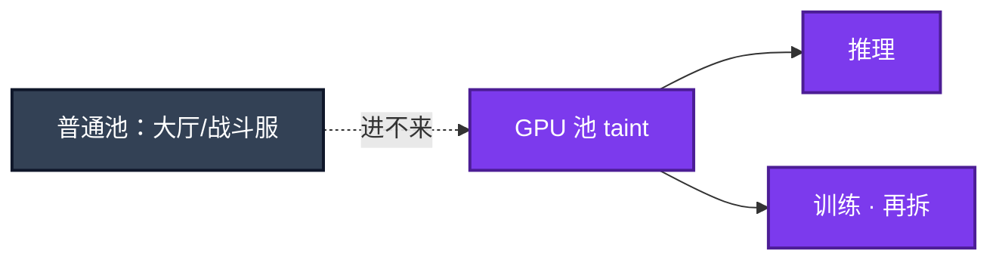

# 08｜GPU 与推理服务运维 · 练习题

先自己画图或口述，再对照解答。每题标了覆盖范围：

| 标记 | 含义 |
|------|------|
| **核心** | 不懂整章就没建立起来 |
| **必会** | 值班和面试都要能讲 |
| **常用** | 线上会反复碰到 |
| **常考** | 白板和追问的高频口径 |

## 本题目录

- [Q1 调度与 CPU 的差别](#q1)
- [Q2 显存 / OOM](#q2)
- [Q3 TTFT / 排队](#q3)
- [Q4 vLLM vs Ollama](#q4)
- [Q5 版本与发布](#q5)
- [Q6 成本与 Spot](#q6)
- [Q7 掉卡 / Xid](#q7)
- [Q8 探针与 HPA](#q8)
- [Q9 排障五刀](#q9)
- [合上书](#合上书)

---

## Q1

**★★★★★｜K8s 里 GPU 调度和 CPU 有什么不同？**

**覆盖**：核心 · 必会 · 常考

### 场景

有人按 CPU 那样给推理 Pod 申请 0.3 卡；普通业务调度到了带卡机。晚上同池开训练，白天 GM 问答变慢。

### 完整解答

Device Plugin 上报 `nvidia.com/gpu`，按 **整数卡**（或 MIG 实例）申请。独立节点池 + taint，防普通业务占卡机。训练 / 推理分池，priorityClass 保在线，反亲和防单机团灭，云上 GPU 提前要 quota。不要靠「口头约定晚上才训」。



### 再追问

- 一张卡给多个 Pod？——MIG：硬件隔离，生产小模型多租可用，改 MIG 要腾空节点。Time-slicing：无隔离，仅测试。在线推理不要无隔离切片。
- 离线批能不能 in-place 抢占？——可设计成可杀 Job，但不要和在线抢同一张卡而不隔离。

---

## Q2

**★★★★★｜推理 OOM 一定是模型太大吗？7B / 72B 怎么心算？**

**覆盖**：核心 · 必会 · 常用

### 场景

7B 模型，活动一来就 OOM。有人要换 80G 卡。老板问「72B 要几张 80G？」

### 完整解答

不一定。显存 ≈ 权重 + KV cache + 激活/碎片。KV 随 **并发 × 上下文长度** 涨，高并发时长窗口时 KV 可以比权重大。容量三要素：模型、最大上下文、目标并发。只报模型名无法定卡数。

```
  权重：7B FP16 ≈ 14GB（相对固定）；72B FP16 ≈ 144GB 仅权重
  KV：动态，活动日爆点
  碎片：别用到 100%
  FP16=2B，INT8=1B，INT4≈0.5B
```

对症：先定位权重装不下还是 KV 涨爆。后者降并发、限长度、加副本、量化（先质量回归）。爆的是 KV 时只重量化权重帮有限。INT4 后长上下文高并发仍可能要多卡或更多副本。错误检索 Top-5 进模型，不要塞 50 条召回。PagedAttention 减碎片，不是无限。

### 再追问

量化一定能救 OOM 吗？——先定位。权重装不下才主要靠 INT8/INT4；KV 爆要控并发和窗口。量化后必须评测质量。

---

## Q3

**★★★★★｜推理变慢，先看什么？TTFT / TPOT 是什么？**

**覆盖**：核心 · 必会 · 常用

### 场景

GM 问答活动开始，首字 8 秒才出来。有的副本 GPU 利用率才 20%。另有人说流式输出已经降低了 TTFT。

### 完整解答

延迟 = 排队 + TTFT（含 prefill）+ 生成（TPOT × 输出 token）。先看排队。GPU 满 + 排队 → 真过载：加副本、限流、拒绝。GPU 不满但慢 → tokenizer/CPU/网关/IO/批拼不齐。

TTFT 影响「多久开始吐字」，流式能遮一点感知，**不降低真实 TTFT**；TPOT 影响吐字速度。扩容看排队和水位，不看 CPU。continuous batching 提吞吐，尾延迟可能变差，在线盯 P99。

利用率低 ≠ 没问题（队列可能在网关）。利用率 100% ≠ 健康（可能已在掉请求）。要和 TTFT、排队、错误率一起看。

### 再追问

为什么像游戏扩容？——卡稀缺，现场变不出来；新副本是空的（模型未加载），从 0 扩是自杀。probe delay 大于加载，HPA min≠0，活动前预扩。

---

## Q4

**★★★★★｜vLLM 和 Ollama 怎么选？能把 Ollama 扛活动吗？**

**覆盖**：核心 · 必会 · 常考

### 场景

开发用 Ollama 试通了，要求原样进 K8s 接活动流量。简历上写了编排框架名。

### 完整解答

```
  客户端 → 网关限流排队 → GPU 池上的引擎
  Ollama：本地/小团队试模型，OpenAI 兼容口
  vLLM：continuous batching、PagedAttention、生产高并发
```

活动峰值用 vLLM（或同类生产引擎：看批处理、显存管理、多卡、探针能否进 K8s）。Ollama 不按 SLA 设计。编排框架不是推理引擎，简历没写框架项目一句带过即可。不要把试模型进程原样扛活动。

### 再追问

continuous batching 的代价？——吞吐和 GPU 利用率上去，单个请求排队和尾延迟可能变差。在线要盯 P99，不要只报平均吞吐。

---

## Q5

**★★★★☆｜模型版本为什么不能 latest？静默换权重为什么是事故？**

**覆盖**：必会 · 常用 · 常考

### 场景

有人把 PVC 里的权重换成新文件，没走发布。GM 问答开始胡答。告警摘要分类隔夜对不上。

### 完整解答

钉死路径、hash、量化、上下文、并行度。换权重 = 换行为，和镜像 latest 同一纪律。发布：预发评测质量+TTFT+成本 → 金丝雀 → 全量。回滚切回旧 artifact。金丝雀质量和延迟一起看。只看不挂进程会把「变傻」放到全量。

### 再追问

金丝雀看什么？——质量和延迟一起看，不是只看进程活着。

---

## Q6

**★★★★☆｜GPU 成本怎么砍？Spot 能给活动日推理吗？**

**覆盖**：必会 · 常用

### 场景

长期利用率 20%，账单按满配卡时走。简单改写也走 70B。有人要活动日推理上 Spot。

### 完整解答

成本主项是卡时。砍空闲（保最小 SLO，弹性缩多余）、小模型路由、限制输出 token、过评测量化、批处理提高利用率、规则挡住不该上大模型的请求、showback 到团队。告警摘要用小模型；GM 才需要大模型。

Spot 给可中断训练/离线。活动日在线推理用按需/预留。被回收等于掉服务。合并小模型到一张卡：生产优先 MIG 或独占，不要无隔离切片硬塞。

### 再追问

利用率 15% 但账单很高？——空闲卡时。利用率 100%、简单改写也在 70B 队列——路由没做。

---

## Q7

**★★★★★｜Xid / 掉卡 / 节点 NotReady，先干什么？**

**覆盖**：必会 · 常用 · 常考

### 场景

群里有人要删推理 Deployment 重建。nvidia-smi 已经少一张卡。另有人要删大厅腾卡。

### 完整解答

```
  nvidia-smi：利用率、显存、温度、进程、卡数、ECC、Xid
  先 cordon 故障节点，靠反亲和副本扛流量
  查驱动/硬件，不要先删业务
```

Pod 起不来先看驱动、plugin、卡是否占满。NotReady 先查设备是否被重置。温度墙会降频。不要无脑重启所有推理 Pod——重新加载分钟级，TTFT 再炸。大厅不在 GPU 池，删大厅腾不出卡。硬件/驱动问题删 Pod 没用，还可能让调度更乱。隔离 → 查底层 → 修好再回池。

### 再追问

能直接删业务 Deployment 吗？——不能。MIG 在线改完指望旧 Pod 自动适应？——不能，腾空节点当变更。

---

## Q8

**★★★★☆｜健康检查只探进程端口够吗？HPA 按 CPU？**

**覆盖**：必会 · 常用

### 场景

进程在，权重没加载完，流量已经进来，TTFT 爆炸。HPA 按 CPU 扩，GPU 100% 副本不动。

### 完整解答

不够。探针要能完成一次真实推理或引擎 ready 接口，delay 大于加载时间。过载要拒绝，不要无限排队拖死。大模型挂了降级小模型或缓存话术。

HPA 按 CPU：CPU 可能很低而 GPU 已满。扩容指标用排队、GPU 利用率、显存。min≠0。活动前预扩。Agent 循环（06）可把网关打满，工具侧限流。

### 再追问

为什么 min=0 是自杀？——新副本空的，加载分钟级，现场变不出卡。

---

## Q9

**★★★★☆｜TTFT 300ms→8s，你先走哪五刀？**

**覆盖**：必会 · 常用

### 场景

开服夜群里同时喊删大厅、删 vLLM、重启节点。四个工单混在一起：排队涨、显存 100%、卡数对不上、GPU 30% 但慢。

### 完整解答

| # | 走哪条 | 不要做 |
|---|--------|--------|
| 1 排队 | 有队 → 容量/限流，先拒绝超额 | 让队列无限涨 |
| 2 利用率 | 满 = 真过载；不满 = tokenizer/网关/拼批 | 只看利用率下结论 |
| 3 显存 100% | 分 KV vs 权重 | 一上来换 80G |
| 4 卡数 / Xid / 温度 | 先 cordon | 删 Deployment / 重启全部推理 Pod |
| 5 新副本 ready | 探针 delay < 加载 → 半加载接流 | HPA min=0 现场扩 |

现场：`nvidia-smi -L` → `nvidia-smi` → 网关排队 → 引擎 TTFT/错误率。活动前清单：quota、预扩、探针 delay、HPA min≠0、训练不进在线池、在线不用 Spot。

### 再追问

训练和在线为什么必须分池？——训练打满卡和 PCIe/NVLink，饿死在线 SLO。分池 + 优先级，不要口头错峰。

---

## 合上书

- [ ] 能画出网关 → GPU 池（taint）→ 引擎，并说明大厅进不来
- [ ] 能说出整卡 / MIG / time-slicing，以及训练推理分池
- [ ] 能把显存讲到权重+KV+碎片，7B/72B 心算，OOM 先定位
- [ ] 能拆排队 / TTFT / TPOT，并说明 continuous batching 的代价
- [ ] 能选 vLLM vs Ollama；钉版本；扩容预热；在线不用 Spot
- [ ] 能用五刀处理 TTFT 爆炸，Xid 先 cordon，不删业务
