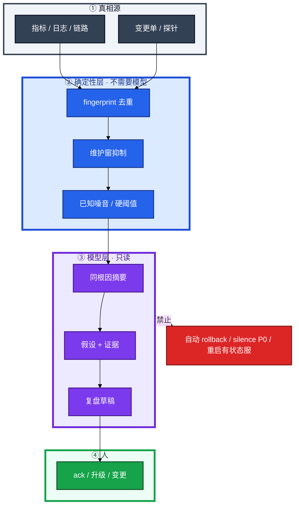
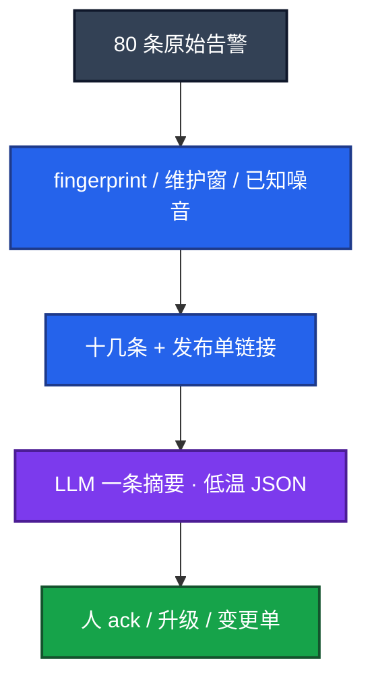
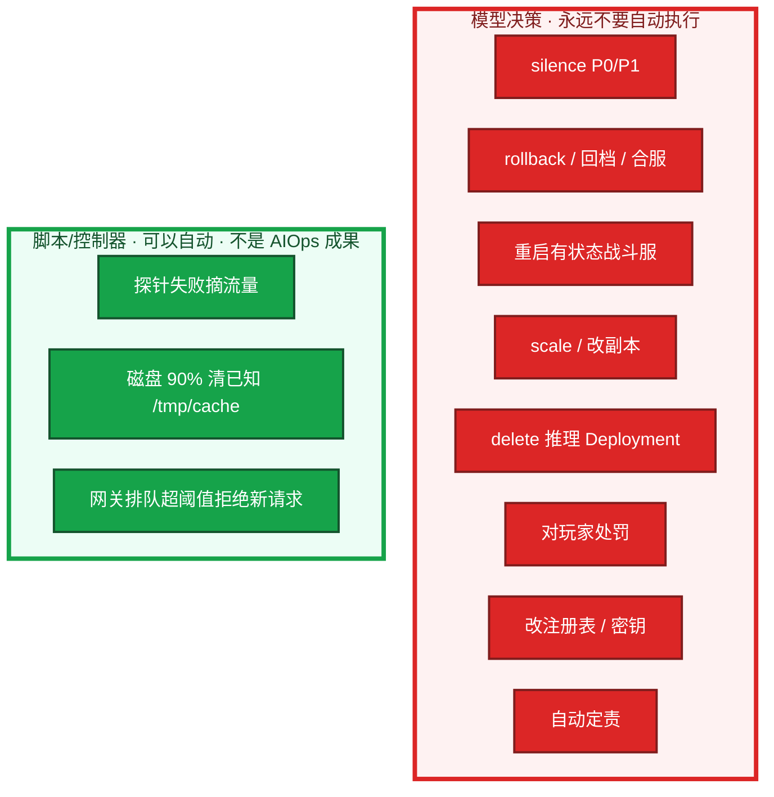
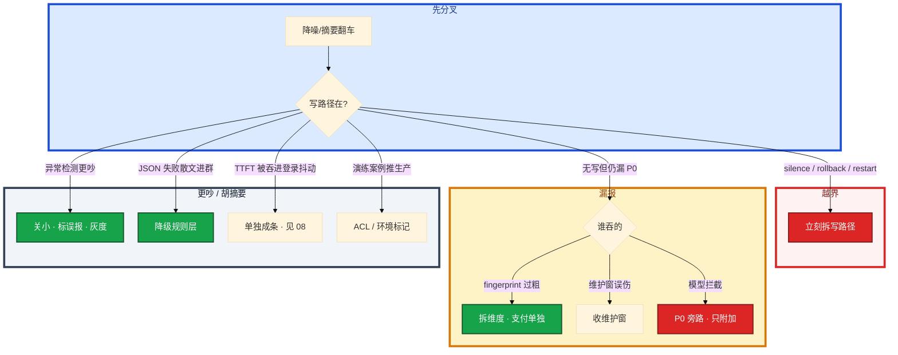

# AIOps 落地


活动开始告警风暴刷屏，值班要的是「哪几条是同一件事」；有人在简历上写「智能根因大脑自动修复生产」，游戏有状态环境里那是事故预告。开服 20:00，登录、网关、战斗、支付同时叫，群里 80 条。模型 **不能自动 silence P0，也不能自动 rollback。**

先别接写路径。这一章后半全是你会动手的：**降噪三层怎么叠、漏报红线怎么报、哪些动作永远不能自动执行、没有项目怎么讲也不减分。** 前面的概念，是为了让你动手时不把 LLM 接在所有告警前面。

**读完你能：** 白板上画出确定性层 vs 模型层；会讲落地六条和降噪三层；能列出不能自动执行的清单；会用条数+有效率+漏报证明，而不是吹大脑。

## 本章目录

缩进 = 上下级。3 下面才是 3.1。

想钉在**正文左边**跟着滚：菜单 **查看 → 打开视图 → 大纲**。Markdown 预览做不到独立左栏，目录只能写在文章开头。

- [1. 基本概念](#1-基本概念)
- [2. 架构图](#2-架构图)
- [3. 原理](#3-原理)
  - [3.1 落地六条](#31-落地六条)
  - [3.2 降噪三层](#32-降噪三层)
  - [3.3 什么不能自动执行](#33-什么不能自动执行)
  - [3.4 异常检测 / 聚类 / 根因](#34-异常检测--日志聚类--根因辅助)
- [4. 安装部署](#4-安装部署)
  - [4.1 生产怎么选](#41-生产怎么选)
  - [4.2 开服 80 条你实际看到什么](#42-开服-80-条你实际看到什么)
- [5. 核心配置](#5-核心配置)
- [6. 常用命令](#6-常用命令)
- [7. 常用操作](#7-常用操作)
  - [7.1 度量与对照](#71-度量与对照)
  - [7.2 漏报事后](#72-漏报事后)
  - [7.3 怎么讲才像做过](#73-怎么讲才像做过)
- [8. 生产排障](#8-生产排障)
- [9. 必会 · 常考](#9-必会--常考)
- [合上书](#合上书问自己)

**本章不讲：** 监控采集、告警规则 → [02-21 监控与告警](../../02-基础底座/21-监控与告警/)；日志平台 → [02-22 日志运维](../../02-基础底座/22-日志运维/) / [04-19 日志管理](../../04-Kubernetes/19-日志管理/)；RAG 知识库 → [03](../03-RAG检索增强/)；只读工具接 Prometheus → [04](../04-Function-Calling与Tool-Use/) / [05](../05-MCP协议/)；Agent 步数护栏 → [06](../06-Agent智能体/)；GPU 推理 SLO → [08](../08-GPU与推理服务运维/)；游戏开服容量 → [08-05 活动高峰](../../08-游戏运维专题/05-活动高峰与压测/)。有落地是加分，没有也能把边界讲清。

---

## 1. 基本概念

AIOps 是用规则、统计模型和 LLM，增强值班对 **已经采集到的信号** 的理解：告警少而可读、日志可聚类、根因有假设和证据、复盘有草稿。它不是新的监控系统，也不是自动运维大脑。

本质是增强理解，不接管变更。监控和告警规则仍是真相源。确定性检查（磁盘 > 90%、探针失败摘流量）用脚本和控制器。非结构化理解（「这 80 条是不是同一场发布引起的」）才轮到模型。模型会幻觉，**不能自动修生产**；AI 出建议和只读分析，写操作人批准。生产数据、密钥不出域。

能做：告警降噪、异常检测、日志聚类、根因辅助（假设+证据）、复盘草稿、知识检索。  
不能做：替代监控采集、**自动修生产**、自动定责、当唯一容量真相。容量看压测、水位、活动预报。模型输出只是辅助信号。责任是管理和变更流程的事，模型乱点名会伤人且经常点错。

旁边两件事——「战斗服 OOM 上次怎么收」（错误检索，03）和「TTFT 300ms→8s」（GPU 打满，08）——都从这条摘要往下走。摘要卡片旁挂「相似案例」，比单独做一个聊天机器人更易被值班用到。

> **记住**：游戏战斗服有玩家状态和长连接。模型把「重启」当万能药，踢的是正在开团的人，且不一定消掉根因（limit 没改，OOM 还会来）。回档、合服、改注册表更不是模型能碰的。

---

## 2. 架构图

先把整张图钉住。后面六条、降噪、禁执行清单都对着这张图说话。



图上三条线：

1. **红线：模型决策不指向生产变更。** 重启、扩容、回档、改注册表、silence P0，都不在模型写路径上。
2. **规则层先跑，还没花 token。** P3 及以下不进模型。
3. **变更从发布 API 拉，不让模型猜。** 摘要里是链接，不是「感觉像刚发版」。

成熟度默认停在建议型：


即使讨论自动型，**决策应来自规则，不是 LLM 投票**。跳到自动型只在无状态、可回滚、爆炸半径极小、且动作本身是确定性脚本时才讨论。仍要规则触发、可回滚、人能关。不要把 LLM 放在写路径上「感觉该重启」。

确定性自动化（探针、摘流、限流开关）本来就该有，不要贴 AI 标签。分清「脚本自动」和「模型自动」，考察时主动拆开。群里若出现模型触发的 rollback，成熟度已经越界。Agent 步数护栏在 06，本章管的是产品边界：建议型封顶。

---

## 3. 原理

原理只保留动手和面试会用到的：六条缺了会怎样、降噪怎么叠、哪些动作永远不能自动执行、根因为什么只给假设。

**本节 4 块：** 3.1 六条 · 3.2 降噪 · 3.3 禁执行 · 3.4 检测/聚类/根因

### 3.1 落地六条

缺一条就不要写成「我们做了 AIOps 平台」。用开服这 80 条检验：摘要进了现有 IM、P0 通道没被 silence、上线前后条数和漏报对得上，才像做过。常见误判：先画微服务大图再找场景。正确顺序是痛点 → 只读接口 → 指标 → 小流量。

| # | 条 | 缺了现场 |
|---|----|----------|
| 1 | **只读优先：** 先分析、建议，不自动变更 | 错摘要变成 silence / 自动 rollback |
| 2 | **窄场景：** 从一个痛点切入（降噪），不要一步上「统一智能中枢」 | 「平台」做了一年，值班仍看原始风暴 |
| 3 | **可度量：** 降噪率、有效率、漏报率、采纳率，能对照上线前后 | 只报降噪率，漏了支付 P0 没人知道 |
| 4 | **可回滚：** 模型错了系统不受损——因为它碰不到生产写路径 | 模型写路径一旦接上，错了要靠人救火 |
| 5 | **人在环：** 关键决策人确认 | 夜班全自动，早班才发现战斗服被缩成 0 |
| 6 | **嵌进现有系统：** 告警进现有 IM / 工单，不让值班再开一个 APP | 另做一个 APP，没人打开 |

可回滚在只读设计里几乎免费——因为本来就不写生产。已经自动 rollback 了？那已经越界。先拆写路径，再谈模型。先问写路径在不在。写路径在，六条已经断了。

### 3.2 降噪三层

痛点明确、只读、好度量，适合作为第一批。不要先做大中枢。规则为主，模型为辅。规则能处理的不要花 token。降噪不是把 LLM 接在所有告警前面。



| 层 | 做什么 | 不做什么 |
|----|--------|----------|
| **规则层（主）** | fingerprint 去重（同一告警合并）；维护窗抑制、已知噪音名单；P3 及以下不进模型（省钱、少幻觉） | 过粗 fingerprint 把支付超时和登录超时合成一条 |
| **模型层（辅）** | 同一根因的一组告警 → 一条摘要；关联最近变更：从发布系统拉，不是让模型猜 | `action: rollback` 字段；自动 silence |
| **人** | ack 还是升级 | 模型不能自动 silence |

漏报红线：**漏掉 P0/P1 就是失败**，告警条数下降不是成功。汇报必须同时给条数、有效率、漏报率。只报「少了 80%」是藏问题，也是没真上过线的信号。条数下降 60%，但支付超时被吞进「登录抖动」= 失败。模型附加摘要，P0 通道仍走原规则、不经过 silence = 对。本周 P0/P1 漏报 = 0 才算及格。

推理 TTFT 升高不要被吞进「登录抖动」——那是另一条根因，见 08。程序侧必须 `json.loads` + schema，失败则降级成「只显示规则层结果」，不要把半截散文推进群里当摘要。这和 02 的结构化输出是同一条组合拳。低温 + JSON schema（01、02）。`need_human: true`。没有 `action: rollback` 字段。

P0/P1 通道旁路模型，或模型只附加摘要不拦截。P3 默认不进模型。

### 3.3 什么不能自动执行

把边界写成清单，面试能背，值班能挡。



| 动作 | 谁可以做 | 为什么模型不能做 |
|------|----------|------------------|
| silence P0/P1 | 人；P0 通道旁路模型 | 漏报就是失败；错摘要会把支付超时吞进「登录抖动」 |
| rollback 大厅 / 回档 / 合服 | 变更单 + 人 | 有状态、爆炸半径大；幻觉当根因 |
| restart 战斗服 | 人审；limit 没改 OOM 还会来 | 踢正在开团的玩家 |
| scale / 改副本 | 变更单 | Agent 自己点 scale 是 06 的禁区，产品上同样禁 |
| delete deploy vllm | 人按 08 清单 | GPU 过载该限流/预扩，不是投票删谁 |
| 对玩家处罚 | 运营/法务 | 不可逆、合规 |
| 改注册表 / 密钥 | 人 | 出域 + 不可逆 |
| 自动定责 | 不做 | 伤人且经常点错 |
| 磁盘 90% 清已知目录 | **脚本**，目录白名单 | 不要「模型认为是泄漏所以重启」 |
| 探针失败摘流 | **控制器** | 确定性动作，不要贴 AI 标签冒充自愈 |
| 网关过载拒绝 | **网关规则**（08） | 不是模型投票 |

无状态、可回滚的小动作：仍要规则触发、可回滚、人能关。不要把 LLM 放在写路径上。确定性脚本可以在建议型之前就存在，它不是 AIOps 的成果，也不是 AIOps 的禁区。贴 AI 标签冒充自愈，考察时会被拆穿。

开服夜对照：

```
  建议型（要）                         越界（不要）
  摘要：三件事 + 链接 + 未变更          「根因已确定，已自动回滚大厅」
  OOM：假设 + RAG 案例 + 人审调 limit   Agent 自己 restart gw-1
  GPU：排队/显存证据 + 人预扩           模型决定 delete deploy vllm
  磁盘 90%：脚本清已知 /tmp/cache       「模型认为是泄漏所以重启战斗服」
```

### 3.4 异常检测 / 日志聚类 / 根因辅助

告警摘要之后，值班要假设，不要「根因已确定」。三条技术各自解决一类痛，不要揉成一个大脑。

**异常检测：** 学周期和趋势，偏离则报。坑是误报、冷启动无基线、业务改版后基线漂移。必须有反馈：人标误报，规则/模型收敛。先灰度一个业务线。固定硬阈值（磁盘 90%）仍然要留着；异常检测补「没有固定红线但今天不像往常」的指标（QPS、延迟）。不是替代关系。上线后更吵，说明误报没收敛，先关小再调，不要全集群开着装忙。开服流量当成「不像往常」狂报，先标误报、收基线。异常检测不能当容量规划唯一依据。

**日志聚类：** 海量日志按模板归类，看「哪类错误多少条」。从 GB 级战斗服日志里抓主因类型，而不是让模型通读全文（窗口和费用都不够，见 01、03）。错误检索之前先聚类，再按主类型去知识库搜 SOP。整文件塞窗口贵、慢、易截断，也没有结构。聚类 + 抽样再给 LLM 摘要，比通读全文靠谱。聚类结果能当线索（某类错误暴涨），根因仍要变更和指标证据，人判断。

**根因辅助：** 输出「假设 + 证据」（关联变更、异常指标、相似历史案例来自 RAG）。人判断。**不当最终结论，不自动定责，不自动修。** 讲项目用「辅助定位」，不用「自动根因」。根因没有证据链接，当没上线。

活动中三条假设怎么并列，才叫根因辅助而不是定责：

```
  假设 A  刚发版大厅 v1.2.3     证据：发布 API + 登录 P99
  假设 B  gw-1 limit 打满       证据：OOMKilled + 内存曲线 + RAG 案例
  假设 C  推理网关排队          证据：TTFT 8s + nvidia-smi 100%
```

值班选一条去验证。系统不输出「根因已确定」，不自动 rollback A、不 restart B、不 delete C。系统若输出「根因已确定：Redis，已自动重启」——那是越界，也多半是幻觉。

相似案例：权限、时效、脱敏、带来源、标环境。测试/演练文档要隔离或强标记。只读建议，执行走人审。这是 03 + 09 的交界：知识库垃圾进，降噪也会推错案例。案例点击率可当采纳率之一，必须和漏报、误导操作投诉一起看。RAG 把测试环境删库演练推给了生产值班——权限和环境影响面没做。

复盘 / 知识：收集时间线起草 RCA，缺的标待补充（02 模板）；知识库问答见 03。

---

## 4. 安装部署

### 4.1 生产怎么选

| 项 | 选 | 不选 |
|----|----|------|
| 第一刀 | 登录链路告警降噪 | 统一智能中枢、自动自愈 |
| 写路径 | 不接模型 | 摘要带一键 silence / rollback |
| P0 | 原规则通道，模型只附加 | 模型拦截 P0 |
| IM | 现有群 / 工单 | 另做一个没人打开的 APP |
| 变更关联 | 发布 API | 让模型猜「感觉像刚发版」 |
| 输出 | 低温 JSON + schema，失败降级规则层 | 半截散文推进群 |

没有项目也可以加分：把边界讲清楚——能做什么、为什么自动修不可接受、若从零做会先做降噪哪三层。不要编造落地。加分模块不是招聘生死线，吹自动修才减分。会用 RAG/工具调用/GPU 运维补（03/04/08）。AIOps 看判断力，不看 PPT 层数。

### 4.2 开服 80 条你实际看到什么

1. **规则层先跑。** fingerprint 把同一登录超时合成 1 条，维护窗里的已知噪音压掉。你看到的是从 80 降到十几条，还没进模型。P3 磁盘预警不进 LLM。
2. **变更从 API 拉，不让模型猜。** 发布系统返回「20:00 大厅 v1.2.3」。摘要里这条是链接。
3. **模型只收束。** 低温 + JSON：三组根因线索——登录超时、gw-1 OOM、推理 TTFT。`need_human: true`。没有 `action: rollback`。
4. **卡片进现有 IM。** 值班仍在老群 ack。P0 支付超时若还在原规则通道里响，降噪才算没说谎。若支付被吞进「登录抖动」，立刻关模型层，回退到纯规则。
5. **人点下一步。** 错误检索挂在卡片上（03）；GPU 那条按 08 的 `nvidia-smi` 走。模型不 silence、不 rollback、不删 Deployment。

你眼睛看到什么：摘要卡片进现有群；P0 原规则通道仍在；没有「已自动 rollback」。缺度量时，只听到「少了 80%」，问漏报答不上来。

---

## 5. 核心配置

只动有证据的项。模型层开关必须能一键关回纯规则。

| 项 | 生产怎么用 | 改错会怎样 |
|----|------------|------------|
| 模型层开关 | 漏报立刻关，回退规则层 | 为了条数更好看继续加激进合并 |
| P0/P1 | 旁路或只附加摘要，不拦截、不 silence | 支付 P0 被压成「登录抖动」 |
| P3 | 不进模型 | 费 token、多幻觉 |
| JSON schema | `json.loads` 失败 → 只显示规则层 | 半截散文进群 |
| fingerprint | 维度别过粗 | 不同业务线合成一条 |
| 维护窗 | 别误伤 P0 | 活动日把真故障压掉 |
| 写路径 | 不接 | 六条断了 |

> **记住**：上线对照：同一活动周，做之前值班要读多少条、做之后多少条、有没有漏支付。没有对照就不要写进项目。活动周没有对照，项目页上的「降噪 80%」按没上过线处理。

工具链可以提：摘要用低温 JSON（02），相似案例用 RAG（03），只读查监控用 Function Calling / MCP（04、05），不自动修（本章、06）。

---

## 6. 常用命令

AIOps 值班看的是对照表和通道，不是 `kubectl`。当成四条：

```bash
# 1. 本周 P0/P1 漏报是否为 0
# 2. 条数 / 有效率 / 漏报率 对照上线前同一活动周
# 3. P0 原规则通道是否仍响（不被 silence）
# 4. 模型 JSON schema 失败是否降级到规则层
```

| 目的 | 看什么 |
|------|--------|
| 有没有说谎 | 漏报清单；支付 P0 还在不在原通道 |
| 有没有上线 | 活动周对照表，不是形容词 |
| 写路径 | 群里有没有「已自动 rollback」 |
| 误报 | 异常检测是否更吵；人标误报是否闭环 |
| 相似案例 | 环境标记、权限、是否把演练推给生产 |

度量仍然要报三件事：条数、有效率、漏报率。采纳率（案例点击）只能当之一，必须和漏报、误导操作投诉一起看。

---

## 7. 常用操作

### 7.1 度量与对照

同时报条数、有效率、漏报率。漏 P0/P1 为失败。只报「少了 80%」是藏问题。项目页上要有活动周对照表、漏报清单、一次误摘要的复盘。没有「大脑」两个字。

### 7.2 漏报事后

漏报是失败。复盘规则：fingerprint 维度是否过粗、维护窗是否误伤、模型是否被允许 silence。P0/P1 通道旁路模型，或模型只附加摘要不拦截。补漏报率看板。不要为了条数更好看继续加激进合并。立刻关模型层，回退到纯规则。

### 7.3 怎么讲才像做过

像真做过：窄场景名字（「登录链路告警降噪」）；上线前后对照；漏报/误报怎么处理；审计和人在环；承认某类告警效果一般。能讲一次开服 80 条怎么被收成摘要、支付 P0 为什么没被吞、GPU TTFT 为什么单独成条。

像 PPT（减分）：「智能根因大脑」；只报降噪率不提漏报；「自动故障自愈」写在游戏有状态生产上；架构图画满但答不出误报怎么收。

没有落地时：先做登录链路降噪三层（fingerprint → 变更关联 → 低温摘要），P0 不经过 silence，写路径不接模型。错误检索挂卡片旁，GPU 打满按 08 走，不宣称「智能根因大脑」。编造项目减分。答不出漏报怎么处理、答不出模型错了系统为何不受损，就不要用 AIOps 当项目名。

---

## 8. 生产排障

先问写路径在不在。再问漏报。再问是不是规则层就能处理。



| 现象 | 先做什么 | 不要做什么 |
|------|----------|------------|
| 群里「已自动 rollback」 | 拆写路径 | 继续调模型 |
| 支付 P0 被吞 | 关模型层；修 fingerprint；P0 旁路 | 为了条数继续合并 |
| 异常检测更吵 | 关小、标误报、先灰度一条线 | 全集群开着装忙 |
| 半截散文进群 | schema 失败降级规则层 | 当摘要用 |
| 根因已确定并自动重启 | 越界 + 多半幻觉 | 当成功案例 |
| 另做一个 APP 没人打开 | 嵌回现有 IM | 再画中枢大图 |

现场：写路径 → P0 通道还在不在 → 对照表漏报 → JSON 是否降级 → 相似案例环境标记。

---

## 9. 必会 · 常考

白板和追问高频，能一口回：

| 说法 | 对错 | 口径 |
|------|:----:|------|
| AIOps 是自动运维大脑 | 错 | 增强理解，不替代监控 |
| 游戏有状态环境可以自动修生产 | 错 | 一次错杀就是事故 |
| 只报降噪 80% 就算成功 | 错 | 漏 P0/P1 为失败；三率一起报 |
| 模型可以自动 silence P0 | 错 | P0 通道旁路或只附加 |
| 变更关联让模型猜 | 错 | 从发布 API 拉 |
| 异常检测替代磁盘 90% 硬阈值 | 错 | 互补，不是替代 |
| 根因输出「已确定」并定责 | 错 | 只给假设+证据，人判断 |
| 多 Agent / 中枢比窄场景更像做过 | 错 | 先降噪三层，嵌现有 IM |
| LangChain / 贴 AI 标签的摘流算 AIOps 自愈 | 错 | 脚本自动 ≠ 模型自动 |
| GB 日志整文件进模型当根因 | 错 | 先聚类再抽样 |
| 没有项目就减分 | 错 | 讲清边界比编平台加分 |
| 成熟度必须到自动型才算 AIOps | 错 | 生产默认停建议型 |
| 可回滚所以可以先接 rollback 再拆 | 错 | 写路径一接上就不是可回滚设计 |
| 案例点击率单独当成功指标 | 错 | 必须和漏报、误导投诉一起看 |

数字与口令：六条；降噪三层；P0/P1 漏报 = 0 才及格；P3 不进模型；成熟度停建议型；80 条 → 规则层十几条 → 一条摘要。

易混：规则去重 vs 模型摘要；脚本自动 vs 模型自动；漏报 vs 条数下降；假设+证据 vs 根因已确定；附加摘要 vs 拦截 silence；有项目对照 vs PPT 大脑。

---

## 合上书，问自己

1. AIOps 能做什么、不能做什么？真相源是谁？
2. 落地六条缺一条会怎样？第一刀为什么是降噪？
3. 降噪三层各自做什么？漏 P0 怎么算、怎么改系统？
4. 哪些动作永远不能自动执行？哪些是脚本可以、不要贴 AI？
5. 根因辅助怎么并列三条假设？异常检测更吵怎么办？
6. 没有项目怎么讲不减分？建议型和自动型差在哪？

六题都能口述，这一章就过了。加分模块看到这里：实用大于原理，写操作永远人审。
