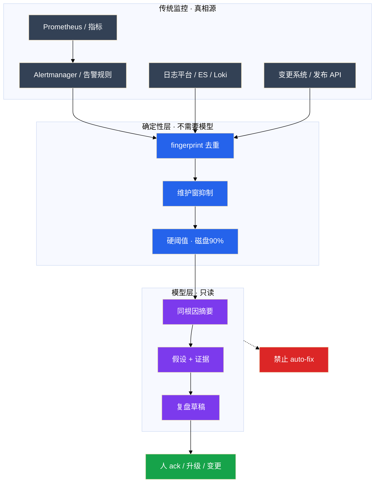
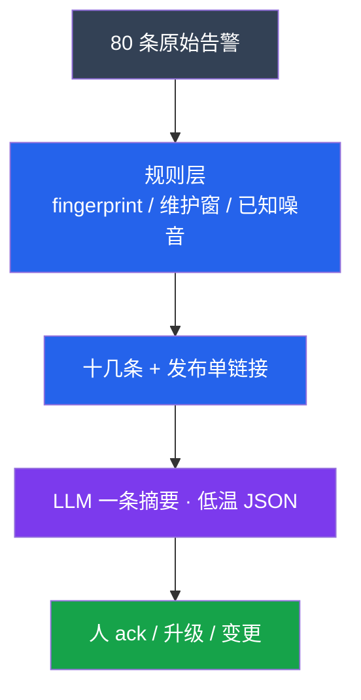
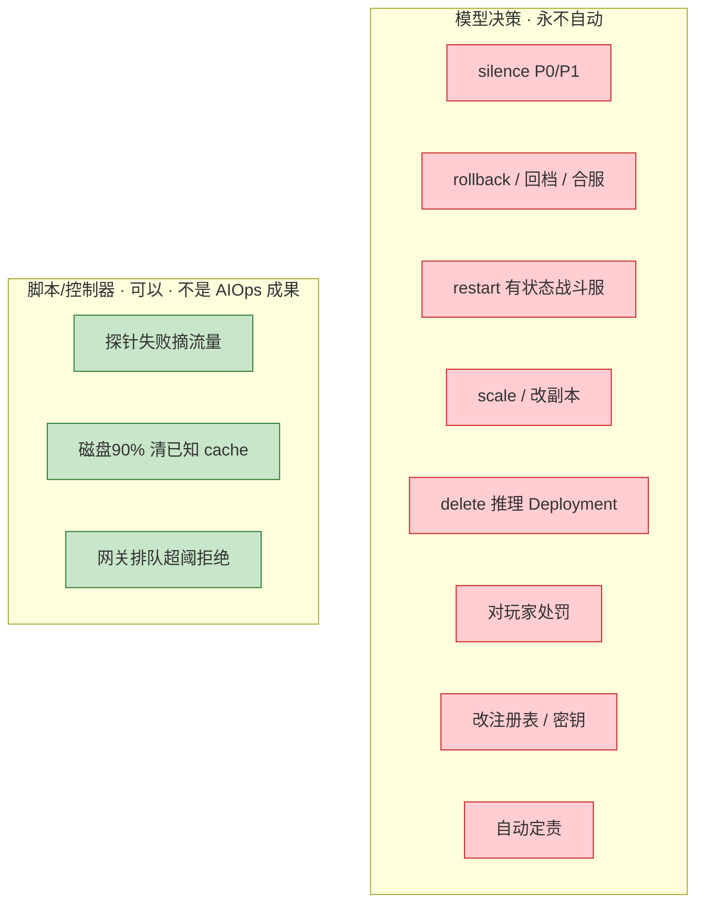
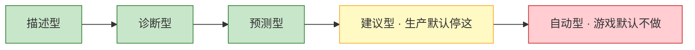

# 09｜AIOps 落地

> **加分项定位**：面试测「有没有判断力」——降噪怎么叠、根因为什么只给假设、为什么不能自动修；有落地加分，没落地能把边界讲清也加分。  
> **红线**：模型不能 auto-fix 生产；不能 auto silence P0；漏 P0/P1 = 失败；成熟度默认停 **建议型**；监控仍是真相源。

---

## 面试怎么考

| 频率 | 典型问法 | 30 秒要点 | 2 分钟要点 |
|:----:|----------|-----------|------------|
| ★★★★★ | AIOps 是什么？和传统监控什么关系？ | 增强对已采集信号的理解；不是新监控、不是自动运维大脑 | 监控/告警规则仍是真相源；AIOps 做降噪、聚类、摘要、根因假设；确定性阈值用脚本 |
| ★★★★★ | 告警降噪怎么做？ | 规则层先行：fingerprint/维护窗/P3 不进模型；再 LLM 收束 | 80 条→规则层十几条→一条摘要；漏 P0/P1 为失败；三率：条数+有效率+漏报 |
| ★★★★★ | 为什么 AI 不能自动修生产？ | 模型幻觉；有状态一次错杀=事故；写路径不接模型 | silence/rollback/restart 有状态服/scale/delete vllm 永远人审；脚本自动≠模型自动 |
| ★★★★ | 根因分析 AI 怎么做？ | 只输出假设+证据；人判断；不当最终结论 | 关联发布 API、指标、RAG 案例；不输出「根因已确定」；不定责 |
| ★★★★ | 没有 AIOps 项目怎么答？ | 讲边界+若从零先做登录链路降噪三层 | 不编平台；窄场景、只读、可度量、嵌 IM |
| ★★★ | 异常检测替代监控吗？ | 不替代；补「没有固定红线但今天不像往常」 | 磁盘 90% 硬阈值仍要；误报要人标收敛；不能当容量唯一依据 |

---

## SRE 边界

| 该用 | 禁止 |
|------|------|
| 告警 **降噪 + 同根因摘要**（人审后进群） | 模型 auto silence P0/P1 |
| 根因 **假设 + 证据**（变更链接、指标、RAG） | 「根因已确定」+ 自动 rollback |
| 日志 **聚类** 后抽样给 LLM | GB 日志整文件进模型 |
| 复盘/RCA **草稿**（未知标待补充） | 编造时间点进 wiki |
| 嵌进 **现有 IM/工单** | 另做没人打开的 APP |
| 低温 JSON + schema，失败 **降级规则层** | 半截散文推进群 |
| P0 原规则通道仍响；模型 **只附加** 摘要 | 模型拦截/silence P0 |
| 确定性自动化：探针摘流、磁盘 90% 清已知目录 | 贴 AI 标签冒充「模型自愈」 |
| 活动周 **对照表**：条数/有效率/漏报 | 只报「降噪 80%」 |

---

## 原理讲透

### 3.1 AIOps 与传统监控的关系

**一句话**：监控采集和告警规则是真相源；AIOps 在之上做 **理解层**，不替代 Prometheus/Alertmanager/日志平台。



| 层次 | 谁做 | 例子 |
|------|------|------|
| **采集** | Prometheus、日志 agent、链路 | 指标、日志、trace |
| **规则告警** | Alertmanager、阈值 | CPU>90%、探针失败 |
| **确定性自动化** | 脚本、控制器、网关 | 摘流、清 `/tmp/cache`、拒绝新请求 |
| **AIOps 理解层** | 规则+统计+LLM | 80 条合成 3 条线索、日志聚类、RCA 草稿 |
| **决策执行** | **人** + 变更流程 | ack、rollback、调 limit |

> **记住**：AIOps ≠ 新监控系统。模型输出是 **辅助信号**，不是 SLO 签字权。

**和相邻章节**：

- 摘要用低温 JSON（02）；相似案例 RAG（03）；只读查监控 FC/MCP（04、05）
- 多步只读调查 Agent（06）；GPU TTFT 单独成条（08）
- Vibe 写 bot 代码（07）

---

### 3.2 落地六条

**一句话**：缺只读优先或可度量，就不要写「做了 AIOps 平台」。

| # | 条 | 缺了会怎样 |
|---|-----|------------|
| 1 | **只读优先**：先分析建议，不自动变更 | 错摘要变 silence / auto rollback |
| 2 | **窄场景**：从一个痛点切入（如登录链路降噪） | 「平台」一年，值班仍看原始风暴 |
| 3 | **可度量**：条数、有效率、漏报率、采纳率 | 只报降噪率，漏支付 P0 无人知 |
| 4 | **可回滚**：模型错了系统不受损——因碰不到写路径 | 接上写路径，错了靠人救火 |
| 5 | **人在环**：关键决策人确认 | 夜班全自动，早班发现战斗服缩成 0 |
| 6 | **嵌现有系统**：告警进现有 IM/工单 | 新 APP 没人打开 |

**正确顺序**：痛点 → 只读接口 → 指标 → 小流量。不要先画微服务大图再找场景。

---

### 3.3 降噪三层

**一句话**：规则层先跑，P3 不进模型；漏 P0/P1 就是失败，条数下降不是成功。



| 层 | 做什么 | 不做什么 |
|----|--------|----------|
| **规则层（主）** | fingerprint 去重；维护窗；P3 及以下 **不进模型** | fingerprint 过粗把支付和登录合成一条 |
| **模型层（辅）** | 同根因一组 → 一条摘要；变更从 **发布 API 拉** | `action: rollback`；auto silence |
| **人** | ack / 升级 | 模型不能 silence P0 |

**输出 schema 要点（告警摘要）**：

```json
{
  "clusters": [{"theme": "string", "alert_count": 0}],
  "hypothesis": ["string"],
  "suggested_panels": ["string"],
  "change_links": [{"service": "string", "version": "string", "url": "string"}],
  "need_human": true,
  "confidence": "high|medium|low"
}
```

**禁止字段**：`action: rollback` / `silence: true` / `restart: ...`

**程序侧**：`json.loads` + schema；失败 → **降级只显示规则层结果**，不把半截散文推进群。

**漏报红线**：

- 漏 P0/P1 = **失败**
- 条数降 60% 但支付超时吞进「登录抖动」= 失败
- 汇报必须 **三率**：条数、有效率、漏报率

**P0/P1 通道**：旁路模型，或模型只附加摘要不拦截。推理 TTFT 升高 **单独成条**，不要吞进登录抖动（08）。

---

### 3.4 什么不能自动执行（No Auto-Fix）

**一句话**：模型决策永远不能 auto silence P0、auto rollback、restart 有状态服、scale、delete 推理 Deployment。



| 动作 | 谁可以做 | 为什么模型不能做 |
|------|----------|------------------|
| silence P0 | 人；P0 旁路模型 | 错摘要吞真故障 |
| rollback 大厅 | 变更单+人 | 有状态、爆炸半径大 |
| restart 战斗服 | 人审 | 踢开团玩家；limit 没改 OOM 还来 |
| delete vllm | 人按 08 清单 | GPU 过载应限流/预扩 |
| 磁盘 90% 清理 | **脚本**白名单目录 | 不要「模型认为泄漏所以 restart」 |
| 探针摘流 | **控制器** | 确定性，别贴 AI 标签 |

**成熟度模型**：



即使讨论自动型，**决策应来自规则，不是 LLM 投票**。群里出现「模型已自动 rollback」= 成熟度越界。

**开服夜对照**：

```
建议型（要）                         越界（不要）
摘要：三件事+链接+未变更              「根因已确定，已自动回滚大厅」
OOM：假设+RAG+人审调 limit           Agent 自己 restart gw-1
GPU：排队/显存证据+人预扩             模型 delete deploy vllm
磁盘90%：脚本清 /tmp/cache            「模型认为泄漏所以重启战斗服」
```

---

### 3.5 根因辅助（RCA Assist）

**一句话**：输出假设+证据并列；不当最终结论；不自动修；不定责。

**三条假设并列示例**：

```
假设 A  刚发版大厅 v1.2.3     证据：发布 API + 登录 P99
假设 B  gw-1 limit 打满       证据：OOMKilled + 内存曲线 + RAG 案例
假设 C  推理网关排队          证据：TTFT 8s + nvidia-smi 100%
```

值班选一条去验证。系统 **不** 输出「根因已确定」，不 auto rollback A、不 restart B、不 delete C。

| 技术 | 解决什么 | 坑 |
|------|----------|-----|
| **异常检测** | 学周期，偏离则报 | 误报、冷启动、改版基线漂移；**不替代**磁盘 90% 硬阈值 |
| **日志聚类** | 模板归类，看哪类错误暴涨 | 先聚类再抽样给 LLM；不要 GB 通读 |
| **根因辅助** | 假设+证据+相似案例（RAG） | 无证据链接=没上线；测试演练文档隔离 |

**异常检测 vs 硬阈值**：互补。固定红线（磁盘 90%、探针失败）仍要；异常检测补 QPS/延迟「今天不像往常」。上线后更吵 → 标误报、关小、灰度一条线，不要全集群开着装忙。

**日志聚类流程**：GB 战斗服日志 → 聚类得主因类型 → 按类型 RAG 搜 SOP（03）→ 抽样给 LLM 摘要。比整文件塞窗口便宜、稳。

**相似案例**：权限、时效、脱敏、环境标记。RAG 把测试环境「删库演练」推给生产值班 = 权限/环境没做。

---

### 3.6 度量：怎么证明有用

**一句话**：同时报条数、有效率、漏报率；采纳率不能单独当成功指标。

| 指标 | 定义 | 红线 |
|------|------|------|
| **条数** | 值班要读的 firing 数 | 对照上线前同一活动周 |
| **有效率** | 摘要/分类被人认为有用 | 每周抽检 5% |
| **漏报率** | P0/P1 被吞的比例 | **=0 才及格** |
| **采纳率** | 案例点击、摘要 pin | 必须和漏报、误导投诉一起看 |
| **误导操作** | 按 AI 建议做错的事 | 应趋近 0 |

**模型层开关**：漏报立刻 **关模型层**，回退纯规则。不要为了条数更好看加激进合并。

**AIOps 值班四条「命令」**：

```bash
# 1. 本周 P0/P1 漏报是否为 0
# 2. 条数/有效率/漏报率 — 对照上线前同一活动周
# 3. P0 原规则通道是否仍响（不被 silence）
# 4. JSON schema 失败是否降级到规则层
```

---

### 3.7 和 Agent / GPU / 传统 OnCall 的分工

**一句话**：AIOps 是产品边界；Agent 是调用形态；GPU 是另一条根因；Oncall 责任永远在人。

| 组件 | 角色 | 边界 |
|------|------|------|
| Alertmanager |  firing 真相 | 规则不改由 AI |
| AIOps 摘要 bot | 降噪+线索 | 只读 JSON，无写路径 |
| Agent（06） | 可选：串只读证据 | max_steps，不替 Oncall |
| RAG（03） | 相似案例 | 权限/时效 |
| GPU 运维（08） | TTFT/显存证据 | 单独成条，不吞进登录 |
| 人 Oncall | ack、变更、定责 | 最终签字 |

---

## 落地场景

### 场景 1：开服 80 条告警降噪

**背景**：活动开始，登录、网关、战斗、支付同时告警，群里刷屏。

**时间线**：

1. **规则层**：fingerprint 把同一登录超时合成 1 条；维护窗压已知噪音；P3 磁盘预警 **不进 LLM**。80 → 十几条。
2. **变更关联**：发布 API 返回「20:00 大厅 v1.2.3」，摘要里是 **链接**，不是模型猜。
3. **模型收束**：低温 JSON → 三组线索：登录超时、gw-1 OOM、推理 TTFT。`need_human: true`。无 rollback 字段。
4. **进现有 IM**：值班仍在老群 ack。支付 P0 若仍在原通道响 = 成功；若被吞 = 立刻关模型层。
5. **人下一步**：卡片旁挂错误检索（03）；GPU 按 08 `nvidia-smi`；**不** silence、不 rollback。

### 场景 2：没有项目，面试怎么讲

**讲法（不减分）**：

「我们还没上大平台，但边界清楚：第一刀做登录链路降噪三层，fingerprint → 变更 API → 低温摘要；P0 旁路不被 silence；写路径不接模型。根因只给假设+证据。若做过会对照活动周条数和漏报。脚本摘流是控制器能力，不是模型自愈。」

**减分讲法**：「智能根因大脑自动修复」；只报降噪 80% 不提漏报；编了一个没人用的 APP。

---

## 口述模板

### 【30 秒】

「AIOps 是在传统监控之上增强理解：降噪、聚类、摘要、根因假设，不替代 Prometheus 和告警规则。降噪三层：规则 fingerprint 先行，P3 不进模型，LLM 收束同根因摘要。不能 auto-fix：silence P0、rollback、restart 有状态服都不行。根因只给假设+证据，人判断。成熟度停建议型，漏 P0/P1 为失败，三率一起报。」

### 【2 分钟】

「监控采集和 Alertmanager 仍是真相源。AIOps 做理解层：确定性层 fingerprint、维护窗、硬阈值先跑，省钱少幻觉；模型层低温 JSON 把同根因告警收成摘要，变更从发布 API 拉。落地六条：只读优先、窄场景、可度量、可回滚、人在环、嵌 IM。禁止写路径：无 auto silence、rollback、scale、delete vllm。根因辅助并列假设 A/B/C 各带证据，不当最终结论。日志先聚类再抽样；异常检测 complement 硬阈值，不替代。脚本探针摘流可以自动，那是控制器不是模型决策。度量看条数、有效率、漏报率，漏报为零才及格。没项目也能讲边界和第一刀降噪三层。」

### 【常见追问】

| 追问 | 答法 |
|------|------|
| AIOps 替代监控吗？ | 不；增强理解 |
| 只报降噪 80%？ | 不够；漏 P0/P1=失败 |
| 模型猜刚发版？ | 错；发布 API 拉 |
| 脚本自动摘流算 AIOps 自愈吗？ | 不算；确定性脚本≠模型 |
| 没项目减分吗？ | 讲清边界不减分；编平台减分 |

---

## 必会 · 常考

### 对错表

| 说法 | 对错 | 纠正 |
|------|:----:|------|
| AIOps = 自动运维大脑 | ✗ | 增强理解，不替代监控 |
| 游戏有状态可 auto-fix | ✗ | 一次错杀=事故 |
| 只报降噪 80% 就成功 | ✗ | 漏 P0/P1 失败；三率 |
| 模型可 auto silence P0 | ✗ | P0 旁路或只附加 |
| 变更让模型猜 | ✗ | 发布 API |
| 异常检测替代磁盘 90% | ✗ | 互补 |
| 根因「已确定」并定责 | ✗ | 假设+证据 |
| 多 Agent 中枢比窄场景像做过 | ✗ | 先降噪三层 |
| 摘流贴 AI 标签=自愈 | ✗ | 脚本自动≠模型 |
| GB 日志整文件进模型 | ✗ | 先聚类 |
| 没项目一定减分 | ✗ | 边界讲清加分 |
| 成熟度必须自动型 | ✗ | 停建议型 |
| 可回滚可先接 rollback | ✗ | 写路径接上就不回滚 |
| 案例点击率单独=成功 | ✗ | 要看漏报 |

### 易混

| A | B | 区分 |
|---|---|------|
| 规则去重 | 模型摘要 | fingerprint vs LLM 收束 |
| 脚本自动 | 模型自动 | 探针摘流 vs LLM 决定 restart |
| 漏报 | 条数下降 | 失败 vs 可能藏问题 |
| 假设+证据 | 根因已确定 | 辅助 vs 越界 |
| 附加摘要 | 拦截 silence | 可以 vs 禁止 |
| 传统监控 | AIOps | 真相源 vs 理解层 |

### 数字与口令

| 项 | 参考 |
|----|------|
| 落地 | 六条 |
| 降噪 | 三层 |
| 漏报 | P0/P1 = 0 及格 |
| P3 | 默认不进模型 |
| 成熟度 | 停建议型 |
| 典型 | 80 条 → 规则十几条 → 1 摘要 |

---

## 合上书，问自己

1. AIOps 和传统监控什么关系？真相源是谁？
2. 落地六条是什么？第一刀为什么做降噪？
3. 降噪三层各做什么？漏 P0 怎么算、怎么改？
4. 哪些动作永远不能自动执行？哪些是脚本可以、别贴 AI？
5. 根因辅助怎么并列三条假设？和「根因已确定」差在哪？
6. 三率是哪三个？没有项目怎么讲不减分？

---

**本章不讲**：监控采集与告警规则 → [02-21 监控与告警](../../02-基础底座/21-监控与告警/)；日志平台 → [02-22 日志运维](../../02-基础底座/22-日志运维/) / [04-19 日志管理](../../04-Kubernetes/19-日志管理/)；RAG → [03](../03-RAG检索增强/)；FC/MCP → [04](../04-Function-Calling与Tool-Use/) / [05](../05-MCP协议/)；Agent 护栏 → [06](../06-Agent智能体/)；GPU SLO → [08](../08-GPU与推理服务运维/)；活动容量 → [08-05 活动高峰](../../08-游戏运维专题/05-活动高峰与压测/)。
