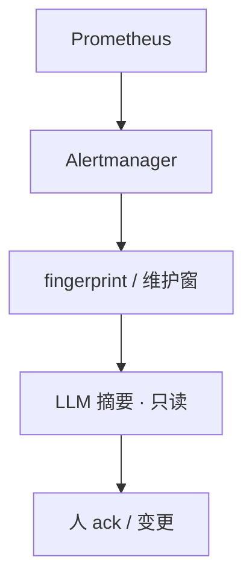
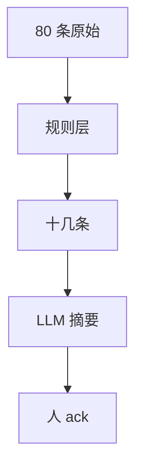
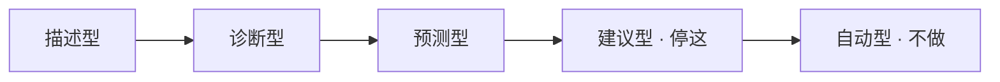
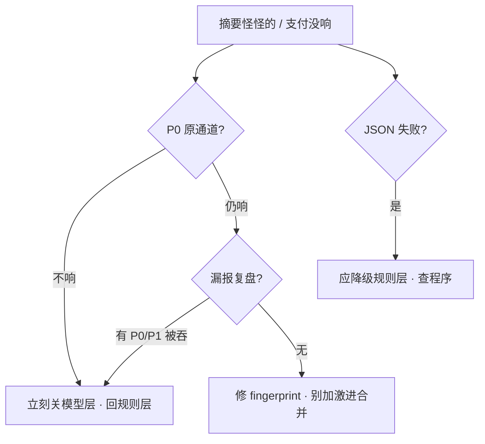

# 09｜AIOps 落地

开服 20:00，飞书群 80 条告警刷屏：登录超时、gw-1 OOM、推理 TTFT 8s、支付 P99 飙红全混在一起。有人想让模型「自动回滚大厅」省事；另有人只报「降噪 80%」——但支付 P0 被合成进「登录抖动」没人看见。**AIOps 是监控之上的理解层**，不是自动运维大脑；漏 P0/P1 = 失败。

> **加分项定位**：面试测「有没有判断力」——降噪怎么叠、根因为什么只给假设、为什么不能自动修；有落地加分，没落地能把边界讲清也加分。  
> **红线**：模型不能 auto-fix 生产；不能 auto silence P0；漏 P0/P1 = 失败；成熟度默认停 **建议型**；监控仍是真相源。

---

## 面试怎么考

| 频率 | 典型问法 | 30 秒要点 | 2 分钟要点 |
|:----:|----------|-----------|------------|
| ★★★★★ | AIOps 是什么？和传统监控什么关系？ | 增强对已采集信号的理解；不是新监控、不是自动运维大脑 | 监控/告警规则仍是真相源；AIOps 做降噪、聚类、摘要、根因假设；确定性阈值用脚本 |
| ★★★★★ | 告警降噪怎么做？ | 规则层先行：fingerprint/维护窗/P3 不进模型；再 LLM 收束 | 80 条→规则层十几条→一条摘要；漏 P0/P1 为失败；三率：条数+有效率+漏报 |
| ★★★★★ | 为什么 AI 不能自动修生产？ | 模型幻觉；有状态一次错杀=事故；写路径不接模型 | silence/rollback/restart 有状态服/scale/delete vllm 永远人审；脚本自动≠模型自动 |
| ★★★★ | 根因分析 AI 怎么做？ | 只输出假设+证据；人判断；不当最终结论 | 关联发布 API、指标、RAG 案例；不输出「根因已确定」；不定责 |
| ★★★★ | 没有 AIOps 项目怎么答？ | 讲边界+若从零先做登录链路降噪三层 | 不编平台；窄场景、只读、可度量、嵌 IM |
| ★★★ | 异常检测替代监控吗？ | 不替代；补「没有固定红线但今天不像往常」 | 磁盘 90% 硬阈值仍要；误报要人标收敛；不能当容量唯一依据 |

---

## SRE 边界

| 该用 | 禁止 |
|------|------|
| 告警 **降噪 + 同根因摘要**（人审后进群） | 模型 auto silence P0/P1 |
| 根因 **假设 + 证据**（变更链接、指标、RAG） | 「根因已确定」+ 自动 rollback |
| 日志 **聚类** 后抽样给 LLM | GB 日志整文件进模型 |
| 复盘/RCA **草稿**（未知标待补充） | 编造时间点进 wiki |
| 嵌进 **现有 IM/工单** | 另做没人打开的 APP |
| 低温 JSON + schema，失败 **降级规则层** | 半截散文推进群 |
| P0 原规则通道仍响；模型 **只附加** 摘要 | 模型拦截/silence P0 |
| 确定性自动化：探针摘流、磁盘 90% 清已知目录 | 贴 AI 标签冒充「模型自愈」 |
| 活动周 **对照表**：条数/有效率/漏报 | 只报「降噪 80%」 |

---

## 原理讲透

### 3.1 AIOps 与传统监控：真相源不变，理解层在上

**一句话**：监控采集和告警规则是真相源；AIOps 在之上做理解层，不替代 Prometheus/Alertmanager。

**打个比方**：医院体检仪（Prometheus）测血压血糖是**原始数据**；主治医生读报告写「可能三高，建议复查」是**理解层**——医生不能替代血压计，也不能不经你同意就开刀（auto-fix）。

**现场走一遍**（开服夜告警风暴）：

1. Alertmanager 仍 firing：`LoginP99High`、`GwOOM`、`InferenceTTFT` 各走原规则通道。
2. 规则层 fingerprint：同一 `login_timeout` 标签 47 条 → **1 条**；维护窗压掉已知 CDN 预热噪音。
3. 发布 API 返回：`hall-gw v1.2.3 @ 20:00`——写入摘要 **change_links**，不是模型猜。
4. LLM 低温 JSON 收束：三组线索 + `need_human: true`；**无** `action: rollback`。
5. 支付 P0 `PaymentTimeout` **仍在原通道响**——若被摘要吞掉 = 立刻关模型层。

**输出解读**：

| 层次 | 谁做 | 你看到什么 |
|------|------|------------|
| 采集 | Prometheus / 日志 agent | 原始指标、日志行 |
| 规则告警 | Alertmanager | firing 列表、severity |
| 确定性自动化 | 脚本/控制器 | 摘流、清 cache（**不是模型**） |
| AIOps 理解层 | 规则+LLM | 一条摘要、假设列表 |
| 决策 | **人** | ack、rollback、调 limit |

**面试怎么说**：「Prometheus 和 Alertmanager 仍是真相源；AIOps 做降噪摘要和根因假设；模型输出是辅助信号，不是 SLO 签字权。」



> **记住**：AIOps ≠ 新监控系统。和 02 低温 JSON、03 RAG、04/05 只读查监控、06 Agent 只读、07 写 bot、08 GPU 证据链衔接。

---

### 3.2 落地六条：缺只读或可度量，就别写「做了平台」

**一句话**：缺只读优先或可度量，就不要写「做了 AIOps 平台」。

**打个比方**：减肥——没体重秤（可度量）、还天天吃夜宵（自动变更），称不上「健康管理」；AIOps 同理，先窄场景、只读、能对照活动周数据。

**现场走一遍**（从零第一刀：登录链路降噪）：

1. **痛点**：活动周登录相关告警 200+ 条/夜，值班刷屏。
2. **只读接口**：Alertmanager webhook + 发布 API + Prometheus query（FC/MCP 05）。
3. **窄场景**：只做 `service=login` 链路，不做「全集群智能大脑」。
4. **可度量**：对照上线前同一活动周——条数、有效率抽检、**P0/P1 漏报=0**。
5. **嵌 IM**：摘要进现有飞书 OnCall 群，不另做 APP。
6. **可回滚**：模型 JSON 解析失败 → **降级只显示规则层**，不把半截散文推进群。

**输出解读**：

| 六条 | 缺了会怎样 | 验收问什么 |
|------|------------|------------|
| 只读优先 | 错摘要变 auto rollback | 写路径有没有接模型？ |
| 窄场景 | 一年「平台」值班仍看原始风暴 | 第一刀是哪个 service？ |
| 可度量 | 只报降噪 80%，漏支付无人知 | 三率各多少？ |
| 可回滚 | 错了靠人救火 | schema 失败降级了吗？ |
| 人在环 | 夜班全自动，早班战斗服缩成 0 | P0 谁 ack？ |
| 嵌现有系统 | 新 APP 没人打开 | 摘要在哪看？ |

**面试怎么说**：「落地六条：只读、窄场景、可度量、可回滚、人在环、嵌 IM；第一刀登录链路降噪三层，不先画微服务大图。」

---

### 3.3 降噪三层：规则先行，漏 P0/P1 就是失败

**一句话**：规则层先跑，P3 不进模型；漏 P0/P1 就是失败，条数下降不是成功。

**打个比方**：收件箱——先过滤垃圾邮件和重复订阅（规则层），再把同主题的 20 封合成一封摘要（模型层）；**不能把银行扣款通知当广告滤掉**（漏 P0）。

**现场走一遍**（80 条 → 一条摘要）：

1. **原始**：80 条 firing（登录 47、网关 12、磁盘 P3 15、支付 P0 1、推理 5）。
2. **规则层**：

```text
fingerprint(login_timeout) → 1 条
维护窗: CDN预热 → 抑制
P3 disk_warning → 不进 LLM
支付 PaymentTimeout severity=critical → 旁路，不合并
```

3. 规则层后：**十几条** + 支付 P0 **独立响**。
4. **模型层**（低温 JSON）输入：十几条 + change_links；输出：

```json
{
  "clusters": [
    {"theme": "登录超时", "alert_count": 1},
    {"theme": "gw-1 OOM", "alert_count": 1},
    {"theme": "推理 TTFT 升高", "alert_count": 1}
  ],
  "hypothesis": ["发版 v1.2.3 后大厅网关内存", "推理队列过载"],
  "change_links": [{"service": "hall-gw", "version": "v1.2.3", "url": "https://..."}],
  "need_human": true,
  "confidence": "medium"
}
```

5. **禁止字段检查**：无 `action`、无 `silence: true`。
6. 人 ack；GPU 线索按 08 单独查，不吞进「登录抖动」。

**schema 失败时**（模型返回半截散文）：

1. 程序侧 `json.loads` 抛错 → **不**把原文推进群。
2. 降级卡片只显示规则层结果：

```text
[规则层 · 模型暂不可用]
· login_timeout ×1（已 fingerprint）
· gw-1 OOM ×1
· 变更：hall-gw v1.2.3 @ 20:00 [链接]
请值班按原 firing 列表 ack
```

3. 同时告警平台同学：模型层故障，**漏报监控仍靠原通道**。

**输出解读**：

| 阶段 | 条数 | 成功标准 |
|------|------|----------|
| 原始 | 80 | — |
| 规则层 | ~15 | P0 仍独立 |
| 模型摘要 | 1 条卡片 | 支付 P0 原通道仍响 |
| 失败例 | 条数降 60% | 支付吞进登录 = **失败** |

**面试怎么说**：「降噪三层：fingerprint 和维护窗先行，P3 不进模型；LLM 收束同根因；漏 P0/P1 失败；汇报条数+有效率+漏报三率。」



---

### 3.4 No Auto-Fix：写路径不接模型，脚本自动≠模型自愈

**一句话**：模型决策永远不能 auto silence P0、auto rollback、restart 有状态服、scale、delete 推理 Deployment。

**打个比方**：自动驾驶——游戏有状态服像载满乘客的缆车，模型一次误判 rollback 等于剪断缆绳；探针摘流像月台闸门自动关，是**确定性脚本**，不是 AI「觉得该关」。

**现场走一遍**（对比建议型 vs 越界）：

**建议型（要）**——群里卡片：

```text
摘要：三件事——登录超时、gw-1 OOM、推理 TTFT 8s
变更：hall-gw v1.2.3 @ 20:00 [链接]
假设 A：发版引入内存问题 — 证据：OOMKilled + 曲线
建议：人审调 limit / 回滚（未执行）
need_human: true
```

**越界（不要）**——若出现：

```text
根因已确定：v1.2.3 有问题，已自动回滚大厅
```

→ **成熟度越界**；立刻下线写路径，走事故复盘。

**开服夜对照表**（面试可背）：

| 建议型（要） | 越界（不要） |
|--------------|--------------|
| 摘要：三件事+链接+未变更 | 「根因已确定，已自动回滚大厅」 |
| OOM：假设+RAG+人审调 limit | Agent 自己 restart gw-1 |
| GPU：排队/显存证据+人预扩 | 模型 delete deploy vllm |
| 磁盘 90%：脚本清 `/tmp/cache` | 「模型认为泄漏所以重启战斗服」 |

即使讨论「自动型」成熟度，**决策应来自规则，不是 LLM 投票**。群里出现「模型已自动 rollback」= 成熟度越界。

| 动作 | 谁可以做 | 为什么模型不能做 |
|------|----------|------------------|
| silence P0 | 人；P0 旁路 | 错摘要吞真故障 |
| rollback 大厅 | 变更单+人 | 有状态、爆炸半径大 |
| restart 战斗服 | 人审 | 踢开团玩家 |
| delete vllm | 人按 08 清单 | 应限流/预扩 |
| 磁盘 90% 清 cache | **脚本**白名单 | 确定性目录 |
| 探针摘流 | **控制器** | 别贴 AI 标签 |

**输出解读**：

| 群里出现的话 | 级别 | 处理 |
|--------------|------|------|
| 「建议人审回滚」 | 建议型 ✓ | 人走变更单 |
| 「已自动 rollback」 | 越界 ✗ | 关写路径、复盘 |
| 「模型认为泄漏已 restart」 | 越界 ✗ | 同左 |
| 探针失败自动摘流 | 脚本 ✓ | 不算模型自愈 |

**面试怎么说**：「不能 auto silence P0、rollback、restart 有状态服、scale、delete vllm；成熟度停建议型；脚本摘流是控制器，不是模型决策。」



---

### 3.5 根因辅助：假设并列，不当最终结论

**一句话**：输出假设+证据并列；不当最终结论；不自动修；不定责。

**打个比方**：刑侦白板——A/B/C 三条线索并列贴着，侦探（值班）选一条去验证；不是 AI 盖章「凶手就是他」还自动抓人。

**现场走一遍**（gw-1 OOM + 推理慢）：

1. 系统输出（不是「根因已确定」）：

```text
假设 A  刚发版大厅 v1.2.3
  证据：发布 API 20:00 + 登录 P99 曲线

假设 B  gw-1 limit 打满
  证据：OOMKilled 137 + memory 贴 limit + RAG 案例「上次调 limit」

假设 C  推理网关排队
  证据：TTFT 8s + nvidia-smi 100%（08）
```

2. 值班选 B → 只读验证：`kubectl top pod gw-1`、PromQL `container_memory_working_set_bytes`。
3. 变更：人审调 `limits.memory`；**不** auto restart、**不** delete vllm。
4. 日志若需 AI：GB 战斗服日志 → **先聚类**得主因类型 → 每类抽样 20 行给 LLM，不整文件通读。

**输出解读**：

| 技术 | 解决什么 | 坑 |
|------|----------|-----|
| 异常检测 | 今天不像往常 | 不替代磁盘 90% 硬阈值 |
| 日志聚类 | 哪类错误暴涨 | 先聚类再抽样 |
| 根因辅助 | 假设+证据+RAG | 无证据=没上线 |
| RAG 案例 | 相似 SOP | 测试环境案例别推生产 |

**面试怎么说**：「根因只给假设 A/B/C 各带证据；人验证变更；异常检测 complement 硬阈值；日志先聚类再抽样；不定责不 auto fix。」

---

### 3.6 度量：三率一起报，漏报为零才及格

**一句话**：同时报条数、有效率、漏报率；采纳率不能单独当成功指标。

**打个比方**：减肥不能只报「少吃 80%」——还得称体重（条数）、看体脂（有效率）、**有没有饿晕进急诊**（漏报 P0）。

**现场走一遍**（活动周对照）：

1. 拉上线前同一活动周：firing 条数 **均值 210/夜**。
2. 上线后本周：**68/夜**（条数降 68%）。
3. 抽检 5% 摘要：有效率 **82%**（值班认为有用）。
4. **漏报**：本周 P0/P1 被模型层吞掉 **0 起** → 及格；若有 1 起支付 P0 → **关模型层**，回退纯规则。
5. 误导操作投诉：**0**；采纳率（案例点击）**45%**——和漏报一起看，不单独吹。

**输出解读**：

| 指标 | 定义 | 红线 |
|------|------|------|
| **条数** | 值班要读的 firing 数 | 对照同活动周 |
| **有效率** | 摘要被认为有用 | 每周抽检 5% |
| **漏报率** | P0/P1 被吞比例 | **=0 及格** |
| **采纳率** | 案例点击、pin | 必须和漏报同看 |
| **误导操作** | 按 AI 建议做错 | 应趋近 0 |

**AIOps 值班四条自查**：

```bash
# 1. 本周 P0/P1 漏报是否为 0
# 2. 条数/有效率/漏报率 — 对照上线前同一活动周
# 3. P0 原规则通道是否仍响（不被 silence）
# 4. JSON schema 失败是否降级到规则层
```

**面试怎么说**：「三率：条数、有效率、漏报率；漏 P0/P1 立刻关模型层；只报降噪 80% 不够；采纳率不能单独当 KPI。」

---

### 3.7 分工：AIOps 是边界，Agent 是形态，Oncall 在人

**一句话**：AIOps 是产品边界；Agent 是调用形态；GPU 是另一条根因；Oncall 责任永远在人。

**打个比方**：急诊分诊台（AIOps 摘要）告诉你看哪几科；住院医（Agent 06）可帮你跑只读检查单；外科（GPU 08）专看推理；**签字出院的还是你**（Oncall）。

**现场走一遍**（一条 P0 怎么走完全链路）：

1. Alertmanager firing `PaymentTimeout` P0 → **原通道响**（不被模型 silence）。
2. AIOps bot 附加摘要：「支付超时与登录/login 无关，单独成条」+ 面板链接。
3. 可选 Agent（06）：只读串 `query_prometheus` + `search_logs`，`max_steps=12`，输出假设+证据，**无写工具**。
4. 推理 TTFT 若相关：摘要里 **单独 cluster**，值班按 08 `nvidia-smi`，不吞进登录。
5. 人 ack → 变更单 → rollback/扩 limit；RCA wiki 用模型**草稿**，未知标「待补充」。

**输出解读**：

| 组件 | 角色 | 边界 |
|------|------|------|
| Alertmanager | firing 真相 | 规则不由 AI 改 |
| AIOps 摘要 bot | 降噪+线索 | 只读 JSON |
| Agent（06） | 串只读证据 | max_steps，不替 Oncall |
| RAG（03） | 相似案例 | 权限/时效/环境 |
| GPU（08） | TTFT/显存证据 | 单独成条 |
| 人 Oncall | ack、变更、定责 | 最终签字 |

**面试怎么说**：「AIOps 定产品边界：摘要只读、P0 旁路；Agent 可选只读调查；GPU 证据单独；定责和变更永远在人。」

---

## 落地场景

### 场景 1：开服 80 条告警降噪

**背景**：活动开始，登录、网关、战斗、支付同时告警，群里刷屏。

**时间线**：

1. **规则层**：fingerprint 把同一登录超时合成 1 条；维护窗压已知噪音；P3 磁盘预警 **不进 LLM**。80 → 十几条。
2. **变更关联**：发布 API 返回「20:00 大厅 v1.2.3」，摘要里是 **链接**，不是模型猜。
3. **模型收束**：低温 JSON → 三组线索：登录超时、gw-1 OOM、推理 TTFT。`need_human: true`。无 rollback 字段。
4. **进现有 IM**：值班仍在老群 ack。支付 P0 若仍在原通道响 = 成功；若被吞 = 立刻关模型层。
5. **人下一步**：卡片旁挂错误检索（03）；GPU 按 08 `nvidia-smi`；**不** silence、不 rollback。

**拒绝点**：auto rollback；支付 P0 被合并；模型猜变更版本。

### 场景 2：JSON 解析失败，规则层兜底

**背景**：活动高峰模型返回半截散文，值班不能等工程师修 prompt。

**时间线**：

1. webhook 收到 LLM 输出，`json.loads` 失败。
2. **不**把散文贴进飞书群（避免误导按「已回滚」执行）。
3. 自动降级：只推规则层卡片（fingerprint 结果 + 发布 API change_links）。
4. P0 原 Alertmanager 通道 **不受影响**——值班仍按 firing 列表 ack。
5. 活动后：修 schema 校验、加 retry；漏报复盘看本周 P0/P1 是否为 0。

**讲时要有的细节**：「模型层挂了系统仍可用，因为写路径本来就没接；降级是设计不是事故。」

### 场景 3：没有项目，面试怎么讲

**讲法（不减分）**：

「我们还没上大平台，但边界清楚：第一刀做登录链路降噪三层，fingerprint → 变更 API → 低温摘要；P0 旁路不被 silence；写路径不接模型。根因只给假设+证据。若做过会对照活动周条数和漏报。脚本摘流是控制器能力，不是模型自愈。」

**减分讲法**：「智能根因大脑自动修复」；只报降噪 80% 不提漏报；编了一个没人用的 APP。

### 生产排障：模型层该不该关？

三问：P0 原通道还响吗？漏报有没有？JSON 失败有没有降级？



| 现象 | 先做 | 别做 |
|------|------|------|
| 支付 P0 群里没了 | 关模型层；查 fingerprint | 以为「降噪成功」 |
| 摘要写「已回滚」 | 核实变更系统；下线写路径 | 当事实继续传播 |
| 条数骤降、值班仍慌 | 看有效率抽检 | 只庆祝降噪率 |
| schema 经常失败 | 低温+retry+降级 | 把半截 JSON 推进群 |

---

## 口述模板

### 【30 秒】

「AIOps 是在传统监控之上增强理解：降噪、聚类、摘要、根因假设，不替代 Prometheus 和告警规则。降噪三层：规则 fingerprint 先行，P3 不进模型，LLM 收束同根因摘要。不能 auto-fix：silence P0、rollback、restart 有状态服都不行。根因只给假设+证据，人判断。成熟度停建议型，漏 P0/P1 为失败，三率一起报。」

### 【2 分钟】

「监控采集和 Alertmanager 仍是真相源。AIOps 做理解层：确定性层 fingerprint、维护窗、硬阈值先跑，省钱少幻觉；模型层低温 JSON 把同根因告警收成摘要，变更从发布 API 拉。落地六条：只读优先、窄场景、可度量、可回滚、人在环、嵌 IM。禁止写路径：无 auto silence、rollback、scale、delete vllm。根因辅助并列假设 A/B/C 各带证据，不当最终结论。日志先聚类再抽样；异常检测 complement 硬阈值，不替代。脚本探针摘流可以自动，那是控制器不是模型决策。度量看条数、有效率、漏报率，漏报为零才及格。没项目也能讲边界和第一刀降噪三层。」

### 【常见追问】

| 追问 | 答法 |
|------|------|
| AIOps 替代监控吗？ | 不；增强理解 |
| 只报降噪 80%？ | 不够；漏 P0/P1=失败 |
| 模型猜刚发版？ | 错；发布 API 拉 |
| 脚本自动摘流算 AIOps 自愈吗？ | 不算；确定性脚本≠模型 |
| 没项目减分吗？ | 讲清边界不减分；编平台减分 |

---

## 必会 · 常考

### 对错表

| 说法 | 对错 | 纠正 |
|------|:----:|------|
| AIOps = 自动运维大脑 | ✗ | 增强理解，不替代监控 |
| 游戏有状态可 auto-fix | ✗ | 一次错杀=事故 |
| 只报降噪 80% 就成功 | ✗ | 漏 P0/P1 失败；三率 |
| 模型可 auto silence P0 | ✗ | P0 旁路或只附加 |
| 变更让模型猜 | ✗ | 发布 API |
| 异常检测替代磁盘 90% | ✗ | 互补 |
| 根因「已确定」并定责 | ✗ | 假设+证据 |
| 多 Agent 中枢比窄场景像做过 | ✗ | 先降噪三层 |
| 摘流贴 AI 标签=自愈 | ✗ | 脚本自动≠模型 |
| GB 日志整文件进模型 | ✗ | 先聚类 |
| 没项目一定减分 | ✗ | 边界讲清加分 |
| 成熟度必须自动型 | ✗ | 停建议型 |
| 可回滚可先接 rollback | ✗ | 写路径接上就不回滚 |
| 案例点击率单独=成功 | ✗ | 要看漏报 |

### 易混

| A | B | 区分 |
|---|---|------|
| 规则去重 | 模型摘要 | fingerprint vs LLM 收束 |
| 脚本自动 | 模型自动 | 探针摘流 vs LLM 决定 restart |
| 漏报 | 条数下降 | 失败 vs 可能藏问题 |
| 假设+证据 | 根因已确定 | 辅助 vs 越界 |
| 附加摘要 | 拦截 silence | 可以 vs 禁止 |
| 传统监控 | AIOps | 真相源 vs 理解层 |

### 数字与口令

| 项 | 参考 |
|----|------|
| 落地 | 六条 |
| 降噪 | 三层 |
| 漏报 | P0/P1 = 0 及格 |
| P3 | 默认不进模型 |
| 成熟度 | 停建议型 |
| 典型 | 80 条 → 规则十几条 → 1 摘要 |

---

## 合上书，问自己

1. AIOps 和传统监控什么关系？真相源是谁？
2. 落地六条是什么？第一刀为什么做降噪？
3. 降噪三层各做什么？漏 P0 怎么算、怎么改？
4. 哪些动作永远不能自动执行？哪些是脚本可以、别贴 AI？
5. 根因辅助怎么并列三条假设？和「根因已确定」差在哪？
6. 三率是哪三个？没有项目怎么讲不减分？
7. JSON schema 失败时群里应出现什么？为什么不能贴半截散文？

七题都能口述，这一章就过了。下一章若做告警 bot，记住：**建议型卡片进现有 IM，写路径永远不接模型。**

---

**本章不讲**：监控采集与告警规则 → [02-21 监控与告警](../../02-基础底座/21-监控与告警/)；日志平台 → [02-22 日志运维](../../02-基础底座/22-日志运维/) / [04-19 日志管理](../../04-Kubernetes/19-日志管理/)；RAG → [03](../03-RAG检索增强/)；FC/MCP → [04](../04-Function-Calling与Tool-Use/) / [05](../05-MCP协议/)；Agent 护栏 → [06](../06-Agent智能体/)；GPU SLO → [08](../08-GPU与推理服务运维/)；活动容量 → [08-05 活动高峰](../../08-游戏运维专题/05-活动高峰与压测/)。
