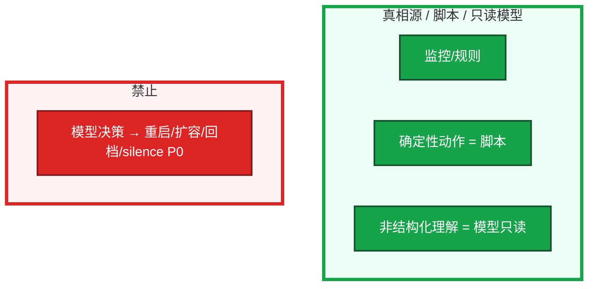

# 09｜AIOps 落地 · 练习题

先自己画图或口述，再对照解答。每题标了覆盖范围：

| 标记 | 含义 |
|------|------|
| **核心** | 不懂整章就没建立起来 |
| **必会** | 值班和面试都要能讲 |
| **常用** | 线上会反复碰到 |
| **常考** | 白板和追问的高频口径 |

没有落地项目也能答边界；有项目按窄场景和漏报讲。

## 本题目录

- [Q1 能做 / 不能做](#q1)
- [Q2 第一刀降噪三层](#q2)
- [Q3 什么不能自动执行](#q3)
- [Q4 六条与成熟度](#q4)
- [Q5 根因辅助怎么讲](#q5)
- [Q6 异常检测更吵](#q6)
- [Q7 日志聚类](#q7)
- [Q8 漏报事后](#q8)
- [Q9 没有项目 / 排障](#q9)
- [合上书](#合上书)

---

## Q1

**★★★★★｜AIOps 能做什么，不能做什么？**

**覆盖**：核心 · 必会 · 常考

### 场景

简历写「智能运维大脑，自动修复生产」。战斗服是有状态的。

### 完整解答

能做：告警降噪、异常检测、日志聚类、根因辅助（假设+证据）、复盘草稿、知识检索。  
不能做：替代监控采集、**自动修生产**、自动定责、当唯一容量真相。



本质是增强理解。模型会幻觉，写操作人批准。生产数据不出域。容量看压测、水位、活动预报。

### 再追问

为什么不能自动故障自愈？——判断会错、会被注入，有状态环境一次错杀就是事故。确定性摘流、清已知临时目录用脚本；不要「模型认为泄漏所以重启」。limit 没改，OOM 还会来。

---

## Q2

**★★★★★｜落地第一个场景选什么？三层怎么做？**

**覆盖**：核心 · 必会 · 常考

### 场景

活动开始告警刷屏，要立项「AIOps 平台」。80 条告警，有人要把 LLM 接在所有告警前面。

### 完整解答

选告警降噪：痛点清、只读、好度量。不要先做大中枢。正确顺序：痛点 → 只读接口 → 指标 → 小流量。

```
  规则层：fingerprint 去重、维护窗、噪音名单、P3 不进模型
  模型层：同根因摘要 + 从发布系统拉变更（不猜）
  人：ack 或升级；模型不能自动 silence
```

规则为主，模型为辅。嵌进现有 IM，不另开 APP。低温 JSON + schema，失败降级成只显示规则层。`need_human: true`，没有 `action: rollback`。P0 通道仍走原规则。TTFT 升高不要吞进「登录抖动」。

证明有效：同时报条数、有效率、漏报率。漏 P0/P1 为失败。只报「少了 80%」是藏问题。本周 P0/P1 漏报 = 0 才及格。没有活动周对照不要写进项目。

### 再追问

开服 80 条眼睛应看到什么？——规则层先降到十几条（还没花 token）→ 发布 API 链接 → 一条摘要三件事 → 老群 ack。支付 P0 若被吞，立刻关模型层。

---

## Q3

**★★★★★｜哪些动作永远不能自动执行？脚本自动和模型自动差在哪？**

**覆盖**：核心 · 必会 · 常考

### 场景

摘要卡片带「一键 rollback」「一键 silence」。有人说磁盘 90% 让模型判断完重启战斗服。另有人要把 GPU 过载交给模型投票删推理 Pod。

### 完整解答

模型决策永远不要自动执行：silence P0/P1、rollback/回档/合服、重启有状态战斗服、scale、delete 推理 Deployment、对玩家处罚、改注册表/密钥、自动定责。

脚本/控制器可以自动（不是 AIOps 成果，也不贴 AI 标签）：探针失败摘流量、磁盘 90% 清已知 `/tmp/cache`（目录白名单）、网关排队超阈值拒绝新请求。

无状态可回滚的小动作：仍要规则触发、可回滚、人能关。不要把 LLM 放在写路径上「感觉该重启」。分清「脚本自动」和「模型自动」。群里出现模型触发的 rollback = 成熟度越界，先拆写路径。

### 再追问

建议型和越界对照？——摘要三件事+未变更 vs 「根因已确定已自动回滚」；OOM 假设+人审调 limit vs Agent restart；GPU 证据+人预扩 vs delete vllm。

---

## Q4

**★★★★☆｜落地六条缺一条会怎样？成熟度停在哪一级？**

**覆盖**：必会 · 常考

### 场景

做了模型摘要，但摘要里带一键 silence，且另做了一个没人打开的 APP。「我们要做到自动型才算 AIOps。」

### 完整解答

六条：只读优先、窄场景、可度量、可回滚、人在环、嵌现有系统。缺只读 = 错摘要会变成错变更。缺度量 = 无法证明。缺嵌现有 = 没人用。缺窄场景 = 平台做一年值班仍看风暴。人在环缺了 = 早班发现战斗服被缩成 0。可回滚在只读设计里几乎免费；已经自动 rollback 了就不是可回滚，先拆写路径。

成熟度：描述 → 诊断 → 预测 → **建议型（默认停）** → 自动型（单独论证）。游戏有状态环境默认不跳自动型。即使讨论自动型，决策应来自规则，不是 LLM 投票。

### 再追问

写路径在不在是第一问。在，六条已经断了。

---

## Q5

**★★★★★｜做过「根因分析」怎么讲才像真的？**

**覆盖**：必会 · 常考

### 场景

追问误报怎么收、漏报红线是什么。只剩架构图的人会卡。系统输出「根因已确定：Redis，已自动重启」。

### 完整解答

讲辅助定位：假设 + 证据（变更、指标、相似案例来自 RAG），人确认。并列三条，不当最终结论，不自动定责，不自动修。窄场景名、上线前后对照、误报漏报怎么处理、人在环。承认某类告警效果一般更可信。根因没有证据链接，当没上线。

露馅：智能大脑、自动自愈、只报好指标、答不出漏报。没有项目就如实讲会怎么做第一条降噪，不编造。自动定责不做——伤人且经常点错。

```
  假设 A  刚发版大厅 v1.2.3     证据：发布 API + 登录 P99
  假设 B  gw-1 limit 打满       证据：OOMKilled + 内存曲线 + RAG
  假设 C  推理网关排队          证据：TTFT 8s + nvidia-smi
```

### 再追问

告警旁挂相似案例要注意什么？——权限、时效、脱敏、带来源、标环境。测试/演练文档隔离。点击率不能单独当成功指标，必须和漏报、误导投诉一起看。

---

## Q6

**★★★★☆｜异常检测上线后告警更吵了怎么办？**

**覆盖**：必会 · 常用

### 场景

QPS 异常检测全集群打开，值班比以前更炸。有人要用它当容量规划唯一依据，并取代磁盘 90% 硬阈值。

### 完整解答

误报：基线冷启动/没学到周期、阈值太敏、业务改版后漂移、开服流量被当成「不像往常」。建立反馈（人标误报）、按周期建基线、动态更新、先灰度一条业务线。更吵就先关小，不要硬撑着装忙。

固定硬阈值（磁盘 90%）仍保留；异常检测补没有固定红线的指标。两者不是替代。不能当容量规划唯一依据。

### 再追问

上线后更吵说明什么？——误报没收敛。先关小再调，不要全集群开着装忙。

---

## Q7

**★★★★☆｜日志聚类解决什么？和把日志丢给长窗口模型有何不同？**

**覆盖**：必会 · 常用

### 场景

战斗服 GB 级日志，有人要全部塞进 1M 窗口。

### 完整解答

聚类按模板归类，「哪类错误多少条」，从量里抓主因类型。整文件塞窗口贵、慢、易截断（01），也没有结构。聚类 + 抽样再给 LLM 摘要，比通读全文靠谱。错误检索之前先聚类，再按主类型搜 SOP。

聚类结果能当线索（某类错误暴涨），根因仍要变更和指标证据，人判断。你眼睛看到「OOMKilled 1200 次 / timeout 80 次」，而不是把 GB 日志贴进模型。

### 再追问

聚类结果能当根因吗？——能当线索，不能当「根因已确定」。

---

## Q8

**★★★★☆｜降噪漏报了一条 P0，事后怎么改系统？**

**覆盖**：必会 · 常用

### 场景

fingerprint 把支付超时和登录超时合成一条，支付 P0 被压成「登录抖动」。有人为了条数更好看要继续加激进合并。

### 完整解答

漏报是失败。复盘：fingerprint 维度是否过粗、维护窗是否误伤、模型是否被允许 silence。立刻关模型层，回退纯规则。P0/P1 通道旁路模型，或模型只附加摘要不拦截。补漏报率看板。不要为了条数更好看继续加激进合并。

P3 默认不进模型，省钱、少幻觉。规则滤掉即可。

### 再追问

JSON 失败半截散文进群？——降级只显示规则层结果，不要当摘要用。

---

## Q9

**★★★★☆｜没有 AIOps 项目怎么不减分？给出现象先走哪条？**

**覆盖**：必会 · 常用 · 常考

### 场景

公司还停留在 Grafana + 工单。四个工单：① 群里「已自动 rollback」② 支付 P0 被吞 ③ 异常检测更吵 ④ 另做一个 APP 没人打开。

### 完整解答

没有项目：讲边界和若从零做的第一刀——降噪三层、漏报红线、不自动修。能讲清比编「智能平台」加分。吹自动修才减分。会用 RAG/工具调用/GPU 运维补。AIOps 看判断力，不看 PPT 层数。答不出漏报怎么处理、答不出模型错了系统为何不受损，就不要用 AIOps 当项目名。

| # | 走哪条 | 不要做 |
|---|--------|--------|
| ① | 立刻拆写路径 | 继续调模型 |
| ② | 关模型层；修 fingerprint；P0 旁路 | 为条数继续合并 |
| ③ | 关小、标误报、灰度一条线 | 全集群开着装忙 |
| ④ | 嵌回现有 IM | 再画中枢大图 |

现场：写路径 → P0 通道还在不在 → 对照表漏报 → JSON 是否降级 → 相似案例环境标记。

### 再追问

会不会显得落后？——会用 03/04/08 补。加分模块不是生死线。

---

## 合上书

- [ ] 能说出 AIOps 增强理解、不替代监控、不能自动修生产
- [ ] 能背落地六条，并说出缺一条的现场；成熟度停建议型
- [ ] 能讲降噪三层，漏 P0/P1 为失败，三率一起报
- [ ] 能列出不能自动执行的清单，并拆开脚本自动 vs 模型自动
- [ ] 能用假设+证据讲根因辅助，异常检测更吵会关小
- [ ] 没有项目也能讲第一刀和边界；能按写路径 / 漏报 / 更吵分流，而不是吹大脑
