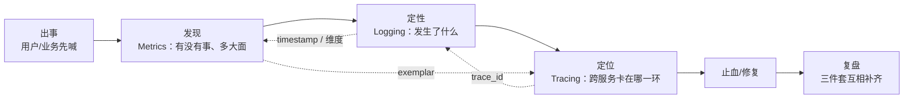
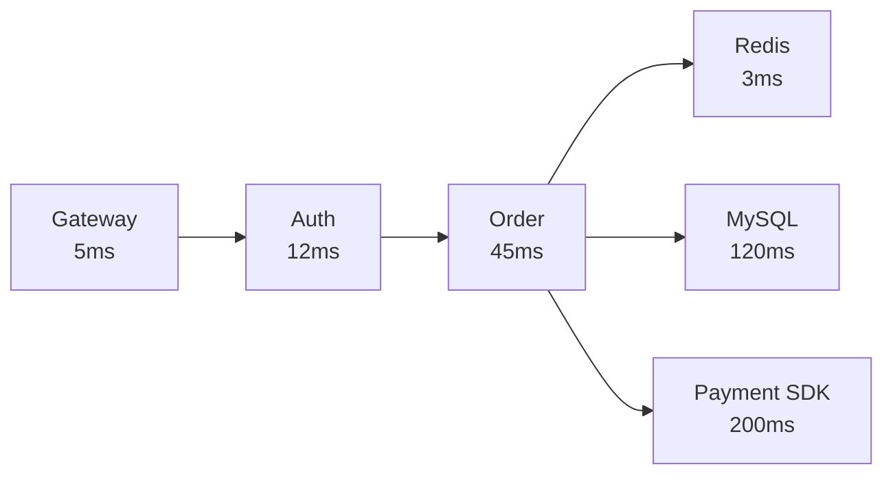
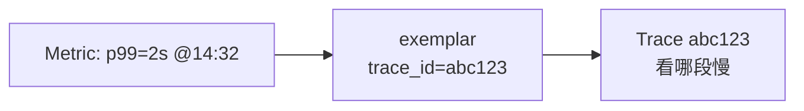
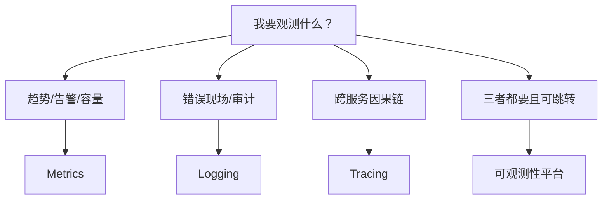
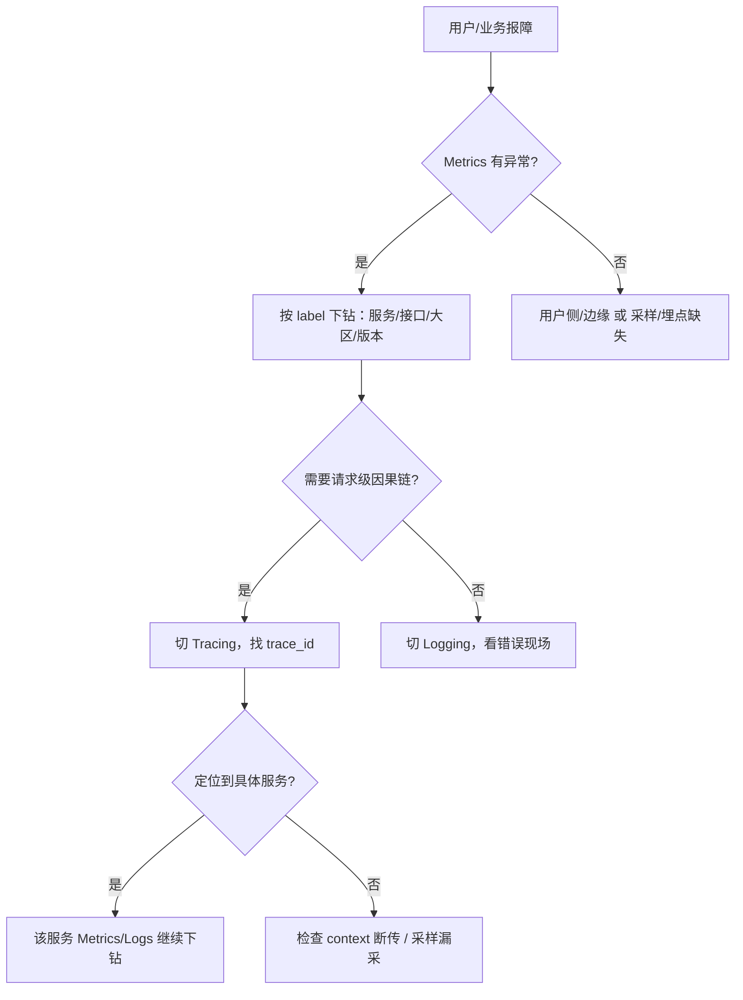

# 可观测性三件套与选型

> 玩家喊「充了钱不到账」，值班群里 Metric 全绿、日志翻不到、链路更是不知道 ID 在哪——三拨人分别喊「再刷大盘」「先 grep 全库」「赶紧买 APM」，三句都不对。
> **本章回答**：Metrics / Logging / Tracing 各答什么问题、怎么互相跳转、什么时候上哪个组件，以及游戏后端怎么选型。
> **不讲**：PromQL → [02](../02-Prometheus与PromQL/)；告警降噪 → [03](../03-告警设计与降噪/)；日志采集链路 → [04](../04-日志链路与采集/)；span 传播与采样深水 → [05](../05-链路追踪与OpenTelemetry/)；USE/RED 本体 → [01-21](../../01-基础底座/21-性能方法论-USE与RED/)；主机资源命令 → [01-06](../../01-基础底座/06-CPU与Load/)。

**标记**：🎯重点 · 🔥难点 · ⭐常考 · 🔧实操
---

## 一、一张图：一次故障被看见的一生

> 🎯 **一句话**：可观测性不是「监控大屏」，而是「出事 → 发现 → 定性 → 定位 → 复盘」每一段都有数据能互相跳转。



- 📖 **读图**
  - 🛤️ 主线「发现 → 定性 → 定位」；卡在哪一段，就补哪一只眼（Q1、Q12）
  - 🔗 虚线是跳转把手：`exemplar` / `trace_id` / `timestamp+维度`——没有跳转 = 三个孤岛

### 🔭 监控 ≠ 可观测性 ⭐

| 维度 | 监控（Monitoring） | 可观测性（Observability） |
|------|------------------|-------------------------|
| 核心问题 | 我已知的问题有没有发生 | 我还不知道的问题怎么发现 |
| 数据关系 | 大屏展示预设指标 | Metrics/Logs/Traces 可互相跳转 |
| 典型 | CPU 超阈值 | 大盘全绿、玩家仍报障，靠下钻定位 |
| 层级 | known knowns | known unknowns + unknown unknowns |

#### ❓ 为什么有 Grafana 大屏还不叫可观测性做完？

- 📺 **大屏只是呈现层**：预设好的折线回答「已知已知」——阈值响了才看得见
- 🔬 **可观测性多两层**：已知未知（知道要查、不知答案）+ 未知未知（事先连问题都没想过）——靠三件套**联动下钻**，不是再加一张板
- ✅ **验收一句**：能不能从 P99 红点点进某条 `trace_id`，再跳到同 ID 的错误日志？点不进去 = 三个孤岛

> 📝 **面试**：问「监控和可观测性区别」，先答「监控是子集」，再展开 known/unknown；核心是**数据关联与跳转**，不是看板数量。⭐（练习题 Q1、Q14）

本节对应练习题 Q1、Q14。主线有了——先谈 Metrics。

---

## 二、发现：Metrics 先报警

> 🎯 **一句话**：Metrics 用数字回答「是不是病了、病得多重、影响面多大」——最适合趋势、告警、SLI。

### 📊 Metrics 回答什么 🎯

**Metrics（指标）** = 时间序列数值，形态 `metric_name{label=…} value @timestamp`。擅长三件事：

- 🚨 **有没有事**：QPS 跌 30%、错误率 >1%、CPU 90%
- 📐 **多大面**：同错误在 1 个实例还是 100 个——靠 label 聚合
- 📈 **趋势与容量**：7 天磁盘增长率、高峰 P99 → 容量与 SLO 基线

- 🎮 **游戏常见**：在线人数、匹配成败率、充值回调成功率、战斗服 CPU/内存、网关连接数、DB 慢查询条数

### 🧮 四种基本类型 ⭐

| 类型 | 特点 | 例子 |
|------|------|------|
| **Counter** | 单调递增 | 总请求、总错误、充值成功笔数 |
| **Gauge** | 可增可减 | 在线人数、CPU、连接池剩余 |
| **Histogram** | 分桶采样，服务端算分位 | 请求耗时各桶计数 |
| **Summary** | 客户端预计算分位 | 实例级 P99；跨实例难聚合 |

> 🎯 **埋点原则**：计数 Counter、状态 Gauge、延迟/大小分布 **Histogram**。别拿 Counter 当 Gauge 减来减去。

#### ❓ 为什么延迟优先 Histogram 而不是 Summary？

- 🪣 **Histogram**：客户端只丢桶；`histogram_quantile` 在服务端算 → **可跨实例、跨时间再聚合**再算全局 P99
- 🧮 **Summary**：客户端算好 0.99 上报 → 只能看「每个实例自己的 P99」，**拼不出全局分位**
- ✅ **线上延迟优先 Histogram**；客户端极紧或只要实例级分位再考虑 Summary
- ⚠️ 桶边界要预先定；桶太多也抬基数（见下「高基数」）

### 🥇 四大黄金指标与 USE / RED ⭐

Google **四大黄金指标**：**latency · traffic · errors · saturation**。先有这四张图，值班不瞎。

| 黄金指标 | 问什么 | 游戏例子 |
|----------|--------|----------|
| **latency** | 有多快？P50/P99 | 登录 P99、技能同步延迟 |
| **traffic** | 承受多大流量 | 同时在线、每秒匹配数 |
| **errors** | 失败比例 | 充值失败率、匹配失败率 |
| **saturation** | 余量还剩多少 | CPU / 内存 / 连接池 |

- 🧰 **落到名字**
  - **USE**（面向资源）：Utilization · Saturation · Errors → 主机/磁盘/网络先看 USE → [01-21](../../01-基础底座/21-性能方法论-USE与RED/)
  - **RED**（面向请求）：Rate · Errors · Duration → 微服务接口先看 RED

> 📝 **面试**：问「监控哪些指标」，别只背 CPU/内存；先答四大黄金，再补 USE 看资源、RED 看接口。⭐（练习题 Q3）

### 🕳️ Metrics 的短板

- 知道错误率 5%，不知道哪个用户、哪条 trace、哪段 SQL
- 知道 P99 涨了，不知道请求走了哪条链路

口诀：**Metrics 看面**——面看清了必须能跳到 Logging / Tracing，否则干瞪眼。

### 💥 高基数为什么主要是 Metrics 的问题 🔥⭐

**基数（cardinality）** = 一个 metric 的 label 组合数。`http_requests_total{…,user_id="12345"}` 把用户塞进 label → 百万用户 = 百万序列。

> 💡 **打个比方**：Metrics 存储像「每个 label 组合一个小抽屉」。抽屉数爆炸，找抽屉、换抽屉、归档成本一起炸。

#### ❓ 为什么 Logging / Tracing 不怕同维度，Metrics 怕？

- 📦 **Metrics 是预聚合时间序列**：每个 label 组合持续索引与存储 → 基数指数抬内存与查询延迟
- 🧾 **Logging / Tracing 是事件型**：单条贵，但多一列不导致索引结构指数膨胀
- 🚫 **典型踩坑**：`user_id` / `order_id` / `ip` 进 Prometheus label → 内存爆、查询卡死
- ✅ **正确**：高维分析去 Logging / Tracing；Metrics 只留可聚合维（服务、接口、状态码、大区）

> ⚠️ **别混**：基数高 ≠ 数据量大。1 个组合存 1 年仍是 1 条序列；1000 个组合各 1 个点 = 1000 序列。卡不卡看 **cardinality**，不是 value 多少。

> 📝 **面试**：问「为什么 Prometheus 怕高基数」，答「按 label 组合索引存储，组合爆炸拖垮内存与查询；高维分析交给日志/链路」。⭐（练习题 Q4）

### 🧲 pull vs push ⭐

| 维度 | **pull（拉）** | **push（推）** |
|------|---------------|---------------|
| 代表 | **Prometheus** | **VM agent**、**Zabbix**、**夜莺** |
| 谁主动 | Server 来拉 | Agent/客户端推 |
| 发现 | 服务发现 / 静态 target | Agent 注册或集中配置 |
| 防火墙 | 服务端须可达 | 客户端出网即可 |
| 短期任务 | 不友好（可能拉空） | 友好 |
| 多租户 | federation / remote write | 天然适合集中上报 |

- 🗺️ **怎么选**
  - K8s / 长期微服务 → **pull**（Prometheus + 服务发现）
  - 手游埋点 / 批处理 / 边缘 / 多租户 SaaS → **push**
- 🎯 **直觉**：pull = 服务端掌握节奏与统一口径；push = 客户端自由上报，适合异构与短时

> ⚠️ **别混**：「push 一定更实时」——不一定。实时性取决于 agent 批量缓冲 vs scrape interval，两者都能秒级也能分钟级。

> 📝 **面试**：K8s/微服务 pull；客户端/批处理/边缘 push；大规模多租户看 VictoriaMetrics/夜莺。⭐（练习题 Q5）

本节对应练习题 Q2～Q5。面看清了，Logging 定性。

---

## 三、定性：Logging 讲清楚发生什么

> 🎯 **一句话**：Logging 用事件原文回答「具体发生了什么」——最适合错误现场、审计、安全、复盘。

### 📝 Logging 回答什么

**Logging（日志）** = 按时间顺序的事件文本或结构化 JSON。擅长：

- 🧨 **错误现场**：异常栈、DB 连不上、支付回调具体错误码
- 🔏 **审计与安全**：谁、何时、改了什么、登了哪台机
- 🔬 **无法预聚合的细节**：第三方完整 body、玩家特殊参数、偶发路径

- 🎮 **游戏常见**：网关 access log、战斗服异常栈、充值回调请求/响应、GM 操作审计

### 🎚️ 级别与成本

- **INFO**：关键业务节点，量可控
- **WARN**：可恢复、需关注非立即止损（如「回调重试第 3 次」）
- **ERROR**：须立即处理或伤体验，带完整上下文
- 🚫 **DEBUG**：只灰度/压测/明确 case 临时开；线上常驻 = 存储雪球

- 💰 **控成本三招**
  1. 结构化 + 采样：关键路径全量 JSON；高频成功按 `trace_id` 尾号采样
  2. 分层存储：热 7 天 SSD/ES，温 30 天对象存储，冷归档
  3. 索引只建标签、不建全文：Loki 只索引 label，全文必要时再查

### 🧱 结构化是自动分析的前提

```json
{
  "timestamp": "2026-09-01T12:34:56Z",
  "level": "ERROR",
  "service": "recharge",
  "trace_id": "abc123",
  "user_id": "u98765",
  "order_id": "o111222",
  "msg": "callback verify failed",
  "resp_body": "{\"code\":-1,\"msg\":\"sign mismatch\"}"
}
```

- 🔑 结构化后才能 `service=… AND level=ERROR AND trace_id=…` 过滤，也才能和 Metrics / Tracing 联动

### 🕳️ Logging 的短板

成本高、查询慢：全量写得多存得久，费用随量线性涨；没有 `trace_id` / 时间窗 / 服务名索引就大海捞针。

原则：**错误/关键路径结构化、带上下文、能索引；DEBUG 按需采样或只灰度开。**

> 📝 **面试**：问「日志和指标区别」，答「指标是聚合数字，看趋势告警；日志是原始事件，看现场；两者必须能互相跳转」。⭐（练习题 Q6）

口诀：**Logging 看点**。点清楚了，Tracing 定位。

---

## 四、定位：Tracing 找到跨服务卡在哪一环

> 🎯 **一句话**：Tracing 用请求链路回答「跨了哪些服务、每段多久、失败在哪一环」。

### 🌳 Trace / Span / trace_id 🎯⭐

玩家请求：网关 → 鉴权 → 业务 → 缓存 → DB。**Tracing** 画成树：

- **Trace**：一次完整请求，由唯一 **trace_id** 标识
- **Span**：一环（查 DB、调支付 SDK）——开始时间、耗时、成败、父子关系
- **trace_id**：贯穿所有服务的全局 ID，串起 Metrics / Logging / Tracing 的钥匙



- 📖 **读图**：一眼看长尾在 MySQL 120ms 与 Payment SDK 200ms；没有 trace，跨服务延迟只能各服务瞎猜

### 📡 Trace Context 怎么传

- **HTTP**：`traceparent`（W3C）或自定义 header
- **gRPC**：metadata
- **消息队列**：message attribute / properties
- **异步 / 线程池**：手动把 context 传到子线程或任务队列

> ⚠️ **别混**：入口生成 `trace_id` 不够——**每个下游调用都要带 context**。网关有、业务服没有 = 传播断了。

### 🎲 采样与短板 🔥

#### ❓ 为什么不能 100% 采样，又不能采太低？

- 💸 **100%**：数据量与成本爆炸
- 🕳️ **太低**：小概率故障根本采不到
- 🎛️ **常用策略**
  - **头部采样**：入口按概率采——简单，易漏长尾
  - **尾部采样**：链路走完再按错误/慢延迟决定保留——故障全留，内存压力大
  - **动态**：错误链路全采、正常低概率
- 🔌 **另一短板·侵入性**：每服务埋点传 context；老服务没接 OTel，链路就在那断

### 🛍️ APM 是什么

**APM（Application Performance Monitoring）** = 带 UI 的 Metrics + Logging + Tracing 一体化产品（SkyWalking、Datadog、New Relic）。

> ⚠️ **别混**：APM ≠ Tracing。APM 是产品形态，Tracing 是数据类型之一。

> 📝 **面试**：问「APM 和 Tracing」，答「APM 是产品/方案，Tracing 是数据类型；APM 通常三者都有」。⭐（练习题 Q7、Q8）

口诀：**Tracing 看链**。链有了，三件套跳转。

---

## 五、联动：三件套怎么互相跳转

> 🎯 **一句话**：三件套各是一只眼；`trace_id` / `exemplar` / `timestamp` 是把手，连成望远镜。

### 🔗 从 Metrics 到 Tracing：exemplar 🔥⭐

Metrics 说「P99=2s」，不知是哪次请求。**exemplar（样例）** = 指标点旁挂一个 `trace_id`——点高延迟点，直接进那条 trace。



- 📖 **读图**：无 exemplar = 只知班上平均分低；有 exemplar = 点开哪个学生考了 0 分、为什么

### 🔗 从 Tracing 到 Logging：trace_id

Span 带日志链接，或同一 `trace_id` 写进日志 → 从「哪段慢/错」跳到「那段完整日志」。

### 🔗 从 Logging 到 Metrics：timestamp + 维度

日志大量 `callback verify failed` → 按 `service=recharge, error_type=sign_mismatch` 回 Metrics 看错误率曲线：刚上线引入还是一直存在。

### 🚨 只上 Metrics 没有 Trace 会怎样 ⭐

#### ❓ 为什么「能报警」仍不够定责？

1. **知道慢、不知慢在哪**：P99=2s——网关 / DB / 下游 SDK 治法全不同
2. **知道错、不知错在哪环**：错误率 5%——全集中支付还是均匀分布，肉眼分不出
3. **跨服务甩锅**：A「上游正常」、B「下游超时」——无 trace 不知谁先慢

- 🎮 **例子**：`Client → Gateway → Auth → Store → Payment SDK`。Store P99 80ms→2s；无 trace 去优化 Store 代码；有 trace 才发现 Payment SDK 50ms→1.8s——真凶是第三方抖动

> 📝 **面试**：问「只有 metrics 没有 trace」，答「能报警难定位；跨服务延迟/错误源只能拼日志；trace 给请求级因果链」。⭐（练习题 Q9、Q13）

本节对应练习题 Q9。跳转通了，选型。

---

## 六、选型：要答什么问题，再选组件

> 🎯 **一句话**：选型先问「要回答什么问题」，再看数据量与查询模式，最后才看组件名。



- 📖 **读图**：不是「哪个更好」，是问题不同；真实系统三者都要，优先级与投入比例不同

### 📦 Metrics 选型 ⭐

| 场景 | 推荐 | 理由 |
|------|------|------|
| K8s / 云原生 | **Prometheus + Grafana** | pull、生态、K8s 原生 |
| 超大规模 / 多租户 / 长期存 | **VictoriaMetrics** | 兼容 PromQL，吞吐与压缩更高 |
| 国内企业 / 告警闭环 | **夜莺（Nightingale）** | 内置告警、权限、国产兼容 |
| 传统主机 / 网络设备 | **Zabbix** | Agent 广、模板多 |

> ⚠️ **别混**：Prometheus 不是「只能小用」。小团队一台够；大规模用 VM / Thanos / Mimir 做长期存，上层 PromQL 不变。

> 📝 **面试**：云原生选 Prometheus 生态；主机/SNMP 选 Zabbix；超大规模多租户看 VM；告警闭环看夜莺。⭐（练习题 Q10）

### 📦 Logging 选型

| 场景 | 推荐 | 理由 |
|------|------|------|
| 全文检索 | **ELK** | 搜索强、生态全 |
| 与 Prom 一体、成本敏感 | **Loki** | 只索引标签，便宜 |
| 超大规模 OLAP | **ClickHouse** | 列存、聚合快 |

- 🎯 **直觉**：ELK 强「搜」、ClickHouse 强「算」、Loki 强「与 Metrics 一体且便宜」

### 📦 Tracing 选型

| 场景 | 推荐 | 理由 |
|------|------|------|
| 云原生 / Grafana 生态 | **Jaeger / Tempo** | OTel 兼容、生态统一 |
| Java / APM UI | **SkyWalking** | 自动探针、国产活跃 |
| 商业一体 | Datadog / New Relic / 阿里云 ARMS | 开箱、按量 |

> 📝 **面试**：云原生/Go/OTel → Jaeger/Tempo；Java 重自动探针与 APM UI → SkyWalking。

### 🌐 OpenTelemetry 是什么 🔥⭐

**OpenTelemetry（OTel）** = 可观测性「普通话」：统一 API/SDK/协议，一次埋点可出 Metrics / Logs / Traces，再导出到 Prometheus、Loki、Jaeger、Tempo 等。

价值不是替代后端，而是**统一埋点语言与传播格式**，避免三套 SDK 重复改造。

> ⚠️ **别混**：OTel **不是**存储，也不是可视化——是**采集与传输标准**；后端仍要接 Prometheus/Loki/Jaeger 等。

> 📝 **面试**：问「OTel 做什么」，答「统一三信号的埋点、传播、导出，一次接入、多端消费」。⭐（练习题 Q11）

### 🎮 游戏后端组合实例

- **Metrics**：K8s 微服务 **Prometheus + Grafana**；手游 APK push → **夜莺**/自研；物理机与网络设备保留 **Zabbix**
- **Logging**：关键路径 **Loki** 或 **ELK**（label 与 Prom 对齐：service/region/version）；超大规模审计 → **ClickHouse**
- **Tracing**：Go → **Jaeger/Tempo**，Java → **SkyWalking**；统一 **OTel SDK** 埋点

- 🎯 **直觉**：真实公司 rarely 单方案；关键是「不同数据答不同问题、能互相跳转」

### ☸️ K8s 怎么接（只给结论）

细节 → [03-19](../../03-Kubernetes/19-监控与可观测性/)、[03-20](../../03-Kubernetes/20-日志管理/)；Exporter 设计 → [05-03-14](../../05-开发能力/03-Go/14-CLI与Prometheus指标/)。

- 服务指标：Prometheus Operator + ServiceMonitor
- 集群/节点/容器：node-exporter + kube-state-metrics + cAdvisor
- 日志：DaemonSet（filebeat / fluent-bit / vector）→ Loki 或 ELK

本节对应练习题 Q10、Q11。选型外——作战定责。

---

## 七、作战：可观测性驱动的定责

> 🎯 **一句话**：接到故障别先翻日志；先看 Metrics 有没有事、多大面，再下钻 Logging / Tracing。

### ⏱️ 60 秒剧本 🔧

```text
① 0–10s  Metrics 大盘：QPS / 错误率 / P99 / 饱和度 → 有没有事
② 10–30s 按 label 下钻：服务 / 接口 / 大区 / 机房
③ 30–45s Logging：时间窗 + service + trace_id → 错误现场
④ 45–60s Tracing：exemplar 或日志里的 trace_id → 跨服务慢/错
```

### 🧭 定责决策树



- 📖 **读图**：第一刀永远 Metrics；缩小范围后要因果链上 Tracing，否则上 Logging。最怕跳过 Metrics 直接 grep

### 现象 · 先做 · 别做

| 现象 | 先做 | 别做 |
|------|------|------|
| 报障但 Metrics 全绿 | 查埋点/采样/告警阈值 | 直接否认故障 |
| 错误率高 | 按 service/status/大区下钻 | 每实例 ssh 翻日志 |
| P99 高、平均正常 | exemplar 跳 trace | 只调平均阈值 |
| 跨服务故障 | `trace_id` 串链路 | 各服务各自 grep |
| 偶发 bug | `trace_id` + 结构化日志 | 临时海量 DEBUG |
| 日志查不动 | 先按 `trace_id`/时间/服务过滤 | 无索引全文捞 |

> 📝 **面试**：线上怎么排障——「Metrics 发现 → Logging 定性 → Tracing 定位」，强调 `trace_id`/`exemplar`。⭐（练习题 Q12）

### 🎮 两个故障模板

**充值成功率跌**

1. Metrics：`recharge_success_rate{region="SEA"}` 99.5%→94%
2. 下钻：仅「渠道 A + 版本 2.3.1」跌
3. Logging：`error_code=CHANNEL_TIMEOUT AND version=2.3.1`
4. Tracing：exemplar → DNS 指到旧 IP，握手超时

**P99 涨、平均正常**

1. Metrics：`histogram_quantile(0.99, …)` → 2s，平均仍 80ms
2. exemplar 点高延迟点拿 `trace_id`
3. Tracing：慢请求卡在 Payment SDK
4. Logging：同 ID 显示 `rate limit`

- 🎯 **直觉**：平均数会骗人；分位数 + trace + 日志才能钉长尾

回到开头：Metric 全绿、日志翻不到、链路没 ID。正确剧本是 Metrics 看面 → Logging 带 `trace_id` 定性 → Tracing 定位 hop → exemplar 互跳。

本节对应练习题 Q12、Q13。

---

## 八、收口

### 命令速查 🔧

```bash
# 近 5 分钟错误率
rate(http_requests_total{status=~"5.."}[5m]) / rate(http_requests_total[5m])
# ← 5xx / 总量

# 某 trace_id 的日志（Loki 类）
{service="order"} |= "trace_id=abc123"
# ← 按 ID 锁现场

# Grafana Explore：开 exemplar 后点高延迟点跳 trace
# histogram_quantile(0.99, rate(http_request_duration_seconds_bucket[5m]))
```

### 面试锚点

| 问 | 30 秒答 |
|----|---------|
| 监控 vs 可观测性？ | 监控=已知已知的告警看板；可观测性还答已知未知/未知未知，靠三件套跳转 |
| 三件套各解决什么？ | Metrics：有没有事、多大面；Logging：发生什么；Tracing：哪一环慢/错 |
| 为何高基数是 Metrics 问题？ | 按 label 组合存序列，cardinality 爆炸拖垮索引内存；事件型不怕同维 |
| pull vs push？ | K8s/微服务 pull；客户端/批处理/边缘 push；大规模多租户看 VM/夜莺 |
| 只有 metrics 无 trace？ | 能报警难定位，跨服务只能拼日志 |
| Prom vs VM vs 夜莺？ | Prom 生态标准；VM 吞吐与长期存；夜莺告警闭环与国产 |
| ELK vs Loki vs CH？ | ELK 全文；Loki 便宜+与 Prom 一体；CH 大规模结构化 OLAP |
| Jaeger vs SkyWalking？ | Jaeger/Tempo 云原生/OTel；SkyWalking Java 探针与 APM UI |
| OpenTelemetry？ | 统一埋点/传播/导出标准，后端仍接 Prom/Loki/Jaeger |
| 怎么联动？ | `trace_id` 串日志与链路；exemplar 挂 Metrics→Trace；timestamp+label 回 Metrics |
| Histogram vs Summary？ | 延迟优先 Histogram（可跨实例聚合）；极紧或只要实例级才 Summary |
| Trace Context？ | HTTP `traceparent`；gRPC metadata；MQ attribute；异步手动传 |

### 易错一句话对照

- 可观测性 = 监控大屏 → 核心是三件套联动与未知未知，大屏只是呈现
- Metrics 数据量大所以怕高基数 → 怕的是 **cardinality**，不是 value 多少
- `user_id`/`ip` 进 Prom label → 高基数拖垮；去日志/链路
- push 一定比 pull 实时 → 看 scrape/batch 间隔，不看模型名
- APM = Tracing → APM 是产品，Tracing 是数据类型
- OTel 替代 Prometheus → OTel 是采集标准，Prom 是后端之一
- 故障先翻日志 → 先 Metrics 有没有事、多大面，再下钻
- trace 100% 采样 → 成本炸；按错误/延迟尾部或动态采
- 只要 trace 不要 metrics → Metrics 管趋势/告警/SLI，trace 替不了
- 日志越多越好 → 有成本；关键路径结构化即可

### 建设三阶段

1. **Metrics 全覆盖**：四大黄金 + USE/RED，保证「有没有事」能告警——性价比最高
2. **Logging 结构化**：JSON + `trace_id`/service/region/version，按维过滤
3. **Tracing 串联**：入口生成 ID，HTTP/gRPC/MQ 统一传播，配 exemplar 跳转

> 🎯 **直觉**：别反着来先做 trace 再做 metrics——没大盘就找不到问题范围。先 metrics、再日志、最后 trace。

### 与 SLO 的关系

Metrics 是定 **SLO / 错误预算** 的基础；通常选 latency / errors / availability。怎么选 SLI、定 SLO、管发布 → [06](../06-SLI-SLO与错误预算/)。本章一句：**没有好的 Metrics，SLO 就是拍脑袋。**

### 常见反模式

1. 上来买 APM，指标口径未清 → 工具越重数据越乱
2. 全接 trace、Metrics 大盘没做好 → 难发现未知问题
3. 全量 DEBUG、不结构化、无 `trace_id` → grep 到天荒地老
4. `user_id`/`order_id` 塞 Prom label → 内存爆
5. 三系统各买各的、数据不互通 → 仍三孤岛
6. 告警只看平均、不看 P99 → 长尾差、大盘却绿
7. 采样率一成不变 → 平时浪费、故障时抓不到
8. 可观测性只运维做、开发不埋点 → 平台再强也用不起

### 数字墙

> Metrics / Logging / Tracing **3** 件套  
> 四大黄金指标 **latency / traffic / errors / saturation**  
> USE **3** 维 · RED **3** 维  
> Metrics 类型 **4** 种 · pull / push **2** 模型  
> `trace_id` **1** 贯穿键 · exemplar **1** 把钥匙  
> OpenTelemetry 统一 **3** 种信号  
> 建设 **3** 阶段 · 反模式 **8** 条 · 60 秒剧本 **4** 步

---

## 合上书

- [ ] **默画**一节主图：出事 → Metrics 发现 → Logging 定性 → Tracing 定位 → 复盘；标出 `exemplar` / `trace_id` / `timestamp` 三条跳转虚线
- [ ] **口述**监控 vs 可观测性：known knowns / known unknowns / unknown unknowns；大屏 ≠ 做完
- [ ] **口述** Metrics：四种类型、Histogram vs Summary、四大黄金、USE/RED、高基数、pull vs push
- [ ] **口述** Logging：答什么、级别与成本、为何结构化、短板
- [ ] **口述** Tracing：trace/span/`trace_id`、Context 传播、采样策略、APM ≠ Tracing
- [ ] **口述**联动：exemplar、`trace_id`、日志回 Metrics；只有 metrics 无 trace 会怎样
- [ ] **口述**选型：Prom/VM/夜莺/Zabbix；ELK/Loki/CH；Jaeger/Tempo/SkyWalking；游戏组合
- [ ] **口述** OTel：不是后端，是统一埋点/传播/导出
- [ ] **口述**作战：60 秒剧本、决策树、现象/先做/别做、两个故障模板
- [ ] **口述**建设：先 metrics 再日志再 trace；常见反模式；边界链到 02～06 与 01-21

下一章：[Prometheus 与 PromQL](../02-Prometheus与PromQL/)。
