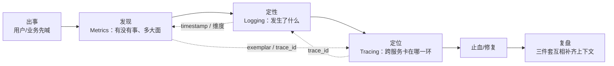
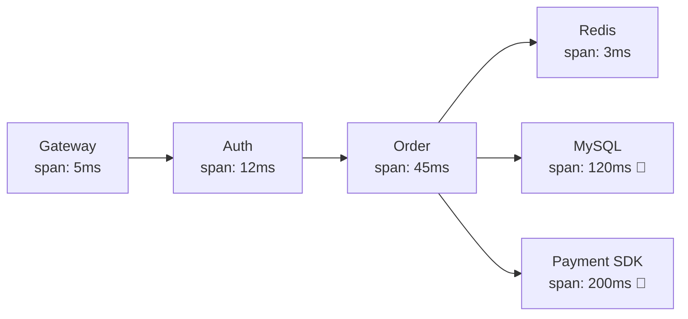
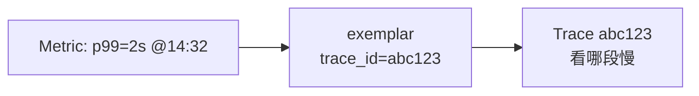
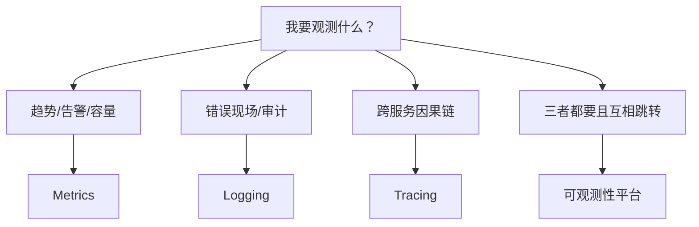
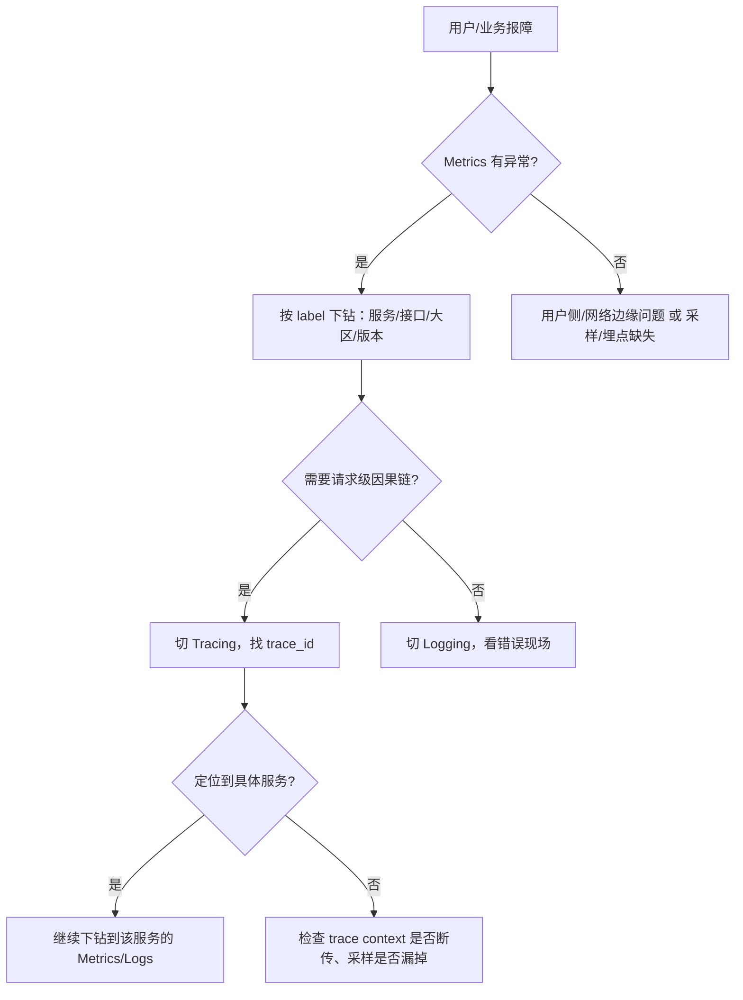

# 可观测性三件套与选型

> 玩家喊「充了钱不到账」，值班群里 Metric 全绿、日志翻不到、链路更是不知道 ID 在哪——三件套各管一段，缺一段就缺一只眼。
> **本章回答**：Metrics / Logging / Tracing 三件套各回答什么问题、怎么互相跳转、什么时候上哪个组件，以及游戏/后端场景怎么选型。
> **不讲**：PromQL 语法细节 → [02](../02-Prometheus与PromQL/)；告警阈值/降噪 → [03](../03-告警设计与降噪/)；日志采集链路搭建 → [04](../04-日志链路与采集/)；trace span 传播与采样 → [05](../05-链路追踪与OpenTelemetry/)；USE/RED 本体 → [01-21](../../01-基础底座/21-性能方法论-USE与RED/)；主机资源命令 → [01-06](../../01-基础底座/06-CPU与Load/)。

**标记**：🎯重点 · 🔥难点 · ⭐常考 · 🔧实操

---

## 一、一张图：一次故障被看见的一生

> 🎯 **一句话**：可观测性不是「监控大屏」，而是「出事 → 发现 → 定性 → 定位 → 复盘」每一段都有数据能互相跳转。



**读图**：

- 主线是「一次故障被看见的一生」：先靠 **Metrics** 回答「有没有事、影响面多大」，再靠 **Logging** 回答「具体发生了什么错误」，再靠 **Tracing** 回答「跨服务哪一环慢/错」。
- 三件套之间靠 **trace_id** 和 **exemplar** 互相跳转；没有跳转就是三个孤岛，值班时仍然抓瞎。
- 本章只讲三件套各自回答什么问题、短板在哪、怎么选型；具体组件的配置细节交给后面几章。

### 监控与可观测性的本质区别

很多人把「可观测性」等同于「监控大屏」，这是面试里最常见的扣分点。

| 维度 | 监控（Monitoring） | 可观测性（Observability） |
|------|------------------|-------------------------|
| 核心问题 | 我已知的问题有没有发生 | 我还不知道的问题怎么发现 |
| 数据关系 | 大屏展示预设指标 | Metrics/Logs/Traces 可互相跳转 |
| 典型场景 | CPU 超阈值告警 | 玩家报障但大盘全绿，靠下钻定位 |
| 能力层级 | known knowns | known unknowns + unknown unknowns |

> 📝 **面试**：问「监控和可观测性区别」，先答「监控是可观测性的子集」，再展开「known/unknown」两层。

---

## 二、发现：Metrics 先报警

> 🎯 **一句话**：Metrics 用「数字」回答「系统现在是不是病了、病得多重、影响面多大」——它最适合趋势、告警、SLI。

### Metrics 回答什么

**Metrics（指标）** 是按时间序列采集的数值，典型形态是 `metric_name{label1="v1",label2="v2"} value @timestamp`。它擅长三件事：

1. **有没有事**：QPS 跌了 30%、错误率超过 1%、CPU 涨到 90%——这些是 Metrics 的舒适区。
2. **多大面**：同一个错误在 1 个实例还是 100 个实例出现，靠 label 聚合一眼就知道。
3. **趋势与容量**：过去 7 天磁盘增长率、高峰期 P99 走势，用来做容量规划和 SLO 基线。

游戏场景里最常见的 Metrics：在线人数、匹配成功/失败率、充值回调成功率、战斗服 CPU / 内存、网关连接数、DB 慢查询条数。

### Metrics 的四种基本类型

Prometheus 风格的 Metrics 按数值语义分四种，埋点时不要混用：

| 类型 | 特点 | 例子 |
|------|------|------|
| **Counter** | 单调递增，只能加 | 总请求数、总错误数、总充值成功笔数 |
| **Gauge** | 可增可减，表示瞬时值 | 在线人数、CPU 利用率、连接池剩余连接 |
| **Histogram** | 采样分桶，算分位数 | 请求耗时 0–10ms、10–50ms、50–200ms 各多少 |
| **Summary** | 客户端预计算分位数 | 与 Histogram 类似，但聚合方式不同，跨实例分位计算受限 |

> 🎯 **埋点原则**：计数用 Counter，状态用 Gauge，延迟/大小分布用 Histogram（服务端聚合分位更准）。不要拿 Counter 当 Gauge 减来减去。

**Histogram vs Summary 怎么选？** 两者都能算分位数，但聚合行为不同：

- **Histogram**：客户端只把值丢进桶（bucket），分位数在服务端用 `histogram_quantile` 计算。优点是可以跨实例、跨时间聚合后再算分位；缺点是要预先定义桶边界，桶太多也会增加基数。
- **Summary**：客户端直接算好分位（如 0.99）上报。优点是不占桶存储；缺点是 Summary 的分位不能跨实例聚合，你只能看到「每个实例自己的 P99」，看不到全局 P99。

线上延迟类指标**优先 Histogram**，除非客户端资源极其紧张或只需要实例级分位。

### 四大黄金指标与 USE / RED ⭐

Google 提的 **四大黄金指标（Four Golden Signals）** 是面向用户视角的：**latency（延迟）、traffic（流量）、errors（错误）、saturation（饱和度）**。任何系统你先有这四张图，值班就不会瞎。

| 黄金指标 | 问什么 | 游戏例子 |
|----------|--------|----------|
| **latency** | 请求有多快？P50/P99 多少？ | 登录 API P99、技能同步延迟 |
| **traffic** | 系统承受多大流量？ | 同时在线、每秒匹配请求数 |
| **errors** | 多少比例失败？ | 充值失败率、匹配失败率 |
| **saturation** | 资源还剩多少余量？ | CPU / 内存 / 连接池使用率 |

SRE 常用的两套方法论把四大黄金指标落到了具体指标名上：

- **USE 方法（面向资源）**：**U**tilization（利用率）、**S**aturation（饱和度）、**E**rrors（错误率）。主机、磁盘、网络这类资源先看 USE → [01-21](../../01-基础底座/21-性能方法论-USE与RED/) 本体。
- **RED 方法（面向请求）**：**R**ate（请求率）、**E**rrors（错误率）、**D**uration（延迟）。微服务接口先看 RED。

> 📝 **面试**：问「你系统监控哪些指标」，不要只背「CPU/内存/磁盘」，要先答「四大黄金指标：latency / traffic / errors / saturation」，再补 USE 看资源、RED 看接口。

### Metrics 的短板

Metrics 最大的短板是**只能告诉你「病了」，很难告诉你「为什么病」**。它把原始事件聚合成数字，聚合过程丢掉了上下文：

- 知道错误率 5%，但不知道是哪个用户、哪条 trace、哪段 SQL。
- 知道 P99 涨了，但不知道涨的请求走了哪条链路。

所以 Metrics 必须能跳到 Logging / Tracing，否则值班时只能干瞪眼。

### 高基数为什么主要是 Metrics 的问题 🔥

**基数（cardinality）** 指的是一个 metric 的 label 组合数。比如 `http_requests_total{path="/api",status="200",user_id="12345"}`，如果把 `user_id` 放进 label，每个用户都是一个新时间序列——百万用户就是百万条序列。

> 💡 **打个比方**：Metrics 的存储像是「每个 label 组合一个小抽屉」。抽屉数爆炸，柜员找抽屉、换抽屉、归档抽屉的成本都跟着炸。

为什么是 Metrics 的问题，而不是 Logging / Tracing？

- **Metrics 是预聚合的时间序列**，每个 label 组合都要持续存储、索引、查询。基数一高，内存和查询延迟同步起飞。
- **Logging / Tracing 是事件型数据**，单条记录成本高，但新增一个维度只是多写一列，不会导致索引结构指数级膨胀。

典型踩坑：把 `user_id`、`order_id`、`ip` 这种高基数维度塞进 Prometheus label，结果 Prometheus 内存爆掉、查询卡死。正确做法：高维度分析去 Logging / Tracing / APM，Metrics 里只放能聚合的维度（服务名、接口、状态码、大区）。

> ⚠️ **别混**：基数高 ≠ 数据量大。1 个 label 组合存 1 年也是 1 个序列；1000 个组合各存 1 个点就是 1000 个序列。监控卡不卡看 **cardinality**，不是看 value 多少。

> 📝 **面试**：问「为什么 Prometheus 怕高基数」，答「时间序列按 label 组合索引和存储，label 组合数爆炸会拖垮内存与查询；高维度分析应该交给日志/链路，Metrics 只做聚合维度」。

### pull vs push：不是谁高级，是谁适合场景 ⭐

Metrics 采集分两种模型：

| 维度 | **pull（拉）** | **push（推）** |
|------|---------------|---------------|
| 典型代表 | **Prometheus** | **VictoriaMetrics agent**、**Zabbix**、**夜莺** |
| 谁主动 | Server 主动来拉 | Agent/客户端主动推 |
| 发现方式 | 服务发现 / 静态配置 target | Agent 自带注册或集中配置 |
| 防火墙 | 服务端要能被访问 | 客户端出网即可 |
| 短期任务 | 不友好（可能拉空） | 友好 |
| 多租户/集中 | 需要 federation/remote write | 天然适合集中上报 |

> 🎯 **关键直觉**：pull 是「服务端掌握节奏，按统一口径采」；push 是「客户端自由上报，适合异构/短时/边缘」。没有绝对好坏，只有场景匹配。

**什么时候 pull**：K8s 里的服务、微服务、长期运行的进程，用 Prometheus 拉最自然，服务发现直接对接 K8s endpoints。

**什么时候 push**：客户端埋点（手游 APK 上报）、批处理任务、边缘节点、多租户 SaaS 平台，push 更省事。

> ⚠️ **别混**：有人说「push 实时性更好」——不一定。push 的实时性取决于 agent 批量缓冲多久；pull 的实时性取决于 scrape interval。两者都能做到秒级，也能做到分钟级。

---

## 三、定性：Logging 讲清楚发生什么

> 🎯 **一句话**：Logging 用「事件原文」回答「具体发生了什么」——它最适合错误现场、审计、安全、事后复盘。

### Logging 回答什么

**Logging（日志）** 是按时间顺序记录的事件文本或结构化 JSON。它擅长：

1. **错误现场**：一段异常栈、一次数据库连接失败、一笔支付回调返回的具体错误码。
2. **审计与安全**：谁、什么时候、改了什么配置、登录了哪台机器。
3. **无法预聚合的细节**：第三方返回的完整 body、玩家输入的特殊参数、偶发 bug 的触发路径。

游戏场景里常见的 Logging：网关 access log、战斗服异常栈、充值回调完整请求/响应、GM 操作审计。

### 日志级别与成本控制的边界

不是级别越多越好，线上常用三级就够：

- **INFO**：正常业务流程关键节点，量要可控。
- **WARN**：可恢复异常或需要关注但非立即止损的场景，如「充值回调重试第 3 次」。
- **ERROR**：必须立即处理或影响用户体验的错误，带完整上下文。

DEBUG 日志只允许在灰度、压测或有明确 case 时临时开启，线上常驻 DEBUG 等于给自己埋一个存储和查询的雪球。

成本控制三招：

1. **结构化 + 采样**：关键路径全量结构化；高频成功日志按 trace_id 尾号采样。
2. **分层存储**：热日志 7 天放 SSD/ES，温日志 30 天放对象存储，冷日志归档。
3. **索引只建标签，不建全文**：Loki 只索引 label，全文只在必要时查。

### 结构化是 Logging 能被自动分析的前提

原始文本日志人眼能读，机器很难查。结构化日志把关键字段抽出来：

```json
{
  "timestamp": "2026-09-01T12:34:56Z",
  "level": "ERROR",
  "service": "recharge",
  "trace_id": "abc123",
  "user_id": "u98765",
  "order_id": "o111222",
  "msg": "callback verify failed",
  "resp_body": "{\"code\":-1,\"msg\":\"sign mismatch\"}"
}
```

结构化后才能按 `service=xxx AND level=ERROR AND trace_id=abc123` 快速过滤，也才能和 Metrics / Tracing 联动。

### Logging 的短板

Logging 最大的短板是**成本高、查询慢**。全量日志写得多、存得久，费用随数据量线性涨；大海捞针时没有 trace_id / 时间范围 / 服务名做索引，根本捞不出来。

所以线上不能「什么日志都开 DEBUG」。原则：**错误/关键路径结构化、带上下文、能索引；DEBUG 日志按需采样或只在灰度开。**

> 📝 **面试**：问「日志和指标什么区别」，答「指标是聚合后的数字，看趋势和告警；日志是原始事件，看具体现场；两者必须能互相跳转」。

---

## 四、定位：Tracing 找到跨服务卡在哪一环

> 🎯 **一句话**：Tracing 用「请求链路」回答「一个请求跨了哪些服务、每一段花了多久、失败发生在哪一环」。

### Trace / Span / trace_id 是什么

一次玩家请求从网关 → 鉴权 → 业务服 → 缓存 → DB，会经过多个服务。**Tracing** 把整个调用画成一棵树：

- **Trace**：一次完整请求的链路，由唯一的 **trace_id** 标识。
- **Span**：链路里的一个环节，比如「查询 DB」「调用支付 SDK」。每个 Span 有开始时间、耗时、状态（成功/失败）、父子关系。
- **trace_id**：贯穿所有服务的全局 ID，是把 Metrics / Logging / Tracing 串起来的核心钥匙。



**读图**：一次请求.trace 由多个 span 组成；一眼能看到「MySQL 120ms、Payment SDK 200ms」是两个长尾点。没有 trace，这种跨服务延迟只能靠每个服务各自猜。

### Trace Context 怎么传下去

trace_id 要在所有服务间传递，否则链路会在某个中间件断掉。常见传播载体：

- **HTTP**：放在 `traceparent` header（W3C 标准）或自定义 header。
- **gRPC**：放在 metadata 里。
- **消息队列**：把 trace_id 写进 message attribute / properties。
- **异步任务 / 线程池**：手动把 context 传到子线程或任务队列。

> ⚠️ **别混**：trace_id 不是只在入口服务生成就够了，**每个下游调用都要把 context 带过去**。网关有 trace、业务服没有，说明传播断了。

### Tracing 的短板

Tracing 最大的短板是**采样与成本**。如果 100% 采样，数据量巨大；如果采样太低，小概率故障可能根本采不到。常用策略：

- **头部采样**：请求入口处按概率采，简单但会漏掉长尾。
- **尾部采样**：等链路走完，根据错误/慢延迟再决定是否保留，能保留所有故障但内存压力大。
- **基于错误率的动态采样**：错误链路全采、正常链路低概率采。

另一个短板是**侵入性**：每个服务都要埋点、传递 trace context。老服务没接 OpenTelemetry，链路就在那断掉。

### APM 是什么

**APM（Application Performance Monitoring，应用性能监控）** 在可观测性语境里通常指「带 UI 的 Metrics + Logging + Tracing 一体化平台」，比如 SkyWalking、Datadog、New Relic。面试里别把它和 Tracing 画等号——APM 是产品形态，Tracing 是数据类型。

> 📝 **面试**：问「APM 和 Tracing 什么关系」，答「APM 是产品/解决方案，Tracing 是数据类型之一；APM 通常同时包含指标、日志、链路」。

---

## 五、联动：三件套怎么互相跳转

> 🎯 **一句话**：三件套各自是瞎子的一只眼，trace_id / exemplar / timestamp 是把手，把三只眼连成一个望远镜。

### 从 Metrics 跳到 Tracing：exemplar 🔥

Metrics 告诉你「P99 延迟 2s」，但不知道具体是哪次请求。 **exemplar（样例）** 是在某个指标点附近挂一个 trace_id——点一下高延迟的数据点，直接跳到那条 trace。



**读图**：没有 exemplar，Metrics 是「只知道班上平均分低」；有了 exemplar，能点进去看「哪个学生考了 0 分、为什么」。

### 从 Tracing 跳到 Logging：trace_id

Trace 里每个 span 可以带 log 链接；一条 trace_id 同时出现在日志里，就能从「哪个 span 慢/错」跳到「那段时间的完整日志」。

### 从 Logging 跳到 Metrics：timestamp + 维度

日志里发现大量 `callback verify failed`，按 `service=recharge, error_type=sign_mismatch` 去 Metrics 看错误率曲线，确认是刚上线引入还是一直存在。

### 只上了 metrics 没有 trace 会怎样 ⭐

这是面试最高频的追问之一。答案是：

1. **知道慢了，不知道慢在哪**：P99 2s，但网关慢、DB 慢、下游 SDK 慢，三者治法完全不同。
2. **知道错了，不知道错在哪一环**：错误率是 5%，但 5% 全集中在支付服务还是均匀分布，肉眼分不出。
3. **跨服务故障变成各服务互相甩锅**：A 服务说「我上游正常」，B 服务说「我下游超时」，没有 trace 不知道到底是谁先慢。

一个游戏里的真实例子：玩家点击「购买皮肤」，请求链路是 `Client → Gateway → Auth → Store → Payment SDK`。Metrics 显示「Store 服务 P99 从 80ms 涨到 2s」，没有 trace 的人会去优化 Store 代码；有了 trace 才发现，Store 调用 Payment SDK 的那一段从 50ms 涨到 1.8s，真正的问题是第三方 SDK 抖动。

> 📝 **面试**：问「只有 metrics 没有 trace 会怎样」，答「能报警但难定位，跨服务延迟和错误源只能靠各服务日志拼凑；trace 提供请求级因果链，是复杂系统排障的刚需」。

---

## 六、选型：什么时候上哪个、开源方案怎么选

> 🎯 **一句话**：选型先看「要回答什么问题」，再看「数据量和查询模式」，最后才看组件名字。

### 选型第一问：你要回答什么问题



**读图**：三件套不是「哪个更好」，是「回答的问题不同」。真实系统三者都要有，只是优先级和投入比例不同。

### Metrics 选型对照 ⭐

| 场景 | 推荐 | 理由 |
|------|------|------|
| K8s 微服务、云原生 | **Prometheus + Grafana** | pull 模型、生态成熟、K8s 原生支持 |
| 超大规模、多租户、长期存储 | **VictoriaMetrics** | 兼容 PromQL、吞吐和压缩比更高 |
| 中国企业、混合云、告警闭环 | **夜莺（Nightingale）** | 内置告警、权限、国产兼容性好 |
| 传统主机/网络设备监控 | **Zabbix** | Agent 覆盖广、模板丰富 |

> ⚠️ **别混**：Prometheus 不是「只能小用」。小团队一台 Prometheus 足够；大规模场景用 VictoriaMetrics 或 Thanos/Mimir 做长期存储，上层 PromQL 不变。

> 📝 **面试**：问「Prometheus vs Zabbix 怎么选」，答「云原生/K8s 选 Prometheus 生态；传统主机/网络/ SNMP 选 Zabbix；超大规模多租户考虑 VictoriaMetrics；国内企业重告警闭环看夜莺」。

### Logging 选型对照

| 场景 | 推荐 | 理由 |
|------|------|------|
| 通用搜索、全文检索 | **ELK（Elasticsearch + Logstash + Kibana）** | 搜索能力强、生态最全 |
| 与 Prometheus 生态集成、成本敏感 | **Loki** | 只索引标签不索引全文，存储便宜 |
| 超大规模日志、OLAP 分析 | **ClickHouse** | 列存、聚合快、适合结构化日志分析 |

> 🎯 **关键直觉**：ELK 强在「搜」，ClickHouse 强在「算」，Loki 强在「与 Metrics 生态一体、便宜」。

### Tracing 选型对照

| 场景 | 推荐 | 理由 |
|------|------|------|
| 云原生、与 Prometheus/Grafana 生态整合 | **Jaeger / Grafana Tempo** | OpenTelemetry 兼容、生态统一 |
| Java 生态、APM 能力强 | **SkyWalking** | 自动探针、UI 直观、国产活跃 |
| 商业一体化 | Datadog / New Relic / 阿里云 ARMS | 开箱即用、按量付费 |

> 📝 **面试**：问「Jaeger vs SkyWalking 怎么选」，答「云原生/Go 微服务/OpenTelemetry 生态优先 Jaeger 或 Tempo；Java 重 APM 自动探针和 UI 能力优先 SkyWalking」。

### OpenTelemetry 是什么 🔥

**OpenTelemetry（OTel）** 是可观测性领域的「普通话」：它提供统一的 API/SDK/数据协议，让应用一次埋点，同时生成 Metrics、Logging、Tracing 数据，并推送到后端（Prometheus、Loki、Jaeger、Tempo 等）。

它的价值不是替代后端，而是**统一埋点语言和传播格式**，避免「Metrics 一套 SDK、日志一套 SDK、Trace 一套 SDK」的重复改造。

> ⚠️ **别混**：OpenTelemetry 不是存储，也不是可视化。它是**采集与传输标准**，后端仍然要接 Prometheus/Loki/Jaeger 等。

> 📝 **面试**：问「OpenTelemetry 做什么」，答「统一 Metrics/Logs/Traces 的埋点、传播和导出标准，让应用一次接入、多端消费」。

### 游戏运维场景选型实例

以一个典型游戏公司后端为例：

- **Metrics**：K8s 微服务用 **Prometheus + Grafana** 做核心业务指标；客户端（手游 APK）埋点用 push 到 **夜莺** 或自研埋点平台；物理机和网络设备保留 **Zabbix** 做基础设施监控。
- **Logging**：网关和业务关键路径走 **Loki** 或 **ELK**，与 Prometheus label 对齐（service、region、version）；超大规模审计日志进 **ClickHouse** 做 OLAP 分析。
- **Tracing**：Go 微服务接 **Jaeger/Tempo**，Java 服务接 **SkyWalking**；统一用 **OpenTelemetry SDK** 埋点，减少多语言维护成本。

> 🎯 **关键直觉**：真实公司里 rarely 只用一个方案。Metrics 可能并存 Prometheus + Zabbix，Logging 可能并存 Loki + ClickHouse，关键是「不同数据回答不同问题、能互相跳转」。

### K8s 与云原生场景怎么接

K8s 的可观测性有它自己的采集链路：kubelet/cAdvisor 暴露容器资源指标，kube-state-metrics 暴露对象状态，node-exporter 暴露节点指标。这些细节不在本章讲，需要时看 [03-19](../../03-Kubernetes/19-监控与可观测性/) 和 [03-20](../../03-Kubernetes/20-日志管理/)。

这里只给一个选型结论：

- K8s 内部服务指标：Prometheus Operator + ServiceMonitor。
- K8s 集群/节点/容器资源：node-exporter + kube-state-metrics + cAdvisor。
- K8s 日志采集：DaemonSet 方式的 filebeat/fluent-bit/vector，送到 Loki 或 ELK。
- 手写 Exporter：指标设计原则见 [05-03-14](../../05-开发能力/03-Go/14-CLI与Prometheus指标/)。

---

## 七、作战：可观测性驱动的定责决策树

> 🎯 **一句话**：接到故障不要先翻日志，先看 Metrics 有没有事、有多大面，再按维度下钻到 Logging / Tracing。

### 60 秒剧本 🔧

```text
① 0–10s  打开 Metrics 大盘：QPS / 错误率 / P99 / 饱和度，确认「有没有事」
② 10–30s 按 label 下钻：哪个服务、哪个接口、哪个大区/机房出错
③ 30–45s 切到 Logging：用时间范围 + service + trace_id 锁定错误现场
④ 45–60s 打开 Tracing：从 exemplar 或日志里的 trace_id 跳转，定位跨服务慢/错
```

### 定责决策树



**读图**：第一刀永远用 Metrics 确认全局状态；label 下钻缩小范围后，需要因果链就上 Tracing，不需要就上 Logging。最怕的是跳过 Metrics 直接 grep 日志，大海捞针。

### 现象 · 先做 · 别做

| 现象 | 先做 | 别做 |
|------|------|------|
| 用户报障但 Metrics 全绿 | 检查埋点/采样/告警阈值 | 直接否认故障 |
| Metrics 错误率高 | 按 service/status/大区下钻 | 每个实例 ssh 看日志 |
| P99 高但平均延迟正常 | 看 exemplar 跳到 trace | 只调平均阈值 |
| 跨服务故障 | 用 trace_id 串链路 | 各服务各自 grep |
| 偶发 bug | 靠 trace_id + 结构化日志定位 | 临时加大量 DEBUG 日志 |
| 日志太多查不动 | 先按 trace_id/时间/服务过滤 | 无索引地全文检索 |

> 📝 **面试**：问「线上故障你怎么排查」，按「Metrics 发现 → Logging 定性 → Tracing 定位」三段答，并强调 trace_id/exemplar 的跳转。

### 游戏运维典型故障模板

**场景一：充值成功率跌**

1. Metrics：`recharge_success_rate{region="SEA"}` 从 99.5% 跌到 94%。
2. 下钻：按 `gateway`、`payment_channel`、`version` 看，发现只有「渠道 A + 版本 2.3.1」跌。
3. Logging：`service=recharge AND error_code=CHANNEL_TIMEOUT AND version=2.3.1` 看到大量超时。
4. Tracing：从 exemplar 跳到 trace，发现 2.3.1 调用渠道 A 时 DNS 解析到旧 IP，握手超时。

**场景二：P99 延迟涨但平均正常**

1. Metrics：`histogram_quantile(0.99, rate(...))` 涨到 2s，平均 80ms。
2. exemplar：点一个高延迟点，拿到 trace_id。
3. Tracing：发现 99% 的慢请求都卡在 `Payment SDK`。
4. Logging：对应 trace_id 的日志显示 SDK 返回 `rate limit`。

> 🎯 **关键直觉**：两个场景都说明「平均数会骗人」，必须有分位数 + trace + 日志才能定位长尾。

---

## 八、收口

### 命令速查 🔧

```bash
# Prometheus 表达式：近 5 分钟错误率
rate(http_requests_total{status=~"5.."}[5m]) / rate(http_requests_total[5m])
# ↑ 5xx 请求数 / 总请求数，得到错误率

# 查看某个 trace_id 的日志（假设日志平台支持）
{service="order"} |= "trace_id=abc123"
# ↑ 按 trace_id 过滤日志，快速定位错误现场

# exemplar 查询示例（Grafana Explore）
# histogram_quantile(0.99, rate(http_request_duration_seconds_bucket[5m]))
# 开启 exemplar 后，点击高延迟点即可跳转 trace
```

### 面试锚点

| 问 | 30 秒答 |
|----|---------|
| 监控和可观测性有什么区别？ | 监控是「已知已知」的告警与看板；可观测性还要回答「已知未知」和「未知未知」，靠三件套互相跳转实现。 |
| Metrics / Logging / Tracing 各解决什么？ | Metrics：有没有事、多大面；Logging：具体发生什么；Tracing：跨服务哪一环慢/错。 |
| 为什么高基数主要是 Metrics 的问题？ | Metrics 按 label 组合存时间序列，cardinality 爆炸会拖垮索引与内存；日志/链路是事件型，新增维度不会指数级膨胀。 |
| pull vs push 怎么选？ | K8s/微服务用 pull（Prometheus）；客户端/批处理/边缘用 push；大规模多租户可用 VictoriaMetrics/夜莺。 |
| 只上了 metrics 没有 trace 会怎样？ | 能报警但难定位，跨服务延迟/错误源分不清，排障靠各服务日志拼凑。 |
| Prometheus vs VictoriaMetrics vs 夜莺？ | Prometheus 生态标准；VM 重吞吐与长期存储；夜莺重告警闭环与国产兼容。 |
| ELK vs Loki vs ClickHouse？ | ELK 强全文搜索；Loki 便宜且与 Prometheus 生态一体；ClickHouse 适合大规模结构化日志 OLAP。 |
| Jaeger vs SkyWalking？ | Jaeger/Tempo 云原生/OpenTelemetry；SkyWalking Java 自动探针和 APM UI 强。 |
| OpenTelemetry 做什么？ | 统一 Metrics/Logs/Traces 的埋点、传播、导出标准，后端仍接 Prometheus/Loki/Jaeger。 |
| 三件套怎么联动？ | trace_id 串日志与链路；exemplar 把 Metrics 高延迟点挂到 trace；timestamp+label 从日志回到 Metrics。 |
| Histogram vs Summary 怎么选？ | 延迟分布优先 Histogram（服务端可跨实例聚合）；客户端资源极紧张或只看实例级分位才用 Summary。 |
| Trace Context 怎么传？ | HTTP 用 traceparent header，gRPC 用 metadata，MQ 写 message attribute，异步任务手动传递。 |

### 易错一句话对照

- 可观测性 = 监控大屏 → 可观测性强调三件套联动与未知未知，大屏只是呈现。
- Metrics 数据量大所以怕高基数 → 怕的是 **cardinality（label 组合数）**，不是 value 多少。
- 把 user_id/ip 放进 Prometheus label → 高基数，会拖垮 Prometheus；去日志/链路做。
- push 一定比 pull 实时 → 实时性取决于 scrape/batch 间隔，不是模型本身。
- APM = Tracing → APM 是产品形态，Tracing 是数据类型。
- OpenTelemetry 替代 Prometheus → OTel 是采集标准，Prometheus 是后端存储。
- 故障先翻日志 → 先看 Metrics 有没有事、多大面，再下钻。
- trace 100% 采样 → 成本爆炸，要按错误/延迟做尾部或动态采样。
- 只要 trace 不要 metrics → Metrics 负责趋势、告警、SLI，trace 替代不了。
- 日志越多越好 → 日志有存储和查询成本，关键路径结构化即可。

### 可观测性建设的三阶段

不要一上来就追求「一体化平台」，按阶段上更稳：

1. **第一阶段：Metrics 全覆盖**。先把四大黄金指标 + USE/RED 做到位，保证「有没有事」看得见、能告警。这是性价比最高的一步。
2. **第二阶段：Logging 结构化**。关键路径日志统一 JSON 格式、带上 trace_id/service/region/version，能按维度快速过滤。
3. **第三阶段：Tracing 串联**。在网关入口生成 trace_id，HTTP/gRPC/消息队列统一传播，配合 exemplar 实现三件套跳转。

> 🎯 **关键直觉**：很多人反着来——先做 trace 再做 metrics，结果没有 metrics 大盘，trace 也找不到问题范围。先 metrics、再日志、最后 trace，是多数团队的最优路径。

### 可观测性与 SLO/错误预算的关系

Metrics 不仅是用来告警的，它还是定义 **SLO（Service Level Objective）** 和 **错误预算（Error Budget）** 的基础。SLO 要选用户真正关心的指标，通常是 latency / errors / availability 这类 Metrics；错误预算则回答「这个月还能出多少事」。

具体怎么选 SLI、怎么定 SLO、怎么用错误预算管发布节奏，见 [06](../06-SLI-SLO与错误预算/)。本章只给一条结论：**没有好的 Metrics，SLO 就是拍脑袋。**

### 可观测性建设的常见反模式

1. **上来就买 APM 一体化平台，但自己的指标口径没定义清楚**——工具越重，数据越乱。
2. **所有服务都接 trace，但 Metrics 大盘没做好**—— trace 只能定位已知问题，无法发现未知问题。
3. **日志全量开 DEBUG，不结构化、不带 trace_id**——查的时候grep到天荒地老。
4. **把 user_id/order_id 塞进 Prometheus label**—— Prometheus 内存爆掉，查询卡死。
5. **三个系统各买各的，数据不互通**——值班时 still 三个孤岛。
6. **告警只基于平均值，不看 P99/P999**——长尾用户体验差，大盘却全绿。
7. **trace 采样率一成不变**——平时 100% 采浪费钱，故障时 1% 采又抓不到。
8. **把可观测性当成运维专属，开发不参与埋点**——日志没上下文、trace 传不下去，最终平台再强也用不起来。

> 🎯 **关键直觉**：工具选型是最后一步；先想清楚「要回答什么问题、数据怎么跳转」，再选工具。

### 数字墙

> Metrics / Logging / Tracing **3** 件套
> 四大黄金指标 **latency / traffic / errors / saturation**
> USE **3** 维 · RED **3** 维
> Metrics 基本类型 **4** 种
> pull / push **2** 种采集模型
> trace_id **1** 个贯穿键
> exemplar 是 Metrics 到 Trace 的 **1** 把钥匙
> OpenTelemetry 统一 **3** 种信号
> 可观测性建设反模式 **8** 条
> 排障 60 秒剧本 **4** 步

---

## 合上书

- [ ] **默画一节的图**：一次故障被看见的一生——出事 → Metrics 发现 → Logging 定性 → Tracing 定位 → 复盘；三件套之间 trace_id / exemplar / timestamp 怎么互相跳转。
- [ ] **口述监控与可观测性区别**：known knowns vs known unknowns vs unknown unknowns；大屏只是呈现，可观测性核心是数据联动。
- [ ] **口述 Metrics**：回答什么问题、四种基本类型（Counter/Gauge/Histogram/Summary）、Histogram vs Summary 区别、四大黄金指标、USE/RED 两套方法、高基数为什么主要是 Metrics 的问题、pull vs push 取舍。
- [ ] **口述 Logging**：回答什么问题、日志级别与成本控制、结构化日志为什么重要、短板是成本与查询慢。
- [ ] **口述 Tracing**：trace/span/trace_id 是什么、Trace Context 传播方式、长尾定位能力、采样策略、APM 与 Tracing 的区别。
- [ ] **口述联动**：exemplar 怎么把 Metrics 挂到 Trace、trace_id 怎么串日志、日志怎么回到 Metrics、只上 metrics 没有 trace 会怎样。
- [ ] **口述选型**：Metrics（Prometheus / VictoriaMetrics / 夜莺 / Zabbix）、Logging（ELK / Loki / ClickHouse）、Tracing（Jaeger/Tempo / SkyWalking）各适合什么场景；游戏运维典型组合。
- [ ] **口述 OpenTelemetry**：不是后端，是统一埋点/传播/导出标准。
- [ ] **口述 K8s 场景怎么接**：Prometheus Operator + node-exporter + kube-state-metrics；日志 DaemonSet 采集；细节 → [03-19](../../03-Kubernetes/19-监控与可观测性/)、[03-20](../../03-Kubernetes/20-日志管理/)。
- [ ] **口述作战**：60 秒剧本、定责决策树、现象/先做/别做对照、两个游戏运维典型故障模板。
- [ ] **口述建设节奏与反模式**：先 metrics 再日志再 trace；五个常见反模式。
- [ ] **口述边界**：PromQL 细节 → [02](../02-Prometheus与PromQL/)；告警 → [03](../03-告警设计与降噪/)；日志链路 → [04](../04-日志链路与采集/)；trace 细节 → [05](../05-链路追踪与OpenTelemetry/)；USE/RED 本体 → [01-21](../../01-基础底座/21-性能方法论-USE与RED/)；SLO → [06](../06-SLI-SLO与错误预算/)。

下一章：[Prometheus 与 PromQL](../02-Prometheus与PromQL/)。
