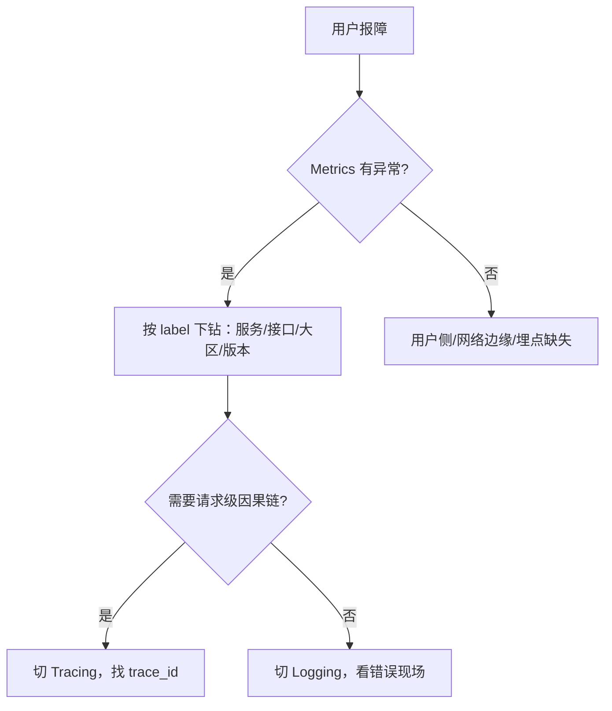

# 01｜可观测性三件套与选型 · 练习题

先合上知识点，对着 **一节的主图** 把「一次故障被看见的一生」口述一遍（出事 → Metrics 发现 → Logging 定性 → Tracing 定位 → 三件套互相跳转 → 复盘），再来做题。

| 标记 | 含义 |
|------|------|
| **核心** | 不懂整章就没建立起来 |
| **必会** | 值班和面试都要能讲 |
| **常用** | 线上会反复碰到 |
| **常考** | 白板和追问的高频口径 |

## 本题目录

- [Q1 监控和可观测性有什么区别](#q1)
- [Q2 Metrics 能回答什么、不能回答什么](#q2)
- [Q3 四大黄金指标与 USE/RED](#q3)
- [Q4 为什么高基数主要是 Metrics 的问题](#q4)
- [Q5 pull vs push 怎么选](#q5)
- [Q6 Logging 和 Metrics 什么区别](#q6)
- [Q7 Tracing 能回答什么、采样怎么选](#q7)
- [Q8 只上了 metrics 没有 trace 会怎样](#q8)
- [Q9 三件套怎么互相跳转](#q9)
- [Q10 Metrics/Logging/Tracing 选型](#q10)
- [Q11 OpenTelemetry 做什么](#q11)
- [Q12 线上故障 60 秒排查](#q12)
- [Q13 只上了 Metrics 没上 Trace 会怎样](#q13)
- [Q14 游戏可观测性建设顺序综合题](#q14)
- [合上书](#合上书)

---

## Q1

**★★★★★｜面试官原话："监控和可观测性有什么区别？"**

**覆盖**：核心 · 必会 · 常考 ｜ **对应**：知识点 [一、一张图：一次故障被看见的一生](知识点.md)

### 场景

有同事说「我们已经有 Grafana 大屏了，可观测性已经做完了」。面试官追问「那未知未知你怎么发现」。

### 完整解答

> 🎯 **一句话**：监控回答「已知已知」的告警与看板；可观测性还要回答「已知未知」和「未知未知」，靠 Metrics/Logging/Tracing 三件套互相跳转实现。

监控（Monitoring）的核心是「我预先知道什么重要，于是设了告警和看板」——CPU 超过 80% 报警、接口 5xx 超过 1% 报警。它解决的是**已知已知**（known knowns）：我已经知道要问什么问题。

可观测性（Observability）比这多两层：

- **已知未知**（known unknowns）：我知道要查，但不知道答案——比如「用户报充值失败，我不知道是哪一步失败」，靠三件套下钻回答。
- **未知未知**（unknown unknowns）：我事先连问题都没想过——比如「东南亚大区新版本 P99 涨了」，靠高维度的 Metrics 聚合和 Tracing 才能发现原来问题出在第三方 SDK。

> ⚠️ **别混**：大屏只是可观测性的**呈现层**，不是可观测性本身。可观测性的核心是**数据之间的关联与跳转能力**——trace_id 串日志、exemplar 串指标与链路。

> 📝 **面试**：答「监控是子集，可观测性是方法论；可观测性靠三件套联动，让你在没有预先设告警的情况下也能定位未知问题」。

### 再追问

**"可观测性三件套缺一不可吗？"**——小公司或早期项目可以分阶段上：先 Metrics 保证「看得见有没有事」，再 Logging 保证「能定性」，最后 Tracing 保证「能定位跨服务问题」。但**三者之间必须能跳转**，否则就是三个孤岛。**不要**为了省钱只留一个「打日志」就号称可观测性。

---

## Q2

**★★★★★｜面试官原话："Metrics 能回答什么问题、不能回答什么？"**

**覆盖**：核心 · 必会 · 常考 ｜ **对应**：知识点 [二、发现：Metrics 先报警](知识点.md)

### 场景

线上充值接口错误率 5%，值班同学翻 Grafana 只能看到一条红线，不知道具体哪笔失败、为什么失败、影响哪些用户。

### 完整解答

> 🎯 **一句话**：Metrics 回答「有没有事、多大面、趋势如何」，不回答「具体发生了什么」。

Metrics 是**预聚合的时间序列数字**。它按 label 分组后存储，擅长：

1. **有没有事**：QPS 跌、错误率涨、CPU 飙高。
2. **多大面**：按 `service`、`region`、`status` 下钻，看是全局故障还是局部抖动。
3. **趋势与容量**：过去 7 天增长、容量余量、SLO 基线。

它不擅长的是**具体上下文**：一笔订单的失败原因、一个用户的完整请求路径、一段异常栈。这些要靠 Logging 和 Tracing。

> 📝 **面试**：答「Metrics 看面，Logs 看点，Traces 看链」。

### 再追问

**"那我在 Metrics 里加 user_id 维度是不是就能看点了？"**——**不要**。user_id 是**高基数（high cardinality）**维度，会让 Metrics 的 label 组合数爆炸，存储和查询都拖垮。用户级分析应该去日志或链路（Q4）。

---

## Q3

**★★★★★｜面试官原话："你们系统监控哪些指标？"**

**覆盖**：核心 · 必会 · 常考 ｜ **对应**：知识点 [二、发现：Metrics 先报警](知识点.md)

### 场景

面试开场常考题。有人只答「CPU、内存、磁盘、网络」，面试官摇头。

### 完整解答

> 🎯 **一句话**：先按 Google 四大黄金指标（latency / traffic / errors / saturation）讲用户视角，再分资源层用 USE、服务接口层用 RED。

**四大黄金指标**：

| 指标 | 含义 | 例子 |
|------|------|------|
| **latency** | 延迟 | 登录 API P99、技能同步延迟 |
| **traffic** | 流量 | QPS、在线人数、每秒匹配数 |
| **errors** | 错误 | 5xx 比例、充值失败率、匹配失败率 |
| **saturation** | 饱和度 | CPU/内存/连接池/队列使用率 |

两套方法论把它们落到具体指标：

- **USE**：面向资源——Utilization（利用率）、Saturation（饱和度）、Errors（错误率）。主机、磁盘、网络先看这个 → [01-21](../../01-基础底座/21-性能方法论-USE与RED/)。
- **RED**：面向请求——Rate（请求率）、Errors（错误率）、Duration（延迟）。微服务接口先看这个。

> 📝 **面试**：先答「四大黄金指标 latency/traffic/errors/saturation」，再补「资源层 USE、接口层 RED」。比只背「CPU 内存磁盘」高一个档次。

### 再追问

**"Saturation 和 Utilization 有什么区别？"**——Utilization 是「用了百分之多少」，Saturation 是「还有多余的资源在排队等吗」。比如 CPU 利用率 80% 但 load 很高，说明 saturation 高、任务在排队。详见 [01-21](../../01-基础底座/21-性能方法论-USE与RED/)。

---

## Q4

**★★★★☆｜面试官原话："为什么 Prometheus 怕高基数？高基数主要是 Metrics 的问题吗？"**

**覆盖**：必会 · 常考 ｜ **对应**：知识点 [二、发现：Metrics 先报警](知识点.md)

### 场景

有团队把 `user_id` 和 `order_id` 放进了 Prometheus label，结果 Prometheus 内存越涨越高，查询卡死。

### 完整解答

> 🎯 **一句话**：Metrics 按 label 组合存储时间序列，cardinality 爆炸会直接拖垮索引和内存；高维度分析应该交给日志/链路。

**基数（cardinality）** 是一个 metric 的 label 组合数。比如 `http_requests_total{path="/pay",status="200",user_id="xxx"}`，如果把 `user_id` 放进 label，每个用户都是一条独立时间序列。100 万用户 = 100 万条序列。

为什么这主要是 Metrics 的问题？

- Metrics 是**预聚合时间序列**，每个 label 组合都要持续建索引、存内存、支持查询。组合数一多，Prometheus 的 TSDB 索引和内存同步膨胀。
- Logging / Tracing 是**事件型数据**，新增一个维度只是多写一列，不会导致索引结构指数级膨胀。

> 💡 **打个比方**：Metrics 像给每个 label 组合一个抽屉柜，抽屉多了找东西慢、柜子占地方；日志像把单据按时间堆进仓库，单据上随便写多少字段都不影响仓库结构。

> 📝 **面试**：答「Prometheus 怕的不是数据点多少，怕的是 label 组合数；不要把 user_id/order_id/ip 这种高基数维度放进 label」。

### 再追问

**"那我偶尔需要按用户看指标怎么办？"**——用 **Logging / Tracing / 专门的 OLAP（ClickHouse）**做用户级分析；Metrics 里保留能聚合的维度（服务、接口、状态码、大区）。**不要**在 Prometheus 里做用户画像。

---

## Q5

**★★★★☆｜面试官原话："pull 和 push 模型怎么选？你们用哪种？"**

**覆盖**：必会 · 常用 · 常考 ｜ **对应**：知识点 [二、发现：Metrics 先报警](知识点.md)

### 场景

团队正在选型：K8s 微服务用 Prometheus（pull），手游客户端埋点又想推上来，运维说「必须统一成一种」。

### 完整解答

> 🎯 **一句话**：pull 适合长期运行的服务端，push 适合客户端/批处理/边缘节点；没有绝对好坏，按场景混用。

| 维度 | **pull（拉）** | **push（推）** |
|------|---------------|---------------|
| 典型 | **Prometheus** | **VictoriaMetrics agent**、**Zabbix**、**夜莺** |
| 谁主动 | Server 主动拉 | Agent/客户端主动推 |
| 服务发现 | K8s endpoints / 静态配置 | 集中配置或 Agent 自注册 |
| 防火墙 | 服务端要被访问 | 客户端出网即可 |
| 短期任务 | 不友好 | 友好 |
| 多租户集中 | 需要 federation/remote write | 天然适合 |

K8s 微服务长期运行、IP 动态变化，Prometheus 的 pull + 服务发现最自然。手游客户端埋点、定时批处理、边缘节点，push 更省事。

> ⚠️ **别混**：有人说 push 实时性更好——不一定。实时性取决于 scrape interval 或 batch interval，不是模型本身。

> 📝 **面试**：答「云原生服务端用 pull，客户端/批处理/边缘用 push；大规模多租户可考虑 VictoriaMetrics/夜莺的 push 架构」。

### 再追问

**"Prometheus 能不能接收 push？"**——能，通过 **Pushgateway**，但那是给批处理和 serverless 短期任务兜底的，不是让长期服务绕过 pull 的。长期服务推 Pushgateway 会造成目标生命周期管理混乱。**不要**把 Pushgateway 当常规方案。

---

## Q6

**★★★★☆｜面试官原话："Logging 和 Metrics 什么区别，什么时候用哪个？"**

**覆盖**：核心 · 必会 ｜ **对应**：知识点 [三、定性：Logging 讲清楚发生什么](知识点.md)

### 场景

有团队所有错误都靠「错误率指标」报警，出了问题再临时开 DEBUG 日志，结果日志量暴涨还找不到现场。

### 完整解答

> 🎯 **一句话**：Metrics 看趋势和面，Logging 看点和具体现场；关键路径的日志要结构化、带上下文、能索引。

**Metrics**：聚合数字，适合告警、看板、SLO。例如「充值接口 5xx 率 5%」。

**Logging**：原始事件，适合错误现场、审计、安全。例如「订单 o111222 在 14:32:05 调支付 SDK 返回 `sign mismatch`，trace_id=abc123」。

两者必须能互相跳转：从 Metrics 的错误率高点按时间下钻到 Logging，从 Logging 的错误记录拿到 trace_id 跳到 Tracing。

> 📝 **面试**：答「Metrics 告诉我『有 5% 失败』，Logging 告诉我『具体哪笔、为什么失败』」。

### 再追问

**"日志是不是越多越好？"**——**不是**。日志越多存储和查询成本越高，DEBUG 日志还拖慢应用。原则：**错误/关键路径结构化、带 trace_id/user_id/order_id、能索引；DEBUG 日志按需采样或只在灰度开。不要**线上长期开全量 DEBUG。

---

## Q7

**★★★★☆｜面试官原话："Tracing 能解决什么问题？采样率怎么定？"**

**覆盖**：核心 · 必会 · 常考 ｜ **对应**：知识点 [四、定位：Tracing 找到跨服务卡在哪一环](知识点.md)

### 场景

充值接口 P99 突然涨到 2s，网关说「我上游正常」，订单服务说「我下游 SDK 慢」，没有 trace 就不知道到底是谁慢。

### 完整解答

> 🎯 **一句话**：Tracing 用 trace_id 串起一次请求跨服务的所有 span，让你看见「哪一段花了多久、失败发生在哪一环」。

一次请求经过 `Gateway → Auth → Order → Redis/MySQL/Payment SDK`，每个环节是一个 **span**，整条请求是一个 **trace**，由唯一的 **trace_id** 标识。通过 span 的耗时和父子关系，一眼能定位长尾点。

采样策略常见三种：

| 策略 | 特点 | 适用 |
|------|------|------|
| 头部采样 | 入口处按概率采 | 简单，但会漏长尾 |
| 尾部采样 | 链路走完后按错误/慢延迟决定是否保留 | 保留故障，内存压力大 |
| 动态采样 | 错误全采、正常低概率采 | 线上最常用 |

> 📝 **面试**：答「Tracing 提供请求级因果链；采样要平衡成本与覆盖，通常错误链路全采、正常链路低概率采」。

### 再追问

**"100% 采样行不行？"**——数据量太大，采集、存储、查询成本都爆炸。只有压测或灰度小流量场景才考虑。**不要**为了「不漏掉任何问题」就 100% 采样。

---

## Q8

**★★★★★｜面试官原话："只上了 metrics 没有 trace，排查问题会有什么问题？"**

**覆盖**：核心 · 必会 · 常考 ｜ **对应**：知识点 [五、联动：三件套怎么互相跳转](知识点.md)

### 场景

微服务架构下，订单服务错误率上升。Metrics 只能看到「订单服务 5% 失败」，不知道失败是因为网关超时、DB 慢、还是第三方支付回调慢。

### 完整解答

> 🎯 **一句话**：只有 Metrics 能报警但难定位，跨服务故障会变成各服务互相甩锅。

具体会出现三种盲区：

1. **知道慢了，不知道慢在哪**：P99 涨到 2s，但网关、Auth、Order、DB 哪个环节慢，Metrics 分不出来。
2. **知道错了，不知道错在哪一环**：5% 错误全集中在支付 SDK 还是均匀分布，肉眼分不出。
3. **排障靠各服务日志拼凑**：A 服务说「我上游正常」，B 服务说「我下游超时」，没有 trace 就不知道时间线和因果关系。

> 📝 **面试**：答「Metrics 看面，Tracing 看链；没有 trace，复杂系统的延迟和错误源定位成本极高」。

### 再追问

**"那我把每个服务的接口延迟都做成 Metrics，是不是就代替 trace 了？"**——**不能**。你看到的是每个服务各自的延迟，但不知道**同一次请求**在各个服务里的耗时关系，也无法处理异步、重试、并行调用。**不要**用「每个服务都有 Metrics」冒充链路可观测性。

---

## Q9

**★★★★★｜面试官原话："你们 traces、metrics、logs 是怎么串起来的？"**

**覆盖**：核心 · 必会 · 常考 ｜ **对应**：知识点 [五、联动：三件套怎么互相跳转](知识点.md)

### 场景

面试官想确认你不是把三个系统孤立使用，而是有联动设计。

### 完整解答

> 🎯 **一句话**：trace_id 是主键，exemplar 是 Metrics 到 Trace 的把手，timestamp+label 是 Logging 到 Metrics 的把手。

三种跳转方式：

1. **Metrics → Tracing**：用 **exemplar**。在 Histogram 高延迟的数据点上挂一个 trace_id，Grafana 点一下就跳到那条 trace。
2. **Tracing → Logging**：Trace 里每个 span 和每条日志都带 **trace_id**，从 span 跳到对应时间段的日志。
3. **Logging → Metrics**：日志里发现大量某类错误后，按 `service`、`error_type`、`时间范围` 回到 Metrics 看错误率曲线，确认影响面。

> ⚠️ **别混**：trace_id 不只是给 Tracing 用，它要**贯穿日志**，否则 trace 和日志还是两个孤岛。

> 📝 **面试**：答「trace_id 贯穿日志和链路，exemplar 把 Metrics 的热点挂到 trace，timestamp 和 label 把日志拉回 Metrics」。

### 再追问

**"如果老服务没接 trace_id，怎么补？"**——优先在**网关入口**生成 trace_id，然后通过 HTTP header / gRPC metadata / 消息队列 attribute 向下游传递。实在传不下去的服务，至少让日志带 `request_id` 或 `order_id`，能部分串联。**不要**因为老服务没接就放弃整体串联。

---

## Q10

**★★★★☆｜面试官原话："Metrics/Logging/Tracing 你们分别用什么方案，为什么这样选？"**

**覆盖**：必会 · 常用 · 常考 ｜ **对应**：知识点 [六、选型：什么时候上哪个、开源方案怎么选](知识点.md)

### 场景

游戏公司面试常考。需要结合后端、K8s、手游客户端分别讲清楚。

### 完整解答

> 🎯 **一句话**：按要回答的问题和数据量选后端，不要先选组件再想场景。

**Metrics 选型**：

| 场景 | 方案 | 理由 |
|------|------|------|
| K8s 微服务 | **Prometheus + Grafana** | pull 模型、生态成熟、K8s 原生 |
| 超大规模/多租户 | **VictoriaMetrics** | 兼容 PromQL、吞吐和压缩比更高 |
| 国内企业重告警闭环 | **夜莺** | 内置告警、权限、国产兼容 |
| 传统主机/网络 | **Zabbix** | Agent 覆盖广、模板丰富 |

**Logging 选型**：

| 场景 | 方案 | 理由 |
|------|------|------|
| 通用全文搜索 | **ELK** | 搜索能力强 |
| 与 Prometheus 生态一体、成本敏感 | **Loki** | 只索引标签 |
| 大规模结构化日志 OLAP | **ClickHouse** | 列存聚合快 |

**Tracing 选型**：

| 场景 | 方案 | 理由 |
|------|------|------|
| 云原生/Go 微服务 | **Jaeger / Grafana Tempo** | OpenTelemetry 兼容 |
| Java 生态重 APM | **SkyWalking** | 自动探针、UI 强 |

> 📝 **面试**：按「后端场景 → 游戏场景」分维度讲，体现你对组件差异的理解。

### 再追问

**"Prometheus 和 VictoriaMetrics 什么关系？"**——VM 兼容 PromQL，存储引擎为大规模做了优化。可以理解为「Prometheus 的查询语法 + 更高吞吐的长期存储」。**不要**说 VM 替代了 Prometheus 生态，它们常常共存。

---

## Q11

**★★★★☆｜面试官原话："OpenTelemetry 是干什么的？"**

**覆盖**：必会 · 常考 ｜ **对应**：知识点 [六、选型：什么时候上哪个、开源方案怎么选](知识点.md)

### 场景

团队原来 Metrics 用 Prometheus SDK、日志用 log4j、Trace 用 Jaeger SDK，三套埋点互相不兼容。

### 完整解答

> 🎯 **一句话**：OpenTelemetry 是可观测性的统一埋点、传播、导出标准，让应用一次接入，Metrics/Logs/Traces 都能输出。

OpenTelemetry 不是存储，也不是可视化。它做三件事：

1. **统一 API/SDK**：一次埋点，同时生成 Metrics、Logging、Tracing 数据。
2. **统一传播格式**：trace context 在 HTTP/gRPC/消息队列里按标准传递。
3. **统一导出**：把数据送到 Prometheus、Loki、Jaeger、Tempo 等后端。

它的价值是避免「Metrics 一套 SDK、日志一套、Trace 一套」的重复改造。

> ⚠️ **别混**：OTel 不替代 Prometheus/Loki/Jaeger，它是**采集层标准**，后端仍然要接具体存储。

> 📝 **面试**：答「OTel 是可观测性的普通话：统一埋点、统一传播、统一导出，后端消费不变」。

### 再追问

**"用了 OpenTelemetry 还需要 Prometheus 吗？"**——**需要**。OTel Collector 可以把 Metrics 转成 Prometheus remote write，但存储和查询仍是 Prometheus/VictoriaMetrics 的事。**不要**把 OTel 当成后端。

---

## Q12

**★★★★★｜面试官原话："线上出了故障，你的排查流程是什么？"**

**覆盖**：核心 · 必会 · 常用 ｜ **对应**：知识点 [七、作战：可观测性驱动的定责决策树](知识点.md)

### 场景

玩家报「充值不到账」，群里已经炸锅。有同事直接开始 grep 日志，有同事直接登录机器看进程。

### 完整解答

> 🎯 **一句话**：先看 Metrics 有没有事、多大面，再下钻到 Logging/Tracing，不要先翻日志。

**60 秒剧本**：

```text
① 0–10s   打开 Metrics 大盘：QPS / 错误率 / P99 / 饱和度，确认「有没有事」
② 10–30s  按 label 下钻：哪个服务、哪个接口、哪个大区/机房出错
③ 30–45s  切 Logging：用时间范围 + service + trace_id 锁定错误现场
④ 45–60s  切 Tracing：从 exemplar 或日志里的 trace_id 跳转，定位跨服务慢/错
```

**定责决策树**：



> 📝 **面试**：按「Metrics 发现 → Logging 定性 → Tracing 定位」三段答，强调 trace_id/exemplar 跳转。

### 再追问

**"如果 Metrics 全绿但用户确实有问题怎么办？"**——三种可能：① 用户侧或网络边缘问题（本地 DNS、CDN、客户端 bug）；② 埋点缺失，该上报的指标没上报；③ 采样/告警阈值问题。先做小范围验证（同一用户/同一地区复现），再补埋点。**不要**因为大盘绿就否认故障。

---

## Q13

**★★★★☆｜只上了 Metrics 和 Logging，没上 Tracing，跨服务慢请求怎么排？**

**覆盖**：必会 · 常考 ｜ **对应**：知识点 [五、定位：Tracing 与长尾](知识点.md) · [六、联动：三件套怎么串](知识点.md)

### 场景

登录 P99 从 200ms 涨到 1.2s，Metrics 显示网关错误率正常、认证服 CPU 也正常。团队只有 Prometheus + ELK，没有 Jaeger/Tempo。

### 完整解答

> 🎯 **一句话**：没有 trace 时只能「Metrics 定域 + 日志时间对齐 + 逐服务 grep」——能定位到服务级，很难定位到跨服务哪一跳；这是该上 Tracing 的信号。

无 trace 时的降级路径：

```text
① Metrics：按 service/endpoint 看 P99，确认慢在 gateway 还是 auth
② 日志：同一 request_id（若有）或时间窗口 + user_id 对齐各服务日志
③ 逐段计时：临时在网关/认证服加结构化耗时字段（auth_ms/db_ms）
④ 对照：CLIENT 侧总延迟 − 各段自报延迟 = 网络/队列黑洞
```

> ⚠️ **别混**：日志时间对齐不是 trace——时钟偏差、异步线程、丢日志都会拼错因果链。

> 📝 **面试**：答「能定到服务，难定到 hop；应推动 trace_id 贯通 + head-based 采样，Metrics 挂 exemplar」。

### 再追问

**临时加耗时日志算不算 trace？**——是权宜之计，不是替代。没有 parent/child 关系，仍拼不出树。**不要**长期靠手工日志当 APM。

---

## Q14

**★★★★★｜综合：从零设计游戏服可观测性体系，先上什么、后上什么？**

**覆盖**：核心 · 必会 · 常考 ｜ **对应**：知识点 [八、选型：游戏运维典型组合](知识点.md) · [合上书](知识点.md)

### 场景

新 MMO 从 0 搭运维，预算有限。开发想「三个都上齐」，老板说「先别花太多」。

### 完整解答

> 🎯 **一句话**：先 Metrics（症状告警 + SLI）→ 再结构化 Logging（trace_id 预留）→ 最后 Tracing（核心链路 1% 采样）——顺序错会重复建设。

推荐节奏：

| 阶段 | 上什么 | 产出 |
|------|--------|------|
| **P0** | Prometheus + 游戏 SLI（登录/支付/CCU）+ Alertmanager | 能 page、能定域 |
| **P1** | JSON 日志 + DaemonSet 采集 + trace_id 字段 | 能串单请求日志 |
| **P2** | OTel + Collector + Tempo/Jaeger + exemplar | 能跨服务定位慢 hop |
| **P3** | 成本治理、recording rules、长期存储 | 能扛量级 |

游戏特有指标：**CCU、登录漏斗、匹配成功率、战斗 tick 延迟、充值回调三段**。

> 📝 **面试**：「不是堆组件，是按故障链路补眼：先看见、再定性、再定位；Logging 里预埋 trace_id，后面上 Trace 不用改业务。」

### 再追问

**能不能跳过 Metrics 直接全量 Trace？**——**不能**。Trace 成本高、不适合趋势告警；没有 Metrics 你连「有没有事」都不知道。**不要**把 Tracing 当监控大屏用。

---

## 合上书

对齐知识点「合上书」，逐条口述，卡住就回对应节：

- [ ] **默画一节的图**：一次故障被看见的一生——出事 → Metrics 发现 → Logging 定性 → Tracing 定位 → 复盘；三件套之间 trace_id / exemplar / timestamp 怎么互相跳转。（Q1 · Q9）
- [ ] **口述监控与可观测性区别**：known knowns vs known unknowns vs unknown unknowns；大屏只是呈现，可观测性核心是数据联动。（Q1）
- [ ] **口述 Metrics**：回答什么问题、四种基本类型、Histogram vs Summary、四大黄金指标、USE/RED 两套方法、高基数为什么主要是 Metrics 的问题、pull vs push 取舍。（Q2 · Q3 · Q4 · Q5）
- [ ] **口述 Logging**：回答什么问题、日志级别与成本控制、结构化日志的重要性、日志不是越多越好。（Q6）
- [ ] **口述 Tracing**：trace/span/trace_id 是什么、Trace Context 传播方式、长尾定位能力、采样策略、APM 与 Tracing 的区别。（Q7）
- [ ] **口述联动**：exemplar 怎么把 Metrics 挂到 Trace、trace_id 怎么串日志、日志怎么回到 Metrics、只上 metrics 没有 trace 会怎样。（Q8 · Q9）
- [ ] **口述选型**：Metrics（Prometheus / VictoriaMetrics / 夜莺 / Zabbix）、Logging（ELK / Loki / ClickHouse）、Tracing（Jaeger/Tempo / SkyWalking）各适合什么场景；游戏运维典型组合。（Q10）
- [ ] **口述 OpenTelemetry**：不是后端，是统一埋点/传播/导出标准。（Q11）
- [ ] **口述 K8s 场景怎么接**：Prometheus Operator + node-exporter + kube-state-metrics；日志 DaemonSet 采集。（Q10）
- [ ] **口述作战**：60 秒剧本、定责决策树、现象/先做/别做对照、两个游戏运维典型故障模板。（Q12）
- [ ] **口述建设节奏与反模式**：先 metrics 再日志再 trace；常见反模式。（Q1 · Q10）
- [ ] **口述无 trace 降级路径**：Metrics 定域 + 日志对齐 + 临时耗时字段；为什么不是长期方案。（Q13）
- [ ] **口述建设节奏 P0→P3**：Metrics → Logging+trace_id → Tracing+exemplar → 成本治理。（Q14）
- [ ] **口述边界**：PromQL → [02](../02-Prometheus与PromQL/)；告警 → [03](../03-告警设计与降噪/)；日志链路 → [04](../04-日志链路与采集/)；trace 细节 → [05](../05-链路追踪与OpenTelemetry/)；USE/RED 本体 → [01-21](../../01-基础底座/21-性能方法论-USE与RED/)。
