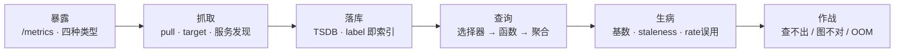
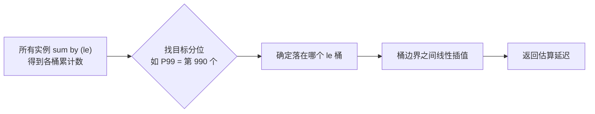
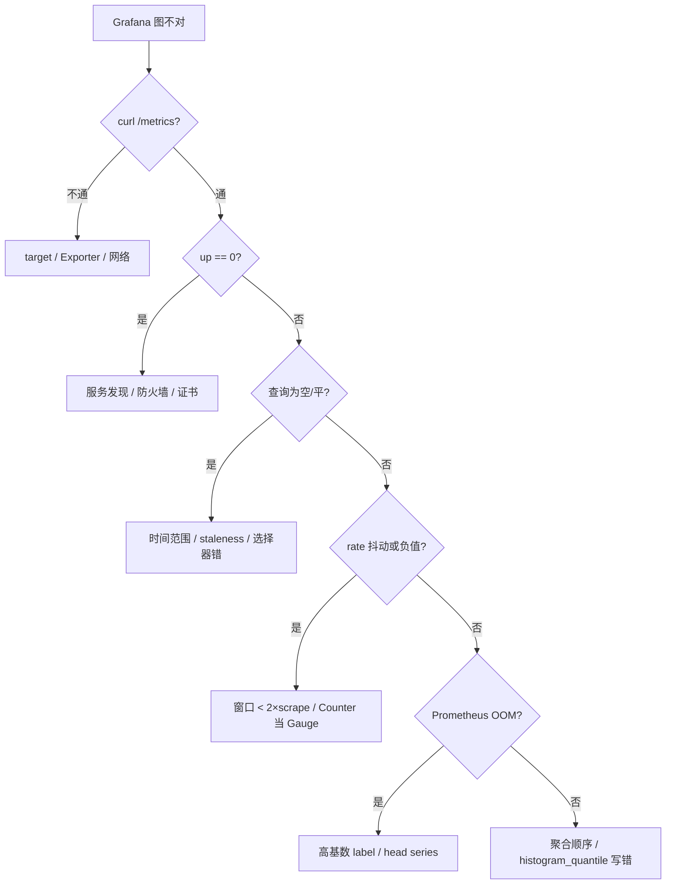

# Prometheus 与 PromQL

> 活动开场，Grafana 上登录 P99 突然归零、网关 QPS 变成一条直线、Prometheus 内存半夜 OOM。三种「图不对」背后是同一件事：指标从暴露到落库到查询，某一环断了。
> **本章回答**：一个指标从业务代码里生出来，到被 PromQL 查出来，中间经过哪几道门；哪道门会卡住、图上会怎么骗你。
> **不讲**：主机侧具体命令与资源指标口径 → [01-06](../../01-基础底座/06-CPU与Load/) 等；告警路由、抑制、降噪设计 → [03](../03-告警设计与降噪/)；SLO 与 burn rate → [06](../06-SLI-SLO与错误预算/)；USE/RED 方法论本体 → [01-21](../../01-基础底座/21-性能方法论-USE与RED/)；K8s 监控怎么接 → [03-19](../../03-Kubernetes/19-监控与可观测性/)；手写 exporter 代码 → [05-03-14](../../05-开发能力/03-Go/14-CLI与Prometheus指标/)。

**标记**：🎯重点 · 🔥难点 · ⭐常考 · 🔧实操

---

## 一、一张图：一个指标的一生

> 🎯 **一句话**：一个指标要经历「暴露 → 抓取 → 落库 → 查询 → 生病 → 被救」六个阶段，PromQL 只是最后一步。



**读图**：主线按时间轴展开——先知道指标怎么从代码里长出来，再看 Prometheus 怎么把它拉进 TSDB，最后才谈 PromQL 怎么算。查不出数时，先往前找「暴露/抓取/落库」哪一环断了，不要先改查询。

---

## 二、暴露：/metrics 与四种指标类型

> 🎯 **一句话**：指标类型决定你怎么用 PromQL 算它，选错类型后查询怎么写都别扭。

业务进程通过 **Exporter** 或 SDK 在 `/metrics` 路径暴露文本。Prometheus 来 **scrape** 时，看到的就是这种格式：

```text
# HELP http_requests_total The total number of HTTP requests.
# TYPE http_requests_total counter
http_requests_total{method="POST",status="200",path="/login"} 15234
```

一行一个 **metric（指标名）**，大括号里是 **label（维度）**，最后是当前采样值。metric + label 集合共同决定一条 **时间序列（time series）**。面试让你解释「时间序列」，就答「同一 metric + 同一 label 集合随时间变化的点」。

### 四种类型及选型 ⭐🔥

| 类型 | 行为 | 什么时候用 |
|------|------|------------|
| **Counter** | 只增不减，可重置 | 请求数、错误数、处理字节数——任何「累计」 |
| **Gauge** | 可增可减 | 在线人数、队列长度、CPU 利用率、温度 |
| **Histogram** | 分桶计数 + 总和 + 总数 | 延迟、请求大小；要跨实例算 P99 用这个 |
| **Summary** | 客户端算好分位数 | 不需要服务端再算，但**跨实例不能加** |

> ⚠️ **别混**：Counter 不能直接比阈值。`http_requests_total > 1000000` 永远 firing，因为它只增。必须套 `rate()` 或 `increase()`。

### Histogram vs Summary：这是最高频混答点 ⭐

两者都能算分位数，但实现位置不同：

- **Histogram**：在服务端算分位数。客户端把样本放到预定义的 `le`（less than or equal）桶里，Prometheus 用 `histogram_quantile()` 在查询时算 P99。可以跨实例聚合，但桶要预定义好。
- **Summary**：在客户端算分位数。典型如 Go 的 `Summary` 对象直接暴露 `quantile="0.99"` 的值，省 CPU，但**不能把多个实例的 P99 取平均当集群 P99**。

> 📝 **面试**：问「算 P99 用 Histogram 还是 Summary」，答「要跨实例聚合选 Histogram；单机客户端算好就行选 Summary。集群级 P99 必须用 Histogram」。

```text
http_request_duration_seconds_bucket{le="0.005"}  200
http_request_duration_seconds_bucket{le="0.01"}   350
http_request_duration_seconds_bucket{le="+Inf"}  1000
# ↑ Histogram：le 桶预定义好，服务端再插值算分位数

http_request_duration_seconds{quantile="0.99"}  0.087
# ↑ Summary：客户端已经算完，只能看单实例
```

### Exporter 是什么

**Exporter** 是把非 Prometheus 原生系统的数据翻译成 `/metrics` 格式的小程序。node-exporter 暴露主机指标，mysql_exporter 暴露 MySQL 指标，blackbox_exporter 把探测结果变成指标。Exporter 自己不是被监控系统，而是「翻译器」。

### metric 命名与 label 设计

一个好指标名自带单位、动作和对象：`http_requests_total` 表示「HTTP 请求总数」，`_total` 暗示 Counter；`http_request_duration_seconds` 表示「HTTP 请求耗时秒数」，`_seconds` 暗示时间单位。label 只放**低基数、可分组、事后想筛选**的维度。

```text
http_requests_total{method="GET",status="200",path="/login"}   ← 好
http_requests_total{user_id="u12345",trace_id="abc-def"}       ← 坏，高基数
```

设计原则：

- **metric name 回答"什么"**，label 回答"哪一类"。
- label value 数量要可控：status 几十种、path 几百种都能接受；user_id 百万种不行。
- 不确定要不要当 label 时，先放日志，确认需要聚合后再提升为 label。
- Histogram 的桶名和指标单位要在设计阶段定好，上线后改桶会破坏历史可比性。

> ⚠️ **别混**："维度多"不等于"分析能力强"。维度多到让 TSDB 撑不住，面板都打不开，分析无从谈起。

> 💡 **打个比方**：Counter 像水表累计读数，Gauge 像油箱浮子，Histogram 像把乘客按身高区间计数，Summary 像门口只告诉你「今天最高的人 1.85m」——身高分布要全局看，不能各门口报一个最高再取平均。

---

## 三、抓取：pull 为什么是对的

> 🎯 **一句话**：Prometheus 主动 pull（拉），因为「采不到」本身就是一种故障信号；短生命周期任务才用 Pushgateway 中转。

### pull vs push 取舍 ⭐

| 模式 | 谁主动 | 优点 | 代价 |
|------|--------|------|------|
| **pull** | Prometheus Server | 目标Down立刻知道；版本/配置集中在服务端；curl 排障直接 | 目标必须能被 Server 访问 |
| **push** | 客户端主动上报 | 防火墙/出站友好；短任务来得及 | 客户端死可能静默丢失；服务端不知道谁该来 |

Prometheus 选 **pull** 不是历史包袱。核心理由是：**没有数据比假数据好**。pull 模型下，scrape 失败 = `up == 0`，告警自然触发；push 模型下客户端挂了就是「没上报」，你必须另做探活才能发现。

```bash
curl -sS http://gateway:8080/metrics | grep '^http_requests_total'
# http_requests_total{method="GET",status="200"} 12345  # ← 能 curl 通说明暴露层活着
```

### target / job / instance / scrape

- **target（目标）**：被 scrape 的端点，如 `10.0.0.5:8080`。
- **job**：同一类 target 的集合，如所有网关实例的 `job="gateway"`。
- **instance**：target 的网络地址， scrape 成功后 Prometheus 自动给它打上 `instance` label。
- **scrape_interval**：拉取周期，常见 15s、30s、60s。

```text
up{job="gateway",instance="10.0.0.5:8080"} 1
# ↑ scrape 成功；0 表示 Prometheus 连不上这个 target
```

### 服务发现（service discovery）

静态配 target 只适合作 demo。生产用 **服务发现**：K8s 里用 ServiceMonitor / PodMonitor，VM/裸金属用 Consul、DNS、文件。发现只是自动填 target 列表，scrape 仍是 pull。

### Pushgateway：只给短命任务

CI Job、一次性批处理来不及被 Prometheus 定期拉，推给 **Pushgateway** 暂存，Prometheus 再去拉 Pushgateway。**长服务不要推 Pushgateway**——序列不过期，任务结束还占着，造成假活。

> ⚠️ **别混**：Pushgateway 不是 Prometheus 的 push 主模型，它是短命任务的「临时寄存柜」，推完要清理。

---

## 四、落库：label 就是索引

> 🎯 **一句话**：TSDB 用 label 做索引，label 一旦失控，内存和查询一起炸。

### TSDB 长什么样

Prometheus 的时序数据库（**TSDB**）按时间序列存储样本。每个序列由 `metric name + label 集合` 唯一确定。内存里维护倒排索引，查询时先按 label 过滤出序列，再扫描时间范围。

```text
http_requests_total{job="gateway",instance="a",status="200"}  →  序列 1
http_requests_total{job="gateway",instance="a",status="500"}  →  序列 2
http_requests_total{job="gateway",instance="b",status="200"}  →  序列 3
# ↑ 3 个 series；status 和 instance 都是 label
```

### label 是索引，不是日志字段 ⭐🔥

label 的设计原则是：**低基数枚举**。每个新 label value 都会新增一条时间序列。如果把 `user_id`、`order_id`、`trace_id` 写进 label：

```text
http_requests_total{user_id="u182937",order_id="o992134"} 1
# ↑ 每个请求都产生新 series → 基数爆炸
```

一个用户一个序列，一亿用户就是一亿 series。TSDB 内存索引直接 OOM。

> 💡 **打个比方**：图书馆按「书名+分类」建索引，找书很快；你给每本书都贴「第几位读者身份证」当分类，图书馆先塌。

### 基数（cardinality）怎么查 🔧

> 🔍 **现场**：Prometheus OOM 前，先查 head series 和谁是罪魁祸首。

```bash
curl -s http://prometheus:9090/api/v1/status/tsdb | jq '.data.headStats'
```

```text
{
  "numSeries": 2847391,
  "chunkCount": 9823412,
  "minTime": 1693500000000,
  "maxTime": 1693586400000
}
# ← numSeries 超过单机软上限 ~200 万就要警惕
```

找出 top 基数指标：

```promql
topk(10, count by (__name__) ({__name__=~".+",job!=""}))
# ↑ 按指标名统计有多少条 series，取前 10
```

```text
{__name__="http_requests_total"}  1843200
{__name__="rpc_latency_seconds"}   245760
# ↑ http_requests_total 有 180 多万 series，八成是它闯祸
```

再下钻看哪个 label 值多：

```bash
curl -sG http://prometheus:9090/api/v1/label/user_id/values \
  --data-urlencode 'match[]=http_requests_total' | jq '.data | length'
# 983421
# ← user_id 有近百万不同值，确认是高基数 label
```

定责：**立刻停这条指标**，加 **relabel** drop 或改代码把 `user_id` 迁到日志/Trace。

> 📝 **面试**：问「label 基数爆炸怎么查」，答「先看 `api/v1/status/tsdb` 的 numSeries，再用 `topk(10, count by (__name__))` 找罪魁祸首，最后用 `/api/v1/label/{name}/values` 看哪个 label 值多」。

### relabel：入库前的改标签

**relabel** 发生在 scrape 前后，用来丢弃/改名/加 label。最常见用途：

- `metric_relabel_configs`：丢掉高基数 label。
- `relabel_configs`：把服务发现带的元数据变成目标 label。

```yaml
metric_relabel_configs:
  - source_labels: [user_id]
    regex: '.+'
    action: drop
# ↑ 把 user_id label 整列丢掉，不让它进 TSDB
```

> ⚠️ **别混**：relabel 不降低「已经写进去的 series」数量，只影响新采的样本。OOM 时先停错误指标，relabel 是止血后防止复发的手段。

---

## 五、查询：PromQL 三层

> 🎯 **一句话**：PromQL 写 query 永远先选序列、再算函数、最后做聚合——顺序错，结果错。

### 第一层：选择器

选择器用大括号过滤 label。`{job="gateway"}` 选出 gateway 的所有 series。

```promql
http_requests_total{job="gateway",status=~"5.."}
# ↑ 正则匹配 5xx 状态码
```

### 第二层：函数（以 rate 家族为核心）⭐🔥

Counter 不能直接看，必须先算变化率。三个函数区别：

| 函数 | 算什么 | 窗口建议 | 典型误用 |
|------|--------|----------|----------|
| **rate** | 每秒平均增长 | `≥ 2 × scrape_interval` | 窗口 < 2×scrape，算不出变化 |
| **irate** | 最近两个点的瞬时变化 | 告警不用 | 告警用 irate 半夜抖动 |
| **increase** | 窗口内总增量 | 1h/1d 看总量 | 对 Gauge 用 increase |

#### rate 窗口为什么要 ≥ 2×scrape 间隔

假设 scrape_interval=15s，窗口 10s 内可能只采到 1 个点甚至 0 个点，rate 算出的变化率剧烈抖动。窗口至少 30s 才能保证有 2 个以上样本，结果稳定。

```promql
rate(http_requests_total[30s])    # ← scrape 15s 时刚好 2 个点，是下限
rate(http_requests_total[5m])     # ← 告警/面板常用，稳定
rate(http_requests_total[1m])     # ← 可接受，但比 30s 稳
```

#### Counter 重启归零，rate 怎么自愈 ⭐

Counter 只在进程内单调递增，进程重启后从 0 开始。`rate()` 和 `increase()` 内部会检测这种骤降（v2 < v1），把它当一次重置处理，不会算出负值。

```text
时间线：  1000 → 1200 → 1400 → [重启] → 0 → 50 → 100
rate 看到： +200 / interval → 正常；重置点按 (0 + 50) − 0 算，不返回负数
# ↑ 内部算法让 Counter 重置后仍能用，不用手动处理
```

> 📝 **面试**：问「Counter 重启后 rate 会不会炸」，答「不会，rate/increase 内部检测 Counter 重置并自动修正」。

### 第三层：聚合

聚合用 `sum by`、`avg without`、`topk` 等把多条序列合并。

```promql
sum by (status) (rate(http_requests_total{job="gateway"}[5m]))
# ↑ 按 status 聚合，看每种状态码的每秒请求数

avg without (instance) (rate(node_cpu_seconds_total{mode="idle"}[5m]))
# ↑ 去掉 instance 维度，按其他维度平均

topk(5, sum by (instance) (rate(http_requests_total{job="gateway"}[5m])))
# ↑ QPS 最高的 5 个实例
```

`sum by (status)` 等价于 `sum(http_requests_total) by (status)`；`avg without (instance)` 等价于按除 instance 外的所有 label 做 avg。

> ⚠️ **别混**：聚合前先 `rate()`，不要 `sum()` 完再 `rate()`——对 Counter 来说 `sum(rate)` 是对的，`rate(sum)` 会丢失重置信息。

### histogram_quantile 算 P99 的原理 🔥

```promql
histogram_quantile(0.99,
  sum by (le) (rate(http_request_duration_seconds_bucket{job="gateway"}[5m]))
)
```

**关键三点**：

1. **`le` 桶必须预定义**：客户端在暴露时就要把 `0.005`、`0.01`、`0.025` ... `+Inf` 这些桶定好，查询时不能临时加桶。
2. **聚合顺序必须是 histogram_quantile 在最外**：先 `sum by (le)` 把所有实例的同桶计数加起来，再算分位数。反了会错。
3. **桶间线性插值**：落在第 N 个桶内的样本，按桶边界线性插值估算具体延迟。

```text
桶：  le=0.01 有 350 个；le=0.025 有 800 个；总数 1000
P99 要第 990 个样本，落在 [0.01, 0.025] 桶内
线性插值：0.01 + (0.025-0.01) × (990-350)/(800-350) ≈ 0.0213
# ↑ 这就是 histogram_quantile 返回的值，不是精确值，是估算
```



**读图**：横轴是计算流程。先跨实例把同桶计数加起来，再按目标分位找到对应桶，最后在桶边界之间线性估算。这就是为什么 histogram_quantile 必须套在 `sum by (le)` 外面。

> 📝 **面试**：问「P99 怎么算出来的」，答「Histogram 预定义 le 桶；查询时先按 le 聚合所有实例，再用 histogram_quantile 做桶间线性插值；所以它不是精确 P99，是估算」。

### PromQL 完整例子

```promql
# P99 延迟
histogram_quantile(0.99,
  sum by (le) (rate(http_request_duration_seconds_bucket{job="gateway"}[5m]))
)

# 错误率
sum by (status) (rate(http_requests_total{job="gateway",status=~"5.."}[5m]))
  / sum by (status) (rate(http_requests_total{job="gateway"}[5m]))

# QPS
sum by (instance) (rate(http_requests_total{job="gateway"}[5m]))

# topk 实例
topk(5, sum by (instance) (rate(http_requests_total{job="gateway"}[5m])))
```

```text
{instance="10.0.0.3:8080"}  1250.4   # ← 该实例每秒 1250 请求
{instance="10.0.0.5:8080"}   980.2
# ↑ topk 直接给出前几名，面板告警都常用
```

### recording rules 什么时候该建 🔧

**recording rules** 把复杂查询预计算成新指标，降低面板/告警的实时查询负载。适合：

- 查询很贵、调用频繁（如大聚合的 P99）。
- 告警和面板共用同一套表达式。
- 需要把「昨天同期」这类慢查询固化。

不要为了一次性探索建 recording rule——它会永久占用存储和计算。

```yaml
groups:
  - name: gateway.rules
    rules:
      - record: job:gateway_qps:rate5m
        expr: sum by (job) (rate(http_requests_total{job="gateway"}[5m]))
```

> ⚠️ **别混**：recording rule 降低查询负载，**不解决 ingest 侧高基数**。OOM 时先查基数，不是加 recording rule。

### 收束：PromQL 三层结构图 🎯⭐

到这儿，PromQL 写 query 的全部零件齐了。面试直接问「怎么写一段 PromQL」，按这张结构图从里到外套：

```mermaid
flowchart BT
    Q["查询结果"] --> A["③ 聚合层<br/>sum by / avg without / topk"]
    A --> F["② 函数层<br/>rate / irate / increase / histogram_quantile"]
    F --> S["① 选择器层<br/>{job=\"gateway\",status=~\"5..\"}"]
```

**读图**：永远从选择器开始——先确定你要哪些序列；再套函数——Counter 必须 rate、Histogram 必须 sum by (le) 后再 histogram_quantile；最后做聚合——按 instance/job/status 等维度合并。顺序反了，结果就错。

三层口诀：

1. **选择器**：大括号里 filter label，正则用 `=~`，否定用 `!~`。
2. **函数层**：Counter → rate/increase；Histogram bucket → sum by (le) → histogram_quantile；Gauge 直接比或用 deriv。
3. **聚合层**：需要跨实例/跨路径看总量或 top 时才加 `by` / `without` / `topk`。

> 📝 **面试**：写 query 时嘴里念「选择器 → 函数 → 聚合」。遇到 Counter 先 rate；遇到 P99 先 sum by (le)；遇到 top 实例用 topk。

---

## 六、生病：基数爆炸、staleness、rate 误用、Counter 重置

> 🎯 **一句话**：指标也会生病，常见病四种：label 太细、target 消失后还活 5 分钟、rate 窗口乱选、Counter 重置被忽略。

### 基数爆炸：用户 ID 进 label 的灾难

已经在四节讲过。这里补一句：**日志/Trace 适合放 user_id，label 不适合**。Metrics 是高压缩聚合，Log/Trace 是高细节下钻，别互相替代。

### staleness：target 消失后还画 5 分钟 ⭐

如果某个 target 被删除或下线，它的时间序列不会立刻从查询结果里消失，而是被标记为 **staleness**，再保留大约 **5 分钟**。查询时 Grafana 可能把最后一点值「拉平」画成直线，看起来像服务还有流量。

```text
10:00 target 被摘掉
10:01 查询仍看到最后非 stale 值
10:05 之后才从图中彻底消失
# ↑ 这 5 分钟里 Grafana 可能显示一条平线，不是真的有请求
```

> 📝 **面试**：问「为什么下线实例图里还活一会儿」，答「Prometheus 的 staleness 机制让消失的 series 保留约 5 分钟，防止查询突然跳变，但也会导致刚下线的 target 看起来还有数据」。

### rate 窗口误用

| 错误 | 后果 |
|------|------|
| `rate(...[10s])` 配 15s scrape | 样本不足，结果抖动或为空 |
| `rate()` 套在 Gauge 上 | 没有意义，Gauge 该用直接比较或 `deriv()` |
| `rate(sum(...))` | Counter 重置信息丢失，跨重启会错 |
| irate 做告警 | 只取最近两点，毛刺多，半夜误报 |

### Counter 重置的兜底

虽然 rate/increase 会自动处理重置，但有些场景要注意：

- Exporter 被重启但 metric name 没变 → rate 自动修正。
- 自己写 exporter 时把 Counter 错用成 Gauge → 归零后 rate 无法修正，会出现负值或异常大尖刺。
- 推送模式（Pushgateway）下 Counter 重置语义混乱，因为它看到的是多个客户端的累计值。

> ⚠️ **别混**：Counter 重置不可怕，可怕的是把 Counter 当 Gauge 用。看到负 rate，先检查指标类型定义。

---

## 七、作战：指标不对 / 查不出 / OOM 定责

> 🎯 **一句话**：先看暴露层能不能 curl 通，再看 target Up/Down，最后查基数和 PromQL 写法。

### 决策树



**读图**：诊断从外向里——先确认指标暴露层活着，再确认 Prometheus 能 scrape，最后才进 PromQL 语义。OOM 单独一条线，直接查基数。

### 现象 · 先做 · 别做

| 现象 | 先做 | 别做 |
|------|------|------|
| Grafana 空 | curl /metrics；看 up == 0 | 先改 PromQL |
| target Down | 查服务发现 / 网络 / NP / 证书 | 重启业务 |
| P99 归零或平线 | 看实例是否刚下线 / staleness | 以为服务没流量 |
| rate 结果抖动 | 检查窗口是否 ≥ 2×scrape | 直接加 smoothing |
| rate 负值 | 检查指标是否真为 Counter | 加 abs() 掩盖 |
| Prometheus OOM | 查 head series 和高基数 label | 只加内存 |
| 集群 P99 算错 | 确认 histogram_quantile 在最外层 | 对 Summary 取平均 |
| 短任务没数据 | 用 Pushgateway 且记得清理 | 长服务推进 Pushgateway |

### 60 秒剧本 🔧

> 🔍 **现场**：接到「监控图不对」报障，60 秒内走完这条线。

```text
① 0–10s  curl /metrics 看暴露层活没活
② 10–30s Prometheus /targets 看 up == 0 的 job 和 instance
③ 30–45s 若是 OOM，curl /api/v1/status/tsdb 看 numSeries；若是图不对，检查时间范围和选择器
④ 45–60s 定位：Exporter / 服务发现 / PromQL 写法 / 高基数 label
```

### 高可用与长期存储一句话

> 🎯 **一句话**：单机 Prometheus 管实时告警和近期数据；长期、全局、高可用要靠 **remote write** 或 **federation** 把数据汇总到 Thanos / VictoriaMetrics / Mimir，但扩展方案不治乱打 label。

| 场景 | 方案 | 一句话 |
|------|------|--------|
| 高可用 | 双 Prometheus + **Alertmanager** 去重 | 两副本各自 scrape，告警不会打两通电话 |
| 长期存储 | **remote write** 到 Thanos / VictoriaMetrics / Mimir | Prometheus 本地只留 15–50 天，历史送远程 |
| 全局视图 | **federation** 层级汇总 | 边缘 Prometheus 只把聚合指标拉到中心 |

> ⚠️ **别混**：**remote write** 和 **federation** 解决的是"存多久、看多广"，不解决"写进去多少 series"。user_id 这种高基数 label 打到 Thanos 里，Thanos 也会炸。

---

## 八、收口

### 命令速查 🔧

```bash
# 暴露层是否活着
curl -sS http://{target}:8080/metrics | head

# 当前 target 状态
curl -s http://prometheus:9090/api/v1/targets | jq '.data.activeTargets[] | {job,.labels.instance,health}'

# TSDB 概览
curl -s http://prometheus:9090/api/v1/status/tsdb | jq '.data.headStats'

# top 基数指标
curl -sG http://prometheus:9090/api/v1/query \
  --data-urlencode 'query=topk(10, count by (__name__) ({__name__=~".+",job!=""}))'

# 某个 label 有多少值
curl -sG http://prometheus:9090/api/v1/label/user_id/values \
  --data-urlencode 'match[]=http_requests_total'
```

### 面试锚点

| 问 | 30 秒答 |
|----|---------|
| 为什么 Prometheus 用 pull？ | 采不到即故障；curl 可排障；配置集中在服务端。 |
| 四种指标类型？ | Counter 只增；Gauge 可上下；Histogram 分桶跨实例算 P99；Summary 客户端分位不能跨实例加。 |
| Histogram vs Summary？ | Histogram 服务端算分位、可聚合；Summary 客户端算好、只能单看。 |
| label 基数爆炸怎么查？ | `/api/v1/status/tsdb` numSeries → `topk count by (__name__)` → `/api/v1/label/{name}/values`。 |
| user_id 能不能当 label？ | 不能，基数爆炸；去日志/Trace。 |
| rate vs irate vs increase？ | rate 稳定每秒；irate 最近两点、只看板；increase 窗口总增量。 |
| rate 窗口为什么要 ≥ 2×scrape？ | 保证至少两个样本，结果稳定。 |
| Counter 重启 rate 会负吗？ | 不会，rate/increase 自动检测重置。 |
| histogram_quantile 怎么算 P99？ | 先按 le 聚合所有实例，再桶间线性插值；le 桶预定义。 |
| 聚合顺序？ | histogram_quantile 在最外；Counter 先 rate 再 sum。 |
| recording rules 什么时候建？ | 查询贵且频繁、告警面板共用表达式时。 |
| staleness 是什么？ | target 消失后 series 仍保留约 5 分钟。 |
| Prometheus OOM 第一刀？ | 查 head series 和高基数 label，停错误指标，不是只加内存。 |
| Pushgateway 什么时候用？ | 仅短命任务，推完清理；长服务不用。 |
| 高可用/长期存储？ | 双 Prometheus + Alertmanager 去重；长期用 Thanos / VictoriaMetrics / Mimir。 |

### 易错一句话对照

- Prometheus 该改成 push 为主 → pull；短任务才 Pushgateway
- Counter 直接比阈值 → 必须 rate/increase
- Histogram 和 Summary 都能跨实例加 → Summary 不能跨实例聚合
- user_id 进 label 方便下钻 → 高基数 OOM；去日志/Trace
- rate 窗口越小越精确 → 小于 2×scrape 会抖动
- irate 做告警 → 半夜毛刺误报
- Counter 重启后 rate 会负 → 自动修正
- histogram_quantile 对 Summary 用 → Summary 没有 le 桶
- sum 完再 rate → 丢失 Counter 重置信息
- Prometheus OOM 只加内存 → 先查基数
- Pushgateway 给长服务用 → 序列不过期会假活
- staleness 是 bug → 是设计，约 5 分钟
- recording rule 治高基数 → 不治 ingest 基数
- 集群 P99 对 Summary 取平均 → 必须 Histogram
- 远程存储解决乱打 label → Thanos/VM 不解决 ingest 爆炸

### 数字墙

> scrape_interval 常见 **15s–60s** · rate 窗口下限 **2×scrape** · staleness 保留约 **5min** · 单 Prometheus 软上限 **~200 万 series** · Histogram 默认桶 **11 个** · Counter 重置由 rate/increase **自动修正** · recording rule 命名建议 `level:metric:operation` · 远程存储选型 Thanos / VictoriaMetrics / Mimir

---

## 合上书

- [ ] **默画一节的图**：暴露 → 抓取 → 落库 → 查询 → 生病 → 作战；每个阶段会卡在哪里。
- [ ] **口述四种类型**：Counter / Gauge / Histogram / Summary 的行为、典型用法、为什么 Histogram 能跨实例算 P99 而 Summary 不能。
- [ ] **口述 pull vs push**：Prometheus 为什么选 pull；Pushgateway 只给什么场景用，推完要做什么。
- [ ] **口述 target / job / instance / scrape**：分别是什么，up 指标怎么看。
- [ ] **口述 TSDB 与 label**：时间序列由什么唯一确定；label 为什么是索引；把 user_id 当 label 的后果。
- [ ] **口述查基数三步**：`/api/v1/status/tsdb` → `topk count by (__name__)` → `/api/v1/label/{name}/values`。
- [ ] **口述 PromQL 三层**：选择器 → 函数 → 聚合；`sum by` / `avg without` / `topk` 各是什么意思。
- [ ] **口述 rate 家族**：rate / irate / increase 区别；rate 窗口为什么要 ≥ 2×scrape；Counter 重启后为什么不会负。
- [ ] **口述 histogram_quantile**：le 桶预定义、聚合顺序、histogram_quantile 在最外、桶间线性插值。
- [ ] **口述 recording rules**：什么时候建，命名习惯，不治什么问题。
- [ ] **口述 staleness**：target 消失后为什么图还平 5 分钟。
- [ ] **定责**：Grafana 空 / target Down / rate 抖动 / OOM / P99 算错，各先看什么、别做什么。

下一章：[告警设计与降噪](../03-告警设计与降噪/)。全局三件套 → [01](../01-可观测性三件套与选型/)；主机侧指标 → [01-06](../../01-基础底座/06-CPU与Load/) 等；USE/RED → [01-21](../../01-基础底座/21-性能方法论-USE与RED/)；K8s 监控接线 → [03-19](../../03-Kubernetes/19-监控与可观测性/)；手写 exporter → [05-03-14](../../05-开发能力/03-Go/14-CLI与Prometheus指标/)。
