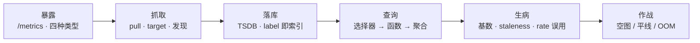
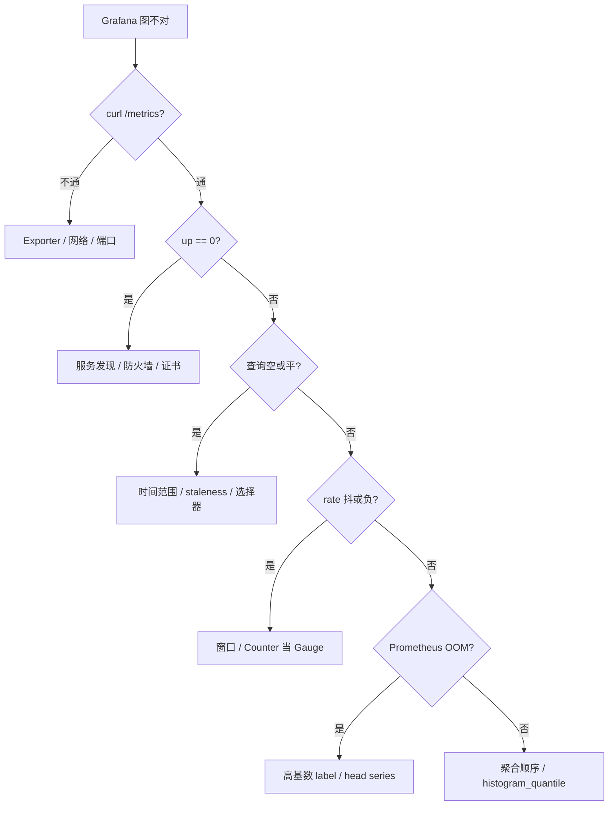

# Prometheus 与 PromQL

> 活动开场：Grafana 上登录 P99 突然归零、网关 QPS 变成一条直线、Prometheus 内存半夜 OOM。三个人分别喊「服务挂了」「刷新面板」「加内存」，三句都不对。
> **本章回答**：一个指标从暴露到被 PromQL 查出来经过哪几道门；图归零、直线、OOM 各卡在哪、现场怎么定责。
> **不讲**：主机资源命令 → [01-06](../../01-基础底座/06-CPU与Load/)；告警路由/降噪 → [03](../03-告警设计与降噪/)；SLO / burn rate → [06](../06-SLI-SLO与错误预算/)；USE/RED 本体 → [01-21](../../01-基础底座/21-性能方法论-USE与RED/)；K8s 监控接线 → [03-19](../../03-Kubernetes/19-监控与可观测性/)；手写 exporter → [05-03-14](../../05-开发能力/03-Go/14-CLI与Prometheus指标/)。

**标记**：🎯重点 · 🔥难点 · ⭐常考 · 🔧实操
---

## 一、一张图：一个指标的一生

> 🎯 **一句话**：指标要过「暴露 → 抓取 → 落库 → 查询」；图不对先往前找断点，别先改 PromQL。



- 📖 **读图**
  - 🛤️ 主线按时间轴：先长出来、再被拉进 TSDB，最后才谈 PromQL
  - 🩺 查不出数 → 先查暴露/抓取/落库哪环断了（七节）；虚线病态见六节

本节对应练习题 Q1。几道门有了——指标怎么暴露、类型怎么选？

---

## 二、暴露：/metrics 与四种指标类型

> 🎯 **一句话**：类型决定 PromQL 怎么算；选错类型，查询怎么写都别扭。

业务进程经 **Exporter** / SDK 在 `/metrics` 暴露文本；Prometheus **scrape** 时看到的就是：

```text
# HELP http_requests_total The total number of HTTP requests.
# TYPE http_requests_total counter
http_requests_total{method="POST",status="200",path="/login"} 15234
```

- 🔑 **一行语义**：metric 名 + `{}` 里 **label（维度）** + 采样值；**时间序列** = 同一 metric + 同一 label 集合随时间变化的点

### 📊 四种类型及选型 ⭐🔥

| 类型 | 行为 | 什么时候用 |
|------|------|------------|
| **Counter** | 只增不减，可重置 | 请求数、错误数、处理字节——任何「累计」 |
| **Gauge** | 可增可减 | 在线人数、队列长度、CPU 利用率 |
| **Histogram** | 分桶计数 + sum + count | 延迟、请求大小；**跨实例算 P99** 用这个 |
| **Summary** | 客户端算好分位数 | 单机够用；**跨实例不能加** |

> ⚠️ **别混**：Counter 不能直接比阈值。`http_requests_total > 1e6` 永远 firing——必须套 `rate()` / `increase()`。

### 📮 Histogram vs Summary：最高频混答 🎯⭐🔥

> 💡 **打个比方**：Counter 像水表累计、Gauge 像油箱浮子、Histogram 像全班按身高区间计数、Summary 像门口只报「今天最高 1.85m」——全局分布不能各门口报一个最高再取平均。

#### ❓ 为什么集群 P99 必须用 Histogram？

- ❌ **Summary**：客户端已算好 `quantile="0.99"` → 只反映本实例；10 个实例的 P99 取平均 **不是** 集群 P99（高延迟可能扎堆某一台）
- ✅ **Histogram**：预定义 `le` 桶；查询时 `sum by (le)` 再 `histogram_quantile()` → **可跨实例聚合**
- 🪣 **代价**：桶要设计阶段定好；上线后改桶破坏历史可比性

```text
http_request_duration_seconds_bucket{le="0.005"}  200
http_request_duration_seconds_bucket{le="0.01"}   350
http_request_duration_seconds_bucket{le="+Inf"}  1000
# ↑ Histogram：le 预定义，服务端插值算分位

http_request_duration_seconds{quantile="0.99"}  0.087
# ↑ Summary：客户端算完，只能看单实例
```

- 📖 **读图**：上块可 `sum by (le)`；下块没有桶，跨实例加无意义

> 📝 **面试**：问「算 P99 用谁」，答「跨实例聚合选 Histogram；单机客户端算好选 Summary。集群级 P99 必须 Histogram」。⭐（练习题 Q2）

### 🏷️ metric 命名与 label 设计

- 📛 **好名字自带单位/动作**：`http_requests_total`（`_total` → Counter）、`http_request_duration_seconds`（`_seconds` → 时间）
- 🗺️ **metric 答「什么」，label 答「哪一类」**；label 只放低基数、可分组维度

```text
http_requests_total{method="GET",status="200",path="/login"}   ← 好
http_requests_total{user_id="u12345",trace_id="abc-def"}       ← 坏，高基数
```

- 🚫 **不确定当不当 label**：先放日志；确认要聚合再提升（四、六节）
- 🔌 **Exporter** = 把非原生系统翻译成 `/metrics` 的小程序（node / mysql / blackbox）；它自己不是被监控系统，是「翻译器」

> ⚠️ **别混**：「维度多」≠「分析强」——维度多到 TSDB 撑不住，面板打不开，分析无从谈起。

口诀：**「rate 给 Counter，Gauge 别乱 rate」**。本节对应练习题 Q2、Q3。类型对了——Prometheus 怎么把指标拉进来？

---

## 三、抓取：pull 为什么是对的

> 🎯 **一句话**：Prometheus 主动 pull，因为「采不到」本身就是故障信号；短命任务才用 Pushgateway。

### 🎣 pull vs push ⭐

| 模式 | 谁主动 | 优点 | 代价 |
|------|--------|------|------|
| **pull** | Prometheus Server | Down 立刻知道；配置集中；`curl` 排障 | 目标必须可达 |
| **push** | 客户端上报 | 防火墙/出站友好；短任务来得及 | 客户端死可能静默丢；服务端不知谁该来 |

#### ❓ 为什么不是改成 push 为主？

- 👻 **push 静默丢**：客户端挂了 =「没上报」，必须另做探活
- ✅ **pull 把可达性变成指标**：scrape 失败 → `up == 0`，告警自然触发
- 🧭 **核心口径**：**没有数据比假数据好**——不是历史包袱

```bash
curl -sS http://gateway:8080/metrics | grep '^http_requests_total'
# http_requests_total{method="GET",status="200"} 12345  # ← 能 curl 通 = 暴露层活着
```

> 🔍 **现场**：面板没数据，第一刀证明「采到没有」，不是刷新 Grafana。

### 🎯 target / job / instance

- **target**：被 scrape 的端点，如 `10.0.0.5:8080`
- **job**：同一类 target 集合，如 `job="gateway"`
- **instance**：scrape 成功后自动打上的地址 label
- **scrape_interval**：拉取周期，常见 15s / 30s / 60s

```text
up{job="gateway",instance="10.0.0.5:8080"} 1
# ↑ 1 = scrape 成功；0 = 连不上
```

- 🔍 **服务发现**：静态 target 只作 demo；生产用 K8s ServiceMonitor/PodMonitor、Consul、DNS、文件——发现只填列表，**scrape 仍是 pull**

### 📦 Pushgateway：只给短命任务

- CI Job / 一次性批处理来不及被定期拉 → 推 **Pushgateway** 暂存，Prometheus 再拉它
- ⚠️ **长服务不要推**：序列不过期，任务结束还占着 → 假活；推完必须删

> ⚠️ **别混**：Pushgateway 不是 Prometheus 的 push 主模型，是短命任务的「临时寄存柜」。

> 📝 **面试**：先承认 push 在防火墙场景有优势，再强调「没数据比假数据好」——pull 把可达性变成 `up`。⭐（练习题 Q1）

本节对应练习题 Q1。拉进来了——落库怎么索引、label 为什么能炸？

---

## 四、落库：label 就是索引

> 🎯 **一句话**：TSDB 用 label 做索引；label 失控，内存和查询一起炸。

### 🗄️ TSDB 长什么样

Prometheus **TSDB** 按时间序列存样本；每条序列由 `metric name + label 集合` 唯一确定。内存倒排索引：先按 label 过滤序列，再扫时间范围。

```text
http_requests_total{job="gateway",instance="a",status="200"}  →  序列 1
http_requests_total{job="gateway",instance="a",status="500"}  →  序列 2
http_requests_total{job="gateway",instance="b",status="200"}  →  序列 3
# ↑ 3 个 series；status / instance 都是 label
```

### 💥 label 是索引，不是日志字段 ⭐🔥

> 💡 **打个比方**：图书馆按「书名+分类」建索引找书很快；每本书贴「读者身份证」当分类，图书馆先塌。

#### ❓ 为什么 user_id 不能进 label？

- 📈 **每个新 value = 一条新 series**：`user_id` / `order_id` / `trace_id` 一进 label → 一亿用户一亿 series
- 💥 **后果**：head series 飙升 → Prometheus **OOM**；面板/查询先死
- ✅ **正确分工**：Metrics 做低基数聚合告警；`user_id` / `trace_id` 放 **日志 / Trace** 下钻

```text
http_requests_total{user_id="u182937",order_id="o992134"} 1
# ↑ 每个请求新 series → 基数爆炸
```

### 🔧 基数怎么查 🔧

> 🔍 **现场**：OOM 前先查 head series 和谁是罪魁。

```bash
curl -s http://prometheus:9090/api/v1/status/tsdb | jq '.data.headStats'
```

```text
{
  "numSeries": 2847391,
  "chunkCount": 9823412,
  "minTime": 1693500000000,
  "maxTime": 1693586400000
}
# ← numSeries 超单机软上限 ~200 万就要警惕
```

```promql
topk(10, count by (__name__) ({__name__=~".+",job!=""}))
# ↑ 按指标名数 series，取前 10
```

```text
{__name__="http_requests_total"}  1843200
{__name__="rpc_latency_seconds"}   245760
# ↑ http_requests_total 180 多万 series，八成是它闯祸
```

```bash
curl -sG http://prometheus:9090/api/v1/label/user_id/values \
  --data-urlencode 'match[]=http_requests_total' | jq '.data | length'
# 983421
# ← user_id 近百万不同值，确认高基数 label
```

- 🛑 **定责**：立刻停错误指标；`metric_relabel` drop 或改代码把高基数迁日志/Trace

### ✂️ relabel：入库前改标签

- `metric_relabel_configs`：丢掉高基数 label
- `relabel_configs`：把服务发现元数据变成目标 label

```yaml
metric_relabel_configs:
  - source_labels: [user_id]
    regex: '.+'
    action: drop
# ↑ 整列丢掉 user_id，不让进 TSDB
```

> ⚠️ **别混**：relabel **不降低已写入 series**，只影响新样本。OOM 时先停错误指标；relabel 是止血后防复发。

> 📝 **面试**：问「基数爆炸怎么查」，答「`/api/v1/status/tsdb` 看 numSeries → `topk count by (__name__)` 找罪魁 → `/api/v1/label/{name}/values` 看哪个 label 值多」。⭐（练习题 Q6）

本节对应练习题 Q6、Q11。落库稳了——PromQL 怎么写才不踩坑？

---

## 五、查询：PromQL 三层

> 🎯 **一句话**：永远先选序列、再算函数、最后聚合——顺序错，结果错。

### ① 选择器

```promql
http_requests_total{job="gateway",status=~"5.."}
# ↑ 正则匹配 5xx；否定用 !~
```

### ② 函数：rate 家族 ⭐🔥

| 函数 | 算什么 | 窗口建议 | 典型误用 |
|------|--------|----------|----------|
| **rate** | 每秒平均增长 | `≥ 2 × scrape_interval` | 窗口太小 → 抖动/空 |
| **irate** | 最近两点瞬时变化 | 看板可以 | **告警用 irate** → 半夜毛刺 |
| **increase** | 窗口内总增量 | 1h / 1d 看总量 | 对 Gauge 用 increase |

#### ❓ 为什么 rate 窗口要 ≥ 2×scrape？

- ❌ **窗口 < 2×scrape**（如 scrape=15s、窗口 10s）：可能只有 0～1 个点 → 剧烈抖动或空
- ✅ **至少两个样本**：scrape 15s → 窗口下限 30s；告警/面板常用 `[5m]` 更稳
- 🔁 **Counter 重启**：`rate` / `increase` 检测骤降（v2 < v1）当重置处理，**不算负值**

```promql
rate(http_requests_total[30s])    # ← scrape 15s 时下限
rate(http_requests_total[5m])     # ← 告警/面板常用
```

```text
时间线：  1000 → 1200 → 1400 → [重启] → 0 → 50 → 100
rate：正常增量；重置点内部修正，不返回负数
```

> 📝 **面试**：问「Counter 重启 rate 会不会负」，答「不会，rate/increase 内部检测重置并修正」。⭐（练习题 Q3、Q4）

### ③ 聚合

```promql
sum by (status) (rate(http_requests_total{job="gateway"}[5m]))
avg without (instance) (rate(node_cpu_seconds_total{mode="idle"}[5m]))
topk(5, sum by (instance) (rate(http_requests_total{job="gateway"}[5m])))
```

> ⚠️ **别混**：对 Counter 必须 **`sum(rate(...))`**，不要 `rate(sum(...))`——后者丢失重置信息。

### 📈 histogram_quantile 算 P99 🔥

```promql
histogram_quantile(0.99,
  sum by (le) (rate(http_request_duration_seconds_bucket{job="gateway"}[5m]))
)
```

- 🔑 **三点**
  - `le` 桶客户端预定义，查询不能临时加
  - **聚合顺序**：先 `sum by (le)` 跨实例同桶相加，再 `histogram_quantile` 最外层
  - 桶间**线性插值** → 估算，非精确 P99

```text
桶：le=0.01 → 350；le=0.025 → 800；总数 1000
P99 = 第 990 个，落在 [0.01, 0.025]
插值：0.01 + (0.025-0.01)×(990-350)/(800-350) ≈ 0.0213
```


- 📖 **读图**：必须先跨实例加桶，再找分位插值——所以 `histogram_quantile` 套在最外

> 📝 **面试**：问「P99 怎么算」，答「Histogram 预定义 le；先按 le 聚合实例，再 histogram_quantile 桶间插值；是估算」。⭐（练习题 Q5）

### 🧾 常用四句 + recording rules 🔧

```promql
# P99
histogram_quantile(0.99, sum by (le) (rate(http_request_duration_seconds_bucket{job="gateway"}[5m])))
# 错误率（示意：分子分母都先 rate 再 sum）
sum(rate(http_requests_total{job="gateway",status=~"5.."}[5m]))
  / sum(rate(http_requests_total{job="gateway"}[5m]))
# QPS / topk
sum by (instance) (rate(http_requests_total{job="gateway"}[5m]))
topk(5, sum by (instance) (rate(http_requests_total{job="gateway"}[5m])))
```

- 🏗️ **recording rules**：把贵且频繁的表达式预计算成新指标（大聚合 P99、告警/面板共用）
- ❌ **不要**：一次性探索也建 rule；**不治 ingest 高基数**

```yaml
groups:
  - name: gateway.rules
    rules:
      - record: job:gateway_qps:rate5m
        expr: sum by (job) (rate(http_requests_total{job="gateway"}[5m]))
```

### 收束：PromQL 三层 🎯⭐

```mermaid
flowchart BT
    Q["查询结果"] --> A["③ 聚合<br/>sum by / avg without / topk"]
    A --> F["② 函数<br/>rate / irate / increase / histogram_quantile"]
    F --> S["① 选择器<br/>{job=\"gateway\",status=~\"5..\"}"]
```

- 📖 **读图**：从里到外套——选序列 → 函数（Counter 必 rate；P99 必 `sum by (le)`）→ 需要才聚合
- 🧾 **口诀**：选择器 → 函数 → 聚合；Counter 先 rate；P99 先 `sum by (le)`；top 实例用 `topk`

本节对应练习题 Q4、Q5、Q8、Q9、Q10。零件齐了——指标还会怎么「生病」？

---

## 六、生病：基数、staleness、rate 误用

> 🎯 **一句话**：常见病四种——label 太细、下线还画平线、rate 窗口乱选、Counter 被当 Gauge。

### 🪦 staleness：下线后还活约 5 分钟 ⭐

#### ❓ 为什么刚摘掉的实例图上还有平线？

- ⏱️ **staleness**：target 删除/下线后，series 不立刻消失，约保留 **5 分钟**
- 📏 Grafana 可能把最后一点「拉平」→ 看起来像还有流量
- ✅ **不是 bug**：防查询突然跳变；值班要认「刚下线的平线」

```text
10:00 target 被摘掉
10:01 查询仍见最后非 stale 值
10:05 之后才从图中彻底消失
```

> 📝 **面试**：问「下线实例图里还活一会儿」，答「staleness 让消失的 series 保留约 5 分钟」。⭐（练习题 Q7）

### ⚠️ rate 误用速查

| 错误 | 后果 |
|------|------|
| `rate(...[10s])` 配 15s scrape | 样本不足，抖动或空 |
| `rate()` 套 Gauge | 无意义；Gauge 用直接比或 `deriv()` |
| `rate(sum(...))` | 丢失 Counter 重置信息 |
| irate 做告警 | 最近两点，毛刺多，半夜误报 |

- 🔍 **负 rate**：先查指标是不是真 Counter——错用成 Gauge 时 rate **无法**自动修正

> ⚠️ **别混**：Counter 重置不可怕；可怕的是把 Counter 当 Gauge。基数爆炸机制见四节，这里不重复。

本节对应练习题 Q3、Q7。现在回开头那个「图不对」现场。

---

## 七、作战：空图 / 平线 / OOM 定责

> 🎯 **一句话**：先 curl 暴露层，再看 `up`，最后查基数和 PromQL 写法。

### 决策树



- 📖 **读图**：从外向里——暴露 → scrape → PromQL；OOM 单独走基数线

### 现象 · 先做 · 别做

| 现象 | 先做 | 别做 |
|------|------|------|
| Grafana 空 | curl `/metrics`；看 `up` | 先改 PromQL |
| target Down | 服务发现 / 网络 / 证书 | 重启业务 |
| P99 归零/平线 | 是否刚下线 / staleness | 以为没流量 |
| rate 抖动 | 窗口 ≥ 2×scrape | 直接 smoothing |
| rate 负值 | 指标是否真 Counter | 加 `abs()` 掩盖 |
| Prometheus OOM | head series + 高基数 label | 只加内存 |
| 集群 P99 错 | `histogram_quantile` 最外 | 对 Summary 取平均 |
| 短任务没数据 | Pushgateway 且清理 | 长服务推进 Pushgateway |

### 60 秒剧本 🔧

> 🔍 **现场**：接到「监控图不对」，60 秒走完。

```text
① 0–10s   curl /metrics —— 暴露层活没活
② 10–30s  /targets —— 谁 up==0
③ 30–45s  OOM → status/tsdb 看 numSeries；图不对 → 时间范围/选择器
④ 45–60s  定责：Exporter / 发现 / PromQL / 高基数 label
```

### 高可用与长期存储一句话

> 🎯 **一句话**：单机管实时告警与近期数据；长期/全局靠 remote write 或 federation 汇总到 Thanos / VictoriaMetrics / Mimir——**扩展不治乱打 label**。

| 场景 | 方案 | 一句话 |
|------|------|--------|
| 高可用 | 双 Prometheus + Alertmanager 去重 | 两副本各自 scrape，告警不打两遍 |
| 长期存储 | remote write → Thanos / VM / Mimir | 本地留 15–50 天，历史送远程 |
| 全局视图 | federation 层级汇总 | 边缘只把聚合指标拉到中心 |

> ⚠️ **别混**：remote write / federation 管「存多久、看多广」，不管「写进多少 series」——`user_id` 打进 Thanos 一样炸。

本节对应练习题 Q11～Q14。

---

## 八、收口

### 命令速查 🔧

```bash
# 暴露层
curl -sS http://{target}:8080/metrics | head

# target 健康
curl -s http://prometheus:9090/api/v1/targets | jq '.data.activeTargets[] | {job:.labels.job,instance:.labels.instance,health}'

# TSDB / 基数
curl -s http://prometheus:9090/api/v1/status/tsdb | jq '.data.headStats'
curl -sG http://prometheus:9090/api/v1/query \
  --data-urlencode 'query=topk(10, count by (__name__) ({__name__=~".+",job!=""}))'
curl -sG http://prometheus:9090/api/v1/label/user_id/values \
  --data-urlencode 'match[]=http_requests_total'
```

### 面试锚点

| 问 | 30 秒答 |
|----|---------|
| 为什么用 pull？ | 采不到即故障；curl 可排障；配置在服务端。 |
| 四种类型？ | Counter 只增；Gauge 可上下；Histogram 分桶可跨实例 P99；Summary 客户端分位不可跨实例加。 |
| Histogram vs Summary？ | Histogram 可聚合；Summary 只能单看。 |
| 基数爆炸怎么查？ | tsdb numSeries → topk by `__name__` → label values。 |
| user_id 当 label？ | 不能；去日志/Trace。 |
| rate / irate / increase？ | rate 稳定每秒；irate 最近两点；increase 窗口增量。 |
| rate 窗口下限？ | ≥ 2×scrape。 |
| Counter 重启 rate 负？ | 不会，自动修正。 |
| histogram_quantile？ | 先 `sum by (le)`，再最外插值；桶预定义。 |
| 聚合顺序？ | Counter 先 rate 再 sum；P99 的 quantile 在最外。 |
| recording rules？ | 贵且频繁、告警面板共用；不治 ingest 基数。 |
| staleness？ | 下线后约保留 5 分钟。 |
| OOM 第一刀？ | 查 head series / 高基数，停错误指标，不是只加内存。 |
| Pushgateway？ | 仅短命任务，推完清理。 |
| HA / 长期存储？ | 双 Prometheus + AM；长期 Thanos / VM / Mimir。 |

### 易错一句话对照

- 该改 push 为主 → pull；短任务才 Pushgateway
- Counter 直接比阈值 → 必须 rate/increase
- Summary 也能跨实例加 → 不能；集群 P99 用 Histogram
- user_id 进 label 方便下钻 → 高基数 OOM；去日志/Trace
- rate 窗口越小越准 → < 2×scrape 会抖
- irate 做告警 → 半夜毛刺
- Counter 重启 rate 会负 → 自动修正
- `rate(sum)` → 丢重置信息；用 `sum(rate)`
- OOM 只加内存 → 先查基数
- Pushgateway 给长服务 → 假活
- staleness 是 bug → 设计，约 5min
- recording rule 治高基数 → 不治 ingest
- 远程存储解决乱 label → 不解决

### 数字墙

> scrape_interval 常见 **15s–60s** · rate 窗口下限 **2×scrape** · staleness 约 **5min** · 单机软上限 **~200 万 series** · Histogram 默认桶约 **11 个** · Counter 重置由 rate/increase **自动修正** · recording 命名建议 `level:metric:operation` · 远程选型 Thanos / VictoriaMetrics / Mimir

---

## 合上书

- [ ] **默画主图**：暴露 → 抓取 → 落库 → 查询 → 生病 → 作战；每段会卡在哪
- [ ] **口述四种类型**：行为、用法；为何 Histogram 能跨实例算 P99、Summary 不能
- [ ] **口述 pull vs push**：为何选 pull；Pushgateway 只给短命、推完要删
- [ ] **口述 target / job / instance / up**
- [ ] **口述 TSDB 与 label**：序列由什么唯一确定；user_id 进 label 的后果
- [ ] **口述查基数三步**：tsdb → topk by `__name__` → label values
- [ ] **口述 PromQL 三层**：选择器 → 函数 → 聚合
- [ ] **口述 rate 家族**：rate/irate/increase；窗口 ≥ 2×scrape；重启不负
- [ ] **口述 histogram_quantile**：le 预定义、`sum by (le)`、最外插值
- [ ] **口述 recording / staleness**：何时建 rule；下线为何还平 5 分钟
- [ ] **定责**：空图 / Down / rate 抖 / OOM / P99 错 —— 先做什么、别做什么

下一章：[告警设计与降噪](../03-告警设计与降噪/)。三件套 → [01](../01-可观测性三件套与选型/)；主机指标 → [01-06](../../01-基础底座/06-CPU与Load/)；USE/RED → [01-21](../../01-基础底座/21-性能方法论-USE与RED/)；K8s 监控 → [03-19](../../03-Kubernetes/19-监控与可观测性/)；手写 exporter → [05-03-14](../../05-开发能力/03-Go/14-CLI与Prometheus指标/)。
