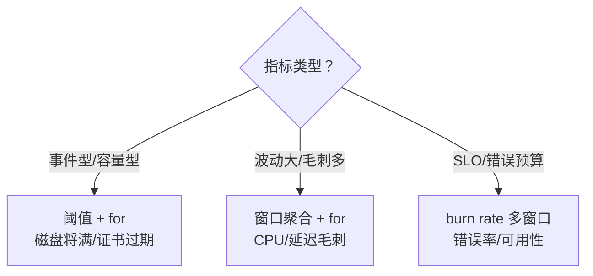
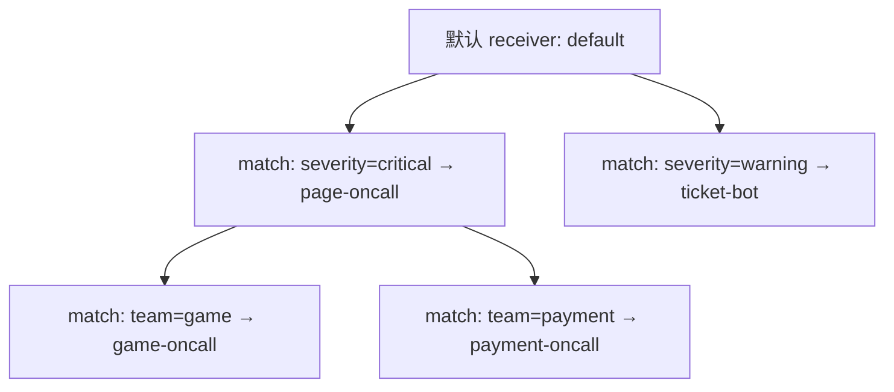
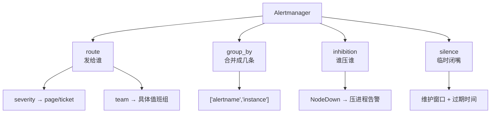
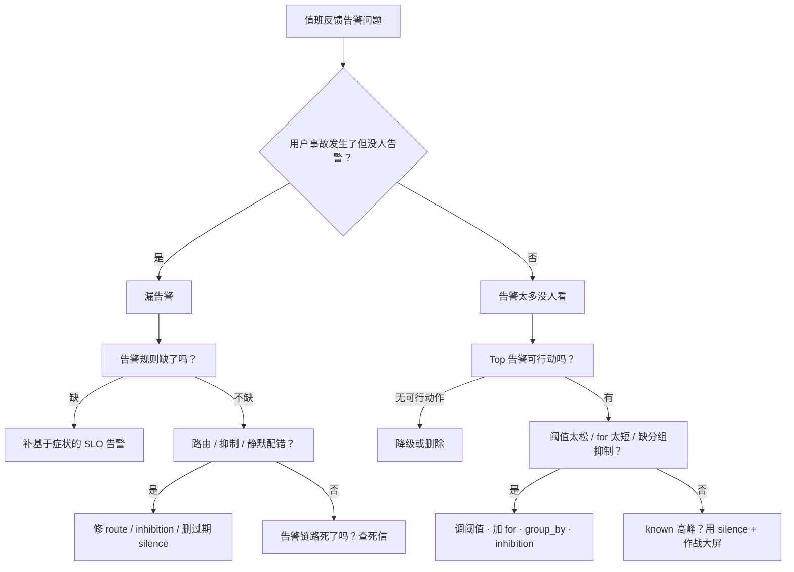

# 告警设计与降噪

> 凌晨三点，手机被「某台机器磁盘 90%」震醒；同一时刻，真正让玩家登录失败的 `http_5xx` 告警因为路由配错还在群里刷屏，却没人 page。
> **本章回答**：一条告警从「该不该响」到「到人、到手册、到闭环」会经历哪些阶段；每个阶段怎么写规则、怎么降噪、怎么防止漏报。
> **不讲**：PromQL 语法细节与 Exporter 指标设计 → [02](../02-Prometheus与PromQL/)；SLO、错误预算与 burn rate 细节 → [06](../06-SLI-SLO与错误预算/)；故障响应与复盘流程 → [07](../07-故障管理与复盘/)；主机侧命令与资源指标口径 → [01-22](../../01-基础底座/22-监控与告警/)；K8s 场景下的采集与组件排障 → [03-19](../../03-Kubernetes/19-监控与可观测性/)。

**标记**：🎯重点 · 🔥难点 · ⭐常考 · 🔧实操

---

## 一、一张图：一条告警的一生

> 🎯 **一句话**：告警不是「指标越线」，而是一条需要被「识别→路由→分组→抑制→静默→分级→响应→治理」完整处理的事件流。


**读图**：

- 主线是一条告警的完整生命周期：先判断「该不该响」，再决定「怎么写规则」，触发后经过 Alertmanager 的「路由 / 分组 / 抑制 / 静默」整理，才到值班人手里；人到之后靠 runbook 和死信兜底，最后通过评审和降噪让它「老去」得体面。
- 多数面试把这道题答成「阈值怎么设」，只占了第三节；真正的考点是前半段「基于症状」和后半段「到人后的治理」。
- 左侧「该不该告」错了，后面四件套再漂亮也是噪声。

---

## 二、该不该告：基于症状，不基于原因

> 🎯 **一句话**：告警应该对着「用户痛不痛」响，而不是对着「根因是什么」响——原因有无数种，症状只有几类。

### 症状与原因的分界

**症状（symptom）** 是用户或业务能直接观测到的坏结果：支付失败率上升、登录接口 P99 暴涨、匹配队列卡住、订单量异常下跌。**原因（cause）** 是导致这些症状的千万种可能：某台机器磁盘坏了、网络闪断、代码 bug、上游 CDN 抖动。

面试里最常举的反例就是「磁盘 90% 要不要 page」。

- 如果磁盘 90% 已经导致数据库写失败、玩家充值回调丢失，那真正的症状是 `写错误率 > 0` 或 `业务失败率 > SLO`，磁盘 90% 只是 runbook 里定位根因的线索。
- 如果磁盘 90% 只是清理任务延迟、业务毫无影响，那它连 ticket 都不该发，应该交给容量看板。
- 如果磁盘 90% 且按趋势 10 分钟后必满，那可以发 ticket 给 SRE 扩盘，而不是凌晨把人叫起来。

> 💡 **打个比方**：医院急诊分诊台只听病人喊「胸口疼」「喘不上气」——这是症状；医生再查是心梗还是胃食管反流——这是原因。分诊台只能按症状分级，不能按病因分级，因为病因要等检查，而生命体征等不起。

### 为什么基于原因会爆炸

基于原因写规则，必然陷入「穷举根因」的陷阱。同一个服务不可用，可能是：

- 本机 CPU 被打满
- 本机 OOM 正在杀进程
- 交换机端口 CRC 错误
- 上游依赖超时
- 数据库锁等待
- 发布版本回滚失败

如果把每一类原因都设一条告警，数量会指数级增长，而且任何一次故障都会触发几十条彼此独立的告警，值班人反而看不清「用户到底怎么了」。

> 📝 **面试**：问「告警该基于症状还是原因」，直接答「**基于症状，因为原因成千上万，而用户可感知到的症状只有少数几种；告警规则要围着 SLO 和用户体验写，根因信息放在 runbook 里当排查线索**」。

> ⚠️ **别混**：基于症状 ≠ 不要根因。症状决定「**该不该响、响多大声**」，根因决定「**响之后怎么修**」。一个好的 page 告警消息里，症状是标题，根因线索是正文里的图表和 runbook 链接。

---

## 三、规则怎么写：阈值、for 与多窗口

> 🎯 **一句话**：好规则 = 对的阈值 + 足够长的 for + 必要时多窗口验证；缺一就抖。

### 阈值别拍脑袋

阈值要跟着**历史分位**和**业务容量**走，而不是「80% 看起来比较危险」。

- 对 CPU 这类有峰值的指标，看 95 分位比看瞬时值稳。
- 对磁盘，真正该关注的是「剩余可用时长」或「写失败率」，而不是百分比。
- 对延迟，P99 比平均值更能代表用户体感。

如果阈值设得比正常波动还低，告警就会 **flapping（抖动）**：刚刚触发又恢复，反复 page。

### for 子句防抖动

**for 子句**要求条件持续一段时间才触发，是抑制抖动最简单的武器。没 `for` 的规则等于「滑一下线就尖叫」，风吹草动都 page。

```text
差规则：  CPU > 80%            ← 瞬时尖峰就 firing，必抖
好规则：  CPU > 80% for 5m    ← 连续 5 分钟才成立，过滤掉短暂毛刺
```

for 不是越长越好。太短抖，太长漏。经验值：

- 用户直接影响类（错误率、失败率）：`for: 2m–5m`。
- 资源饱和类（CPU / 内存 / 连接数）：`for: 5m–10m`。
- 容量趋势类（磁盘将满）：`for: 15m–30m`，配合预测函数。

如果一条告警历史里 pending/firing 反复切换，第一修法就是**加长 for**；第二修法是把绝对阈值改成 rate/irate 或滞后窗口。

> ⚠️ **别混**：`for` 管的是「**条件持续多久才算真**」，不是采样间隔。把 `for: 5m` 理解成「5 分钟内只要有一次越线就 fire」是错误的——Prometheus 要求评估窗口内**每次评估都越线**才转 firing。

### 多窗口与燃烧率

单窗口阈值只能回答「现在坏没坏」，回答不了「坏得多快」。对于 SLO 类指标，要用 **burn rate（燃烧率）** 多窗口：

```text
错误预算在一小时内烧掉 2%，或在六小时内烧掉 5%，才 page；
慢速燃烧（一天烧 10%）只发 ticket。                ← 多窗口同时满足才升级
```

燃烧率的思想一句话：**大故障要立刻叫人，小故障可以观察，但持续的小故障也要有人跟**。具体窗口选多长、预算怎么切，见 [06](../06-SLI-SLO与错误预算/)。

### 阈值、for、燃烧率怎么选



**读图**：事件型和容量型用简单阈值加足够长的 `for` 即可；波动大的指标要先把窗口磨平再判；有 SLO 的指标用燃烧率，让告警跟着预算走。三种修法不要混用——对延迟毛刺用燃烧率只会把小火酿成大噪。

> 📝 **面试**：问「怎么让告警不误报不漏报」，先答「基于症状 + for 防抖动 + 多窗口燃烧率」，再补一句「**所有 page 必须配 runbook，所有抖动必须通过告警评审闭环**」。

### 🔍 现场：怎么看一条告警是不是在抖

```bash
curl -s 'http://prometheus:9090/api/v1/alerts' \
  | jq '.data.alerts[]
        | select(.labels.alertname=="HighLatency")
        | {state, activeAt}'
# { "state": "firing",  "activeAt": "2026-09-01T02:17:00Z" }   # ← 已触发
# { "state": "pending", "activeAt": "2026-09-01T02:22:00Z" } # ← 又变 pending，反复横跳 → 在抖
```

看到反复横跳，别急着改代码，先去加长 `for` 或把阈值从瞬时值改成 `rate()`/`avg_over_time()`。调参方向永远先问「这条告警想 capture 的是持续异常还是尖峰异常」。

---

## 四、触发后怎么走：Alertmanager 四件套

> 🎯 **一句话**：Alertmanager 不是「发短信的工具」，而是把「一堆原始告警」整理成「可处理事件」的调度台——route 决定发给谁，group_by 决定发几条，inhibition 决定谁压住谁，silence 决定什么时候闭嘴。


**读图**：原始告警先按路由规则进入不同接收组；同组内再按 `group_by` 合并成一条通知；合并后检查抑制规则，子告警被父告警压住就不发；最后再匹配静默，命中维护窗口的也不发。四步缺一步，通知风暴就在所难免。

### route：谁该收到

**route** 按标签把告警分发到不同接收人。典型分层：

```text
critical → page → oncall-SRE
warning  → ticket → 对应业务值班群
info     → dashboard / 企业微信机器人
```

生产里最坑的是**标签缺失导致路由失败**。例如某条告警没有 `team` 标签，结果全进了默认接收组，critical 告警被当成普通群消息刷掉。

典型 route 树：



**读图**：先按 `severity` 分大类，再按 `team` 分到具体值班组；叶子节点就是接收人。设计 route 时最容易漏的是「标签缺失掉进 default」，导致 critical 没声音。

### group_by：发几条

**group_by** 按指定 label 把多条告警合并成一条通知。没有分组时，一台主机 down 会连带产生上百条「该主机上的进程、容器、业务指标」告警，值班人会收到刷屏短信。

生产例子：

```text
group_by: ['alertname', 'instance']
```

同一 `instance` 上的所有告警会被收成一条：「主机 srv-01 上触发 17 条告警，点击查看详情」。

### inhibition：谁压住谁

**inhibition（抑制）** 是自动的父子压制：父告警存在时，子告警不再通知。

生产例子：

```text
源：alertname="NodeDown", instance="srv-01"
目标：instance=~"srv-01.*"
```

当 `NodeDown` 触发时，srv-01 上所有进程、容器、中间件告警都被抑制——因为主机已经 down 了，再看进程无意义。抑制的关键是**父子关系必须真实**，不能把无关的告警胡乱压掉。

### silence：维护窗口闭嘴

**silence（静默）** 是人工创建的临时静音规则，带过期时间、可审计。

生产例子：

```text
今晚 02:00–04:00 全服停机维护
matcher: alertname=~".*", env="prod"
```

维护期间所有 prod 告警被静默，避免值班人被已知动作吵醒。silence 必须有**过期时间**，维护结束后自动失效；长期 silence 等于把监控埋掉。

### 收束：Alertmanager 四件套速记



**读图**：中间四个节点就是四件套的职责，各自向下展开一条生产原则。记不住顺序就背「**路到组、组到压、压到静**」——告警先找路，同路合并，父子压制，最后才看要不要静音。

> ⚠️ **别混**：四件套的顺序不能乱。先 route 再 group_by，是因为合并要在「知道发给谁」之后；先 inhibition 再 silence，是因为自动压制比人工静音更优先。顺序反过来，合并会按错分组，silence 也会提前把该合并的告警吞掉。

> 📝 **面试**：问 Alertmanager，先画这张图，再按「发给谁、发几条、谁压谁、临时闭嘴」四个词展开，每个词跟一个例子。

> ⚠️ **别混**：
>
> - **inhibition 是自动的**，靠父子关系压制；**silence 是人工的**，靠时间窗口和 matcher 临时静音。
> - **group_by 是合并通知**，消息数从 N 变 1；**inhibition 是丢弃通知**，被压的告警根本不到人。
> - **route 决定发给谁**；**group_by 决定发几条**。别把「按团队分路由」和「按实例合并」混为一谈。

> 📝 **面试**：问 Alertmanager 四件套，按顺序背「**route 路由 → group_by 分组 → inhibition 抑制 → silence 静默**」，再各给一个生产例子：主机 down 抑制其上进程告警、维护窗口静默 prod 告警。

### 🔍 现场：查当前有没有被静默或抑制

```bash
curl -s http://alertmanager:9093/api/v2/silences \
  | jq '.[] | {id, status, matchers, endsAt}'
# "status": { "state": "active" }                          # ← 活跃静默
# "matchers": [{ "name":"env", "value":"prod", "isRegex":false }] # ← 匹配 prod 的全部告警
# "endsAt": "2026-09-01T06:00:00Z"                          # ← 必须带过期时间

# 查看抑制规则是否生效：被抑制的告警在 Alertmanager UI 里会显示 "inhibited": true
curl -s http://alertmanager:9093/api/v2/alerts \
  | jq '.[] | select(.status.inhibited==true)
        | {name: .labels.alertname, instance: .labels.instance}'
# "name": "ProcessDown"   # ← 被压掉的子告警
# "instance": "srv-01"    # ← 因为 srv-01 NodeDown 而被抑制
```

---

## 五、到人：page 还是 ticket

> 🎯 **一句话**：凌晨三点把人叫醒的标准只有一个——用户正在受影响，且必须由人立刻动手。

### 告警分级的唯一尺子

| 分级 | 触发条件 | 通知方式 |
|------|----------|----------|
| **P0 / critical** | 用户受影响 + 需要人工立即动作 + 无自动恢复 | **page / 电话** |
| **P1 / warning** | 用户可能受影响 / 容量即将耗尽 / 已触发自动止损但需人确认 | **ticket / IM 高优** |
| **P2 / info** | 趋势变化、非紧急容量、需要周知 | **dashboard / 群机器人** |
| **P3 / debug** | 排查辅助信息 | **日志 / 看板** |

这条尺子的核心是**可行动性（actionability）**：如果收到告警后你只能看看然后叹气，那它就不该是 page。

> ⚠️ **别混**：「用户受影响」和「系统指标高」不是一回事。CPU 80% 可能用户毫无感觉；一个微服务的 CPU 20% 但所有请求 500，用户已经炸了。

### 升级策略

**升级（escalation）** 不是把告警抄送更多人，而是有时间盒的接力：

```text
0 min   告警 page 给 primary oncall
5 min   未 ack   → page secondary oncall
10 min  仍未 ack → page manager / 自动拉起 war room
15 min  仍未处理 → 启动重大故障流程（→ [07](../07-故障管理与复盘/)）
```

升级链必须在 runbook 里写死，不能靠群里喊。升级时间盒也不能太短，否则 oncall 刚睡醒就被二次 page，反而慌乱。

### 升级不是堆人

**升级（escalation）** 的常见反模式：

- 抄送全群：所有人都收到，但没人负责。
- 时间盒过短：primary 刚睁眼就被二次 page，反而慌乱。
- 没有 war room 触发条件：小事也拉大会，消耗注意力。

正确的升级链要把「负责对象」和「时间盒」写进 runbook，而不是口头约定。oncall 轮换也要保证同一事故由同一组人跟踪，避免 A 接了告警 B 不知情。

### 游戏场景：开服告警风暴

新服开服时，在线、CPU、连接数、排队时长全部冲顶，这是**预期内的高峰**。如果把这些指标都配成 critical page，值班人会被几千条告警淹没，真正该看的「登录失败率」反而被盖住。

正确做法：

- 开服窗口提前建 **silence**，把「资源使用高」类告警静音。
- 只把「登录失败率」「支付失败率」这类**用户体验指标**设为 page。
- 其他指标走 ticket 或专门的「开服作战大屏」。

> 📝 **面试**：问「告警太多没人看怎么办」，先区分「**告多了**」还是「**该看的被淹了**」。开服这种已知高峰要用 silence 和分级，而不是半夜调阈值。

---

## 六、到人之后：oncall 响应与值班手册

> 🎯 **一句话**：告警到人只是起点，ack → 看 runbook → 判影响 → 止血 → 升级，节奏比手速重要。

### oncall 响应节奏

```text
0–2 min   ack：先认告警，避免升级链炸开；同时看 runbook 链接
2–5 min   定级：判断影响面（用户数、金额、核心功能）
5–15 min  止血：按 runbook 执行最小恢复动作（回滚、限流、切流、扩容）
>15 min   升级：还没止住，立即拉 secondary / war room
```

ack 不等于处理。很多团队把「ack 率」当成 KPI，结果 oncall 闭眼 ack，真正的故障被掩盖。

### 值班手册 runbook

**每个 page 级告警必须配 runbook 链接**。runbook 不是文档，是操作清单：

- **症状**：告警标题和典型现象。
- **影响面判断**：看哪些 dashboard、哪些业务指标。
- **常见根因**：Top 3 原因和确认命令。
- **止血动作**：先做什么、再做什么、回滚命令是什么。
- **升级条件**：多久没止住要喊人。
- **事后改进**：上次评审记录。

> 📝 **面试**：问「oncall 怎么保证不瞎忙」，答「**page 必须带 runbook 链接，响应分 ack/定级/止血/升级四段，每段时间盒写死**」。

### 漏告警怎么防

告警链路自己也会坏，而且坏了往往最安静。防漏两板斧：

1. **死信告警（dead man's switch）**

   监控系统周期性产生一条「我还活着」的告警。如果这条告警连续 N 个周期没收到，说明**告警链路本身死了**，立即 page oncall。

   生产上常把死信做成一条周期性触发、被外部系统消费的 alert：

   ```text
   alert: Watchdog
   expr: vector(1)                    # ← 永远为 1
   for: 0m
   labels:
     severity: critical
   annotations:
     summary: "监控系统心跳"
   ```

   外部值班系统每 5 分钟收到一次；连续 2 个周期没收到，就 page oncall「告警链路可能中断」。注意这条告警本身也会被 Alertmanager 处理，所以要确保它**不被 silence、不被抑制**。

2. **告警链路自监控**

   - Prometheus 是否正常 scrape 目标？`up==0` 的 target 有没有收到？
   - Alertmanager 通知是否发送失败？`alertmanager_notifications_failed_total` 是否在涨？
   - 远程存储、告警历史、silence 是否可写？

> 💡 **打个比方**：死信告警就像巡夜人每小时敲一次梆子；梆子停了，守城的人知道不是没事发生，而是巡夜人出事了。

### 🔍 现场：检查告警消息里有没有 runbook

```bash
curl -s http://alertmanager:9093/api/v2/alerts \
  | jq '.[]
        | select(.labels.severity=="critical")
        | {name: .labels.alertname,
           runbook: .annotations.runbook_url,
           owner: .labels.team}'
# "name": "LoginFailureRateHigh"                    # ← page 级告警
# "runbook": "https://wiki/runbooks/login-failure" # ← 必须非空
# "owner": "platform"                                # ← 必须能路由到具体团队
```

看到 `runbook: null` 或 `owner: default` 的 critical 告警，立即打回重写规则。

---

## 七、老了：告警疲劳与降噪治理

> 🎯 **一句话**：告警疲劳（alert fatigue）不是人变懒，是信号被噪声淹没；降噪的唯一办法是持续删除、降级和修阈值。

### 告警疲劳怎么形成的

当值班人连续收到大量无法行动、或已经知道没事的告警，大脑会自动把它们当成背景噪声。久而久之，真正的 page 来了也会被延迟处理，甚至直接 miss。

典型路径：

```text
阈值过松 / for 过短 → 大量抖动告警
                     ↓
          值班人习惯点 ack 不看
                     ↓
          真正故障被淹没在噪声里
                     ↓
          漏告警 → 事故
```

### 降噪治理动作

1. **每周告警评审会**

   拉出上周触发次数 Top 10、page 次数 Top 5、ack 后无操作 Top 5。Top 告警通常吃掉 80% 的噪音。

2. **无可行动作就降级或删除**

   如果一条告警连续两周触发后值班人都只是看看，没有做任何动作，它应该变成 ticket 或直接从告警规则里删除。

3. **修抖动（flapping）**

   - 加长 `for`。
   - 把绝对阈值改成 `rate()` 或 `avg_over_time()`。
   - 增加 hysteresis（恢复阈值低于触发阈值）。

4. **合并重复告警**

   同一个故障触发「CPU 高」「Load 高」「连接数高」三条 page，应该合并成一条「主机饱和」或只用业务指标 page。

5. **把趋势信息还给看板**

   磁盘从 70% 涨到 80% 是趋势，不该告警；等到 90% 且按趋势 30 分钟必满再 ticket。日常容量曲线交给 Grafana，不要交给 Alertmanager。

### 降噪评审看哪些数

| 指标 | 含义 | 健康方向 |
|------|------|----------|
| page 中需立即处理的比例 | 可行动性 | 越高越好 |
| 每周 Top 10 告警占总触发数比例 | 噪声集中度 | 逐步压低 |
| ack 后无动作的比例 | 告警质量 | 越低越好 |
| 漏告事故数 | 覆盖度 | 0 |
| silence 过期未关数 | 运维纪律 | 0 |

这些数字就是评审会的 agenda，别靠「我觉得最近告警有点多」开会。

> 📝 **面试**：问「告警太多没人看怎么治理」，按顺序答「**评审 Top 告警 → 无可行动的降级/删除 → 抖动的加 for 或改阈值 → 重复的合并 → 趋势类移回看板**」。

### 🔍 现场：统计一周 Top 告警

```bash
# 假设 Alertmanager 把历史写进了 Loki 或文件日志
awk '/alertname=/' /var/log/alertmanager/notifications.log \
  | grep -oP 'alertname=[^, ]+' \
  | sort | uniq -c | sort -rn | head -10
# 1847 alertname=HighCPU        # ← 一周 1847 次，基本全是毛刺
#  892 alertname=MemoryUsageHigh # ← 每次看一眼就关，说明阈值过松
#   12 alertname=LoginFailureRateHigh
```

前两名就是降噪第一刀。别试图「优化全部告警」，先把 Top 10 砍干净，噪声立刻减半。

---

## 八、作战：告警太多没人看 / 漏告没人发现

> 🎯 **一句话**：告警问题的定责永远先问「是告多了还是漏告了」，两类病的药方相反。

### 两类症状的决策树



**读图**：

- 漏告警要从「覆盖 → 路由 → 抑制/静默 → 链路健康」逐层查，最常见的是**路由标签缺失**和**抑制规则过宽**。
- 告警多要从「可行动性 → 阈值/for → 分组抑制 → 已知高峰 silence」逐层砍，最常见的是**阈值过松**和**没有 group_by**。

### 现象 · 先做 · 别做

| 现象 | 先做 | 别做 |
|------|------|------|
| 事故发生了没告警 | 查 SLO/症状指标是否被监控；查抑制/静默是否误杀 | 先怪值班人没看 |
| 告警太多刷屏 | 拉 Top 10 评审 | 全局提高阈值，把真问题也漏掉 |
| 同一故障 N 条 page | 加 group_by / inhibition | 把每条规则单独静音 |
| 维护窗口被吵醒 | 提前建 silence 并设过期 | 永久 silence 或直接删规则 |
| 告警反复 pending/firing | 加长 for 或改 rate | 把 for 改成 0 求快 |
| oncall 总是 ack 不处理 | 查 runbook 是否缺失、告警是否可行动 | 把 ack 率当 KPI |

### 60 秒剧本 🔧

```text
① 0–10s   打开 Alertmanager 活跃告警页，看 critical 数量及状态
② 10–30s  检查 inhibition 和 silence：有没有过期的静默、过宽的抑制
③ 30–45s  看最近一条漏告/误告的标签：severity、team、runbook_url 是否齐全
④ 45–60s  定性：漏告 → 查覆盖/路由/抑制；误告 → 拉 Top 告警准备评审
```

> 📝 **面试**：问「告警系统出问题了怎么排查」，先说「**分两类：漏告和误告，药方相反**」，然后按决策树讲覆盖、路由、抑制、静默、死信。

---

## 九、收口

### 命令速查 🔧

```bash
# 查看当前所有 firing 告警及 runbook
curl -s http://alertmanager:9093/api/v2/alerts \
  | jq '.[] | {name: .labels.alertname,
              severity: .labels.severity,
              runbook: .annotations.runbook_url,
              state: .status.state}'

# 查看活跃 silence（别让自己之前建的静默忘了关）
curl -s http://alertmanager:9093/api/v2/silences \
  | jq '.[] | select(.status.state=="active")
        | {id, matchers, endsAt, comment}'

# 统计近 N 天告警 Top（日志路径按实际环境替换）
grep -oP 'alertname=[^, ]+' /var/log/alertmanager/*.log \
  | sort | uniq -c | sort -rn | head -10
```

### 面试锚点

| 问 | 30 秒答 |
|----|---------|
| 告警该基于症状还是原因？ | 基于症状。原因成千上万，症状只有少数几种；根因放 runbook。 |
| 磁盘 90% 要不要 page？ | 看是否导致用户失败；没影响就不该 page，最多 ticket。 |
| for 子句是干嘛的？ | 防抖动，要求条件持续一段时间才触发。 |
| Alertmanager 四件套？ | route 路由、group_by 合并、inhibition 抑制、silence 静默。 |
| 抑制和静默的区别？ | 抑制是自动父子压制；静默是人工维护窗口临时静音。 |
| 什么时候 page，什么时候 ticket？ | 用户受影响 + 需立即人工动作 → page；趋势/容量/可明天处理 → ticket。 |
| 漏告警怎么防？ | 死信告警 + 链路自监控 + 基于症状的 SLO 覆盖。 |
| 告警疲劳怎么治？ | 评审 Top 告警、删除/降级无可行动的、修抖动、合并重复、趋势回看板。 |
| 开服告警风暴怎么办？ | 提前 silence 已知高峰指标，只保留用户体验类 page。 |
| runbook 必须包含什么？ | 症状、影响面、Top 根因、止血动作、升级条件。 |
| burn rate 多窗口思想？ | 大故障快烧预算要 page，慢烧给小窗口只 ticket。 |
| escalation 时间盒？ | primary → secondary 5 min → manager 10 min → 重大故障 15 min。 |

### 易错一句话对照

- 告警基于原因 → 基于症状；原因放 runbook。
- 阈值 80% 一定危险 → 跟历史分位和业务影响走。
- for 越短越好 → 太短会抖，太长会漏。
- Alertmanager 只管发短信 → 它管路由、分组、抑制、静默。
- group_by 和 route 是一回事 → route 决定发给谁，group_by 决定发几条。
- inhibition 和 silence 一样 → 抑制自动、静默人工。
- CPU 高就 page → 先看用户是否受影响。
- 磁盘 90% 必须半夜叫人 → 没导致失败就 ticket。
- 告警多就全局提高阈值 → 会漏掉真故障。
- 维护窗口永久 silence → 等于关掉监控。
- 漏告警是因为值班人不认真 → 先查覆盖/路由/抑制/静默/链路健康。
- 告警疲劳靠加人解决 → 靠删除、降级、修阈值。
- ack 率高 = oncall 好 → 可能是闭眼 ack。
- runbook 可有可无 → 每个 page 必须带链接。
- 死信告警没用 → 它是监控监控的最后一道防线。

### 数字墙

> page 标准：**用户受影响 + 需立即人工动作** · for 建议：**2m–10m**（直接影响短，资源类长） · 升级时间盒：**5 min / 10 min / 15 min** · 燃烧率多窗口：详见 [06](../06-SLI-SLO与错误预算/) · 降噪目标：**Top 10 告警占总量 小于 50%** · 每个 page 必须配 **1** 条 runbook 链接 · silence 必须带 **过期时间** · 死信告警周期：**5 min** · oncall 响应阶段：**ack 2 min / 止血 15 min** · 告警评审频率：**每周 1 次**

---

## 合上书

- [ ] **口述一张图**：一条告警的一生——该不该告、规则怎么写、Alertmanager 四件套、到人、到人之后、老了、作战，各阶段挂什么机制。
- [ ] **区分症状与原因**：基于症状的原因是「原因成千上万，症状只有少数」；磁盘 90% 该不该 page 看是否导致用户失败。
- [ ] **默写 for 子句作用**：防抖动，条件持续 N 分钟才触发；阈值要跟历史分位/业务影响走。
- [ ] **默背 Alertmanager 四件套**：route（发给谁）、group_by（发几条）、inhibition（父压子）、silence（维护窗口静音）；各举一个生产例子。
- [ ] **区分抑制与静默**：抑制自动、靠父子关系；静默人工、带过期时间。
- [ ] **口述 page vs ticket 标准**：用户受影响 + 需立即人工动作 → page；否则 ticket 或看板。
- [ ] **默写升级时间盒**：primary 5 min → secondary 10 min → manager / war room 15 min。
- [ ] **口述 oncall 响应节奏**：ack → 定级 → 止血 → 升级；每个 page 必须配 runbook 链接。
- [ ] **口述漏告警两板斧**：死信告警 + 告警链路自监控。
- [ ] **口述告警疲劳治理四动作**：评审 Top 告警、无可行动作的降级/删除、修抖动、合并重复/趋势回看板。
- [ ] **口述作战决策树**：先分「漏告」还是「告多」；漏告查覆盖/路由/抑制/静默/链路；告多查可行动性/阈值/for/分组/抑制/已知高峰 silence。
- [ ] **口述游戏开服告警风暴**：提前 silence 资源类高峰，只保留登录/支付失败率等用户体验 page，另设作战大屏。
