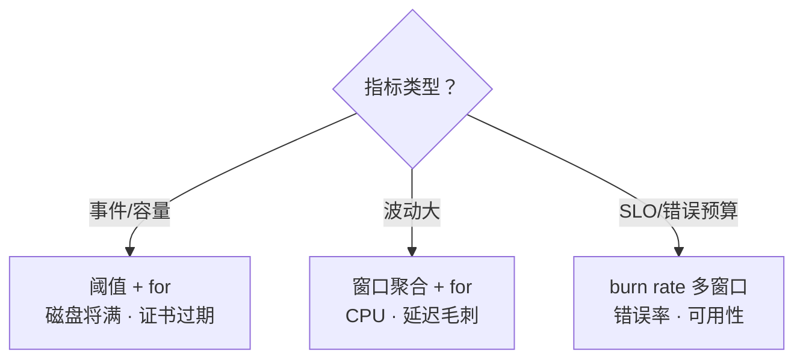
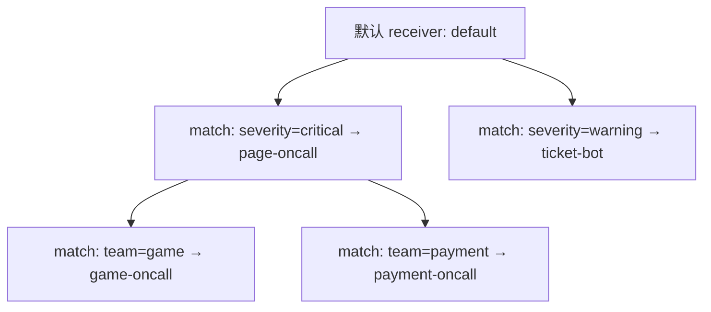
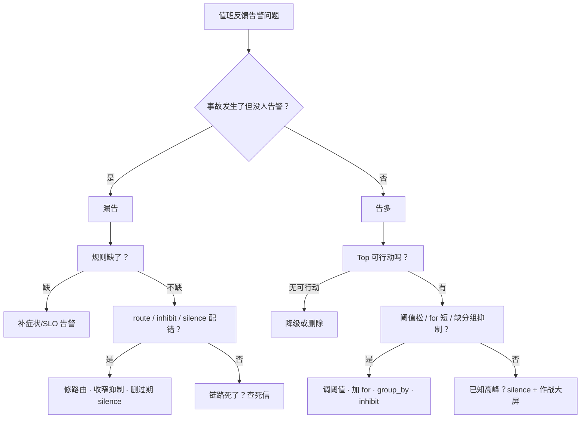

# 告警设计与降噪

> 凌晨三点被「某台机器磁盘 90%」震醒；同一时刻真正让登录失败的 `http_5xx` 因路由标签缺失还在群里刷屏，却没人 page。有人喊「阈值再严一点」——风暴不是阈值不够狠。
> **本章回答**：一条告警从「该不该响」到「到人、到手册、到闭环」会经历哪些阶段；每段怎么写规则、怎么降噪、怎么防漏报。
> **不讲**：PromQL / Exporter → [02](../02-Prometheus与PromQL/)；SLO 与 burn rate 细节 → [06](../06-SLI-SLO与错误预算/)；故障响应与复盘 → [07](../07-故障管理与复盘/)；主机侧资源告警口径 → [01-22](../../01-基础底座/22-监控与告警/)。

**标记**：🎯重点 · 🔥难点 · ⭐常考 · 🔧实操
---

## 一、一张图：一条告警的一生

> 🎯 **一句话**：告警不是「指标越线」，而是「识别 → 路由 → 分组 → 抑制 → 静默 → 分级 → 响应 → 治理」的完整事件流。


- 📖 **读图**
  - 🛤️ 主线：该不该响 → 规则 → Alertmanager 四件套 → 到人 → runbook/死信 → 评审降噪 → 作战定责
  - 左侧「该不该告」错了，后面四件套再漂亮也是噪声；面试只答「阈值」只占第三节

本节对应练习题 Q12。链路有了——什么该告。

---

## 二、该不该告：基于症状，不基于原因

> 🎯 **一句话**：告警对着「用户痛不痛」响，不对着「根因是什么」响——原因有无数种，症状只有几类。

### 🩺 症状与原因的分界 🎯⭐

- **症状（symptom）** = 用户/业务可直接观测的坏结果：支付失败率升、登录 P99 暴涨、匹配队列卡住
- **原因（cause）** = 导致症状的千万可能：磁盘坏、网络闪断、代码 bug、CDN 抖动

- 🎭 **小剧场**：磁盘 90% 要不要 page？
  - 已导致写失败 / 充值回调丢 → 真正 page 的是「写错误率 / 业务失败率」，磁盘只是 runbook 线索
  - 业务无感、只是清理延迟 → 连 ticket 都不该发，交给容量看板
  - 按趋势 10 分钟必满 → ticket 扩盘，不是凌晨叫人

> 💡 **打个比方**：急诊分诊只听「胸口疼」「喘不上气」（症状）；心梗还是反流（原因）要等检查。分诊按症状分级，生命体征等不起病因报告。

#### ❓ 为什么不能按原因写告警？

- ❌ **穷举根因**：同一服务不可用 = CPU 打满 / OOM / 交换机 CRC / 上游超时 / DB 锁 / 回滚失败……规则会指数爆炸
- 💥 **一次故障几十条独立 page** → 值班反而看不清「用户到底怎么了」
- ✅ **围着 SLO / 用户体验写规则**；根因线索放 runbook，不放告警标题

> ⚠️ **别混**：基于症状 ≠ 不要根因。症状决定「该不该响、响多大声」；根因决定「响之后怎么修」。好 page：症状是标题，根因线索 + runbook 是正文。

> 📝 **面试**：答「**基于症状——原因成千上万，用户可感知症状只有少数；规则围着 SLO 写，根因放 runbook**」。⭐（练习题 Q1）

口诀：**「告症状，少告原因」**。症状外——阈值与 for。

---

## 三、规则怎么写：阈值、for 与多窗口

> 🎯 **一句话**：好规则 = 对的阈值 + 足够长的 for + 必要时多窗口；缺一就抖或漏。

### 📏 阈值别拍脑袋 ⭐

- 跟**历史分位**和**业务容量**走，不是「80% 看起来危险」
  - CPU 看 95 分位，别看瞬时尖峰
  - 磁盘看「剩余可用时长 / 写失败率」，别只看百分比
  - 延迟看 P99，别看平均值
- 阈值低于正常波动 → **flapping（抖动）**：刚 firing 又恢复，反复 page

### ⏱️ for 子句防抖动 🎯⭐🔥

**for** = 条件必须**持续**一段时间才转 firing——抑制抖动最简单的武器。

```text
差规则：  CPU > 80%            ← 瞬时尖峰就 firing，必抖
好规则：  CPU > 80% for 5m    ← 连续 5 分钟每次评估都越线才算
```

- 经验值
  - 用户直接影响（错误率）：`for: 2m–5m`
  - 资源饱和（CPU / 内存 / 连接）：`for: 5m–10m`
  - 容量趋势（磁盘将满）：`for: 15m–30m`，可配预测函数
- pending/firing 反复横跳 → 第一修：**加长 for**；第二修：瞬时值改 `rate()` / `avg_over_time()` 或滞后窗口

#### ❓ 为什么 for 不是「窗口里有一次越线就火」？

- ❌ 误读：`for: 5m` =「5 分钟内碰过线就 fire」
- ✅ 真义：评估窗口内**每次评估都越线**才从 pending → firing
- 🕐 for 管的是「条件持续多久才算真」，**不是**采样间隔；太短抖、太长漏

> ⚠️ **别混**：把 for 理解成「出现过一次就告」会把毛刺全放进来；把 for 改成 `0`「求快」= 主动制造风暴。

### 🔥 多窗口与燃烧率

单窗口只答「现在坏没坏」，答不了「坏得多快」。SLO 类用 **burn rate（燃烧率）** 多窗口：

```text
1h 内烧掉预算 2%，或 6h 内烧掉 5% → page
一天慢烧 10% → 只 ticket
```

- 思想一句：**大火立刻叫人，小火可观察，持续小火也要有人跟**
- 窗口怎么切、预算怎么分 → [06](../06-SLI-SLO与错误预算/)（练习题 Q11）



- 📖 **读图**：事件/容量 → 阈值+for；毛刺多 → 先磨平再判；有 SLO → 跟预算走。三种修法别混用——对延迟毛刺硬套燃烧率只会把小火酿成大噪。

> 📝 **面试**：问「不误报不漏报」→「基于症状 + for 防抖 + 多窗口燃烧率」；再补「page 必配 runbook，抖动走评审闭环」。⭐（练习题 Q2）

### 🔍 现场：这条告警在不在抖 🔧

```bash
curl -s 'http://prometheus:9090/api/v1/alerts' \
  | jq '.data.alerts[]
        | select(.labels.alertname=="HighLatency")
        | {state, activeAt}'
# { "state": "firing",  "activeAt": "2026-09-01T02:17:00Z" }   # ← 已触发
# { "state": "pending", "activeAt": "2026-09-01T02:22:00Z" } # ← 又 pending → 在抖
```

> 🔍 **现场**：反复横跳先加长 for / 改窗口聚合，别急着改业务代码。先问：这条想 capture **持续异常**还是**尖峰异常**？

规则写完——触发后怎么整理成「可处理事件」。

---

## 四、触发后怎么走：Alertmanager 四件套

> 🎯 **一句话**：Alertmanager 不是「发短信的工具」，而是把「一堆原始告警」整理成「可处理事件」的调度台。


- 📖 **读图**
  - 先 route 进接收组 → group_by 合并成一条 → inhibition 压掉子告警 → silence 命中维护窗也不发
  - 口诀：**路到组、组到压、压到静**；四步缺一步，风暴必来

### 🗺️ route：发给谁 ⭐

```text
critical → page → oncall-SRE
warning  → ticket → 业务值班群
info     → dashboard / 机器人
```



- 📖 **读图**：先 `severity` 分大类，再 `team` 落到值班组；叶子 = 接收人
- 🕳️ **最坑**：标签缺失（没 `team`）掉进 default → critical 被当成普通群消息刷掉

### 📦 group_by：发几条

- 按指定 label 把多条合成**一条通知**
- 例：`group_by: ['alertname', 'instance']` → 「srv-01 上 17 条告警，点开看详情」
- 无分组：主机 down 连带上百条进程/容器/业务告警刷屏

### 🧱 inhibition：谁压谁 🔥

- **自动**父子压制：父告警存在时，子告警**不再通知**（不是合并，是丢弃）
- 例：`NodeDown{instance=srv-01}` 压住 `instance=~"srv-01.*"` 上所有进程/中间件告警
- ⚠️ 父子关系必须真实；胡乱抑制 = 漏告

### 🔇 silence：维护窗闭嘴

- **人工**临时静音，带 matcher + **过期时间**，可审计
- 例：`02:00–04:00` 停机，`env=prod` 全静默
- 长期 silence 不设过期 = 把监控埋掉

#### ❓ 为什么四件套顺序不能乱？inhibition 和 silence 差在哪？

- 顺序：**route → group_by → inhibition → silence**
  - 先知道发给谁，再合并；先自动压制，再人工静音
  - 反过来：按错组合并，或 silence 提前吞掉该合并的告警
- 三对易混（只记一次）：
  - **inhibition 自动**（父子） vs **silence 人工**（时间窗 + matcher）
  - **group_by 合并**（N→1） vs **inhibition 丢弃**（子告警不到人）
  - **route 发给谁** vs **group_by 发几条**

> 📝 **面试**：先背「**route → group_by → inhibition → silence**」，各举一例：主机 down 压进程；维护窗静默 prod。⭐（练习题 Q3、Q4）

### 🔍 现场：静默与抑制查什么 🔧

```bash
curl -s http://alertmanager:9093/api/v2/silences \
  | jq '.[] | {id, status, matchers, endsAt}'
# "status": { "state": "active" }   # ← 活跃静默
# "endsAt": "2026-09-01T06:00:00Z" # ← 必须有过期

curl -s http://alertmanager:9093/api/v2/alerts \
  | jq '.[] | select(.status.inhibited==true)
        | {name: .labels.alertname, instance: .labels.instance}'
# "name": "ProcessDown"  # ← 被子告警压掉
# "instance": "srv-01"   # ← 因 NodeDown
```

整理完——该不该把人叫醒。

---

## 五、到人：page 还是 ticket

> 🎯 **一句话**：凌晨三点叫醒的标准只有一个——用户正在受影响，且必须由人立刻动手。

### 📐 分级的唯一尺子 🎯⭐

| 分级 | 触发条件 | 通知方式 |
|------|----------|----------|
| **P0 / critical** | 用户受影响 + 需立即人工动作 + 无自动恢复 | **page / 电话** |
| **P1 / warning** | 可能受影响 / 容量将尽 / 已自动止损需确认 | **ticket / IM 高优** |
| **P2 / info** | 趋势、非紧急容量、周知 | **dashboard / 机器人** |
| **P3 / debug** | 排查辅助 | **日志 / 看板** |

- 核心是**可行动性（actionability）**：收到后只能叹气 → 不该是 page

> ⚠️ **别混**：「用户受影响」≠「系统指标高」。CPU 80% 可能用户无感；微服务 CPU 20% 但全 500，用户已炸。

### 📶 升级：时间盒接力，不是堆人

```text
0 min   page → primary oncall
5 min   未 ack → secondary
10 min  仍未 ack → manager / war room
15 min  仍未处理 → 重大故障流程（→ [07](../07-故障管理与复盘/)）
```

- ❌ 反模式：抄送全群（人人收到、无人负责）；时间盒过短（刚睁眼二次 page）；小事也拉 war room
- ✅ 负责对象 + 时间盒写进 runbook；同一事故同一组人跟踪

### 🎮 开服：预期高峰不是事故 ⭐

开服时在线/CPU/连接/排队全冲顶 = **预期内高峰**。全配 critical → 几千条淹没真正该看的「登录失败率」。

- 开服窗提前 **silence** 资源使用高类
- 只保留「登录失败率」「支付失败率」等**用户体验**为 page
- 其余 ticket 或开服作战大屏（练习题 Q6、Q13）

> 📝 **面试**：问「告警太多」先分「**告多了**」还是「**该看的被淹了**」。已知高峰用 silence + 分级，不是半夜调阈值。⭐（练习题 Q5）

分级定了——人接到之后怎么跑。

---

## 六、到人之后：oncall 响应与值班手册

> 🎯 **一句话**：告警到人只是起点；ack → runbook → 定级 → 止血 → 升级，节奏比手速重要。

### 🏃 响应节奏 🔧

```text
0–2 min   ack：认领，避免升级链炸开；同时点开 runbook
2–5 min   定级：影响面（用户数、金额、核心功能）
5–15 min  止血：按 runbook 最小动作（回滚 / 限流 / 切流 / 扩容）
>15 min   升级：没止住 → secondary / war room
```

- ⚠️ ack ≠ 处理。「ack 率」当 KPI → 闭眼 ack，真故障被盖住

### 📘 每个 page 必须配 runbook 🎯⭐

runbook 是**操作清单**，不是散文：

- 症状 · 影响面判断（看哪些盘）· Top 3 根因与确认命令
- 止血动作顺序与回滚 · 升级条件 · 上次评审记录

> 📝 **面试**：问「oncall 不瞎忙」→「**page 必带 runbook；ack / 定级 / 止血 / 升级四段时间盒写死**」。⭐（练习题 Q7）

### 💀 漏告两板斧：死信 + 链路自监控 🔥

告警链路坏了往往最安静。

#### ❓ 为什么要死信告警？普通业务告警不够吗？

- 业务告警依赖「链路还活着」；链路死了，业务告警**集体失声**——没人知道该吵的没吵
- **死信（dead man's switch）**：监控周期性产生「我还活着」；外部系统连续 N 周期没收 → page「链路可能断了」

```text
alert: Watchdog
expr: vector(1)          # ← 永远为 1
for: 0m
labels: { severity: critical }
```

- 外部每 5 min 收一次；连续 2 周期没有 → page
- ⚠️ Watchdog 自身**不能被 silence / 过宽 inhibition 误杀**

- 🔗 **链路自监控**（练习题 Q8）
  - Prometheus scrape：`up==0` 有没有人收
  - `alertmanager_notifications_failed_total` 是否在涨
  - 远程存储 / 告警历史 / silence 是否可写

> 💡 **打个比方**：巡夜人每小时敲梆子；梆子停了，不是没事，是巡夜人出事了。

### 🔍 现场：critical 有没有 runbook 🔧

```bash
curl -s http://alertmanager:9093/api/v2/alerts \
  | jq '.[]
        | select(.labels.severity=="critical")
        | {name: .labels.alertname,
           runbook: .annotations.runbook_url,
           owner: .labels.team}'
# "runbook": "https://wiki/runbooks/login-failure" # ← 必须非空
# "owner": "platform"                              # ← 必须能路由到团队
```

> 🔍 **现场**：`runbook: null` 或 `owner: default` 的 critical → 立刻打回重写规则。

体验外——噪声怎么老去。

---

## 七、老了：告警疲劳与降噪治理

> 🎯 **一句话**：告警疲劳不是人变懒，是信号被噪声淹没；降噪靠持续删除、降级、修阈值。

### 😴 疲劳怎么长出来的

```text
阈值过松 / for 过短 → 大量抖动
        ↓
值班习惯点 ack 不看
        ↓
真 page 被淹没 → 漏处理 → 事故
```

### 🧹 降噪五刀 🎯⭐

1. **每周评审**：触发 Top 10、page Top 5、ack 后无操作 Top 5——通常吃掉 80% 噪音
2. **无可行动 → 降级或删除**：连续两周只看不修 → ticket 或删规则
3. **修 flapping**：加长 for；改 `rate()` / `avg_over_time()`；hysteresis（恢复阈值 < 触发阈值）
4. **合并重复**：同故障「CPU 高 / Load 高 / 连接高」三条 page → 一条「主机饱和」或只告业务指标
5. **趋势还看板**：磁盘 70%→80% 是趋势；90% 且 30 分钟必满再 ticket——曲线给 Grafana，不给 Alertmanager

| 指标 | 健康方向 |
|------|----------|
| page 中可立即处理比例 | 越高越好 |
| Top 10 占总触发比例 | 逐步压低 |
| ack 后无动作比例 | 越低越好 |
| 漏告事故数 / 过期未关 silence | **0** |

> 📝 **面试**：治理顺序「**评审 Top → 无可行动降级/删 → 修抖动 → 合并重复 → 趋势回看板**」。⭐（练习题 Q9）

### 🔍 现场：一周 Top 告警 🔧

```bash
awk '/alertname=/' /var/log/alertmanager/notifications.log \
  | grep -oP 'alertname=[^, ]+' \
  | sort | uniq -c | sort -rn | head -10
# 1847 alertname=HighCPU          # ← 毛刺王，第一刀
#  892 alertname=MemoryUsageHigh  # ← 看一眼就关 = 阈值过松
#   12 alertname=LoginFailureRateHigh
```

别「优化全部告警」——先砍 Top 10，噪声立刻减半。现在回开头那个现场。

---

## 八、作战：告警太多没人看 / 漏告没人发现

> 🎯 **一句话**：定责永远先问「告多了还是漏了」——两类病的药方相反。



- 📖 **读图**
  - 漏告：覆盖 → 路由 → 抑制/静默 → 链路健康（常见：标签缺失、抑制过宽）
  - 告多：可行动性 → 阈值/for → 分组抑制 → 已知高峰 silence（常见：阈值过松、无 group_by）

### 现象 · 先做 · 别做

| 现象 | 先做 | 别做 |
|------|------|------|
| 事故没告警 | 查症状/SLO 覆盖；查抑制/静默误杀 | 先怪值班人 |
| 刷屏 | 拉 Top 10 评审 | 全局抬阈值把真问题也漏掉 |
| 同故障 N 条 page | group_by / inhibition | 每条单独静音 |
| 维护窗被吵醒 | 提前 silence + 过期 | 永久 silence / 删规则 |
| pending/firing 横跳 | 加长 for 或改 rate | `for: 0` 求快 |
| 总 ack 不处理 | 查 runbook / 可行动性 | 把 ack 率当 KPI |

### 60 秒剧本 🔧

```text
① 0–10s   Alertmanager 活跃页：critical 数量与状态
② 10–30s  inhibition / silence：过期静默？过宽抑制？
③ 30–45s  最近漏/误告标签：severity、team、runbook_url 齐不齐
④ 45–60s  定性：漏 → 覆盖/路由/抑制/死信；多 → Top 准备评审
```

> 📝 **面试**：先说「**漏告和误告，药方相反**」，再按决策树讲覆盖、路由、抑制、静默、死信。⭐（练习题 Q10、Q14）

**回到开头**：正确剧本是症状告警 → group/inhibit → 维护窗 → 人可执行 runbook。再喊「阈值调严」，你知道该怎么纠正。

---

## 九、收口

### 命令速查 🔧

```bash
# firing + runbook
curl -s http://alertmanager:9093/api/v2/alerts \
  | jq '.[] | {name: .labels.alertname,
              severity: .labels.severity,
              runbook: .annotations.runbook_url,
              state: .status.state}'

# 活跃 silence（别忘关）
curl -s http://alertmanager:9093/api/v2/silences \
  | jq '.[] | select(.status.state=="active")
        | {id, matchers, endsAt, comment}'

# Top 告警（路径按环境替换）
grep -oP 'alertname=[^, ]+' /var/log/alertmanager/*.log \
  | sort | uniq -c | sort -rn | head -10
```

### 面试锚点

| 问 | 30 秒答 |
|----|---------|
| 症状还是原因？ | 基于症状；根因放 runbook。 |
| 磁盘 90% 要不要 page？ | 看是否导致用户失败；无感最多 ticket。 |
| for 干嘛？ | 防抖：条件持续才触发。 |
| 四件套？ | route → group_by → inhibition → silence。 |
| 抑制 vs 静默？ | 自动父子 vs 人工时间窗。 |
| page vs ticket？ | 用户受影响 + 立即人工 → page；否则 ticket。 |
| 漏告怎么防？ | 死信 + 链路自监控 + 症状/SLO 覆盖。 |
| 疲劳怎么治？ | 评审 Top → 降级/删 → 修抖 → 合并 → 趋势回看板。 |
| 开服风暴？ | 提前 silence 资源高峰，只留体验类 page。 |
| burn rate？ | 大火快烧 page，慢烧 ticket（细节 → 06）。 |

### 易错一句话对照

- 基于原因写规则 → 基于症状；原因放 runbook
- 80% 一定危险 → 跟历史分位与业务影响
- for 越短越好 → 太短抖、太长漏
- Alertmanager 只管发短信 → 管路由/分组/抑制/静默
- group_by = route → 发给谁 vs 发几条
- inhibition = silence → 自动 vs 人工
- CPU 高就 page → 先看用户是否受影响
- 告多就全局抬阈值 → 会漏真故障
- 永久 silence → 等于关监控
- 漏告怪人不认真 → 先查覆盖/路由/抑制/静默/死信
- 疲劳靠加人 → 靠删、降级、修阈值
- ack 率高 = 好 → 可能闭眼 ack
- runbook 可有可无 → 每个 page 必须带链接

### 数字墙

> page 标准：**用户受影响 + 需立即人工动作** · for：**2m–10m**（直接影响短，资源类长） · 升级盒：**5 / 10 / 15 min** · 降噪：Top 10 占总量 **< 50%** · page 配 **1** 条 runbook · silence 必带**过期** · 死信周期：**5 min** · 响应：ack **2 min** / 止血 **15 min** · 评审：**每周 1 次** · burn rate 细节 → [06](../06-SLI-SLO与错误预算/)

---

## 合上书

- [ ] **口述一张图**：该不该告 → 规则 → 四件套 → 到人 → runbook/死信 → 降噪 → 作战
- [ ] **区分症状与原因**：原因千万、症状少数；磁盘 90% 看是否导致用户失败
- [ ] **默写 for**：持续 N 分钟每次评估都越线才 firing；不是「窗口碰过一次」
- [ ] **默背四件套**：route / group_by / inhibition / silence + 各举一例
- [ ] **区分抑制与静默**：自动父子 vs 人工过期时间窗
- [ ] **口述 page vs ticket**：用户受影响 + 立即人工 → page
- [ ] **默写升级盒**：primary 5 → secondary 10 → manager / war room 15
- [ ] **口述响应节奏**：ack → 定级 → 止血 → 升级；page 必配 runbook
- [ ] **口述漏告两板斧**：死信 + 链路自监控
- [ ] **口述降噪五刀**：评审 Top → 降级/删 → 修抖 → 合并 → 趋势回看板
- [ ] **口述作战树**：先分漏告 / 告多；药方相反
- [ ] **口述开服风暴**：silence 资源高峰，只留登录/支付失败率 page
