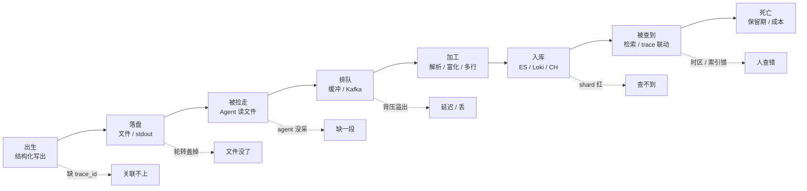
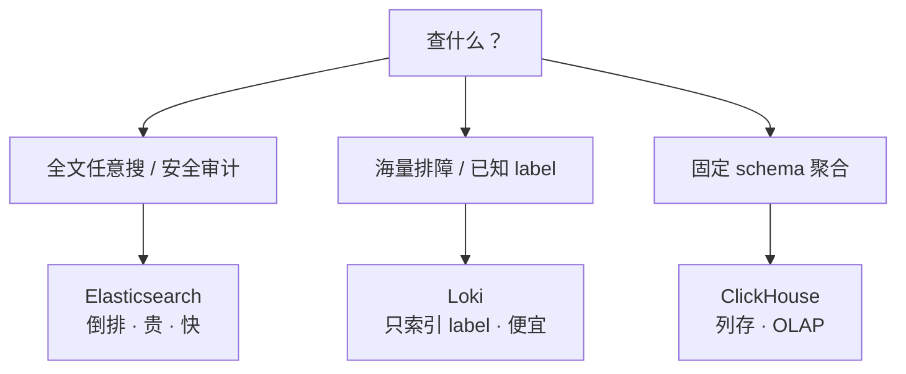
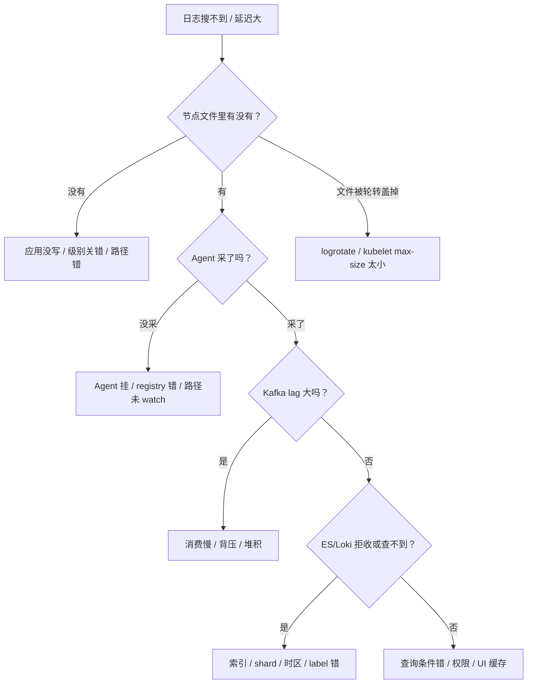

# 日志链路与采集

> 活动峰值后客服说「最近十分钟 ERROR 搜不到」；月初账单出来老板问「日志为什么占了 30% 云成本」；排查 P0 时同一次请求散在十几条里对不上。三个人分别喊「换 ELK」「全量永久留存」「先扩 ES」，三句都不对。
> **本章回答**：一条日志从应用写出到最终销毁会经历什么，每一段会怎么坏、现场怎么一眼定责。
> **不讲**：主机侧 `logrotate`/`journald` → [01-23](../../01-基础底座/23-日志运维/)；K8s 日志落地 → [03-20](../../03-Kubernetes/20-日志管理/)；ES / Kafka 本体 → [02-04](../../02-中间件与数据库/04-Elasticsearch/) · [02-03](../../02-中间件与数据库/03-Kafka/)；trace 传播 → [05](../05-链路追踪与OpenTelemetry/)；代码侧 logging → [05-02-05](../../05-开发能力/02-Python/05-logging日志规范/)。

**标记**：🎯重点 · 🔥难点 · ⭐常考 · 🔧实操
---

## 一、一张图：一条日志的一生

> 🎯 **一句话**：日志不是「写出来就能搜到」——出生、落盘、被捡走、排队、加工、入库、被查、死亡；出了问题先问「它死在哪一段」。



- 📖 **读图**
  - 🛤️ 主线：写出 → 落节点 → agent 读走 → 缓冲/队列 → 解析加工 → 后端 → 检索 → 按保留期销毁
  - 💥 虚线是六个常见卡点；排障永远**从落盘往右查**，别从 Kibana 搜不到直接跳「扩 ES」（Q11、Q14）

本节对应练习题 Q1、Q14。链路有了——先谈出生：应用写出什么。

---

## 二、出生：应用写出结构化日志

> 🎯 **一句话**：面试问日志规范，先答「JSON 结构化 + 必带字段」，再谈级别和采样。

### 📮 裸文本 vs JSON 🎯⭐🔥

很多老项目还在写：

```text
2024-01-17 10:30:15 [WARN] payment timeout, order=ORD-001, user=U123, duration=820
```

生产级写法是直接 JSON：

```json
{"timestamp":"2024-01-17T10:30:15Z","level":"WARN","service":"payment","instance":"pay-7d9f4","trace_id":"abc123","msg":"payment timeout","order_id":"ORD-001","user_id":"U123","duration_ms":820}
```

> 💡 **打个比方**：裸文本像手写快递单，地址电话混在一起要人读；JSON 像打印电子面单，每个字段有固定格子，机器直接扫。

#### ❓ 为什么不是正则切裸文本？

- ❌ **正则切**：`duration=820` 与 `duration_ms=820` 两种写法一变就崩；切出来全是字符串，聚合难
- ✅ **JSON**：字段边界可靠、类型可推断、嵌套可扩展、多语言统一同一套 schema
- 🗜️ 「JSON 长」不是拒绝理由——真正占带宽的是无意义 DEBUG 和堆栈，不是那几个括号；传输层通常有压缩

> 📝 **面试**：问日志规范，第一句「**输出 JSON 结构化日志，包含统一字段**」，再补字段列表和级别。⭐（练习题 Q1）

### 必带字段 🔧

```text
timestamp    ← ISO-8601 / RFC3339，Prefer UTC
level        ← DEBUG / INFO / WARN / ERROR / FATAL，全链路统一枚举
service      ← 服务名，如 hall / payment / match
instance     ← 主机或 Pod 名
trace_id     ← 同一次请求跨网关 / 逻辑服 / DB 的共同钥匙
msg          ← 人类可读的一句话，不要只堆 JSON
```

> ⚠️ **别混**：`timestamp` 只用**一个**时间字段，不要同时有 `time` / `@timestamp` / `ts`；`level` 统一枚举，别混 `warning` / `WARN` / `warn`——命名不一致 = 查询时建三个 filter。

- 🔑 **`trace_id` 从哪来**：请求进网关时由中间件生成，透传 HTTP header / gRPC metadata / MQ；代码侧 → [05-02-05](../../05-开发能力/02-Python/05-logging日志规范/)；完整追踪 → [05](../05-链路追踪与OpenTelemetry/)

### 日志级别与采样 🎯⭐

```text
DEBUG  ← 开发排障，生产通常采样或关闭
INFO   ← 正常流程（登录成功、订单创建）
WARN   ← 可恢复异常（超时重试、降级）
ERROR  ← 需要人看的错误（DB 连不上）
FATAL  ← 进程要退出（启动配置缺失）
```

- 🔥 **线上三坑**：DEBUG 没关（一条请求 50 行，高峰翻倍）· 业务异常写成 ERROR（告警炸）· 只按级别不过滤采样（ERROR 全留，DEBUG 按 1% 才压得住）

> 📝 **面试**：问「日志量太大怎么降本」，答「**级别过滤 + DEBUG 采样 + 热温冷分层 + 保留期**」组合拳，别只答删旧日志。（练习题 Q2、Q3）

本节对应练习题 Q1～Q3。写出了，还得落到节点上——agent 才能捡。

---

## 三、落盘：文件与轮转

> 🎯 **一句话**：日志必须先落到节点文件，才会被 agent 读到；节点盘满了，后面所有链路都白搭。

### 📦 K8s 下两种写法 ⭐🔥

```text
① stdout / stderr  ← 推荐：containerd/kubelet 统一接管落盘和轮转
② /app/logs/xx.log ← 仅老应用或需要本地审计时
```

> 💡 **打个比方**：stdout 像把垃圾袋统一放到楼道门口，物业（kubelet）定时收走；写文件像把垃圾藏床底下，满了整个房间（Pod）都臭。

#### ❓ 为什么 stdout 优于容器内写文件？

- 🔄 **轮转由 kubelet 统一做**，容器里不用跑 logrotate
- 🔐 **采集器只读挂载节点目录**，不必给业务容器挂日志卷
- 📜 **销毁后生命周期清晰**：`kubectl logs --previous` 读的是节点上还没被轮转清的上一轮
- 📦 **镜像无状态**：日志不落可写层，避免 overlay 膨胀

> ⚠️ **别混**：stdout **不是**直接发到 ES——它仍要先落到**节点文件**，再由 agent 读走。有人以为 kubelet 直接推后端，错。

### Docker 与 containerd 路径 🔧

```bash
# Docker json-file
ls -lh /var/lib/docker/containers/<id>/<id>-json.log
# ← 一行一个 JSON：{"log":"...","stream":"stdout","time":"..."}

# containerd（K8s 默认）
ls -lh /var/log/pods/{ns}_<pod-name>_<pod-uid>/<container-name>/0.log
# ← 实体文件；/var/log/containers/*.log 是软链

ls -l /var/log/containers/*battle*
# ← 指向 /var/log/pods/... 的符号链接
```

> 🔍 **现场**：`kubectl logs` 空时，先上节点 `ls /var/log/pods/...`——可能是 kubelet 已轮转清掉，或采集器挂载路径错。

### 轮转：logrotate vs kubelet 🎯⭐

```text
主机 /var/log/xxx.log      → logrotate（/etc/logrotate.d/*）
K8s /var/log/pods/.../0.log → kubelet --container-log-max-size / --container-log-max-files
```

> ⚠️ **别混**：节点 DiskPressure 时改 `/etc/logrotate.d` **救不了**容器日志——那是主机日志；要改 kubelet 参数或 truncate 容器日志文件。细节 → [01-23](../../01-基础底座/23-日志运维/) · [03-20](../../03-Kubernetes/20-日志管理/)。

- 🔥 **inode 陷阱**：文件被改名/清空后，进程还握着旧 inode 写 → `df` 不降、`du` 变小。治本靠 **USR1 / reopen** 或 `copytruncate`。

口诀：**「先结构化，再谈平台」**。本节对应练习题 Q3、Q4。落盘有了——邮差怎么捡。

---

## 四、被捡走：采集 agent

> 🎯 **一句话**：采集器是「按偏移读节点文件」的邮差；选型看资源、隔离、顺序性。

### 常见 agent ⭐

| Agent | 定位 | 资源占用 | 游戏集群常见角色 |
|-------|------|----------|------------------|
| **Fluent Bit** | C，轻量 | <5Mi | DaemonSet 默认 |
| **Filebeat** | Go，Elastic 官方 | 20–50Mi | 纯 ES 生态 |
| **Vector** | Rust，可编程 | 10–30Mi | 复杂 transform |
| **ilogtail** | 阿里云 | 节点级 | ACK 默认 |

> ⚠️ **别混**：Fluent **Bit** 是采集器，Fluent **d** 是聚合器（Ruby，更重）——常组合：Bit 节点采 → Kafka/Fluentd 聚合 → ES/Loki。

### DaemonSet vs Sidecar 🔥

```text
DaemonSet：每节点一个 agent，读 /var/log/containers · /var/log/pods
Sidecar：  每个 Pod 里塞一个 agent，只读该 Pod 日志
```

#### ❓ 为什么默认 DaemonSet，什么时候才 Sidecar？

- 💰 **资源**：DaemonSet 一份；Sidecar 1000 Pod = 1000 份 agent
- 🧱 **隔离**：Sidecar 只影响本 Pod；DaemonSet 挂了影响整节点
- 📐 **顺序**：多容器同 Pod 时 Sidecar 更可控；DaemonSet 靠文件名区分来源
- ✅ **默认 DaemonSet**；只有改不了 stdout 的老应用，或需要强隔离/顺序性时才 Sidecar

> 📝 **面试**：问「DaemonSet 还是 Sidecar」，答「**默认 DaemonSet；改不了 stdout 或需强隔离/顺序性才 Sidecar**」。⭐（练习题 Q4）

### offset / registry 🔧

```bash
cat /var/lib/filebeat/registry/filebeat/log.json | head
# ← inode + 设备号 + offset；删了 = 重启从头读 = 旧日志再进一遍 ES
```

- 🔑 agent 靠 **offset** 知道读到哪；Fluent Bit 类似（sqlite / 本地文件）。**别随手删 registry**。

本节对应练习题 Q4～Q5。邮差捡走了——高峰时谁顶得住？

---

## 五、排队：缓冲与背压

> 🎯 **一句话**：中间加 Kafka 不是炫技，是削峰、解耦、可回放；背压来了谁先丢，取决于你显式配的策略。

### 为什么需要缓冲层 ⭐🔥

```text
直接：高峰 100MB/s ──► ES 只能吃 30MB/s ──► rejected / agent 内存爆 / 丢日志

加 Kafka：
应用 ──► Agent ──► Kafka ──► Consumer ──► ES/Loki
              ↑ 写快没关系          ↑ 按 ES 能力消费
```

> 💡 **打个比方**：Kafka 像收发室货架。快递员（agent）按高峰扔包裹；分拣员（consumer）慢慢拣。没有货架，要么堵死门口，要么把包裹扔了。

- 🏔️ **削峰**：broker 暂存，消费端按自己速度拉
- 🔌 **解耦**：ES/Loki 维护时 agent 继续写 Kafka，恢复后接着消费
- 🔁 **回放**：索引写坏了，可重放 topic 到另一集群

### 背压与谁丢 🔧

```text
应用写文件 → Agent 读文件 → Agent 内存/disk queue → Kafka → Consumer → ES
```

```text
① 磁盘满 → 应用写日志阻塞或丢（看语言/框架）
② Agent queue 满 → 转 disk buffer；再满 → 按策略丢或阻塞 tail
③ Kafka 到上限 → producer 阻塞或抛异常
④ Consumer 慢 → lag 涨；超 retention → 消息被 Kafka 删
⑤ ES bulk rejected → 重试或死信
```

#### ❓ 背压时谁先丢？at-least-once 还是 at-most-once？

- 📌 **at-least-once**：宁可重复，不能丢 ← 游戏支付日志常用
- 📌 **at-most-once**：宁可丢，不能重复 ← 可采样 DEBUG 可用
- 🛑 **谁先丢看配置**：tail 阻塞（业务可能卡）· 丢弃旧数据（日志丢业务不卡）· 写满 rotate（丢最早那批）

> ⚠️ **别混**：背压不是故障，是**正常保护**。没有背压要么打死 ES，要么撑爆业务内存。关键是把「丢」的策略**显式配出来**。

> 📝 **面试**：问「日志延迟大/丢了怎么查」，按上面五段一层层排除，别一上来就说 ES 慢。（练习题 Q5）

本节对应练习题 Q5。排队过了——还要加工，否则堆栈碎、字段空。

---

## 六、加工：解析、富化与多行合并

> 🎯 **一句话**：采集不是原样搬运；JSON 直接入库，裸文本要解析，堆栈要合并，K8s 元数据要富化。

### 解析与切分

```text
JSON：parser json → timestamp / level / msg / duration_ms（数字可聚合）
裸文本：grok / regex → %{TIMESTAMP_ISO8601:timestamp} %{LOGLEVEL:level} %{GREEDYDATA:msg}
```

> 📝 **面试**：裸文本优先推动业务改 JSON；过渡用 grok，字段一变就要改——**不要把 grok 当长期架构**。

### 富化（Enrichment）

```text
k8s_namespace=game · k8s_pod_name=battle-abc-7d9f4 · node_name=node-05 · cluster=prod-asia
```

- 🔍 「只有 node-05 的 payment Pod 在报 ERROR」→ 先怀疑这台节点。

### 多行与堆栈合并 🔥⭐

```text
2024-01-17 10:30:15 ERROR com.game.payment.PayService - payment failed
java.lang.RuntimeException: db timeout
    at com.game.payment.PayService.charge(PayService.java:42)
    at com.game.payment.PayController.pay(PayController.java:28)
```

文件按行读，默认切成多条——Kibana 搜 `PayService` 只见首行，堆栈散开。

```text
multiline.pattern: '^\d{4}-\d{2}-\d{2} \d{2}:\d{2}:\d{2}'
multiline.negate: true
multiline.match: after
# ← 匹配时间戳 = 新事件；不匹配的行（堆栈）追加到前一个事件
```

#### ❓ 为什么堆栈会碎成几十条？

- 📄 **文件按行读**，agent 默认每行独立事件
- ✅ **配 multiline**：行首 pattern 判新事件，后续行合并到首行
- ❌ 别在业务端把堆栈打成一行 JSON 字符串——破坏可读性、增序列化开销

> ⚠️ **别混**：multiline 首选在**采集端**做；应用框架 `%replace` 折行符是备选，不是首选。

> 📝 **面试**：答「**按行读默认独立事件；配 multiline 用行首 pattern 合并**」。⭐（练习题 Q6）

本节对应练习题 Q6。加工完——存哪、付得起多少。

---

## 七、入库：ES / Loki / ClickHouse

> 🎯 **一句话**：存储选型只问两件事——查什么、付得起多少。

### Elasticsearch ⭐🔥

ES 是**全文倒排**：正文每个词建索引，任意关键词快，但贵。

- 📖 全文分词建倒排 · 分片越多集群开销越大 · 副本至少 ×2 存储 · JVM 堆开销显著

```text
降本三板斧：
① 按天切索引：payment-2024.01.17
② ILM：热 → 温 → 冷 → 删除
③ hot-warm：热 SSD 近 7 天；温 HDD ~30 天；冷归档
```

> 💡 **打个比方**：ES 像给书每个词做目录卡——查得快，费人费纸。Loki 像只给书脊贴标签，正文进仓库，先按标签收窄再翻。

### Loki

```text
label：service=payment, level=ERROR, namespace=game
正文：压缩成 chunk 存对象存储；查时 label 过滤后再 grep
# LogQL：{app="payment"} |= "traceId=abc123"
```

- ✅ 海量排障、与 Prometheus label 模型一致、Grafana 一把查
- ❌ **高基数 label 禁**：`trace_id` / `user_id` / `order_id` 不能当 label；复杂全文对账不如 ES

> ⚠️ **别混**：Loki 不是「免费的 ES」。大海量 + 已知维度过滤时便宜；经常「全文任意搜」且不懂 label，会慢到超时。

### ClickHouse

- ✅ 结构化深度分析、固定 schema 审计、列存压缩 + OLAP 聚合极快
- ❌ 不适合全文模糊搜、schema 频繁变

### 收束：选型清单 🎯⭐



- 📖 **读图**：三条分支互斥。游戏常见折中：Kafka 双写——热搜 ES，长期海量 Loki/OSS。

| 场景 | 推荐 |
|------|------|
| 海量排障，已知 service/level | Loki |
| 复杂全文、安全审计、对账 | ES |
| 固定 schema 聚合分析 | ClickHouse |
| 游戏集群默认 | Kafka 双写：热 ES + 长期 Loki/OSS |

> 📝 **面试**：背「**查什么 → 付得起多少 → 是否固定 schema**」：全文且预算够 → ES；海量预算紧 → Loki；固定维度聚合 → ClickHouse。（练习题 Q7～Q9）

本节对应练习题 Q7～Q9。入库了——怎么查、怎么跟 trace 跳。

---

## 八、被查到：检索与 trace 联动

> 🎯 **一句话**：查到日志不是终点；沿 `trace_id` 跳到调用链，才能把「什么错了」变成「慢在哪 / 谁的责任」。

```text
ES KQL：     service:payment AND level:ERROR AND trace_id:abc123
Loki LogQL： {service="payment",level="ERROR"} |= "trace_id=abc123"
```

- ⏱️ 先收窄**时间范围**和 **label/filter**，别全库 `grep`
- ES 里 `trace_id` 用 **keyword**，不要 text 分词
- Loki 里 `trace_id` 放正文，用 `|=` / `| json` 过滤，**不当 label**

### 与 trace 联动 ⭐

```text
Metrics：gateway_p99 尖刺（案发时间）
Logs：   {service="gateway"} |= "trace_id=abc123"（证人证词）
Trace：  Jaeger/Tempo 搜 abc123（监控录像回放）
```

> 💡 **打个比方**：没有 `trace_id` 像一群证人说「大概十点多有人喊了一声」；有 `trace_id` 像监控录像，能精确回放同一次请求经过哪些服务、每段耗时多少。

本节对应练习题 Q13。查得到——还要管死：保留期与成本。

---

## 九、死亡：保留期、冷热分层与成本

> 🎯 **一句话**：日志不是存得越久越好；保留期由合规倒推，冷热分层由查询频率决定。

### 保留期 ⭐

```text
一般业务：30 天
支付/审计：90～180 天，甚至 1～3 年
安全合规：按等保 / SOC2 / 游戏监管
```

超期应**删除或归档对象存储**，别一直留在热集群。

### 热 - 温 - 冷 🔥

```text
hot  （SSD，全索引）  ← 最近 7 天，随时查
warm （HDD，只读）     ← 7～30 天，偶尔查
cold （对象存储）      ← 30 天以上，合规归档，查一次很慢
```

- ES 靠 **ILM** 自动迁移；Loki 靠 `compactor` + 对象存储生命周期。

### 成本估算 💡

```text
每秒 10 万行 × 500B × 86400s = 4.32 TB/天
30 天 × 2 副本 ≈ 259 TB 原始
+ ES 索引膨胀 ×1.5～2  ·  Loki 压缩后约 ×0.3～0.5
```

```text
降本排序：
1. 关 DEBUG / 1% 采样
2. 去噪音（health check）
3. 缩保留期（30→14）
4. 热温冷分层
5. 换引擎（全量 Loki / ClickHouse 替代 ES）
```

> 📝 **面试**：问 ES 太贵，按上面五条答——先关 DEBUG 可能省 50%，别一上来「上 ClickHouse」。（练习题 Q10）

本节对应练习题 Q10。现在回开头那个现场——作战定责。

---

## 十、作战：日志丢了 / 延迟大 / 账单爆炸

> 🎯 **一句话**：定责只有一句——「文件里有没有」决定向左还是向右查。

### 分段定责决策树 🔧⭐



- 📖 **读图**：第一刀永远是「节点文件里有没有」。没有 → 应用/落盘；有 → agent/队列/存储。方向反了白忙。

### 现象 · 先做 · 别做

| 现象 | 先做 | 别做 |
|------|------|------|
| 日志丢了 | 节点 `tail` 确认文件有没有 | 先扩 ES |
| 延迟大 | 看 Kafka lag / agent queue | 重启 agent 清 registry |
| 堆栈碎 | 查 multiline pattern | 让开发把堆栈打一行 |
| 账单爆炸 | 先看 DEBUG 采样和保留期 | 直接删索引 |
| ES rejected | 看 bulk queue / 热节点磁盘 | 加副本 |
| 查不到最近 | 确认时区 / index pattern / label | 说 ES 慢 |

### 60 秒剧本 🔧

> 🔍 **现场**：接到「搜不到 / 延迟 / 账单炸」，60 秒走完再下结论。

```text
① 0–10s  确认现象：缺日志 / 延迟 / 成本高？先问时间范围和 service
② 10–30s 上节点：kubectl logs 或 ssh tail 文件——「文件里有没有」
③ 30–45s 查链路：agent 状态 → Kafka lag → ES/Loki 拒收/索引/时区
④ 45–60s 定责 + 止血：应用没写 / 轮转盖掉 / agent 没采 / 队列溢出 / 入库失败
```

**回到开头**：要么洪水打满盘，要么关键行查不到。正确剧本是结构化采集 → 分级保留 → `trace_id` 贯穿 → 敏感字段脱敏。本节对应练习题 Q11、Q12、Q14。

---

## 十一、收口

> 🎯 **一句话**：图、命令、面试口径和易错点收成一张速查板。

### 命令速查 🔧

```bash
# K8s 节点确认容器日志实体
ls -lh /var/log/pods/{ns}_{pod}_<uid>/<container>/
# ← 0.log 当前轮；0.log.20240117-103015 已轮转

# Docker json-file
ls -lh /var/lib/docker/containers/{id}/{id}-json.log

# kubelet 轮转参数
ps aux | grep kubelet | grep -E 'container-log-max-size|container-log-max-files'
# ← --container-log-max-size=100Mi --container-log-max-files=5

# Filebeat registry（别乱删）
cat /var/lib/filebeat/registry/filebeat/log.json | head
# ← inode + offset；删了会重读

# Kafka consumer lag
kafka-consumer-groups.sh --bootstrap-server localhost:9092 --describe --group log-consumer
# ← LAG 涨 = 消费跟不上

# ES
GET _cluster/health
# ← green 正常；yellow 副本未分配；red 主分片丢失
GET _cat/indices/payment-*?v&s=index

# Loki label 基数
logcli series '{service="payment"}'
# ← series 爆炸 = label 基数过高
```

### 面试锚点

| 问 | 30 秒答 |
|----|---------|
| 为什么要求 JSON？ | 字段边界可靠、类型可推断、多语言统一；裸文本正则维护成本高。 |
| 必带哪些字段？ | timestamp、level、service、instance、trace_id、msg。 |
| K8s 为何 stdout？ | kubelet 统一轮转；agent 只读节点目录；镜像无状态。 |
| DaemonSet vs Sidecar？ | 默认 DaemonSet；改不了 stdout 或需强隔离/顺序性才 Sidecar。 |
| 为何中间加 Kafka？ | 削峰、解耦、可回放；避免 ES 被高峰打满。 |
| 背压时谁先丢？ | 看策略：queue 满可能阻塞 tail 或丢旧数据；lag 超 retention 也会丢。 |
| 堆栈为什么碎？ | 按行读默认独立事件；配 multiline 行首 pattern 合并。 |
| ES 为什么贵？ | 全文倒排 + shard + replica；JVM 堆开销大。 |
| 怎么降 ES 成本？ | 关 DEBUG/采样 → 缩保留期 → 按天索引 + ILM + hot-warm → 长期迁 Loki/OSS。 |
| Loki 和 ES 怎么选？ | 海量排障、已知 label → Loki；复杂全文任意搜 → ES。 |
| 保留期怎么定？ | 合规倒推：一般 30 天，支付审计 90～180 天，超期归档或删除。 |
| 日志丢了怎么查？ | 节点文件 → agent → Kafka lag → ES/Loki 拒收/索引/时区，分段定责。 |

### 易错一句话对照

- 裸文本正则也能用 → 维护成本高、字段一变就崩，优先 JSON
- `timestamp` 用本地时间 → 用 UTC / RFC3339
- `trace_id` 当 Loki label → 高基数炸索引；放正文用 `|=`
- stdout 直接发到 ES → 先落节点文件，再由 agent 读走
- DaemonSet 挂了日志就没了 → 文件还在节点上；恢复后 offset 续读
- 背压是故障 → 背压是保护；要显式配丢策略
- multiline 在业务端做 → 首选 agent 侧合并
- Loki 是免费 ES → 只适合「label 先收窄再 grep」
- 日志存越久越好 → 保留期由合规倒推，超期归档或删除
- ES rejected 就加节点 → 先看 shard 不均、热盘满或 bulk queue
- 量估算只算原始大小 → 乘副本、膨胀/压缩、保留天数
- 丢日志先扩 ES → 先确认文件里有没有

### 数字墙

> JSON 必带 **6** 字段 · 级别通常 **5** 档 · stdout 经 **containerd** / **Docker json-file** 落节点 · DaemonSet 资源 = Sidecar 的 **1/N** · Kafka 削峰/解耦/回放 · ES 副本至少 **×2** 存储 · 保留期常见 **30 / 90 / 180** 天 · 热层通常 **7** 天 · 示例日写入 **4.32 TB**（10万行/s × 500B） · Loki 压缩约原始 **0.3～0.5** · ES 膨胀约 **1.5～2** · multiline 用**行首 pattern**

---

## 合上书

对着第一节主图口述一遍，卡住就回对应小节。开头那个现场——搜不到、账单炸、对不上——三个人各自错在哪，现在该能说清了。

- [ ] **默画主图**：出生 → 落盘 → 被捡走 → 排队 → 加工 → 入库 → 被查到 → 死亡；六个卡点各对应什么故障。（→ Q14）
- [ ] **口述出生**：为什么 JSON、必带 6 字段、级别与采样、`trace_id` 从哪来。（→ Q1 · Q2）
- [ ] **口述落盘**：stdout 为何优于写文件、Docker/containerd 路径、轮转与 inode 陷阱。（→ Q3）
- [ ] **口述被捡走**：四种 agent 差异、DaemonSet vs Sidecar、offset/registry 为何不能删。（→ Q4）
- [ ] **口述排队**：Kafka 削峰/解耦/回放、背压五段、谁先丢、at-least-once vs at-most-once。（→ Q5）
- [ ] **口述加工**：JSON 解析、grok 过渡、富化、multiline 为何碎及怎么合。（→ Q6）
- [ ] **口述入库**：ES 为何贵、ILM/hot-warm、Loki 只索引 label、ClickHouse 适合什么。（→ Q7～Q9）
- [ ] **口述被查到**：KQL vs LogQL、`trace_id` 串 Metrics/Logs/Traces。（→ Q13）
- [ ] **口述死亡**：保留期 30/90/180、热温冷、成本算例、降本五招排序。（→ Q10）
- [ ] **定责**：文件有没有 → agent → Kafka lag → ES/Loki；60 秒剧本。（→ Q11 · Q12 · Q14）
- [ ] **边界**：主机 logrotate → [01-23](../../01-基础底座/23-日志运维/)；K8s 落地 → [03-20](../../03-Kubernetes/20-日志管理/)；ES → [02-04](../../02-中间件与数据库/04-Elasticsearch/)；Kafka → [02-03](../../02-中间件与数据库/03-Kafka/)；trace → [05](../05-链路追踪与OpenTelemetry/)；代码规范 → [05-02-05](../../05-开发能力/02-Python/05-logging日志规范/)。
