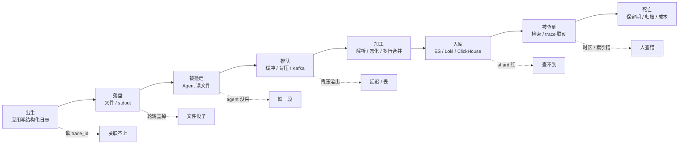
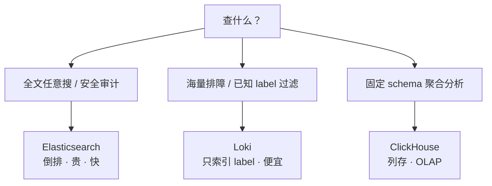
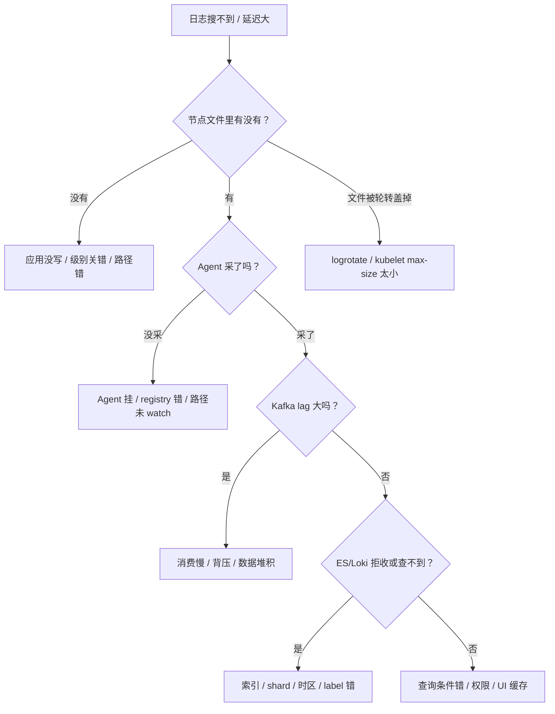

# 04 日志链路与采集

> 大家好，欢迎来到这次分享。开讲之前，先带大家回到一个很多值班同学都经历过的现场：
> 活动峰值后客服说「最近十分钟 ERROR 搜不到」；月初账单出来老板问「日志存储为什么占了 30% 云成本」；排查 P0 时同一次请求的日志散在十几条里对不上。
> 这一章讲完，你会知道日志不是「全采全存」，以及和 metrics/trace 怎么跳。
> **本章回答**：一条日志从应用写出到最终销毁，会经过哪些阶段、每段会怎么坏、怎么一眼定责。
> **不讲**：主机侧 `logrotate`/`journald`/`grep` 实操 → [01-23](../../01-基础底座/23-日志运维/)；K8s 日志落地与轮转接线 → [03-20](../../03-Kubernetes/20-日志管理/)；ES 本体运维 → [02-04](../../02-中间件与数据库/04-Elasticsearch/)；Kafka 本体 → [02-03](../../02-中间件与数据库/03-Kafka/)；trace_id 生成与传播 → [05](../05-链路追踪与OpenTelemetry/)；代码侧日志规范 → [05-02-05](../../05-开发能力/02-Python/05-logging日志规范/)。这些都有专门的章节，本章只在用到时点到为止。

**标记**：🎯重点 · 🔥难点 · ⭐常考 · 🔧实操

**怎么听这场分享**：咱们先看一条日志从进程到可查的链路；后面按采集、解析、索引、成本、与 metrics/trace 关联展开；作战节拆「日志洪水 / 查不到」。每一节讲完都会提示对应练习题。

---

## 一、一张图：一条日志的一生

> 🎯 **一句话**：日志不是「写出来就能搜到」，它要经历出生、落盘、被捡走、排队、加工、入库、被查、死亡八个阶段；出了问题，先问「它死在哪个阶段」。

大家想想：查不到关键错误行，是不是平台坏了？很多人会答「换 ELK」——**不一定**。先问死在哪一段：没落盘？agent 卡住？解析丢字段？索引没建？口诀：**「先结构化，再谈平台」**。



**读图**：

- 主线就是一条日志的时间线：写出来 → 落到节点 → 被 agent 读走 → 先进缓冲/队列 → 被解析加工 → 写入后端 → 被查 → 按保留期销毁。
- 六个虚线箭头是「常见问题卡点」，每节讲一段；最终作战节把这些卡点画成决策树。
- 排障顺序永远**从落盘往右查**，不要从 Kibana 搜不到直接跳到「扩 ES」。


练习题 Q1。链路有了——采集 Agent。

---

## 二、出生：应用写出结构化日志

> 🎯 **一句话**：面试问日志规范，先答「JSON 结构化 + 必带字段」，再谈级别和采样。

### 为什么必须是结构化日志（JSON）⭐🔥

很多老项目还在写这种行：

```text
2024-01-17 10:30:15 [WARN] payment timeout, order=ORD-001, user=U123, duration=820
```

运维拿到要 `grep` 再 `cut` 再 `sed`，字段一变正则就崩。生产级的做法是直接写 JSON：

```json
{"timestamp":"2024-01-17T10:30:15Z","level":"WARN","service":"payment","instance":"pay-7d9f4","trace_id":"abc123","msg":"payment timeout","order_id":"ORD-001","user_id":"U123","duration_ms":820}
```

> 💡 **打个比方**：裸文本日志像手写的快递单，地址电话混在一起，分拣员得靠人工读；JSON 结构化像打印的电子面单，每个字段有固定格子，机器直接扫码分拣。

为什么要求结构化而不是正则切裸文本：

- **字段边界可靠**：裸文本里 `duration=820` 和 `duration_ms=820` 是两种写法，正则容易切错；JSON key 固定。
- **类型可推断**：`duration_ms` 是整数，ES/ClickHouse 可以建 numeric 索引做聚合；正则切出来全是字符串。
- **嵌套可扩展**：HTTP header、标签可以嵌对象，不用改解析规则。
- **多语言统一**：Go/Java/Python 各自的日志模板只要输出同一套 JSON schema，下游解析不变。

> 📝 **面试**：问「日志规范怎么定」，第一句答「**输出 JSON 结构化日志，包含统一字段**」，再补字段列表和级别约定。

### 必带字段 🔧

不管业务字段怎么变，下面六个字段是底线：

```text
timestamp    ← ISO-8601 / RFC3339，带时区； Prefer UTC，避免夏令时坑
level        ← DEBUG / INFO / WARN / ERROR / FATAL，全链路统一
service      ← 服务名，如 hall / payment / match
instance     ← 主机或 Pod 名，定位到哪台机器
trace_id     ← 同一次请求在网关 / 逻辑服 / DB 日志里的共同钥匙
msg          ← 人类可读的一句话，不要只堆 JSON
```

> ⚠️ **别混**：`timestamp` 要用**单一时间字段**，不要同时存在 `time`、`@timestamp`、`ts` 三个字段；`level` 要用统一枚举，不要有的服务写 `warning`、有的写 `WARN`、有的写 `warn`。字段命名不一致 = 查询时建三个 filter。

`trace_id` 从哪来？请求进入网关时由中间件生成，透传到下游 HTTP header / gRPC metadata / MQ 消息里；代码侧实现见 [05-02-05](../../05-开发能力/02-Python/05-logging日志规范/)。链路追踪完整原理 → [05](../05-链路追踪与OpenTelemetry/)。

### 日志级别与采样 🎯⭐

级别不是越细越好，全链路统一五档：

```text
DEBUG  ← 开发排障，生产通常采样或关闭
INFO   ← 正常流程，如登录成功、订单创建
WARN   ← 可恢复异常，如超时重试、降级
ERROR  ← 需要人看的错误，如 DB 连不上
FATAL  ← 进程要退出，如启动配置缺失
```

线上常见错误：

- **DEBUG 没关**：一条请求打 50 行 DEBUG，活动高峰直接翻倍写入量。
- **级别乱用**：把业务异常写成 ERROR，告警炸；把需要人看的错误写成 WARN，漏掉。
- **只按级别过滤，没按采样过滤**：ERROR 全保留，DEBUG 按 1% 采样，才能在排障时有上下文又不炸成本。

> 📝 **面试**：问「日志量太大怎么降本」，别只答「删旧日志」，要答「**级别过滤 + DEBUG 采样 + 热温冷分层 + 保留期**」组合拳。


练习题 Q2、Q3。采集外，结构化与多行。

---

## 三、落盘：文件与轮转

> 🎯 **一句话**：日志必须先落到节点文件，才会被 agent 读到；节点盘满了，后面所有链路都白搭。

### K8s 下 stdout 为什么优于写文件 ⭐🔥

容器里业务有两种写法：

```text
① stdout / stderr  ← 推荐：containerd/kubelet 统一接管落盘和轮转
② /app/logs/xx.log ← 仅老应用或需要本地审计时
```

> 💡 **打个比方**：stdout 像把垃圾袋统一放到楼道门口，物业（kubelet）每天定时收走；写文件像把垃圾藏在自己床底下，满了你自己不清理，整个房间（Pod）都臭。

stdout 优于写文件的原因：

- **轮转由 kubelet 统一做**，不需要在容器里跑 logrotate 或自己切分。
- **采集器只读挂载节点目录**，不需要给业务容器挂日志目录，权限隔离更干净。
- **容器销毁后文件生命周期清晰**：`kubectl logs --previous` 读的是节点上还没被轮转清的上一轮文件。
- **镜像无状态**：日志不落在容器可写层，避免 overlay 膨胀。

> ⚠️ **别混**：stdout 不是「直接发到 ES」，它仍然要先落到**节点文件**，再由 agent 读走。有人以为容器日志是 kubelet 直接推给后端，这是错的。

### Docker 与 containerd 落盘路径 🔧

值班常要确认文件在不在：

```bash
# Docker 运行时
ls -lh /var/lib/docker/containers/<container-id>/<container-id>-json.log
# ← Docker 把 stdout 按 json-file 驱动写成一行一个 JSON：{"log":"...","stream":"stdout","time":"..."}

# containerd 运行时（K8s 默认）
ls -lh /var/log/pods/{ns}_<pod-name>_<pod-uid>/<container-name>/0.log
# ← 实体文件；/var/log/containers/*.log 是软链

# 节点上软链入口
ls -l /var/log/containers/*battle*
# ← 指向 /var/log/pods/... 的符号链接
```

> 🔍 **现场**：`kubectl logs` 空时，先上节点 `ls /var/log/pods/...` 看实体文件还在不在；可能是 kubelet 已经轮转清掉，或者路径被采集器挂载方式搞错。

### 轮转（logrotate / kubelet）🎯⭐

主机侧 `logrotate` 和 K8s `kubelet` 都管轮转，但对象不同：

```text
主机 /var/log/xxx.log      → logrotate 按 /etc/logrotate.d/* 配置切
K8s /var/log/pods/.../0.log → kubelet --container-log-max-size / --container-log-max-files
```

> ⚠️ **别混**：节点 DiskPressure 时，去改 `/etc/logrotate.d` 救不了容器日志——那是主机日志；要改 kubelet 参数或 truncate 容器日志文件。详细止血动作见 [01-23](../../01-基础底座/23-日志运维/) 和 [03-20](../../03-Kubernetes/20-日志管理/)。

轮转的核心风险是**文件被改名或清空后，进程还握着旧 inode 写**——`df` 不降、`du` 变小。治本靠 **USR1 / reopen** 或 `copytruncate`。


口诀：**「先结构化，再谈平台」**。练习题 Q4。结构外，索引与保留。

---

## 四、被捡走：采集 agent

> 🎯 **一句话**：采集器是「按偏移读节点文件」的邮差；选型看资源、隔离、顺序性三个维度。

### 常见 agent：Fluent Bit / Filebeat / Vector / ilogtail ⭐

| Agent | 定位 | 资源占用 | 游戏集群常见角色 |
|-------|------|----------|------------------|
| **Fluent Bit** | C 写，轻量 | 小于 5Mi | DaemonSet 默认，读节点文件 |
| **Filebeat** | Go，Elastic 官方 | 20–50Mi | 纯 ES 生态时常用 |
| **Vector** | Rust，可编程 | 10–30Mi | 需要复杂 transform 时 |
| **ilogtail** | 阿里云 | 节点级 | 阿里云 ACK 默认 |

> ⚠️ **别混**：Fluent **Bit** 是采集器，Fluent **d** 是聚合器（Ruby， heavier），两者常组合：Bit 在节点采集 → Kafka/Fluentd 聚合 → ES/Loki。

### DaemonSet vs Sidecar 🔥

K8s 里两种部署方式：

```text
DaemonSet：每节点一个 agent，读 /var/log/containers / /var/log/pods
Sidecar：   每个 Pod 里塞一个 agent，只读该 Pod 的日志
```

取舍：

- **资源**：DaemonSet 一份；Sidecar 1000 Pod = 1000 份 agent，资源直接 ×1000。
- **隔离**：Sidecar 只影响本 Pod；DaemonSet 挂了影响整节点。
- **顺序性**：同一个 Pod 内多容器写日志，Sidecar 按 Pod 内顺序消费更可控；DaemonSet 从节点全局读，靠文件名区分来源。
- **配置复杂度**：DaemonSet 统一配置；Sidecar 每个工作负载单独配。

> 📝 **面试**：问「DaemonSet 还是 Sidecar」，答「**默认 DaemonSet；只有改不了 stdout 的老应用或需要强隔离/顺序性时才 Sidecar**」。

### 采集关键：offset / registry

agent 靠 **offset（偏移量）** 知道读到哪。Filebeat 把它存在 registry 文件里：

```bash
cat /var/lib/filebeat/registry/filebeat/log.json | head
# ← inode + 设备号 + offset；删了 = 重启从头读 = 旧日志再进一遍 ES
```

Fluent Bit 类似，把位置存在 sqlite 或本地文件。千万别随手删。


⭐ 成本与采样。练习题 Q5～Q7。成本外，关联跳转。

---

## 五、排队：缓冲与背压

> 🎯 **一句话**：采集到存储之间加 Kafka，不是为了炫技，是为了削峰、解耦、可回放；背压来了谁先丢，取决于你的策略配置。

### 为什么需要缓冲层（Kafka）⭐🔥

直接 `Fluent Bit → ES` 在小规模能跑，但游戏活动高峰时：

```text
高峰写入 100MB/s  ──► ES 只能吃 30MB/s  ──► ES rejected / 采集器内存爆 / 丢日志
```

中间加 **Kafka** 后：

```text
应用 ──► Agent ──► Kafka ──► Consumer ──► ES/Loki
              ↑  写快没关系，broker 能扛  ↑  按 ES 能力消费
```

Kafka 三个作用：

- **削峰**：高峰时 broker 暂存，消费端按自己速度拉，避免 ES 被压垮。
- **解耦**：ES/Loki 临时维护时，agent 继续写 Kafka；后端恢复后 consumer 继续消费，不丢。
- **回放**：某个索引写坏了，可以重放 Kafka topic 到另一个集群。

> 💡 **打个比方**：Kafka 像收发室的货架。快递员（agent）按高峰速度把包裹扔上去；分拣员（consumer）慢慢拣。没有货架，快递员要么把门口堵死，要么把包裹扔了。

### 背压（backpressure）与谁丢 🔧

背压就是「下游吃得慢，上游被顶住」。日志链路里常见三段：

```text
应用写文件 → Agent 读文件 → Agent 内存/disk queue → Kafka → Consumer → ES
```

每段都有 queue，满了之后的策略不同：

```text
① 应用写文件：磁盘满 → 应用写日志阻塞或丢日志（看语言/框架）
② Agent 内部 queue：内存 queue 满 → 转 disk buffer；disk buffer 也满 → 按策略丢或阻塞 tail
③ Kafka：broker 磁盘/网络到上限 → producer 阻塞或抛异常
④ Consumer 慢：Kafka lag 涨；lag 涨到保留期外 → 消息被 Kafka 删除
⑤ ES：bulk rejected → consumer 重试或丢到死信队列
```

> 📝 **面试**：问「日志延迟大/丢了怎么查」，按这五个阶段一层层排除，别一上来就说 ES 慢。

at-least-once  vs at-most-once：

```text
at-least-once：宁可重复，不能丢失  ← 游戏支付日志常用
at-most-once：  宁可丢，不能重复    ← 可采样 DEBUG 可用
```

背压时**谁先丢**取决于配置：

- 配置「tail 阻塞」：应用写日志变慢，业务线程可能卡住。
- 配置「丢弃旧数据」：agent 直接丢，日志丢失但业务不卡。
- 配置「写满后 rotate」：新日志覆盖旧日志，丢的是最早那批。

> ⚠️ **别混**：背压不是故障，是**正常保护机制**。没有背压的链路要么把 ES 打死，要么把业务内存撑爆。关键是把「丢」的策略显式配出来，而不是默认丢。


练习题 Q8、Q9。跳转外——安全与脱敏。

---

## 六、加工：解析、切分、富化与多行合并

> 🎯 **一句话**：采集不是原样搬运；JSON 直接入库，裸文本要解析，堆栈要合并，K8s 元数据要富化。

### 解析与切分

如果业务已经输出 JSON，agent 直接 `parser json` 即可：

```text
{"timestamp":"...","level":"ERROR","msg":"db timeout","duration_ms":3000}
         ↓ 解析
timestamp=2024-01-17T10:30:15Z
level=ERROR
msg="db timeout"
duration_ms=3000  ← 数字，可聚合
```

如果还是裸文本，用 **grok / regex** 切：

```text
%{TIMESTAMP_ISO8601:timestamp} %{LOGLEVEL:level} %{GREEDYDATA:msg}
```

> 📝 **面试**：问「裸文本怎么解析」，答「优先推动业务改 JSON；过渡时用 grok，但维护成本高，字段一变就要改」。

### 富化（Enrichment）

agent 从运行环境补充字段，让查询有维度可下钻：

```text
k8s_namespace=game
k8s_pod_name=battle-abc-7d9f4
k8s_container_name=battle
node_name=node-05
cluster=prod-asia
```

这些字段对定责很有用：「只有 node-05 的 payment Pod 在报 ERROR」→ 先怀疑这台节点。

### 多行与堆栈合并 🔥⭐

Java 异常堆栈默认长这样：

```text
2024-01-17 10:30:15 ERROR com.game.payment.PayService - payment failed
java.lang.RuntimeException: db timeout
    at com.game.payment.PayService.charge(PayService.java:42)
    at com.game.payment.PayController.pay(PayController.java:28)
    at java.base/java.lang.reflect.Method.invoke(Method.java:580)
```

文件是按行读的，所以默认会切成 5 条日志。Kibana 里搜 `PayService` 只看到第一行，后面堆栈散开，定位很费劲。

合并方法：用**行首 pattern** 判断新日志开始，其余行归属到上一条：

```text
multiline.pattern: '^\d{4}-\d{2}-\d{2} \d{2}:\d{2}:\d{2}'
multiline.negate: true
multiline.match: after
```

含义：匹配时间戳的行是新事件；不匹配的行（堆栈）追加到前一个事件。

> 📝 **面试**：问「堆栈为什么碎成几十条」，答「**文件按行读，agent 默认把每行当独立事件；要配 multiline，用行首 pattern 把后续行合并到首行**」。

> ⚠️ **别混**：multiline 应该在**采集端**做，不要在业务端把堆栈打成一行 JSON 字符串——那会破坏可读性，也增加序列化开销。也可以在应用日志框架里用 `%replace` 折行符，但首选 agent 侧合并。


练习题 Q10。安全外，作战定责。

---

## 七、入库：ES / Loki / ClickHouse

> 🎯 **一句话**：存储选型只问两件事——查什么、付得起多少。

### Elasticsearch（ES）⭐🔥

ES 是**全文倒排索引**：把日志正文的每个词都建索引，所以任意关键词搜索很快。

为什么 ES 贵：

- **全文索引**：每来一条日志都要分词、建倒排，CPU/内存高。
- **分片（shard）**：索引被拆成多个 shard 分布到节点；shard 越多，集群开销越大。
- **副本（replica）**：每个 shard 至少 1 副本保证高可用，存储 ×2 起步。
- **JVM 堆**：每个 ES 节点要分配堆内存，大集群成本显著。

降本三板斧：

```text
① 按天切索引：payment-2024.01.17、payment-2024.01.18
② ILM（Index Lifecycle Management）：热 → 温 → 冷 → 删除
③ hot-warm：热节点 SSD 查最近 7 天；温节点 HDD 查 30 天；冷节点归档
```

> 💡 **打个比方**：ES 像把每本书的每个词都做一张目录卡；查得快，但做卡片很费人费纸。Loki 像只给书脊贴标签，正文放到仓库里，要找时先按标签缩小范围再翻书。

### Loki

Loki **只索引 label，不索引正文**：

```text
label：service=payment, level=ERROR, namespace=game
正文：压缩成 chunk 存对象存储，查的时候按 label 过滤后再 grep
```

适用面：

- **海量排障日志**：写入成本比 ES 低一个数量级。
- **Grafana 一把查**：和 Prometheus label 模型一致，Metrics → Logs → Traces 联动顺。
- **查询模式是「先 label 收窄，再 grep 正文」**：`{app="payment"} |= "traceId=abc123"`。

取舍：

- 不要高基数 label：`trace_id`、`user_id`、`order_id` 不能当 label，否则索引本身会炸。
- 复杂全文（如支付报文对账）不如 ES 好用。

> ⚠️ **别混**：Loki 不是「免费的 ES」。它在「大海量 + 已知维度过滤」时便宜；但如果你经常做「全文任意搜」且不懂 label 设计，查询会慢到超时。

### ClickHouse

ClickHouse 是列式 OLAP 数据库，适合：

- **结构化日志的深度分析**：如按 service/level 分组计数、P99 延迟聚合。
- **固定 schema 的审计日志**：字段明确，不经常变。
- **成本敏感但查询维度固定**：列式压缩率高，聚合查询极快。

不适合：全文模糊搜索、字段 schema 频繁变化。

### 选型对照 📝

| 场景 | 推荐 | 原因 |
|------|------|------|
| 业务排障，海量，已知 service/level | Loki | label 索引 + 对象存储，成本低 |
| 复杂全文、安全审计、对账 | ES | 倒排任意搜 |
| 固定 schema 聚合分析 | ClickHouse | 列存压缩 + OLAP 聚合 |
| 游戏集群默认 | Kafka 双写：热搜 ES + 长期 Loki/OSS | 热搜用 ES，海量用 Loki |

### 收束：存储选型只看「查什么、付得起多少」🎯⭐

到这里，入库选型的全部零件齐了。面试问「日志存在哪」，按这张清单答：



**读图**：三条分支互斥——全文任意搜只能 ES；海量已知维度过滤优先 Loki；固定 schema 的聚合统计用 ClickHouse。游戏集群常见折中：Kafka 双写，热搜走 ES，长期海量走 Loki/OSS。

> ⚠️ **别混**：Loki 不是「更便宜的 ES」；ClickHouse 也不是「更快的 ES」。三者查询模型不同，换引擎前先确认查询模式是否匹配。

> 📝 **面试**：背选型按「**查什么 → 付得起多少 → 是否固定 schema**」三步：全文任意搜且预算够 → ES；海量排障预算紧 → Loki；固定维度聚合 → ClickHouse。


练习题 Q11～Q13。现在回开头那个现场。

---

## 八、被查到：检索与 trace 联动

> 🎯 **一句话**：查到日志不是终点，沿着 trace_id 跳到调用链，才能把「什么错了」变成「慢在哪 / 谁的责任」。

### 检索语法

```text
ES KQL：     service:payment AND level:ERROR AND trace_id:abc123
Loki LogQL： {service="payment",level="ERROR"} |= "trace_id=abc123"
```

查询优化原则：

- 先收窄**时间范围**和**label/filter**；不要全时间范围 `grep`。
- ES 中 `trace_id` 应该是 **keyword** 类型，不要 text 分词。
- Loki 中 `trace_id` 放正文，用 `|=` 或 `| json` 后过滤，不要当 label。

### 与 trace 联动 ⭐

同一次请求的三支柱关联：

```text
Metrics：gateway_p99_latency{trace_id=abc123} 尖刺  ← 发现案发时间
Logs：   {service="gateway"} |= "trace_id=abc123"     ← 证人证词
Trace：  Jaeger/Tempo 搜 abc123                     ← 监控录像回放
```

> 💡 **打个比方**：没有 trace_id 的日志像一群证人在说「大概十点多有人喊了一声」；有 trace_id 就像监控录像，能精确回放同一次请求经过了哪些服务、每段耗时多少。


练习题 Q14。

---

## 九、死亡：保留期、冷热分层与成本

> 🎯 **一句话**：日志不是存得越久越好；保留期由合规要求倒推，冷热分层由查询频率决定。

### 保留期（retention）⭐

常见合规要求：

```text
一般业务日志：30 天
支付/审计日志：90 天 ~ 180 天，甚至 1~3 年
安全合规：按等保 / SOC2 / 游戏监管要求
```

超过保留期应该**删除或归档到对象存储**，而不是一直留在热集群。

### 热 - 温 - 冷 / hot-warm 🔥

```text
hot  （SSD，全索引）  ← 最近 7 天，随时查
warm （HDD，只读）     ← 7~30 天，偶尔查
cold （对象存储）      ← 30 天以上，合规归档，查一次很慢
```

在 ES 里通过 **ILM** 自动迁移；在 Loki 里通过 `compactor` 和对象存储生命周期管理。

### 成本估算 💡

算一笔账：

```text
假设：
  每秒 10 万行
  每行平均 500 字节
  副本数 2（1 主 1 副）
  保留 30 天

日写入量 = 100,000 × 500B × 86,400s = 4.32 TB/天
30 天原始 = 4.32 × 2(副本) × 30 ≈ 259 TB
```

加上 ES 索引膨胀（通常原始 ×1.5~2）、Loki 压缩（通常原始 ×0.3~0.5），实际成本差异巨大。

降本手段排序：

```text
1. 调级别：生产关 DEBUG 或 1% 采样
2. 去噪音：删掉无意义的 health check 日志
3. 缩保留期：30 天改 14 天
4. 热温冷分层：老数据迁对象存储
5. 换引擎：全量 Loki / ClickHouse 替代 ES
```

> 📝 **面试**：问「ES 太贵怎么降本」，按上面五条答，不要一上来就说「上 ClickHouse」——先把 DEBUG 关掉可能省 50%。

---

## 十、作战：日志丢了 / 延迟大 / 账单爆炸

> 🎯 **一句话**：日志故障定责只有一句话——「文件里有没有」决定向左还是向右查。

### 分段定责决策树 🔧⭐



**读图**：第一刀永远是「节点文件里有没有」。没有 → 往应用/落盘查；有 → 往 agent/队列/存储查。这个方向反了会白忙。

### 现象 · 先做 · 别做

| 现象 | 先做 | 别做 |
|------|------|------|
| 日志丢了 | 节点 `tail` 确认文件里有没有 | 先扩 ES |
| 延迟大 | 看 Kafka consumer lag / agent queue | 重启 agent 清 registry |
| 堆栈碎 | 检查 multiline pattern | 让开发把堆栈打一行 |
| 账单爆炸 | 先看 DEBUG 采样和保留期 | 直接删索引 |
| ES rejected | 看 bulk queue / 热节点磁盘 | 加副本 |
| 查不到最近 | 确认时区 / index pattern / label | 说 ES 慢 |

### 60 秒剧本 🔧

```text
① 0–10s  确认现象：缺日志 / 延迟 / 成本高？先问时间范围和 service。
② 10–30s 上节点：kubectl logs 或 ssh 节点 tail 文件，确认「文件里有没有」。
③ 30–45s 查链路：agent 状态 → Kafka lag → ES/Loki 拒收/索引/时区。
④ 45–60s 定责 + 止血：是应用没写、轮转盖掉、agent 没采、队列溢出还是入库失败。
```

---

**回到开头那个现场**：要么洪水把磁盘打满，要么关键行查不到。正确剧本是：结构化采集 → 分级保留 → trace_id 贯穿 → 敏感字段脱敏。现在再看「全量永久留存」，你知道该怎么纠正了。

## 十一、收口

> 🎯 **一句话**：把本章的图、命令、面试口径和易错点收成一张速查板，值班时直接按图索骥。

```bash
# K8s 节点确认容器日志实体文件
ls -lh /var/log/pods/{ns}_{pod}_<uid>/<container>/
# ← 0.log 是当前轮；0.log.20240117-103015 是已轮转的旧文件

# Docker json-file 路径
ls -lh /var/lib/docker/containers/{id}/{id}-json.log
# ← {"log":"...","stream":"stdout","time":"2024-01-17T10:30:15Z"} 每行一个 JSON

# 看 kubelet 轮转参数
ps aux | grep kubelet | grep -E 'container-log-max-size|container-log-max-files'
# ← --container-log-max-size=100Mi --container-log-max-files=5，超 100Mi 会切，保留 5 个历史

# Filebeat registry（别乱删）
cat /var/lib/filebeat/registry/filebeat/log.json | head
# ← {"source":"/var/log/pods/.../0.log","offset":1234567,"inode":1234567} 删了会重读

# Kafka consumer lag
kafka-consumer-groups.sh --bootstrap-server localhost:9092 --describe --group log-consumer
# ← CURRENT-OFFSET / LOG-END-OFFSET / LAG，LAG 涨 = 消费跟不上

# ES 集群健康
GET _cluster/health
# ← status:green 正常；yellow 有副本分片没分配；red 有主分片丢失

# ES 索引按天列表
GET _cat/indices/payment-*?v&s=index
# ← payment-2024.01.17 yellow open 120 60 5 1 50gb ...  ← 看 status 和 store.size

# Loki label 基数检查
logcli series '{service="payment"}'
# ← 返回的 series 数量爆炸 = label 基数过高，会拖慢查询
```

### 面试锚点

遮住右列自问自答，卡壳的行回去重读对应小节——能讲出来才算会：

| 问 | 30 秒答 |
|----|---------|
| 为什么要求 JSON 结构化？ | 字段边界可靠、类型可推断、多语言统一；裸文本正则维护成本高。 |
| 日志必带哪些字段？ | timestamp、level、service、instance、trace_id、msg。 |
| K8s 为什么 stdout 优于写文件？ | kubelet 统一轮转；agent 只读挂载节点目录；镜像无状态。 |
| DaemonSet vs Sidecar 怎么选？ | 默认 DaemonSet；改不了 stdout 或需强隔离/顺序性才 Sidecar。 |
| 为什么采集到存储之间要 Kafka？ | 削峰、解耦、可回放；避免 ES 被高峰打满。 |
| 背压时谁先丢？ | 看策略：agent queue 满可能阻塞 tail 或丢旧数据；Kafka lag 超 retention 也会丢。 |
| 多行堆栈为什么碎？ | 文件按行读，默认每行独立；需配 multiline 行首 pattern 合并。 |
| ES 为什么贵？ | 全文倒排索引 + shard + replica；JVM 堆开销大。 |
| 怎么降 ES 成本？ | 关 DEBUG/采样 → 缩保留期 → 按天切索引 + ILM + hot-warm → 长期迁 Loki/OSS。 |
| Loki 和 ES 怎么选？ | 海量排障、已知 label 过滤 → Loki；复杂全文任意搜 → ES。 |
| 保留期怎么定？ | 合规倒推：一般 30 天，支付审计 90~180 天，超期归档或删除。 |
| 日志丢了怎么查？ | 节点文件 → agent → Kafka lag → ES/Loki 拒收/索引/时区，分段定责。 |

### 易错一句话对照

- 裸文本用正则切也能用 → 维护成本高、字段一变就崩，优先 JSON。
- `timestamp` 用本地时间 → 用 UTC / RFC3339，避免夏令时和时区对不上。
- `trace_id` 当 Loki label → 高基数会炸索引；放正文用 `|=` 过滤。
- stdout 直接发到 ES → stdout 先落节点文件，再由 agent 读走。
- DaemonSet 挂了日志就没了 → 文件还在节点上继续涨，恢复后 offset 续读。
- 背压是故障 → 背压是保护机制；要显式配置丢策略，不是默认丢。
- multiline 在业务端做 → 首选 agent 侧合并，不要把堆栈压成一行字符串。
- Loki 是免费 ES → Loki 只适合「label 先收窄再 grep」；任意全文搜会超时。
- 日志存越久越好 → 保留期由合规倒推，超期应归档或删除。
- ES rejected 就加节点 → 先看是 shard 不均、热节点磁盘满还是 bulk queue 小。
- 日志量估算只算原始大小 → 要乘副本数、索引膨胀/压缩系数、保留天数。
- 丢日志先扩 ES → 先确认文件里有没有，方向反了白忙。

### 数字墙

> JSON 必带 **6** 个字段 · 日志级别通常 **5** 档 · stdout 经 **containerd** / **Docker json-file** 落节点 · DaemonSet 资源 = Sidecar 的 **1/N** · Kafka 用于削峰/解耦/回放 · ES 副本至少 **×2** 存储 · 常见保留期 **30 / 90 / 180** 天 · 热层通常 **7** 天 · 示例日写入 **4.32 TB**（10万行/s × 500B） · Loki 正文压缩后约原始 **0.3~0.5** · ES 索引膨胀约原始 **1.5~2** · multiline 用**行首 pattern** 合并

---

## 合上书

学到这里，先别急着翻下一章。合上书，试试下面这几件事——卡住就回对应小节：

- [ ] **默画一节的图**：出生 → 落盘 → 被捡走 → 排队 → 加工 → 入库 → 被查到 → 死亡；六个卡点对应哪些故障。
- [ ] **口述出生**：为什么 JSON 结构化、必带 6 字段、级别怎么定、trace_id 从哪来。
- [ ] **口述落盘**：K8s stdout 为什么优于写文件、Docker json-file 与 containerd 落盘路径一句、轮转风险点。
- [ ] **口述被捡走**：Fluent Bit / Filebeat / Vector / ilogtail 差异、DaemonSet vs Sidecar 取舍、offset/registry 为什么不能删。
- [ ] **口述排队**：Kafka 为什么加、削峰/解耦/回放、背压时谁先丢、at-least-once vs at-most-once。
- [ ] **口述加工**：JSON 直接解析、裸文本 grok、富化字段、多行 Java 堆栈为什么碎及怎么合并。
- [ ] **口述入库**：ES 全文倒排为什么贵、按天切索引 + ILM + hot-warm、Loki 只索引 label 的取舍、ClickHouse 适合什么。
- [ ] **口述被查到**：ES KQL vs Loki LogQL、trace_id 怎么把 Metrics/Logs/Traces 串起来。
- [ ] **口述死亡**：保留期 30/90/180 天、热温冷分层、成本估算算例、降本五招排序。
- [ ] **口述作战**：日志丢了的分段定责树——文件有没有 → agent 采没采 → Kafka lag → ES/Loki 拒收/索引/时区。
- [ ] **边界**：主机侧 logrotate/journald → [01-23](../../01-基础底座/23-日志运维/)；K8s 落地与轮转 → [03-20](../../03-Kubernetes/20-日志管理/)；ES 本体 → [02-04](../../02-中间件与数据库/04-Elasticsearch/)；Kafka 本体 → [02-03](../../02-中间件与数据库/03-Kafka/)；trace → [05](../05-链路追踪与OpenTelemetry/)；代码规范 → [05-02-05](../../05-开发能力/02-Python/05-logging日志规范/)。
