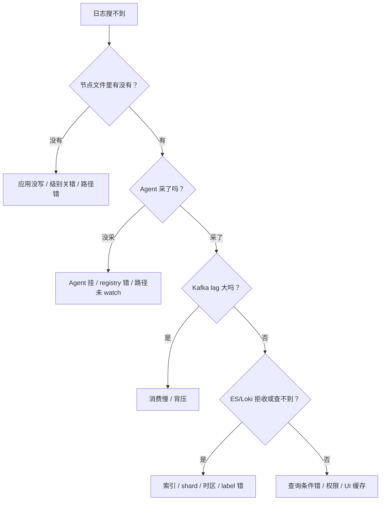

# 04｜日志链路与采集 · 练习题

先合上知识点，对着 **一节的主图** 把「一条日志的一生」口述一遍（出生 → 落盘 → 被捡走 → 排队 → 加工 → 入库 → 被查到 → 死亡），再来做题。

| 标记 | 含义 |
|------|------|
| **核心** | 不懂整章就没建立起来 |
| **必会** | 值班和面试都要能讲 |
| **常用** | 线上会反复碰到 |
| **常考** | 白板和追问的高频口径 |

## 本题目录

- [Q1 为什么要求 JSON 结构化日志](#q1)
- [Q2 日志必带哪些字段](#q2)
- [Q3 K8s 下 stdout 为什么优于写文件](#q3)
- [Q4 DaemonSet vs Sidecar 怎么选](#q4)
- [Q5 为什么要加 Kafka，背压时谁先丢](#q5)
- [Q6 多行 Java 堆栈为什么被切成几十条](#q6)
- [Q7 ES 为什么贵，怎么降本](#q7)
- [Q8 Loki「只索引 label」是什么取舍](#q8)
- [Q9 ClickHouse 适合什么日志场景](#q9)
- [Q10 保留期怎么定，成本怎么估算](#q10)
- [Q11 日志丢了怎么查](#q11)
- [Q12 日志延迟大 / 账单爆炸怎么定责](#q12)
- [Q13 trace_id 怎么把日志和 Metrics/Trace 串起来](#q13)
- [Q14 一条日志从写到查全链路综合题](#q14)
- [合上书](#合上书)

---

## Q1

**★★★★★｜面试官：你们为什么要求业务输出 JSON 结构化日志，而不是用正则从裸文本里切字段？**

**覆盖**：核心 · 必会 · 常考 ｜ **对应**：知识点 [二、出生：应用写出结构化日志](知识点.md)

### 场景

新项目上线，运维发现老系统日志格式是 `2024-01-17 WARN payment timeout order=ORD-001`。有开发说「正则也能切，干嘛非要改代码打 JSON」，另一个运维说「JSON 太长浪费带宽」。

### 完整解答

> 🎯 **一句话**：裸文本正则切字段是「手写快递单」，JSON 是「打印电子面单」——字段边界可靠、类型可推断、下游解析统一。

结构化日志相比裸文本的四个优势：

1. **字段边界可靠**：裸文本里 `duration=820` 和 `duration_ms=820` 两种写法，正则一变就崩；JSON key 固定。
2. **类型可推断**：`duration_ms` 是整数，ES/ClickHouse 可以建 numeric 索引做聚合；正则切出来全是字符串。
3. **嵌套可扩展**：HTTP header、标签可以嵌对象，不用改解析规则。
4. **多语言统一**：Go/Java/Python 只要输出同一套 JSON schema，下游解析不变。

```text
裸文本：2024-01-17 10:30:15 [WARN] payment timeout, order=ORD-001, duration=820
JSON：  {"timestamp":"2024-01-17T10:30:15Z","level":"WARN","service":"payment","order_id":"ORD-001","duration_ms":820}
```

> ⚠️ **别混**：「JSON 长」不是拒绝理由——真正传输大的是**无意义的 DEBUG 和堆栈**，不是 JSON 那几个括号；而且现代日志系统传输层都有压缩。

> 📝 **面试**：问日志规范，先答「**输出 JSON 结构化日志，包含统一字段**」，再补字段和级别。

### 再追问

**过渡期间裸文本怎么解析？**——用 grok / regex，但要告诉开发这是**临时方案**；字段一变就要同步改解析规则。**不要**把 grok 当长期架构。

**JSON 里能不能把 trace_id 当 key？**——**不要**。字段名固定为 `trace_id`，值变化；不要把 `abc123` 这类动态值做成 key，否则 schema 爆炸。

---

## Q2

**★★★★★｜面试官：一条日志最少要带哪些字段？为什么？**

**覆盖**：核心 · 必会 · 常考 ｜ **对应**：知识点 [二、出生：应用写出结构化日志](知识点.md)

### 场景

客服要查一次充值失败的完整链路，发现网关日志有 trace_id，支付日志没有；DB 日志有 user_id 但没 service 名，根本对不上。

### 完整解答

> 🎯 **一句话**：日志必带六个字段：timestamp、level、service、instance、trace_id、msg。

| 字段 | 作用 | 面试常错 |
|------|------|----------|
| timestamp | 排序、告警、关联 Metrics/Trace | 用本地时间，夏令时/时区对不上 |
| level | 过滤噪音、告警分级 | 服务 A 写 WARN、服务 B 写 warning |
| service | 定位哪个服务 | 直接用 Pod 名当 service |
| instance | 定位到哪台机器 / Pod | 全局只有 hostname，K8s 下找不到 Pod |
| trace_id | 同一次请求跨服务串联 | 只在网关打，下游没透传 |
| msg | 人类可读一句话 | 整行全是 key=value，没有 summary |

> 📝 **面试**：背这六个字段按「**时间 · 级别 · 来源 · 实例 · 关联 · 内容**」分组，不容易漏。

> ⚠️ **别混**：`timestamp` 要用 UTC / RFC3339 带时区；`level` 要全链路统一枚举（DEBUG/INFO/WARN/ERROR/FATAL），不要有的服务写 `warning`、有的写 `WARN`。

### 再追问

**trace_id 从哪来？**——请求进入网关时由中间件生成，通过 HTTP header / gRPC metadata / MQ 透传下去。链路追踪原理 → [05](../05-链路追踪与OpenTelemetry/)，代码侧实现 → [05-02-05](../../05-开发能力/02-Python/05-logging日志规范/)。

**instance 写什么？**——物理机写 hostname，K8s 写 Pod name（不是容器名，一个 Pod 可能多容器）。**不要**只写 IP，Pod 重建 IP 会变。

---

## Q3

**★★★★☆｜面试官：容器里业务把日志写到 /app/logs/server.log，你们为什么要让它改成 stdout？**

**覆盖**：必会 · 常用 · 常考 ｜ **对应**：知识点 [三、落盘：文件与轮转](知识点.md)

### 场景

Java 战斗服坚持写 `/app/logs/game.log`，说「文件好 tail」。结果 Pod DiskPressure 被驱逐，有人去改 `/etc/logrotate.d` 发现没用，因为那是主机日志路径。

### 完整解答

> 🎯 **一句话**：stdout 让 kubelet 统一接管落盘和轮转；写文件要自己处理轮转，还容易把 overlay 撑满。

K8s 下 stdout 优于写文件的原因：

1. **轮转由 kubelet 统一做**：参数 `--container-log-max-size` / `--container-log-max-files`；不用在容器里跑 logrotate。
2. **采集器只读挂载节点目录**：不需要给业务容器挂日志目录，权限更干净。
3. **容器销毁后文件生命周期清晰**：`kubectl logs --previous` 读的是节点上还没被轮转清的上一轮文件。
4. **镜像无状态**：日志不落容器可写层，避免 overlay 膨胀。

> ⚠️ **别混**：stdout **不是**直接发到 ES，它仍然先落到**节点文件**，再由 agent 读走。路径是：`容器 stdout → containerd → /var/log/pods/.../0.log → agent → ES/Loki`。

### 再追问

**什么情况下允许写文件？**——老应用改不动 stdout、或者有合规要求必须本地留一份审计日志。这时用 **Sidecar** 或 hostPath 采集，并做好本地轮转。**不要**每个 Pod 默认写文件。

**容器日志实体文件在哪？**——containerd 在 `/var/log/pods/<ns>_<pod>_<uid>/<container>/0.log`；Docker json-file 在 `/var/lib/docker/containers/<id>/<id>-json.log`。`kubectl logs` 读的就是这些文件。

---

## Q4

**★★★★☆｜面试官：K8s 里日志采集用 DaemonSet 还是 Sidecar？**

**覆盖**：核心 · 必会 · 常考 ｜ **对应**：知识点 [四、被捡走：采集 agent](知识点.md)

### 场景

架构评审会上，有人主张每个游戏 Pod 都塞一个 Fluent Bit Sidecar，说「隔离好」；也有人坚持 DaemonSet，说「资源省」。

### 完整解答

> 🎯 **一句话**：默认 DaemonSet；只有改不了 stdout 或需要强隔离/顺序性时才 Sidecar。

| 维度 | DaemonSet | Sidecar |
|------|-----------|---------|
| 资源 | 每节点一份 | 每 Pod 50–100Mi，1000 Pod = 1000 份 |
| 故障面 | 一节点暂时不采 | 只影响本 Pod |
| 隔离 | 共享节点资源 | 与业务同 cgroup，OOM 可能互相影响 |
| 顺序性 | 节点全局读 | Pod 内顺序更可控 |
| 配置 | 统一 | 按工作负载单独配 |

> 📝 **面试**：先说结论「默认 DaemonSet」，再说三个例外：老应用写文件、多容器强顺序要求、安全/网络隔离要求。

> ⚠️ **别混**：DaemonSet 挂了不代表日志丢了——文件还在节点上继续涨，agent 恢复后按 offset 续读。Sidecar 资源占用是主要否决点。

### 再追问

**Fluent Bit 和 Fluentd 怎么分工？**——**Fluent Bit** 是 C 写的轻量采集器，放 DaemonSet；**Fluentd** 是 Ruby 写的聚合器， heavier，放 Kafka 后做聚合/富化。常见链：`Bit(DS) → Kafka → Fluentd → ES/Loki`。

**offset/registry 为什么不能删？**——删了 agent 重启后从头读，旧日志会再进一遍 ES，造成重复或索引翻倍。**不要**把 registry 当缓存清掉。

---

## Q5

**★★★★★｜面试官：采集到 ES 之间为什么要加 Kafka？背压来了日志会丢吗？**

**覆盖**：核心 · 必会 · 常考 ｜ **对应**：知识点 [五、排队：缓冲与背压](知识点.md)

### 场景

活动峰值写入 100MB/s，ES 只能吃 30MB/s。没有 Kafka 时，ES 开始 rejected，采集器内存爆，部分日志丢失。老板说「加 Kafka 太复杂，直接扩 ES」。

### 完整解答

> 🎯 **一句话**：Kafka 负责削峰、解耦、回放；背压时谁先丢，取决于你的策略配置。

Kafka 三个作用：

1. **削峰**：高峰时 broker 暂存，consumer 按 ES 能力消费，避免 ES 被压垮。
2. **解耦**：ES 维护时 agent 继续写 Kafka，后端恢复后继续消费，不丢。
3. **回放**：某个索引写坏了，可以重放 topic 到另一个集群。

背压链路：

```text
应用写文件 → Agent 读文件 → Agent queue → Kafka → Consumer → ES
```

每段 queue 满了之后的行为不同：

- Agent queue 满：可能阻塞 tail（业务写日志变慢）或丢弃旧数据（丢日志）。
- Kafka lag 大：消息超过 retention 会被删除。
- ES rejected：consumer 重试或写入死信队列。

> ⚠️ **别混**：背压不是故障，是**保护机制**。没有背压的链路要么把 ES 打死，要么把业务内存撑爆。

> 📝 **面试**：问「日志丢了怎么办」，按五段查：应用写没写 → 文件有没有 → agent 采没采 → Kafka lag → ES 拒收。

### 再追问

**at-least-once 和 at-most-once 怎么选？**——支付/审计日志用 **at-least-once**（宁可重复不能丢）；可采样 DEBUG 用 **at-most-once**（宁可丢不能重复）。

**直接扩 ES 行吗？**——峰值是短时的，为峰值扩 ES 成本高且利用率低；Kafka 是更经济的缓冲层。**不要**把「加机器」当第一选择。

---

## Q6

**★★★★☆｜面试官：Java 异常堆栈在 Kibana 里被切成几十条，怎么合并？**

**覆盖**：必会 · 常用 · 常考 ｜ **对应**：知识点 [六、加工：解析、切分、富化与多行合并](知识点.md)

### 场景

支付服报错，Kibana 里搜 `PayService` 只看到第一行 `ERROR ...`，后面的 `at com.game...` 全散开。客服无法判断根因。

### 完整解答

> 🎯 **一句话**：文件按行读，agent 默认把每行当独立事件；要配 multiline，用行首 pattern 把堆栈后续行合并到首行。

典型 Java 堆栈：

```text
2024-01-17 10:30:15 ERROR com.game.payment.PayService - payment failed
java.lang.RuntimeException: db timeout
    at com.game.payment.PayService.charge(PayService.java:42)
    at java.base/java.lang.reflect.Method.invoke(Method.java:580)
```

配置示例：

```text
multiline.pattern: '^\d{4}-\d{2}-\d{2} \d{2}:\d{2}:\d{2}'
multiline.negate: true
multiline.match: after
```

含义：匹配时间戳的行是新事件开头；不匹配的行追加到前一个事件。

> ⚠️ **别混**：multiline 首选在 **agent 侧** 做，不要在业务端把堆栈打成一行 JSON 字符串——破坏可读性还增加序列化开销。

### 再追问

**如果日志不是以时间戳开头呢？**——用你业务里能标识新日志开头的 pattern，比如 `^\[` 或 `^\w+\s+\[`。**不要**用固定行数合并，因为堆栈行数不固定。

**合并后还是搜不到怎么办？**——确认 `trace_id` 在首行；如果 trace_id 只打在第一行但首行 pattern 没匹配到，合并会失败。

---

## Q7

**★★★★★｜面试官：ES 为什么那么贵？你们怎么降日志存储成本？**

**覆盖**：核心 · 必会 · 常考 ｜ **对应**：知识点 [七、入库：ES / Loki / ClickHouse](知识点.md)

### 场景

月初云账单出来，ES 存储占了可观测性成本的 60%。老板说「要么删索引，要么换 ClickHouse」。

### 完整解答

> 🎯 **一句话**：ES 贵是因为全文倒排索引 + shard + replica；降本先调级别和采样，再分层，最后才考虑换引擎。

ES 为什么贵：

1. **全文倒排索引**：每条日志每个词都要建索引，CPU/内存高。
2. **分片（shard）**：索引拆成 shard 分布到节点，shard 越多集群开销越大。
3. **副本（replica）**：至少 1 副本，存储 ×2 起步。
4. **JVM 堆**：每个 ES 节点都要堆内存。

降本五招（按优先级）：

```text
1. 调级别：生产关 DEBUG 或 1% 采样
2. 去噪音：删掉无意义的 health check 日志
3. 缩保留期：30 天改 14 天
4. 按天切索引 + ILM + hot-warm：热 SSD 7 天，温 HDD 30 天，冷归档
5. 换引擎：全量 Loki / ClickHouse 替代 ES
```

> 📝 **面试**：不要一上来就说「上 ClickHouse」——先把 DEBUG 关掉可能省 50%。

### 再追问

**hot-warm 怎么配？**——ES 用 ILM：hot 节点 SSD 写新索引 + 可搜索；warm 节点 HDD 只读老索引；cold 节点对象存储归档。**不要**把所有索引都放热节点。

**按天切索引有什么好处？**——删除旧数据只要删整个索引，比按 doc 删快得多；而且不同天的索引可以走不同 ILM 阶段。

---

## Q8

**★★★★☆｜面试官：Loki 说「只索引 label 不索引正文」，这带来什么取舍？**

**覆盖**：核心 · 必会 · 常考 ｜ **对应**：知识点 [七、入库：ES / Loki / ClickHouse](知识点.md)

### 场景

团队想把所有日志迁到 Loki 省钱。策划要求「像 Kibana 一样全文搜任意玩家 ID」。上线后发现查询超时。

### 完整解答

> 🎯 **一句话**：Loki 只给书脊贴标签，正文放仓库；按标签找书再翻页很快，但无标签地翻全书会超时。

Loki 的取舍：

- **索引内容**：只索引 label（如 service、level、namespace）。
- **正文处理**：压缩成 chunk 存对象存储，查询时按 label 过滤后再 grep。
- **成本**：写入和存储远低于 ES，适合海量排障日志。
- **查询模式**：必须先 `label 收窄`，再 `|= "traceId=abc123"`；不能随意全库 grep。

> ⚠️ **别混**：`trace_id`、`user_id`、`order_id` **不能当 label**，否则高基数会把 Loki 索引撑爆。应放正文，用 `|=` 过滤。

> 📝 **面试**：Loki 不是免费 ES；适合「已知维度过滤 + 海量日志」，复杂全文任意搜仍用 ES。

### 再追问

**游戏集群常见怎么搭？**——Kafka 双写：热搜/审计走 ES，海量排障走 Loki/OSS。

**Grafana 查 Loki 的正确姿势？**——先 `{app="hall",level="ERROR"}` 收窄，再 `|= "trace_id=abc123"`。**不要**一上来就 `{ } |= "abc123"` 全库扫。

---

## Q9

**★★★☆☆｜面试官：ClickHouse 适合存什么日志？什么时候不适合？**

**覆盖**：必会 · 常考 ｜ **对应**：知识点 [七、入库：ES / Loki / ClickHouse](知识点.md)

### 场景

安全团队想把所有 Nginx access 日志放 ClickHouse 做聚合分析；又想用它做错误日志全文检索。

### 完整解答

> 🎯 **一句话**：ClickHouse 适合字段固定、需要聚合分析的结构化日志；不适合全文模糊搜索和 schema 频繁变化。

适合：

- Nginx access 日志的 PV/UV/延迟分位统计。
- 审计日志按用户/接口/结果分组计数。
- 固定 schema 的大规模日志 OLAP。

不适合：

- 错误日志全文搜索（没有倒排索引，like 扫描慢）。
- 字段经常变的业务日志（宽表变更成本高）。
- 需要快速按关键词定位单条记录的场景（用 ES/Loki）。

> 📝 **面试**：ClickHouse 是「列存 OLAP 数据库」，和 ES「全文搜索引擎」定位不同。

### 再追问

**ClickHouse 比 ES 省吗？**——写入和压缩率通常更好，但查询类型不同，**不要**简单替换。如果查询主要是固定维度聚合，ClickHouse 更省；如果任意关键词搜索，还是 ES/Loki。

**日志存 ClickHouse 要注意什么？**——按时间分区（PARTITION BY toYYYYMMDD(timestamp)），设置合理 TTL 删除过期分区。**不要**把所有日志塞进一张不分区的大表。

---

## Q10

**★★★★☆｜面试官：日志保留期怎么定？给我算一笔存储成本账。**

**覆盖**：必会 · 常用 ｜ **对应**：知识点 [九、死亡：保留期、冷热分层与成本](知识点.md)

### 场景

合规要求支付日志保留 180 天，但全量日志都按 180 天存在热 ES，成本爆炸。老板问「能不能统一 7 天」。

### 完整解答

> 🎯 **一句话**：保留期由合规倒推，冷热分层由查询频率决定；不同日志不能一刀切。

常见保留期：

```text
一般业务日志：30 天
支付/审计日志：90 ~ 180 天，甚至 1~3 年
安全合规：按等保 / SOC2 / 游戏监管要求
```

算例：

```text
10 万行/s，每行 500 字节，副本 2，保留 30 天：
日原始 = 100,000 × 500B × 86,400 ≈ 4.32 TB
30 天原始 = 4.32 × 2 × 30 ≈ 259 TB
```

加上 ES 索引膨胀 1.5~2 倍或 Loki 压缩 0.3~0.5 倍，实际成本差异巨大。

> 📝 **面试**：保留期要分层：热层 7 天 SSD 可查，温层 30 天 HDD，冷层 180 天对象存储归档。

### 再追问

**老板说统一 7 天行不行？**——不行。合规日志必须满足监管；非合规日志可以短。**不要**用成本压力违反合规。

**怎么在不删的情况下省钱？**——归档到对象存储（S3/OSS），需要时再临时加载。**不要**为了省钱把热索引直接 delete_by_query，那比删索引贵得多。

---

## Q11

**★★★★★｜面试官：客服说最近十分钟日志搜不到，你怎么查？**

**覆盖**：核心 · 必会 · 常用 ｜ **对应**：知识点 [十、作战：日志丢了 / 延迟大 / 账单爆炸](知识点.md)

### 场景

客服要查某玩家刚才的充值失败日志，Kibana 最近十分钟没有。群里已经有人喊「ES 又慢了」，也有人准备重启 Filebeat。

### 完整解答

> 🎯 **一句话**：日志丢了只问一个分水岭——「节点文件里有没有」。



现场命令：

```bash
# 1. 节点上确认文件里有没有
ls /var/log/pods/{ns}_{pod}_<uid>/<container>/
tail -n 100 /var/log/pods/.../0.log | grep "ERROR"

# 2. agent 状态
systemctl status filebeat
# 或 kubectl -n logging logs ds/fluent-bit --tail=20

# 3. Kafka lag
kafka-consumer-groups.sh --bootstrap-server localhost:9092 --describe --group log-consumer
# ← LAG 涨 = 消费跟不上

# 4. ES 拒收
GET _cluster/health
GET _cat/indices?v&s=index
```

> ⚠️ **别混**：缺日志 ≠ ES 慢。先证明「文件里有、哪一段丢了」。

### 再追问

**文件里没有怎么办？**——回应用查：日志级别是不是被调成 ERROR 以上把 WARN 丢了？是不是打到别的路径？是不是 Pod 重启后没初始化 logger？

**能直接重启 Filebeat 吗？**——**不要**。先检查 registry 和 queue；贸然重启可能导致重复消费或 offset 错乱。

---

## Q12

**★★★★☆｜面试官：日志延迟大和账单爆炸，分别怎么定责和止血？**

**覆盖**：必会 · 常用 ｜ **对应**：知识点 [十、作战：日志丢了 / 延迟大 / 账单爆炸](知识点.md)

### 场景

活动开服后两个告警同时来：监控显示日志延迟 5 分钟；云监控显示日志存储日增长 50%。有人要删索引，有人要扩 Kafka。

### 完整解答

> 🎯 **一句话**：延迟大看「采→队→存」三段队列；账单爆炸看「级别·保留期·分层·引擎」。

**延迟大定责**：

```text
Agent queue 满   → tail 阻塞或丢数据；看 queue 指标
Kafka lag 涨     → consumer 跟不上；加 consumer 或优化 ES 写入
ES rejected      → bulk queue 满；看热节点磁盘和分片
时区/索引错      → 人能查到但以为查不到
```

**账单爆炸止血**：

```text
① 先关 DEBUG 或 1% 采样
② 去噪音（health check / 心跳日志）
③ 缩保留期（合规外）
④ 热温冷分层 + ILM
⑤ 长期海量日志迁 Loki
```

> 📝 **面试**：延迟和成本问题别混在一起答；延迟是吞吐/队列问题，成本是生命周期/采样问题。

### 再追问

**日志延迟 5 分钟，业务能不能接受？**——取决于用途。排障日志延迟 5 分钟可能可以接受；安全审计/实时告警日志延迟 5 分钟不行。**不要**一刀切定 SLO。

**删索引止血行不行？**——只能删非关键老索引，且要先 snapshot 或确认合规允许。**不要**为了止血把当天业务日志删了，那等于破坏现场。

---

## Q13

**★★★★☆｜trace_id 怎么把 Logs 和 Metrics/Traces 串起来？**

**覆盖**：必会 · 常考 ｜ **对应**：知识点 [七、被查到：怎么搜](知识点.md) · [01 三件套联动](../01-可观测性三件套与选型/)

### 场景

登录失败，Metrics 有尖刺，Jaeger 有 trace，但 ELK 里搜不到同一请求。

### 完整解答

> 🎯 **一句话**：**网关统一生成 trace_id**，全链日志 JSON 固定字段输出，Metrics 用 exemplar 挂同一 ID。

```json
{"level":"ERROR","msg":"login failed","trace_id":"4bf92f3577b34da6a3ce929d0e0e4736","span_id":"00f067aa0ba902b7","service":"auth","user_id":"12345"}
```

跳转路径：

```text
Metrics P99 尖刺 → 点 exemplar → Jaeger 瀑布图
                → 复制 trace_id → Kibana/Loki: trace_id:"xxx"
```

> ⚠️ **别混**：各服务各自生成 trace_id 拼不起来——入口必须统一。

> 📝 **面试**：「三件套联动靠同一个 trace_id；日志是兜底，exemplar 是捷径。」

### 再追问

**Loki 和 ES 搜 trace_id 写法？**——Loki：`{service="auth"} |= "trace_id=xxx"`；ES KQL：`trace_id:"xxx"`。**不要**用全文分词搜 hex 字符串时不加引号。

---

## Q14

**★★★★★｜综合：玩家报障说「日志丢了」，从应用写到查到，全链路定责。**

**覆盖**：核心 · 必会 ｜ **对应**：知识点 [一、一张图：一条日志的一生](知识点.md)

### 场景

战斗服 crash，开发说「我打了日志但平台查不到」。

### 完整解答

> 🎯 **一句话**：沿「出生 → 落盘 → 被捡走 → 排队 → 加工 → 入库 → 被查到」逐段查；**节点本地文件还在不在**是分界点。

```text
① 出生：应用真的写了吗？级别够吗？（crash 前 flush 了吗）
② 落盘：K8s stdout？节点 /var/log/pods 有没有
③ 被捡走：DaemonSet Agent 健康？offset 是否回退
④ 排队：Kafka lag 是否暴涨
⑤ 入库：ES rejected？索引名/日期是否错
⑥ 被查：时区、namespace、label 过滤是否错
```

> 📝 **面试**：「先 ssh/ kubectl logs 看节点有没有——有则采集链问题，无则应用没写或落盘失败。」

### 再追问

**Agent queue 满丢日志算谁的锅？**——运维要配背压告警和扩容；开发要避免 DEBUG 洪峰。**不要**无限制打 DEBUG 指望 Agent 全收。

---

## 合上书

对齐知识点「合上书」，逐条口述，卡住就回对应节：

- [ ] **默画一节的图**：出生 → 落盘 → 被捡走 → 排队 → 加工 → 入库 → 被查到 → 死亡；六个卡点对应哪些故障。
- [ ] **口述出生**：为什么 JSON 结构化、必带 6 字段、级别怎么定、trace_id 从哪来。（Q1 · Q2）
- [ ] **口述落盘**：K8s stdout 为什么优于写文件、Docker json-file 与 containerd 落盘路径一句、轮转风险点。（Q3）
- [ ] **口述被捡走**：Fluent Bit / Filebeat / Vector / ilogtail 差异、DaemonSet vs Sidecar 取舍、offset/registry 为什么不能删。（Q4）
- [ ] **口述排队**：Kafka 为什么加、削峰/解耦/回放、背压时谁先丢、at-least-once vs at-most-once。（Q5）
- [ ] **口述加工**：JSON 直接解析、裸文本 grok、富化字段、多行 Java 堆栈为什么碎及怎么合并。（Q6）
- [ ] **口述入库**：ES 全文倒排为什么贵、按天切索引 + ILM + hot-warm、Loki 只索引 label 的取舍、ClickHouse 适合什么。（Q7 · Q8 · Q9）
- [ ] **口述被查到**：ES KQL vs Loki LogQL、trace_id 怎么把 Metrics/Logs/Traces 串起来。
- [ ] **口述死亡**：保留期 30/90/180 天、热温冷分层、成本估算算例、降本五招排序。（Q10）
- [ ] **口述 trace_id 联动**：网关生成、JSON 固定字段、exemplar 跳转、Loki/ES 查询。（Q13）
- [ ] **口述日志全链路定责**：出生→落盘→采集→队列→入库→查询；节点文件是分界。（Q14）
- [ ] **边界**：主机侧 logrotate/journald → [01-23](../../01-基础底座/23-日志运维/)；K8s 落地与轮转 → [03-20](../../03-Kubernetes/20-日志管理/)；ES 本体 → [02-04](../../02-中间件与数据库/04-Elasticsearch/)；Kafka 本体 → [02-03](../../02-中间件与数据库/03-Kafka/)；trace → [05](../05-链路追踪与OpenTelemetry/)；代码规范 → [05-02-05](../../05-开发能力/02-Python/05-logging日志规范/)。
