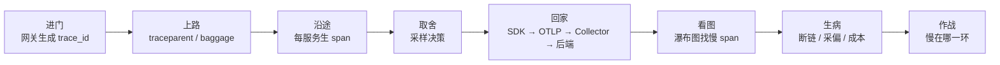
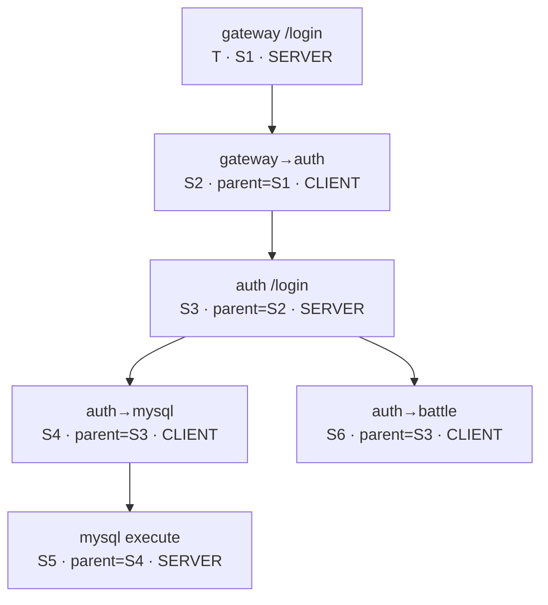
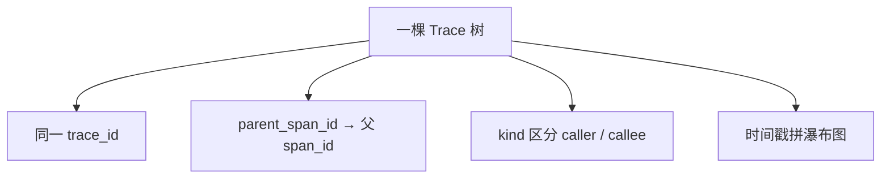
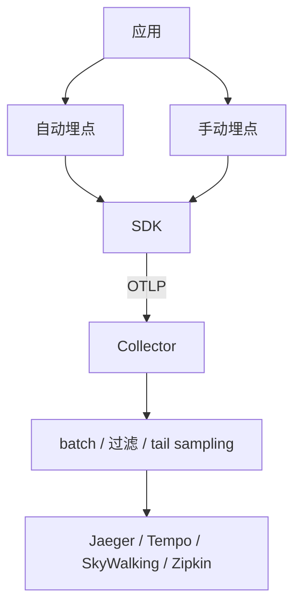
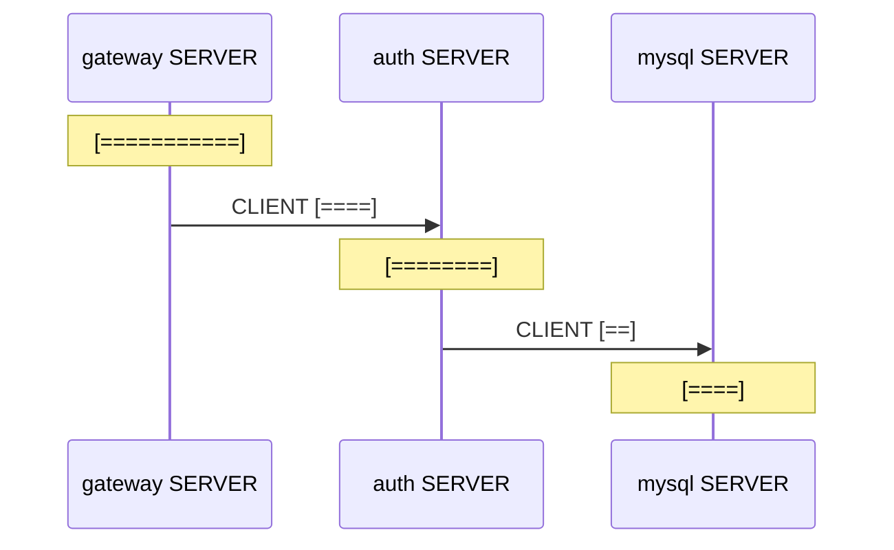
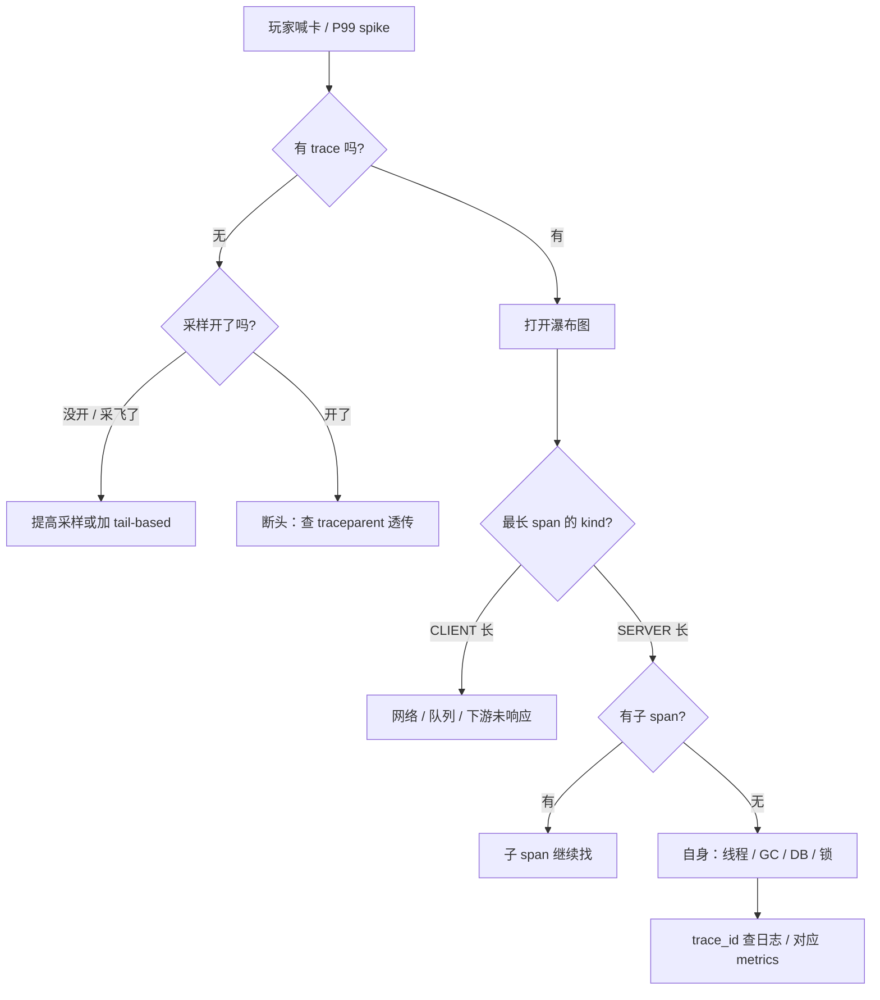

# 链路追踪与 OpenTelemetry

> 登录加载条卡住、技能偶发飙到 800ms——大盘只看见网关 P99 涨，有人喊「重启认证服」，有人喊「全量打开采样」，有人喊「先 grep 全服务日志」。三句都不对。
> **本章回答**：一条跨服务请求从进门到回家，trace / span / context 怎么一路跟下来，采样、看图、定责怎么落地。
> **不讲**：PromQL → [02](../02-Prometheus与PromQL/)；日志采集与 `trace_id` 打日志细节 → [04](../04-日志链路与采集/)；SLO / 错误预算 → [06](../06-SLI-SLO与错误预算/)；Mesh 无侵入埋点 → [03-24](../../03-Kubernetes/24-ServiceMesh-Istio与Envoy/)；eBPF → [03-25](../../03-Kubernetes/25-eBPF与Cilium/)；三件套全局选型 → [01](../01-可观测性三件套与选型/)。

**标记**：🎯重点 · 🔥难点 · ⭐常考 · 🔧实操
---

## 一、一张图：一个跨服务请求的一生

> 🎯 **一句话**：trace 是请求的户口本，span 是每一跳的行程单，context 传播是跨服务接力传户口本。



- 📖 **读图**
  - 🛤️ 主线「进门 → 上路 → 沿途 → 取舍 → 回家 → 看图」；断了任何一棒，树就拼不全
  - 🔪 排障第一刀：有没有完整 trace；第二刀：瀑布图最长条是 CLIENT 还是 SERVER（Q1、Q13、Q14）

本节对应练习题 Q1、Q14。主线有了——先从进门生成 `trace_id`。

---

## 二、进门：trace 诞生与 trace_id 生成

> 🎯 **一句话**：trace 在第一个埋点服务里诞生；`trace_id` 全局唯一、全链共享，是后面所有 span 的户口本号。

- 🪪 **Trace** = 一次完整请求的跟踪记录
- 🧾 **Span** = 其中某个工作单元（一次调用 / 一段本地计算）
- 🌲 所有 span 靠同一个 `trace_id` 串成一棵树

- 🔑 **SpanContext**（上下文核心字段）
  - `trace_id`：16 字节（hex **32** 字符）——整棵树都一样
  - `span_id`：8 字节（hex **16** 字符）——每个 span 不同
  - `parent_span_id`：指向父 span 的 `span_id`；根为空
  - `trace_flags`：最低位采样标志，`01` 被采、`00` 未采

```text
trace_id : 4bf92f3577b34da6a3ce929d0e0e4736   # ← 32 hex，全链唯一
span_id  : 00f067aa0ba902b7                   # ← 16 hex，每跳不同
```

- 🎲 **谁生成**：入口服务（通常网关）随机 16 字节；OpenTelemetry 默认如此
- 🚫 **不能**从 IP / 时间戳直接派生——高并发易撞号，也易被猜

#### ❓ 为什么不是每服务各造一个 trace_id？

- ❌ **各造各的**：后端收到十几个「户口本号」，拼不出一棵树——正是新人白板常画的错图
- ✅ **入口造一次、全链复用**：下游只换自己的 `span_id`，`trace_id` 原样接力
- 🎮 **登录例子**：网关 SERVER 根 span → 调认证 CLIENT span → 认证 SERVER span；三个 `span_id`，**一个** `trace_id`

> ⚠️ **别混**：`trace_id` 整棵树只有一个；`span_id` 每跳一个。说「每个 span 有自己的 trace_id」直接减分。`span_id` 不是端口、不是线程 ID。

> 📝 **面试**：trace = 一次完整请求；span = 其中一跳；同 `trace_id` + `parent_span_id` 拼树。⭐（练习题 Q1、Q2）

口诀：**一棵树一个 trace_id，每跳一个 span_id**。户口本有了，该上路传接力棒。

---

## 三、上路：context 怎么跨进程传播 🎯⭐🔥

> 🎯 **一句话**：跨服务时把 `trace_id` / `span_id` / 采样位放进 HTTP 头，接收方 extract 后接着画 child span。

### 📮 W3C Trace Context：`traceparent` 🎯⭐

目前最通用的传播标准是 **W3C Trace Context**，HTTP 头叫 `traceparent`：

```text
traceparent: 00-4bf92f3577b34da6a3ce929d0e0e4736-00f067aa0ba902b7-01
             ↑  ↑                                ↑                 ↑
           版本  trace_id (32 hex)               span_id (16)     flags
```

- 📦 **四段**：版本 `00` · `trace_id` · 当前 `span_id` · `trace_flags`（`01`/`00`）
- 🔄 **inject / extract**：出站写 header（inject），入站解析后建 child（extract）
- 🤖 **instrumentation（埋点库）** 通常自动做这两步；业务只在关键段手动 `Start` span

```text
客户端 outbound:  traceparent: 00-<trace_id>-<当前span_id>-01
服务端 inbound:   解析 → 新 span_id → 处理 → 调下游再写 00-<同一trace_id>-<新span_id>-01
```

### 🧳 baggage：业务便签

`traceparent` 只传 ID 和采样位；`user_id` / `room_id` / `client_version` 靠 **`baggage`** 头：

```text
baggage: user_id=12345,room_id=abc,client_version=2.1.0
```

- ✅ 键值要小；❌ 不塞 JWT / 完整订单 JSON；❌ 不传 token、密码（头明文）
- 🔗 中间任一服务没透传，后面就断

> ⚠️ **别混**：`traceparent` = 请求身份证 + 采样位；`baggage` = 业务便签。别把大对象塞 baggage，也别把 trace 当业务状态库。

### 🧵 异步与消息队列为什么断链 🔥

> 💡 **打个比方**：`traceparent` 像接力棒——直道（同步 HTTP）自然往前传；弯道（线程池 / Kafka）必须**主动交棒**，否则下一棒不知道自己在哪条跑道。

#### ❓ 为什么同步 HTTP 能跟、进线程池/Kafka 就断？

- ❌ 「中间件不支持 tracing」——**不全对**；核心是 **context 不会自动跟着走**
- ✅ **显式传递**：
  - HTTP / RPC：header 透传 `traceparent` + `baggage`
  - 线程池 / 协程：把 `SpanContext` 当 task 参数，或复用 Context
  - 消息队列：写入 `record headers` / properties
- 🕵️ **常见断链**：网关起异步池没交棒；生产者没写 Kafka header；消费者多线程没复制 OTel Context
- 📡 **载体不同、原则相同**：gRPC 用 metadata，Kafka 用 headers，私有 TCP 在帧头留字段——都是把 `trace_id` / `span_id` / flags / baggage 带到对端

> 📝 **面试**：先答 W3C `traceparent` 四段 + inject/extract；再补「异步和 MQ 最易断链，必须显式传 context」。⭐（练习题 Q3、Q4、Q5）

传过去了，span 怎么拼树。

---

## 四、沿途：span 怎么拼成一棵树 🎯⭐🔥

> 🎯 **一句话**：span 靠「同 `trace_id` + parent 指针」拼树；parent 指向谁，谁就是上一跳。

### 👀 span 里有什么 ⭐

- `name`：如 `GET /login`
- `kind`：`SERVER` / `CLIENT` / `PRODUCER` / `CONSUMER` / `INTERNAL`
- `start_time` / `end_time`、`attributes`、`events`、`status`（`OK` / `ERROR` / `UNSET`）

- 🔪 **kind 定责口诀**（面试必考）
  - **SERVER**：本服务处理耗时
  - **CLIENT**：从发出到收到响应的端到端时间
  - CLIENT 长而 SERVER 短 → **网络 / 队列**；SERVER 长 → **服务自身**

### 🌳 树怎么拼



- 📖 **读图**
  - 根是网关 SERVER；调认证产生 CLIENT `S2`；认证 SERVER `S3` 挂在 `S2` 下——全员 `trace_id=T`
  - CLIENT 与对应 SERVER 之间的时间差 ≈ 网络 + 队列；别把这段当成业务代码慢

#### ❓ 为什么 CLIENT 长不等于下游处理慢？

- 🎭 **小剧场**：瀑布图上 `gateway→auth` 一条 1s，有人立刻扩容 auth——错。
- ✅ **拆开看**：CLIENT = 发出到响应回来；SERVER = 对端真正干活
- 📉 CLIENT 1s + SERVER 80ms → 矛头在 **网关到 auth 的路径 / LB 队列**，不是 auth 代码
- 📈 SERVER 长且无子 span → 才查本机线程 / GC / 锁 / 慢 SQL

### 收束：span 凭什么拼成一棵树 🎯⭐



- 📖 **读图**：`trace_id` 圈进同一户口本；`parent_span_id` 决定挂谁下面；`kind` + 时间戳决定你看到什么样的瀑布图。

> ⚠️ **别混**：`parent_span_id` 填的是父的 **`span_id`**，不是 `trace_id`。拼树**不保证时间顺序正确**——时钟没同步时，子 span 可能比父还早（见八节）。

> 📝 **面试**：同 `trace_id` + `parent_span_id`；根无 parent；CLIENT/SERVER 拆网络 vs 处理。⭐（练习题 Q6）

口诀：**CLIENT 长看网络，SERVER 长看服务**。树拼好了，谁进相册看采样。

---

## 五、取舍：采样策略怎么定 🎯⭐🔥

> 🎯 **一句话**：全量 trace 成本扛不住；采样决定门口谁进相册、谁只活在统计里。

### 为什么必须采样

网关每秒几十万请求，全量导出会打爆存储 / 网络 / Collector / 索引。Tracing **默认不采全量**，只在可接受成本内留「够看」的样本。

### head-based vs tail-based

| 维度 | head-based | tail-based |
|------|------------|------------|
| 时机 | 入口就定 | 整棵树结束后定 |
| 依据 | 入口特征 | 错误 / 延迟 / 路径 |
| 优点 | 简单、一致、开销小 | 能留住错误与慢请求 |
| 代价 | 入口不知后面会否出错 | 缓存整树，内存与延迟大 |
| 位置 | SDK / Agent | Collector / 后端 |
| flags | `01`/`00` 随 `traceparent` 传 | 常先全采到 Collector 再筛 |

- 🧱 **head-based（主流默认）**：网关按 1% 随机决定，flags 全链传播——要么整棵有，要么整棵无
- 🧲 **tail-based**：Collector 缓存，结束后按 `duration > 2s` / `status=ERROR` 保留

#### ❓ 为什么不能「网关采 10%、下游再采 10%」？

- 🔥 高频错答：「层层再采更省」——得到的是 **半截树**，比没树更误导
- ✅ **决策全链一致**：看见 `01` 就记、`00` 就跳；不允许各服务独立掷骰子
- 🧮 不是「10% × 10% = 1%」；独立随机 = 上游有 span、下游空白

- 🛟 **错误 / 慢请求不丢**
  - 错误偏置：错误 100% 留，成功按 1%
  - 慢请求偏置：超阈值 100% 留
  - head-based 里强制置 `01`，或 Collector 做 tail-based 兜底

- 🎚️ **采样率起点**（再按成本与查询体验调）
  - 入口网关：0.1%–1%（10 万 QPS × 0.1% ≈ 100 trace/s）
  - 登录 / 支付 / 匹配：可提到 5%–10%
  - 位置同步 / 心跳：0.01% 或只采异常
  - 错误 / 慢：尽量 100%

> ⚠️ **别混**：head-based 采样率**不能简单相乘**；必须全链一致。调采样还要看「点 exemplar 能不能点到」，不只看后端能不能存下。

> 📝 **面试**：默认 head-based 保一致；错误/慢用偏置或 tail-based；tail 能留错误但内存/延迟大。⭐（练习题 Q7、Q8）

取舍定了，数据怎么回家。

---

## 六、回家：SDK → OTLP → Collector → 后端

> 🎯 **一句话**：OpenTelemetry 是厂商中立的采集标准；一次埋点，后端 Jaeger / Tempo / SkyWalking 可换。

> 💡 **打个比方**：OTel 管「怎么采」，Jaeger/Tempo 管「怎么存怎么看」——换后端改 Collector exporter，不用重写业务埋点。

### OpenTelemetry 件套

1. **API**：创建 span、加属性的接口
2. **SDK**：采样、批处理、导出实现
3. **Instrumentation**：自动埋点（HTTP / DB / RPC）+ 手动关键段
4. **Collector**：receive → process → export
5. **OTLP**：SDK ↔ Collector 协议（gRPC 或 HTTP/protobuf）



- 📖 **读图**：业务只面对 API/自动埋点；换后端只动 Collector 出口，不改 SDK 调用点。

### Collector：Agent vs Gateway 🔥

- 🔧 **常用处理器**：`batch` · `memory_limiter` · `tail_sampling` · `resource`/`attributes`（统一 `env`/`cluster`）
- 🏠 **Agent**：每节点 / sidecar——近、抖少、可隔离；多一份资源
- 🚪 **Gateway**：集群级出口——鉴权 / 限流 / 路由方便；多一跳
- 🏭 生产常见：**SDK → 本节点 Agent → Gateway → 后端**
- 🔐 OTLP 出口走 mTLS / 内网；别把 `4317`/`4318` 裸露公网

- 🗄️ **后端一句**
  - **Jaeger**：功能全，可 all-in-one 或扩容
  - **Tempo**：按 `trace_id` 查，对象存储省钱，Grafana 联动好
  - **SkyWalking**：带 Agent 无侵入，生态较闭环
  - **Zipkin**：老前辈，简单

> ⚠️ **别混**：OpenTelemetry 是**标准**；Jaeger/Tempo 是**后端**。用了 OTel SDK，换后端不改业务代码。

> 🔍 **现场**：Collector 健康

```bash
curl -s http://otel-collector-gateway:13133/ | head
# {"status":{"...":"Server available"}}   # ← 不健康时 SDK 缓存或丢数据
```

> 📝 **面试**：OTel = API/SDK/自动埋点/Collector/OTLP；一次埋点，后端可换。（练习题 Q9、Q10）

回家了，看瀑布图与联动。

---

## 七、看图：瀑布图、火焰图与 metrics/logs 联动 🎯⭐

> 🎯 **一句话**：瀑布图是时间轴上的调用树，长条就是慢处；metrics→trace 靠 exemplar，日志→trace 靠 `trace_id`。

### 瀑布图怎么读



- 📖 **读图**
  - 每行一个 span，横条 = 耗时；缩进 = 父子
  - **关键路径** = 根到叶最长链；CLIENT↔SERVER 空白 = 网络 + 队列

- 🔥 **火焰图**：大量 trace 按 span 耗时聚合竖叠——看**共性瓶颈**；瀑布图看**单次请求**

### exemplar 与日志联动

```text
histogram_quantile(0.99, rate(login_latency_bucket[5m]))
# bucket 上挂 exemplar: trace_id=4bf92f3577b34da6a3ce929d0e0e4736
# 点击 → Jaeger/Tempo 打开整条登录链路
```

```text
{"level":"ERROR","msg":"login failed","trace_id":"4bf92f3577b34da6a3ce929d0e0e4736","span_id":"00f067aa0ba902b7","service":"auth"}
```

- 📎 **metrics**：exemplar 挂 `trace_id` → P99 尖刺一键跳瀑布图
- 📎 **logs**：结构化字段固定输出 `trace_id`/`span_id`；最好由网关生成并贯穿（细节 → [04](../04-日志链路与采集/)）

> 📝 **面试**：exemplar 从指标跳 trace；日志固定 `trace_id`；瀑布图定位慢 span 后再下钻日志。⭐（练习题 Q11）

看图之外，生病怎么认。

---

## 八、生病：断链、采样偏差与埋点成本 🔥

> 🎯 **一句话**：trace 不是开了就有用；断头、采偏、太贵是落地三大病。

### 断头 trace

- 某服务没接 SDK / 只接一半
- 异步 / MQ 没传 context（三节）
- 反代 / WAF 洗掉 `traceparent`
- 各服务采样决策不一致（五节）

断头树危害 > 没 trace：你会看见网关很慢、后面空白，误以为下游没事。

### 采样偏差 · 时钟 · 成本

- 🎲 head 随机可能漏「特定用户/房间」的慢请求；过低时错误分布也失真
- ⏰ 时钟偏差：auth 比网关快 200ms → 子 span `start_time` 比父还早——先查 NTP/chrony，别先骂代码
- 💸 **埋点成本**：CPU（建 span/序列化）· 网络 · 存储（标签基数）
  - 控制 attribute 数量/长度；别把结果集写进 span
  - 采样分环境：开发 100% / 测试 10% / 生产 1% 起；关键路径高于心跳
  - 自动埋点盖框架，手动只加业务关键段

#### ❓ 为什么 attribute 不能当日志用？

- ❌ 把 SQL 结果、响应体、堆栈全文塞进 span → 索引与带宽爆炸
- ✅ **低基数**可打：`http.method`、`service.name`、`cluster`、`env`、`error`
- ⚠️ **高基数**谨慎：`user_id`/`order_id` 只在单条调查里看，不当聚合维度
- 📌 trace attribute 为**筛选关联**；详细错误细节放日志（见 [04](../04-日志链路与采集/)）

> ⚠️ **别混**：自动埋点方便但语义偏框架；手动灵活但要控成本——不是越细越好。

> 📝 **面试**：全链透传、采样别采偏、控 attribute 与采样率。（练习题 Q12）

病认清了，作战定责。

---

## 九、作战：玩家喊卡，慢在哪一环 🔧

> 🎯 **一句话**：从 P99 尖刺出发，exemplar 打开 trace，瀑布图找长 span，再用 `trace_id` 查日志。

### 定责决策树



- 📖 **读图**：第一刀有没有 trace；有则看最长条 kind——CLIENT 长与 SERVER 长治的地方完全不同。

### 登录慢案例 · 现象表 · 60 秒剧本

玩家喊登录卡住，网关 P99 200ms → 1.2s：

1. Grafana `login_latency_bucket` 点 **exemplar** → `trace_id`
2. 瀑布图：`gateway→auth` CLIENT ≈ 1s，auth SERVER ≈ 80ms
3. 中间空白 → 网络 / LB 队列；auth CPU/GC 正常，MySQL CLIENT 仅 60ms
4. 矛头：网关到 auth 路径，不是业务代码

| 现象 | 先做 | 别做 |
|------|------|------|
| 大盘 P99 spike | 点 exemplar | 逐行 grep 全服务日志 |
| 某 span 长 | 看 kind + 子 span | 直接改代码加索引 |
| CLIENT 长、SERVER 短 | 查网络/队列/LB | 给服务扩容 |
| SERVER 长、无子 span | 查本机线程/GC/锁 | 让下游背锅 |
| 找不到某段 span | 查是否透传 `traceparent` | 以为下游没事 |
| trace 断断续续 | 采样一致 + 异步 context | 采样率直接拉 100% |

```text
① 0–10s   确认服务、时间、影响面；看 P99 / SLO 面板
② 10–30s  点 exemplar，拿到 trace_id
③ 30–45s  瀑布图最长 span，判 CLIENT / SERVER
④ 45–60s  用 trace_id 搜日志，落到错误行或慢 SQL
```

> 🔍 **现场**：没有 exemplar 时用日志反查

```bash
{service=~"auth|gateway|battle"} |= "trace_id=4bf92f3577b34da6a3ce929d0e0e4736"
# ← 按时间排序，同一请求在各服务的日志串起来
```

> 回到开头：P99 到 800ms、日志一地——正确剧本是 exemplar → 完整 trace → 比 CLIENT/SERVER → 带 `trace_id` 下钻。别让人「重启全部逻辑服」。（练习题 Q13、Q14）

---

## 十、收口

### 命令速查 🔧

```bash
# 是否透传 traceparent
curl -s -I http://gateway/health | grep -i traceparent
# 手动注入测下游
curl -s -H "traceparent: 00-4bf92f3577b34da6a3ce929d0e0e4736-00f067aa0ba902b7-01" http://auth/login
# Collector 健康
curl -s http://otel-collector:13133/
# 按 trace_id 查日志
{service=~"auth|gateway|battle"} |= "trace_id={id}"
```

### 面试锚点

| 问 | 30 秒答 |
|----|---------|
| trace 和 span？ | 一次请求 vs 其中一跳；同 `trace_id`，parent 拼树 |
| SpanContext？ | `trace_id`、`span_id`、`parent_span_id`、`trace_flags` |
| ID 长度？ | trace_id 32 hex；span_id 16 hex |
| `traceparent`？ | `00-<trace_id>-<span_id>-<flags>`，W3C |
| baggage？ | 业务便签；不是传 ID |
| 传播怎么做？ | inject/extract；异步/MQ 显式传 |
| OpenTelemetry？ | 中立标准：API/SDK/埋点/Collector/OTLP |
| OTLP？ | SDK↔Collector，gRPC 或 HTTP/protobuf |
| Collector？ | receive→process→export；Agent/Gateway |
| head vs tail？ | 入口定 vs 结束后定；tail 留错误成本高 |
| 采样率？ | 生产 0.1%–1% 起；错误/慢偏置 |
| exemplar？ | metrics bucket 挂 `trace_id`，P99→trace |
| CLIENT vs SERVER？ | CLIENT 长看网络/队列；SERVER 长看自身 |

### 易错一句话对照

- 每个 span 各有 trace_id → 同树共享一个 `trace_id`
- `traceparent` 传业务字段 → 只传 ID+采样；业务用 baggage
- JWT 塞 baggage → 明文，禁秘密
- 各服务独立随机采样 → 必须全链一致
- tail-based 不用缓存 → 要缓存整树
- OTel = Jaeger → OTel 标准，Jaeger 后端
- 自动埋点越细越好 → 控 attribute 与 span 数
- P99 先 grep 日志 → 先点 exemplar
- CLIENT 长 = 下游慢 → 先看对应 SERVER
- 异步自动继承 context → 必须显式传
- MQ 天然带 trace → 要写/读 header
- 必须 100% 采样才能排障 → 合理采样 + 偏置/tail 即可

### 数字墙

> trace_id **32** hex / span_id **16** hex · `traceparent` 版本 **00** · 采样 **01**/**00** · head 常见 **0.1%–1%** · Collector 健康口 **13133** · OTLP gRPC **4317** / HTTP **4318**

---

## 合上书

1. **口述主线**：进门 → 上路 → 沿途 → 取舍 → 回家 → 看图 → 生病 → 作战
2. **口述进门**：谁造 `trace_id`、32/16 hex、为何不能每服务各造一个
3. **默画上路**：`traceparent` 四段；baggage 边界；异步/MQ 为何必须交棒
4. **口述沿途**：CLIENT/SERVER 定责；树靠 `trace_id` + `parent_span_id`
5. **口述取舍**：head vs tail；为何不能层层独立再采；错误偏置
6. **口述回家**：OTel 件套；Collector Agent/Gateway；OTel ≠ 后端
7. **口述看图**：瀑布图关键路径；exemplar；日志 `trace_id`
8. **口述生病**：断头根因；attribute 基数；时钟偏差
9. **口述作战**：60 秒剧本；CLIENT 长 vs SERVER 长

下一章：[SLI/SLO 与错误预算](../06-SLI-SLO与错误预算/)。三件套 → [01](../01-可观测性三件套与选型/)；PromQL → [02](../02-Prometheus与PromQL/)；日志 → [04](../04-日志链路与采集/)。
