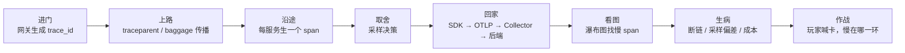
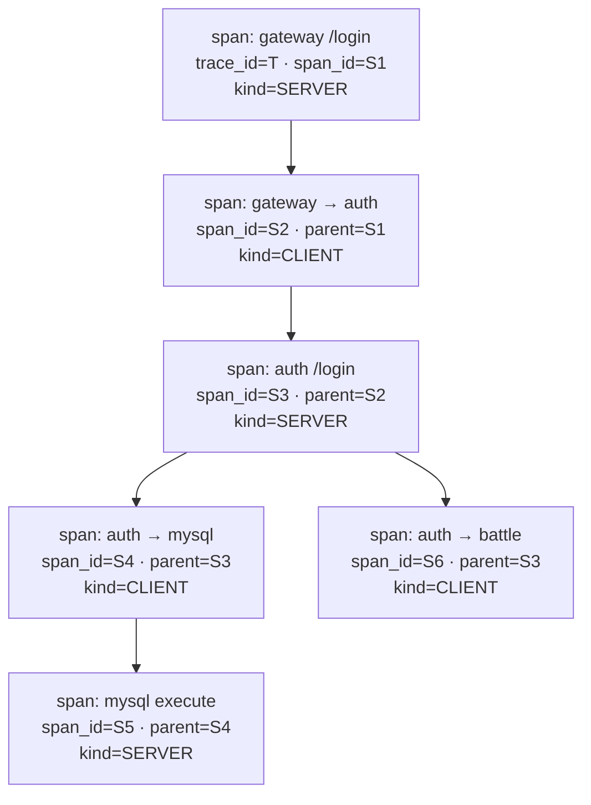
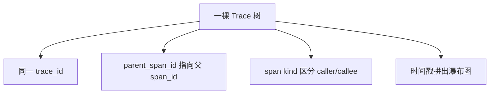
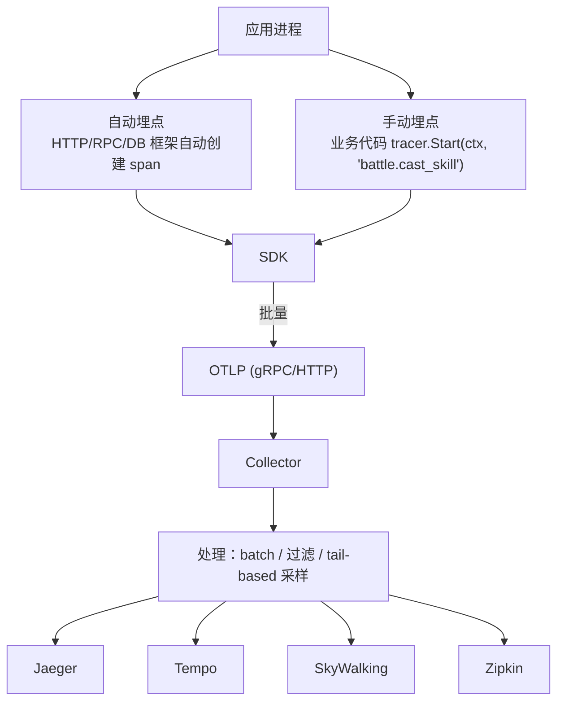
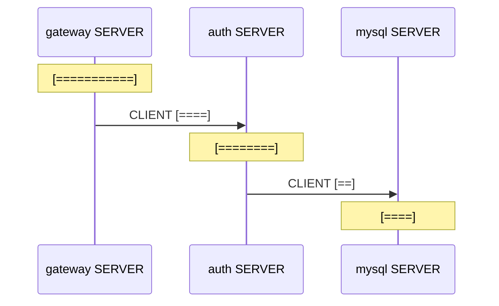
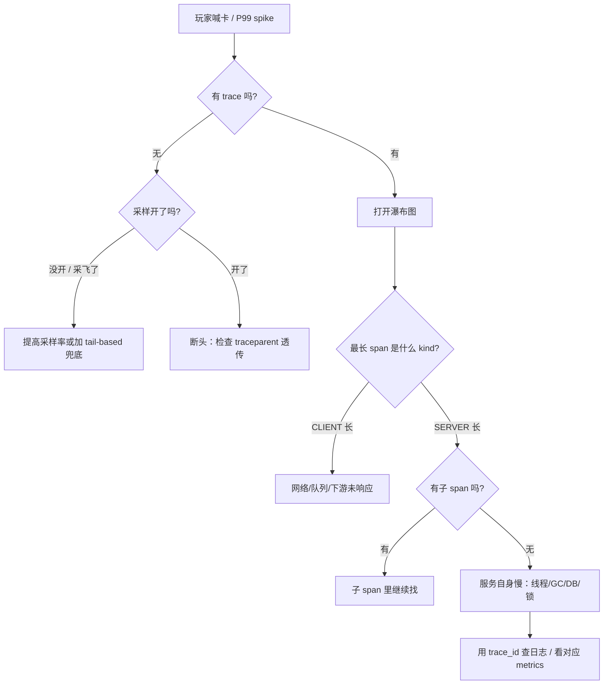

# 链路追踪与 OpenTelemetry

> 玩家登录加载条卡住、战斗技能时延偶发飙升，监控大盘只看见网关 P99 涨到 800ms，却不知道慢在网关、认证服、战斗服还是下游 DB——日志撒了一地，唯独缺一张「请求路线图」。
> **本章回答**：一个跨服务请求从进门到回家，trace/span/context 怎么一路跟下来，采样、看图、定责怎么落地。
> **不讲**：指标聚合口径与 PromQL → [02](../02-Prometheus与PromQL/)；日志采集存储与 trace_id 打日志 → [04](../04-日志链路与采集/)；SLO 与错误预算怎么管发布节奏 → [06](../06-SLI-SLO与错误预算/)；Service Mesh 无侵入埋点实现 → [03-24](../../03-Kubernetes/24-ServiceMesh-Istio与Envoy/)；eBPF 无侵入可观测 → [03-25](../../03-Kubernetes/25-eBPF与Cilium/)。可观测三件套全局选型 → [01](../01-可观测性三件套与选型/)。

**标记**：🎯重点 · 🔥难点 · ⭐常考 · 🔧实操

---

## 一、一张图：一个跨服务请求的一生

> 🎯 **一句话**：trace 是请求的「户口本」，span 是每一跳的「行程单」，context 传播是跨服务「接力传户口本」。



**读图**：
- 主线是一条请求从网关出发，穿过多个服务再返回；每跳都把「我到过、耗时多久」写成 span。
- `traceparent` 是接力棒，丢了任何一棒，树就拼不全；采样决定哪些请求值得被看见。
- 后端瀑布图是排障第一现场，看到长条就知道钱和时间花在哪一棒。

---

## 二、进门：trace 诞生与 trace_id 生成

> 🎯 **一句话**：trace 在第一个埋点服务里诞生；`trace_id` 全局唯一，全链共享，是后面所有 span 的「户口本号」。

一个 **Trace** 就是一次完整请求的跟踪记录；一个 **Span** 是 trace 里某个工作单元的记录，通常对应一次服务调用或一段本地计算。所有 span 靠同一个 `trace_id` 串成一棵树。

**SpanContext** 是 span 的上下文，核心字段：
- `trace_id`：16 字节（hex 32 字符），整棵树都一样。
- `span_id`：8 字节（hex 16 字符），每个 span 不同。
- `parent_span_id`：指向父 span 的 `span_id`，根 span 为空。
- `trace_flags`：最低位是采样标志，`01` 表示被采样。

`trace_id` 由入口服务（通常是网关或第一个被埋点的服务）生成，规则是**随机 + 足够长**，不能从 IP、时间戳直接派生——否则高并发下容易撞号，也容易被猜。OpenTelemetry 默认用随机 16 字节。

```text
trace_id : 4bf92f3577b34da6a3ce929d0e0e4736   # ← 32 个 hex 字符，全链唯一
span_id  : 00f067aa0ba902b7                   # ← 16 个 hex 字符，每跳不同
```

以一次游戏登录为例：玩家在客户端点登录 → 网关收到请求，生成 `trace_id` 并作为网关 SERVER span 的 root → 网关调用认证服时生成 CLIENT span，把同一 `trace_id` 和新生成的 `span_id` 写进 `traceparent` → 认证服收到后又生成自己的 SERVER span。整棵树的户口本就一个，但每一跳的行程单都有自己的 span_id。

> ⚠️ **别混**：`trace_id` 整棵树只有一个，`span_id` 每跳都有一个；面试说「每个 span 有自己的 trace_id」是错的。`span_id` 不是端口，也不是线程 ID。

> 📝 **面试**：问「trace 和 span 什么关系」，答「trace 是一次完整请求，span 是其中一跳；所有 span 共享同一个 trace_id，用 parent_span_id 拼成树」。

---

## 三、上路：context 怎么跨进程传播 🎯⭐🔥

> 🎯 **一句话**：跨服务时把 `trace_id`/`span_id`/采样位放进 HTTP header，接收方解析后接着往下画 span。

### W3C Trace Context 与 traceparent

目前最通用的传播标准是 **W3C Trace Context**，HTTP 头叫 `traceparent`，格式固定：

```text
traceparent: 00-4bf92f3577b34da6a3ce929d0e0e4736-00f067aa0ba902b7-01
             ↑  ↑                ↑                    ↑           ↑
           版本  trace_flags     trace_id (32)        span_id(16)  trace_flags
```

- 版本号 `00`：当前版本。
- `trace_id`：32 字符。
- `span_id`：当前 span 的 ID；接收方要生成新的 span_id，但 trace_id 不变。
- `trace_flags`：`01` 表示这条 trace 被采样，`00` 表示没被采样。

服务端收到请求后，从 header 里 **extract** 出 SpanContext，创建自己的 span 并设置为 child；调用下游时再把新的 `traceparent` **inject** 进 header。

这种把 SpanContext 从上游传到下游的机制就叫 **上下文传播（context propagation）**。框架里的 **instrumentation（埋点库）** 会自动做 inject/extract：HTTP server 收到请求时 extract，HTTP client 发请求时 inject。业务代码通常只负责手动创建关键 span，传播由 instrumentation 代理完成。

```text
客户端 outbound:
  traceparent: 00-<trace_id>-<当前span_id>-01

服务端 inbound:
  解析 traceparent → 生成新 span_id → 处理业务 → 调用下游时写入
  traceparent: 00-<同一trace_id>-<新span_id>-01
```

### baggage 是干什么的

`traceparent` 只传 ID 和采样位，业务上下文（如 `user_id`、`room_id`、`client_version`）靠 **`baggage`** 头传：

```text
baggage: user_id=12345,room_id=abc,client_version=2.1.0
```

baggage 会随请求一起穿过所有服务，下游无需再查用户中心就能知道「这是谁在玩、哪个房间」。但 baggage 也有规矩：
- **键值对要小**：不要塞 JWT、完整订单 JSON。
- **不要传秘密**：头明文，不能带 token、密码。
- **所有服务都要透传**：中间某个服务没转发，后面就断。

> ⚠️ **别混**：`traceparent` 传的是「请求身份证和采样标记」；`baggage` 传的是「业务便签」。不要把大对象放进 baggage，也不要把 trace 数据当业务状态用。

### 异步与线程池为什么容易断链 🔥

进程内多线程/协程、跨 Kafka / RocketMQ / 自定义任务队列时，**context 不会自动跟着走**。必须显式传递：

```text
HTTP / RPC:      header 透传 traceparent + baggage
线程池 / 协程:   把 SpanContext 作为 task 参数，或复用 Context
消息队列:        把 traceparent 写进消息 header / properties
```

常见断链根因：
- 网关收到请求后起了异步线程池，没把 context 传进去。
- 消息生产者没把 traceparent 写进 Kafka `record headers`。
- 消费者用多线程消费，但 OpenTelemetry 的 Context 没复制到子线程。

不同协议只是载体不同：gRPC 用 `grpc-trace-bin` metadata，Kafka 用 `record headers`，自定义 TCP/私有协议要自己在帧头里留两个字段。核心原则不变：**把 trace_id、span_id、采样位、baggage 从发送方带到接收方**。

> 💡 **打个比方**：traceparent 像接力棒，直道（同步 HTTP）会自然往前传；弯道（异步线程/消息队列）必须主动交棒，否则下一棒选手根本不知道自己在哪条跑道。

> 📝 **面试**：问「跨服务链路追踪怎么实现」，先答 W3C Trace Context 的 `traceparent` 头格式，再说 inject/extract；然后补一句「异步和消息队列里最容易断链，必须显式传 context」。

---

## 四、沿途：span 怎么拼成一棵树 🎯⭐🔥

> 🎯 **一句话**：span 靠「同 trace_id + parent 指针」拼树；parent 指向谁，谁就是上一跳。

### span 里面有什么

一个 **Span** 至少包含以下字段：

- `trace_id`：所属 trace。
- `span_id`：自身唯一 ID。
- `parent_span_id`：父 span ID，根 span 为空。
- `name`：操作名，如 `GET /login`。
- `kind`：`SERVER`/`CLIENT`/`PRODUCER`/`CONSUMER`/`INTERNAL`。
- `start_time` / `end_time`：起止时间戳。
- `attributes`：标签，如 `http.method=GET`、`db.statement=SELECT...`。
- `events`：span 内的事件日志。
- `status`：`OK` / `ERROR` / `UNSET`。

`kind` 是排障关键：
- **SERVER**：服务接收请求，画的是「本服务处理耗时」。
- **CLIENT**：服务发出去调用别人，画的是「从发出到收到响应」的端到端时间。
- 一段慢请求，若 CLIENT span 长而 SERVER span 短，说明**网络/队列慢**；若 SERVER span 长，说明**服务自身慢**。

### 树是怎么拼的



**读图**：
- 根 span 是网关的 SERVER span；它调用认证服时产生 CLIENT span S2；认证服收到后产生 SERVER span S3，作为 S2 的 child。
- 同一条 trace 里所有 span 的 `trace_id` 都是 `T`；父子关系由 `parent_span_id` 指向对方的 `span_id`。
- 看 CLIENT span 和对应的 SERVER span 之间的时间差，能区分「网络传输/队列等待」和「服务处理」。

> ⚠️ **别混**：`parent_span_id` 填的是父 span 的 `span_id`，不是 `trace_id`；根 span 没有 parent。一个 trace 里可以有多个根吗？技术上可以，但正常情况只有一个入口。

### 收束：span 凭什么拼成一棵树 🎯⭐

把这节散的机制收成一张清单：



**读图**：树靠两个字段拼——`trace_id` 把所有节点圈进同一本户口本，`parent_span_id` 决定谁挂在谁下面；`kind` 和时间戳决定你看到什么样的瀑布图。

> ⚠️ **别混**：trace 拼树**不保证顺序正确**。如果某台机器时钟没同步，子 span 的 start_time 可能比父 span 还早，出现负耗时——这是分布式时钟问题，不是 parent 指针错了。

> 📝 **面试**：问「怎么从 span 拼出调用链」，答「同 trace_id + parent_span_id；根 span 没有 parent；CLIENT/SERVER kind 能看出网络和服务处理分别耗时」。

---

## 五、取舍：采样策略怎么定 🎯⭐🔥

> 🎯 **一句话**：全量 trace 成本扛不住，采样决定在门口就让谁进相册、谁只存在于统计里。

### 为什么必须采样

一个大型游戏服，网关每秒几十万请求，如果每个请求都生成完整 trace 并导出，存储、网络、Collector、后端索引会瞬间被打爆。所以 **Tracing 默认不采全量**，只在可接受的成本内保留「够看」的样本。

### head-based vs tail-based

| 维度 | **head-based sampling** | **tail-based sampling** |
|------|---------------------------|-------------------------|
| 决策时机 | 请求**入口**就决定 | 整条 trace **结束后**决定 |
| 信息依据 | 只能看入口特征 | 能看整棵树：错误、延迟、特定路径 |
| 优点 | 简单、开销小、各服务一致 | 能留住错误/慢请求 |
| 缺点 | 入口不知道后面会不会出错/变慢 | 要缓存整棵树，内存和延迟大 |
| 实现位置 | SDK / Agent | Collector / 后端 |
| trace_flags | `01`/`00` 随 traceparent 传播 | 通常先全采到 Collector 再筛选 |

**head-based** 是主流默认：网关按 1% 随机采样，并把 `trace_flags` 传下去，所有服务看到 `01` 就记录、`00` 就跳过。它保证一棵 trace 要么全有、要么全无，不会出现「上游有 span、下游没有」的半截树。

**tail-based** 用于必须捕获异常 trace 的场景：Collector 先把所有 span 缓存起来，等 trace 结束后判断是否满足条件（如 `duration > 2s` 或 `status=ERROR`），满足才保留。代价是内存和导出延迟。

### 错误请求怎么不丢

纯随机采样可能把罕见错误漏掉。常用补救：
- **错误偏置采样**：错误 trace 100% 保留，成功请求按 1% 采。
- **慢请求偏置采样**：延迟超过阈值的 trace 100% 保留。
- 在 head-based 框架里，可以给错误请求强制把 `trace_flags` 置为 `01`，或在 Collector 做 tail-based 兜底。

但千万别各服务自己随机决定：A 服务采了、B 服务没采，后端会收到一棵断头的树，比没 trace 还误导。

### 采样率怎么定

没有银弹，先算存储和查询成本，再按业务价值分档：

- **入口网关**：0.1%–1% 是常见起点；每秒 10 万 QPS 采 0.1% 也还有 100 条 trace/s，足够看 P99 分布。
- **核心链路（登录、支付、匹配）**：可以提到 5%–10%，因为单条价值高、量相对小。
- **高频可丢链路（位置同步、心跳）**：0.01% 或只采异常。
- **错误/慢请求**：尽量 100% 保留；用 tail-based 或 head-based 里的错误偏置。

调整采样率不要只看「后端能不能存下」，还要看**查询体验**：采样太低，出问题时点 exemplar 十次都点不到一条 trace；采样太高，查一条 trace 要等几十秒。

采样策略最好通过配置中心或 Collector 动态下发，避免每次改采样都要重启服务。

> ⚠️ **别混**：head-based 的采样率 **不能简单相加**。不是说「网关 10%、下游 10%」就变成 1%；必须全链一致，否则就是断头 trace。

> 📝 **面试**：问「采样怎么设计」，答「默认 head-based 保证一致性；错误和慢请求用偏置或 tail-based 兜底；tail-based 能留住错误但内存和延迟大」。

---

## 六、回家：SDK → OTLP → Collector → 后端

> 🎯 **一句话**：OpenTelemetry 是厂商中立的采集标准；一次埋点，后端 Jaeger/Tempo/SkyWalking 可以随便换。

### OpenTelemetry 四件套

OpenTelemetry 不是某个后端，而是一套**可观测数据标准 + 采集工具**：

1. **API**：应用代码里创建 span、添加属性的接口。
2. **SDK**：具体实现，包括采样、批处理、导出。
3. **Instrumentation（instrumentation，埋点库）**：自动埋点（HTTP client/server、DB driver、RPC 框架）和手动埋点。
4. **Collector**：接收 → 处理 → 导出的中间层。
5. **OTLP**：SDK/Collector 之间的传输协议，基于 gRPC 或 HTTP/protobuf。



### Collector 的角色与部署 🔥

**Collector 干三件事**：receive、process、export。常用处理器：
- `batch`：攒一批再发，降低网络开销。
- `memory_limiter`：防自身 OOM。
- `tail_sampling`：做尾采样。
- `resource` / `attributes`：统一加标签（如 `env=prod`、`cluster=asia`）。

两种部署形态：

- **Agent 模式**：每个节点 / 每个 Pod 一个 Collector sidecar
  - 优点：离应用近
  - 优点：网络抖动小
  - 优点：按租户/服务隔离
  - 缺点：每个节点多一份资源

- **Gateway 模式**：集群级几个 Collector 实例
  - 优点：统一出口
  - 优点：便于鉴权/限流
  - 优点：便于后端路由
  - 缺点：跨节点网络多一跳

生产通常是 **SDK → 本节点 Agent → Gateway → 后端** 的分层架构。

SDK 默认会批量、异步导出，后端抖动时自带退避和队列。生产还要注意 **OTLP 出口安全**：Collector 之间常用 mTLS 或内网隔离，Gateway 对外只走 443/ingress，不要把 4317/4318 直接暴露到公网。

### 后端一句话

- **Jaeger**：CNCF 项目，功能全，可 all-in-one，也可 Kafka+ES/Cassandra 扩。
- **Grafana Tempo**：按 trace_id 查，对象存储成本低，和 Grafana/Metrics 联动好。
- **SkyWalking**：带 Java/Go Agent 无侵入埋点，生态较闭环，适合 APM 全链路。
- **Zipkin**：老前辈，简单，社区仍活跃。

> ⚠️ **别混**：OpenTelemetry 是**标准**，Jaeger/Tempo 是**后端**。用了 OTel SDK 后换后端不需要改业务代码，只改 Collector 的 exporter 配置。

> 🔍 **现场**：检查 Collector 是否在 healthy 状态：

```bash
curl -s http://otel-collector-gateway:13133/ | head
# {"status":{"...":"Server available"}}   # ← 不健康时 SDK 会缓存或丢数据
```

> 📝 **面试**：问「OpenTelemetry 是什么」，答「厂商中立的采集标准，API/SDK/自动埋点/Collector/OTLP 四件套；一次埋点，后端可换」。

---

## 七、看图：瀑布图、火焰图与 metrics/logs 联动 🎯⭐

> 🎯 **一句话**：瀑布图是「时间轴上的调用树」，长条就是慢的地方；从 metrics 跳到 trace 靠 exemplar，从日志跳到 trace 靠 trace_id。

### 瀑布图怎么读

后端 UI 通常把 trace 画成瀑布图：



- 每一行是一个 span，横条长度 = 耗时。
- 父子缩进表示调用关系。
- **关键路径**是从根到叶最长的一条链，优化它才能降低总延迟。
- CLIENT span 与 SERVER span 之间的空白 = 网络 + 队列时间。

### 火焰图

火焰图是把大量 trace 的 span 按耗时聚合后竖着叠起来，宽的地方就是高频或高耗时的调用。它适合看**共性瓶颈**，瀑布图适合看**单次请求**。

### 与 metrics 联动：exemplar

Prometheus 的 **exemplar** 是在 histogram bucket 上挂一个 trace_id。看到 P99  spike 时，点击 exemplar 就能直接打开那条慢请求的 trace。这是「从指标到 trace」的最短路径。

```text
histogram_quantile(0.99, rate(login_latency_bucket[5m]))
# 点上挂 exemplar: trace_id=4bf92f3577b34da6a3ce929d0e0e4736
# 点击 → 打开 Jaeger/Tempo 看整条登录链路
```

### 与日志联动：trace_id 进日志

在结构化日志里固定输出 `trace_id` 和 `span_id`：

```text
{"time":"...","level":"ERROR","msg":"login failed","trace_id":"4bf92f3577b34da6a3ce929d0e0e4736","span_id":"00f067aa0ba902b7","service":"auth"}
```

出事后在 Kibana/Grafana 用 `trace_id=xxx` 一查，就能把这请求在所有服务的日志串起来。注意：trace_id 最好由网关生成并落进日志，否则下游服务各自写不同 ID 还是串不起来。

> 📝 **面试**：问「trace 和 metrics/logs 怎么联动」，答「metrics 用 exemplar 挂 trace_id；日志里固定字段输出 trace_id；trace 瀑布图定位到慢 span 后再查对应日志」。

---

## 八、生病：断链、采样偏差与埋点成本 🔥

> 🎯 **一句话**：trace 不是开了就有用，断头、采偏、太贵是落地三大病。

### 断头 trace

常见原因：
- 某个服务没接入 SDK，或只接了一半。
- 异步线程 / 消息队列没传 context。
- 反向代理 / WAF 把 `traceparent` 头清洗掉。
- 不同服务采样决策不一致。

断头树的危害比没有 trace 更大：你会看到网关很慢、后面一片空白，误以为下游没问题，其实数据根本没采到。

### 采样偏差

- head-based 随机采样可能漏掉「特定用户/特定房间」的慢请求，因为入口不知道后面发生的事。
- 采样率过低时，错误率指标可能统计失真——你看到的错误 trace 只是被采样到的错误。
- 只采成功请求、不采失败请求，会导致「平均延迟很好看但玩家骂娘」。

### 时钟偏差

分布式系统里各机器时钟不可能完全同步。如果 auth 机器比网关快 200ms，你会看到 auth 的 SERVER span `start_time` 比网关 CLIENT span 还早，甚至出现负耗时。排查时看到这种异常，不要先怀疑代码，先看 NTP 同步状态和 span 时间戳的绝对值。生产建议所有节点跑 chrony 或 ntpd，并把时钟偏差纳入监控。

### 埋点成本

- **CPU**：每次创建 span、序列化属性、批量导出都会吃 CPU。
- **网络**：span 数据量不小，attribute 越多越大。
- **存储**：后端按 span 数和标签基数计费。

治理方法：
- 控制 attribute 数量和长度，不要把 SQL 结果集写进 span。
- 采样率按环境分：开发 100%、测试 10%、生产 1% 或更低。
- 关键路径（登录、支付）采样率高于战斗位置同步。
- 用自动埋点覆盖框架，手动埋点只加业务关键段。

### attribute 与标签基数

attribute 里的高基数字段（如 `user_id`、`order_id`、`session_id`）会让后端索引爆炸。Trace 后端的存储成本很大程度上由「唯一 tag 组合数」决定，而不是 span 条数。规矩：

- **低基数**可以打：`http.method`、`service.name`、`cluster`、`env`、`error=true/false`。
- **高基数**谨慎打：`user_id` 只在抽样调查或故障单条 trace 里看；不要作为聚合维度。
- **不要打可变长内容**：SQL 结果、响应体、堆栈全文进 span 会撑爆网络和存储。

> ⚠️ **别混**：trace 的 attribute 不是日志。日志可以写详细错误详情；trace attribute 是为了**快速筛选和关联**，不是用来存业务 payload 的。

> ⚠️ **别混**：自动埋点方便但 span 名/属性由框架决定，可能不够业务语义；手动埋点灵活但要控制成本。不是越细越好。

> 📝 **面试**：问「链路追踪落地要注意什么」，答「保证 context 全链透传、采样策略别采偏、控制 attribute 成本和采样率」。

---

## 九、作战：玩家喊卡，慢在哪一环 🔧

> 🎯 **一句话**：从 metrics 的 P99 尖刺出发，用 exemplar 打开 trace，瀑布图找到长 span，再用 trace_id 查日志，层层下钻。

### 定责决策树



**读图**：第一刀先看有没有 trace——没有 trace 别瞎猜，先查采样和传播；有 trace 就看瀑布图最长条，CLIENT 长和 SERVER 长治的地方完全不同。

### 一个登录慢的游戏案例

玩家反馈「登录加载条卡住」，网关 P99 从 200ms 涨到 1.2s：

1. 在 Grafana 的 `login_latency_bucket` 上找到 P99 尖刺，点击 **exemplar**，拿到 `trace_id`。
2. 在 Jaeger 打开 trace，看见 `gateway → auth` 的 CLIENT span 占了 1s，而 auth 的 SERVER span 只有 80ms。
3. 中间 920ms 花在哪？看 CLIENT span 与 SERVER span 之间的空白，怀疑网络或 LB 队列。
4. 查同时间段 auth 服务的 `process_cpu_seconds_total` 和 GC 都正常；再点 auth span，看到它调用 MySQL 的 CLIENT span 只有 60ms。
5. 最终把矛头指向网关到 auth 之间的内网链路 / 负载均衡，而不是业务代码。

这个案例说明：没有 trace，大家只能猜「是不是 DB 慢了」；有 trace，矛头可以快速从「1.2s 到底花在哪」收敛到具体一段。

### 现象 · 先做 · 别做

| 现象 | 先做 | 别做 |
|------|------|------|
| 大盘 P99  spike | 点 exemplar 看 trace | 逐行 grep 所有服务日志 |
| 瀑布图某个 span 长 | 看 kind + 子 span | 直接改代码加索引 |
| CLIENT 长、SERVER 短 | 查网络/队列/LB | 给服务扩容 |
| SERVER 长、无子 span | 查本服务线程/GC/锁 | 让下游背锅 |
| 找不到某段 span | 查该服务是否透传 traceparent | 以为下游没问题 |
| trace 断断续续 | 检查采样一致性 + 异步上下文 | 把采样率提到 100% |

### 60 秒剧本 🔧

```text
① 0–10s  收到报障：确认服务、时间、影响面；看对应 SLO 面板或 P99 曲线
② 10–30s 点 P99 尖刺上的 exemplar，拿到 trace_id
③ 30–45s 打开 trace 瀑布图，找到耗时最长的 span，判断 CLIENT / SERVER
④ 45–60s 用 trace_id 搜日志，定位到具体错误行或慢 SQL
```

> 🔍 **现场**：没有 exemplar 时，可以用 logs 里的 trace_id 反查：

```bash
# 在 Loki/Kibana 中按 trace_id 聚合日志
{service=~\"auth|gateway|battle\"} |= \"trace_id=4bf92f3577b34da6a3ce929d0e0e4736\"
# 结果按时间排序，可看到同一请求在各服务的日志
```

---

## 十、收口

### 命令速查 🔧

```bash
# 检查服务是否透传 traceparent
curl -s -I http://gateway/health | grep -i traceparent
# 手动注入 traceparent 测试下游
curl -s -H "traceparent: 00-4bf92f3577b34da6a3ce929d0e0e4736-00f067aa0ba902b7-01" http://auth/login
# 查看 Collector 健康
curl -s http://otel-collector:13133/
# Loki/Kibana 按 trace_id 查日志
{service=~\"auth|gateway|battle\"} |= \"trace_id={id}\"
```

### 面试锚点

| 问 | 30 秒答 |
|----|---------|
| trace 和 span 什么关系？ | trace 是一次完整请求，span 是其中一跳；同 trace_id，parent 指针拼树。 |
| SpanContext 是什么？ | 包含 trace_id、span_id、parent_span_id、trace_flags 的上下文。 |
| trace_id / span_id 各多长？ | trace_id 16 字节（32 hex），span_id 8 字节（16 hex）。 |
| traceparent 格式？ | `00-<trace_id>-<span_id>-<trace_flags>`，W3C Trace Context 标准。 |
| baggage 干什么？ | 传业务上下文（user_id/room_id），不是传 ID。 |
| context propagation 怎么实现？ | HTTP header inject/extract；异步/消息队列需显式传递。 |
| OpenTelemetry 是什么？ | 厂商中立采集标准：API/SDK/自动埋点/Collector/OTLP。 |
| OTLP 是什么？ | SDK 与 Collector 之间的传输协议，gRPC/HTTP+protobuf。 |
| Collector 做什么？ | receive→process→export；agent/gateway 两种部署。 |
| head-based vs tail-based？ | 入口决定 vs 整棵树结束后决定；tail 能留错误但成本高。 |
| 采样率怎么定？ | 生产按成本从 0.1%~1% 起，错误/慢请求偏置。 |
| 错误请求怎么不丢？ | 错误偏置采样或 tail-based。 |
| Jaeger/Tempo/SkyWalking 区别？ | Jaeger 全功能；Tempo 低成本对象存储；SkyWalking 带无侵入 agent。 |
| exemplar 作用？ | metrics bucket 上挂 trace_id，实现从 P99 跳 trace。 |
| 日志怎么联动 trace？ | 结构化日志固定输出 trace_id / span_id。 |

### 易错一句话对照

- trace 和 span 各有一个 trace_id → 同 trace 的所有 span 共享 trace_id
- traceparent 传业务字段 → traceparent 只传 ID 和采样位；业务字段用 baggage
- 把 JWT 塞 baggage → baggage 明文，不能带秘密
- head-based 各服务独立随机采样 → 必须全链一致，否则断头
- tail-based 不需要缓存 → 要缓存整棵树，内存和延迟大
- OpenTelemetry 就是 Jaeger → OTel 是标准，Jaeger 是后端
- 自动埋点越细越好 → 要控制 attribute 和 span 数量
- 看到 P99  spike 先 grep 日志 → 先点 exemplar 看 trace
- CLIENT span 长 = 下游处理慢 → CLIENT 长是网络+队列；要看对应的 SERVER span
- 异步线程会自动继承 trace → 必须显式传递 context
- 消息队列天然带 trace → 要主动写/读消息 header
- 采样率 100% 才能排障 → 合理采样 + tail-based 就够了

### 数字墙

> trace_id **32** hex / span_id **16** hex · traceparent 版本 **00** · 采样标志 **01** / **00** · W3C Trace Context 版本 **1** · head-based 常见采样 **0.1%–1%** · tail-based 缓存时长通常 **秒级** · Collector 默认健康端口 **13133** · OTLP gRPC 端口 **4317** / HTTP **4318**

---

## 十一、合上书

1. **口述一节的图**：进门 → 上路 → 沿途 → 取舍 → 回家 → 看图 → 生病 → 作战。
2. **口述进门**：trace 在哪诞生、trace_id 和 span_id 多长、为什么随机。
3. **口述上路**：W3C `traceparent` 四段格式、`baggage` 用法、异步/消息队列为什么断链。
4. **口述沿途**：span 关键字段、CLIENT/SERVER kind 区别、树怎么靠 trace_id + parent 拼。
5. **口述取舍**：head-based vs tail-based 对比、错误/慢请求偏置、采样一致性。
6. **口述回家**：OpenTelemetry 四件套、Collector 的 receive/process/export、agent vs gateway、OTLP。
7. **口述看图**：瀑布图读法、关键路径、火焰图作用、metrics 通过 exemplar 联动、日志通过 trace_id 联动。
8. **口述生病**：断头 trace 根因、采样偏差表现、埋点成本治理。
9. **口述作战**：P99 → exemplar → trace → 日志的 60 秒剧本；CLIENT 长 vs SERVER 长定责。

下一章：[SLI/SLO 与错误预算](../06-SLI-SLO与错误预算/)。可观测全局 → [01](../01-可观测性三件套与选型/)；PromQL → [02](../02-Prometheus与PromQL/)；日志链路 → [04](../04-日志链路与采集/)；Service Mesh → [03-24](../../03-Kubernetes/24-ServiceMesh-Istio与Envoy/)；eBPF → [03-25](../../03-Kubernetes/25-eBPF与Cilium/)。
