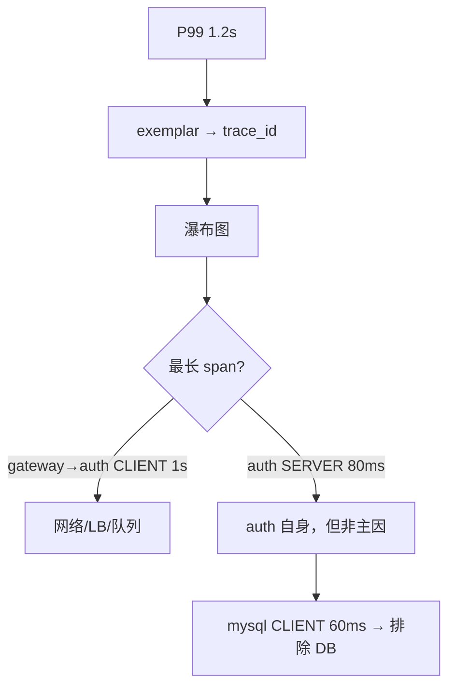

# 05｜链路追踪与 OpenTelemetry · 练习题

开始做题前，先给大家一个小建议：合上知识点，对着**第一节的主图**，把「一个跨服务请求的一生」口述一遍（进门 → 上路 → 沿途 → 取舍 → 回家 → 看图 → 生病 → 作战）。能顺下来，下面这些题大半都会了；卡壳的地方，就是该回去重读的那一节。

做题的方式：每道题**先看标题和场景，自己口述一遍答案，再往下看解答**。直接看解答，容易产生「我会了」的错觉。

题目顺序：Q1～Q6 钉 trace/span/传播；Q7～Q10 采样与 Collector；Q11～Q14 看图、断链与作战。

| 标记 | 含义 |
|------|------|
| **核心** | 不懂整章就没建立起来 |
| **必会** | 值班和面试都要能讲 |
| **常用** | 线上会反复碰到 |
| **常考** | 白板和追问的高频口径 |

## 本题目录

- [Q1 trace 和 span 什么关系](#q1)
- [Q2 trace_id 和 span_id 各多长](#q2)
- [Q3 traceparent 四段格式怎么读](#q3)
- [Q4 traceparent 和 baggage 区别](#q4)
- [Q5 异步和消息队列为什么断链](#q5)
- [Q6 span 怎么拼树 CLIENT vs SERVER](#q6)
- [Q7 head-based vs tail-based 采样](#q7)
- [Q8 各服务独立采样会怎样](#q8)
- [Q9 OpenTelemetry 和 Jaeger 什么关系](#q9)
- [Q10 Collector agent vs gateway](#q10)
- [Q11 瀑布图和 exemplar 怎么联动](#q11)
- [Q12 断头 trace 常见根因](#q12)
- [Q13 玩家喊卡 60 秒剧本](#q13)
- [Q14 登录慢综合白板题](#q14)
- [合上书](#合上书)

---

## Q1

**★★★★★｜trace 和 span 什么关系？**

**覆盖**：核心 · 必会 · 常考 ｜ **对应**：知识点 [二、进门：trace 诞生与 trace_id 生成](知识点.md)

### 场景

新人说「每个 span 都有自己的 trace_id，所以一条登录请求会有十几个 trace_id」。面试白板让你画「玩家点登录」的 trace 结构。


先自己试试，再往下看解答。

### 完整解答

> 🎯 **一句话**：**trace 是一次完整请求的户口本，span 是其中每一跳的行程单**——整棵树共享一个 `trace_id`，每跳一个 `span_id`，靠 `parent_span_id` 拼父子。

一次登录：网关生成 `trace_id=T`，自己建 SERVER span `S1`（根）→ 调认证服时建 CLIENT span `S2`（parent=S1）→ 认证服收到后建 SERVER span `S3`（parent=S2）。所有 span 的 `trace_id` 都是 `T`，`span_id` 各不相同。

```text
trace_id : 4bf92f3577b34da6a3ce929d0e0e4736   # ← 32 hex，全链唯一
span_id  : 00f067aa0ba902b7                   # ← 16 hex，每跳不同
parent   : 指向父 span 的 span_id，根 span 为空
```

> ⚠️ **别混**：`span_id` 不是端口、不是线程 ID；说「每个 span 有自己的 trace_id」是错的。

> 📝 **面试**：两句——trace 是完整请求；span 是其中一跳；同 trace_id + parent 指针拼树。

### 再追问

**SpanContext 里有什么？**——`trace_id`、`span_id`、`parent_span_id`、`trace_flags`（最低位是采样标志 `01`/`00`）。

**trace_id 怎么生成？**——入口服务（通常网关）随机 16 字节，不能从 IP/时间戳直接派生，否则高并发易撞号。

---

## Q2

**★★★★☆｜trace_id 和 span_id 各多长？trace_flags 干什么？**

**覆盖**：必会 · 常考 ｜ **对应**：知识点 [二、进门：trace 诞生与 trace_id 生成](知识点.md)

### 场景

排障时从日志里抠出一串 ID，有人把 32 字符当 span_id、16 字符当 trace_id，在 Jaeger 里搜不到。


这是 Q1「一棵树一个 trace_id」的长度版——32/16 hex。

先自己试试，再往下看解答。

### 完整解答

> 🎯 **一句话**：**trace_id 16 字节（32 hex），span_id 8 字节（16 hex）**；`trace_flags` 最低位 `01` 表示被采样、`00` 表示没采。

```text
trace_id : 4bf92f3577b34da6a3ce929d0e0e4736   # 32 字符
span_id  : 00f067aa0ba902b7                   # 16 字符
trace_flags: 01                               # 被采样，随 traceparent 全链传播
```

游戏服网关每秒几十万请求，trace_id 必须足够随机且全局唯一，否则后端索引和关联都会乱。

> 📝 **面试**：背数字墙——trace_id **32** hex / span_id **16** hex / 采样标志 **01** / **00**。

### 再追问

**没被采样的 trace 还能在日志里看到 trace_id 吗？**——可以，网关可能仍生成 ID 并写日志；但后端没有完整 span 树，只能当线索反查日志，不能当瀑布图依据。

---

## Q3

**★★★★★｜traceparent 四段格式怎么读？**

**覆盖**：核心 · 必会 · 常考 ｜ **对应**：知识点 [三、上路：context 怎么跨进程传播](知识点.md)

### 场景

战斗技能延迟排查，有人用 `curl` 打网关，想确认下游是否收到 trace 上下文。WAF 日志里偶尔能看到被截断的 header。


上路接力棒——承接 Q1 主图里的传播段。

先自己试试，再往下看解答。

### 完整解答

> 🎯 **一句话**：W3C Trace Context 的 `traceparent` 固定四段——`00-<trace_id>-<span_id>-<trace_flags>`。

```text
traceparent: 00-4bf92f3577b34da6a3ce929d0e0e4736-00f067aa0ba902b7-01
             ↑  ↑                ↑                    ↑           ↑
           版本  trace_id(32)     当前 span_id(16)     trace_flags
```

服务端 **extract** 解析 header → 建自己的 span（新 span_id，trace_id 不变）→ 调下游时 **inject** 写入新 traceparent。

```bash
# 检查网关是否回传/透传 traceparent
curl -s -I http://gateway:8080/health | grep -i traceparent

# 手动注入，测试 auth 是否接续
curl -s -H "traceparent: 00-4bf92f3577b34da6a3ce929d0e0e4736-00f067aa0ba902b7-01" \
  http://auth:8080/login
```

> ⚠️ **别混**：接收方要生成**新** span_id，trace_id 保持不变；不要把父 span_id 原样传下去当自己的 span_id。

> 📝 **面试**：先答四段格式，再说 inject/extract 由 instrumentation 自动完成。

### 再追问

**gRPC 用什么传？**——metadata 里的 `grpc-trace-bin` 或 W3C traceparent；Kafka 用 `record headers`；私有 TCP 协议要在帧头自己留字段——原则不变：把 SpanContext 从发送方带到接收方。

---

## Q4

**★★★★★｜traceparent 和 baggage 各传什么？**

**覆盖**：核心 · 必会 · 常考 ｜ **对应**：知识点 [三、上路：context 怎么跨进程传播](知识点.md)

### 场景

匹配服想在全链路里带上 `room_id` 和 `user_id`，开发把完整 JWT 塞进 `baggage`，还在 `traceparent` 里硬编码业务字段。


和 Q3 对照：traceparent 是身份证，baggage 是便签。

先自己试试，再往下看解答。

### 完整解答

> 🎯 **一句话**：**traceparent 只传 ID 和采样位；baggage 传业务便签**（user_id、room_id、client_version），明文、要小、不能带秘密。

```text
traceparent: 00-4bf92f3577b34da6a3ce929d0e0e4736-00f067aa0ba902b7-01
baggage:     user_id=12345,room_id=abc,client_version=2.1.0
```

规矩：
- baggage 键值对要小，不要塞 JWT、订单 JSON。
- 所有中间服务必须透传，某一跳丢了后面就断。
- 不要把大对象当 trace 数据用。

> ⚠️ **别混**：baggage 明文经过每一跳，**不能**带 token、密码。

> 📝 **面试**：traceparent = 身份证 + 采样标记；baggage = 业务便签。

### 再追问

**user_id 打 baggage 还是打 span attribute？**——baggage 是为了下游不用回查用户中心；attribute 用于筛选。高基数 `user_id` 不要当聚合维度，故障单条 trace 里看即可。

---

## Q5

**★★★★★｜异步线程和消息队列为什么最容易断链？**

**覆盖**：核心 · 必会 · 难点 ｜ **对应**：知识点 [三、上路：context 怎么跨进程传播](知识点.md)

### 场景

网关收到登录请求后丢进线程池异步写审计日志；匹配结果通过 Kafka 通知战斗服。Jaeger 里网关有 span，auth 有 span，但 Kafka 消费侧和审计任务完全没出现在树上。


就是知识点第三节「弯道必须交棒」——异步/MQ 断链。

先自己试试，再往下看解答。

### 完整解答

> 🎯 **一句话**：同步 HTTP 会自然 inject/extract；**弯道（线程池、协程、MQ）必须主动交棒**，否则下一棒不知道自己在哪条跑道。

```text
HTTP / RPC:     header 透传 traceparent + baggage
线程池 / 协程:  把 SpanContext 作为 task 参数，或复用 Context
消息队列:       生产者写进 record headers；消费者 extract 后再建 span
```

常见断链根因：
- 网关起异步线程池，没把 context 传进去。
- Kafka 生产者没写 traceparent 到 headers。
- 消费者多线程消费，子线程没复制 OpenTelemetry Context。

> 💡 **打个比方**：直道会自然传接力棒；弯道必须主动交棒。

> 📝 **面试**：答完 W3C header 后，**必补**一句「异步和 MQ 最容易断链，要显式传 context」。

### 再追问

**战斗服技能结算走内部 goroutine 池，怎么传？**——在提交任务前 `context.Context` 里带着 span，子 goroutine 用同一个 ctx 起 span；Go 用 `otel.GetTextMapPropagator().Inject/Extract`。

---

## Q6

**★★★★★｜span 怎么拼成调用树？CLIENT 长和 SERVER 长分别说明什么？**

**覆盖**：核心 · 必会 · 常考 ｜ **对应**：知识点 [四、沿途：span 怎么拼成一棵树](知识点.md)

### 场景

登录 P99 尖刺，瀑布图上 `gateway→auth` 的 CLIENT span 占了 900ms，auth 的 SERVER span 只有 80ms。有人结论「auth 代码慢，扩容 auth」。


Q1 拼树的 kind 版——CLIENT vs SERVER 定责。

先自己试试，再往下看解答。

### 完整解答

> 🎯 **一句话**：树靠 **同 trace_id + parent_span_id** 拼；**CLIENT 长、SERVER 短 = 网络/队列/LB**；**SERVER 长 = 本服务处理慢**，再看子 span。

| kind | 含义 | 慢的时候先怀疑 |
|------|------|----------------|
| **SERVER** | 本服务处理请求的耗时 | 业务逻辑、DB、锁、GC |
| **CLIENT** | 从发出到收到响应的端到端 | 网络、下游队列、下游未响应 |

```text
gateway SERVER  [===========]
  └─ gateway→auth CLIENT    [================]  ← 900ms
       └─ auth SERVER            [====]          ← 80ms
```

CLIENT 与 SERVER 之间的空白 = 传输 + 排队。此例应查网关到 auth 之间链路，不是先扩容 auth。

> ⚠️ **别混**：`parent_span_id` 填的是父 span 的 `span_id`，不是 `trace_id`。

> 📝 **面试**：拼树两句 + CLIENT/SERVER 定责两句，四句话到位。

### 再追问

**子 span start_time 比父 span 还早？**——分布式时钟偏差（NTP），不是 parent 指针错了；先看 chrony/ntpd，别先改代码。

---

## Q7

**★★★★★｜head-based 和 tail-based 采样差在哪？**

**覆盖**：核心 · 必会 · 常考 ｜ **对应**：知识点 [五、取舍：采样策略怎么定](知识点.md)

### 场景

面试官问：「网关 1% 随机采样，支付链路偶发失败却经常查不到 trace。能不能每个服务自己决定采不采？」


取舍题——head-based vs tail-based。

先自己试试，再往下看解答。

### 完整解答

> 🎯 **一句话**：**head-based 在门口就决定整棵树采不采**；**tail-based 等整棵树结束后按错误/延迟再留**——tail 能抓住慢请求，但要缓存整棵树，内存和延迟大。

| 维度 | head-based | tail-based |
|------|------------|------------|
| 决策时机 | 请求入口 | trace 结束后 |
| 信息依据 | 入口特征（随机、路径） | 整棵树：错误、延迟、特定属性 |
| 优点 | 简单、各服务一致 | 能留住错误/慢 trace |
| 缺点 | 入口不知道后面会不会出错 | 缓存成本高 |
| 实现位置 | SDK / Agent | Collector / 后端 |

生产常见组合：网关 head-based 0.1%–1% + Collector `tail_sampling` 对 `status=ERROR` 或 `duration>2s` 100% 保留。

> ⚠️ **别混**：tail-based **要**缓存整棵树，不是「免费更聪明」。

> 📝 **面试**：默认 head-based 保一致性；错误/慢请求用偏置或 tail-based 兜底。

### 再追问

**登录链路采样率怎么定？**——核心链路可 5%–10%（量相对小、单条价值高）；心跳/位置同步 0.01% 或只采异常；错误尽量 100% 保留。

---

## Q8

**★★★★☆｜各服务独立随机采样会怎样？**

**覆盖**：必会 · 常考 ｜ **对应**：知识点 [五、取舍：采样策略怎么定](知识点.md)

### 场景

网关采 10%，auth 采 10%，battle 采 10%，有人觉得「乘起来就是 1%，更省存储」。


就是 Q7 那位同学踩的坑：各服务独立采样。

先自己试试，再往下看解答。

### 完整解答

> 🎯 **一句话**：**采样必须全链一致**——各服务独立随机 = 断头 trace，比没有 trace 更误导。

head-based 正确做法：入口决定 `trace_flags=01/00`，经 traceparent 传下去，下游看到 `00` 就跳过记录。一棵 trace 要么全有、要么全无。

```text
错误：A 采了、B 没采 → 后端看到网关很慢、后面一片空白 → 误以为下游没问题
正确：入口置 flag → 全链跟 flag 走 → 树完整或整棵不存在
```

错误/慢请求补救：错误偏置（错误 trace 强制 `01`）、或在 Collector 做 tail-based，而不是让每个服务自己掷骰子。

> ⚠️ **别混**：head-based 采样率**不能简单相乘**。「网关 10% × 下游 10% = 1%」是错的口径。

### 再追问

**采样太低会怎样？**——出问题时点 exemplar 十次都点不到 trace；太高则查询慢、存储贵。按链路和成本分档，用配置中心动态下发，别每次改采样都重启服务。

---

## Q9

**★★★★★｜OpenTelemetry 是什么？和 Jaeger 什么关系？**

**覆盖**：核心 · 必会 · 常考 ｜ **对应**：知识点 [六、回家：SDK → OTLP → Collector → 后端](知识点.md)

### 场景

团队要统一 Java 网关、Go 战斗服、C++ 匹配服的埋点，有人提议「全部直接接 Jaeger SDK」。


回家：OTel 与后端什么关系。

先自己试试，再往下看解答。

### 完整解答

> 🎯 **一句话**：**OpenTelemetry 是厂商中立的采集标准**（API/SDK/自动埋点/Collector/OTLP）；**Jaeger/Tempo/SkyWalking 是后端**——一次 OTel 埋点，换后端只改 Collector exporter。

```text
应用进程
   ├─ 自动埋点：HTTP/RPC/DB
   ├─ 手动埋点：tracer.Start(ctx, "battle.cast_skill")
   ▼
SDK ──batch──► OTLP (gRPC 4317 / HTTP 4318) ──► Collector
                                                    │
                                                    ├─ batch / tail_sampling / memory_limiter
                                                    ▼
                                               Jaeger / Tempo / SkyWalking
```

| 后端 | 一句话 |
|------|--------|
| **Jaeger** | CNCF，功能全，可 all-in-one 也可 ES/Cassandra 扩 |
| **Grafana Tempo** | 按 trace_id 查，对象存储成本低，和 Grafana/metrics 联动好 |
| **SkyWalking** | 带 Java/Go Agent 无侵入，APM 闭环 |

> ⚠️ **别混**：OpenTelemetry ≠ Jaeger。OTel 是标准，Jaeger 是存储和 UI。

> 📝 **面试**：背四件套——API、SDK、Instrumentation、Collector；OTLP 是传输协议。

### 再追问

**OTLP 端口？**——gRPC **4317**，HTTP **4318**；Collector 健康检查默认 **13133**。不要把 4317/4318 直接暴露公网。

---

## Q10

**★★★★☆｜Collector 怎么部署？agent 和 gateway 各解决什么？**

**覆盖**：必会 · 常用 ｜ **对应**：知识点 [六、回家：SDK → OTLP → Collector → 后端](知识点.md)

### 场景

K8s 游戏集群 200+ 战斗 Pod，span 导出有时丢批；有人想在每个节点放 Collector，也有人坚持集群只跑 2 个 Gateway。


Collector 分层——承接 Q9。

先自己试试，再往下看解答。

### 完整解答

> 🎯 **一句话**：生产常见 **SDK → 本节点 Agent → Gateway → 后端**——Agent 离应用近、抖动小；Gateway 统一鉴权、限流、后端路由。

| 模式 | 优点 | 缺点 |
|------|------|------|
| **Agent**（每节点/Pod sidecar） | 离应用近；按租户隔离；本机 batch | 每节点多一份资源 |
| **Gateway**（集群级） | 统一出口；便于 mTLS/限流 | 跨节点多一跳 |

Collector 三板斧：**receive → process → export**。常用 processor：`batch`、`memory_limiter`、`tail_sampling`、`resource`（统一打 `env=prod` 标签）。

```bash
curl -s http://otel-collector-gateway:13133/ | head
# {"status":{"...":"Server available"}}   # ← 不健康时 SDK 会缓存或丢数据
```

> 📝 **面试**：Agent 解决「最后一公里」，Gateway 解决「集群出口治理」。

### 再追问

**SDK 直连 Jaeger 行不行？**——小团队可以；生产建议经 Collector，便于采样、脱敏、路由，后端切换也不改业务。

---

## Q11

**★★★★★｜瀑布图怎么读？exemplar 怎么从 P99 跳到 trace？**

**覆盖**：核心 · 必会 · 常考 ｜ **对应**：知识点 [七、看图：瀑布图、火焰图与 metrics/logs 联动](知识点.md)

### 场景

公会战期间登录 P99 从 200ms 涨到 1.2s，Grafana 曲线有尖刺。有人开始 `grep` 全集群日志；面板支持 exemplar 但没人点过。


看图联动——exemplar / trace_id。

先自己试试，再往下看解答。

### 完整解答

> 🎯 **一句话**：**瀑布图看单次请求的时间轴长条**；**exemplar 在 histogram bucket 上挂 trace_id**——从 P99 尖刺一点就到整条链路，比盲 grep 快一个数量级。

```text
时间 ───────────────────────────────────────►
gateway SERVER  [===========]
  └─ gateway→auth CLIENT    [====]
       └─ auth SERVER            [========]
            └─ auth→mysql CLIENT   [==]
```

读法：
- 横条长度 = 耗时；缩进 = 父子调用。
- **关键路径** = 根到叶最长链，优化它才能降总延迟。
- 火焰图适合看**共性瓶颈**；瀑布图适合看**单次请求**。

```text
histogram_quantile(0.99, rate(login_latency_bucket[5m]))
# exemplar: trace_id=4bf92f3577b34da6a3ce929d0e0e4736
# 点击 → Jaeger/Tempo 打开整条登录 trace
```

日志联动：结构化日志固定输出 `trace_id` / `span_id`，和 trace 对齐。

> ⚠️ **别混**：看到 P99 spike **先点 exemplar**，不要先逐行 grep 所有服务日志。

> 📝 **面试**：metrics→exemplar→trace；trace→慢 span→trace_id 查日志，三步闭环。

### 再追问

**没有 exemplar 怎么办？**——从错误日志里抠 `trace_id`，去 Jaeger/Tempo 反查；或临时提高登录链路采样率 + tail-based 兜底。

---

## Q12

**★★★★☆｜断头 trace 常见根因有哪些？**

**覆盖**：必会 · 常用 · 常考 ｜ **对应**：知识点 [八、生病：断链、采样偏差与埋点成本](知识点.md)

### 场景

Jaeger 里常见「网关一大条、后面空白」，或「gateway 有、auth 有、battle 没有」。On-call 以为 battle 没问题，实际 battle 根本没接入或 MQ 没传 header。


生病：断头四大根因。

先自己试试，再往下看解答。

### 完整解答

> 🎯 **一句话**：**断头比没 trace 更误导**——常见根因是半接入、异步断链、WAF 洗 header、采样不一致。

| 根因 | 表现 | 先做 |
|------|------|------|
| 某服务没接 SDK / 只接一半 | 树到某一跳截断 | 查该服务 OTLP 配置和 instrumentation |
| 异步/MQ 没传 context | 消费者侧无 span | 查 Kafka headers / 线程池 ctx |
| WAF/反代清洗 `traceparent` | 边缘有、内网无 | `curl -I` 对比内外网 header |
| 各服务采样不一致 | 上游有、下游无 | 统一入口 trace_flags |
| 时钟偏差 | 子 span 时间倒挂 | 查 NTP，别先怀疑代码 |

```bash
curl -s -I http://gateway/health | grep -i traceparent
curl -s -I http://auth/health   | grep -i traceparent
# 内外网对比，看 WAF 是否剥离
```

> 📝 **面试**：断头四大类——接入、传播、代理、采样。

### 再追问

**attribute 把 SQL 结果集写进 span 会怎样？**——网络和存储暴涨，还可能泄露数据；attribute 是为了筛选，不是存 payload。高基数 `user_id`/`order_id` 会让后端索引爆炸。

---

## Q13

**★★★★★｜玩家喊卡，60 秒怎么定责？**

**覆盖**：核心 · 必会 · 实操 ｜ **对应**：知识点 [九、作战：玩家喊卡，慢在哪一环](知识点.md)

### 场景

20:30 大量「放技能延迟」「加载条卡住」工单，战斗 P99 和网关 P99 同时抬头。值班同学准备先扩容战斗服。


60 秒剧本——开头现场的正确解法。

先自己试试，再往下看解答。

### 完整解答

> 🎯 **一句话**：**P99 → exemplar → 瀑布图定 CLIENT/SERVER → trace_id 查日志**，60 秒内收敛到具体一跳，别先盲扩容。

```text
① 0–10s  确认服务、时间、影响面；看 SLO 面板或 P99 曲线
② 10–30s 点 P99 尖刺上的 exemplar，拿到 trace_id
③ 30–45s 打开瀑布图，找最长 span，判断 CLIENT / SERVER
④ 45–60s 用 trace_id 搜日志，定位错误行或慢 SQL
```

| 现象 | 先做 | 别做 |
|------|------|------|
| 大盘 P99 spike | 点 exemplar 看 trace | 逐行 grep 全集群 |
| CLIENT 长、SERVER 短 | 查网络/队列/LB | 先给服务扩容 |
| SERVER 长、无子 span | 查本服务线程/GC/锁 | 让下游背锅 |
| 找不到某段 span | 查是否透传 traceparent | 以为下游没问题 |
| trace 断断续续 | 查采样一致性 + 异步 ctx | 采样率直接 100% |

```bash
# 没有 exemplar 时，Loki 按 trace_id 聚合
{service=~"auth|gateway|battle"} |= "trace_id=4bf92f3577b34da6a3ce929d0e0e4736"
```

> 📝 **面试**：背 60 秒剧本四步；强调 CLIENT/SERVER 定责不同。

### 再追问

**完全没有 trace 怎么办？**——先查采样是否开启/过低，再查 traceparent 传播；临时提高核心链路采样 + tail-based，而不是直接 100% 全量。

---

## Q14

**★★★★★｜登录慢综合白板题：从 P99 到定责**

**覆盖**：核心 · 必会 · 常考 ｜ **对应**：知识点 [九、作战：玩家喊卡，慢在哪一环](知识点.md) + 全章收口

### 场景

玩家反馈「登录加载条卡住」，网关 `login_latency` P99 从 200ms 涨到 1.2s。白板要求你画出排查路径，并解释为什么不是 DB 慢。


本套题收尾，把主线合到登录慢白板上。

先自己试试，再往下看解答。

### 完整解答

> 🎯 **一句话**：**exemplar 拿 trace → 瀑布图看 gateway→auth CLIENT 1s、auth SERVER 80ms → 矛头指向网关到 auth 之间链路，不是 auth 代码也不是 MySQL**。

排查路径：

1. Grafana `login_latency_bucket` P99 尖刺 → 点 **exemplar** 得 `trace_id`。
2. Jaeger 打开 trace：`gateway→auth` CLIENT ≈ 1000ms，auth SERVER ≈ 80ms。
3. auth 子 span 里 `auth→mysql` CLIENT 只有 60ms → DB 不是瓶颈。
4. CLIENT 与 SERVER 之间 ~920ms → 查内网链路、LB 队列、连接池等待。
5. 用 `trace_id` 在 Loki 串网关/auth 日志，看是否有超时/重试。



> 📝 **面试**：用这一个案例串起 trace/span、traceparent、CLIENT/SERVER、exemplar、日志联动——比背定义更有说服力。

### 再追问

**若 auth SERVER 也是 1s、mysql CLIENT 900ms 呢？**——矛头转到 DB；用 trace_id 查慢 SQL 日志，再结合 MySQL 执行计划——**先有瀑布图再下钻**，不要从 P99 直接猜 DB。

---

## 合上书

对齐知识点「合上书」，逐条口述，卡住就回对应节——能讲出来才算会：

- [ ] **默画一节的图**：进门 → 上路 → 沿途 → 取舍 → 回家 → 看图 → 生病 → 作战。（Q1、Q14）
- [ ] **口述进门**：trace 在哪诞生；trace_id **32** hex、span_id **16** hex；整棵树共享 trace_id。（Q1、Q2）
- [ ] **口述上路**：`traceparent` 四段格式；`baggage` 传业务便签、不传秘密；异步/MQ 必须显式传 context。（Q3、Q4、Q5）
- [ ] **口述沿途**：span 字段；CLIENT/SERVER kind 定责；`parent_span_id` 拼树；时钟偏差表现。（Q6）
- [ ] **口述取舍**：head-based vs tail-based；错误/慢请求偏置；**全链采样一致**，不能各服务独立随机。（Q7、Q8）
- [ ] **口述回家**：OTel 四件套；Collector receive/process/export；Agent + Gateway 分层；OTLP **4317/4318**。（Q9、Q10）
- [ ] **口述看图**：瀑布图读法、关键路径；exemplar 从 P99 跳 trace；日志固定 `trace_id`。（Q11）
- [ ] **口述生病**：断头四大根因；attribute 高基数与成本；别把 span 当日志存 payload。（Q12）
- [ ] **口述作战**：60 秒剧本四步；CLIENT 长 vs SERVER 长；登录慢案例从 metrics 收敛到具体一跳。（Q13、Q14）
