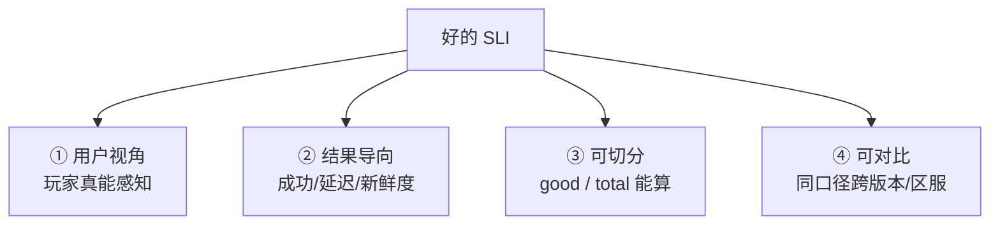
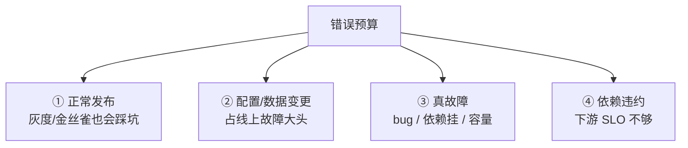
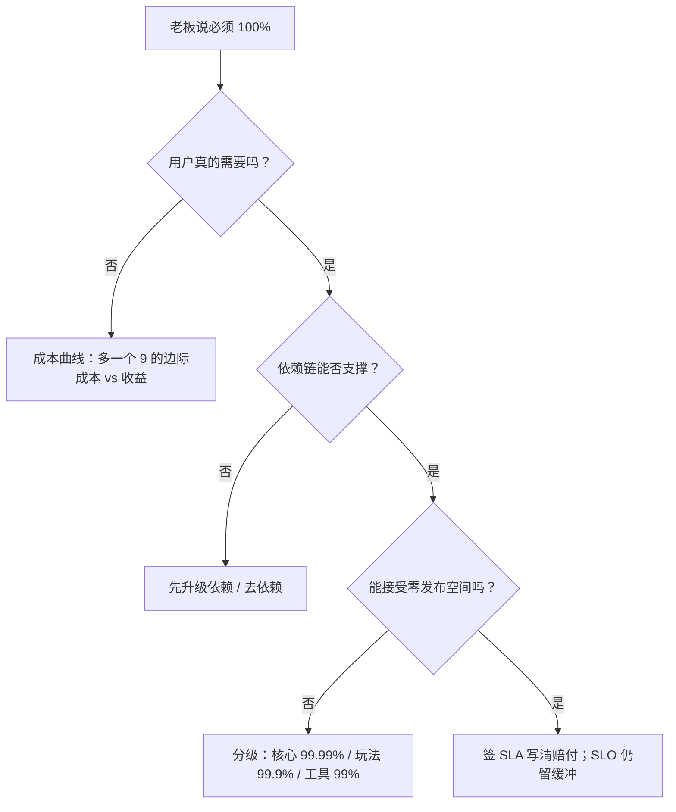

# SLI-SLO与错误预算

> 业务方问「昨晚抖了怎么没告警」，值班翻监控 CPU、成功率都在阈值内；CTO 拍板「今年必须 99.999%」；大版本夜里把整月预算烧光——三种崩溃，根因都是可靠性承诺没签好。
> **本章回答**：一个可靠性承诺从选尺子、定目标、换算预算、花钱、报警、熔断、续约到作战定责，完整一生怎么管。
> **不讲**：告警通道 → [03](../03-告警设计与降噪/)；PromQL 细节 → [02](../02-Prometheus与PromQL/)；故障复盘 → [07](../07-故障管理与复盘/)；高可用架构 → [01-33](../../01-基础底座/33-高可用与容灾/)；游戏稳定性落地 → [07-13](../../07-游戏运维专题/13-游戏SRE稳定性/)。

**标记**：🎯重点 · 🔥难点 · ⭐常考 · 🔧实操
---

## 一、一张图：一个可靠性承诺的一生

> 🎯 **一句话**：SLI/SLO 不是「监控配得更好」，而是「承诺—预算—消费—熔断」的经济契约。


- 📖 **读图**
  - 🛤️ 主线：选用户能感知的尺子 → 定严于合同的目标 → 把「允许坏多少」换成可花的钱 → 看花得快不快 → 花光就冻结 → 按生产数据续约
  - ⚔️ 作战贯穿全程：定责靠 SLO/错误预算把争论翻译成数字，不是靠嗓门（Q1、Q14）

练习题 Q1、Q14。主线有了——先选用户能感知的尺子。

---

## 二、选尺子：SLI 怎么选

> 🎯 **一句话**：SLI 必须是**用户视角的结果指标**，不是「测起来方便」的原因指标。

**SLI（Service Level Indicator，服务水平指标）** = 对服务健康状况的**客观、可量化测量**。它回答「系统表现得怎么样」，不回答「为什么会这样」。

### 📐 三类常用尺子 ⭐

| 类型 | 适合量什么 | 典型 SLI | 别选 |
|------|-----------|----------|------|
| 请求 · 可用性 | API / 登录 / 充值 | 请求成功率（good / total） | 「HTTP 200 占比」（200 里可藏业务失败） |
| 请求 · 延迟 | 响应快慢 | 延迟达标率（P99 / 桶内占比） | 只算平均延迟（尖刺被埋） |
| 批处理 / 异步 | 新鲜度、完成度 | 数据新鲜度、任务成功率 | CPU 利用率当 SLI |

> ⚠️ **别混**：**原因指标 ≠ SLI**。CPU、内存、连接数、磁盘 IO 是排障用的「可能原因」，不是用户感受。SLI 站用户那边看「成没成功、多快完成」。

### 🧮 「好事件 / 总事件」表达式 🔧

几乎所有请求型 SLI 都能写成：

```text
SLI = 好事件数 / 总事件数
```

落到 Prometheus，统一按 **good / total**：

```text
# 请求成功率 SLI
sum(rate(http_requests_total{status=~"2.."}[30d]))
/ sum(rate(http_requests_total[30d]))
# ← 30 天滚动窗口内，2xx 占全部请求的比例

# 延迟达标率 SLI（100ms 内完成的占比）
sum(rate(http_request_duration_seconds_bucket{le="0.1"}[30d]))
/ sum(rate(http_request_duration_seconds_count[30d]))
# ← histogram bucket 天然就是好事件数

# 批处理新鲜度（最近 5 分钟内成功产出的占比）
sum(rate(batch_job_success_timestamp_seconds > bool (time() - 300))[30d])
/ sum(rate(batch_job_total[30d]))
```

> 🔍 **现场**：写 PromQL 先问「好事件怎么从现有指标切出来」。切不出来 → 先补埋点，不是 SLO 算不准。

### 🎮 游戏场景怎么选 🔥

- **登录**：登录请求成功率 + 登录 P99，不是登录服 CPU
- **充值**：下单成功率 + 到账成功率 + 到账延迟（真 revenue，通常最严）
- **匹配 / 对战**：匹配进房率 + 对局掉线率，不是匹配服连接数
- **排行榜 / 邮件 / 活动**：数据新鲜度 + 任务完成率

### 🏁 开服首日与充值三段 🔥⭐

开服首日「流量大、变更多、基数小」——按全区全服算会被老服平均掉，必须按**区服维度**单独看。开服前 72 小时建议给「新服登录 / 创角 / 排队进入」单独设更敏感的一组 SLO。

充值链路拆三段，别只盯一个「充值成功率」：

```text
下单成功率     = 玩家发起充值 → 收到订单响应
支付回调成功率 = 渠道回调 → 我方确认到账
到账延迟达标率 = 确认支付 → 游戏内到账 ≤ N 秒
```

渠道回调 99.99%、到账延迟却高——玩家照样投诉。

> 💡 **打个比方**：SLI 像体检只量血压、心率、血氧，不量「医院空调温度」。空调可能相关，但不是诊断生命的尺子。

> 📝 **面试**：问「游戏 SLO 怎么定」，答「**按用户旅程拆：登录、充值、匹配、新鲜度；新服老服分开；充值拆下单/回调/到账**」。⭐（Q2、Q14）

### 🔑 收束：选尺子的四把钥匙 🎯⭐



- 📖 **读图**：用户视角排除 CPU；结果导向排除连接数；可切分排除「感觉还行」；可对比保证发布前后同一把尺子。

口诀：**用户视角、结果导向、可切分、可对比**。练习题 Q1、Q2。尺子选好了，定几个 9。

---

## 三、定目标：SLO 几个 9

> 🎯 **一句话**：SLO 是**内部目标**，要比 SLA 严，留出违约缓冲；SLA 是合同，违约要赔钱。

**SLO（Service Level Objective）** = 对某个 SLI 要达到的**量化目标**。面试里 80% 的「几个 9」谈的是可用性；延迟达标率、新鲜度也可以签。

### 📏 SLI / SLO / SLA 三者 ⭐🔥

| | **SLI** | **SLO** | **SLA** |
|---|---|---|---|
| 本质 | **测量值** | **内部目标** | **合同 / 违约条款** |
| 例子 | 30 天登录成功率 99.92% | 登录成功率 ≥ 99.95% | 对客可用性 ≥ 99.9%，低于则赔 |
| 违约 | 无 | 问责、发布受限 | 真金白银 |
| 松紧 | 客观结果 | **严于 SLA**，留缓冲 | 对客承诺 |

> ⚠️ **别混**：SLA 是 legally binding；SLO 是 engineering 承诺。SLA 99.9% 时，SLO 常定 99.95% / 99.99%——SLA 违约前内部已拉警报。

> 📝 **面试**：「**SLI 是尺子，SLO 是目标，SLA 是合同；SLO 要比 SLA 严**」。⭐（Q1）

#### ❓ 为什么不定 100%？

100% 不是高尚，是错误目标：

- 📈 **成本指数上升**：99.9% → 99.99% → 99.999%，每多一个 9 边际成本指数级，不是线性
- 👁️ **用户无感**：游戏里 30 秒抖动与「完全没抖」，多数玩家分不清 99.99% 和 100%
- 🚫 **失去发布空间**：100% = 错误预算为 0 = 任何变更都违约

> 💡 **打个比方**：SLO 像家庭娱乐预算。「一分钱都不能花」→ 要么撒谎，要么啥也不敢做。留一点可承受额度，才能过日子。

### 📊 几个 9 的感性对照 ⭐

| SLO | 30 天允许停机 | 适合 |
|---|---|---|
| 99% | 7.2 小时 | 内部工具 |
| 99.9% | 43.2 分钟 | 一般游戏服、普通 API |
| 99.95% | 21.6 分钟 | 充值、核心网关 |
| 99.99% | 4.32 分钟 | 支付、核心账号 |
| 99.999% | 26 秒 | 极少业务真需要 |

> 📝 **面试**：别直接报数字，先问「**中断 1 分钟值多少钱、用户会不会走**」，再结合依赖上限（五节）定。⭐（Q3、Q4）

练习题 Q3、Q4。目标定了，换算成钱。

---

## 四、换算：错误预算是多少钱

> 🎯 **一句话**：错误预算 = 1 − SLO，是窗口内「允许搞砸的时间或请求数」。

### 💰 从 SLO 到预算 🎯⭐

**错误预算（error budget）** = 1 − SLO。把「几个 9」翻译成工程师能花的额度。

以 30 天 = 43,200 分钟：

```text
99.9%  →  0.1%  × 43,200 = 43.2  分钟
99.95% →  0.05% × 43,200 = 21.6  分钟
99.99% →  0.01% × 43,200 = 4.32  分钟
```

按请求数更直观：

```text
总请求 1,000,000：99.9% → 1000 次失败；99.95% → 500；99.99% → 100
总请求 10,000,000：99.99% → 1000 次失败
```

> 📝 **面试**：99.95% 一个月 = **21.6 分钟**；每百万请求：99.95% 允 500、99.99% 允 100。⭐（Q4）

#### ❓ 为什么滚动窗口不是每月 1 号清零？

| 窗口 | 含义 | 优点 | 坑 |
|---|---|---|---|
| **滚动（rolling）** | 永远看过去 30 天，每天滑一格 | 故障影响淡出，发布决策连续 | 月初月末预算不对称 |
| **日历（calendar）** | 按自然月 / 季度重置 | 对齐财务 / OKR | 月初故障立刻烧光整月 |

> ⚠️ **别混**：rolling 不是「1 号清零」。发布前看**过去 30 天累计消耗**，不是本月 1 号以来。

```text
sum(rate(http_requests_total{status!~"2.."}[30d]))
/ sum(rate(http_requests_total[30d]))
# ← [30d] = 30 天滚动窗口
```

练习题 Q5、Q9。预算有了，看花在哪。

---

## 五、花钱：预算被什么花掉

> 🎯 **一句话**：错误预算不只给故障留——发布、变更、依赖降级都会花；关键是知道每一笔花在哪。

### 🧾 四类消费 🎯⭐



- 📖 **读图**：很多团队只把「故障」当消耗；**发布和变更往往是更大头**。SRE 价值之一：把消耗量化，「能不能发」变成数据决策。

### 🚀 发布是预算大户 🔥

典型月度拆分（99.9% = 43.2 分钟）：发布相关 18 分（42%）· 配置变更 12 分（28%）· 代码/容量 8 分（18%）· 下游 5 分（12%）。若 80% 预算花在发布上，优化方向是灰度 / 自动回滚 / 发布窗口，不是「更努力值班」。

> 📝 **面试**：「**把每次发布前后 SLI 变化量化，算出花了多少预算；花超就暂停或回滚**」。

#### ❓ 为什么依赖定了 99.9%，我不能自称 99.99%？

串行强依赖时，整体可用性 ≈ 各段相乘；上限被最弱一环卡住：

```text
自身 99.99% × 依赖 99.9%           ≈ 99.89%
自身 99.99% × 依赖 99.9% × 依赖 99.9% ≈ 99.79%
```

- ❌ 「多冗余就能超过依赖」——串行强依赖相乘，冗余解决不了依赖自己抖
- ✅ 先升级依赖 / 去依赖 / 可降级，再谈自身更高的 9
- 🔀 **并行、可降级、可缓存**的依赖：用「最坏可接受降级面」重算，不是简单相乘

> ⚠️ **别混**：依赖上限说的是**串行强依赖**。降级后仍要定义降级面的 SLI，别把「降级」当免责。

> 📝 **面试**：「先看**依赖链最弱一环**；核心依赖只有 99.9%，自己定 99.999% 是自欺」。⭐（Q7）

### 🔬 测量也会骗人 🔥

- **采样**：只看网关，漏了客户端重试后成功
- **分类**：5xx 全算失败，但部分 503 是客户端限流
- **窗口**：用 1h 窗口看月度 SLO，波动被放大
- **基数太小**：新区一天几百次请求，单次失败就掉 0.1%

> 🔍 **现场**：质疑 SLO 数字，先看 good/total 分母够不够大、分类合不合理。

练习题 Q6、Q7。花钱之外，怎么报警。

---

## 六、报警：burn rate 多窗口

> 🎯 **一句话**：burn rate 看「预算花得多快」，不是「还剩多少」。

### 🔥 burn rate 是什么 🔥⭐

**burn rate（燃烧率）** = 当前错误率 / (1 − SLO)。大白话：现在烧钱速度，是「匀速花完一个月预算」的几倍。

```text
SLO = 99.9%  →  1 − SLO = 0.1%
当前错误率 = 1%  →  burn rate = 1% / 0.1% = 10
# ← 以 10 倍匀速在烧预算
```

> 💡 **打个比方**：预算 1000 块、30 天匀速 ≈ 每天 33 块。burn rate = 14.4 ≈ 一天花 480——不拦两天破产。

#### ❓ 为什么不告「余额低于 20%」？

- 🐢 **太慢**：剩 20% 时可能已烧了好几天，来不及止血
- 📢 **太吵**：月初小故障打到 80%，整月告警响，后面其实没事
- ✅ **看速度**：快燃立刻叫醒；慢燃工作时间处理；间歇尖刺用短窗触发、长窗不触发，避免半夜狼来了

口诀：**余额告警太慢又太吵；burn rate 看速度**。

### ⏱️ 经典多窗口组合 🔧⭐

| 档位 | 短窗口 | 长窗口 | burn rate | 含义 | 响应 |
|---|---|---|---|---|---|
| **快燃** | 1h | 1h | 14.4 | 1h 烧掉 2% 月度预算 | 立刻叫醒 |
| **慢燃** | 6h | 3d | 2 | 3 天烧掉整月 | 工作时间升级 |

更细一档常见：`6h / burn rate 6` → 6h 消耗约 5% 预算。

```text
# burn rate（1h，SLO 99.9%）
(sum(rate(http_requests_total{status!~"2.."}[1h]))
 / sum(rate(http_requests_total[1h])))
/ (1 - 0.999)

# 快燃：错误率 ≥ 14.4 × (1 − SLO)
sum(rate(http_requests_total{status!~"2.."}[1h]))
/ sum(rate(http_requests_total[1h])) >= 14.4 * (1 - 0.999)

# 慢燃：6h 窗口 burn rate ≥ 6
sum(rate(http_requests_total{status!~"2.."}[6h]))
/ sum(rate(http_requests_total[6h])) >= 6 * (1 - 0.999)
```

> 🔍 **现场**：告警里的 SLO 数字要和文档**同源**——别一个写 0.999、一个写 0.9995。

> ⚠️ **别混**：burn rate ≠ 错误率。burn rate = 1 只是「匀速花完」；14.4 才紧急。阈值要乘 `(1 − SLO)`。

> 📝 **面试**：「**多窗口 + 多燃烧率**：短窗高燃烧率叫醒，长窗低燃烧率抓慢性出血；如 1h/14.4 与 6h/6**」。⭐（Q5、Q6）

练习题 Q5、Q6、Q8。烧得快了，熔断政策。

---

## 七、熔断：预算耗尽的处置

> 🎯 **一句话**：预算耗尽不是「这个月运气差」，而是触发**发布冻结**的契约条件。

### 🛑 预算政策三档 ⭐

| 消耗 | 政策 | 动作 |
|---|---|---|
| < 50% | 正常 | 按节奏发布 |
| 50%–100% | 预警 | 新发布额外审批，优先可靠性 |
| ≥ 100% | 熔断 | **发布冻结**，只许可靠性修复与紧急安全补丁 |

冻结三大目的：停继续花预算 · 逼还稳定性债 · 让滚动窗口慢慢恢复。

> 💡 **打个比方**：像信用卡刷爆——不是不发工资，是暂停非必要消费，先还账。

真正紧急的业务可走**例外审批**，材料必须含：剩余预算、预计 SLI 影响、回滚/兜底开关、变更后 24h 专人值守。长期击穿 → 启动 **reliability sprint（可靠性冲刺）** 2–4 周集中还债。

> 📝 **面试**：「**冻结功能发布，只允许可靠性工作；重大变更走例外审批**」。⭐（Q8、Q13）

练习题 Q8、Q10、Q13。熔断外，续约调整。

---

## 八、续约：复盘调整 SLO

> 🎯 **一句话**：SLO 不是刻在石头上的——太松放纵，太紧压垮团队，要按季度用生产数据续约。

### 🔄 什么时候该调

| 现象 | 动作 |
|---|---|
| 连续窗口预算富余 80%+ | 收紧 SLO 或拆更细 SLI |
| 连续窗口被击穿 | 先止血还债，再评估是否放宽 |
| 用户投诉与数字不一致 | **换 SLI**，别只调 SLO |
| 业务形态变了（新开服/玩法/区域） | 按用户旅程重选尺子 |

> ⚠️ **别混**：调 SLO ≠ 换 SLI。尺子错了换尺子；目标错了调目标。别拿「达不到」当借口换一把好达标的尺子。

周期续约会五问：预算花在四类各多少？最大一笔能否提前发现？SLI 是否仍代表用户感受？依赖是否仍是上限？测量误差是否失真？

调 SLO 流程：`① 至少 3 个完整窗口数据 → ② 收紧/放宽的成本与体验 → ③ 产品/研发/SRE 三方签字 → ④ 新 SLO 先观测告警一个窗口，再绑发布政策`。

> 📝 **面试**：「**周期复盘消耗结构，先调 SLI 再调 SLO，别把 SLO 当数字游戏**」。⭐（Q11）

练习题 Q11。续约外——作战定责。

---

## 九、作战：定责决策树

> 🎯 **一句话**：SLI/SLO/错误预算最大的实战价值，是把「谁的责任」变成「数字说了算」。

### 👑 场景一：老板要 100% 🔥⭐



- 📖 **读图**：别直接反驳——用依赖上限 + 成本 + 发布空间三层，把 100% 翻译成不可承受后果，再给分级方案。

> 📝 **面试**：「**100% → 错误预算为 0，任何发布都违约；先看依赖与成本，再给分级 SLO**」。⭐（Q10）

### 🤝 场景二：开发运维互撕发布节奏 ⭐

| 冲突 | 开发说 | 运维说 | 用 SLO 怎么判 |
|---|---|---|---|
| 太频繁 | 需求等不起 | 每次都在烧预算 | **看 burn rate**：快燃限频，慢燃可发 |
| 窗口 | 想白天发 | 只能半夜 | **看变更成功率数据** |
| 回滚慢 | 业务扩大 | 回滚也有风险 | burn rate ≥ 14.4 → **5 分钟内回滚** |
| 新功能 vs 稳定 | 不做就落后 | 做了就崩 | **预算富余做功能，耗尽冻结** |

> 💡 **打个比方**：SLO 是团队共同签的「财务预算」——争的是额度，不是谁更苦。

### 🧨 场景三：开服首日烧光预算 🔥

```text
① 立即止血：停非紧急发布，回滚当天版本
② 单独复盘：开服首日从常规窗口拆出（容量 / 代码 / 配置？）
③ 重新预算：重大开服可设独立窗口；常规月份不为一次开服永久买单
④ 下次改进：压测、容量预案、灰度重评
```

> 📝 **面试**：「**先止血；开服作特殊窗口单独复盘；别让正常月份为一次开服永久买单**」。⭐（Q12）

### ⏱️ 60 秒决策剧本 🔧

```text
① 0–10s   看当前窗口错误预算剩余比例
② 10–30s  看 burn rate：1h / 6h / 3d 有无告警
③ 30–45s  快燃 → 止血+暂停发布；慢燃 → 工作时间处理
④ 45–60s  通知相关方：预算政策触发哪一档、下一步动作
```

练习题 Q10～Q14。

**回到开头**：抖了没告警、要 100%、发布烧光预算——正确剧本是用户视角 SLI → SLO 严于 SLA → 错误预算可花 → burn rate 多窗口 → 预算政策熔断。

---

## 十、收口

### 命令速查 🔧

```text
# 请求成功率 SLI（30d 滚动）
sum(rate(http_requests_total{status=~"2.."}[30d])) / sum(rate(http_requests_total[30d]))

# 延迟达标率（≤100ms 占比）
sum(rate(http_request_duration_seconds_bucket{le="0.1"}[30d])) / sum(rate(http_request_duration_seconds_count[30d]))

# burn rate（1h，SLO 99.9%）
(sum(rate(http_requests_total{status!~"2.."}[1h])) / sum(rate(http_requests_total[1h]))) / (1 - 0.999)

# 快燃 1h / 14.4
sum(rate(http_requests_total{status!~"2.."}[1h])) / sum(rate(http_requests_total[1h])) >= 14.4 * (1 - 0.999)

# 慢燃 6h / 6
sum(rate(http_requests_total{status!~"2.."}[6h])) / sum(rate(http_requests_total[6h])) >= 6 * (1 - 0.999)
```

### 面试锚点

| 问 | 30 秒答 |
|---|---|
| SLI/SLO/SLA？ | 尺子、内部目标、合同；SLO 严于 SLA |
| SLI 怎么选？ | 用户视角结果指标；别选 CPU |
| 为什么不定 100%？ | 成本指数、用户无感、失去发布空间 |
| 错误预算？ | 1 − SLO；99.9%=43.2 分；99.95%=21.6；99.99%=4.32 |
| 按请求？ | 每百万：99.9%→1000；99.95%→500；99.99%→100 |
| 依赖影响？ | 串行相乘；99.9%×99.9%≈99.8% |
| burn rate？ | 错误率/(1−SLO)；看烧得多快 |
| 为何优于余额？ | 急性快发现，慢性不疲劳 |
| 多窗口？ | 1h/14.4 叫醒；6h/6 慢燃 |
| 预算耗尽？ | 发布冻结，只许可靠性工作 |
| 游戏怎么定？ | 登录/充值/匹配分开；充值最严；开服单独评估 |

### 易错一句话对照

- SLI 选 CPU → 原因指标，不是用户视角
- SLO = SLA → SLO 内部目标，要比 SLA 严
- 定 100% 是负责 → 错误预算为 0，变更即违约
- 预算只给故障 → 发布、变更、依赖都会花
- 99.9%→99.99% 只差 0.09% → 成本指数级
- burn rate = 错误率 → 还要除以 (1−SLO)
- 多窗口阈值一样 → 短窗高燃烧率，长窗低燃烧率
- 预算耗尽继续发 → 应冻结
- 依赖 SLO 与我无关 → 串行相乘决定上限
- 换一把好达标的尺子 → 换尺子 ≠ 完成目标
- 滚动窗口每月 1 号清零 → rolling 连续滑动
- 慢燃半夜叫醒 → 慢燃工作时间处理

### 数字墙

> 99.9% = 30 天 **43.2 分钟** · 99.95% = **21.6 分钟** · 99.99% = **4.32 分钟** · 每百万请求：99.9% 允 **1000** · 99.95% 允 **500** · 99.99% 允 **100** · burn rate **14.4** = 1h 烧 **2%** 月度 · burn rate **6** = 6h 烧 **5%** · 串行 99.9%×99.9% ≈ **99.8%**

---

## 合上书

- [ ] **默画主图**：选尺子 → 定目标 → 换算 → 花钱 → 报警 → 熔断 → 续约 → 作战
- [ ] **口述四把钥匙**：用户视角、结果导向、可切分、可对比
- [ ] **口述 SLI/SLO/SLA**：尺子、内部目标、合同；SLO 严于 SLA
- [ ] **默写错误预算**：99.9%/43.2 · 99.95%/21.6 · 99.99%/4.32；每百万失败数
- [ ] **口述为什么不定 100%**：成本、无感、零发布空间
- [ ] **口述依赖上限**：串行相乘，最弱一环定上限
- [ ] **口述 burn rate**：定义；优于余额；1h/14.4 + 6h/6
- [ ] **口述预算政策三档**：<50% / 50–100% / ≥100% 冻结
- [ ] **口述游戏 SLI**：登录/充值/匹配/新鲜度；开服单独看
- [ ] **口述作战**：老板要 100% 的三层反驳 + 分级；互撕时用 burn rate / 预算政策判

下一章：[07 故障管理与复盘](../07-故障管理与复盘/)。告警见 [03](../03-告警设计与降噪/)，PromQL 见 [02](../02-Prometheus与PromQL/)，高可用见 [01-33](../../01-基础底座/33-高可用与容灾/)，游戏稳定性见 [07-13](../../07-游戏运维专题/13-游戏SRE稳定性/)。
