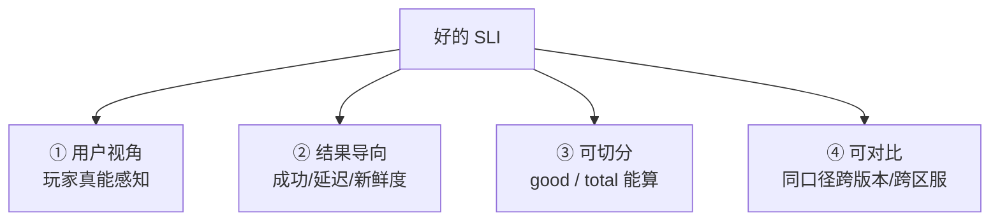
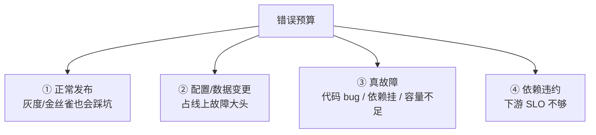
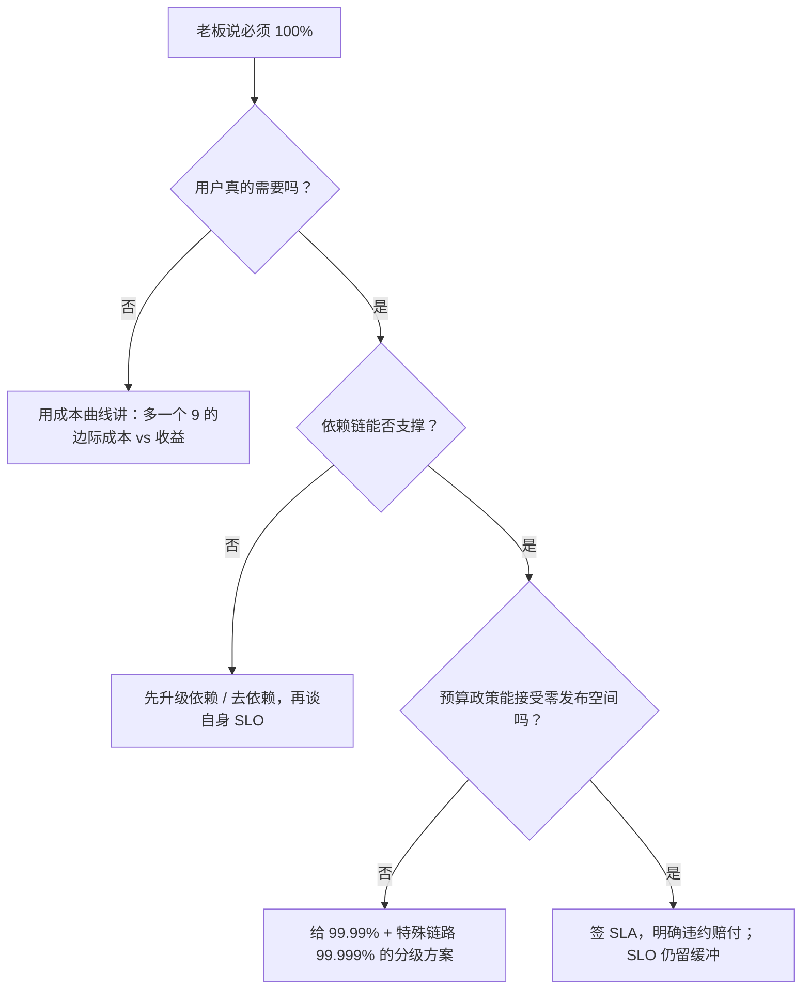

# SLI-SLO与错误预算

> 业务方问「昨晚那么抖怎么没告警」，值班翻监控发现 CPU 和请求成功率都在阈值内；CTO 拍板「今年可用性必须 99.999%」；大版本发布当天夜里又把整月预算烧光——三种崩溃，根因都是可靠性承诺没签好。
> **本章回答**：一个可靠性承诺从「选尺子、定目标、换算、花钱、报警、熔断、续约」到「作战定责」，完整的一生该怎么管。
> **不讲**：告警通道怎么搭 → [03](../03-告警设计与降噪/)；PromQL 语法细节 → [02](../02-Prometheus与PromQL/)；故障复盘流程 → [07](../07-故障管理与复盘/)；高可用架构本体 → [01-33](../../01-基础底座/33-高可用与容灾/)；游戏稳定性落地 → [07-13](../../07-游戏运维专题/13-游戏SRE稳定性/)。

**标记**：🎯重点 · 🔥难点 · ⭐常考 · 🔧实操

---

## 一、一张图：一个可靠性承诺的一生

> 🎯 **一句话**：SLI/SLO 不是「监控配得更好」，而是一套「承诺—预算—消费—熔断」的经济契约。


**读图**：

- 主线是一条承诺的生命周期：先选一把用户能感知的尺子，再定一个内部比合同更严的目标，然后把「允许坏多少」换算成可花的钱，接着监控钱花得快不快，花光了就冻结非可靠性工作，最后按生产数据续约或改目标。
- 作战是贯穿全程的「人事冲突」——定责不是靠嗓门，而是靠 SLO 和错误预算把争论翻译成数字。

---

## 二、选尺子：SLI 怎么选

> 🎯 **一句话**：SLI 必须是**用户视角的结果指标**，而不是「我们测了什么方便」的原因指标。

**SLI（Service Level Indicator，服务水平指标）** = 对服务健康状况的**客观、可量化测量**。它回答「系统表现得怎么样」，不回答「为什么会这样」。

### 三类常用尺子 ⭐

游戏和互联网业务最常见的 SLI 分三类：

| 类型 | 适合量什么 | 典型 SLI | 不选的例子 |
|------|-----------|----------|-----------|
| **请求驱动型 · 可用性** | API / RPC / 登录 / 充值 | 请求成功率（good / total） | 不要选「HTTP 200 占比」当成功率，200 里可能包着业务失败 |
| **请求驱动型 · 延迟** | 响应快慢 | 延迟达标率（P99 或桶内占比） | 不要只算平均延迟，平均会把尖刺埋掉 |
| **批处理 / 异步型** | 数据新鲜度、完成度 | 数据新鲜度、任务成功完成率 | 不要选 CPU 利用率当 SLI |

> ⚠️ **别混**：**原因指标 ≠ SLI**。CPU 高、内存满、连接数多、磁盘 IO 高，都是「可能」导致故障的原因，不是用户感受。SLI 要站用户那边看「请求成没成功、多快完成」。原因指标用来排障，不用来签 SLO。

> 📝 **面试**：问「SLI 怎么选」，答「**从用户旅程里挑结果指标**：请求成不成、多快完成、数据新不新；避开 CPU/内存这类原因指标」。

### 「好事件 / 总事件」表达式 🔧

几乎所有请求型 SLI 都能写成同一套分数：

```text
SLI = 好事件数 / 总事件数
```

落到 Prometheus，统一按 **good / total** 写：

```text
# 请求成功率 SLI
sum(rate(http_requests_total{status=~"2.."}[30d]))
/ sum(rate(http_requests_total[30d]))
# ↑ 30 天滚动窗口内，2xx 请求占全部请求的比例

# 延迟达标率 SLI（100ms 内完成的请求占比）
sum(rate(http_request_duration_seconds_bucket{le="0.1"}[30d]))
/ sum(rate(http_request_duration_seconds_count[30d]))
# ↑ histogram 的 bucket 天然就是好事件数

# 批处理新鲜度 SLI（最近 5 分钟内成功产出的任务占比）
sum(rate(batch_job_success_timestamp_seconds > bool (time() - 300))[30d])
/ sum(rate(batch_job_total[30d]))
# ↑ bool 运算把「成功且新鲜」变成 1/0，再按窗口求率
```

> 🔍 **现场**：写 PromQL 时先问自己「好事件怎么从现有指标里切出来」。如果切不出来，说明指标埋点要先补，不是 SLO 算不准。

### 游戏场景的 SLI 选法 🔥

游戏不是纯 HTTP 业务，尺子要按用户旅程挑：

- **登录链路**：选「登录请求成功率」+「登录 P99 延迟」，而不是「登录服 CPU」。
- **充值链路**：选「充值下单成功率」+「到账成功率」+「到账延迟」，这是真 revenue，SLO 通常最严。
- **匹配 / 对战**：选「匹配成功进入房间率」+「对局内掉线率」，而不是「匹配服连接数」。
- **排行榜 / 邮件 / 活动**：选「数据新鲜度」（例如排行榜上次刷新距现在多久）+「任务完成率」。

### 开服首日与充值链路的 SLI/SLO 🔥⭐

游戏里有两种场景特别容易把 SLO 定错：**开服首日**和**充值链路**。

**开服首日**的特征是「流量大、变更多、基数小」。按全区全服算成功率会被老服平均掉，必须按**区服维度**单独看 SLI。建议开服前 72 小时把「新服登录成功率」「创角成功率」「排队进入成功率」单独设一组更敏感的 SLO，而不是复用全服大盘。

**充值链路**是游戏里最不能抖的链路。SLI 要拆三段：

```text
下单成功率   = 玩家发起充值 → 收到订单响应
支付回调成功率 = 渠道回调 → 我方确认到账
到账延迟达标率 = 从玩家确认支付到游戏内到账 ≤ N 秒
```

三段都要分别设 SLO，不要只盯一个「充值成功率」。因为渠道回调可能 99.99%，但游戏内到账延迟高，玩家一样会投诉。

> 📝 **面试**：问「游戏 SLO 怎么定」，答「**按用户旅程拆：登录、充值、匹配、数据新鲜度；新服和老服分开看，充值要拆下单/回调/到账三段**」。

> 💡 **打个比方**：SLI 像是给玩家体验做体检时只量「血压、心率、血氧」，不量「医院空调温度」。空调可能相关，但它不是诊断生命的尺子。

### 收束：选尺子的四把钥匙 🎯⭐

面试常让「举一个你定过的 SLI」。用这四把钥匙检查：



**读图**：用户视角排除 CPU；结果导向排除连接数；可切分排除「感觉还行」；可对比保证这次发布能用同一把尺子看出是变好了还是变坏了。

---

## 三、定目标：SLO 几个 9

> 🎯 **一句话**：SLO 是**内部目标**，要比 SLA 严格，留出违约缓冲；SLA 是合同，违约要赔钱。

**SLO（Service Level Objective）** 是对某个 SLI 要达到的**量化目标**。最常见的 SLO 维度是**可用性（availability）**——系统可对外正常提供服务的时间或请求比例。延迟达标率、数据新鲜度也可以签 SLO，但面试里 80% 的「几个 9」都在谈 availability。

### SLI / SLO / SLA 三者区别 ⭐🔥

这是最高频的面试题，三者不能混：

| | **SLI** | **SLO** | **SLA** |
|---|---|---|---|
| 本质 | **测量值** | **内部目标** | **合同 / 违约条款** |
| 举个例子 | 过去 30 天登录成功率 99.92% | 登录成功率目标 ≥ 99.95% | 向客户承诺可用性 ≥ 99.9%，低于则赔偿 |
| 违约后果 | 没有 | 团队被问责、发布受限 | 真金白银/客户赔付 |
| 松紧关系 | 客观结果 | **要比 SLA 严**，给违约留缓冲 | 对客承诺 |

> ⚠️ **别混**：SLA 是「对外 legally binding 的承诺」，SLO 是「对内 engineering 的承诺」。如果 SLA 是 99.9%，SLO 通常定 99.95% 或 99.99%，这样 SLA 违约前内部已经拉警报了。

> 📝 **面试**：一句话口径——「**SLI 是尺子，SLO 是目标，SLA 是合同；SLO 要比 SLA 严，留出缓冲，别拿 SLA 当内部目标用**」。

### 为什么不定 100%？🔥⭐

100% 不是高尚，是错误目标，原因有三：

1. **成本指数上升**：从 99.9% 到 99.99% 再到 99.999%，每多一个 9 的边际成本不是线性，而是指数级。多出来的那 0.09% 可能要多花几倍的冗余、压测、灰度、回滚能力。
2. **用户感知不到**：用户区分不了 99.99% 和 100%，尤其是在游戏场景里，一次 30 秒的抖动和完全没抖动对大多数玩家体验差异极小。
3. **失去发布空间**：100% 意味着错误预算为 0，任何发布、任何变更都直接违约。没有预算，就没有创新空间。

> 💡 **打个比方**：SLO 像家庭月度娱乐预算。定成「一分钱都不能花」的家庭，要么撒谎，要么啥也不敢做。留一点可承受的额度，才能正常过日子。

### 几个 9 的感性对照 ⭐

| SLO | 30 天允许停机 | 适合什么业务 |
|---|---|---|
| 99% | 7.2 小时 | 内部工具、非核心后台 |
| 99.9% | 43.2 分钟 | 一般游戏服、普通 API |
| 99.95% | 21.6 分钟 | 充值链路、核心网关 |
| 99.99% | 4.32 分钟 | 支付、核心账号服务 |
| 99.999% | 26 秒 | 极少业务真需要 |

> 📝 **面试**：被问到「我们定几个 9」，不要直接报数字，先问「**这个链路中断 1 分钟值多少钱、用户会不会走**」，再结合依赖上限（五节）定。

---

## 四、换算：错误预算是多少钱

> 🎯 **一句话**：错误预算 = 1 − SLO，是这一个月内「允许搞砸的时间或请求数」。

### 从 SLO 到预算 🎯⭐

**错误预算（error budget）** = 1 − SLO。它是把抽象的「几个 9」翻译成工程师能看懂、能花的额度。

以 30 天 = 43,200 分钟为窗口：

```text
99.9%  →  允许不可用 0.1% × 43,200 分钟 = 43.2  分钟
99.95% →  允许不可用 0.05% × 43,200 分钟 = 21.6 分钟
99.99% →  允许不可用 0.01% × 43,200 分钟 = 4.32 分钟
```

按请求数换算更直观：

```text
假设 30 天总请求 = 1,000,000 次
99.9%  →  允许失败 1,000 次
99.95% →  允许失败 500  次
99.99% →  允许失败 100  次

假设 30 天总请求 = 10,000,000 次
99.99% →  允许失败 1,000 次
```

> 📝 **面试**：面试官让「算一下 99.95% 一个月允许多少不可用」，直接背 21.6 分钟；让「每百万请求允许多少失败」，答 500 次（99.95%）或 100 次（99.99%）。

### 滚动窗口 vs 日历窗口 🔥

预算窗口有两种吃法：

| 窗口类型 | 含义 | 优点 | 缺点 |
|---|---|---|---|
| **滚动窗口（rolling window）** | 永远看过去 30 天，每天滑一格 | 故障影响持续但慢慢淡出，发布决策更连续 | 月初月末预算不对称 |
| **日历窗口（calendar window）** | 按自然月 / 季度重置 | 和财务周期、OKR 对齐 | 月初故障会立刻烧光整月预算 |

> ⚠️ **别混**：滚动窗口不是「每个月 1 号清零」。用 rolling window 时，**发布前要看过去 30 天累计消耗**，不是看本月 1 号以来。

在 PromQL 里，rolling window 就是一个 range vector：

```text
sum(rate(http_requests_total{status!~"2.."}[30d]))
/ sum(rate(http_requests_total[30d]))
# ↑ [30d] 就是 30 天滚动窗口，每天向后滑一天
```

---

## 五、花钱：预算被什么花掉

> 🎯 **一句话**：错误预算不是只给故障留的，发布、变更、依赖降级都会花预算——关键是知道每一笔花在哪。

### 四类消费 🎯⭐



**读图**：很多团队只把「故障」当预算消耗，其实 **发布和变更是更大头**。SRE 的核心价值之一，就是把这些消耗量化出来，让「能不能发布」变成数据决策。

### 发布和变更也是预算大户 🔥

把预算消耗按来源拆分后，最常见的情况是：

| 来源 | 耗时 | 占比 |
|------|------|------|
| 发布相关灰度失败 / 回滚 | 18 分钟 | 42% |
| 配置 / 数据变更 | 12 分钟 | 28% |
| 线上代码 bug / 容量不足 | 8 分钟 | 18% |
| 下游依赖抖动 | 5 分钟 | 12% |
| **月度合计（99.9%）** | **43.2 分钟** | **100%** |

这个结构说明**发布流程本身就是最大的风险敞口**。如果 80% 的预算都花在发布上，优化方向不是「更努力值班」，而是「更完善的灰度、自动回滚、发布窗口」。

> 📝 **面试**：问「错误预算怎么指导发布」，答「**把每次发布前后的 SLI 变化量化，算出这次发布花了多少预算，花超了就暂停或回滚**」。

### 依赖的 SLO 决定你的上限 ⭐🔥

服务 A 依赖服务 B，串行调用时，整体可用性 ≈ A 的可用性 × B 的可用性。

```text
自身 SLO 99.99% × 依赖 SLO 99.9% ≈ 99.89%
自身 SLO 99.99% × 依赖 SLO 99.9% × 依赖 99.9% ≈ 99.79%
```

> 📝 **面试**：被问「为什么我不能定 99.999%」，答「先看**依赖链上最弱一环**。如果核心依赖只有 99.9%，你自己定 99.999% 就是自欺欺人」。

> ⚠️ **别混**：依赖上限说的是**串行强依赖**。如果是并行、可降级、可缓存的依赖，整体影响要用「最坏可接受降级面」重新算，不是简单相乘。

### 误差：测量本身也会骗人 🔥

SLI 算不准，SLO 就假。常见误差来源：

- **采样误差**：只统计了网关日志，漏了客户端重试后成功的请求。
- **分类误差**：把 5xx 全算失败，但某些 503 是客户端限流触发的，不是服务问题。
- **时间窗口误差**：用 1 小时窗口看月度 SLO，波动被放大。
- **基数太小**：新区服一天只有几百次请求，单次失败就能让成功率掉 0.1%。

> 🔍 **现场**：质疑一个 SLO 数字时，先看「好事件 / 总事件」的分母是不是够大、分类是不是合理。

---

## 六、报警：burn rate 多窗口

> 🎯 **一句话**：burn rate 告警看的是「预算花得多快」，不是「还剩多少」。

### burn rate 是什么 🔥⭐

**burn rate（燃烧率）** = 当前错误率 / (1 − SLO)。它回答「预算正以多少倍于匀速的速度被烧掉」。

```text
SLO = 99.9%  →  1 − SLO = 0.1%
当前错误率 = 1%  →  burn rate = 1% / 0.1% = 10
含义：现在烧预算的速度是「匀速花完一个月预算」的 10 倍
```

> 💡 **打个比方**：错误预算是 1000 块钱，30 天花完是匀速每天花 33 块。burn rate = 14.4 相当于一天花 480 块——不拦的话两天就破产。

### 为什么 burn rate 优于余额告警 🔥

按「余额低于 20%」告警有两个坑：

1. **太慢**：等余额只剩 20% 时，可能已经烧了好几天，来不及止血。
2. **太吵**：月初一个小故障把余额打到 80%，整个月都在告警，但后面其实不会再出事。

burn rate 按「速度」告警：

- **快速燃烧**：短时间大量出错 → 立刻叫醒人。
- **慢速燃烧**：长时间小比例出错 → 工作时间处理即可。
- **间歇燃烧**：偶发尖刺 → 短窗口触发、长窗口不触发，避免半夜狼来了。

### 经典多窗口组合 🔧⭐

Google SRE 书里推荐的多窗口多燃烧率策略是实际落地标准。常见两档：

| 告警档位 | 短窗口 | 长窗口 | burn rate | 预算消耗含义 | 响应方式 |
|---|---|---|---|---|---|
| **快燃** | 1 小时 | 1 小时 | 14.4 | 1 小时烧掉 2% 月度预算 | 立即叫醒，紧急止血 |
| **慢燃** | 6 小时 | 3 天 | 2 | 3 天烧掉整月预算 | 工作时间升级，暂停发布 |

更精细的版本会再加一档：

```text
· 1h 窗口 burn rate 14.4  →  1 小时消耗 2% 预算
· 6h 窗口 burn rate 6     →  6 小时消耗 5% 预算（约等于一天烧 20%）
```

> 📝 **面试**：问「burn rate 告警怎么配」，答「**多窗口 + 多燃烧率**：短窗口高燃烧率叫醒人，长窗口低燃烧率发现慢性出血；例如 1h/14.4 和 6h/6 的组合**」。

### PromQL 落地 🔧

```text
# 错误率
(
  sum(rate(http_requests_total{status!~"2.."}[1h]))
  / sum(rate(http_requests_total[1h]))
)
/
(1 - 0.999)  # 对应 99.9% SLO
# ↑ burn rate = 当前错误率 / 可接受错误率

# 多窗口快燃告警（1h 窗口，burn rate ≥ 14.4）
(
  sum(rate(http_requests_total{status!~"2.."}[1h]))
  / sum(rate(http_requests_total[1h]))
) >= 14.4 * (1 - 0.999)
# 含义：1 小时内错误率达到 1.44%，等于以 14.4 倍速度烧预算

# 慢燃告警（6h 窗口，burn rate ≥ 6）
(
  sum(rate(http_requests_total{status!~"2.."}[6h]))
  / sum(rate(http_requests_total[6h]))
) >= 6 * (1 - 0.999)
```

> 🔍 **现场**：告警表达式里的 SLO 值要和 SLO 文档里的数字**同源**，不要一个写 0.999、一个写 0.9995。否则告警和报表对不上，值班会被搞疯。

> ⚠️ **别混**：burn rate 不是「错误率」。burn rate = 1 意味着错误率刚好等于 SLO 允许的错误率；burn rate = 14.4 才是紧急。告警阈值要乘 `(1 - SLO)`。

---

## 七、熔断：预算耗尽的处置

> 🎯 **一句话**：预算耗尽不是「这个月运气差」，而是触发**发布冻结**的契约条件。

### 预算政策（budget policy）⭐

**预算政策** = 错误预算花到多少时该干什么。常见三档：

| 消耗比例 | 政策 | 动作 |
|---|---|---|
| < 50% | 正常 | 按节奏发布 |
| 50%–100% | 预警 | 新发布需额外审批，优先做可靠性工作 |
| ≥ 100% | 熔断 | **发布冻结**，只许做可靠性修复和紧急安全补丁 |

> 📝 **面试**：问「错误预算耗尽怎么办」，答「**冻结功能发布，只允许可靠性工作，重大变更走例外审批**」。

### 发布冻结不是惩罚 🔥

冻结功能发布有三大目的：

1. **停止继续花预算**：新功能引入的未知风险是当前最该避免的。
2. **逼团队还债**：把积压的稳定性债务（监控补全、灰度完善、依赖治理）清零。
3. **保护下一个窗口**：让 SLO 在滚动窗口里慢慢恢复，否则下个月一开局就欠债。

> 💡 **打个比方**：预算政策像信用卡额度。刷爆了不是不发工资，而是这张卡暂停非必要消费，先还账。

### 例外审批与可靠性冲刺

真正紧急的业务需求（例如合规、活动 deadline）可以走**例外审批**，但审批材料必须包括：

- 当前预算剩余多少；
- 该变更对 SLI 的预计影响；
- 回滚方案与兜底开关；
- 变更后 24 小时内专人值守。

预算长期被击穿，说明 SLO 定得太松或技术债太重，要启动 **reliability sprint（可靠性冲刺）**：集中 2–4 周专门做稳定性改造，而不是在日常排期里挤牙膏。

---

## 八、续约：复盘调整 SLO

> 🎯 **一句话**：SLO 不是刻在石头上的，要根据真实生产数据按季度「续约」——太松放纵，太紧压垮团队。

### 什么时候该调 SLO

| 现象 | 说明 | 动作 |
|---|---|---|
| 连续多个窗口预算富余 80% 以上 | 目标定得太松，用户可能已在流失 | 收紧 SLO 或拆出更细粒度 SLI |
| 连续多个窗口预算被击穿 | 目标定得太紧或技术债太重 | 先止血还债，再评估是否放宽 |
| 用户投诉和 SLO 数字不一致 | SLI 没量到用户真痛点 | 换 SLI，别只调 SLO |
| 业务形态变了 | 新开服、新玩法、新区域 | 重新按用户旅程选尺子 |

> ⚠️ **别混**：调 SLO 和调整 SLI 是两件事。SLI 是尺子，尺子错了换尺子；SLO 是目标，目标错了调目标。不要拿「目标达不到」当借口换一把容易达标的尺子。

### 复盘要问什么

每个 SLO 周期结束，开一次「续约会」：

1. **预算花在哪四类**？发布 / 变更 / 故障 / 依赖各占多少？
2. **哪次消耗最大**？是否可提前发现？
3. **SLI 是否还代表用户感受**？有没有新链路没覆盖？
4. **依赖的 SLO 是否还是上限**？下游有没有升级/降级空间？
5. **误差来源**是否让数字失真？

> 📝 **面试**：问「SLO 怎么持续改进」，答「**周期复盘预算消耗结构，先调 SLI 再调 SLO，别把 SLO 当数字游戏**」。

### SLO 变更不是拍脑袋 🔥

调 SLO 必须有数据支撑，建议走一个小流程：

```text
① 数据收集：至少看 3 个完整窗口的预算消耗和 SLI 分布
② 影响分析： tighter SLO 会增加多少运维成本、放宽会影响多少用户体验
③ 相关方确认：产品、研发、SRE 三方签字，不能 SRE 自己偷偷改
④ 灰度生效：新 SLO 先用于观测和告警，过一个窗口后再绑发布政策
```

> ⚠️ **别混**：SRE 不要为了 KPI 把 SLO 改得很松，业务方也不要为了「好看」把 SLO 定得很严但不给资源。SLO 是团队共同签的契约，改一次就要重签一次。

---

## 九、作战：定责决策树

> 🎯 **一句话**：SLI/SLO/错误预算最大的实战价值，是把「谁的责任」变成「数字说了算」。

### 场景一：老板要 100% 可用性 🔥⭐



**读图**：不要直接反驳老板，而是用「依赖上限 + 成本 + 发布空间」三层问题把 100% 翻译成不可承受的后果。最终可以给出分级方案：核心充值链路 99.99%，普通玩法 99.9%，内部工具 99%。

> 📝 **面试**：被问「老板要 100% 怎么办」，答「**100% 会让错误预算为 0，任何发布都违约；先看依赖链上限和成本曲线，再给出分级 SLO 方案**」。

### 场景二：开发和运维互撕发布节奏 ⭐

| 冲突点 | 开发说 | 运维说 | 用 SLO 怎么判 |
|---|---|---|---|
| 发布太频繁 | 需求等不起 | 每次发布都在烧预算 | **看 burn rate**：快燃就限频，慢燃可正常发 |
| 发布窗口 | 想白天发 | 只能半夜发 | **看变更成功率数据**：白天失败率高就继续半夜；数据好就逐步白天 |
| 回滚太慢 | 业务影响扩大 | 回滚也有风险 | **看 SLO 消耗速度**：burn rate ≥ 14.4 必须 5 分钟内回滚 |
| 新功能 vs 稳定性 | 不做就落后 | 做了就崩 | **错误预算富余时做新功能，耗尽时冻结** |

> 💡 **打个比方**：SLO 像是团队共同签署的「财务预算」。开发想花钱、运维想省钱，争的是预算额度，不是谁更苦。预算有富余就花，花光了就停——这比「凭经验觉得能发」公正得多。

### 场景三：开服首日把预算烧光了 🔥

开服首日登录成功率掉到 98%，2 小时就把整月预算花光。此时不是「这个月完蛋了」，而是进入预算政策：

```text
① 立即止血：停止所有非紧急发布，回滚当天已发布版本
② 单独复盘：把「开服首日」从常规窗口里拆出来，看是容量、代码还是配置问题
③ 重新预算：重大开服可以设一个「独立窗口」或临时提高观察粒度，但常规月份不为此买单
④ 下次改进：压测数据、容量预案、灰度策略要重新评估
```

> 📝 **面试**：问「开服首日把 SLO 击穿了怎么办」，答「**先止血，把开服作为一个特殊窗口单独复盘，不要让正常月份的预算为一次开服事故永久买单**」。

### 60 秒决策剧本 🔧

```text
① 0–10s  看当前 SLO 窗口内错误预算剩余比例
② 10–30s 看 burn rate：1h/6h/3d 三窗口有没有告警
③ 30–45s 判定是快燃（立即止血 + 暂停发布）还是慢燃（工作时间处理）
④ 45–60s 通知相关方：预算政策触发哪一档，下一步动作是什么
```

---

## 十、收口

### 命令速查 🔧

```text
# 请求成功率 SLI（30 天滚动窗口）
sum(rate(http_requests_total{status=~"2.."}[30d])) / sum(rate(http_requests_total[30d]))

# 延迟达标率 SLI（P99 在 100ms 内占比）
sum(rate(http_request_duration_seconds_bucket{le="0.1"}[30d])) / sum(rate(http_request_duration_seconds_count[30d]))

# burn rate（1h 窗口，SLO 99.9%）
(sum(rate(http_requests_total{status!~"2.."}[1h])) / sum(rate(http_requests_total[1h]))) / (1 - 0.999)

# 多窗口快燃告警条件（1h 窗口 burn rate ≥ 14.4）
sum(rate(http_requests_total{status!~"2.."}[1h])) / sum(rate(http_requests_total[1h])) >= 14.4 * (1 - 0.999)

# 慢燃告警条件（6h 窗口 burn rate ≥ 6）
sum(rate(http_requests_total{status!~"2.."}[6h])) / sum(rate(http_requests_total[6h])) >= 6 * (1 - 0.999)
```

### 面试锚点

| 问 | 30 秒答 |
|---|---|
| SLI/SLO/SLA 什么区别？ | SLI 是尺子，SLO 是内部目标，SLA 是合同；SLO 要比 SLA 严。 |
| SLI 怎么选？ | 用户视角、结果导向，常见可用性/延迟/新鲜度；别选 CPU。 |
| 为什么不定 100%？ | 成本指数上升、用户无感、失去发布空间。 |
| 错误预算怎么算？ | 1 − SLO；99.9% 30 天 = 43.2 分钟；99.95% = 21.6 分钟；99.99% = 4.32 分钟。 |
| 按请求数怎么算？ | 每百万请求：99.9% 允许 1000 次失败；99.95% 500 次；99.99% 100 次。 |
| 依赖对 SLO 的影响？ | 串行依赖可用性相乘；99.9% × 99.9% ≈ 99.8%。 |
| burn rate 是什么？ | 当前错误率 / (1 − SLO)，表示预算烧得多快。 |
| 为什么 burn rate 比余额告警好？ | 能快速发现急性出血，同时避免慢性余额告警疲劳。 |
| 多窗口组合怎么配？ | 短窗口高燃烧率叫醒，如 1h/14.4；长窗口低燃烧率发现慢燃，如 6h/6。 |
| 预算耗尽怎么办？ | 发布冻结，只允许可靠性工作，例外需审批。 |
| 游戏场景 SLO 怎么定？ | 登录/充值/匹配分开定；充值最严；按开服首日和新区域单独评估。 |

### 易错一句话对照

- SLI 选 CPU 利用率 → 原因指标，不是用户视角。
- SLO 等于 SLA → SLO 是内部目标，要比 SLA 严。
- 定 100% 是认真负责 → 错误预算为 0，任何变更都违约。
- 错误预算只给故障留 → 发布、变更、依赖降级都会花预算。
- 99.9% 到 99.99% 只差 0.09% → 成本是指数级，不是线性。
- burn rate 就是错误率 → 还要除以 (1 − SLO)。
- 多窗口告警阈值一样 → 短窗口配高燃烧率，长窗口配低燃烧率。
- 预算耗尽继续发版 → 违反预算政策，应冻结发布。
- 依赖的 SLO 与我无关 → 串行依赖可用性相乘，它决定你的上限。
- SLO 不变、SLI 随便换 → 换尺子不等于完成目标。
- 滚动窗口每月 1 号清零 → rolling window 是连续滑动的。
- 慢燃告警半夜叫醒 → 慢燃工作时间处理即可，别设置同样叫醒级别。

### 数字墙

> 99.9% = 30 天 **43.2 分钟** · 99.95% = 30 天 **21.6 分钟** · 99.99% = 30 天 **4.32 分钟** · 每百万请求：99.9% 允许 **1000** 次失败 · 99.95% 允许 **500** 次 · 99.99% 允许 **100** 次 · burn rate **14.4** = 1 小时烧 **2%** 月度预算 · burn rate **6** = 6 小时烧 **5%** 月度预算 · 串行 99.9% × 99.9% ≈ **99.8%**

---

## 合上书

- [ ] **默画一节的主图**：选尺子 → 定目标 → 换算 → 花钱 → 报警 → 熔断 → 续约 → 作战。
- [ ] **口述 SLI 四把钥匙**：用户视角、结果导向、可切分、可对比；分别排除 CPU/连接数/感觉还行/口径不一。
- [ ] **口述 SLI/SLO/SLA 区别**：尺子、内部目标、合同；SLO 要比 SLA 严。
- [ ] **默写错误预算换算**：99.9%/43.2 分钟、99.95%/21.6 分钟、99.99%/4.32 分钟；每百万请求对应失败数。
- [ ] **口述为什么不定 100%**：成本指数上升、用户感知不到、失去发布空间。
- [ ] **口述依赖上限**：串行依赖可用性相乘，依赖 SLO 决定自身 SLO 上限。
- [ ] **口述 burn rate**：定义 = 错误率 / (1 − SLO)；为什么比余额告警好；经典多窗口组合 1h/14.4 + 6h/6 的含义。
- [ ] **口述预算政策三档**：小于 50% 正常发布、50%–100% 审批收紧、≥100% 发布冻结。
- [ ] **口述游戏场景 SLI/SLO**：登录/充值/匹配/数据新鲜度怎么分，开服首日和新区域怎么单独看。
- [ ] **口述作战决策树**：老板要 100% 时怎么用依赖/成本/发布空间三层反驳并给出分级方案；开发运维互撕时怎么用 burn rate 和预算政策判发布节奏。

下一章：[07 故障管理与复盘](../07-故障管理与复盘/)。告警落地见 [03](../03-告警设计与降噪/)，PromQL 见 [02](../02-Prometheus与PromQL/)，高可用本体见 [01-33](../../01-基础底座/33-高可用与容灾/)，游戏稳定性见 [07-13](../../07-游戏运维专题/13-游戏SRE稳定性/)。
