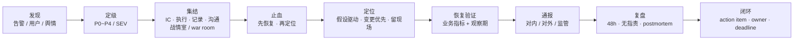
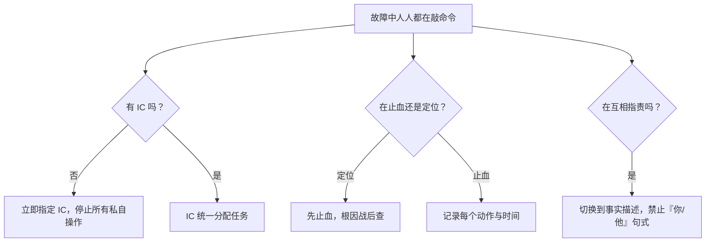
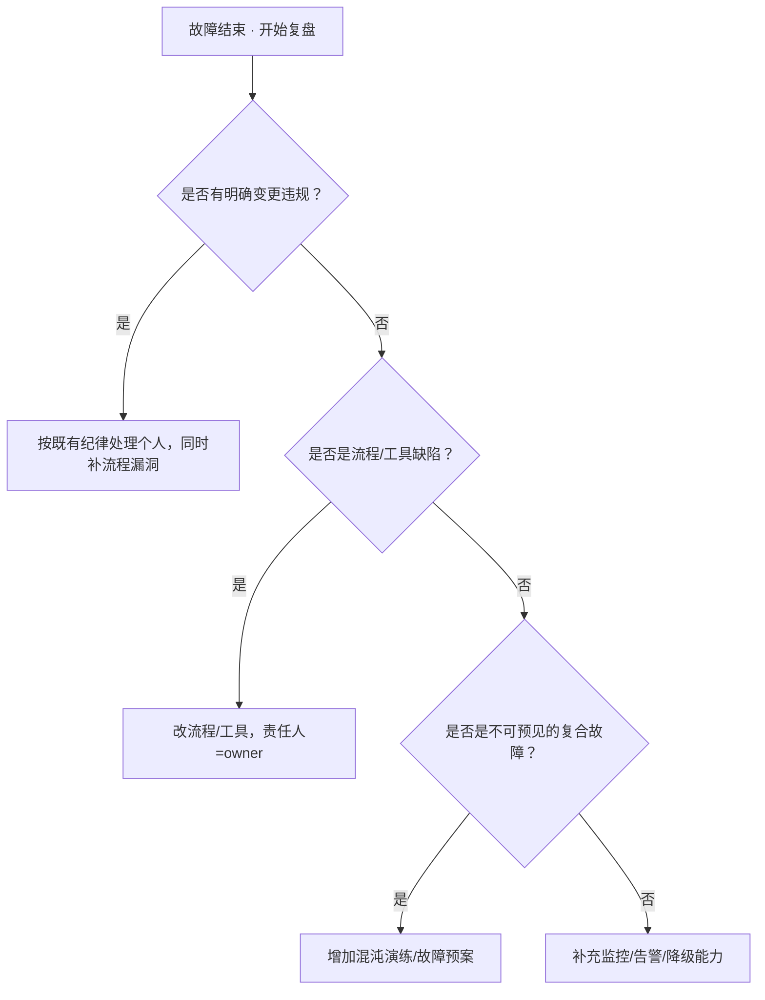

# 故障管理与复盘

> 凌晨 3 点告警狂响，值班同学同时被老板、客服、玩家三方@；有人开始回滚，有人开始翻日志，有人打电话喊人——但没人说「现在谁指挥」。
> **本章回答**：一次故障从被发现到彻底闭环会经历哪些阶段，每个阶段该谁决策、先做什么、怎么留下证据、怎么让改进项真正落地。
> **不讲**：具体排障命令与技术细节 → 主机/网络/中间件/K8s/游戏专项各章；告警设计本身 → [03](../03-告警设计与降噪/)；发布与回滚技术 → [04-04 CI/CD](../../04-工程化与自动化/04-CI-CD/)；K8s 故障剧本 → [03-18](../../03-Kubernetes/18-典型故障剧本/)；游戏 SRE 稳定性 → [07-13](../../07-游戏运维专题/13-游戏SRE稳定性/)；高可用与容灾 → [01-33](../../01-基础底座/33-高可用与容灾/)；SLO 与错误预算 → [06](../06-SLI-SLO与错误预算/)。

**标记**：🎯重点 · 🔥难点 · ⭐常考 · 🔧实操

---

## 一、一张图：一次故障的一生

> 🎯 **一句话**：故障不是「修好就完了」，它有一条命——发现、定级、集结、止血、定位、恢复验证、通报、复盘、闭环——漏一段就会埋雷。



**读图**：

- 主线就是「一次故障的一生」。每个阶段有且只有一个核心任务：发现阶段别定级，止血阶段别定位，复盘阶段别追责。
- 前半程（发现→恢复验证）只争朝夕，目标是**缩短 MTTR**；后半程（通报→复盘→闭环）目标是**把经验变成资产**。
- 图上任何一截断开，都会让下一次故障从头再来一遍。

---

## 二、发现：谁第一个喊

> 🎯 **一句话**：故障的发现源决定你最初的判断半径——告警讲指标，用户讲体感，舆情讲规模。

三类发现源没有高下，只有信息半径不同：

- **监控告警**：最先发现**系统侧异常**，但可能漏业务体感（CPU 掉了登录没掉，或 CPU 正常但玩家充不上钱）。
- **用户/客服反馈**：最接近**业务真实影响**，但样本偏差大——先喊的往往是嗓门大的那批。
- **舆情/社交媒体**：扩散最快，常常说明**影响面已经失控**。

好的告警体系要覆盖**黄金指标**：流量、错误、延迟、饱和度。但再完善的监控也替代不了用户反馈通道，因为业务逻辑的错误（比如掉落率配错、奖励不发）可能所有 infra 指标都正常。

告警设计永远面临**误报与漏报**的权衡：太灵敏会制造告警疲劳，让 oncall 麻木；太迟钝会拖长 MTTD。解决方式不是调阈值调到一个完美点，而是分层：P0/P1 用高置信度症状告警，P2/P3 用趋势告警，用户反馈和舆情作为补充发现源。

发现阶段要做**交叉验证**：告警说 CPU 高，用户说登录慢，舆情说某个区进不去——三者的交集往往就是真实故障域；三者不重合，则可能只是独立事件。最容易犯的错：在群里看到一张截图就下结论。正确动作是**记录发现时间、来源、最初现象**，为后面的时间线（timeline）留下第一块拼图。

> 📝 **面试**：问「为什么监控没告警但用户先炸」，答「**告警基于可采集的指标，用户基于业务体感；两者不是包含关系**。好告警要覆盖黄金指标（流量/错误/延迟/饱和度），但永远要留一条用户反馈的入口」。

> 🔧 **现场**：oncall 同学收到告警后，前 3 分钟只做三件事——确认告警非误报、在 war room 群里报「已接管」、贴出最初的现象与时间戳。不要急着定位，先把发现源固定下来。

---

## 三、定级：P0~P4 怎么划

> 🎯 **一句话**：故障分级不是「这事有多严重」的口水仗，而是看「影响面 × 影响时长 × 业务关键度」的量化口径。

### 故障分级标准（游戏场景版）⭐🔥

| 级别 | 别称 | 影响面 | 时长口径 | 游戏场景例子 |
|------|------|--------|----------|--------------|
| **P0** | 重大事故 | 全服核心功能不可用 / 大量收入损失 | 任意时长都需要立即响应 | 全服登录失败、全服充值链路中断、核心玩法无法匹配 |
| **P1** | 严重故障 | 主要功能严重受损 / 部分服不可用 | ≥30 min 即升级 | 某大区无法登录、排行榜/公会系统整体异常 |
| **P2** | 一般故障 | 单服或单模块功能异常 / 体验受损 | ≥1 h 未恢复需重点关注 | 单服聊天频道异常、某个副本匹配变慢 |
| **P3** | 轻微故障 | 局部体验问题 / 非核心功能抖动 | 可排期处理 | 某个活动页面加载慢、少量玩家收到重复邮件 |
| **P4** | 提示/隐患 | 有潜在风险但未影响用户 | 跟踪即可 | 磁盘容量告警、某实例健康检查偶发失败 |

> ⚠️ **别混**：**P 级（Priority）是国内常用叫法，SEV（Severity）是国外/SRE 圈常用叫法**，两者不是严格一一映射。面试时说清自己公司的定义即可，不要硬背「P0 = SEV-0」。关键是：**故障分级必须有白纸黑字的量化标准**，否则战时容易扯皮。

### 为什么定级必须快

定级决定三件事：**响应时限、汇报对象、止血权限**。P0 允许不经审批直接回滚全服；P3 可能只需要在群里周知。定级慢了，指挥官（Incident Commander）不敢下命令，执行者不敢动手，MTTR 全耗在犹豫上。

当现场无法立刻判断影响用户数时，可以用间接指标估算：最近一小时的收入曲线缺口、客服工单爆发量、舆情帖子数、匹配失败率。定级的目标是**统一团队预期**，不是做一份精确到个位数的报告。

> 💡 **打个比方**：医院急诊分诊——胸痛 10 分钟必须进抢救室，感冒可以等。故障分级就是给故障贴「抢救室/普通门诊」标签；标签贴错，资源全乱。

### 升级与降级

定级不是一次性的。随着信息增多，故障可以从 P2 升级到 P1，也可以从 P0 降级到 P2。升级规则要预先写清楚：

- **自动升级**：影响用户数突破阈值、持续时长超过阈值、收入损失超过阈值。
- **人工升级**：IC 根据新信息判断需要更多资源或更高层决策。
- **降级条件**：核心业务指标连续 15 分钟回到基线，且无二次伤害迹象。

升级路径要避开层层审批。P0/P1 的升级应当是**通知**而非「申请」，否则战时没人敢拍板。

### 与 SLO/错误预算的关系

一次 P0/P1 故障往往一次性烧掉整月甚至整季的错误预算。定级时心里要有本账：**这个故障会让发布窗口关闭多久、能不能继续发版**。SLO/错误预算的详细算法见 [06](../06-SLI-SLO与错误预算/)。

---

## 四、集结：战时角色分工

> 🎯 **一句话**：故障中人人都在敲命令没人指挥，等于没有 SRE；指挥官（Incident Commander）必须不碰键盘，只看全局。

### 四个角色🔥⭐

| 角色 | 英文 | 职责 | 不能做的事 |
|------|------|------|------------|
| **指挥官** | Incident Commander, IC | 定级、定优先级、分配任务、拍板止血方案、对外统一口径 | **不碰键盘执行**，否则没人看全局 |
| **执行** | Ops / SRE / 开发 | 敲命令、回滚、切流、扩容、抓日志、保留现场 | 不擅自切换方向，变更前同步 IC |
| **记录** | Scribe | 写时间线（timeline）、记每个动作/命令/输出、保留聊天截图 | 不参与执行，否则时间线会断 |
| **沟通** | Liaison | 对内更新群/电话会议、对外发公告、对接客服/监管/媒体 | 不替 IC 做技术决策 |

> ⚠️ **别混**：**IC 不是技术最强的人，而是最清楚全局的人**。让架构师当 IC 同时还在 ssh 里查日志，等于把大脑和手捆在一起——两边都做不好。

### 战情室（war room）

战情室不是物理房间，而是一个**信息收敛点**：统一会议/群、统一共享文档、统一时间线。所有决策和动作都要落在文档里，避免「群里@了没人回」「电话说的不算数」。

> 🔧 **现场**：开 war room 时第一句话不是「谁的问题」，而是：
> 1. IC 是谁；
> 2. 当前定级 P 几；
> 3. 记录员是谁；
> 4. 对外沟通窗口是谁；
> 5. 下次通报时间。

如果故障跨班交接，交接内容必须包括：当前定级、已尝试的止血动作、未验证的假设、对外已承诺的时间。新接手的 IC 要复述一遍，确认没有信息丢失。

### 交接与疲劳管理

长时间故障（超过 2 小时）必须安排轮换。疲劳的 IC 会做出错误判断，疲劳的执行者会敲错命令。轮换不是「换人背锅」，而是让大脑保持清醒。交接单要落在 war room 文档里，下一位 IC 签字确认。

> 📝 **面试**：问「故障太久团队撑不住怎么办」，答「**明确轮换机制，IC 和执行者都要换；交接必须落在共享文档里，口头交接不算数**。疲劳本身会制造新故障。"

---

## 五、止血：先恢复，再定位

> 🎯 **一句话**：MTTR 是第一指标；先让业务恢复，再慢慢找 root cause，现场必须留快照。

### 为什么止血优先于根因⭐🔥

- **用户不关心根因，只关心能不能玩**。每多一分钟不可用，流失的是收入和信任。
- **根因可以事后查**，但业务指标下降、数据损坏可能不可逆。
- **保留现场不等于不恢复**。快照、日志、监控图、变更记录都可以保存，恢复后再复盘。

> 📝 **面试**：问「止血和定位哪个优先」，答「**先止血，再定位**。除非定位本身不耗时且能直接导向恢复，否则所有资源先扑向恢复业务；根因交给 postmortem」。

### 止血工具箱与排序🔧

**排序原则：影响范围小、可逆、速度快 的优先。**

```text
回滚 ＞ 切流 ＞ 重启 ＞ 扩容 ＞ 降级 ＞ 等根因
```

| 手段 | 适用场景 | 风险 | 注意 |
|------|----------|------|------|
| **回滚** | 变更后短时间内出问题 | 可能丢少量新数据/配置 | 回滚前确认变更点，保留变更前后版本 |
| **切流** | 多活/多服场景，单集群/单区故障 | 切错方向会扩大影响 | 先切小流量验证，再全切 |
| **重启** | 进程假死、内存泄漏、连接堆积 | 丢失现场、雪崩风险 | 重启前抓 heap/连接/核心日志 |
| **扩容** | 流量突增、资源打满 | 治标不治本，成本 highest | 确认不是代码死循环导致的「伪流量」 |
| **降级** | 非核心功能挤占核心资源 | 功能受损、用户体验下降 | 明确降级范围，别降了核心功能 |
| **熔断** | 下游依赖持续失败，防止拖垮上游 | 熔断后功能不可用 | 配置好熔断阈值与半开恢复策略 |

> ⚠️ **别混**：**熔断是「不让请求过去」，降级是「请求过去但走简化逻辑」**。熔断保护系统不被拖死，降级保护核心体验不崩。例如支付下游超时，熔断直接拒绝，降级走缓存账单+异步补单。

### 先怀疑最近的变更⭐

生产故障 **70%～80% 由变更引起**（这是业内的经验口径，不是定律）。止血时第一条假设应该是：**最近半小时到 24 小时内发过什么？** 包括代码发布、配置变更、DB 变更、网络变更、权限变更、营销活动上线。

> 🔍 **现场**：打开变更平台/发布系统，按时间倒排最近 24h 的变更，逐一问三个问题：
> 1. 变更时间是否与故障开始时间重合？
> 2. 受影响范围是否与故障范围重合？
> 3. 能否立即回滚或关闭该变更？
>
> 如果止血动作生效，不要立刻宣布胜利。要进入**稳定化阶段**：确认指标没有反弹、确认没有新的异常冒头、确认止血动作没有引入副作用（比如回滚导致另一个模块不兼容）。稳定化阶段通常持续 **10～15 分钟**，期间记录员要持续更新时间线。

如果止血动作无效，不要立刻叠加新动作。先确认上一个动作是否真的生效：看业务指标、看变更是否真回滚成功、看流量是否真的切走。盲目叠加会把现场搞得无法复盘。

---

## 六、定位：假设驱动，保留现场

> 🎯 **一句话**：定位不是「把日志从头到尾翻一遍」，而是用假设驱动验证，一次只动一个变量。

### 变更优先原则

定位时首先把变更清单贴在 war room 文档最上方。对每一条变更问：

- 这条变更覆盖了故障范围吗？
- 变更时间与故障发生时间的关系是什么（前、后、同时）？
- 回滚这条变更后，故障是否缓解？

如果回滚后故障消失，根因基本锁定；如果回滚后没消失，再排查基础设施、依赖、流量、数据等方向。

### 假设驱动法

1. **列出候选假设**：最近的变更、资源瓶颈、下游依赖、网络抖动、数据异常。
2. **按可能性排序**：时间相关性 > 影响范围相关性 > 技术复杂度。
3. **设计最小验证**：每个假设用一个可观测指标或可执行动作来证伪。
4. **否定一个就划掉一个**：不要在会上逐行翻代码，那是效率杀手。

> 📝 **面试**：问「定位时怎么避免乱猜」，答「**假设驱动 + 一次只改一个变量**。先列出候选，按时间/范围相关性排序，每个假设用指标证伪；改了两个变量同时验证，就分不清是谁生效」。

### 保留现场

恢复前必须保留的证据清单：

- **监控快照**：故障期间的 CPU/内存/网络/QPS/错误率/延迟曲线。
- **日志切片**：相关服务 ERROR/WARN 日志，带时间戳。
- **变更记录**：发布系统变更单号、配置 diff。
- **进程/连接现场**：`ss`、`netstat`、pstack、heap dump（如果来得及）。
- **数据库状态**：慢查询、锁等待、binlog 位置点。

> 🔧 **现场**：保留现场不等于不恢复。常用做法是「**先对问题节点打标签隔离，再从负载均衡摘掉，然后恢复其余流量**」——这样既保留了一颗「嫌疑犯」，又不耽误全局恢复。

### 保留现场的时机判断

不是所有故障都有时间慢慢保留现场。判断顺序：

1. **业务还在恶化**（数据在损坏、用户在流失）→ 先止血，留最小证据（监控截图 + 变更记录）。
2. **业务已稳定但原因不明** → 可以隔离一台节点，保留完整现场。
3. **故障已恢复** → 立即收集日志、抓核心 dump，晚了日志可能被轮转掉。

> 💡 **打个比方**：火灾要先救人再查纵火犯，但消防员会保留起火点原样。保留现场和救人并不矛盾。

> 🔍 **现场**：值班保留现场常用命令（P0/P1 故障前三分钟）：

```bash
kubectl get pods -n game -o wide --sort-by=.status.startTime | head -20
# ← 看最近重启的 Pod，restartCount > 0 的优先查
kubectl describe pod gw-1 -n game | grep -A5 "Last State"
# ← lastState.Terminated.Reason = OOMKilled / Error / 信号
ss -tnp 'sport = :9090' | wc -l
# ← Prom 连接数，打满说明 scrape target 过多或 Agent 死循环
journalctl -u game-server --since "30 min ago" --no-pager | grep -iE "error|panic|fatal"
# ← 近 30min ERROR 行，带时间戳截给记录员贴 timeline
```

记录员应在前 5 分钟开始贴 timeline，命令输出截图带时间戳——不是事后补，是**边做边记**。

---

## 七、恢复验证：真的好了吗

> 🎯 **一句话**：「机器起来了」不等于「业务恢复了」；验证看核心业务指标，还要留观察期。

### 恢复的确认标准⭐

1. **核心业务指标恢复**：登录成功率、支付成功率、匹配成功率、消息发送成功率——选最能代表用户能用的那个。
2. **错误率/延迟回到基线**：不只是平均值，还要看 P99/P95。
3. **资源使用回到正常水位**：CPU、内存、连接数、队列深度。
4. **观察期**：恢复后至少观察 **1～3 个故障周期**（或 15～30 分钟），确认没有二次伤害。

> ⚠️ **别混**：进程重启成功、Pod 调度成功、服务注册成功，都只是「 infra 层恢复」。业务层必须再用真实请求/用户行为验证一次。

### 灰度验证

全量恢复前，可以先对 **5%～10% 流量**做灰度验证：观察错误率、延迟、核心业务指标是否回到基线。灰度通过后再全量放开，避免「刚恢复又二次伤害」。

> 💡 **打个比方**：手术缝完针不等于病人能出院。你要看血压、心率、意识恢复，还要留院观察——恢复验证就是这个道理。

---

## 八、通报：对内对外怎么讲

> 🎯 **一句话**：通报的节奏比措辞更重要——对内 10 分钟一次，对外先承认再进展再下次更新时间。

### 通报三类对象

| 对象 | 节奏 | 内容模板 | 禁忌 |
|------|------|----------|------|
| **对内（团队/老板）** | 战时 10min/次，稳定后 30min/次 | 现象、影响面、已做动作、下一步、需要支援 | 不要只报「在看了」 |
| **对外（用户/社区）** | 首次 30min 内，之后 1h/次 | 承认故障、影响范围、已采取措施、预计恢复/下次更新 | 不要撒谎、不要过度承诺 |
| **对监管/合规** | 按合同/法规时限 | 时间线、影响用户数、根因、改进措施 | 不要等根因完全查清才报，先报已知事实 |

### 对外通报模板

```text
【故障公告】
[时间] 我们监测到 / 收到反馈，[服务/功能] 出现 [异常现象]。
[影响] 目前影响 [范围/用户数/区域]。
[进展] 我们已 [采取动作]，正在 [下一步]。
[时间] 预计 [恢复时间 / 下次更新时间]。
[致歉] 对给大家造成的不便深表歉意。
```

### 内部通报模板

```text
【故障进展 - P0/P1】
当前时间：
故障现象：
影响面（用户数/区域/收入）：
已采取措施：
下一步动作：
负责人：
下次更新：
```

> 📝 **面试**：问「故障中怎么跟老板汇报」，答「**三段式：现在什么情况、我已经做了什么、下一步需要什么决策/支援**。不要讲技术细节，先给影响面和恢复预期」。

### 口径一致性

对外通报必须只有一个出口（Liaison 或 IC 指定的人）。开发、客服、运营各自说话，口径不一致会让用户更慌。内部也要统一：技术群里讨论的细节、对外公告的简化版本、给监管的报告，三者可以信息密度不同，但**事实必须一致**。

---

## 九、复盘：无指责，追流程

> 🎯 **一句话**：复盘会如果开成批斗会，下一次故障的信息就会断流；追责追的是流程缺陷，不是个人的锅。

### 为什么必须无指责（blameless）🔥⭐

- **指责 → 防御 → 隐瞒 → 信息断流**。复盘要的是最完整的事实，不是最干净的担责。
- **人在当时做了当时认为最合理的决定**。事后诸葛亮没有意义，有意义的是：流程里为什么没有拦住这个错误。
- **追责追的是系统**：权限管控、变更审批、测试覆盖、监控告警、回滚能力，这些才是能改的。

> 📝 **面试**：问「复盘怎么开才不流于形式」，答「**48h 内开，先读时间线，再用 5 Whys 找根因，最后只产出带 owner+deadline 的 action item**。会上禁止说『谁干的』，只准说『流程哪里漏了』」。

### 复盘时间线与 5 Whys

**时间线（timeline）** 是复盘的骨架，精确到分钟：告警时间、发现时间、集结时间、第一次止血动作、恢复时间、对外公告时间。

**5 Whys** 不是问五次「为什么」，而是**逐层追到可改进的系统原因**：

```text
现象：充值失败。
为什么？ 支付服务返回 500。
为什么？ 新配置把超时时间设成 0。
为什么？ 配置审核没发现异常值。
为什么？ 配置平台没有数值范围校验。
为什么？ 配置变更流程里没有强制校验卡点。
action item：在配置平台增加超时时间范围校验，并接入变更门禁。
```

> ⚠️ **别混**：5 Whys 的终点不是「某人写错了」，而是「流程/工具为什么没拦住」。如果第五层还是人，说明问得不够深。

### 复盘常见误区

1. **急着写根因**：时间线还没对齐就下结论，后面的讨论全偏。
2. **只讲技术不讲组织**：IC 缺位、沟通混乱、权限不够，这些往往比技术更关键。
3. **action item 太泛**：「加强测试」「优化监控」没有 owner 和 deadline，等于白写。
4. **跳过「什么做得好」**：复盘不是只找错，成功经验也要固化。

### 复盘会 60 分钟议程

1. **0–5 min**：重申 blameless 原则，宣读事件概要。
2. **5–25 min**：记录员逐条读时间线，参会人只补充事实，不解释动机。
3. **25–45 min**：用 5 Whys 推导 root cause，每个候选根因必须对应到流程/工具/监控缺口。
4. **45–55 min**：产出 action item，每条必须含 owner + deadline + 验收标准。
5. **55–60 min**：指定报告撰写人和下次 review 时间。

### 复盘报告骨架

| 章节 | 写什么 |
|------|--------|
| 概述 | 一句话描述故障（业务影响 + 时长） |
| 影响 | 影响用户数、收入、区域、SLO 烧伤 |
| 时间线（timeline） | 精确到分钟的完整时间线 |
| 根因（root cause） | 用 5 Whys 得到的最终系统原因 |
| 什么做得好 | 止血快、通报及时、现场保留完整 |
| 改进项（action item） | 每条带 owner + deadline + 验收标准 |
| 经验教训 | 可复用到其他系统的认知 |

> 🔧 **现场**：复盘报告不是写完就归档。要在团队周会上公开宣读，让没参战的人也学到——这也是 blameless 文化的一部分。

---

## 十、闭环：改进项不落地等于白做

> 🎯 **一句话**：复盘会不追责，但追流程；改进项必须跟踪到人、到期、验收，否则下一次故障还是同一个 root cause。

### action item 的 SMART 原则⭐

- **Specific**：不是「优化监控」，而是「在充值链路增加支付成功率 < 95% 的 P1 告警」。
- **Measurable**：验收标准可量化。
- **Assignable**：只有一个 owner，不能是「某团队」。
- **Realistic**：两周能做完的事别定三天。
- **Time-bound**：有 deadline，逾期升级。

### 跟踪机制

- **建立 action item 看板**：每条状态（待办/进行中/已验收/已逾期）。
- **周会 review**：把改进项进度放在第一议题。
- **逾期升级**：超期未完成的要说明原因，必要时升级资源。

### 改进项验收

action item 完成不是owner说完成就算，要有**可验证的验收标准**：

- 监控类：提供告警截图或规则配置截图。
- 流程类：提供更新后的 SOP 链接和培训记录。
- 工具类：提供 MR/PR 链接和测试通过记录。
- 演练类：提供演练报告，证明新预案能跑通。

> 📝 **面试**：问「怎么保证复盘不白开」，答「**action item 三件套：owner、deadline、验收标准；每周 review，逾期升级**。复盘会不追责，但改进项必须追到人」。

### 防止行动疲劳

改进项不能一次堆 30 条。建议把 action item 分为两类：

- **立即项（本周）**：止血能力、监控告警、回滚开关。
- **长期项（本月）**：架构优化、混沌演练、流程改造。

逾期率比总数更重要。一条改完的经验，胜过十条没动的计划。

### 把复盘变成资产

单个复盘是消耗，复用才是资产。把历史 postmortem 按「系统/组件/根因类型」归档，定期做模式分析：

- 哪类变更引发故障最多？→ 去加固变更门禁。
- 哪类监控总是没告警？→ 去补覆盖。
- 哪类止血动作最有效？→ 写成标准预案。

> 📝 **面试**：问「复盘怎么避免重复发生」，答「**复盘报告不是写完归档，要定期做模式分析，把共性根因变成平台能力和预案**。否则每次都是在写新故事。」

---

## 十一、作战：常见崩溃现场与定责

> 🎯 **一句话**：故障中最贵的不是技术错，是组织错——没人指挥、没留现场、没统一口径。

### 崩溃现场决策树🔥



**读图**：战时崩溃现场通常只有三种病——**没人指挥、止血定位颠倒、互相指责**。IC 的存在就是治这三种病；决策树每一层都指向一个立刻可执行的动作。

### 现象 · 先做 · 别做

| 现象 | 先做 | 别做 |
|------|------|------|
| 告警响了没人动 | 指定 IC + 拉 war room | 群里继续问「在吗」 |
| 多人同时在改东西 | 叫停，由 IC 统一分配 | 各自回滚/重启，互相覆盖 |
| 止血没效果 | 检查是否改对了变量，保留现场 | 同时改三个参数 |
| 老板要根因 | 给时间线 + 已知事实 + 预计查清时间 | 现场编一个「看起来合理」的原因 |
| 复盘会变批斗会 | 重申 blameless 原则，回到时间线 | 让当事人先解释动机 |
| 改进项没人做 | 看板跟踪 + 周会 review + 逾期升级 | 复盘报告写完归档 |

### 定责决策树



**读图**：定责不是找「罪人」，而是找「可改进的系统位点」。只有明确的恶意或重大违规才处理个人；绝大多数情况，责任要落到流程、工具、预案的 owner 上。

---

## 十二、收口

### 指标速查 🔧

| 指标 | 定义 | 怎么改进 |
|------|------|----------|
| **MTTD** Mean Time To Detect | 故障发生到被发现的时间 | 提升告警覆盖率与降噪质量 → [03](../03-告警设计与降噪/) |
| **MTTR** Mean Time To Repair | 发现到恢复的时间 | 完善止血预案、明确 IC、自动化回滚/切流 |
| **MTBF** Mean Time Between Failures | 两次故障间隔 | 把复盘改进项真正落地、做混沌工程 |

> 📝 **面试**：问「怎么降低 MTTR」，答「**三段砍：缩短 MTTD（告警准）、缩短集结时间（有 IC 和 war room 模板）、缩短止血时间（预案+自动化回滚+降级开关）**。不是单纯让工程师加班」。

### oncall 制度一句

oncall 不是「谁电话响谁上」，而是一套**轮换 + 补休 + 告警质量**的体系。**告警质量决定 oncall 质量**：如果 oncall 每晚被 200 条无效告警吵醒，再好的 SRE 也会麻木。oncall 制度细节见 [03](../03-告警设计与降噪/)，运维平台与 oncall 实践见 [04-08 运维平台与 Oncall](../../04-工程化与自动化/08-运维平台与Oncall/)。

### 面试锚点

| 问 | 30 秒答 |
|----|---------|
| P0~P4 怎么分？ | 影响面 × 时长 × 业务关键度。全服登录失败是 P0，单服聊天异常是 P2。 |
| 止血和定位哪个优先？ | 先止血再定位；MTTR 是第一指标，根因战后查。 |
| IC 为什么不碰键盘？ | IC 负责全局决策与沟通，碰键盘就没人看全局。 |
| 止血工具箱排序？ | 回滚 ＞ 切流 ＞ 重启 ＞ 扩容 ＞ 降级；先怀疑最近变更。 |
| 恢复怎么才算好？ | 核心业务指标恢复 + 错误率/延迟回基线 + 1～3 个周期观察期。 |
| 通报节奏？ | 对内 10 分钟一次，对外 30 分钟内首次承认 + 进展 + 下次更新时间。 |
| 复盘为什么要无指责？ | 指责导致隐瞒，信息断流；追责追流程不追人。 |
| action item 怎么不白做？ | owner + deadline + 验收标准 + 每周 review + 逾期升级。 |
| MTTD/MTTR/MTBF 怎么降？ | 告警准、IC 与预案、改进项落地。 |
| 5 Whys 问到哪一层？ | 问到流程/工具缺陷，不是问到人。 |
| 变更引起故障比例？ | 70~80%；止血先查最近 24h 变更清单。 |
| 熔断 vs 降级？ | 熔断不让请求过；降级请求过但走简化逻辑。 |
| 复盘报告七段骨架？ | 概述/影响/时间线/根因/做得好/改进项/经验。 |
| 升级规则？ | 自动（阈值触发）+ 人工（IC 判断）；P0/P1 升级是通知不是申请。 |

### 易错一句话对照

- 定级凭感觉 → 必须有量化标准（影响面 × 时长 × 业务关键度）
- 技术最强的人当 IC → IC 看全局，不碰键盘
- 先定位再止血 → MTTR 第一，先恢复
- 回滚丢人 → 回滚是最快的止血
- 恢复 = 机器起来 → 必须看业务指标
- 对外通报等根因 → 先承认已知事实
- 复盘会追责 → 会开成批斗会，下次没人说实话
- 5 Whys 终点是人 → 要追到流程/工具缺陷
- action item 没 owner → 等于没做
- oncall 就是接电话 → 是轮换+补休+告警质量的体系
- 复盘报告写完归档 → 周会公开宣读+定期模式分析
- 定级靠拍脑袋 → 影响面×时长×业务关键度量化
- 止血没效果就叠加新动作 → 先确认上一个是否生效
- 稳定化直接宣布恢复 → 观察 10~15min 确认无反弹
- war room 无人记录 → 指定 Scribe 从第一分钟开始记
- 升级要层层审批 → P0/P1 升级是通知不是申请

### 数字墙

> P0~P4 **5 级** · 战时对内通报 **10 min** · 对外首次公告 **30 min** · 复盘 **48h** 内 · 5 Whys **5 层追问** · 观察期 **1~3 周期** · 70~80% 故障由**变更**引起 · MTTD / MTTR / MTBF **三指标** · action item **owner + deadline + 验收**

### 口述模板

**【30 秒】**「故障一生九段：发现→定级→集结→止血→定位→恢复验证→通报→复盘→闭环。前半程争 MTTR，后半程把经验变资产。IC 不碰键盘只看全局；先止血再定位；70% 故障由变更引起，先查最近变更。复盘无指责追流程，action item 带 owner+deadline+验收。」

**【2 分钟】** 沿一次故障的一生：发现源三种（告警/用户/舆情）→定级看影响面×时长×关键度→四个角色 IC/执行/记录/沟通→止血排序回滚>切流>重启>扩容>降级→定位假设驱动一次只改一个变量→恢复验证看业务指标+观察期→通报对内 10min 对外 30min→复盘 48h 内无指责 5 Whys→闭环 action item SMART+跟踪升级。

**【常见追问】**

| 追问 | 答法 |
|------|------|
| 故障太久团队撑不住 | 轮换机制；IC 和执行都换；交接落共享文档 |
| 复盘怎么避免重复 | postmortem 归档+定期模式分析；共性根因变平台能力 |
| 怎么降 MTTR | 三段砍：MTTD 告警准+集结 IC 预案+止血自动化 |
| 5 Whys 终点是人 | 没问够深；终点是流程/工具缺陷 |
| 熔断和降级区别 | 熔断不让请求过；降级请求过但走简化逻辑 |

---

## 合上书

- [ ] **默画一节的图**：一次故障的一生（发现 → 定级 → 集结 → 止血 → 定位 → 恢复验证 → 通报 → 复盘 → 闭环）。
- [ ] **口述定级**：P0~P4 的划分维度（影响面 × 时长 × 业务关键度），举两个游戏场景例子（全服登录失败 vs 单服聊天异常）。
- [ ] **口述集结**：四个角色（IC/执行/记录/沟通）各自的职责与不能做的事，战情室三要素。
- [ ] **口述止血**：为什么止血优先于根因；止血工具箱排序及各自适用与风险；为什么先怀疑最近变更。
- [ ] **口述定位**：变更优先、假设驱动法、一次只改一个变量、保留现场清单、别在会上逐行翻代码。
- [ ] **口述恢复验证**：业务指标恢复 + 错误率/延迟回基线 + 观察期；为什么「机器起来了」不算恢复。
- [ ] **口述通报**：三类对象（对内/对外/监管）的节奏与模板；对外公告三段式。
- [ ] **口述复盘**：无指责（blameless）的原因、时间线（timeline）与 5 Whys、复盘报告七段骨架。
- [ ] **口述闭环**：action item 的 SMART 原则、跟踪机制、逾期升级、防止行动疲劳。
- [ ] **口述作战**：故障中三种崩溃现场（没人指挥/止血定位颠倒/互相指责）与定责决策树。
- [ ] **口述指标与 oncall**：MTTD/MTTR/MTBF 定义与改进方向；oncall 是轮换+补休+告警质量。

下一章：[可观测性三件套与选型](../01-可观测性三件套与选型/)。告警设计：[03](../03-告警设计与降噪/)。SLO/错误预算：[06](../06-SLI-SLO与错误预算/)。高可用与容灾：[01-33](../../01-基础底座/33-高可用与容灾/)。
