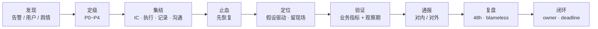
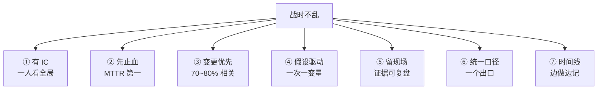
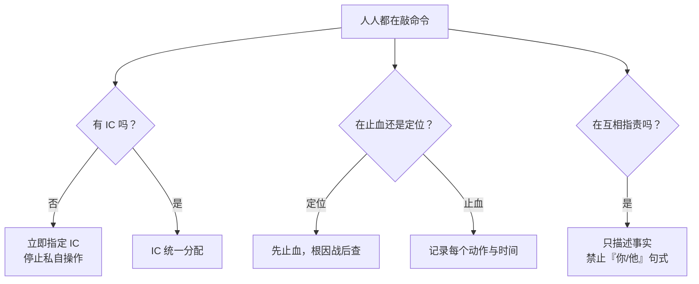
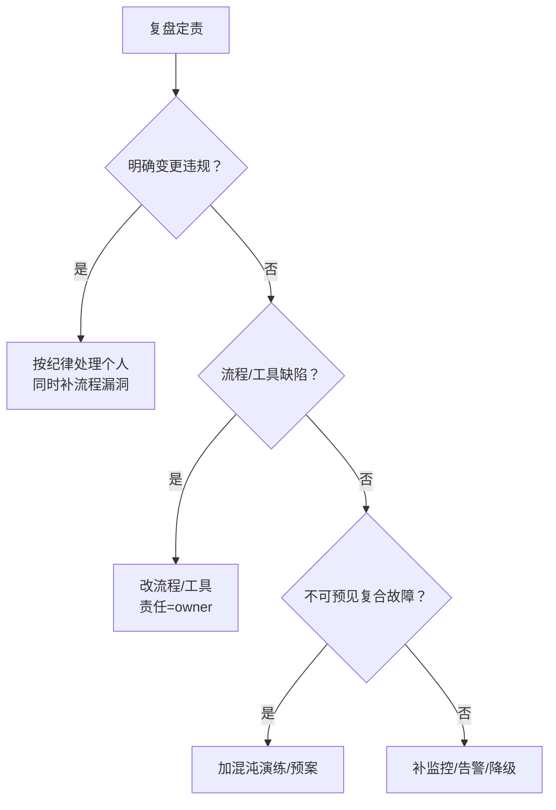

# 故障管理与复盘

> 凌晨 3 点告警狂响，老板、客服、玩家同时 @；有人回滚、有人翻日志、有人喊人——没人说「现在谁指挥」。
> **本章回答**：一次故障从发现到闭环经历哪些阶段，每段谁拍板、先做什么、怎么留证据、改进项怎么落地。
> **不讲**：具体排障命令 → 主机/网络/中间件/K8s/游戏专项各章；告警设计 → [03](../03-告警设计与降噪/)；发布回滚技术 → [04-04](../../04-工程化与自动化/04-CI-CD/)；K8s 故障剧本 → [03-18](../../03-Kubernetes/18-典型故障剧本/)；游戏 SRE → [07-13](../../07-游戏运维专题/13-游戏SRE稳定性/)；高可用 → [01-33](../../01-基础底座/33-高可用与容灾/)；SLO/错误预算 → [06](../06-SLI-SLO与错误预算/)。

**标记**：🎯重点 · 🔥难点 · ⭐常考 · 🔧实操
---

## 一、一张图：一次故障的一生

> 🎯 **一句话**：故障不是「修好就完」，它有一条命——发现 → 定级 → 集结 → 止血 → 定位 → 验证 → 通报 → 复盘 → 闭环；漏一段就埋雷。



- 📖 **读图**
  - 🛤️ 前半程（发现→验证）争 **MTTR**；后半程（通报→闭环）把经验变成资产
  - 🚫 发现别定级、止血别深挖根因、复盘别追责——每段只有一个核心任务

本节对应练习题 Q1、Q14。主线有了——谁第一个喊？

---

## 二、发现：谁第一个喊

> 🎯 **一句话**：发现源决定最初判断半径——告警讲指标，用户讲体感，舆情讲规模。

- 📡 **三类发现源**（无高下，信息半径不同）
  - **监控告警**：最先见系统侧异常；可能漏业务体感（CPU 掉了登录没掉，或 infra 正常但充不上钱）
  - **用户/客服**：最接近真实影响；样本偏嗓门大的那批
  - **舆情**：扩散最快，常说明影响面已失控

- 🔑 **黄金指标**仍要覆盖：流量 · 错误 · 延迟 · 饱和度——但再完善的监控也替代不了用户反馈通道（掉落率配错时 infra 全绿）

- ⚖️ **误报 vs 漏报**：太灵敏 → 告警疲劳；太迟钝 → MTTD 拉长。分层：P0/P1 用高置信症状告警，P2/P3 用趋势，用户/舆情作补充（告警本体 → [03](../03-告警设计与降噪/)）

- 🧩 **交叉验证**：告警说 CPU 高、用户说登录慢、舆情说某区进不去——交集才是故障域；不重合可能是独立事件。群里一张截图就下结论 = 翻车起手

> 🔍 **现场**：前 3 分钟只做三件事——确认非误报、war room 报「已接管」、贴最初现象与时间戳。先把发现源钉死，再谈定位。

> 📝 **面试**：问「监控没告警用户先炸」——告警基于可采集指标，用户基于业务体感，**不是包含关系**；黄金指标要盖住，但永远留用户入口。⭐（练习题 Q2 相关口径）

本节对应练习题发现侧口径。发现外，定级。

---

## 三、定级：P0~P4 怎么划

> 🎯 **一句话**：定级看「影响面 × 时长 × 业务关键度」，不是口水仗；定级决定响应时限、汇报对象、止血权限。

### 🎮 游戏场景分级表 ⭐🔥

| 级别 | 影响面 | 时长口径 | 游戏例子 |
|------|--------|----------|----------|
| **P0** | 全服核心不可用 / 大量收入损失 | 任意时长立即响应 | 全服登录失败、全服充值中断 |
| **P1** | 主要功能严重受损 / 部分服不可用 | ≥30 min 即升级 | 某大区无法登录、公会整体异常 |
| **P2** | 单服或单模块异常 | ≥1 h 未恢复重点关注 | 单服聊天异常、某副本匹配慢 |
| **P3** | 局部体验 / 非核心抖动 | 可排期 | 活动页慢、少量重复邮件 |
| **P4** | 潜在风险未影响用户 | 跟踪即可 | 磁盘容量告警、健康检查偶发失败 |

> ⚠️ **别混**：**P（Priority）≠ SEV（Severity）** 严格一一映射。面试说清本公司定义即可；关键是白纸黑字量化标准，战时不扯皮。

> 💡 **打个比方**：急诊分诊——胸痛进抢救室，感冒可等。定级就是贴「抢救室 / 门诊」标签；贴错，资源全乱。

#### ❓ 为什么定级必须快？

- 🐢 **定级慢** → IC 不敢下令、执行不敢动手 → MTTR 耗在犹豫上
- ✅ **定级快** → P0 可直接全服回滚；P3 群里周知即可
- 📐 用户数算不准时用间接指标：收入曲线缺口、工单爆发、舆情帖数、匹配失败率——目标是**统一预期**，不是精确到个位数

### ⬆️ 升级与降级

- **自动升级**：用户数 / 持续时长 / 收入损失破阈值
- **人工升级**：IC 判断需要更多资源——P0/P1 升级是**通知**不是申请
- **降级**：核心业务指标连续 **15 min** 回基线且无二次伤害

- 💸 一次 P0/P1 常烧光整月/整季错误预算；定级时心里要有「发布窗口关多久」的账（算法 → [06](../06-SLI-SLO与错误预算/)）

> 📝 **面试**：背维度「影响面 × 时长 × 关键度」；全服登录失败 P0，单服聊天异常 P2。⭐（练习题 Q1、Q2）

本节对应练习题 Q1、Q2。定级后，集结。

---

## 四、集结：战时角色分工

> 🎯 **一句话**：人人敲命令没人指挥 = 没有 SRE；**IC 不碰键盘，只看全局**。

### 👥 四个角色 🔥⭐

| 角色 | 英文 | 职责 | 不能做 |
|------|------|------|--------|
| **指挥官** | Incident Commander, IC | 定级、优先级、分配、拍板止血、统一口径 | **不碰键盘执行** |
| **执行** | Ops / SRE / 开发 | 回滚、切流、扩容、抓日志、留现场 | 不擅自换方向，变更前同步 IC |
| **记录** | Scribe | timeline、动作/命令/输出、聊天截图 | 不参与执行（否则时间线断） |
| **沟通** | Liaison | 对内更新、对外公告、对接客服/监管 | 不替 IC 做技术决策 |

> ⚠️ **别混**：**IC ≠ 技术最强的人**，是最清楚全局的人。架构师当 IC 还在 ssh 翻日志 = 大脑和手捆一起。

#### ❓ 为什么 IC 不能碰键盘？

- 🧠 **碰键盘** → 陷进局部细节，没人看全局、没人统一优先级
- 📣 **不碰键盘** → 分配任务、拍板止血、对外一个口径
- 🔁 故障 >2h 必须轮换；疲劳 IC 会下错令——交接落共享文档，口头不算

### 🏛️ 战情室（war room）

- war room = **信息收敛点**：统一会议/群 + 共享文档 + 时间线；决策与动作都落文档

> 🔧 **现场**：开 war room 第一句话不是「谁的问题」，而是：
> 1. IC 是谁 · 2. 当前 P 几 · 3. 记录员是谁 · 4. 对外窗口是谁 · 5. 下次通报时间

> 📝 **面试**：故障太久撑不住 → **轮换 IC 与执行**；交接落共享文档，口头不算。⭐（练习题 Q3、Q4、Q7）

本节对应练习题 Q3、Q4、Q7。人齐了，先止血。

---

## 五、止血：先恢复，再定位

> 🎯 **一句话**：MTTR 第一；用户要能玩，不要现场根因报告——除非定位本身不耗时且直接导向恢复。

### 🩹 为什么止血优先 ⭐🔥

- 用户不关心 root cause，只关心能不能玩；每多一分钟不可用，丢的是收入和信任
- 根因可事后查；业务指标下降、数据损坏可能不可逆
- **保留现场 ≠ 不恢复**：快照、日志、监控图、变更记录可先存再复盘

> 📝 **面试**：止血 vs 定位 → **先止血，再定位**；根因交给 postmortem。⭐（练习题 Q5）

### 🧰 止血工具箱排序 🔧

**原则：影响小、可逆、速度快的优先。**

```text
回滚 ＞ 切流 ＞ 重启 ＞ 扩容 ＞ 降级 ＞ 等根因
```

| 手段 | 适用 | 注意 |
|------|------|------|
| **回滚** | 变更后短时间出问题 | 确认变更点；保留前后版本 |
| **切流** | 多活/多区，单集群故障 | 先小流量验证再全切 |
| **重启** | 假死、泄漏、连接堆积 | 重启前抓 heap/连接/核心日志 |
| **扩容** | 流量突增、资源打满 | 确认不是死循环「伪流量」 |
| **降级** | 非核心挤占核心 | 别降了核心功能 |
| **熔断** | 下游持续失败拖垮上游 | 配好阈值与半开恢复 |

> ⚠️ **别混**：**熔断** = 不让请求过去；**降级** = 请求过去但走简化逻辑。支付下游超时：熔断直接拒，降级走缓存账单 + 异步补单。

#### ❓ 为什么先怀疑最近变更？

- 📊 业内经验口径：**70%～80%** 生产故障与变更相关（非定律）
- 🗺️ 第一条假设：**最近 0.5h～24h 发过什么？**——代码、配置、DB、网络、活动开关都算
- 🔍 **三问**：时间是否重合 · 范围是否重合 · 能否立刻回滚/关闭

> 🔍 **现场**：变更平台按时间倒排 24h；止血生效后进**稳定化 10～15 min**——确认无反弹、无副作用，再宣布胜利。无效时先确认上一个动作是否真生效，**别盲目叠加**。

本节对应练习题 Q5、Q6。血止住了，再定位。

---

## 六、定位：假设驱动，保留现场

> 🎯 **一句话**：定位不是从头翻日志，而是假设驱动、一次只动一个变量。

### 🔬 变更优先 + 假设驱动 ⭐

1. **候选假设**：最近变更、资源瓶颈、下游依赖、网络抖动、数据异常
2. **排序**：时间相关 > 范围相关 > 技术复杂度
3. **最小验证**：每个假设用一个可观测指标或动作证伪
4. **否定就划掉**：会上逐行翻代码 = 效率杀手

> 📝 **面试**：避免乱猜 → **假设驱动 + 一次只改一个变量**；同时改两个就分不清谁生效。⭐（练习题 Q7 相关）

### 📸 保留现场

- **必留**：监控快照 · ERROR/WARN 日志切片 · 变更单/diff · 进程/连接现场 · DB 慢查/锁/binlog 位点
- **时机**
  - 业务仍恶化 → 先止血，留最小证据（截图 + 变更记录）
  - 已稳定原因不明 → 隔离一台，留完整现场
  - 已恢复 → 立刻收日志/dump，晚了被轮转

> 💡 **打个比方**：火灾先救人再查纵火犯，但消防员会保留起火点——留现场与恢复不矛盾。

```bash
kubectl get pods -n game -o wide --sort-by=.status.startTime | head -20
# ← 最近重启 / restartCount>0 优先查
kubectl describe pod gw-1 -n game | grep -A5 "Last State"
# ← OOMKilled / Error / 信号
ss -tnp 'sport = :9090' | wc -l
# ← 连接打满？
journalctl -u game-server --since "30 min ago" --no-pager | grep -iE "error|panic|fatal"
# ← 近 30min ERROR，带时间戳贴 timeline
```

> 🔧 **现场**：常用「打标签隔离 → LB 摘掉 → 恢复其余流量」——留一颗嫌疑犯，不耽误全局。记录员从第 1 分钟开始记，边做边贴。

### 🧩 收束：战时决策凭什么不乱 🎯⭐



- 📖 **读图**：①②③ **稳住** → ④⑤ **查清** → ⑥⑦ **可复述**。少任何一件，下一次还从零开始。

> ⚠️ **别混**：七件套保证「战时可控」，**不保证**根因当场查清，也不保证零影响。

本节对应练习题 Q7。定位外，验证。

---

## 七、恢复验证：真的好了吗

> 🎯 **一句话**：「机器起来了」≠「业务恢复了」；看核心业务指标，还要留观察期。

- ✅ **确认标准** ⭐
  1. 核心业务指标恢复（登录/支付/匹配成功率——选最代表「能用」的）
  2. 错误率/延迟回基线（看 P99/P95，不只平均值）
  3. 资源水位正常（CPU、内存、连接、队列）
  4. **观察期**：至少 **1～3 个故障周期**（或 15～30 min），确认无二次伤害

> ⚠️ **别混**：进程重启成功、Pod Ready、服务注册成功 = **infra 层**；业务层必须用真实请求/用户行为再验一次。

- 🎚️ **灰度**：全量前可先 **5%～10%** 流量验证，通过再放开

> 💡 **打个比方**：缝完针 ≠ 能出院——要看血压心率意识，还要留院观察。

本节对应练习题 Q13。验证外，通报。

---

## 八、通报：对内对外怎么讲

> 🎯 **一句话**：通报节奏比措辞更重要——对内约 10 min 一次；对外先承认、再进展、再给下次更新时间。

| 对象 | 节奏 | 内容要点 | 禁忌 |
|------|------|----------|------|
| **对内** | 战时 ~10min，稳定后 ~30min | 现象、影响面、已做、下一步、要支援 | 不要只报「在看了」 |
| **对外** | 首次 **30 min 内**，之后 ~1h | 承认、范围、已采取措施、预计恢复/下次更新 | 不撒谎、不过度承诺 |
| **监管** | 按合同/法规 | 时间线、影响用户数、根因、改进 | 不等根因全清才报，先报已知事实 |

```text
【故障公告】
[时间] 监测到 / 收到反馈，[服务] 出现 [现象]。
[影响] 目前影响 [范围/用户/区域]。
[进展] 已 [动作]，正在 [下一步]。
[时间] 预计 [恢复 / 下次更新]。
[致歉] …
```

```text
【故障进展 - P0/P1】
当前时间 / 现象 / 影响面 / 已采取措施 / 下一步 / 负责人 / 下次更新
```

> 📝 **面试**：跟老板汇报三段式——**现在什么情况 · 已做什么 · 下一步要什么决策/支援**；先给影响面和恢复预期，少堆技术细节。⭐（练习题 Q8）

- 📣 **一个出口**：Liaison 或 IC 指定；技术群细节、对外简化版、监管报告信息密度可不同，**事实必须一致**

本节对应练习题 Q8。通报外，复盘。

---

## 九、复盘：无指责，追流程

> 🎯 **一句话**：复盘开成批斗会 → 下次信息断流；追责追的是流程缺陷，不是个人的锅。

### 🕊️ 为什么必须 blameless 🔥⭐

- **指责 → 防御 → 隐瞒 → 信息断流**；要的是最完整事实，不是最干净担责
- 人在当时做了当时认为合理的决定；能改的是卡点、校验、回滚能力
- 🔥 口诀：会上禁止问「谁干的」，只准问「流程哪里漏了」

#### ❓ 为什么 5 Whys 终点不能是人？

- ❌ 停在「小王手滑」→ 下周换小李还会滑
- ✅ 逐层追到**可改进的系统原因**：权限、审批、测试覆盖、监控、回滚能力、平台校验

```text
现象：充值失败
→ 支付服务 500
→ 新配置超时写成 0
→ 审核没发现异常值
→ 配置平台无数值范围校验
→ 变更流程无强制校验卡点
action：配置平台加超时范围校验 + 变更门禁
```

> ⚠️ **别混**：5 Whys **不是**机械问五次「为什么」；第五层还是人 = 问得不够深。

### 📋 时间线 · 议程 · 报告骨架

- **timeline** 精确到分钟：告警 / 发现 / 集结 / 首次止血 / 恢复 / 对外公告
- **60 min 议程**：0–5 重申 blameless → 5–25 读时间线只补事实 → 25–45 5 Whys → 45–55 action（owner+deadline+验收）→ 55–60 指定撰写人与下次 review
- **报告七段**：概述 · 影响 · 时间线 · 根因 · 做得好 · 改进项 · 经验教训

> 📝 **面试**：复盘不流于形式 → **48h 内开，先读时间线，5 Whys 找系统根因，只产出带 owner+deadline 的 action**；禁止「谁干的」。⭐（练习题 Q9、Q10）

本节对应练习题 Q9、Q10。复盘完，闭环。

---

## 十、闭环：改进项不落地等于白做

> 🎯 **一句话**：复盘会不追责，但改进项必须跟踪到人、到期、验收——否则下次还是同一个 root cause。

### ✅ SMART action ⭐

- **Specific**：不是「优化监控」，而是「充值成功率 <95% 上 P1 告警」
- **Measurable**：验收可量化
- **Assignable**：只有一个 owner，不能是「某团队」
- **Realistic**：两周的事别定三天
- **Time-bound**：有 deadline，逾期升级

- 📌 **跟踪**：看板（待办/进行中/已验收/已逾期）· 周会第一议题 · 逾期说明原因并升级资源
- 🧾 **验收**：监控类给规则截图；流程类给 SOP+培训记录；工具类给 MR+测试；演练类给演练报告
- 🧹 **防行动疲劳**：立即项（本周：止血/监控/回滚开关）vs 长期项（本月：架构/混沌/流程）；**逾期率比总数重要**

- 📚 **变资产**：按系统/组件/根因类型归档 postmortem，定期模式分析——哪类变更最多 → 加固门禁；哪类监控漏 → 补覆盖；哪类止血最有效 → 写成预案

> 📝 **面试**：复盘不白开 → **owner + deadline + 验收 + 每周 review + 逾期升级**。⭐（练习题 Q11）

本节对应练习题 Q11、Q12。闭环外——作战定责。

---

## 十一、作战：崩溃现场与定责

> 🎯 **一句话**：故障中最贵的不是技术错，是组织错——没人指挥、没留现场、没统一口径。



- 📖 **读图**：三种病——**没 IC / 止血定位颠倒 / 互撕**；每一层都落到立刻可执行的动作。

### 现象 · 先做 · 别做

| 现象 | 先做 | 别做 |
|------|------|------|
| 告警响了没人动 | 指定 IC + 拉 war room | 群里继续问「在吗」 |
| 多人同时改 | 叫停，IC 分配 | 各自回滚互相覆盖 |
| 止血无效 | 确认上一动作是否生效，留现场 | 同时改三个参数 |
| 老板要根因 | 时间线 + 已知事实 + 预计查清时间 | 现场编「合理」原因 |
| 复盘变批斗 | 重申 blameless，回时间线 | 让当事人先解释动机 |
| 改进项没人做 | 看板 + 周会 + 逾期升级 | 报告写完归档 |

### 60 秒剧本 🔧

> 🔍 **现场**：接到 P0/P1 报障，0–60s 先稳住组织，再动手。

```text
① 0–10s   指定 IC；开 war room；定级（先估影响面）
② 10–30s  记录员开 timeline；贴发现源与最初现象
③ 30–45s  倒排 24h 变更；选最小可逆止血（优先回滚/切流）
④ 45–60s  执行前同步 IC；留最小现场；对内首报「已接管 + 下一步」
```

### 定责决策树



- 📖 **读图**：定责找**可改进的系统位点**；只有明确恶意/重大违规才处理个人。

本节对应练习题 Q13、Q14。回到开头那个现场——缺的是「谁指挥」和「先止血」。

---

## 十二、收口

### 指标与命令速查 🔧

| 指标 | 定义 | 怎么改进 |
|------|------|----------|
| **MTTD** | 发生 → 发现 | 告警覆盖与降噪 → [03](../03-告警设计与降噪/) |
| **MTTR** | 发现 → 恢复 | IC + war room 模板 + 预案/自动化回滚切流 |
| **MTBF** | 两次故障间隔 | 改进项落地 + 混沌工程 |

```bash
# 战时留现场（示例，按栈替换）
kubectl get pods -n game -o wide --sort-by=.status.startTime | head -20
kubectl describe pod <pod> -n game | grep -A5 "Last State"
ss -tnp 'sport = :<port>' | wc -l
journalctl -u <svc> --since "30 min ago" --no-pager | grep -iE "error|panic|fatal"
```

> 📝 **面试**：降 MTTR → **三段砍**：缩短 MTTD（告警准）· 缩短集结（有 IC/模板）· 缩短止血（预案+自动化）。不是让人加班。⭐（练习题 Q12）

- 📞 **oncall 一句**：不是「谁电话响谁上」，而是**轮换 + 补休 + 告警质量**；每晚 200 条无效告警，再好的 SRE 也会麻木（→ [03](../03-告警设计与降噪/)、[04-08](../../04-工程化与自动化/08-运维平台与Oncall/)）

### 面试锚点

| 问 | 30 秒答 |
|----|---------|
| P0~P4 怎么分？ | 影响面 × 时长 × 关键度；全服登录失败 P0，单服聊天异常 P2。 |
| 止血 vs 定位？ | 先止血再定位；MTTR 第一，根因战后查。 |
| IC 为何不碰键盘？ | 看全局与统一口径；碰键盘就没人指挥。 |
| 止血工具箱排序？ | 回滚 ＞ 切流 ＞ 重启 ＞ 扩容 ＞ 降级；先怀疑最近变更。 |
| 恢复怎么算好？ | 核心业务指标 + 错误/延迟回基线 + 1～3 周期观察期。 |
| 通报节奏？ | 对内 ~10min；对外 30min 内首次承认 + 进展 + 下次更新。 |
| 为何 blameless？ | 指责→隐瞒→信息断流；追流程不追人。 |
| action 怎么不白做？ | owner + deadline + 验收 + 周会 review + 逾期升级。 |
| MTTD/MTTR/MTBF？ | 发现慢 / 恢复慢 / 间隔短——告警准、IC 与预案、改进项落地。 |
| 5 Whys 终点？ | 流程/工具缺陷，不是人。 |
| 变更相关比例？ | 经验口径 70～80%；止血先查 24h 变更清单。 |
| 熔断 vs 降级？ | 熔断不让过；降级过但走简化逻辑。 |

### 易错一句话对照

- 定级凭感觉 → 影响面 × 时长 × 关键度量化
- 技术最强当 IC → IC 看全局，不碰键盘
- 先定位再止血 → MTTR 第一，先恢复
- 回滚丢人 → 回滚常是最快止血
- 恢复 = 机器起来 → 必须看业务指标 + 观察期
- 对外等根因再报 → 先承认已知事实
- 复盘追责 → 下次没人说实话
- 5 Whys 终点是人 → 要追到流程/工具
- action 没 owner → 等于没做
- 止血无效就叠加 → 先确认上一动作是否生效
- 稳定化直接宣布恢复 → 观察 10～15 min
- war room 无人记 → 第一分钟指定 Scribe
- P0/P1 升级层层审批 → 升级是通知不是申请
- oncall = 接电话 → 轮换 + 补休 + 告警质量

### 数字墙

> P0～P4 **5 级** · 对内通报约 **10 min** · 对外首次 **30 min** · 复盘 **48h** 内 · 降级观察 **15 min** 基线 · 稳定化 **10～15 min** · 观察期 **1～3 周期**（或 15～30 min）· 灰度 **5%～10%** · 变更相关经验口径 **70%～80%** · MTTD / MTTR / MTBF **三指标** · action **owner + deadline + 验收**

---

## 合上书

对着第一节主图口述一遍；开头那个「没人指挥」的现场，现在该能说清缺哪几段。

- [ ] **默画主图**：发现 → 定级 → 集结 → 止血 → 定位 → 验证 → 通报 → 复盘 → 闭环；前半程 MTTR、后半程变资产。（→ Q1 · Q14）
- [ ] **口述发现与定级**：三类发现源；P0～P4 维度与游戏例子；升级是通知、降级看 15 min 基线。（→ Q1 · Q2）
- [ ] **口述集结**：四角色职责与不能做；IC 为何不碰键盘；war room 第一句话五问。（→ Q3 · Q4 · Q7）
- [ ] **口述止血**：先止血再定位；工具箱排序；先怀疑变更；熔断 vs 降级。（→ Q5 · Q6）
- [ ] **口述定位与验证**：假设驱动一次一变量；留现场时机；业务指标 + 观察期。（→ Q7 · Q13）
- [ ] **口述通报与复盘**：对内/对外节奏；blameless；5 Whys 终点是流程；报告七段。（→ Q8 · Q9 · Q10）
- [ ] **口述闭环与作战**：SMART action；三指标；三种崩溃病；60 秒剧本。（→ Q11 · Q12 · Q14）

下一章回看模块入口：[可观测性三件套](../01-可观测性三件套与选型/)。告警：[03](../03-告警设计与降噪/)。SLO：[06](../06-SLI-SLO与错误预算/)。高可用：[01-33](../../01-基础底座/33-高可用与容灾/)。
