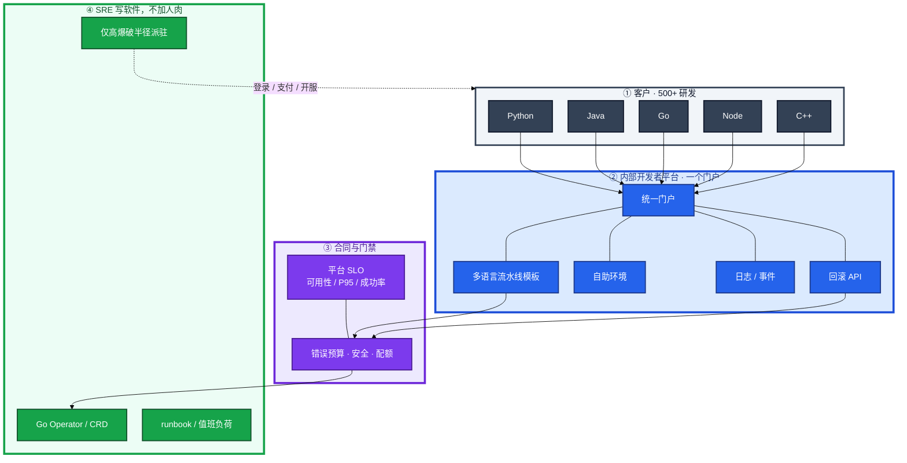
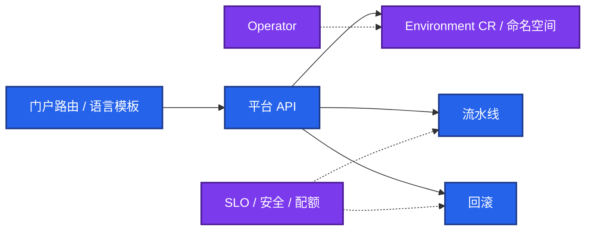
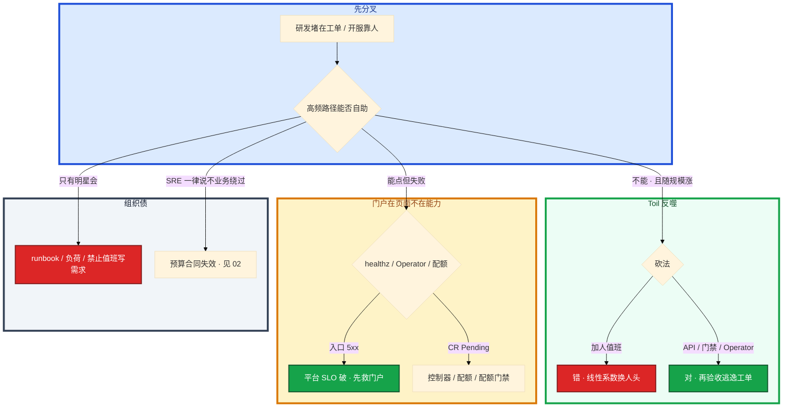

# SRE 职责与平台工程


白板第一句：「从零搭基础设施，给 500 个 Python / Java / Go / Node / C++ 研发做 DevOps 平台。」有人开始报 Jenkins 插件。另有人说开服靠加人值班。总监追问：SRE 和业务发版谁说了算？Operator 用 Go 写，是不是所有手工都能变成控制器？

这一章只做一件事——**平台怎么分阶段建、契约挂哪、值班怎么验收、Toil 怎么砍、Operator 什么时候不写。** 前面的角色和原理，是为了让你动手时不选错路。

**读完你能：** 白板上画出四角色边界；能把 Toil 讲到约 50% 和砍法；能判断派驻还是平台自助；会定平台 SLO、门禁挂哪、值班不是写需求。

**本章主线（平台就按这三步想）：**

1. **角色**：SRE = 可靠性 + 砍 Toil；平台 = 内部产品 SLO，不是菜单数。
2. **路径**：高频开环境/看日志/回滚必须自助；大爆破半径域才嵌入。
3. **合同**：错误预算挂发布门禁；oncall 不写需求，英雄文化是错的。

## 本章目录

- [1. 基本概念](#1-基本概念)
- [2. 架构图](#2-架构图)
- [3. 原理](#3-原理)
  - [3.1 Toil](#31-toil定义与-50)
  - [3.2 派驻 vs 自助](#32-you-build-it-you-run-it-vs-嵌入)
  - [3.3 错误预算是合同](#33-错误预算是刹车不是永远说不)
  - [3.4 英雄文化](#34-英雄文化为什么错)
- [4. 安装部署](#4-安装部署)
  - [4.1 生产怎么选](#41-生产怎么选)
  - [4.2 门户落地](#42-500-人平台落地你实际看到什么)
- [5. 核心配置](#5-核心配置)
- [6. 命令与操作](#6-命令与操作)
- [7. 生产排障](#7-生产排障)
- [8. 必会 · 常考](#8-必会--常考)
- [合上书，问自己](#合上书问自己)

**本章不讲：** 定级 / 简历 / 年包 → [01-能力模型](../../01-职业发展/01-能力模型/)；CMDB / war room 字段 → [05-06 运维平台与 Oncall](../../05-工程化与自动化/06-运维平台与Oncall/)；CI 流水线实现 → [05-02 CI-CD](../../05-工程化与自动化/02-CI-CD/)；GitOps → [04-22 ArgoCD 与 Tekton](../../04-Kubernetes/22-GitOps-ArgoCD与Tekton/)；游戏 SLO 口径 → [08-09 游戏 SRE 稳定性](../../08-游戏运维专题/09-游戏SRE稳定性/)；Terraform / Ansible 语法 → [05-Terraform](../../05-工程化与自动化/05-Terraform/) / [04-Ansible](../../05-工程化与自动化/04-Ansible/)；Thanos / Istio / Karmada → [本模块 04](../04-大规模可靠性架构/)；SLO 公式与 FinOps 账本 → [02](../02-SLO错误预算与FinOps/)。

---

## 1. 基本概念

SRE 不是「会装 K8s 的运维」，也不是「值班写需求的研发」。Google 口径：**SRE = 用软件工程做运维**。和产品的合同是 **错误预算**（怎么算、怎么停发，见 [02](../02-SLO错误预算与FinOps/)），不是工单响应时长。

四个角色不要混。面试第一刀经常在这里：

| 角色 | 拥有什么 | 成功长什么样 | 常见混法 |
|------|----------|--------------|----------|
| **传统运维** | 机器、变更窗口、工单执行 | 变更按窗口落地、机器不丢 | 把「会装集群」当成 SRE |
| **DevOps** | 文化：研发对运行负责 + 流水线 | 交付变快、反馈环短 | 把 Jenkins 插件清单当平台 |
| **SRE** | 可靠性工程：SLO、错误预算、砍 Toil、值班可复制 | Toil 压下去、预算可花可停 | 把救火明星、加人值班当 SRE |
| **平台工程（Platform Engineering）** | 内部开发者平台当产品卖给研发 | 平台自己有 SLO，研发自助完成高频路径 | 把门户页面数、菜单项当成功 |

传统运维的单位是 **工单**。DevOps 的单位是 **团队习惯**。SRE 的单位是 **可靠性和 Toil 占比**。平台工程的单位是 **内部产品的 SLO**。四个可以同时存在于一个公司，但白板上必须能指出「这一刀是谁的」。

**Toil**（苦劳）：手工、重复、可自动化、战术性、**无持久价值**、**随服务规模线性涨**。开服 SSH 十台改配置、告警每条人肉 grep、证书到期前两周值班抄 pem，都是 Toil。目标把 SRE 时间里的 Toil **压到约 50% 以下**。正确姿势是平台 / API / 门禁，不是再招一班人值班。

**You build it you run it**：谁发版谁接 pager。适合爆破半径小、产品能看懂自己的图。SRE **嵌入业务**：只对登录、支付、开服、有状态战斗这类爆破半径大的域派驻。其余高频路径（开环境、看日志、回滚）必须平台自助，否则 500 个研发会把 SRE 当人力池。

内部开发者平台（IDP）：统一门户、多语言流水线模板、自助开环境 / 看日志 / 回滚。安全、稳定、性能是 **平台 SLO**，不是页面数量。Operator / CRD：SRE 用 Go 写控制器，把长生命周期状态从值班手里拿走；一次性开服 Job **不要**写成 Operator → [04-20](../../04-Kubernetes/20-Operator与CRD/)。

稳定性 vs 业务敏捷：错误预算是刹车。预算还在，产品有权发；烧光了，停发布、先还可靠性。不是「运维永远说不」。英雄文化 / 救火明星：错。要可复制的 runbook 和可度量的值班负荷。**oncall 不是写需求。**

和 [01-能力模型](../../01-职业发展/01-能力模型/) 的边界：那一章讲你怎么用证据定级。**本章不讲 L5 / L6、年包、四维材料。** 本章只讲组织里 SRE 干什么、平台怎么减 Toil。

> **记住**：SRE 卖的是可靠性和 Toil 下降，平台工程卖的是内部产品 SLO。错误预算是和产品的合同。加人值班不是砍 Toil。

---

## 2. 架构图

后面排障都对着这张图。



**读图三句话：**
1. **没有箭头从 500 个研发指向「找某个 SRE 开环境」。** 高频路径进门户。
2. **门禁挂在流水线和回滚入口上**，不是挂在 wiki「须知」上。
3. **Operator 只吃长生命周期状态**；派驻只打爆破半径大的域。

三种组织形态（建平台时选，炸了影响面不一样）：


You build it：产品能看懂自己的图，pager 才接得住。嵌入：派驻的产出是 **域内平台和 runbook**，到期收回，不是永远驻场写功能。人力池：规模一涨 Toil 线性涨，面试里直接判低。

---

## 3. 原理

原理只保留白板和值班会用到的：什么算 Toil、谁接 pager、预算怎么当刹车、为什么救火明星是债。

**本节 4 块：** 3.1 Toil · 3.2 派驻 vs 自助 · 3.3 错误预算 · 3.4 英雄文化

### 3.1 Toil：定义与 50

**一句话：** Toil 随规模线性涨；目标压到约 50% 以下，靠平台不是加人值班。

六条同时满足，才叫 Toil（Google SRE Book 口径，面试按这个答）：

| # | 条件 | 开服 / 告警 / 证书的例子 |
|---|------|--------------------------|
| 1 | **手工** | SSH 逐台改区服配置 |
| 2 | **重复** | 每个新服、每次活动再做一遍 |
| 3 | **可自动化** | 有 API / CR / 流水线就能做 |
| 4 | **战术、打断驱动** | 告警来了才 grep，没有设计 |
| 5 | **无持久价值** | 做完系统能力不增加 |
| 6 | **随规模线性涨** | 服 ×2，工时 ×2 |

不是所有运维劳动都是 Toil。设计容量模型、写 Operator、订 SLO、做演练，有持久价值，**不是 Toil**。把「我很忙」当成 Toil，会把该做的工程也砍掉。

目标：SRE 时间里 Toil **约 50% 以下**。剩余时间写平台、做可靠性、带演练。超过 50%，系统在用人力扩容。正确砍法：


再招人值班，只是把 50% 这条线用编制顶住。服再翻倍，编制还要翻。面试问「开服来不及怎么办」，先答平台和门禁，不要先答 HC。

> **记住**：Toil 随规模线性涨。砍 Toil = 平台 / API / 门禁。加人值班是把线性系数换成人头。

### 3.2 You build it you run it vs 嵌入

**一句话：** 大爆破半径域才嵌入；高频路径必须平台自助。
| 模式 | 何时用 | 何时不用 |
|------|--------|----------|
| **You build it you run it** | 无状态、爆破半径限于该产品、研发能看日志和回滚 | 有状态战斗房、支付、登录、跨多团队的共享平台 |
| **平台自助** | 同样的事发生 ≥ 几十次：开环境、看日志、回滚、续证 | 一年一次的合规审计（可工单） |
| **SRE 嵌入** | 域知识厚、炸了是 P0、需要把 Toil 变成该域的 API | 「每个业务组配 2 个 SRE」当编制方案 |
| **传统工单** | 生产开账号、改防火墙、买生产集群 | 测试环境、看日志、点回滚 |

派驻有退出条件：域内自助路径通了、runbook 别人能值班、Toil 降到可测，**人收回平台**。没有退出日的驻场 = 变相运维外包。

C++ 游戏服、热更、开合服细节不在本章 → [08](../../08-游戏运维专题/)。这里只判：**有状态 + 爆破半径大 → 嵌入或强门禁，不是门户上一个「一键开服」按钮了事。**

### 3.3 错误预算是刹车，不是永远说不

**一句话：** 预算还在产品有权发；烧光了停发布、先还可靠性。
产品要速度，SRE 要稳定。没有合同就会变成嘴仗：运维一律冻结，业务绕过平台私发。

错误预算把嘴仗变成数：SLO 还剩预算，**产品有权发**；预算烧光或燃烧过快，**停发布、先还可靠性**。SRE 的否决权挂在预算上，不挂在个人脾气上。公式、燃烧率、FinOps 账本 → [02](../02-SLO错误预算与FinOps/)。游戏登录 / 战斗怎么订窗口 → [08-09](../../08-游戏运维专题/09-游戏SRE稳定性/)。

白板一句就够：**预算是合同，不是运维的「不」。** 预算还在仍一律说不 = 平台会被绕开。预算烧光仍放行 = 合同是假的。

### 3.4 英雄文化为什么错

**一句话：** 要可复制的 runbook 和可度量的值班负荷，不要救火明星。
救火明星能把开服从失败里捞回来，短期像资产，长期是单点。他休假，没有第二个人能按同样步骤做；他在场，组织不写 runbook、不测值班负荷、不砍 Toil。

| 英雄文化看起来像 | 实际在欠 |
|------------------|----------|
| 通宵救了开服 | 没有可复制步骤，下次还靠他 |
| oncall 顺便把需求做了 | P0 来了人在写代码，MTTR 炸 |
| 告警只找「懂的那个人」 | 知识不在平台，在人脑子里 |
| 加班多 = 负责 | Toil 在涨，系统能力没涨 |

正确替代：runbook 能让 **本周值班的人** 做完；oncall 负荷有上限（页数、夜间唤醒、Toil 占比）；知识在门户和控制器里。oncall 轮次的目标是 **覆盖 + 可交接**，不是把 backlog 清掉。

> **记住**：明星救火是单点故障。oncall 不是写需求。可复制 > 个人英雄。

---

## 4. 安装部署

这一章的「安装」= **平台建设路径怎么选**，不是装哪一个开源产品。

### 4.1 生产怎么选

| 项 | 选 | 不选 |
|----|----|------|
| 客户 | 500+ 研发当内部用户，有平台 SLO | 先做给领导看的门户首页 |
| 路径 | 身份 → 环境 → 流水线 → 门禁 → 控制器 | 先上大而全菜单，再劝人用 |
| 语言 | 一个门户 + 语言模板（Python/Java/Go/Node/C++） | 五种语言五套互不相认的「平台」 |
| Toil | 先砍线性涨、每周发生的 | 先自动化一年一次的事 |
| 人 | 平台团队写产品；嵌入有退出日 | 按业务组摊 SRE 编制 |
| 门禁 | 挂 CI / 发布 / 回滚入口 | wiki 须知、群公告 |
| 控制器 | 长状态 Operator | 一次性开服 Job 当 Operator |
| 基础设施即代码 | 用 Terraform / Ansible，语法另章 | 把「会写 tf」当成已经有平台 |

从零搭的顺序（面试按阶段答，不要从插件名起）：

1. **止血**：oncall 能认领、runbook 能交接、停止用加人顶开服。CMDB / 升级字段 → [05-06](../../05-工程化与自动化/06-运维平台与Oncall/)。
2. **身份与环境**：统一账号，测试环境自助 + 配额。生产集群 / 账号仍审批。
3. **流水线产品化**：多语言模板、制品、回滚 API。实现 → [05-02](../../05-工程化与自动化/02-CI-CD/)；Git 当期望 → [04-22](../../04-Kubernetes/22-GitOps-ArgoCD与Tekton/)。
4. **门禁**：错误预算、安全扫描、配额挂入口。
5. **控制器**：证书、环境生命周期、长服务的 CR。
6. **嵌入收回**：只留高爆破半径域，到期把人收回平台。

托管云、多集群、网格、GPU 调度不是这一章的选型 → [04](../04-大规模可靠性架构/)。IaC 语法 → [05-Terraform](../../05-工程化与自动化/05-Terraform/) / [Ansible](../../05-工程化与自动化/04-Ansible/)。

### 4.2 500 人平台落地你实际看到什么

研发打开的是 **一个门户**，不是五张工单系统。进门后四件事必须自助完成：开测试环境、跑本语言流水线、看自己的日志 / 事件、点回滚。C++ 有状态服可以没有「一键生产开服」，但必须有 **同样入口** 走审批 + 窗口，而不是改走 IM 找人。



验收：进程在、页面能打开 **不算数**。必须量：环境开通 P95、流水线从点到开始 P95、回滚成功率、门户可用性、工单里「请帮我看日志 / 点回滚」的比例在下降。

| 你该看到 | 不该看到 |
|----------|----------|
| 一种登录，五种语言模板 | 每条业务一个 Jenkins 主人 |
| 测试环境配额自助，超限拒绝 | 测试也走生产变更单 |
| 回滚按钮打到同一套 API | 回滚 = 值班 SSH |
| 平台 SLO 看板 | 只有「本周上线了 12 个页面」 |

---

## 5. 核心配置

这一章的「配置」= **政策与平台契约**：谁自助、谁审批、SLO 门禁挂哪。只订有证据的项。改契约等于改生产，要版本和公告，不要群里口头改。

| 路径 | 谁自助 | 谁审批 / 谁拒绝 | 门禁挂哪 |
|------|--------|-----------------|----------|
| 开测试环境 | 研发 | 超配额由平台拒 | 配额 + 成本标签；不是人工 |
| 看日志 / 事件 | 研发（本服务 RBAC） | 跨服务由安全角色 | 门户 / 日志 API，不配值班 |
| 无状态回滚 | 研发 | 错误预算烧光则平台拒 | 发布 / 回滚 API |
| 生产发版 | 研发点同一按钮 | 预算、安全扫描、窗口 | **CI / 发布入口**，不是须知 |
| 有状态热更 / 开服 | 业务 Owner 提变更 | SRE + 窗口 + 预算 | 游戏变更窗口；细节 [08](../../08-游戏运维专题/) |
| 生产账号 / 集群 / 防火墙 | 工单 | SRE + 安全 | 不自助 |
| 证书续期 | 平台 Operator | 无 | 到期前自动；失败才页值班 |
| 自建 Operator 上生产 | 平台 / 嵌入 SRE | CRD 影响面评审 | 见 [04-20](../../04-Kubernetes/20-Operator与CRD/) |

平台自己的 SLO（示例口径，公式在 02）：

| SLI | 订什么 | 不订什么 |
|-----|--------|----------|
| 门户可用性 | 登录 + 核心四条路径 | 静态页 200 |
| 环境开通 | P95 时间、成功率 | 「支持 20 种套餐」 |
| 流水线启动 | 点下到 runner 接到的 P95 | 插件数量 |
| 回滚 | 成功率、完成时间 | 页面上有按钮即可 |
| 工单逃逸率 | 「看日志 / 回滚 / 开环境」仍提单的比例 | 工单总量下降（可能是没人用） |

> **记住**：能自助的不上工单。审批只留爆破半径大的。门禁挂入口，挂 wiki 等于没有。平台 SLO ≠ 页面数。

---

## 6. 命令与操作

值班和验收用清单，不是再背一套 kubectl 百科。证书、流水线 YAML、Argo 细节各回本行章节。

先把入口写成变量：

```bash
export IDP=https://idp.example.com
export CI=https://ci.example.com
```

| 目的 | 命令 / 检查 | 看什么 |
|------|-------------|--------|
| 门户活着 | `curl -sf -o /dev/null -w '%{http_code}\n' $IDP/healthz` | 200；不是只 ping 首页 |
| 流水线入口 | `curl -sf $CI/healthz` | 200；失败 = 平台 SLO 破，不是「Jenkins 有人看」 |
| Operator 在跑 | `kubectl -n platform get deploy,po -l app.kubernetes.io/part-of=idp` | Ready；不是只有 CRD 存在 |
| 环境是否真能开 | `kubectl get env.platform.example.com -A \| grep -E 'Pending\|Failed'` | 积压 = 自助路径断了 |
| CRD 还在 | `kubectl get crd \| grep -E 'environment\|gameserver'` | 类型在；没有控制器仍是死对象 |
| 证书 Toil 是否还在 | `kubectl get certificaterequest -A --sort-by=.metadata.creationTimestamp \| tail` | 失败才页人；人肉续 pem = Toil 没砍 |

值班先跑这四条（平台视角）：

```bash
curl -sf -o /dev/null -w '%{http_code}\n' "$IDP/healthz"
curl -sf -o /dev/null -w '%{http_code}\n' "$CI/healthz"
kubectl -n platform get deploy,po
kubectl get env.platform.example.com -A | grep -E 'Pending|Failed' || true
```

验收清单（周会用，不要用「感觉研发挺满意」）：

| 项 | 过线 | 不过线 |
|----|------|--------|
| Toil 占比 | SRE 日记 / 工时 **< ~50%** | 开服周全员值班仍做不完 |
| 逃逸工单 | 开环境 / 日志 / 回滚工单持续下降 | 门户很全，这三类工单不降 |
| oncall | 夜间唤醒有上限；值班不排需求 | 值班周承诺三个需求 |
| 门禁 | 预算烧光时按钮是灰的 | 群里说「今晚先发，明天补单」 |
| runbook | 非作者能按文档做完一次回滚 | 只有救火明星会 |

指标（平台 Prometheus，名称按你们的导出改）：门户 `up`、环境开通 P95、回滚成功率、证书续期失败。告警有效率、认领超时 → [05-06](../../05-工程化与自动化/06-运维平台与Oncall/)。

---

### 6.1 砍 Toil 立项

先量化再写代码。选 **频率 × 人数 × 是否随规模涨** 最高的三项，不要从「我想写 Operator」倒推。

1. 记两周：每类手工的次数和耗时。
2. 判定六条 Toil；不是 Toil 的不要立项成「减负」。
3. 能自助的做成门户 API；长状态才进 Operator。
4. 上线后看逃逸工单和 Toil 占比，不看仓库 star。

开服手工、告警人肉、证书手抄，是三条最常考的立项题。答「我们招人顶开服」直接判错。

### 6.2 写 Operator 还是 Job

| 写 Operator | 不要写 Operator |
|-------------|-----------------|
| 期望长期存在，要持续调和（证书、环境生命周期、分片数） | 一次性开服、一次性迁库、一次活动脚本 |
| 失败要重试、status 要给人看 | 跑完就该消失的 Job |
| 有合法 spec，研发能 `kubectl apply` / 门户代发 | 把 SSH 剧本原样塞进 Reconcile，15s 扫一遍集群 |

一次性开服 Job 写成 Operator：调和过快会打生产、过慢会假死、Job 语义被 Recreate 搞乱。机制 → [04-20](../../04-Kubernetes/20-Operator与CRD/)。本章只判 **该不该写**。Go 控制器本身是 SRE 减 Toil 的正当手段，不是「研发才配写 Go」。

### 6.3 派驻还是收回平台

嵌入启动：爆破半径、域知识、Toil 测过、**退出条件写在纸上**（自助路径、runbook、值班可交接）。嵌入期间禁止把驻场当需求人力。到期未达成：延长要重新签字，不要默默续住。

收回：高频路径进门户；域内 Operator 交平台或交产品（You build it）；SRE 只留咨询和门禁。

### 6.4 多语言流水线接入

500 人五语言：门户一套，**模板分语言**，制品 / 扫描 / 回滚契约同一套。不要为 C++ 另做一个「只有编译机房的人会用」的旁路，除非有状态发布必须走窗口——那也要从同一入口进审批，而不是 IM。流水线怎么写 → [05-02](../../05-工程化与自动化/02-CI-CD/)。

### 6.5 值班负荷与 oncall 边界

oncall 当周：认领、止血、按 runbook 执行、升级。**不写需求、不把 Toil 当业绩。** 负荷：页次数、夜间唤醒、连续值班、Toil 占比。破线先减告警和加自助，不加「值班顺便做需求」来填工时。事件字段、war room → [05-06](../../05-工程化与自动化/06-运维平台与Oncall/)。

### 6.6 自助开环境、看日志、回滚

三条是 IDP 的最低产品面。缺一条，500 人就会把 SRE 钉在工单上。回滚必须打 API（可审计），禁止只存在于某个人的 shell history。有状态回滚不是无状态按钮，入口仍在门户，策略在游戏章节。

### 6.7 SLO 门禁挂发布入口

预算还在：发版按钮可用。烧光或燃烧过快：按钮不可用，例外走 **书面破窗**（谁批、何时还）。门禁实现可以是 CI check、Admission、发布系统拦截——挂哪都行，**不能只挂文档**。怎么算燃烧 → [02](../02-SLO错误预算与FinOps/)。

---

## 7. 生产排障
和 01 同一套三问：平台还在不在？研发还能不能自助？已有流量还通不通？

**平台挂了 ≠ 立刻踢玩家。** 已运行的服通常还在。立刻停的是：自助开环境、发版、回滚入口、依赖门户的变更。



现场顺序：

```bash
curl -sf "$IDP/healthz"; curl -sf "$CI/healthz"
kubectl -n platform get deploy,po
kubectl get env.platform.example.com -A | grep -E 'Pending|Failed' || true
```

| 现象 | 先做什么 | 不要做什么 |
|------|----------|------------|
| 开服全员 SSH | 停在 Toil 立项；环境 / 配置 API | 先批 10 个值班 HC |
| 门户很全，看日志仍提单 | 量逃逸率；RBAC 和入口 | 再加两个页面 |
| Operator 调和打生产 | 这是不是一次性 Job | 给控制器加副本「加快」 |
| 预算烧光仍发版 | 入口变灰；破窗书面 | 群里口头放行 |
| 明星休假开服失败 | runbook + 演练 | 打电话把他召回当流程 |
| 值班在写需求，P0 没人认 | 当周冻结需求；补认领 | 夸「能扛」 |
| 业务绕过平台私发 | 门禁没挂入口 | 发邮件强调流程 |
| 五语言五套平台 | 收回门户与契约 | 再给 C++ 做第六套 |

活动周 Toil 爆炸：确认线上流量还在 → 冻非必要发版 → 只保回滚和登录 / 支付路径 → 事后按 7.1 立项，不要用活动周加人当长期方案。

---

## 8. 必会 · 常考
白板和追问高频，能一口回：

| 说法 | 对错 | 口径 |
|------|:----:|------|
| SRE 就是会 K8s 的运维 | 错 | 软件工程做运维；合同是错误预算 |
| DevOps = 装一套 Jenkins | 错 | 文化 + 研发对运行负责；工具是手段 |
| 平台工程看页面数量 | 错 | 看平台 SLO 和逃逸工单 |
| Toil 就是运维很忙 | 错 | 六条；有持久价值的设计不是 Toil |
| Toil 超过 50% 就加人值班 | 错 | 平台 / API / 门禁 |
| 每个业务组派 2 个 SRE | 错 | 嵌入要有退出；高频走自助 |
| You build it 适用于支付和战斗房 | 错 | 爆破半径大要嵌入或强门禁 |
| 运维应该永远说不 | 错 | 预算还在产品有权发 |
| 预算烧光仍可以先发 | 错 | 合同失效；入口必须拦住 |
| 开服 Job 应该写成 Operator | 错 | 一次性用 Job；长状态才 Operator |
| 救火明星是高阶 SRE | 错 | 单点；要 runbook 和负荷 |
| oncall 周正好写需求 | 错 | oncall 不是写需求 |
| 会写 Go Operator 就算平台工程 | 错 | 还要当产品：SLO、自助、门禁 |
| 定级年包能从 Toil 百分比推出来 | 错 | 定级见 01-能力模型，本章不讲 |

数字：Toil 目标 **约 50% 以下**；IDP 最低四条路径（环境 / 流水线 / 日志 / 回滚）；从零平台 **6 段路径**（止血 → 身份环境 → 流水线 → 门禁 → 控制器 → 嵌入收回）；验收看逃逸工单下降，不看菜单数。

易混：传统运维 vs SRE vs 平台工程；Toil vs 有持久价值的工程；You build it vs 嵌入 vs 人力池；错误预算 vs 永远说不；Operator vs Job；英雄 vs runbook；平台 SLO vs 页面数；本章 vs 01-能力模型（不定级）。

---

## 合上书，问自己

1. 四角色各拥有什么？把「会装 K8s」说成 SRE 错在哪？
2. Toil 六条？目标约多少？开服手工 / 告警人肉 / 证书手抄怎么砍？为什么不是加人？
3. 500 人五语言，门户怎么拆？平台 SLO 订哪几条，为什么不是页面数？
4. You build it、平台自助、嵌入各何时用？派驻怎样才算结束？
5. 错误预算怎样当刹车？门禁挂哪？运维永远说不会怎样？
6. 何时写 Operator、何时 Job？英雄文化错在哪？oncall 能不能写需求？

六题都能口述，这一章就过了。下一章 02-SLO错误预算与FinOps 把合同剖开：SLO 怎么订、错误预算怎么烧、FinOps 怎样把成本当成可靠性的另一面。
