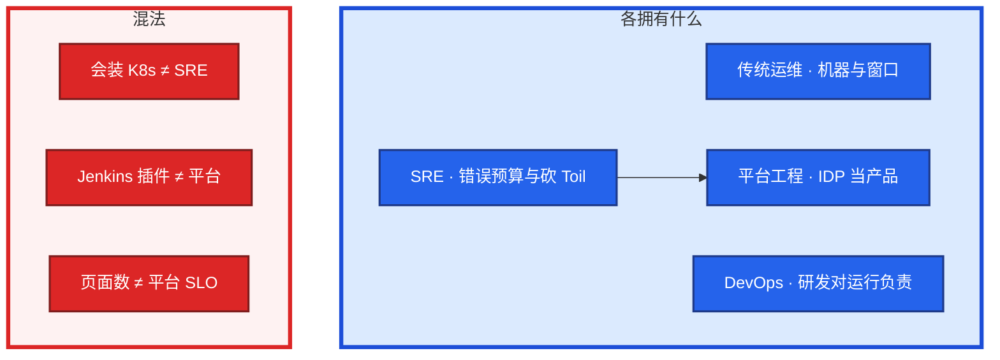
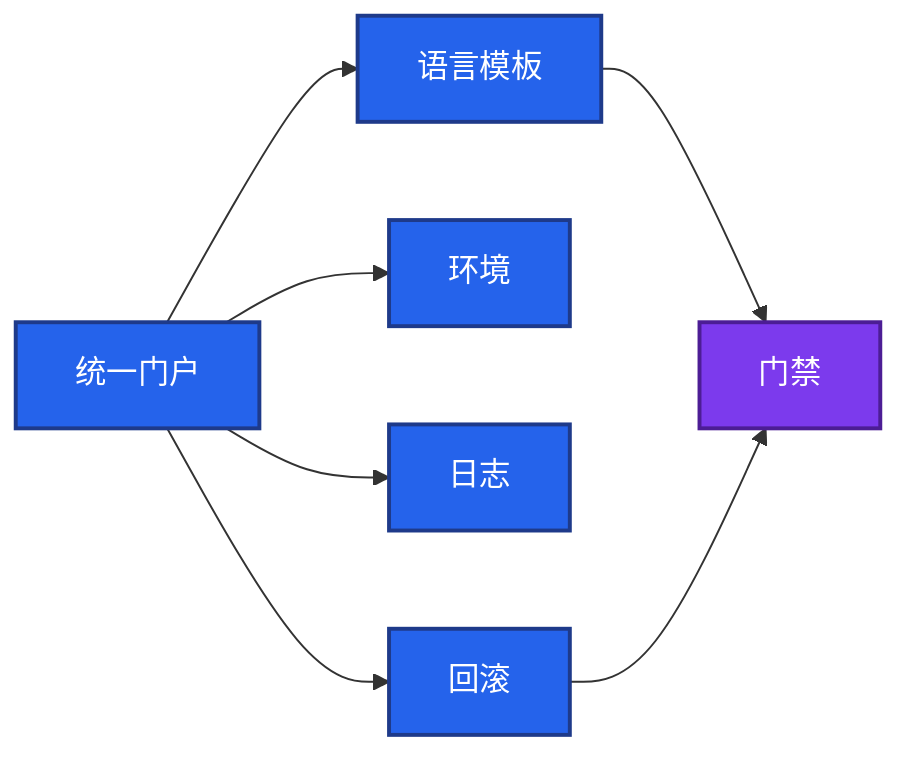
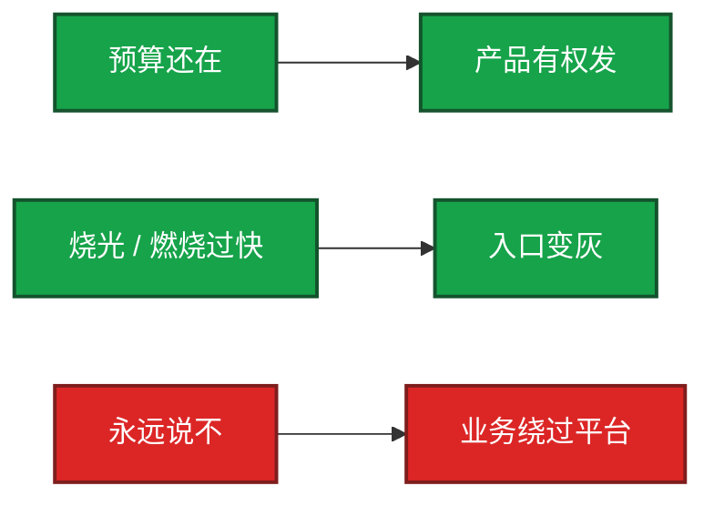

# 01｜SRE 职责与平台工程 · 练习题

先自己画图或口述，再对照解答。每题标了覆盖范围：

| 标记 | 含义 |
|------|------|
| **核心** | 不懂整章就没建立起来 |
| **必会** | 值班和面试都要能讲 |
| **常用** | 线上会反复碰到 |
| **常考** | 白板和追问的高频口径 |

## 本题目录

- [Q1 四角色边界](#q1)
- [Q2 Toil 与 50%](#q2)
- [Q3 500 人平台怎么拆](#q3)
- [Q4 You build it vs 嵌入](#q4)
- [Q5 错误预算当刹车](#q5)
- [Q6 Operator 还是 Job](#q6)
- [Q7 英雄文化 / oncall](#q7)
- [Q8 契约挂哪、值班验收](#q8)
- [Q9 从零路径与排障分流](#q9)
- [合上书](#合上书)

---

## Q1

**★★★★★｜四角色是什么？SRE 和平台工程差在哪？画图**

**覆盖**：核心 · 必会 · 常考

### 场景

白板：「从零给 500 个研发做 DevOps 平台。」有人开始背 Jenkins。追问：「你这是运维、DevOps、SRE 还是平台工程？」

### 完整解答

四个角色单位不同：传统运维 = **工单**；DevOps = **团队习惯**；SRE = **可靠性 + Toil**；平台工程 = **内部产品的 SLO**。



Google 口径：SRE = 用软件工程做运维。和产品的合同是 **错误预算**（算法见 02），不是工单 SLA。平台工程把高频路径做成门户：环境 / 流水线 / 日志 / 回滚。两者经常同一团队，但白板上要能拆开：**SRE 对可靠性负责，平台对研发体验和平台 SLO 负责。**

### 再追问

- 定级年包怎么从四角色推？——不推。L5 / L6 → [01-能力模型](../../01-职业发展/01-能力模型/)。
- DevOps 和 SRE 能否共存？——能。DevOps 是文化；SRE 是工种和合同。
- 只会装集群？——传统运维证据，不是 SRE。

---

## Q2

**★★★★★｜什么叫 Toil？为什么目标约 50%？为什么不能加人值班？**

**覆盖**：核心 · 必会 · 常考

### 场景

开服周全员 SSH 改配置。告警每条人肉 grep。证书到期前两周值班抄 pem。总监说再批 8 个值班 HC。

### 完整解答

Toil 要六条：手工、重复、可自动化、战术打断、**无持久价值**、**随规模线性涨**。上面三例全中。设计 SLO、写 Operator、做演练 **不是 Toil**。

| 例 | 线性涨在哪 | 砍成什么 |
|----|------------|----------|
| 开服 SSH | 服 ×2 工时 ×2 | 配置 / 环境 API，门户点开 |
| 告警人肉 grep | 告警 ×2 人时 ×2 | 可操作告警 + 自助日志 |
| 证书手抄 pem | 到期数 ×2 | Operator 续期，失败才页人 |

目标：SRE 时间 Toil **约 50% 以下**。超过 = 用人力扩容。砍法：平台 / API / 门禁 / 长状态 Operator。加人值班只换线性系数，服 ×2 人还得 ×2。

### 再追问

- 「我很忙」就是 Toil？——否。有持久价值的工程再忙也不是。
- 一年一次的合规审计必须平台化？——否。先砍每周线性涨的。
- 50% 是硬 SLA？——是方向线。面试答「压到约 50% 以下，用 Toil 占比和逃逸工单验收」，不要编精确公式。

---

## Q3

**★★★★★｜500 人五语言，内部开发者平台怎么拆？**

**覆盖**：核心 · 必会 · 常考

### 场景

Python / Java / Go / Node / C++。有人要做五套互不相认的「平台」。另有人用门户页面数当 KPI。

### 完整解答

**一个门户 + 语言模板 + 同一套制品 / 扫描 / 回滚契约。** 最低四条自助：开测试环境、跑流水线、看日志、点回滚。C++ 有状态可以没有「一键生产开服」，但必须同一入口走审批 + 窗口，禁止 IM 找人。

平台 SLO 订：门户可用性、环境开通 P95、流水线启动 P95、回滚成功率、逃逸工单（看日志 / 回滚 / 开环境仍提单的比例）。**不订页面数。** 流水线实现 → [05-02](../../05-工程化与自动化/02-CI-CD/)；GitOps → [04-22](../../04-Kubernetes/22-GitOps-ArgoCD与Tekton/)。



### 再追问

- 安全 / 稳定 / 性能谁的 SLO？——平台的。不是「研发自己看着办」也不是菜单项。
- 测试环境要不要变更单？——自助 + 配额拒绝。生产账号 / 集群仍审批。

---

## Q4

**★★★★☆｜You build it you run it 还是 SRE 嵌入？何时收回？**

**覆盖**：必会 · 常考

### 场景

总监：每个业务组配 2 个驻场 SRE。支付和战斗房也要「谁开发谁值班」。另有人说开测试环境也必须驻场点。

### 完整解答

| 模式 | 用 | 不用 |
|------|----|------|
| You build it | 无状态、爆破半径限于该产品、研发能回滚 | 支付、登录、有状态战斗房当默认 |
| 平台自助 | 同样的事 ≥ 几十次 | 用驻场代替开环境 / 看日志 |
| 嵌入 | 域知识厚、P0 爆破半径、产出是域内 API | 按编制摊人、无退出日 |
| 工单 | 生产账号、防火墙、买集群 | 测试环境、点回滚 |

派驻必须写退出：自助通、runbook 别人能值班、Toil 可测 → **人收回平台**。驻场期间禁止当需求人力。没有退出日 = 变相运维外包。有状态细节 → [08](../../08-游戏运维专题/)。

开测试环境走驻场 = 把平台自助错配成嵌入。支付默认 You build it = 把高爆破半径错配成产品 pager。两问都能当场改判。

### 再追问

- 嵌入写业务功能？——否。写域内自动化和门禁。
- 没有退出的驻场？——变相运维外包，规模一涨 Toil 线性涨。

---

## Q5

**★★★★★｜稳定性 vs 速度：错误预算怎么当刹车？运维能永远说不吗？**

**覆盖**：核心 · 必会 · 常考

### 场景

预算还在，SRE 一律冻结发版。业务绕过平台私发。另一次预算烧光，群里说「今晚先发，明天补单」。

### 完整解答

错误预算是和产品的 **合同**：预算还在，产品有权发；烧光或燃烧过快，**入口变灰**，先还可靠性。否决权挂预算，不挂脾气。



永远说不 → 平台被绕开。烧光仍放行 → 合同是假的。例外必须 **书面破窗**（谁批、何时还），不能群里口头。

公式、燃烧率、FinOps → [02](../02-SLO错误预算与FinOps/)。游戏登录 / 战斗窗口 → [08-09](../../08-游戏运维专题/09-游戏SRE稳定性/)。本章只判挂哪：CI / 发布 / 回滚入口，**不挂 wiki**。

### 再追问

- 门禁实现必须是 Admission？——不必。挂 CI check 或发布系统都行，要拦得住按钮。
- 平台 SLO 破了谁停？——先停依赖门户的变更；已有流量通常还在，不要先踢玩家。

---

## Q6

**★★★★☆｜SRE 用 Go 写 Operator 减 Toil。开服脚本要不要做成控制器？**

**覆盖**：必会 · 常用 · 常考

### 场景

有人要把「云原生化开服」写成 15s 调和一次的 Operator。另有人说证书续期继续人肉，因为「写控制器太重」。

### 完整解答

长生命周期、要持续调和、失败要重试、status 给人看 → **写 Operator**（证书、环境生命周期、分片期望）。一次性开服、一次迁库、活动脚本 → **Job**。SSH 剧本塞进 Reconcile = 用控制器放大 Toil。机制、finalizer、CRD 升级 → [04-20](../../04-Kubernetes/20-Operator与CRD/)。

证书手抄满足 Toil 六条，正是 Operator 的好题；开服 Job 不是。会写 Go ≠ 已经有平台工程。

### 再追问

- 没有控制器的 CRD？——etcd 里一坨 JSON，谁也不执行。
- Operator 挂了要不要重启战斗服？——先看它管的是不是已运行进程的唯一保活；多数情况先看影响面，不要条件反射重启逻辑服（04-20）。

---

## Q7

**★★★★☆｜救火明星休假，没人能开服。oncall 周在写需求对不对？**

**覆盖**：必会 · 常考

### 场景

开服失败靠某个人通宵捞回来，KPI 算他高阶。值班周排了三个需求。P0 来时人在写代码。

### 完整解答

英雄文化是单点故障。短期像资产，长期组织不写 runbook、不测负荷、不砍 Toil。替代：非作者能按文档做完；页次数 / 夜间唤醒 / Toil 占比有上限。

**oncall 不是写需求。** 当周只认领、止血、runbook、升级。负荷破线先减告警、加自助，不用需求填工时。KPI 把「通宵捞开服」标成高阶，会激励单点、惩罚写 runbook 的人。事件字段、war room → [05-06](../../05-工程化与自动化/06-运维平台与Oncall/)。

### 再追问

- 召回休假明星当流程？——错。当周用现有 runbook；事后补演练。
- 加班多 = 负责？——加班多常常是 Toil 在涨。
- 值班周「顺手把需求做了」算工程化？——否。那是把 oncall 当人力池，P0 来了人在写代码。

---

## Q8

**★★★★☆｜谁自助、谁审批？值班四条检查和验收过线是什么？**

**覆盖**：必会 · 常用

### 场景

测试环境也走生产变更单。回滚只有某个人 shell history 里的命令。周会展示「本周上了 12 个页面」。值班不知道先敲什么。

### 完整解答

| 路径 | 自助 | 审批 | 挂哪 |
|------|------|------|------|
| 测试环境 | 研发 | 超配额平台拒 | 配额，不是变更单 |
| 日志 / 无状态回滚 | 研发 | 预算烧光则拒 | 门户 / 回滚 API |
| 生产账号、集群 | 否 | SRE + 安全 | 工单 |
| 有状态开服 / 热更 | 否（入口仍在门户） | 窗口 + 预算 | 游戏变更窗口 |
| 生产发版 | 点同一按钮 | 预算 / 安全 / 窗口 | **CI 入口**，不挂 wiki |

值班先四条：

```bash
curl -sf "$IDP/healthz"; curl -sf "$CI/healthz"
kubectl -n platform get deploy,po
kubectl get env.platform.example.com -A | grep -E 'Pending|Failed' || true
```

过线：Toil **< ~50%**；逃逸工单下降；值班不排需求；预算烧光按钮灰；非作者能回滚。不过线：页面很多但三类工单不降。CMDB 字段不在这题 → [05-06](../../05-工程化与自动化/06-运维平台与Oncall/)。

### 再追问

- healthz 200 但开环境全 Pending？——门户活着、自助断了。查 Operator / 配额，不要宣布平台已好。
- 回滚必须 kubectl？——必须打可审计 API；kubectl 是应急，不是产品面。

---

## Q9

**★★★★☆｜从零搭基础设施，先做什么？给出现象你走哪条？**

**覆盖**：必会 · 常用 · 常考

### 场景

面试官：「从零。」有人从 Thanos 和网格讲起。四个工单：① 开服全员 SSH ② 门户很全日志仍提单 ③ 开服 Job 写成 Operator 打生产 ④ 预算烧光仍发版。

### 完整解答

从零 **6 段**，按阶段答，不要从插件名起：


Thanos / Istio / Karmada → [04](../04-大规模可靠性架构/)。IaC 语法 → Terraform / Ansible 章。先上大而全菜单再劝人用，是反的。

| # | 走哪条 | 不要做 |
|---|--------|--------|
| ① | Toil 立项 → 配置 / 环境 API | 先批值班 HC |
| ② | 量逃逸率；补 RBAC 和入口 | 再加页面 |
| ③ | 改回 Job；长状态才 Operator | 给控制器加副本「加快」 |
| ④ | 入口变灰；书面破窗 | 群里口头放行 |

三问：平台还在？能否自助？流量还通？平台挂了先停变更，不要先踢玩家。

### 再追问

- 先上大而全菜单再劝人用？——反了。先砍线性涨的高频路径。
- 五语言五套平台？——收回门户与契约，不要给 C++ 做第六套旁路。
- 从零先讲网格和多集群？——那是 04 章选型。本章先答谁是客户、何为 Toil、何为自助、门禁挂哪。

---

## 合上书

- [ ] 能画出四角色，并说出 SRE ≠ 会装 K8s、平台工程 ≠ 页面数
- [ ] 能把 Toil 讲到六条和约 50%，三例怎么砍，为什么不是加人
- [ ] 能画出 500 人一个门户 + 语言模板，平台 SLO 订哪几条
- [ ] 能判断 You build it / 自助 / 嵌入 / 工单，派驻有退出
- [ ] 能把错误预算讲成合同：还在能发、烧光入口变灰，不挂 wiki
- [ ] 能判断 Operator vs Job；英雄文化错在哪；oncall 不写需求
- [ ] 能默写值班四条检查，并按分流处理 SSH 开服 / 逃逸工单 / 假平台
