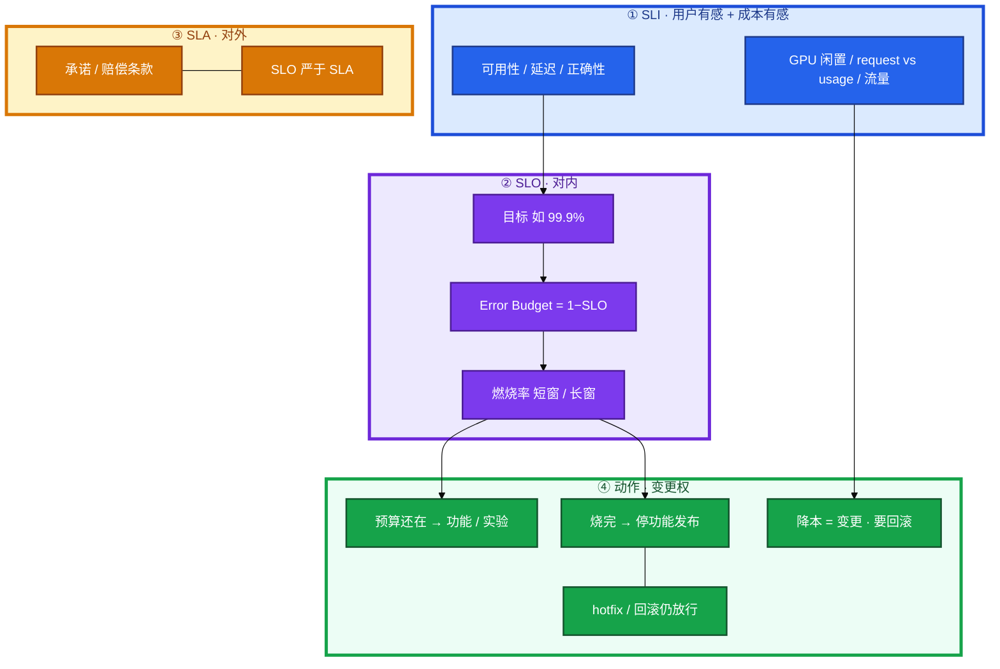
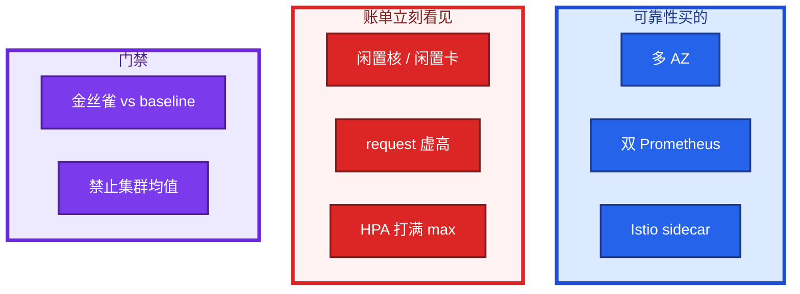
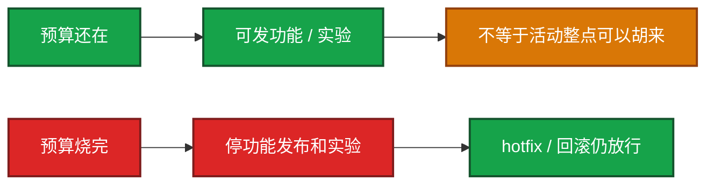
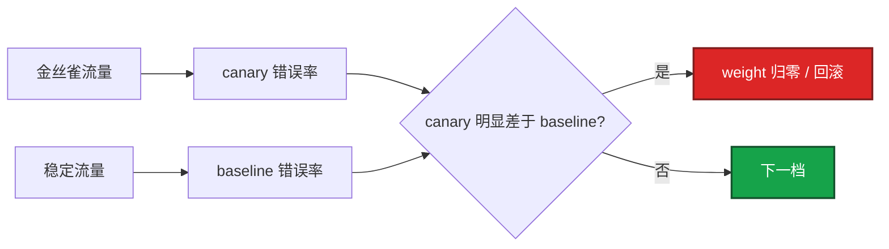
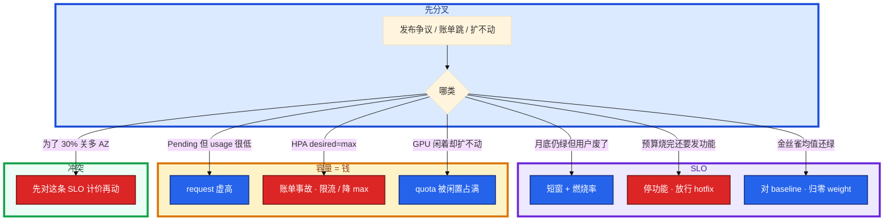

# SLO、错误预算与 FinOps


版本周后账单环比 +40%，GPU 闲着、HPA 把无状态网关打到 max。周会上有人甩月历 99.9% 说还能发；财务要砍 30%，有人周五要把 request 砍一半、把多 AZ 改单 AZ。白板随后就问：错误预算烧完还能发新功能吗？金丝雀看集群平均行不行？

先别动手。这一章后半全是你会动手的：**怎么订 SLI、怎么用燃烧率叫人、怎么把降本拆成可回滚的变更。** 前面的四个词和算术，是为了让你动手时不拿 CPU 当 SLI、不拿月底平均顶事故、不把 FinOps 丢给财务单独做。

**读完你能：** 白板上分清 SLI / SLO / SLA / Error Budget；99.9 和 99.99 能换成分钟；燃烧率短窗叫人、长窗冻变更；金丝雀用自己的错误率对 baseline；30% 降本能拆成闲置 / rightsizing / 存储 / 流量，并讲清浪费的核为什么是可靠性问题。

## 本章目录

缩进 = 上下级。3 下面才是 3.1。

想钉在**正文左边**跟着滚：菜单 **查看 → 打开视图 → 大纲**。Markdown 预览做不到独立左栏，目录只能写在文章开头。

- [1. 基本概念](#1-基本概念)
- [2. 架构图](#2-架构图)
- [3. 原理](#3-原理)
  - [3.1 可用性算术](#31-可用性算术999-换成分钟)
  - [3.2 错误预算](#32-错误预算停什么不停什么)
  - [3.3 燃烧率](#33-燃烧率短窗叫人长窗冻变更)
  - [3.4 FinOps 即可靠性](#34-finops-即可靠性浪费的核就是扩不动)
  - [3.5 这条 SLO 值这笔钱](#35-这条-slo-值这笔钱)
- [4. 安装部署](#4-安装部署)
  - [4.1 生产怎么选](#41-生产怎么选)
  - [4.2 政策落地](#42-政策落地你实际看到什么)
- [5. 核心配置](#5-核心配置)
- [6. 常用命令](#6-常用命令)
- [7. 常用操作](#7-常用操作)
  - [7.1 预算周会](#71-预算周会)
  - [7.2 金丝雀门禁](#72-金丝雀门禁对-baseline-不对均值)
  - [7.3 降本当变更](#73-降本当变更)
  - [7.4 30% 怎么拆](#74-30-怎么拆)
- [8. 生产排障](#8-生产排障)
- [9. 必会 · 常考](#9-必会--常考)
- [合上书](#合上书问自己)

**本章不讲：** 游戏登录 / 战斗 / 支付分条 SLI 全表 → [08-09](../../08-游戏运维专题/09-游戏SRE稳定性/)；云账单扫闲置命令、包年 / Spot → [07-06](../../07-云平台/06-成本治理/)；Prometheus 安装与高基数 → [04-18](../../04-Kubernetes/18-监控与可观测性/)；HPA 控制器细节 → [04-07](../../04-Kubernetes/07-弹性伸缩/)；Toil / 平台门户 → [01](../01-SRE职责与平台工程/)；Thanos 组件 → [04](../04-大规模可靠性架构/)；事故指挥 → [03](../03-事故管理与无责复盘/)。

---

## 1. 基本概念

四个词是一份合同，不是四个同义词。平台 / SaaS 口径先立住；游戏 5 分钟登录、进战斗、支付分条表只在这里点一句：**去 [08-09](../../08-游戏运维专题/09-游戏SRE稳定性/)，不要用月历网关 200 冒充。**

| 词 | 是什么 | 对谁说 |
|----|--------|--------|
| **SLI** | 怎么量：成功事件 / 有效事件 | 工程：用户有感、可测、能告警 |
| **SLO** | SLI 的内部目标 | 团队：破了吃 Error Budget、卡发布 |
| **SLA** | 对外契约，常带赔偿 / 补偿 | 客户、法务、商务；通常松于 SLO |
| **Error Budget** | `1 − SLO` | 还能承受多少失败；用来发功能，不是用来「能挂多久」 |

例：SLO 99.9% → 预算 0.1%。30 天窗口里大约 **43 分钟**可以失败（3.1）。预算是变更权，不是躺平权。

| 在这份合同里 | 不在这里当主指标 |
|----------------|------------------|
| 请求成功、延迟达标、正确性、关键写成功 | CPU、机器台数、Ready 副本数 |
| 短窗口 + 燃烧率 | 只用月底日历平均 |
| 成本 SLI：GPU 闲置、request vs usage、流量异常 | 财务一张「省了 30%」无分项 |

好 SLI 三条，缺一条就不要上看板当刹车：

| 条件 | 意思 | 反例 |
|------|------|------|
| **用户有感** | 失败时用户废了某次操作 | CPU 90%、磁盘 80% |
| **可测** | 有事件流或探针，分母清楚 | 「体验好」「机器够」 |
| **能告警** | 能设窗口和阈值，能路由到人 | 季度满意度问卷 |

坏 SLI 不是「完全不看」，是**不能当 SLO 的输入**。CPU 给容量和 HPA 用（04-07）；机器台数给容量规划用。拿它们当可用性，集群全绿、下单全失败时你还在说没破线。

> **记住**：SLI 量用户；SLO 卡团队；SLA 卡合同；Error Budget = `1 − SLO`。CPU 和「机器台数」不是 SLI。成本是架构问题，不是财务周才出现的表。

---

## 2. 架构图

先把整张图钉住。后面算术、燃烧率、金丝雀、降本都对着这张图说话。



图上四条线：

1. **SLI 不是机器。** 可用性 / 延迟 / 正确性进 SLO；CPU 进容量，不进这条合同。
2. **SLA 松于 SLO。** 用 SLA 数字当内部目标，破线时法务还没动、用户已经废了。
3. **Error Budget 管功能发布，不管 hotfix。** 烧完停实验，不停回滚。
4. **成本 SLI 和可用性 SLI 并列。** 浪费的核会在下一场高峰变成 Pending；FinOps 不是另开一张财务表。

CMP / 标签 / 账单产品行是**手段**（落地见 07-06），本章要的是：谁对这条 SLI 负责、优化走变更、30% 能拆成桶。

三种面试里会被揉成一句的东西，故障域不一样：



多 AZ、双 Prometheus、sidecar 都烧钱。面试要能讲「这条 SLO 值这笔钱」，不是把它们骂成浪费，也不是凡高级架构无条件上。闲置和虚高 request 才是「付了钱却扩不动」。

---

## 3. 原理

原理只保留白板和周会会用到的：分钟怎么换、预算停什么、燃烧率为何不能等月底、浪费的核为何是可靠性事故。

**本节 5 块：** 3.1 算术 · 3.2 预算政策 · 3.3 燃烧率 · 3.4 FinOps · 3.5 这笔钱

### 3.1 可用性算术：99.9 换成分钟

30 天 ≈ **43200 分钟**。失败预算 = `(1 − SLO) × 43200`。

| SLO | 月失败预算 | 口算 |
|-----|------------|------|
| 99% | ≈ 7.2 小时 | 太松，内部很少当目标 |
| 99.9% | ≈ **43 分钟** | 面试默认档 |
| 99.95% | ≈ 21.6 分钟 | 再严一档 |
| 99.99% | ≈ **4.3 分钟** | 一次发布窗口就能烧光 |
| 99.999% | ≈ 26 秒 | 没有极强控制别写进 SLO |

99.9 → 99.99 不是「再加一个 9」。预算从 43 分钟掉到 4.3 分钟，**发布、滚动、演练、多 AZ 故障切换**都要重新计价。

**日历月会掩盖短窗口事故。** 开服或故障 10 分钟全红，其余 29 天全绿，月底仍可算成 99.9%+。所以观测要用**短窗口**；叫人要用**燃烧率**（3.3），不要等出账日或月末报表。

有效事件分母要先定义：探针、健康检查、内部重试、客户端取消算不算失败，写进 SLO 说明。分母一改，历史预算全废，这是变更。

> **记住**：99.9% ≈ 43 分/月，99.99% ≈ 4.3 分/月。月历平均不是告警。

### 3.2 错误预算：停什么不停什么

Error Budget = `1 − SLO`。耗尽 = 这个窗口里失败份额已经用完。



| 预算状态 | 停 | 不停 |
|----------|----|------|
| 还在 | 仍受变更窗口约束 | 功能、实验、常规灰度 |
| 烧完 / 将尽 | **功能发布、A/B、新玩法、非必要扩面** | **hotfix、回滚、安全修复、把 SLO 往回救的变更** |

烧完还发新功能 = 用用户失败给自己买迭代。冻 hotfix = 用政策把已经破的 SLO 焊死。

预算还在 **≠ 活动整点可以胡来**。游戏整点、战斗热更、合服窗口纪律在 [08-09](../../08-游戏运维专题/09-游戏SRE稳定性/)。平台侧同理：大促、登录洪峰、支付日，短窗燃烧率优先于「本月还剩预算」。

计划内维护（已公告停机）和故障分账，否则团队会把维护藏进「没破 SLO」。SLA 除外项写清；没公告的停机两边都记。

### 3.3 燃烧率：短窗叫人，长窗冻变更

燃烧率 = 当前错误率 / 预算允许的错误率。SLO 99.9% → 允许错误率 0.1%。若当前错误率 1.44%，燃烧率 = **14.4**。燃烧率 1 = 按月预算匀速烧完；大于 1 就是提前烧光。

Google SRE Workbook 的思想（数字记一对即可，不必背全表）：

| 意图 | 典型组合 | 动作 |
|------|----------|------|
| 正在崩 | 短窗口（约 1h，再加更短窗防毛刺）× **高燃烧（如 14.4x）** | **立刻叫人** |
| 真故障但稍慢 | 约 6h × **中燃烧（如 6x）** | 仍叫人 / 升 P1 |
| 慢漏 | 长窗口（约 3d～28d）× 燃烧率 ~1 | **周会冻变更**，不半夜叫 |

两条窗口**同时满足**才叫，是为了：只看瞬时 5xx，压测和毛刺会误叫；只看 28 天或月底 99.9%，正在崩时太晚。短窗负责「现在」，长窗负责「这周还能不能发」。

告警规则怎么写成 PromQL、如何避免高基数，在 [04-18](../../04-Kubernetes/18-监控与可观测性/) 3.4–3.5。本章要的是政策：P0 看短窗燃烧，发布节奏看长窗预算，不要只看月底绿。

### 3.4 FinOps 即可靠性：浪费的核就是扩不动

FinOps 在这里不是折扣表、不是 RI 覆盖率竞赛。它是：**容量余量被浪费占用之后，下一场高峰你付了钱却扩不动。**

| 浪费 | 可靠性怎么爆 |
|------|----------------|
| 核 / 卡闲置 | quota 和节点组被占满；真正要扩时 Pending / 没卡 |
| **request 虚高** | 调度按 request 扣账，以为没资源；usage 其实很低 |
| **HPA 乱扩** | 超时重试打满 max = **账单事故**；下游更崩 |
| 流量走错路 | NAT / 跨 AZ / 公共读把钱烧在路径上，扩计算也救不了延迟 |

HPA 公式和 Conditions 在 [04-07](../../04-Kubernetes/07-弹性伸缩/)。这里只记三句：HPA 只改 replicas；没 requests 算不了利用率；max 无上限 + 错误重试 = 账单 P0。Rightsizing 是把 request 贴近真实 usage，不是把生产 buffer 砍光。

CMP、标签、成本中心是**归因手段**：说不清「这 8 万是闲置 GPU 还是 NAT」，30% 就是一个百分比。扫闲置命令、包年 / Spot 怎么买 → [07-06](../../07-云平台/06-成本治理/)。

成本 SLI 举例（要能告警，细节操作仍去 07-06）：

| 成本 SLI | 用户 / 系统废了什么 |
|----------|---------------------|
| GPU 闲置率（SM / 显存长时间极低） | 付钱占着 quota，推理要扩时没卡 |
| request vs usage 比 | 调度骗自己；节点看起来满、应用很闲 |
| NAT / 公网 / 跨 AZ 字节阶跃 | 路径错了；延迟和账单一起坏 |

> **记住**：闲置不是「财务不高兴」，是高峰没有余量。request 虚高是调度事故。HPA 打满是账单事故。

### 3.5 这条 SLO 值这笔钱

可靠性和成本默认冲突。面试要能站在合同两边，不要只骂贵、也不要无条件堆高可用。

| 买什么 | 为哪条 SLO | 不值的时候 |
|--------|------------|------------|
| 多 AZ | 登录 / API / 支付要抗单 AZ | 每个区服计算面都跨 AZ，流量费接近计算本身（07-06） |
| 双 Prometheus | 告警必须活着 | 两套独立电话、两套高基数；HA 是双拉 + 去重（04-18） |
| Istio sidecar | 需要网格：mTLS、拆分、熔断 | 每 Pod 固定税；没消费网格能力就是给 SLO 加成本 |

「从 99.9 提到 99.99」要先问：4.3 分钟预算够不够覆盖滚动和一次故障切换。不够就买多 AZ / 更快回滚 / 更小金丝雀，而不是只加副本。加副本会同时烧预算风险和账单。

30% 降本若靠关掉多 AZ、关掉双 Prom、HPA min 打到 1，那是把 SLO 卖了。要拆桶（7.4），并证明每条 SLO 仍站得住。

---

## 4. 安装部署

### 4.1 生产怎么选

| 项 | 选 | 不选 |
|----|----|------|
| 主 SLI | 用户操作成功 / 延迟 / 正确性 | CPU、机器台数、网关探活 200 |
| 窗口 | 短窗 + 燃烧率；月历只做对账 | 只用 30 天平均当告警 |
| SLO vs SLA | 内部严、对外松；数字分开写 | 合同 99.9 直接当值班刹车 |
| 预算政策 | 烧完停功能 / 实验；不冻 hotfix | 烧完连回滚都停；或预算还在就整点胡来 |
| 金丝雀 | 自身错误率对 **baseline** | 对集群均值 |
| 成本 | 四桶可回滚；CMP 标签是手段 | 只报一个 30%；财务周直接点控制台 |
| 游戏口径 | 短窗口登录等 → 08-09 | 用本章 SaaS 表冒充游戏全表 |

拍 99.99 之前先量三个月实际错误率，再留余量。没有基线的 9 是口号。

### 4.2 政策落地你实际看到什么

不是再装一套 Prometheus。落地是三份能在周会打开的东西：

| 落地物 | 必须能回答 |
|--------|------------|
| SLO 看板 | 本窗口 SLI、剩余预算、短窗 / 长窗燃烧率 |
| 错误预算政策 | 烧到阈值停哪些发布；谁有权放行 hotfix |
| 成本看板 | 闲置、request/usage、流量异常；标签能归因到 owner |

验收：金丝雀失败时门禁看的是**这一档自己的错误率**，不是集群平均被稀释后的绿。降本项能指出属于 7.4 哪一桶，有回滚，有观察窗口。CMP 只是把标签和账单接上，没有 SLO 仍是更贵的报表。

看板最小集（版本周必须能投屏）：

| 板 | 必须有 |
|----|--------|
| 可用性 | 短窗成功率和燃烧率，不是月底一个数 |
| 发布 | 金丝雀 vs baseline；预算剩余 |
| 容量 | request vs usage；HPA desired / max |
| 成本 | GPU 闲置、流量阶跃；按 owner，不按「公司总计」 |

缺燃烧率：你会用月底 99.9 顶正在崩的 10 分钟。缺 request vs usage：你会一边喊扩容一边占满调度。缺 owner：30% 无法拆给人。

---

## 5. 核心配置

只动有证据的项。改 SLO 数字、改 request、改 HPA max，都是变更。

| 项 | 生产怎么用 | 改错会怎样 |
|----|------------|------------|
| SLO 目标 | 有基线再留余量；SLA 另写更松的数 | 拍 99.99 → 每次滚动都破 |
| 短窗 | 5m～1h 级看用户有感 | 只用 30d 平均 |
| 燃烧率 | 高燃烧短窗叫人；~1x 长窗进周会 | 只看瞬时 5xx 或只看月末 |
| Error Budget 阈值 | 如剩余 < 20% 冻功能发布 | 没有阈值 = 政策是 PPT |
| 金丝雀比较 | vs 同期 baseline / 旧版本 | vs 含金丝雀的集群均值 |
| `resources.requests` | 贴近 usage + 合理 buffer | 虚高 → 调度以为没资源 |
| HPA min / max | min 保底 SLO；max 防账单 | max 无上限 + 重试风暴 |
| CMP 标签 | `env` / `owner` / `cost-center` / `ttl` | 无标签则 30% 无法归因 |
| 成本 SLI 阈值 | GPU 闲置、NAT 字节阶跃 | 细节阈值和扫单 → 07-06 |

> **记住**：SLO、request、HPA max、标签，改哪一项都要能回滚。CMP 没有 owner 标签，FinOps 只是口号。

内部 SLO 不要原样印到对外 SLA。对外写承诺和赔偿；对内写窗口和燃烧率。混写成一句 99.9%，值班会被月历绑架。

---

## 6. 常用命令

值班先看合同，不是先重启、也不是先打开折扣计算器。现场顺序是读 SLI 和燃烧率，再看 request / HPA，再看成本阶跃。

| 目的 | 看什么 | 不要看成 |
|------|--------|----------|
| 本窗口还绿不绿 | 短窗 SLI + 燃烧率 | 月底 99.9% |
| 还能不能发 | 剩余 Error Budget、长窗慢烧 | 「本月平均还行」 |
| 调度还有没有余量 | request vs usage、Pending | 只看 CPU 瞬时 |
| HPA 是不是在烧钱 | `desired` 顶 `max`、扩速 | 「自动扩了所以健康」 |
| 成本哪一桶 | GPU 闲置、流量产品行、owner | 一个总计百分比 |

示意（思想；完整 PromQL / 高基数在 04-18，HPA 在 04-07，扫闲置在 07-06）：

```bash
# 调度是否被 request 骗了
kubectl top pod -n <ns>
kubectl get pod -n <ns> -o custom-columns=\
NAME:.metadata.name,REQ_CPU:.spec.containers[*].resources.requests.cpu,REQ_MEM:.spec.containers[*].resources.requests.memory

# HPA 有没有顶满（账单事故候选）
kubectl get hpa -A
kubectl describe hpa <name> -n <ns>
```

燃烧率口算：`当前错误率 / (1 − SLO)`。99.9% 时错误率 1.4% → 约 14x，短窗该叫人，不要等月末。

金丝雀：只拉 **canary 子集** 的失败率，对 **baseline 子集**（旧版本或稳定流量）。不要 `sum(rate(…))` 掉全集群再跟自己比。

值班口述四句，避免一开口就谈赔偿或折扣：

1. 哪一条 SLI、哪个窗口、燃烧率多少
2. 剩余预算够不够撑过这次发布
3. 容量：request / HPA / Pending，不是「机器还很多」
4. 成本：闲置还是路径，owner 是谁；优化进变更单

第 1～2 句对发布。第 3～4 句对 FinOps。不要用第 4 句否定第 1 句（「省钱所以 SLO 可以松」），也不要用月底绿否定短窗红。

---

## 7. 常用操作

### 7.1 预算周会

周会只回答三件事：烧了多少、哪次发布 / 故障烧的、下一步冻还是修。没有这三行，Error Budget 是 PPT。

```
  剩余预算
       |
       +-- 充足 → 功能发布按原窗口；仍看短窗燃烧率
       +-- 将尽（如 <20%）→ 冻实验、冻非必要灰度
       +-- 烧完 → 停功能发布；hotfix / 回滚仍走绿色通道
```

冻结名单写进发布系统，不要写在聊天里。例外（仍要发功能）必须有名字、有过期时间、有观察指标。无限期例外 = 拆掉政策。

游戏活动周：提高观察密度，不提高随便发版的权利（08-09）。平台大促同理。

### 7.2 金丝雀门禁：对 baseline，不对均值

SLO 进门禁：每一档放量看**这一档自己的错误率、延迟、饱和**，和 **baseline** 比。



对集群均值的错：金丝雀 5% 流量、错误率 20%，全集群可能只从 0.1% 漂到 1.1%，均值仍「看起来还行」。门禁被稀释，事故在 100% 时才出现。

示意（不是某家插件文档）：

```yaml
gate:
  compare: canary_sli vs baseline_sli
  not: canary vs cluster_mean
  abort_if: burn_rate_short_window 过高 或 canary 连续差于 baseline
```

预算将尽时，金丝雀档位更小、观察更长，而不是「均值还绿就全量」。

### 7.3 降本当变更

改 request、降规格、收 HPA max、关多余副本、动流量路径，都是生产变更。要有回滚、有观察 SLI，不要财务周在控制台点。

| 动作 | 观察 | 回滚 |
|------|------|------|
| request rightsizing | 调度 Pending、HPA 利用率、P99 | 改回旧 request |
| 降规格 / 减卡 | 延迟、队列、GPU SM | 改回机型 |
| 降 HPA max / min | 峰值是否 Pending、是否破 SLO | 改回 max |
| 收闲置环境 | 是否误伤备用 / 演练环境 | 标签 `ttl` 未到期不删 |

优化后 SLO 燃烧率抬升 = 变更失败，先回滚再解释省了多少。07-06 写过：CDN TTL、并 NAT、缩节点没有 drain，都会直接打用户。本章加一句：**省下的钱如果买回不了余量，这场 FinOps 是可靠性事故。**

### 7.4 30% 怎么拆

面试「架构 + HPA rightsizing 砍 30%」，禁止只报一个百分比。拆成四桶，每桶有数、有主、有回滚：

| 桶 | 典型来源 | 不是这个桶 |
|----|----------|------------|
| **闲置回收** | 停掉的环境、零流量 LB、闲置 GPU | 把生产 buffer、多 AZ 当闲置砍 |
| **规格 rightsizing** | request 贴近 usage、机型降档、HPA 目标校正 | 把 HPA max 砍到峰值必挂 |
| **存储生命周期** | 日志 / 备份 TTL、冷热分层 | 关服立刻删备份（07-06） |
| **流量路径** | 镜像内网、少跨 AZ、少 NAT | 财务周乱改 CDN TTL |

四桶之和才是 30%。其中一桶为 0 要说清为什么（例如流量已经走内网）。靠「我们很注重成本」没有数字 = 没答。

CMP 在这里的位置：标签让四桶能对上 owner；它不替代 SLO，也不替代变更单。

---

## 8. 生产排障

三问：哪一条 SLI 在哪个窗口破了？剩余预算还够不够发？钱是闲置、虚高 request、HPA 打满，还是路径烧的？



| 现象 | 先做什么 | 不要做什么 |
|------|----------|------------|
| 10 分钟全红，月历仍 99.9% | 短窗燃烧率；P0 | 「没破 SLO」 |
| 预算烧完要上新功能 | 冻功能发布 | 连 hotfix 一起冻 |
| 金丝雀 20% 错、集群 1% | 对 baseline 熔断 | 看均值放全量 |
| usage 0.3c、request 4c、Pending | 降 request 当变更 | 先买一批节点 |
| HPA 打满 max，账单跳 | 限流 / 修重试 / 降 max | 再加一倍 max |
| GPU 闲置 70%，推理 Pending | 回收闲置占的卡 | 只向财务要新卡 |
| 为 30% 关掉双 Prom | 问告警这条 SLO 还要不要 | 把 HA 当浪费划掉 |
| 优化后 P99 炸 | 回滚变更 | 财务周继续点 |

活动高峰 etcd 那一套三问这里换成合同三问：用户废了哪条 SLI？预算还在不在？钱有没有变成余量？事故怎么指挥 → [03](../03-事故管理与无责复盘/)。

---

## 9. 必会 · 常考

白板和追问高频，能一口回：

| 说法 | 对错 | 口径 |
|------|:----:|------|
| SLI / SLO / SLA 是一回事 | 错 | 测量 / 内部目标 / 对外契约 |
| Error Budget 是「能挂多久」 | 错 | `1 − SLO`，管变更权 |
| CPU、机器台数是好 SLI | 错 | 用户有感、可测、能告警 |
| 99.9% 就是全年不能挂 | 错 | 月约 **43 分钟**失败预算 |
| 月底 99.9% 绿就没事故 | 错 | 短窗口 + 燃烧率 |
| 预算烧完连回滚都停 | 错 | 停功能 / 实验，不冻 hotfix |
| 预算还在就可以活动整点乱发 | 错 | 窗口纪律仍在；游戏见 08-09 |
| 金丝雀看集群平均即可 | 错 | 对 baseline，防稀释 |
| FinOps 是财务的表 | 错 | 浪费的核 = 高峰扩不动 |
| request 越大越稳 | 错 | 虚高骗调度，Pending |
| HPA 自动扩所以没容量问题 | 错 | 打满 max 是账单事故 |
| 30% 报一个总数就够 | 错 | 闲置 / rightsizing / 存储 / 流量 |
| 多 AZ / 双 Prom / sidecar 都该砍 | 错 | 先问这条 SLO 值不值 |
| 优化可以财务周直接点 | 错 | 生产变更，要回滚 |

数字：99.9% ≈ **43 分/月**；99.99% ≈ **4.3 分/月**；30 天 ≈ **43200 分**；燃烧率 14.4x / 1h ≈ 月预算的 **2%** 一小时烧完；Error Budget = **1 − SLO**；金丝雀对 **baseline**；降本四桶。

易混：SLI vs SLO vs SLA；月底平均 vs 短窗燃烧率；停功能 vs 停 hotfix；集群均值 vs baseline；闲置 vs 生产 buffer；request vs usage；HPA 扩容 vs 账单事故；CMP 标签 vs FinOps 本身；多 AZ 成本 vs 该 SLO 的故障域。

---

## 合上书，问自己

1. SLI / SLO / SLA / Error Budget 各对谁说？好 SLI 三条是什么？
2. 99.9% 和 99.99% 每月各允许多少分钟？为什么月历不够？
3. 预算烧完停什么、不停什么？预算还在就能整点胡来吗？
4. 燃烧率短窗和长窗各催谁做事？金丝雀为什么不能看集群均值？
5. 浪费的核 / 虚高 request / HPA 打满，分别怎么变成可靠性事故？
6. 30% 怎么拆四桶？多 AZ、双 Prometheus、Istio 怎样讲「这条 SLO 值这笔钱」？

六题都能口述，这一章就过了。下一章把事故指挥和无责复盘焊死：定级、止血、复盘改系统，而不是改人 → [03 事故管理与无责复盘](../03-事故管理与无责复盘/)。
