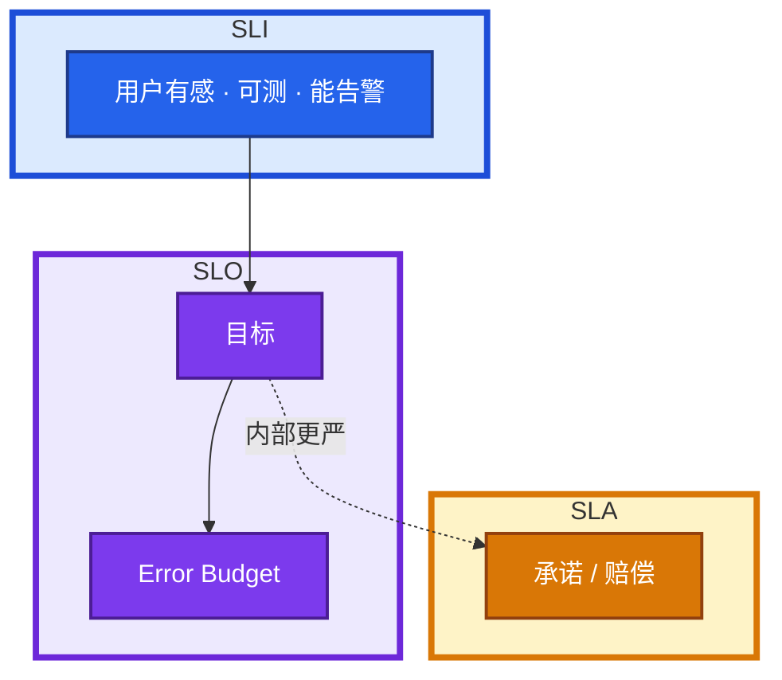
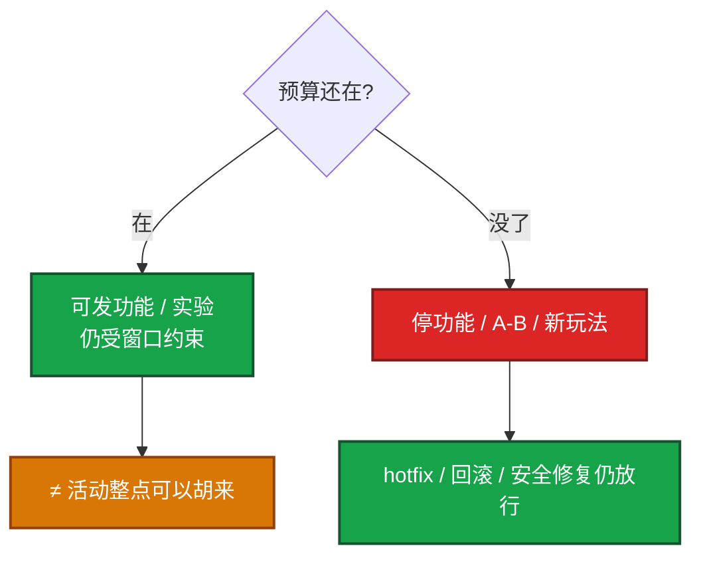

# 02｜SLO、错误预算与 FinOps · 练习题

先对照 [知识点](知识点.md) **本章主线** 自己口述，再对答案。每题标了覆盖范围：

| 标记 | 含义 |
|------|------|
| **核心** | 不懂整章就没建立起来 |
| **必会** | 值班和面试都要能讲 |
| **常用** | 线上会反复碰到 |
| **常考** | 白板和追问的高频口径 |

## 本题目录

- [Q1 四个词](#q1)
- [Q2 好 SLI / 坏 SLI](#q2)
- [Q3 分钟算术 / 月历](#q3)
- [Q4 错误预算停什么](#q4)
- [Q5 燃烧率](#q5)
- [Q6 金丝雀 vs 均值](#q6)
- [Q7 FinOps 即可靠性](#q7)
- [Q8 30% 怎么拆](#q8)
- [Q9 这条 SLO 值这笔钱](#q9)
- [Q10 给出现象先走哪条](#q10)
- [合上书](#合上书)

---

## Q1

**★★★★★｜SLI / SLO / SLA / Error Budget 是什么？画合同**

**覆盖**：核心 · 必会 · 常考

**对应**：知识点 §3.1

### 场景

白板：「把可用性和合同讲清楚。」有人开始背 99.9，有人把四个词当成同一个。

### 完整解答

**一句话**：SLI 度量、SLO 内部目标、SLA 对外承诺、Error Budget = 1−SLO 管变更权。

四个词是一份合同，不是同义词。

| 词 | 口径 |
|----|------|
| **SLI** | 怎么量（成功 / 有效事件） |
| **SLO** | 内部目标，破了吃预算、卡发布 |
| **SLA** | 对外契约，常带赔偿，通常**松于** SLO |
| **Error Budget** | `1 − SLO`，管**变更权** |



游戏 5 分钟登录 / 战斗 / 支付分条表在 [08-09](../../08-游戏运维专题/09-游戏SRE稳定性/)，本章用通用平台口径，不要把网关月历 200 两边都冒充。

### 再追问

- 预算是能挂多久吗？——否。是还能发多少功能 / 实验。
- SLA 写成 99.9，内部也订 99.9？——内部应更严，否则破线时合同还没动、用户已经废了。

---

## Q2

**★★★★★｜什么样的 SLI 能进 SLO？CPU 行不行？**

**覆盖**：核心 · 必会 · 常考

**对应**：知识点 §3.1

### 场景

有人把 CPU 90%、「机器还够」写进可用性看板，集群 Ready 全绿，下单全失败。

### 完整解答

**一句话**：好 SLI 三条：用户有感、可测、能告警；CPU / 机器台数不能当主 SLI。

好 SLI 三条：**用户有感、可测、能告警。** 缺一条就不要当 SLO 输入。

| 行 | 不行（可作旁路） |
|----|------------------|
| 请求成功、延迟达标、关键写正确 | CPU、磁盘、机器台数、探活 200 |
| 成本 SLI：GPU 闲置、request vs usage、流量阶跃 | 「我们很注重成本」无事件流 |

CPU 给 HPA / 容量用（04-07），不是可用性。机器台数更不是——一台配错生产库也是事故（指挥见 03）。

成本 SLI 同样要可测能告警：闲置率、request/usage 比、NAT 字节阶跃。细节扫单在 [07-06](../../07-云平台/06-成本治理/)。

### 再追问

- 探活一直 200 能当 SLI 吗？——不能当主 SLI。长连接探活恒 200，用户可以已经废了（08-09）。
- 季度满意度？——不能告警，进不了燃烧率。

---

## Q3

**★★★★★｜99.9% / 99.99% 每月允许多少分钟？月历为什么不够？**

**覆盖**：核心 · 必会 · 常考

**对应**：知识点 §3.1

### 场景

面试官：「从 99.9 提到 99.99，再把账单砍 30%。」有人说再加一个 9 而已。另一次：故障 10 分钟，月底报表仍绿。

### 完整解答

**一句话**：99.9% ≈ 43 分钟 / 月，99.99% ≈ 4.3 分钟；月历掩盖短窗口，要看燃烧率。

30 天 ≈ **43200 分钟**。预算 = `(1 − SLO) × 43200`。

- 99.9% → 约 **43 分钟**/月
- 99.99% → 约 **4.3 分钟**/月

再加一个 9 = 预算 ÷10。滚动、演练、一次故障切换都要重新计价，不是改个海报。

日历月会掩盖短窗口：10 分钟全红 + 29 天全绿，月底仍可 >99.9%。所以用**短窗口**看用户，用**燃烧率**叫人，月历只对账。

### 再追问

- 99.95%？——约 21.6 分钟。
- 分母含不含健康检查？——必须写进 SLO 说明；改分母 = 变更，历史预算作废。

---

## Q4

**★★★★★｜错误预算烧完停什么？不停什么？**

**覆盖**：核心 · 必会 · 常考

**对应**：知识点 §3.2

### 场景

周会：预算打光。有人说所有变更冻结；产品要上新实验。另一边：预算还剩一半，活动整点有人要发。

### 完整解答

**一句话**：预算烧完停功能 / 实验，不停 hotfix / 回滚 / 安全修复。

Error Budget = `1 − SLO`。烧完停的是**功能发布和实验**，不是把生产焊死。



冻 hotfix = 用政策阻止把 SLO 救回来。预算还在也不等于大促 / 游戏整点可以乱发——窗口纪律在 [08-09](../../08-游戏运维专题/09-游戏SRE稳定性/)。

计划内已公告维护和故障分账，不要把合服扣进故障预算。

### 再追问

- 剩余 <20%？——先冻实验和非必要灰度，不必等烧到 0。
- 例外怎么开？——有名字、有过期、有观察指标。无限期例外 = 拆政策。

---

## Q5

**★★★★☆｜燃烧率短窗和长窗各催谁？为什么不能只看月底 99.9%？**

**覆盖**：必会 · 常用 · 常考

**对应**：知识点 §3.3

### 场景

有人只配了 28 天可用率告警。压测时 5xx 毛刺把电话打爆；另一次真在崩，月末才发现「其实破了」。

### 完整解答

**一句话**：燃烧率短窗高倍叫人，长窗慢烧冻变更；短 + 长同时满足才 page。

燃烧率 = 当前错误率 / 允许错误率。99.9% 时允许 0.1%；当前 1.44% → **14.4x**。

Google SRE Workbook 思想（记一对，不必背全表）：

| 窗 | 燃烧 | 动作 |
|----|------|------|
| 短（约 1h，再加更短窗防毛刺） | 高，如 14.4x | **立刻叫人** |
| 中（约 6h） | 如 6x | 仍叫人 |
| 长（约 3d～28d） | ~1x 慢烧 | **周会冻变更**，不半夜叫 |

短 + 长**同时满足**才 page：抗毛刺，又不怕正在崩时等月末。只看瞬时 5xx 会误叫；只看月底绿会太晚。PromQL / 高基数 → [04-18](../../04-Kubernetes/18-监控与可观测性/)。

### 再追问

- 14.4x × 1h 烧掉多少月预算？——约 **2%**。这就是「短窗高燃烧要叫人」的量级。
- 登录 SLO 还绿、节点 CPU 90%？——不要当 P0 打断发版，除非用户有感 SLI 已经坏。

---

## Q6

**★★★★☆｜金丝雀为什么不能看集群均值？**

**覆盖**：必会 · 常用 · 常考

**对应**：知识点 §6.2

### 场景

金丝雀 5% 流量、错误率 20%。门禁看全集群，从 0.1% 漂到约 1.1%，有人说「均值还行，全量吧」。

### 完整解答

**一句话**：金丝雀门禁比 canary SLI vs baseline，不能看含金丝雀的集群均值。

门禁比较的是 **canary 自己的 SLI vs baseline**（旧版本或稳定流量），不是 vs **含金丝雀的集群均值**。

均值会被稀释：5% × 20% 错误摊进全集群，看起来像小漂。事故在 100% 时才爆炸。weight 归零看的是这一档自己的错误率和短窗燃烧率。

```yaml
gate:
  compare: canary_sli vs baseline_sli
  not: canary vs cluster_mean
```

预算将尽：档位更小、观察更长，不是均值绿就全量。

### 再追问

- baseline 从哪来？——同时段稳定版本，或未切到金丝雀的流量。不要拿含金丝雀的总和当对照。
- 和 HPA 均值？——HPA 看副本利用率；发布门禁看用户错误。两套均值都不能稀释金丝雀。

---

## Q7

**★★★★★｜为什么说 FinOps 是可靠性？request 虚高和 HPA 打满各怎样？**

**覆盖**：核心 · 必会 · 常考

**对应**：知识点 §3.4

### 场景

GPU 闲置 70%，推理要扩 Pending。另一服务 request 4c、usage 0.3c，节点看起来满。网关 HPA 顶着 max，账单跳了一截。

### 完整解答

**一句话**：FinOps 是可靠性：浪费的核 / 虚高 request / HPA 打满 = 下次扩不动或账单 P0。

浪费的核 / 卡 = **高峰没有容量余量**：钱付了，quota 和节点被闲置占着，真正要扩时扩不动。这不是财务不高兴，是 SLO 下一场保不住。

| 现象 | 可靠性口径 |
|------|------------|
| request 虚高 | 调度按 request 扣账，以为没资源 → Pending |
| HPA 打满 max | 超时重试放大副本 = **账单事故**，下游更崩 |
| GPU 闲着 | 卡占着 SM 极低；新任务没卡 |

HPA 只改 replicas，细节在 [04-07](../../04-Kubernetes/07-弹性伸缩/)。本章三句：没 requests 算不了利用率；max 无上限 + 错误重试 = 账单 P0；rightsizing 是贴近 usage，不是砍光 buffer。

CMP / 标签是归因手段，不是 FinOps 本身。扫闲置 CLI、包年 / Spot → [07-06](../../07-云平台/06-成本治理/)。

### 再追问

- 先买一批节点能不能解决 Pending？——若根因是 request 虚高，买节点只是把浪费放大。先 rightsizing 当变更。
- 成本 SLI 举三个？——GPU 闲置率、request vs usage、NAT/流量阶跃。

---

## Q8

**★★★★☆｜面试要你砍 30%，怎么拆？优化为什么是变更？**

**覆盖**：必会 · 常用 · 常考

**对应**：知识点 §6.4

### 场景

「架构 + HPA rightsizing 降本 30%。」有人报一个百分比。有人周五在控制台把 request 砍半、把多 AZ 改单 AZ。

### 完整解答

**一句话**：降本 30% 拆闲置 / rightsizing / 存储 / 流量四桶，优化是生产变更要可回滚。

禁止只报一个 30%。拆四桶，每桶有数、有 owner、有回滚：

| 桶 | 来源 | 禁止划进这一桶 |
|----|------|----------------|
| 闲置回收 | 停掉的环境、零流量 LB、闲置 GPU | 生产 buffer、为 SLO 买的多 AZ |
| 规格 rightsizing | request 贴近 usage、机型、HPA 目标 | 把 max 砍到峰值必挂 |
| 存储生命周期 | 日志 / 备份 TTL | 关服立刻删备份 |
| 流量路径 | 内网镜像、少跨 AZ / NAT | 财务周乱改 CDN TTL |

优化 = 生产变更：改 request、降规格、收 HPA、动路径，都要观察 SLI、能回滚。燃烧率抬升先回滚，再谈省了多少。

CMP 让四桶对上 `owner` / `cost-center` / `ttl`。没有标签，30% 无法拆给人。

### 再追问

- 四桶有一桶为 0？——说清为什么（例如流量已走内网），不要凑数。
- 省下的钱买不回余量？——这场 FinOps 是可靠性事故。

---

## Q9

**★★★★☆｜多 AZ、双 Prometheus、Istio sidecar 都贵，砍不砍？**

**覆盖**：必会 · 常考

**对应**：知识点 §3.5

### 场景

30% 任务下，有人把多 AZ、双 Prom、网格 sidecar 全列进「浪费」。另有人说高级架构必须全上。

### 完整解答

**一句话**：多 AZ / 双 Prom / sidecar 先问这条 SLO 值不值这笔钱，不是凡贵都砍。

先问：**这条 SLO 值不值这笔钱。** 不是凡贵都砍，也不是凡高级都上。

| 买什么 | 为哪条 SLO | 不值的时候 |
|--------|------------|------------|
| 多 AZ | 登录 / API / 支付抗单 AZ | 每个区服计算面都跨 AZ，流量费接近计算 |
| 双 Prometheus | 告警必须活着 | 两套电话、两套高基数；HA = 双拉 + 去重 |
| Istio sidecar | 真用 mTLS / 拆分 / 熔断 | 每 Pod 固定税，网格能力没人消费 |

99.9 → 99.99 要先看 4.3 分钟够不够覆盖滚动和一次切换。不够就买更快回滚 / 更小金丝雀 / 该买的故障域，而不是只加副本（副本同时烧预算风险和账单）。

Thanos 怎么拆组件 → [04 大规模可靠性架构](../04-大规模可靠性架构/)。这里只要求能计价，不要求背 Sidecar/Store。

### 再追问

- 双 Prom 两套独立 page？——错。去重。否则 FinOps 和 oncall 一起炸。
- 区服单 AZ 是偷懒？——计算面单 AZ 常常是流量费决策（07-06），控制面 / 支付另说。

---

## Q10

**★★★★☆｜给出现象，你先走哪条？**

**覆盖**：必会 · 常用

**对应**：知识点 §7

### 场景

六个工单：① 10 分钟全红、月历 99.9% ② 预算烧完要上新功能 ③ 金丝雀 20% 错、集群 1% ④ usage 低、request 高、Pending ⑤ HPA desired=max 账单跳 ⑥ GPU 闲置、推理扩不动。

### 完整解答

**一句话**：现场四句：哪条 SLI、燃烧率、剩余预算、钱是闲置 / 虚高 / HPA / 路径。

| # | 走哪条 | 不要做 |
|---|--------|--------|
| ① | 短窗燃烧率；当破 SLO | 「月底没破」 |
| ② | 停功能 / 实验；放行 hotfix | 连回滚一起冻 |
| ③ | canary vs baseline，weight 归零 | 看均值放全量 |
| ④ | request rightsizing 当变更 | 先盲目买节点 |
| ⑤ | 限流 / 修重试 / 降 max | 再加一倍 max |
| ⑥ | 回收闲置占的卡 | 只向财务要新卡 |

现场四句：哪条 SLI、燃烧率、剩余预算、钱是闲置 / 虚高 / HPA / 路径。指挥和复盘 → [03](../03-事故管理与无责复盘/)。

### 再追问

- 为 30% 关掉双 Prom？——先问告警这条 SLO 还要不要，不要把 HA 当闲置划掉。
- 优化后 P99 炸还继续点？——回滚。财务周不是变更窗口。

---

## 合上书

- [ ] 能画出 SLI → SLO / Error Budget → SLA，并说出四个词对谁说
- [ ] 能说出好 SLI 三条；CPU / 机器台数为什么不能当主 SLI
- [ ] 能把 99.9 / 99.99 换成分钟，并说明月历为何掩盖短窗口
- [ ] 能说出预算烧完停功能不停 hotfix；预算还在也不等于整点胡来
- [ ] 能讲燃烧率短窗叫人、长窗冻变更；金丝雀对 baseline 不对均值
- [ ] 能把浪费的核、虚高 request、HPA 打满讲成可靠性 / 账单事故
- [ ] 能把 30% 拆成闲置 / rightsizing / 存储 / 流量，并给多 AZ、双 Prom、sidecar 计价
