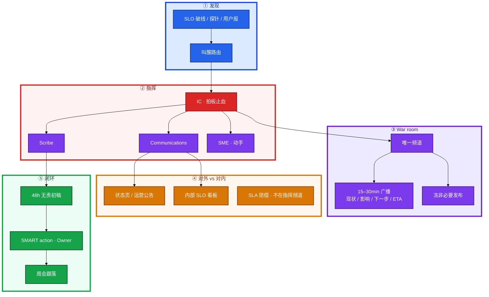
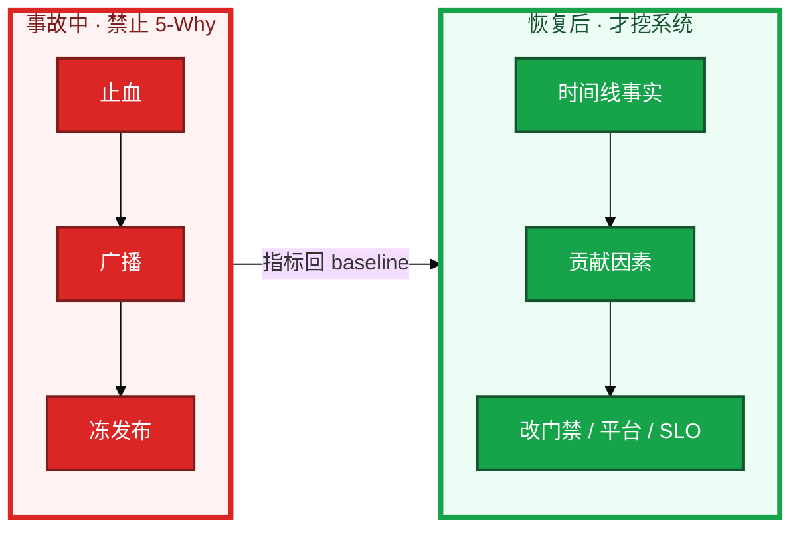
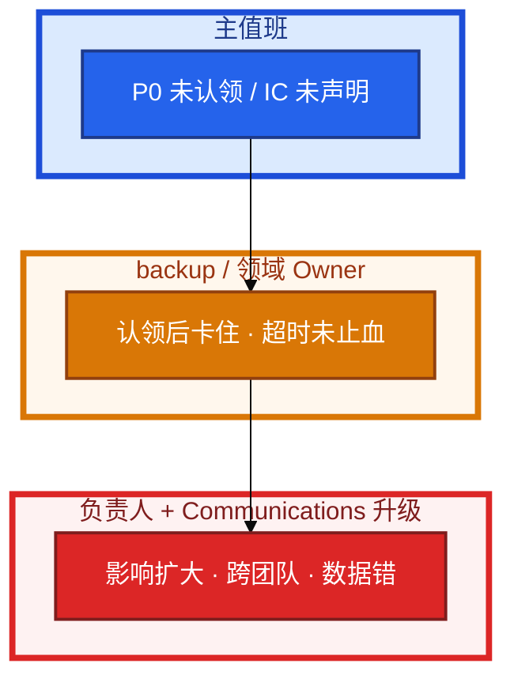
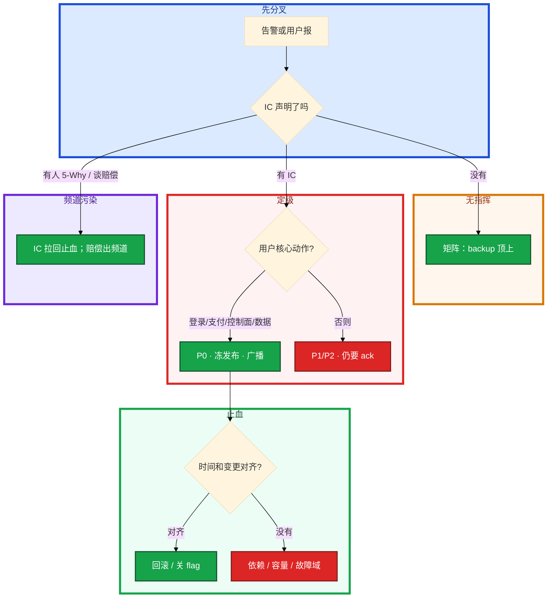

# 事故管理与无责复盘


支付成功率掉到 40%。群里有人开 5-Why，另有人要重启有状态服务，第三人已经在状态页写「正在排查」。没有人说自己是 IC。有人报「三台机器挂了所以是 P2」。

这一章只做一件事——**怎么定级、怎么声明角色、怎么广播、怎么冻发布、复盘 action 怎样才算写了。** 前面的概念和架构，是为了让你动手时不选错路——先挖根因再恢复是错的。

**读完你能：** 白板上画出 ICS 四人怎么分；能按用户影响定 P0 而不是数机器；会开唯一 war room、15–30min 广播、48h 无责初稿；action 能跟落到周会。面试讲 MTTR 目标，不讲「我很拼」。

**本章主线（事故就按这三步想）：**

1. **顺序**：先止血再根因；唯一 IC + 唯一 war room；P0 冻非必要发布。
2. **定级**：按用户影响（登录/支付），不按机器台数。
3. **复盘**：48h 无责初稿；action 有 owner + 到期，跟落到周会。

## 本章目录

- [1. 基本概念](#1-基本概念)
- [2. 架构图](#2-架构图)
- [3. 原理](#3-原理)
  - [3.1 先止血](#31-先止血再根因)
  - [3.2 War room](#32-war-room唯一频道唯一-ic)
  - [3.3 升级矩阵](#33-升级矩阵写在-runbook)
  - [3.4 无责复盘](#34-无责复盘系统允许了什么)
- [4. 安装部署](#4-安装部署)
  - [4.1 GameDay 怎么立项](#41-gameday-怎么立项)
  - [4.2 演练落地你实际看到什么](#42-演练落地你实际看到什么)
- [5. 核心配置](#5-核心配置)
- [6. 命令与操作](#6-命令与操作)
- [7. 生产排障](#7-生产排障)
- [8. 必会 · 常考](#8-必会--常考)
- [合上书，问自己](#合上书问自己)

**本章不讲：** 平台 CMDB 对账、工单字段、认领按钮 → [05-06 运维平台与 Oncall](../../05-工程化与自动化/06-运维平台与Oncall/)；游戏 CCU 腰斩分账、变更窗口表、摘服不杀战斗房 → [08-09 游戏 SRE 稳定性](../../08-游戏运维专题/09-游戏SRE稳定性/)；Linux / K8s 排障命令大全 → [02](../../02-基础底座/) / [04-17](../../04-Kubernetes/17-排障实战/)；SLO 公式、错误预算怎么算 → [02 SLO 错误预算与 FinOps](../02-SLO错误预算与FinOps/)；Toil、平台工程边界 → [01 SRE 职责与平台工程](../01-SRE职责与平台工程/)。游戏 P0 卡片留在 08-09；本章是通用 ICS，互联网 / AI / 平台事故同一套。

---

## 1. 基本概念

事故管理不是「谁先发现谁最拼」。考察看的是你能否把 **发现、指挥、止血、对外、复盘** 做成纪律，而不是个人英雄敲命令。面试要的是结构化解题：现象 → 影响面 → 止血选项 → 拍板 → 观察，不是一上来 grep 日志。

三个时间不要混：

| 词 | 直觉 | 面试怎么说 |
|----|------|------------|
| **MTTD** | 故障发生到被你们发现 | 用户先发现 = 监测失败；目标写在 SLO 告警路由里 |
| **MTTR** | 发现（或发生）到服务恢复 | 讲目标分钟数和止血动作，不讲「我秒回」 |
| **MTTF** | 两次故障之间能撑多久 | 靠错误预算和变更纪律，公式在 02 章 |

oncall 当周目标是 **压 MTTR**，不是顺便写需求。MTTD 靠探针和 SLO 破线叫醒，不靠值班「盯着大屏」。MTTF 拉长是治理，不是事故群里能加班加出来的。对方问「你怎么保证稳定」，答 P0 MTTR 目标、MTTD 谁先发现、复盘 action 改了哪道门禁——不要答加班文化。

稳定性 vs 敏捷：错误预算没烧完可以发版，是敏捷；**事故窗口冻非必要发布**，是稳定性让路。持续交付不能当理由在 P0 频道继续合代码。预算怎么算 → 02；本章只管：正在出血时发布让路。

严重级别按 **用户影响**，不按机器台数。一台配错切到生产支付库也是 P0；五十台空闲 Worker 挂了可能只是 P2。

| 级 | 用户影响（通用） | 叫醒 |
|----|------------------|------|
| **P0** | 登录 / 支付 / 控制面全挂 / 数据错 | 立刻，走 SLO 路由电话 |
| **P1** | 核心降级、单租户 / 单集群不可用但有绕过 | 15–30min，技术负责人 |
| **P2** | 非核心、部分功能、有明确降级 | 值班处理，不叫醒睡眠 |

叫醒标准写在 **SLO 路由**里，不写在心情里。「感觉挺严重」不是 P0。游戏 CCU 腰斩、单服不可玩的分账 → 08-09。控制面全挂：API / 身份 / 网关入口全体不可变更或不可进，已有流量未必立刻死——仍按用户能不能完成核心动作定级。

四个角色（ICS 精简）不要混：

| 角色 | 干什么 | 不是什么 |
|------|--------|----------|
| **IC** Incident Commander | 拍板止血：回滚 / 切流 / 降级 / 冻发布 | 亲自敲命令的人 |
| **Communications** | 对内广播 + 对外状态页 / 运营公告 | 在指挥频道辩论赔付 |
| **Scribe** | 时间线：发现、动作、结果、决策 | 事后凭记忆补流水账 |
| **SME** | 动手：执行 IC 点名的那一件 | 自己另开一条「优化」 |

人少可以兼。兼了必须说出来：「我是 IC 兼 Scribe」；「我是 SME，IC 是 backup」。没说 = 现场三个 IC。IC 不亲自敲命令，是为了脑子里只留影响面和下一步，不是为了摆架子。

AI 可以摘要日志、聚类告警、起草复盘草稿。**写生产：重启有状态、改配置、rollback、silence P0——必须人批。** 边界 → [09-09 AIOps 落地](../../09-AI与智能运维/09-AIOps落地/)。本章不写模型怎么训。

> **记住**：定级看用户能不能完成核心动作，不看挂了几台。面试说 MTTR 目标，不说拼劲。IC 拍板，SME 动手；没声明角色 = 没有 IC。

---

## 2. 架构图

后面排障都对着这张图。



图上四条线：

1. **叫醒走 SLO 路由，不走「谁刚好在线」。**
2. **唯一频道、唯一 IC。** SME 只做点名的那件；IC 不敲命令。
3. **状态页和内部看板分开。** 赔偿对照 SLA，不在 war room 拍数字。
4. **复盘产出 SMART action**，跟落到周会；没落地 = 没复盘。

事故里和事故后是两张图，不要叠在一个频道里：



平台工单怎么点认领、CMDB 依赖图怎么展开 → 05-06。本章只管：频道里谁拍板、对外说什么、事后改哪一层系统。

---

## 3. 原理

原理只保留指挥和面试会用到的：为什么先止血、频道为什么只能有一个 IC、没人认领叫谁、复盘为什么禁止写人名疏忽。

**本节 4 块：** 3.1 止血 · 3.2 war room · 3.3 升级 · 3.4 无责复盘

### 3.1 先止血再根因

**一句话：** 先恢复服务再挖根因；P0 窗口冻非必要发布。


1. **发现**：SLO 破线、探针、用户报。记下 MTTD 起点。
2. **定级**：按用户影响。P0 例子：登录挂、支付挂、控制面全挂、数据错。
3. **声明 IC**：一句话钉死。兼岗说出来。
4. **冻非必要发布**：功能发布、实验、扩测试集群抢配额，全部停。hotfix / 回滚除外。
5. **止血**：回滚、切流、降级 flag、扩无状态、摘故障域。一次只点名一件。
6. 指标回 baseline → 观察窗口，不要立刻宣布结束。
7. 无责复盘。5-Why 在这里做，不在事故群做。

事故群开 5-Why = 故意拉长故障。有人已经在翻慢查询、对代码——IC 的第一句话是「先停，做哪件止血」。根因猜测可以记在 Scribe 角落，不能变成频道主线。

结构化解题（面试白板同一套）：现象是什么、谁受影响、最近变更、可逆动作有哪些、选哪件、成功长什么样。停在「我去查日志」= 执行层，不是指挥。

> **记住**：先对齐「指标何时烂 vs 何时 deploy」。能回滚 / 关 flag / 切流就先做。根因留复盘。

### 3.2 War room：唯一频道、唯一 IC

**一句话：** 唯一 war room、唯一 IC；Scribe 记时间线，Comms 对外口径。

P0 固定频道，预先建好，不要故障后再拉群。临时拉群 = 一半人还在旧线程里改配置。

| 规则 | 为什么 |
|------|--------|
| 唯一频道 | 决策和动作必须同一处可见 |
| 唯一 IC | 两个人同时回滚 + 重启 = 无法归因 |
| IC 不敲命令 | 指挥在影响面和下一步，不在 kubectl 焦点 |
| SME 复述再执行 | 「做登录 SLI，回滚到 digest X」 |
| 禁止顺便优化 | 止血阶段加索引、调参、重构 = 第二次事故 |

定时广播每 **15–30min** 四件，缺一不算广播：

1. **现状**：还在挂 / 正在恢复 / 已回 baseline
2. **影响**：谁不能完成什么（登录、支付、控制面、数据）
3. **下一步**：IC 点名的下一件，谁执行
4. **ETA**：下一轮广播时间；不知道就说不知道，给下一检查点

没有 ETA 的「正在排查」对外等于没说。对内不知道下一步 = IC 失职，不是 SME 不够拼。

### 3.3 升级矩阵：写在 runbook

**一句话：** 叫醒标准写在 SLO 路由里，不写在心情里。
无人认领、超时未止血、影响扩大 → 叫谁。写在 runbook，不靠心情、不靠「群里 @all」。



数字按业务改，但「有没有矩阵」不能缺。常见：P0 **15min** 未声明 IC → backup 顶上当 IC；止血 **30min** 无进展或影响从单集群扩到全站 → 领域负责人；数据错 / 支付 / 身份 → 立刻拉 Communications 走对外，不必等「再观察一轮」。

指挥不在：backup 按路径顶上，不要现场选举。升级路径和告警 Owner 是否在职，是平台的事（05-06）；本章要的是 **现场有人按矩阵打电话**，不是在频道里等英雄。

### 3.4 无责复盘：系统允许了什么

**一句话：** 无责 ≠ 无 action；48h 初稿，action 有 owner 和到期。
Blameless：时间线写事实，贡献因素写系统，不写「某某疏忽」「责任心不够」。点名羞辱的复盘，下次没人敢报近因，MTTD 会更差。

根因「nginx 挂了」不是根因。要问：门禁为什么没拦住这次变更？为什么没有自动回滚？为什么告警 20 分钟才打到人？为什么 runbook 没有「成功长什么样」？

Action 必须 **SMART**、有 **Owner**、改 **门禁 / 平台 / SLO**，不是「下次注意」：

| 烂 action | 合格 action |
|-----------|-------------|
| 加强责任心 | 发布门禁：支付路径变更必须金丝雀 + 自动回滚，Owner 平台组，本周五 |
| 以后小心点 | SLO 路由：登录 5min 破线打 P0 电话，Owner 可观测，下周三验收 |
| 培训一下 | GameDay：断一个 AZ，记下 RTO，缺口进 backlog，Owner SRE，季度一次 |

48h 内出初稿。终稿可以下周改措辞；**没有初稿 = 时间线已经在脑子里腐烂**。action 跟落到周会；连续两周仍是「进行中」且无阻碍升级 = 没复盘。

> **记住**：无责不是无责任。责任落在系统改动上，落到有名字的 Owner 和日期，不落到人格攻击。

---

## 4. 安装部署

本章的「装」不是装软件，是把 **GameDay / 故障注入立项成变更**，否则永远「等有空再演」。

### 4.1 GameDay 怎么立项

| 项 | 选 | 不选 |
|----|----|------|
| 目标 | 一条假设：断 AZ 后登录 SLI 能否 15min 回来 | 「做一次混沌工程」无假设 |
| 范围 | 预先隔离的故障域、可逆、有回滚 | 生产随机杀有状态进程 |
| 角色 | 真 IC / Scribe / Communications 上场 | 只有执行脚本的人，没有指挥 |
| 窗口 | 当变更单走：影响面、回滚、观察 | 群里说一声就算演练 |
| 记录 | 耗时、缺口、跟落项 | 演完合影，RTO 仍写拍脑袋 |
| 频率 | 季度核心路径至少一次 | 只在事故后发誓「下次一定」 |

游戏：演练摘服 **不杀战斗房**——长连接和胜负在 08-09，本章不展开。互联网 / 平台：演练断 AZ、演练 Thanos Query 挂；架构怎么抗、Sidecar 成本、多集群怎么选 → [04 大规模可靠性架构](../04-大规模可靠性架构/)。这里要的是：**谁是 IC、广播有没有、RTO 是否写进内部目标而不是对外 SLA**。

故障注入和生产事故同一套 ICS。演练里选举三个 IC、不冻旁路发布，事故里也会这样。立项验收看：假设、回滚、观察指标、复盘缺口，不看「注入了多少 chaos 算子」。

### 4.2 演练落地你实际看到什么

验收不看海报。必须：

1. 书面假设和成功标准（哪条 SLI、多少分钟）。
2. 真实角色：有人说「我是 IC」，有人只记录。
3. 注入开始后按 15–30min 广播，即使「大家都在场」。
4. 结束有时间线；缺口变成带 Owner 的 action。
5. 对外 SLA 不引用演练里没跑出来的 RTO。镜像回档 90 分钟，不能对外写 15 分钟——游戏细节 08-09，原则通用。

没有演练的备份 / 切流 / 回滚 = 没有。本机 cron 打快照从没 restore，和「从没开过 war room」是同一类谎言。

---

## 5. 核心配置

只动有证据的项。数字按业务改，但表必须存在且值班找得到。

**定级表**（用户影响，不是机器台数）：

| 级 | 必须写入的例子 | 响应 | 复盘 |
|----|----------------|------|------|
| P0 | 登录全失败；支付不到账；控制面全挂；数据错 / 串租户 | 立刻叫醒 | 必须，48h 初稿 |
| P1 | 核心降级；单集群不可用但其它集群可绕 | 15–30min | 必须 |
| P2 | 非核心、部分功能 | 值班 | 周汇总 |

叫醒：登录 / 支付 / 控制面 / 数据 走电话；磁盘预警、副本数不足不进 P0 路由。路由怎么配在平台 → 05-06；**标准写在 SLO，不写在群规约。**

**升级矩阵**（runbook 一页）：

| 触发 | 叫谁 | 时限 |
|------|------|------|
| P0 无人声明 IC | backup 顶上当 IC | 15min |
| 已认领但未止血 | 领域 Owner / 上一手 IC | 30min 无进展 |
| 影响扩大（单集群 → 全站、出现数据错） | 负责人 + Communications | 立即 |
| IC 失联 | 矩阵下一名，不要选举 | 立即 |

**复盘模板字段**（缺一栏初稿不算交）：

| 字段 | 写什么 | 禁止 |
|------|--------|------|
| 时间线 | UTC、发现 / 定级 / 止血动作 / 恢复，分钟级 | 「大概晚上」 |
| 影响 | 用户动作、时长、是否数据 | 「有点影响」 |
| 贡献因素 | 门禁 / 告警 / 路由 / 权限 / 演练缺口 | 「某某疏忽」 |
| 做对的 | 冻发布、先回滚 | 整篇批斗 |
| Action | SMART、Owner、日期、改系统 | 「下次注意」 |
| 验证 | 哪次周会关闭、用什么信号证明 | 无跟落 |

> **记住**：定级表和升级矩阵是配置，不是文化口号。复盘缺 Owner 和日期 = 配置没落地。

---

## 6. 命令与操作

没有 kubectl 大全。值班先对齐口头清单和时间线，平台各家 UI 不同（认领按钮 → 05-06）。

开场 30 秒（对标 etcd 四条命令）：

```
1. 我是 IC。Communications / Scribe / SME 是谁？（兼岗说出来）
2. 定级：登录 / 支付 / 控制面 / 数据？用户能不能完成核心动作？
3. 冻非必要发布。最近一次变更对齐了没有？
4. 下一件止血是什么、谁执行、成功长什么样、下一次广播几点？
```

定时广播稿（复制即用）：

```
【T+mm】现状：…
影响：…（谁、什么动作、是否数据）
下一步：…（SME 姓名 + 动作）
ETA：下次广播 HH:MM；当前未知则写检查点
IC：… 频道：唯一
```

时间线模板（Scribe，事故中就填，不要事后回忆）：

| 时间 UTC | 来源 | 事实 | 决策 / 动作 | 结果 |
|----------|------|------|-------------|------|
| 12:01 | 告警 / 用户 | 支付成功率 40% | 定 P0，IC=… | — |
| 12:04 | IC | 冻发布 | Communications 通知发布队列 | 队列已停 |
| 12:08 | SME | 回滚 gateway 到 digest X | IC 点名 | 成功率 97% |

禁止写：「小王操作失误」。写：「12:08 执行回滚；12:11 SLI 回升」。贡献因素放复盘，不放直播时间线。

对外 Communications 另开字段：状态页已发 / 未发、内部看板链接、赔偿 **不填数字**。SLA 条款不在指挥频道辩论。

---

### 6.1 定级与叫醒

1. 问用户影响，不问「几台 down」。
2. 命中 P0 例子（登录 / 支付 / 控制面全挂 / 数据错）→ 立刻声明 IC，走电话。
3. 命不中 → P1/P2，仍要有人 ack，不要让 P0 路由被磁盘预警淹没。
4. 叫醒标准与 SLO 路由一致。改数字走变更，不在事故里现场改级「降成 P2 好睡觉」。

测试环境打到生产、数据串租户：一台也是 P0。可用性看板全绿但订单金额错，仍是 P0。

### 6.2 声明角色：开 war room

P0 进唯一频道。第一句：

```
我是 IC。Communications = …，Scribe = …，SME = …（登录网关）。
其它人只听。要动手先报 IC。
```

人少：`我是 IC 兼 Scribe；backup 是 Communications；你是 SME。` 没这句话，默认每个人都是 IC。

IC 把终端交给 SME。自己盯广播钟和升级时钟。十人同时 kubectl = 没有指挥。

### 6.3 定时广播

15–30min 一次，四字段。影响扩大立刻加播，不等下一整点。Communications 把同一套事实翻译成对外语言，禁止发明赔付和「数据完整」直到对账结束。

长时间无广播 = 对外认为你们失踪。内部认为 IC 已放弃。Scribe 把每次广播贴进时间线。

### 6.4 冻发布与止血

IC 下令冻：功能发布、实验平台、非紧急 schema、抢配额的扩容。紧急止血变更双人执行，事后补单——补单字段在 05-06，本章要的是 **频道里宣布冻了**。

止血一次一件。SME 复述 SLI。有状态重启、回档、合服：人闸，禁止当无状态「先重启试试」。游戏摘服细节 → 08-09。

最近有变更：先回滚 / 关 flag，再分析。没有变更：依赖、容量、证书、配额。不在现场分析一周架构。

### 6.5 对外口径：状态页 vs 内部看板

| 通道 | 听众 | 内容 |
|------|------|------|
| 指挥频道 | 作战人员 | 动作、风险、下一块 SME |
| 内部 SLO 看板 | 值班 / 研发 | SLI 是否回 baseline、错误预算 |
| 状态页 / 运营公告 | 用户 / 客户 | 影响面、能否用、ETA；不点名组件和锅 |
| SLA / 法务 | 合同 | 赔偿对照条款；**不在 war room 辩论** |

混在一起，值班会被「要不要赔」拖住，忘了止血。内部「SLO 没破所以不用公告」和对外「合同没写所以不用半夜起来」都是错的：公告看用户影响，叫醒看 SLO 路由。

### 6.6 48h 复盘初稿

恢复后 48h 内：时间线、影响、贡献因素、做对的、SMART action。IC 或指定 Owner 出初稿，不是「等大家都有空开批斗会」。

AI 可以整理 Scribe 日志成草稿。人必须改掉任何「疏忽」「不小心」字样，补上系统因素。终稿会前先对事实，不对人格。

### 6.7 Action 跟落到周会

每条 action：Owner、到期、验收信号（门禁已拦、告警已打到电话、演练 RTO 已记录）。周会只问关闭证据。两周无进展 → 升级到写进矩阵的那一层负责人。

没落地 = 没复盘。文档写得很美、线上门禁仍能把支付当普通服务发，下次还是同一场 P0。

### 6.8 演练与 AI 边界

按 4.1 立项。游戏摘服不杀战斗房 → 08-09。断 AZ、Thanos Query 挂 → 假设和 RTO 写在本章纪律里，组件怎么高可用 → 04。

AI：日志摘要、告警聚类、复盘草稿 = 可以。自动重启有状态、自动改生产、自动 silence P0、自动定责 = 禁止。详见 [09-09](../../09-AI与智能运维/09-AIOps落地/)。

---

## 7. 生产排障
和指挥同一套三问：用户哪条动作断了？影响面在扩还是在收？最近有没有变更？**先止血，不是先开 5-Why。** 具体 tcpdump / kubectl 在 02 / 04-17。



| 现象 | 先做什么 | 不要做什么 |
|------|----------|------------|
| 无人声明 IC | 升级矩阵，backup 顶上 | 群里等英雄、现场选举 |
| 事故群 5-Why | IC 打断，点名一件止血 | 一起分析到服务恢复 |
| 三台机器挂，业务仍可用 | 按用户影响定级 | 用机器台数升 P0 |
| 控制面挂，已有流量还在 | 停变更、救控制面 | 重启还活着的有状态 |
| 状态页和指挥频道争赔偿 | Communications 带走 SLA | 指挥频道拍赔付数字 |
| 十人同时改配置 | 只留 SME，其它人停手 | 再拉一个「专家群」 |
| AI 建议重启有状态 | 人闸，IC 否决自动写 | 接模型自动执行 |
| 复盘写「疏忽」 | 改成系统贡献因素 | 点名通报当闭环 |

生产踩坑：没有唯一 IC；MTTD 靠用户微博；冻发布只在群里吼、管道仍在合；初稿拖过 48h；action 永远「进行中」。

---

## 8. 必会 · 常考
白板和追问高频，能一口回：

| 说法 | 对错 | 口径 |
|------|:----:|------|
| 先 5-Why 再恢复更专业 | 错 | 事故中止血；5-Why 留复盘 |
| 挂的机器多就是 P0 | 错 | 按用户影响；一台数据错也是 P0 |
| 面试讲「我很拼、秒回」 | 错 | 讲 MTTD/MTTR 目标和叫醒路由 |
| IC 应该亲自敲命令才专业 | 错 | IC 拍板；SME 动手；兼岗要说出来 |
| 可以多个频道同时指挥 | 错 | 唯一频道、唯一 IC |
| 对外对内用同一套「正在排查」 | 错 | 状态页有影响面和 ETA；赔偿不在指挥频道 |
| 复盘要写出是谁的疏忽 | 错 | 时间线事实 + 系统贡献因素 |
| 「下次注意」算 action | 错 | SMART、Owner、改门禁/平台/SLO |
| 初稿可以下周再写 | 错 | 48h 内初稿；跟落靠周会 |
| 没落地也算复过盘 | 错 | 没落地 = 没复盘 |
| AI 可以自动修生产 | 错 | 摘要可以；写路径人批 → 09-09 |
| 持续交付所以 P0 还能发功能 | 错 | 事故窗口冻非必要发布 |
| GameDay 等于随机杀进程 | 错 | 有假设、可逆、真角色；游戏不杀战斗房 → 08-09 |

数字：广播 **15–30min**；P0 声明 IC **15min** 升级；未止血 **30min** 升级；复盘初稿 **48h**；P0 例子四类：**登录 / 支付 / 控制面 / 数据**。

易混：MTTD vs MTTR vs MTTF；P0 vs 机器台数；IC vs SME；状态页 vs SLO 看板 vs SLA；无责 vs 无 Owner；演练 RTO vs 对外承诺。

结构化解题 vs 敏捷：白板按影响面和可逆动作拍板，是解题；错误预算允许发布，是敏捷；**正在 P0 时敏捷让路**。三者别用错场合。

---

## 合上书，问自己

1. MTTD / MTTR / MTTF 各指哪一段时间？面试为什么不说「我很拼」？
2. P0 按什么定？举登录 / 支付 / 控制面 / 数据各一个；叫醒写在哪？
3. ICS 四人怎么分？IC 为什么不敲命令？人少兼岗第一句说什么？
4. War room 三条铁律？广播四字段？升级矩阵三个触发？
5. 无责复盘写什么、不写什么？action 怎样才算 SMART？48h 和周会各管什么？
6. GameDay 立项看哪几条？AI 能做摘要吗？自动重启有状态行不行？

六题都能口述，这一章就过了。下一章把 [大规模可靠性架构](../04-大规模可靠性架构/) 剖开：Thanos、网格成本、多集群和 GPU 怎么选，事故里「断 AZ / Query 挂」的那一层到底长什么样。
