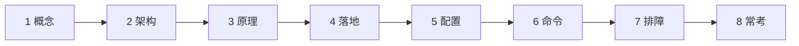
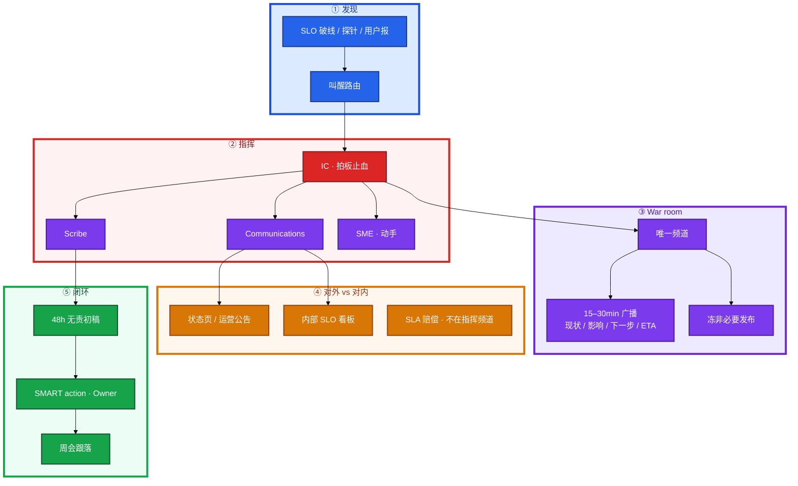
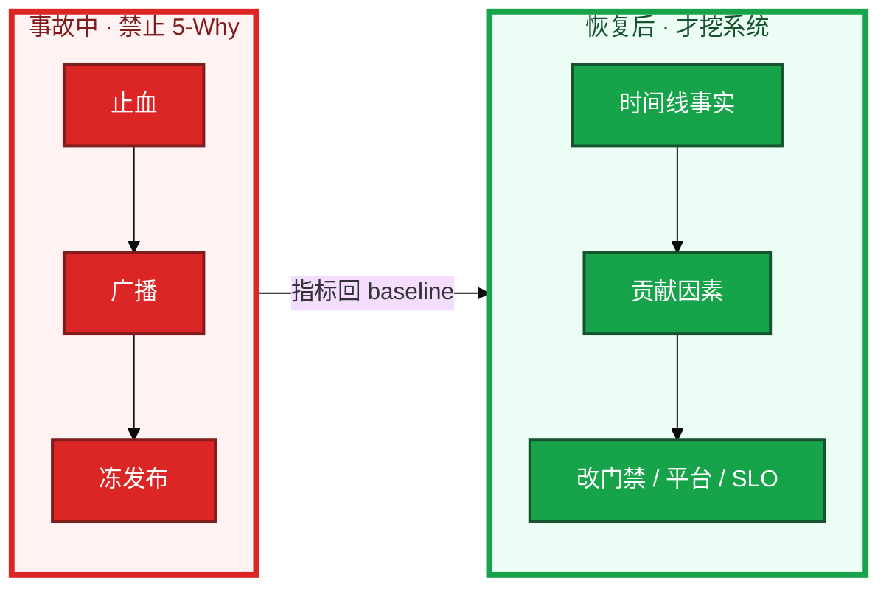
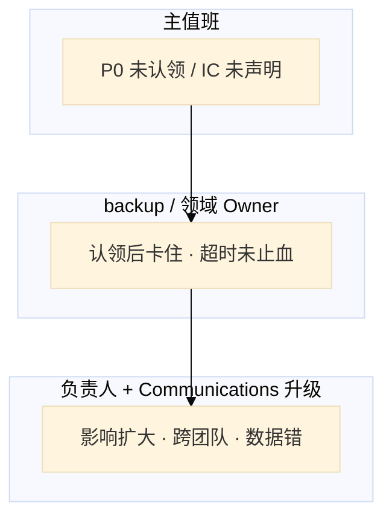
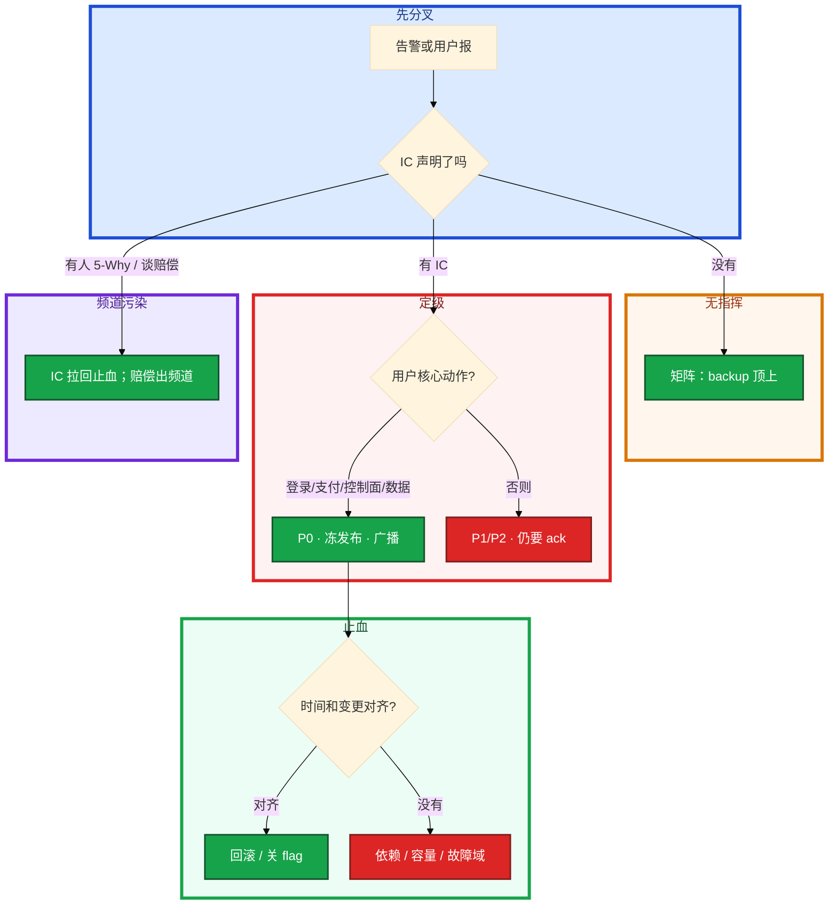

# 事故管理与无责复盘



支付成功率掉到 40%。群里有人开 5-Why，另有人要重启有状态服务，第三人已经在状态页写「正在排查」。没有人说自己是 IC。有人报「三台机器挂了所以是 P2」——但玩家已经充不了值。值班长对着 Grafana 全绿说「SLO 没破不用叫醒」，客服电话已经打爆。

**本章主线（事故就按这三步想）：**

1. **顺序**：先止血再根因；唯一 IC + 唯一 war room；P0 冻非必要发布。
2. **定级**：按用户影响（登录/支付），不按机器台数。
3. **复盘**：48h 无责初稿；action 有 owner + 到期，跟落到周会。

**读完你能：** 白板上画出 ICS 四人怎么分；能按用户影响定 P0 而不是数机器；会开唯一 war room、15–30min 广播、48h 无责初稿；action 能跟落到周会。面试讲 MTTR 目标，不讲「我很拼」。

## 本章目录

- [1. 基本概念](#1-基本概念)
- [2. 架构图](#2-架构图)
- [3. 原理](#3-原理)
- [4. 落地](#4-落地)
- [5. 核心配置](#5-核心配置)
- [6. 命令与操作](#6-命令与操作)
- [7. 生产排障](#7-生产排障)
- [8. 必会 · 常考](#8-必会--常考)
- [合上书](#合上书问自己)

**本章不讲：** 平台 CMDB 对账、工单字段、认领按钮 → [05-06 运维平台与 Oncall](../../05-工程化与自动化/06-运维平台与Oncall/)；游戏 CCU 腰斩分账、变更窗口表、摘服不杀战斗房 → [08-09 游戏 SRE 稳定性](../../08-游戏运维专题/09-游戏SRE稳定性/)；Linux / K8s 排障命令大全 → [02](../../02-基础底座/) / [04-17](../../04-Kubernetes/17-排障实战/)；SLO 公式、错误预算怎么算 → [02 SLO 错误预算与 FinOps](../02-SLO错误预算与FinOps/)；Toil、平台工程边界 → [01 SRE 职责与平台工程](../01-SRE职责与平台工程/)。

---

## 1. 基本概念

事故管理不是「谁先发现谁最拼」。考察看的是你能否把 **发现、指挥、止血、对外、复盘** 做成纪律，而不是个人英雄敲命令。面试要的是结构化解题：现象 → 影响面 → 止血选项 → 拍板 → 观察，不是一上来 grep 日志。

**值班里怎么认现象**（先听告警 / 客服 / 状态页怎么说）：

| 群里/监控说的 | 技术含义 | 你的第一刀 |
|---------------|----------|------------|
| 「支付不了」「充不了值」 | 支付路径 P0 | 声明 IC，按用户影响定级 |
| 「登录转圈」 | 登录 SLI 可能破 | 查短窗 SLI，不是数机器 |
| 「三台机器挂了」 | 可能只是 P2 | **问用户还能不能完成核心动作** |
| 「正在排查」 | 无 ETA 的广播 | IC 补四字段广播 |
| 「谁在线谁指挥」 | 没有 IC | 升级矩阵，backup 顶上 |

三个时间不要混：

| 词 | 直觉 | 面试怎么说 |
|----|------|------------|
| **MTTD** | 故障发生到被你们发现 | 用户先发现 = 监测失败；目标写在 SLO 告警路由里 |
| **MTTR** | 发现（或发生）到服务恢复 | 讲目标分钟数和止血动作，不讲「我秒回」 |
| **MTTF** | 两次故障之间能撑多久 | 靠错误预算和变更纪律，公式在 02 章 |

**打个比方**：MTTD 是火警多久响，MTTR 是消防车多久到并灭火，MTTF 是两次火之间隔多久——靠防火规范（门禁 / 演练），不是靠消防员更拼。

严重级别按 **用户影响**，不按机器台数。一台配错切到生产支付库也是 P0；五十台空闲 Worker 挂了可能只是 P2。

| 级 | 用户影响（通用） | 叫醒 |
|----|------------------|------|
| **P0** | 登录 / 支付 / 控制面全挂 / 数据错 | 立刻，走 SLO 路由电话 |
| **P1** | 核心降级、单租户 / 单集群不可用但有绕过 | 15–30min，技术负责人 |
| **P2** | 非核心、部分功能、有明确降级 | 值班处理，不叫醒睡眠 |

四个角色（ICS 精简）不要混：

| 角色 | 干什么 | 不是什么 |
|------|--------|----------|
| **IC** Incident Commander | 拍板止血：回滚 / 切流 / 降级 / 冻发布 | 亲自敲命令的人 |
| **Communications** | 对内广播 + 对外状态页 / 运营公告 | 在指挥频道辩论赔付 |
| **Scribe** | 时间线：发现、动作、结果、决策 | 事后凭记忆补流水账 |
| **SME** | 动手：执行 IC 点名的那一件 | 自己另开一条「优化」 |

人少可以兼。兼了必须说出来：「我是 IC 兼 Scribe」；「我是 SME，IC 是 backup」。没说 = 现场三个 IC。

AI 可以摘要日志、聚类告警、起草复盘草稿。**写生产：重启有状态、改配置、rollback、silence P0——必须人批。** 边界 → [09-09 AIOps 落地](../../09-AI与智能运维/09-AIOps落地/)。

> **记住**：定级看用户能不能完成核心动作，不看挂了几台。面试说 MTTR 目标，不说拼劲。IC 拍板，SME 动手；没声明角色 = 没有 IC。

**面试怎么说**：「P0 按登录/支付/控制面/数据定级，不按机器台数。先止血再根因，唯一 IC、唯一 war room，48h 无责初稿，action 改系统不改人。」

---

## 2. 架构图

后面排障都对着这张图。



**读图四句话：**

1. **叫醒走 SLO 路由，不走「谁刚好在线」。** 从发现进 IC，不是进 grep 日志。
2. **唯一频道、唯一 IC。** SME 只做点名的那件；IC 不敲命令。
3. **状态页和内部看板分开。** 赔偿对照 SLA，不在 war room 拍数字。
4. **复盘产出 SMART action**，跟落到周会；没落地 = 没复盘。

事故里和事故后是两张图：



---

## 3. 原理

### 3.1 先止血再根因

**一句话：** 先恢复服务再挖根因；P0 窗口冻非必要发布。

**打个比方**：像溺水——先捞人上岸（止血），再查为什么落水（根因）。事故群里开 5-Why 等于站在岸上讨论「他为什么不会游泳」，人还在水里。

**现场走一遍**（支付成功率 40%，T+0）：

1. **T+0** 告警：支付 SLI 5min 窗口 **38%**（SLO 目标 99.9%）。
2. **T+2min** backup oncall 进频道，第一句：

```text
我是 IC。Communications = 小李，Scribe = 我兼，SME = 支付网关老王。
定级 P0：用户无法完成支付。
冻非必要发布。最近一次变更是 11:30 gateway v2.3.1。
下一件止血：老王回滚 gateway 到 digest sha256:abc…，成功长什么样：支付成功率 > 97%。
下一次广播 12:25。
```

3. **T+8min** SME 执行回滚，屏幕：

```text
kubectl rollout undo deploy/payment-gateway -n pay
deployment "payment-gateway" rolled back
支付成功率 (5m): 41% → 78% → 96%
```

4. **T+15min** 广播四字段；**禁止** 有人在频道里分析慢查询。
5. **T+45min** SLI 回 baseline，进入观察窗口。
6. **T+48h** 无责初稿：贡献因素写「金丝雀未对 baseline」，不是「老王操作失误」。

**输出解读**：

| 时间 | 屏幕/事实 | 说明什么 |
|------|-----------|----------|
| T+0 38% | 短窗 SLI 破 | P0，不是等月底 |
| T+2 声明 IC | 角色钉死 | 没声明 = 三个 IC |
| T+8 96% | 止血有效 | 先回滚再根因 |
| 11:30 变更 | 时间对齐 | 最近 deploy 优先回滚 |
| 频道无 5-Why | 纪律 | 根因留复盘 |


**面试怎么说**：「事故中先止血：声明 IC、冻发布、点名一件回滚。5-Why 和慢查询分析留恢复后复盘，不在 war room 做。」

> **记住**：先对齐「指标何时烂 vs 何时 deploy」。能回滚 / 关 flag / 切流就先做。根因留复盘。

### 3.2 War room：唯一频道、唯一 IC

**一句话：** 唯一 war room、唯一 IC；Scribe 记时间线，Comms 对外口径。

**打个比方**：像手术室——只有一个主刀（IC）下指令，只有一个护士记单（Scribe），只有一个窗口跟家属说话（Comms）。十个人同时动刀 = 无法归因。

**现场走一遍**（P0 频道已开，但混乱）：

1. 现状：3 个线程——有人在 `#pay-incident` 回滚，有人在 `#pay-debug` 查 DB，有人在 `#random` 讨论赔偿。
2. IC 动作：

```text
所有人进 #incident-pay-20260828，其它频道只读。
我是 IC。从此频道为唯一 war room。
老王你是 SME，只做回滚；其他人停止 kubectl。
```

3. Scribe 当场建表：

| 时间 UTC | 来源 | 事实 | 决策 / 动作 | 结果 |
|----------|------|------|-------------|------|
| 12:01 | 告警 | 支付成功率 40% | 定 P0，IC=张三 | — |
| 12:04 | IC | 冻发布 | Comms 通知发布队列 | 队列已停 |
| 12:08 | SME | 回滚 gateway digest X | IC 点名 | 成功率 97% |

4. **T+20min** 定时广播（四字段缺一不算）：

```text
【T+20】现状：支付成功率已回 97%，观察中
影响：12:00–12:10 用户无法完成支付，无数据错
下一步：继续观察 SLI 至 13:00；SME 待命不回滚其它服务
ETA：下次广播 12:35
IC：张三  频道：#incident-pay-20260828
```

**输出解读**：

| 规则 | 违反时长什么样 | 正确长什么样 |
|------|----------------|--------------|
| 唯一频道 | 3 个群各做各的 | 一个频道所有决策可见 |
| 唯一 IC | 两人同时回滚 | IC 点名一件，SME 执行 |
| IC 不敲命令 | IC 自己 kubectl | IC 盯广播钟和升级钟 |
| 四字段广播 | 「正在排查」 | 现状/影响/下一步/ETA |

**面试怎么说**：「P0 唯一 war room、唯一 IC。广播每 15–30min 四字段：现状、影响、下一步、ETA。没有 ETA 的排查等于没说。」

### 3.3 升级矩阵：写在 runbook

**一句话：** 叫醒标准写在 SLO 路由里，不写在心情里。

**打个比方**：像 119 接警升级——小区物业 15 分钟没到，自动升区消防；不是群里 @all 碰运气。

**现场走一遍**（P0 无人认领）：

1. **T+0** 支付告警响，主值班手机没电，频道无人说「我是 IC」。
2. **T+12min** 按 runbook 升级矩阵：

| 触发 | 叫谁 | 时限 |
|------|------|------|
| P0 无人声明 IC | backup 顶上当 IC | **15min** |
| 已认领但未止血 | 领域 Owner | **30min** 无进展 |
| 影响扩大 / 数据错 | 负责人 + Communications | **立即** |

3. **T+13min** backup 打电话给主值班未接 → **自动升** 支付领域 Owner。
4. **T+15min** Owner 进频道声明 IC，冻发布，点名止血。
5. 事后 action：SLO 路由加「P0 未认领 10min 自动升 backup」——改系统，不是「下次注意带充电宝」。

**输出解读**：



| 数字 | 含义 |
|------|------|
| 15min | P0 必须有人声明 IC |
| 30min | 止血无进展必须升级 |
| 立即 | 数据错 / 影响扩大不等待 |

**面试怎么说**：「升级矩阵写在 runbook：P0 15min 无人 IC 升 backup，30min 未止血升 Owner。指挥不在时 backup 顶上，不现场选举。」

### 3.4 无责复盘：系统允许了什么

**一句话：** 无责 ≠ 无 action；48h 初稿，action 有 owner 和到期。

**打个比方**：像航空事故调查——查的是「系统为什么允许两架飞机靠近」，不是「机长是不是粗心」。点名羞辱的复盘，下次没人敢报近因，MTTD 会更差。

**现场走一遍**（恢复后 48h 内出初稿）：

1. 时间线（Scribe 导出，分钟级）：

```text
11:30  deploy gateway v2.3.1（金丝雀 5%）
11:45  canary 错误率 18%，集群均值 0.3% → 门禁未拦（对均值）
12:00  扩面至 100%
12:01  支付 SLI 跌至 40%
12:08  回滚完成，SLI 回升
```

2. 贡献因素（系统，不写人名）：

| 贡献因素 | 系统允许了什么 |
|----------|----------------|
| 门禁对集群均值 | 5% canary 20% 错被 95% 绿稀释 |
| 无自动回滚 | 扩面后无 SLI 熔断 |
| 告警路由 | 12:01 才打到电话（MTTD 31min） |

3. SMART action：

| 烂 action | 合格 action |
|-----------|-------------|
| 加强责任心 | 发布门禁：支付路径金丝雀对 baseline + 自动回滚，Owner 平台组，本周五 |
| 以后小心点 | SLO 路由：支付 5min 破线打 P0 电话，Owner 可观测，下周三验收 |
| 培训一下 | GameDay：断支付依赖，记 RTO，Owner SRE，季度一次 |

4. 周会跟落：下周五验收门禁日志里出现 `compare: baseline`；未关闭升级 Owner。

**输出解读**：

| 字段 | 写什么 | 禁止 |
|------|--------|------|
| 时间线 | UTC、分钟级 | 「大概晚上」 |
| 贡献因素 | 门禁 / 告警 / 路由 | 「某某疏忽」 |
| Action | SMART、Owner、日期 | 「下次注意」 |
| 验证 | 周会关闭信号 | 无跟落 |

**面试怎么说**：「无责复盘写系统贡献因素：门禁为什么没拦、告警为什么晚到。action 改门禁/平台/SLO，有 Owner 和日期，48h 初稿，周会跟落。」

> **记住**：无责不是无责任。责任落在系统改动上，落到有名字的 Owner 和日期，不落到人格攻击。

---

## 4. 落地

本章的「落地」= **GameDay / 故障注入立项成变更**，否则永远「等有空再演」。

### 4.1 GameDay 怎么立项

| 项 | 选 | 不选 |
|----|----|------|
| 目标 | 一条假设：断 AZ 后登录 SLI 能否 15min 回来 | 「做一次混沌工程」无假设 |
| 范围 | 预先隔离的故障域、可逆、有回滚 | 生产随机杀有状态进程 |
| 角色 | 真 IC / Scribe / Communications 上场 | 只有执行脚本的人，没有指挥 |
| 窗口 | 当变更单走：影响面、回滚、观察 | 群里说一声就算演练 |
| 记录 | 耗时、缺口、跟落项 | 演完合影，RTO 仍写拍脑袋 |
| 频率 | 季度核心路径至少一次 | 只在事故后发誓「下次一定」 |

游戏：演练摘服 **不杀战斗房** → 08-09。断 AZ、Thanos Query 挂 → [04](../04-大规模可靠性架构/)。

### 4.2 演练落地你实际看到什么

验收不看海报。必须：

1. 书面假设和成功标准（哪条 SLI、多少分钟）。
2. 真实角色：有人说「我是 IC」，有人只记录。
3. 注入开始后按 15–30min 广播，即使「大家都在场」。
4. 结束有时间线；缺口变成带 Owner 的 action。
5. 对外 SLA 不引用演练里没跑出来的 RTO。

---

## 5. 核心配置

**定级表**（用户影响，不是机器台数）：

| 级 | 必须写入的例子 | 响应 | 复盘 |
|----|----------------|------|------|
| P0 | 登录全失败；支付不到账；控制面全挂；数据错 / 串租户 | 立刻叫醒 | 必须，48h 初稿 |
| P1 | 核心降级；单集群不可用但其它集群可绕 | 15–30min | 必须 |
| P2 | 非核心、部分功能 | 值班 | 周汇总 |

**升级矩阵**（runbook 一页）：

| 触发 | 叫谁 | 时限 |
|------|------|------|
| P0 无人声明 IC | backup 顶上当 IC | 15min |
| 已认领但未止血 | 领域 Owner / 上一手 IC | 30min 无进展 |
| 影响扩大（单集群 → 全站、出现数据错） | 负责人 + Communications | 立即 |
| IC 失联 | 矩阵下一名，不要选举 | 立即 |

**复盘模板字段**：

| 字段 | 写什么 | 禁止 |
|------|--------|------|
| 时间线 | UTC、发现 / 定级 / 止血 / 恢复，分钟级 | 「大概晚上」 |
| 影响 | 用户动作、时长、是否数据 | 「有点影响」 |
| 贡献因素 | 门禁 / 告警 / 路由 / 权限 / 演练缺口 | 「某某疏忽」 |
| 做对的 | 冻发布、先回滚 | 整篇批斗 |
| Action | SMART、Owner、日期、改系统 | 「下次注意」 |
| 验证 | 哪次周会关闭、用什么信号证明 | 无跟落 |

> **记住**：定级表和升级矩阵是配置，不是文化口号。复盘缺 Owner 和日期 = 配置没落地。

---

## 6. 命令与操作

没有 kubectl 大全。值班先对齐口头清单和时间线。

开场 30 秒：

```
1. 我是 IC。Communications / Scribe / SME 是谁？（兼岗说出来）
2. 定级：登录 / 支付 / 控制面 / 数据？用户能不能完成核心动作？
3. 冻非必要发布。最近一次变更对齐了没有？
4. 下一件止血是什么、谁执行、成功长什么样、下一次广播几点？
```

定时广播稿（复制即用）：

```
【T+mm】现状：…
影响：…（谁、什么动作、是否数据）
下一步：…（SME 姓名 + 动作）
ETA：下次广播 HH:MM；当前未知则写检查点
IC：… 频道：唯一
```

### 6.1 定级与叫醒

1. 问用户影响，不问「几台 down」。
2. 命中 P0 例子 → 立刻声明 IC，走电话。
3. 叫醒标准与 SLO 路由一致。改数字走变更，不在事故里现场降级。

### 6.2 声明角色：开 war room

P0 进唯一频道。人少：`我是 IC 兼 Scribe；backup 是 Communications；你是 SME。`

### 6.3 定时广播

15–30min 一次，四字段。影响扩大立刻加播。

### 6.4 冻发布与止血

IC 下令冻：功能发布、实验、非紧急 schema。止血一次一件。有状态重启：人闸。

### 6.5 对外口径：状态页 vs 内部看板

| 通道 | 听众 | 内容 |
|------|------|------|
| 指挥频道 | 作战人员 | 动作、风险、下一块 SME |
| 内部 SLO 看板 | 值班 / 研发 | SLI 是否回 baseline |
| 状态页 / 运营公告 | 用户 / 客户 | 影响面、能否用、ETA |
| SLA / 法务 | 合同 | 赔偿对照条款；**不在 war room 辩论** |

### 6.6 48h 复盘初稿

恢复后 48h 内出初稿。AI 可整理日志成草稿，人必须改掉「疏忽」字样。

### 6.7 Action 跟落到周会

每条 action：Owner、到期、验收信号。两周无进展 → 升级。

### 6.8 演练与 AI 边界

AI：日志摘要、告警聚类、复盘草稿 = 可以。自动重启有状态、自动改生产、自动 silence P0 = 禁止。

---

## 7. 生产排障

三问：用户哪条动作断了？影响面在扩还是在收？最近有没有变更？**先止血，不是先开 5-Why。**



| 现象 | 先做什么 | 不要做什么 |
|------|----------|------------|
| 无人声明 IC | 升级矩阵，backup 顶上 | 群里等英雄、现场选举 |
| 事故群 5-Why | IC 打断，点名一件止血 | 一起分析到服务恢复 |
| 三台机器挂，业务仍可用 | 按用户影响定级 | 用机器台数升 P0 |
| 控制面挂，已有流量还在 | 停变更、救控制面 | 重启还活着的有状态 |
| 状态页和指挥频道争赔偿 | Communications 带走 SLA | 指挥频道拍赔付数字 |
| 十人同时改配置 | 只留 SME，其它人停手 | 再拉一个「专家群」 |
| AI 建议重启有状态 | 人闸，IC 否决自动写 | 接模型自动执行 |
| 复盘写「疏忽」 | 改成系统贡献因素 | 点名通报当闭环 |

---

## 8. 必会 · 常考

| 说法 | 对错 | 口径 |
|------|:----:|------|
| 先 5-Why 再恢复更专业 | 错 | 事故中止血；5-Why 留复盘 |
| 挂的机器多就是 P0 | 错 | 按用户影响；一台数据错也是 P0 |
| 面试讲「我很拼、秒回」 | 错 | 讲 MTTD/MTTR 目标和叫醒路由 |
| IC 应该亲自敲命令才专业 | 错 | IC 拍板；SME 动手；兼岗要说出来 |
| 可以多个频道同时指挥 | 错 | 唯一频道、唯一 IC |
| 对外对内用同一套「正在排查」 | 错 | 状态页有影响面和 ETA；赔偿不在指挥频道 |
| 复盘要写出是谁的疏忽 | 错 | 时间线事实 + 系统贡献因素 |
| 「下次注意」算 action | 错 | SMART、Owner、改门禁/平台/SLO |
| 初稿可以下周再写 | 错 | 48h 内初稿；跟落靠周会 |
| 没落地也算复过盘 | 错 | 没落地 = 没复盘 |
| AI 可以自动修生产 | 错 | 摘要可以；写路径人批 → 09-09 |
| 持续交付所以 P0 还能发功能 | 错 | 事故窗口冻非必要发布 |
| GameDay 等于随机杀进程 | 错 | 有假设、可逆、真角色；游戏不杀战斗房 → 08-09 |

数字：广播 **15–30min**；P0 声明 IC **15min** 升级；未止血 **30min** 升级；复盘初稿 **48h**；P0 例子四类：**登录 / 支付 / 控制面 / 数据**。

易混：MTTD vs MTTR vs MTTF；P0 vs 机器台数；IC vs SME；状态页 vs SLO 看板 vs SLA；无责 vs 无 Owner；演练 RTO vs 对外承诺。

---

## 合上书，问自己

1. MTTD / MTTR / MTTF 各指哪一段时间？面试为什么不说「我很拼」？
2. P0 按什么定？举登录 / 支付 / 控制面 / 数据各一个；叫醒写在哪？
3. ICS 四人怎么分？IC 为什么不敲命令？人少兼岗第一句说什么？
4. War room 三条铁律？广播四字段？升级矩阵三个触发？
5. 无责复盘写什么、不写什么？action 怎样才算 SMART？48h 和周会各管什么？
6. GameDay 立项看哪几条？AI 能做摘要吗？自动重启有状态行不行？

六题都能口述，这一章就过了。下一章把 [大规模可靠性架构](../04-大规模可靠性架构/) 剖开：Thanos、网格成本、多集群和 GPU 怎么选，事故里「断 AZ / Query 挂」的那一层到底长什么样。
