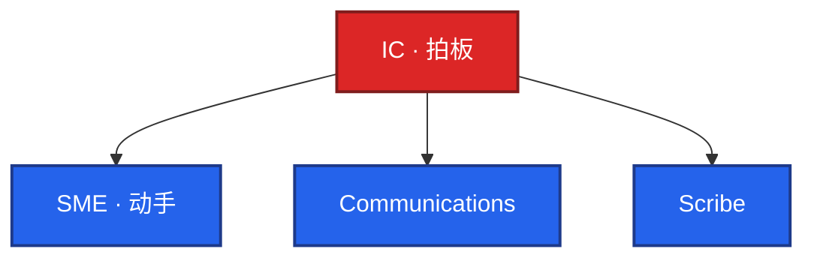

# 03｜事故管理与无责复盘 · 练习题

先对照 [知识点](知识点.md) **本章主线** 自己口述，再对答案。每题标了覆盖范围：

| 标记 | 含义 |
|------|------|
| **核心** | 不懂整章就没建立起来 |
| **必会** | 值班和面试都要能讲 |
| **常用** | 线上会反复碰到 |
| **常考** | 白板和追问的高频口径 |

## 本题目录

- [Q1 MTTD / MTTR，别说很拼](#q1)
- [Q2 定级按用户影响](#q2)
- [Q3 ICS 角色，IC 不敲命令](#q3)
- [Q4 先止血，禁止 5-Why](#q4)
- [Q5 War room 与广播](#q5)
- [Q6 升级矩阵](#q6)
- [Q7 对外 vs 对内](#q7)
- [Q8 无责复盘与 SMART](#q8)
- [Q9 GameDay 立项](#q9)
- [Q10 AI 边界与现场分流](#q10)
- [合上书](#合上书)

---

## Q1

**★★★★★｜MTTD / MTTR / MTTF？面试为什么不说「我很拼」？**

**覆盖**：核心 · 必会 · 常考

**对应**：知识点 §3.1 · §6.1

### 场景

对方：「你怎么保证稳定？」你想说「我秒回、通宵。」另有人把 MTTF 说成 MTTR。

### 完整解答

**一句话**：MTTD / MTTR / MTTF 用目标和门禁回答，不说拼劲；叫醒写在 SLO 路由。

| 词 | 直觉 | 面试口径 |
|----|------|----------|
| MTTD | 发生 → 你们发现 | 用户先发现 = 监测失败；叫醒写在 SLO 路由 |
| MTTR | 发现/发生 → 恢复 | 给目标分钟数和止血动作，不给拼劲 |
| MTTF | 两次故障间隔 | 靠错误预算和变更纪律；公式在 02 章 |

oncall 当周压 **MTTR**。答：「P0 目标 MTTR 30min；登录 5min 破线电话叫醒；复盘 action 改门禁」——比「我很拼」高级。

稳定性 vs 敏捷：预算没烧完可以发版；**P0 窗口冻非必要发布**。别用持续交付顶止血。

### 再追问

- SLO 公式？——本章不讲，去 02。这里只要：叫醒标准写在路由里。
- Toil？——去 01。事故当周不写需求，目标是 MTTR。

---

## Q2

**★★★★★｜P0 按什么定？三台机器挂是不是 P0？**

**覆盖**：核心 · 必会 · 常考

**对应**：知识点 §6.1

### 场景

有人报「挂了 50 台 Worker，P0。」另一单：测试配置打到生产支付库，就一台。看板全绿但订单金额错。

### 完整解答

**一句话**：P0 按用户影响定：登录 / 支付 / 控制面 / 数据错，不按机器台数。

按 **用户影响**，不按机器台数。P0 例子必须能举四类：**登录全挂、支付挂、控制面全挂、数据错。** 一台串租户 / 写错账也是 P0。五十台空闲 Worker 可能是 P2。

叫醒走 SLO 路由：这四类进电话。磁盘预警、副本不足不进 P0。游戏 CCU 腰斩分账 → 08-09，本章不背游戏卡片。

控制面全挂：不能变更 / 不能进核心入口；已有流量未必立刻死。定级仍看用户能不能完成核心动作，不要说「进程还在所以不是事故」。

### 再追问

- 可用性全绿、数据错？——P0。绿的是探活，不是账。
- 现场把 P0 改成 P2 好睡觉？——禁止。改叫醒标准走变更，不走事故群。

---

## Q3

**★★★★★｜ICS 四人怎么分？人少能兼吗？**

**覆盖**：核心 · 必会 · 常考

**对应**：知识点 §3.2 · §6.2

### 场景

白板：「那次登录 P0 谁拍板回滚？」你说「我定位到 Redis 然后我重启。」群里三个人同时 kubectl。

### 完整解答

**一句话**：ICS 四人：IC 拍板不敲命令；人少可兼但第一句声明角色。

| 角色 | 干什么 |
|------|--------|
| IC | 拍板止血、冻发布、升级；**不亲自敲命令** |
| Communications | 对内广播 + 对外状态页 / 公告 |
| Scribe | 时间线事实 |
| SME | 只做 IC 点名的那一件 |

人少可兼，**第一句说出来**：「我是 IC 兼 Scribe。」没说 = 三个 IC。

面试停在「我重启好了」= 执行层。高级补：为什么先止血、谁有权回滚、下次同样告警还要不要你在场。

### 再追问

- IC 为什么不敲？——脑子留影响面和下一步；敲命令时没人看升级时钟。
- 游戏摘服谁执行？——SME；不杀战斗房的细节 → 08-09。

---

## Q4

**★★★★★｜为什么禁止事故群开 5-Why？先做什么？**

**覆盖**：核心 · 必会 · 常用

**对应**：知识点 §3.1 · §6.4

### 场景

支付 40%。有人翻慢查询，有人贴代码 review，有人要「先搞清楚根因再动」。管道还在合功能分支。

### 完整解答

**一句话**：事故中禁止 5-Why：定级 → 声明 IC → 冻发布 → 一件止血 → 观察 baseline。

事故中：**定级 → 声明 IC → 冻非必要发布 → 一件止血 → 观察 baseline。** 5-Why 留复盘。群里挖根因 = 故意拉长故障。

先对齐指标何时烂 vs 何时 deploy。能回滚 / 关 flag / 切流就先做。有状态禁止当无状态乱重启。

结构化解题（白板同一套）：现象、影响面、可逆选项、拍板、成功长什么样。停在「我去查日志」不够。

### 再追问

- 冻哪些？——功能发布、实验、非紧急 schema、抢配额扩容。hotfix / 回滚除外。
- 根因猜测能不能说？——Scribe 角落可记，不能当频道主线。

---

## Q5

**★★★★★｜War room 铁律？广播写哪四句？**

**覆盖**：必会 · 常用 · 常考

**对应**：知识点 §3.2 · §6.3

### 场景

故障后再拉群。两个频道各有一个「指挥」。对外只发「正在排查」。20 分钟没有下一句。

### 完整解答

**一句话**：War room 唯一频道、唯一 IC；广播 15–30min 四字段：现状 / 影响 / 下一步 / ETA。

唯一频道（预先建好）、唯一 IC、定时广播。SME 复述再执行。禁止顺便优化。

广播每 **15–30min** 四字段：**现状、影响、下一步、ETA。** 不知道 ETA 就写下一检查点，不要空「排查中」。

没有广播 = 对外失踪、对内 IC 失职。影响扩大立刻加播。

### 再追问

- 临时拉群？——一半人仍在旧线程改配置。
- 十人 kubectl？——只留 SME，其它人停手；不要再开专家分群当第二指挥。

---

## Q6

**★★★★★｜升级矩阵三个触发？写在哪？**

**覆盖**：必会 · 常用 · 常考

**对应**：知识点 §3.3

### 场景

P0 进群 20 分钟没人说「我是 IC」。另一次认领了但 40 分钟还在讨论根因。第三次从单集群扩到全站，没人打电话。

### 完整解答

**一句话**：升级矩阵三触发写 runbook：无人 IC、超时未止血、影响扩大 / 数据错。

写在 **runbook**，不靠心情、不靠 @all。

| 触发 | 叫谁 | 时限（常见） |
|------|------|----------------|
| 无人声明 IC | backup 顶上当 IC | 15min |
| 超时未止血 | 领域 Owner | 30min 无进展 |
| 影响扩大 / 数据错 | 负责人 + Communications | 立即 |

IC 失联：矩阵下一名顶上，**不要现场选举**。Owner 是否在职、告警怎么点认领 → 05-06；现场要按矩阵打电话。

### 再追问

- backup 手机不在表里？——矩阵没配，等于没有 oncall。
- 开服窗口仍等 15min？——游戏窗口分钟内认领，细节 08-09 / 05-06；通用原则是：叫醒标准写在 SLO 路由，高峰更严不更松。

---

## Q7

**★★★★☆｜状态页和内部看板为什么要分开？赔偿在哪辩？**

**覆盖**：必会 · 常考

**对应**：知识点 §6.5

### 场景

指挥频道里运营问「赔几个小时」，研发说「SLO 没破不用公告」，有人在状态页写组件名和锅。

### 完整解答

**一句话**：状态页讲用户影响，内部看板讲 SLI；SLA 赔偿不在 war room 辩论。

| 通道 | 内容 |
|------|------|
| 指挥频道 | 动作、风险、SME |
| 内部 SLO 看板 | SLI / 错误预算 |
| 状态页 / 运营公告 | 影响面、能否用、ETA；不点名组件和锅 |
| SLA | 赔偿对照条款；**不在 war room 辩论** |

混在一起，值班被赔付拖住，忘了止血。公告看用户影响；叫醒看 SLO。两句都要说，缺一句会有人用合同顶半夜、或用内部绿盘顶用户。

Communications 把同一套事实翻译成对外语言。数据未对平禁止写「完整无丢失」。

### 再追问

- 内部 SLO 没破要不要公告？——用户已经不能付，要公告；定级和叫醒仍走路由。
- 工单字段怎么填？——05-06，本章不管按钮。

---

## Q8

**★★★★★｜无责复盘写什么？怎样才算复过盘？**

**覆盖**：核心 · 必会 · 常考

**对应**：知识点 §3.4 · §6.6

### 场景

复盘文档：「小王疏忽，下次注意。」没有日期。48h 过了还没初稿。周会 action 永远「进行中」。

### 完整解答

**一句话**：无责复盘写系统因素和 SMART action，48h 初稿，跟落到周会。

时间线 **事实**、贡献因素 **系统**（门禁 / 告警 / 路由 / 演练缺口），不写人名疏忽。「nginx 挂了」不是根因。

Action：**SMART + Owner + 改门禁/平台/SLO。** 「加强责任心」= 没写。

**48h 内初稿**（时间线会烂）。跟落到周会；没落地 = 没复盘。无责不是无责任：责任落在有名字的 Owner 和日期。

### 再追问

- 根因是同事引入的？——讲协作和门禁缺口，不点名羞辱，也不把别人的设计揽成自己的。
- AI 起草？——可以整理 Scribe；人必须删「疏忽」字样、补系统因素。

---

## Q9

**★★★★☆｜GameDay 怎么立项才算演过？**

**覆盖**：必会 · 常用

**对应**：知识点 §4.1

### 场景

老板要「做混沌工程」。有人要在生产随机杀战斗进程。另有人演练 Thanos Query 挂，但没有 IC，RTO 仍写拍脑袋进 SLA。

### 完整解答

**一句话**：GameDay 要有假设、可逆范围、真 IC / 角色、观察指标，不是随机杀进程。

立项当变更：书面假设、可逆范围、真 IC/Scribe/Communications、观察指标、缺口变 action。不是注入算子个数。

| 选 | 不选 |
|----|------|
| 断 AZ 后登录 SLI 15min 能否回来 | 「做一次混沌」无假设 |
| 真角色、15–30min 广播 | 只有跑脚本的人 |
| RTO 写内部目标 | 把没跑出来的分钟数写进对外 SLA |

游戏摘服 **不杀战斗房** → 08-09。断 AZ、Query 挂的架构 → 04。本章考纪律：演练里三个 IC、不冻旁路发布，事故里也会。

没有演练的回滚 / 切流 = 没有。

### 再追问

- 演练要不要走变更单？——要。影响面、回滚、观察，和线上变更同一套三问精神；工单 UI → 05-06。
- 季度一次够吗？——核心路径至少季度一次；只在事故后发誓不算。

---

## Q10

**★★★★☆｜AI 能自动修吗？给出现象你先走哪条？**

**覆盖**：必会 · 常用 · 常考

**对应**：知识点 §6.8 · §7

### 场景

四个现场：① 无人声明 IC ② 频道开 5-Why 还在谈赔偿 ③ 模型建议重启有状态 ④ 三台机器挂但用户核心动作还在。

### 完整解答

**一句话**：AI 可摘要日志，禁止自动改生产 / 重启有状态；现场先声明 IC 和止血。

AI：日志摘要、聚类、复盘草稿 = 可以。自动重启有状态、自动改生产、silence P0、自动定责 = **禁止** → 09-09。人拥有写动作。

| # | 走哪条 | 不要做 |
|---|--------|--------|
| ① | 升级矩阵，backup 当 IC | 等英雄、现场选举 |
| ② | IC 拉回止血；赔偿出频道 | 一起分析到恢复 |
| ③ | 人闸，IC 否决自动写 | 接模型执行 |
| ④ | 按用户影响定级 | 用机器台数升 P0 |

现场口头四句：谁是 IC、定级四类命中哪条、冻发布、下一件止血 + 下次广播几点。

### 再追问

- 控制面挂要不要重启逻辑服？——不要。先停变更；已有流量通常还在。命令大全 → 02 / 04-17。
- 平台认领按钮没人点？——升级仍要发生；按钮和 CMDB → 05-06。

---

## 合上书

- [ ] 能用 MTTD / MTTR / MTTF 回答「怎么保证稳定」，不说拼劲
- [ ] 能按用户影响定 P0，举登录 / 支付 / 控制面 / 数据；不数机器
- [ ] 能画出 ICS 四人，兼岗第一句说出来；IC 不敲命令
- [ ] 能讲事故中禁止 5-Why、冻发布、广播四字段、升级三个触发
- [ ] 能把状态页 / SLO 看板 / SLA 赔偿分开
- [ ] 能写无责初稿字段和 SMART action；48h + 周会跟落
- [ ] 能立项 GameDay（假设、角色、可逆）；AI 只读不写生产
