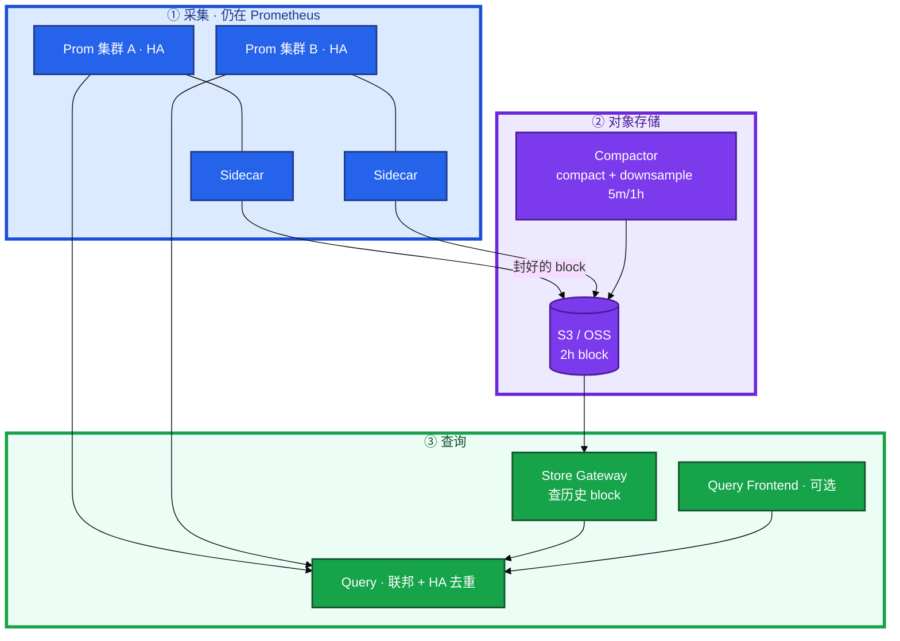
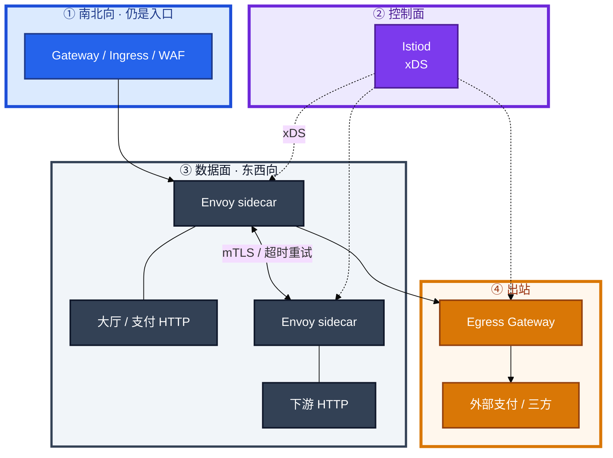
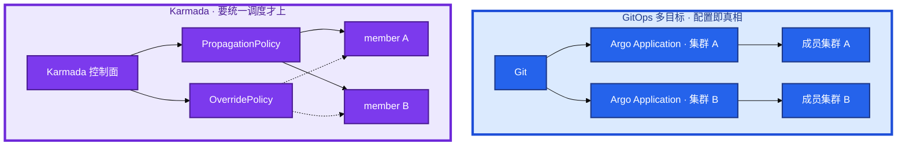
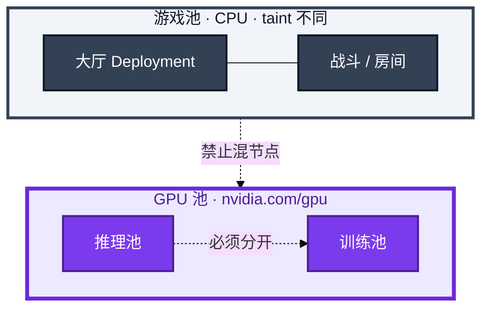
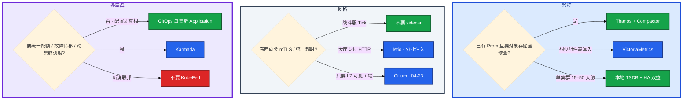
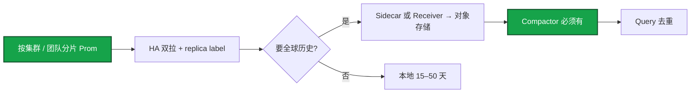
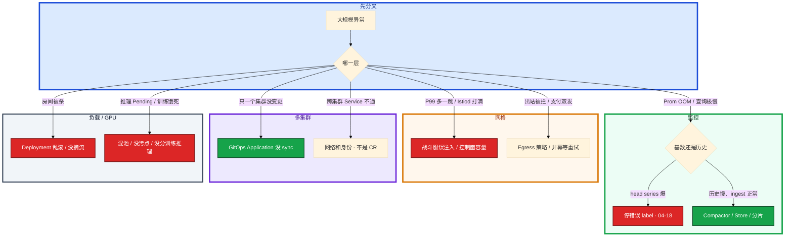

# 大规模可靠性架构

白板：「一万 Pod。监控怎么扛？要不要上网格？多集群用 GitOps 还是联邦？游戏服怎么放？GPU 推理和战斗能不能混节点？」有人开口就画 Istio + Thanos + Karmada + 自研调度器，不问规模、SLO、已有栈。另有人把战斗服抄 Web 的 Deployment 滚动。

这一章只做一件事——**每个框解决什么、引入什么故障域、什么时候不该上。** 前面的管线和角色，是为了让你画的时候不把组件名堆成一张图。

**读完你能：** 白板上画出 Thanos 管线、Istio 控制面/数据面、GitOps 多目标 vs Karmada、GPU 池 vs 游戏池；能说 sidecar 为什么贵、战斗服默认不注入；没做过 KruiseGame 不写精通。

**本章主线（架构就按这三步想）：**

1. **约束**：先问规模 / SLO / 已有栈，再画图；每框说清解决什么、引入什么故障域。
2. **取舍**：Thanos 管长期查；Istio 东西向；GitOps 多目标 vs Karmada 统一调度。
3. **游戏**：战斗服不用 Deployment 滚动；GPU 池和战斗池隔离；没做过 KruiseGame 不写精通。

## 本章目录

- [1. 基本概念](#1-基本概念)
- [2. 架构图](#2-架构图)
- [3. 原理](#3-原理)
  - [3.1 Thanos](#31-thanos组件管线不是多一台-prometheus)
  - [3.2 Istio](#32-istio控制面下发数据面转发)
  - [3.3 多集群](#33-多集群gitops-vs-karmada)
  - [3.4 有状态游戏](#34-有状态游戏deployment-不够)
  - [3.5 GPU 池](#35-gpu-池不要和战斗服混节点)
  - [3.6 怎么答](#36-怎么答架构面先约束再画图)
- [4. 安装部署](#4-安装部署)
  - [4.1 选型决策树](#41-选型决策树不是-helm-install)
  - [4.2 落地你实际看到什么](#42-落地你实际看到什么)
- [5. 核心配置](#5-核心配置)
- [6. 命令与操作](#6-命令与操作)
- [7. 生产排障](#7-生产排障)
- [8. 必会 · 常考](#8-必会--常考)
- [合上书，问自己](#合上书问自己)

**本章不讲：** Prometheus 安装、ServiceMonitor、高基数第一刀 → [04-18 监控与可观测性](../../04-Kubernetes/18-监控与可观测性/)；Ingress 灰度 YAML → [04-14 流量管理](../../04-Kubernetes/14-Ingress与流量管理/)、[04-15 灰度与回滚](../../04-Kubernetes/15-灰度与回滚/)；Cilium eBPF / Hubble → [04-23](../../04-Kubernetes/23-eBPF与Cilium/)；GPU 显存账、vLLM、TTFT → [09-08](../../09-AI与智能运维/08-GPU与推理服务运维/)；成本扫闲置 → [07-06](../../07-云平台/06-成本治理/)、[02 错误预算与 FinOps](../02-SLO错误预算与FinOps/)；开合服步骤、摘流热更 → [08 游戏运维](../../08-游戏运维专题/)；Operator 和解循环 → [04-20](../../04-Kubernetes/20-Operator与CRD/)。多云名字对照 → [07-04](../../07-云平台/04-多云对照/)；出海 region → [08-10](../../08-游戏运维专题/10-出海与多区域/)。GitOps sync 操作 → [04-22](../../04-Kubernetes/22-GitOps-ArgoCD与Tekton/)；STS 滚动公式 → [04-05](../../04-Kubernetes/05-工作负载控制器/)。

---

## 1. 基本概念

大规模可靠性不是「组件越多越稳」。一万 Pod 的集群里，多一个控制面会多一个故障域；少一个隔离会把训练打满推理、把战斗和 GPU 抢同一台机。

四个不要混：

| 层 | 解决什么 | 不解决什么 |
|----|----------|------------|
| **长期指标** | 留存、全球查、HA 去重 | 已经炸了的 Prometheus ingest |
| **服务网格** | 东西向超时/重试/mTLS/观测 | 南北向入口鉴权、WAF、战斗服房间 |
| **多集群** | 配置分发或统一调度 | 跨集群网络和身份自动变好 |
| **工作负载控制器** | Pod 怎么建、怎么更 | 内存对局、热更协议 |

五个角色不要混：

| 角色 | 干什么 | 面试里常被偷换成 |
|------|--------|------------------|
| **Prometheus** | 拉、算、本地 TSDB | 「监控」整套 |
| **Thanos** | 对象存储上的全局查 + 压缩降采样 | 高基数许可证 |
| **Istiod** | 控制面，xDS 下发 | 数据面自己转发 |
| **Envoy** | 数据面，每跳多一次代理 | 「网格 = 入口」 |
| **Karmada** | 多集群分发 / 差异 / 调度 | 现行的 KubeFed |

> **记住**：先问约束（规模、SLO、团队、已有栈），再画图，再取舍。每引入一个系统，必须能说清：解决什么、引入什么故障域、不选它的条件。

---

## 2. 架构图

先把四张图钉住。后面选型、反模式、白板验收都对着这四张图说话。

### 2.1 Thanos 管线

**读图三句话：**
1. **Sidecar 随 Prometheus**，等本地 TSDB 把 **2h block 封好** 再上传。不是把正在写的 WAL 实时倒进对象存储。
2. **Query 同时打在线 Prometheus 和 Store Gateway**，对 HA 副本按 replica label **去重**。没有去重，双拉会翻倍。
3. **没有 Compactor，长期存储又贵又慢**：小 block 堆满桶，Store 扫不动，也没有 5m/1h 降采样。

Receiver 是另一条路：很多 Prometheus **remote-write 进来**，不再每套跟 Sidecar。和 Sidecar **二选一思路**，不要两套一起灌同一条全局查询还互不知情。Ruler、Query Frontend 可选。

### 2.2 Istio 控制面 / 数据面

南北向入口仍是 Gateway / Ingress（14）。网格管 **东西向**。`VirtualService` 不是 WAF，也不替代入口鉴权。出站要审计、要统一出口，才走 **Egress Gateway**。

### 2.3 多集群：GitOps 多目标 vs Karmada

左边：每集群一份 Application（或 ApplicationSet 生成），集群彼此独立，故障域干净。右边：控制面 + member，`PropagationPolicy` 分发，`OverridePolicy` 做副本数/镜像/环境差异。**KubeFed / 旧 Federation 不要当作现行方案。**

难的不是 CR 名字，是 **跨集群 Service、身份、网络**。多云对照细节 → 07-04；出海 region → 08-10。

### 2.4 GPU 池 vs 游戏池

没有箭头从战斗服指向 GPU。训练打满会饿死在线 SLO；游戏进程和推理抢同一台机，drain / 掉电 / 驱动 Xid 会互相误伤。显存账、TTFT、vLLM → 09-08。

---

## 3. 原理

原理只保留白板和追问会用到的：Thanos 各框干什么、网格贵在哪、多集群选哪条、游戏控制器保证什么、GPU 隔离粒度怎么说。

**本节 6 块：** 3.1 Thanos · 3.2 Istio · 3.3 多集群 · 3.4 游戏控制器 · 3.5 GPU · 3.6 答题顺序

### 3.1 Thanos：组件管线，不是「多一台 Prometheus」

**一句话：** Thanos 解决长期查和 HA 去重；高基数仍要在 Prometheus 第一刀砍。

04-18 只留了三句。面试要能把管线拆开：

| 组件 | 干什么 | 没有它会怎样 |
|------|--------|--------------|
| **Sidecar** | 随 Prometheus，把封好的 **2h block** 上传对象存储 | 只有本地盘留存，跨集群查不到历史 |
| **Store Gateway** | 读对象存储里的历史 block | Query 只能打在线 Prometheus |
| **Query** | 联邦各 Prom + Store，对 HA 副本去重 | 双副本曲线翻倍、告警双响（AM 是另一层） |
| **Compactor** | 对象存储里 compact + **downsample（5m / 1h）** | 长期又贵又慢 |
| **Query Frontend** | 可选：拆查询、结果缓存 | 大查询容易把 Query 打穿 |
| **Receiver** | 很多 Prometheus remote-write 进来 | 和 Sidecar **二选一思路** |
| **Ruler** | 可选：在全局数据上算规则 | 没有也能在各 Prom 本地 recording / alerting |

高基数仍然 **先炸 Prometheus ingest**。`user_id` / `pod_ip` 打满 series，Thanos 只是把已经爆炸的 block 搬进对象存储，Query 更慢。先 drop relabel、禁错误 label、recording rule 降查询负载——操作回 04-18。

一万 Pod：按 **集群 / 团队分片** Prometheus，不要一台扛全站。label 禁止 user_id、pod_ip、order_id。Recording rule 把常用聚合提前算好。软上限大约 **200 万 series / 实例**，超了分片，不是只加内存。

vs VictoriaMetrics：已有 Prometheus、要 **全球查对象存储** → Thanos。想 **少组件、高写入** → VM。远程存储解决留存和全局查询，**不解决**乱打 label。

> **记住**：Thanos 救的是留存和全局查。救不了 ingest。没有 Compactor 等于把对象存储当无限坏盘。

### 3.2 Istio：控制面下发，数据面转发

**一句话：** Istiod 下发 xDS；Envoy 每跳多一次代理，战斗服默认不注入。
Istiod 是控制面：服务发现、证书、把 `VirtualService` / `DestinationRule` / `PeerAuthentication` 编译成 **xDS** 下给 Envoy。Envoy sidecar 是数据面：真正拦流量。注入：Namespace `istio-injection=enabled`，或 Pod 注解 `sidecar.istio.io/inject: "true"`。

能力（东西向）：超时、重试、熔断、mTLS、按权重金丝雀。南北向入口仍是 Gateway / Ingress；金丝雀用户流量从入口切进来，网格负责服务之间怎么走。YAML cookbook → 14 / 15，本章不背。

**sidecar 成本**（面试官爱听数字感，不爱听「很贵」）：

| 成本 | 含义 |
|------|------|
| 每 Pod **+CPU / 内存** | 一万 Pod ≈ 一万个 Envoy；控制面也要喂满 xDS |
| **多一跳延迟** | 进出各一次代理；战斗 Tick 路径通常受不了 |
| 控制面容量 | Istiod 是容量题，不是「装上就完」 |
| 排障面 | 超时在 Envoy 还是应用？多一层 tcpdump 替身 |

游戏 **有状态战斗服：默认不要 sidecar**。大厅 / 支付这类 HTTP 可以考虑。Cilium sidecarless、Istio Ambient（ztunnel / waypoint）是 **减 sidecar** 的方向，细节 → 04-23。不要为了简历给战斗服插 Envoy。

追问盲区：

- **Egress Gateway** 管出站：支付回调、三方 SDK，统一出口、可审计。不是「有了 VirtualService 出站就安全」。
- **VirtualService 不替代入口鉴权 / WAF。** 路由 ≠ 身份校验。WAF、证书、IP 允许名单仍在南北向。

> **记住**：网格增强东西向；入口还是入口。战斗服默认不注入。

### 3.3 多集群：GitOps vs Karmada

**一句话：** GitOps 多目标分发配置；Karmada 统一调度——先独立再统一。
三种，只记现行的两条，旧的一条当反例：

| 路径 | 是什么 | 何时 |
|------|--------|------|
| **1. GitOps 多目标** | Argo Application **每集群一份**（ApplicationSet 生成） | 集群独立、配置即真相 |
| **2. 旧 Federation / KubeFed** | 历史上的联邦 API | **不要当现行方案** |
| **3. Karmada** | 控制面 + member；`PropagationPolicy` 分发，`OverridePolicy` 差异 | 要统一配额、故障转移、跨集群调度 |

选型：集群独立、Git 是真相、故障域要切开 → **GitOps**。真要一块控制面做配额 / 转移 / 调度 → 才上 **Karmada**。为了「看起来像一个集群」上 Karmada，会把网络和身份问题藏进控制面。

难的是 **跨集群 Service 和身份**，不是会不会写 CR。Service 跨集群要多集群 DNS / MCS / 专线 / 统一入口，证书和 ram 账号要对齐。操作细节不在本章。

> **记住**：先 GitOps 多目标。Karmada 是调度需求，不是多集群的默认答案。

### 3.4 有状态游戏：Deployment 不够

**一句话：** 战斗服要固定 Pod、优雅下线、session 迁移；Deployment 滚动不够。
| 控制器 | 保证什么 | 不保证什么 |
|--------|----------|------------|
| **Deployment** | 副本可互换、滚动公式 | **没有身份**；乱滚会杀房间 |
| **StatefulSet** | 序号、Headless DNS、盘 | 仍按序杀进程，**不是游戏热更** |
| **OpenKruise** | 原地升级、sidecar 独立升、AdvancedStatefulSet | 仍要摘流；不是房间协议 |
| **KruiseGame / GameServerSet** | 游戏服集合、网络身份、更新策略对准房间 | 没做过不要简历写精通 |

Deployment 无身份：Pod 名随机，滚动新建再删，房间在内存里就没了。StatefulSet 有 `name-N` 和盘，滚动 **照样杀进程**——04-05 写过。OpenKruise 的价值是 **原地升级**（尽量保留 Pod IP / 网络身份，换容器镜像）和 **SidecarSet 独立升**（日志 / 网格 sidecar 不绑主容器生命周期）。AdvancedStatefulSet 补了原生 STS 不好做的 maxUnavailable / 原地。

KruiseGame 的 `GameServerSet` 把「这组是游戏服」写成 CR：网络身份（HostNetwork / EIP / 专用 CNI）、更新策略（没人再删、等待对局结束）。有状态摘流细节 → 08-01、04-05、08-03。没 Owner 过生产，白板可以说设计，简历不要写精通。

> **记住**：STS 解决名/盘/DNS；OpenKruise 解决怎么更；GameServerSet 对准房间。三者都不替代摘流。

### 3.5 GPU 池：不要和战斗服混节点

**一句话：** GPU 推理和战斗服分池；混节点会把训练打满推理。
NVIDIA Device Plugin 把卡上报成扩展资源 **`nvidia.com/gpu`**。Scheduler 只把申请了这个资源、且能容忍 GPU 污点的 Pod 绑上去。普通大厅没有容忍，进不来——这是设计。

共享要能说清 **隔离粒度：算力 / 显存是否硬隔离**：

| 方式 | 隔离 | 生产怎么用 |
|------|------|------------|
| **时间切片** | 通常 **不硬隔离** 显存 | 开发测试；活动日在线推理不要 |
| **MIG** | 硬件切实例，算力/显存硬隔离 | 小模型多租、A100/H100 |
| **云厂商 vGPU** | 产品名不同；问清显存是否硬隔离、算力是否共享 | 按厂商文档验收，不要背一个品牌当全部 |

训练池 vs 推理池 **必须分开**。不要和战斗服混节点：驱动、掉电、drain、Xid 的爆炸半径不同。自定义调度（Volcano / 自研 extender）是 **加分项不是默认**。生产先 **污点 + nodeSelector / 亲和**；真有批作业抢占、队列、公平共享再上自研。显存 / TTFT / vLLM 操作 → 09-08。

> **记住**：先隔离池和污点。面试官听的是隔离粒度，不是产品名。

### 3.6 怎么答架构面：先约束再画图

**一句话：** 先问规模/SLO/已有栈，再画图；每框说清解决什么、引入什么故障域。

字节风格高级面，不是「我知道这些项目」。开口 2–3 分钟只问：

1. **规模**：几个集群、多少 Pod、多少团队、要不要全球查。
2. **SLO**：监控查询延迟？网格 P99 预算？战斗 Tick？推理 TTFT？
3. **团队**：几个人 Owner？会不会运对象存储和网格证书？
4. **已有栈**：已经 Prometheus + Argo？还是空白？

再画图。每引入一个框讲三句：**解决什么、引入什么故障域、不选它的条件。** 画完主动说不选什么。对方改数字，你改图，不要争组件信仰。

---

## 4. 安装部署

### 4.1 选型决策树（不是 helm install）

本章的「安装」是 **选不选、选哪条**。逐步 `helm install` 不在这张白板上。

| 域 | 选 | 不选 |
|----|----|------|
| 长期指标 | 已有 Prom + 全球对象存储 → Thanos（**必须有 Compactor**） | 用 Thanos 扛高基数；无 Compactor 只开 Sidecar |
| 网格 | HTTP 无状态分批；战斗服不注入 | 一万战斗服全插 sidecar 当默认 |
| 多集群 | 独立 → GitOps；真调度 → Karmada | KubeFed；为简历上控制面 |
| 游戏服 | 摘流 + STS / Kruise / GSS（做过再写） | Deployment `maxUnavailable=25%` 滚房间 |
| GPU | 独立池 + 污点；训练 / 推理再拆 | 和战斗混节点；默认自研 scheduler |

托管 ACK / 云网格 / 云 Prometheus：你看不见进程，**故障域和账单仍是你的**。上线前问清：对象存储谁付、网格谁轮证书、member 集群网络谁打通。

### 4.2 落地你实际看到什么

验收看控制面对象和职责，不看「helm 绿了」。

| 你该能指着说 | 那是什么 |
|---------------|----------|
| Prometheus 旁的 Sidecar 容器 | 上传 2h block，不是第二个 scrape |
| 对象存储里的 block + Compactor 任务 | 长期存储的真实形态 |
| Namespace 标签 `istio-injection=enabled` | 注入开关；战斗 NS 应没有 |
| `VirtualService` | 东西向路由，不是 WAF |
| `PropagationPolicy` / `OverridePolicy` | Karmada 分发和差异 |
| `GameServerSet` | 游戏服集合；没有就不要装熟 |
| Pod `resources` 里 `nvidia.com/gpu` | Device Plugin 上报的扩展资源 |

没有这些对象却号称「我们大规模上了」，就是简历词。

---

## 5. 核心配置

只记 **什么时候不该上**。配置项的 YAML 回各章。

| 反模式 | 为什么不该上 | 该怎样 |
|--------|--------------|--------|
| 高基数没治就上 Thanos | ingest 已死，远程存储更慢更贵 | 先 drop label（04-18） |
| Thanos 不开 Compactor | 小 block 堆满，查询打满 Store | compact + 5m/1h downsample |
| Sidecar 和 Receiver 双灌同一套 Query | 重复样本、去重规则打不过来 | 二选一 |
| 全集群默认注入 Istio | 战斗服 + 一万 Envoy + Istiod 容量 | NS 白名单；战斗禁止 |
| 用 VirtualService 当入口鉴权 | 路由不是身份；绕过 WAF | 南北向 Gateway / WAF / 认证 |
| 支付 POST 开网格默认重试 | 双发（14 已写） | 只对幂等；限制次数 |
| 多集群默认 Karmada | 引入控制面单点；网络没打通 | 先 GitOps 多目标 |
| 把 KubeFed 写进现行方案 | 基本不再作为新项目答案 | 明确说历史方案 |
| 战斗服 Deployment 乱滚 | 无身份，杀房间 | 摘流；STS / Kruise / GSS |
| 以为 STS 就是热更 | 按序仍杀进程 | 08-03 热更协议 |
| 简历精通 GameServerSet | 追问网络身份和更新策略就穿 | 做过写使用；没做过说设计 |
| GPU 和战斗混池 | 故障域绑死 | 分池 + 污点 |
| 时间切片扛活动推理 | 显存不硬隔离，互相 OOM | MIG 或整卡；vGPU 问清隔离 |
| 生产默认自研 GPU scheduler | 多一个控制面 | 先污点 + nodeSelector |
| 训练和推理同池靠口头约定 | 训练打满饿死 SLO | 分池 + priorityClass |

> **记住**：不该上比该上更常考。每个「上」都要配一个「不上的条件」。

---

## 6. 命令与操作

这里的「命令」是 **白板验收问题清单**，外加少量必须能写对的组件名 / CR 名。不是再背一遍 `helm`。

白板你要能当场问自己（也是面试官会问你的）：

| # | 验收问题 | 过关口径 |
|---|----------|----------|
| 1 | Thanos 各框干什么？没有 Compactor？ | Sidecar 传 2h block；Store 查历史；Query 联邦去重；Compactor compact+downsample；没有又贵又慢 |
| 2 | 高基数谁先死？ | Prometheus ingest；Thanos 救不了 |
| 3 | 一万 Pod 监控怎么拆？ | 按集群/团队分片；禁 user_id/pod_ip；recording rule |
| 4 | 控制面数据面谁是谁？ | Istiod xDS；Envoy 转发 |
| 5 | 怎么注入？战斗服？ | NS `istio-injection=enabled` 或 Pod 注解；战斗默认不注入 |
| 6 | 南北向 vs 东西向？ | 入口仍 Gateway/Ingress；网格东西向 |
| 7 | sidecar 成本？ | 每 Pod +CPU/内存 + 一跳；一万 Pod 控制面也是容量题 |
| 8 | Egress？VirtualService？ | Egress 管出站；VS 不替代鉴权/WAF |
| 9 | 多集群三条路？ | GitOps 每集群 Application；KubeFed 不现行；Karmada 要调度才上 |
| 10 | 难的是什么？ | 网络和身份，不是 CR 名字 |
| 11 | 游戏控制器阶梯？ | Deploy 无身份 → STS 有名有盘仍杀进程 → OpenKruise 原地 → GameServerSet 对准房间 |
| 12 | GPU 资源名？隔离？ | `nvidia.com/gpu`；时间切片 vs MIG vs vGPU 讲硬隔离 |
| 13 | 训练 / 推理 / 战斗？ | 三池；先污点+nodeSelector，自研调度是加分项 |

必须能写对的名字（写错就说明没碰过）：

| 名字 | 属于 |
|------|------|
| Sidecar / Store Gateway / Query / Compactor / Receiver | Thanos |
| `istio-injection=enabled` | 注入 |
| `VirtualService` | Istio 路由 CR（不是入口 WAF） |
| Egress Gateway | 出站 |
| Argo `Application` / `ApplicationSet` | GitOps 多目标 |
| `PropagationPolicy` / `OverridePolicy` | Karmada |
| `SidecarSet` / AdvancedStatefulSet | OpenKruise |
| `GameServerSet` | KruiseGame |
| `nvidia.com/gpu` | Device Plugin 扩展资源 |

值班不会靠这些 CR 止血。战斗服掉线仍走 08 的摘流和进程三问；Prometheus OOM 仍走 04-18 的基数。

---

### 6.1 万级 Pod 监控怎么拆

先分片和禁高基数，再谈 Thanos。一台 Prometheus 扛一万 Pod 的 kubelet + 业务指标，会在 ingest 死掉。Recording rule 给 Grafana 常用聚合，不给错误 label 续命。

### 6.2 网格分批：先无状态

1. 只给 **大厅 / 支付 HTTP** 的 Namespace 打开注入。
2. 战斗、场景、房间 **显式禁止**。
3. 入口鉴权 / WAF 不动；网格只接东西向。
4. 看 Istiod 资源、sidecar CPU、P99 多出来的一跳。超 SLO 就停扩，不要「全开再看」。
5. 出站三方走 Egress Gateway；支付重试按幂等关死。

减 sidecar：Cilium / Ambient → 04-23，不要在战斗服上做 Istio 实验。

### 6.3 多集群：先独立再统一

先每集群 Argo Application，Git 一份环境 overlay。真出现「要按配额把副本弹到另一个集群」「要统一故障转移」再评估 Karmada。评估清单：member 网络通不通、身份（OIDC / 证书）怎么发、控制面挂了 member 是否还能本地变更。控制面挂了还要靠 GitOps 保底。

### 6.4 游戏控制器怎么选

大厅 / 网关：Deployment + PDB + 摘流（08-01、04-05）。房间 / 战斗：先摘流再动进程。需要稳定网络 ID 用 STS 或 Kruise AdvancedStatefulSet；需要原地升、sidecar 独立升用 OpenKruise；需要房间级更新策略且团队做过，才上 `GameServerSet`。没做过就按 STS + 摘流讲，诚实。

### 6.5 GPU 池怎么隔离

独立节点池、taint、`nvidia.com/gpu`。推理池和训练池再拆。战斗节点不配 GPU 污点容忍。共享：开发时间切片，生产 MIG 或整卡；云 vGPU 问清显存是否硬隔离。调度：先 nodeSelector。Xid / 显存 / 排队 → 09-08。闲置卡成本 → 07-06 和 10-02。

---

## 7. 生产排障
架构面的排障是 **先认层**，不是先认某一个 helm release。和 01 同一套三问：进程还在不在？还能不能变更？已有流量还通不通？再问：炸的是采集、网格控制面、多集群网络，还是调度隔离。

| 现象 | 先认哪层 | 不要做什么 |
|------|----------|------------|
| Prometheus OOM | 高基数 ingest（04-18） | 加 Thanos 当解药 |
| Grafana 查一年极慢 | Compactor / downsample / Store | 只给 Query 加核 |
| 战斗 P99 毛刺、sidecar CPU 高 | 不该注入 | 先给 Istiod 扩一倍当默认 |
| 支付打了两次 | 网格重试 + 非幂等 | 再加一次重试 |
| 跨集群调不通 | 网络 / DNS / 证书 | 改 OverridePolicy 当修网 |
| 房间没了 | 控制器选错 + 没摘流 | 重启更多战斗服 |
| GPU Pending 同时战斗节点有卡 | 污点 / 选择器 / 混池 | 删大厅「腾卡」（卡不在游戏池） |

活动高峰不要上新控制面（新网格、新 Karmada、新自研调度）。先停变更，认层，再回对应章的操作。

---

## 8. 必会 · 常考
白板和追问高频，能一口回：

| 说法 | 对错 | 口径 |
|------|:----:|------|
| Thanos 能扛 `user_id` 当 label | 错 | 先炸 ingest；远程存储不解决基数 |
| 没有 Compactor 也能长期用对象存储 | 错 | 又贵又慢；要 compact + downsample |
| Sidecar 实时把 WAL 推到 S3 | 错 | 封好的 2h block |
| Query 不用去重 | 错 | HA 双拉会翻倍 |
| 已有 Prom 要全球查对象存储仍该先上 VM | 看约束 | 这条更贴 Thanos；少组件高写入才 VM |
| 网格 = 入口 | 错 | 南北向仍 Gateway/Ingress；网格东西向 |
| 一万 Pod 默认全注入 | 错 | sidecar 成本和 Istiod 容量 |
| 战斗服该插 Envoy 才叫云原生 | 错 | 默认不要 sidecar |
| VirtualService 替代 WAF | 错 | 路由不是鉴权 |
| 出站不用管 | 错 | Egress Gateway 管出站 |
| 多集群默认 Karmada | 错 | 独立配置先 GitOps |
| KubeFed 是现行联邦 | 错 | 不要当现行方案 |
| 难的是会写 PropagationPolicy | 错 | 难的是网络和身份 |
| Deployment 可以滚战斗房 | 错 | 无身份，杀房间 |
| StatefulSet 就是游戏热更 | 错 | 有名有盘，仍杀进程 |
| 没做过也能简历精通 KruiseGame | 错 | 追问即穿 |
| GPU 和战斗混节点省机器 | 错 | 故障域绑死 |
| 时间切片 = MIG | 错 | 隔离粒度不同 |
| 生产 GPU 默认自研 scheduler | 错 | 先污点 + nodeSelector |
| 开口就画组件不问规模 | 错 | 先约束再画图再取舍 |

数字和名字：Prometheus 软上限约 **200 万 series**；block **2h**；downsample **5m / 1h**；注入标签 **`istio-injection=enabled`**；资源名 **`nvidia.com/gpu`**；CR：**VirtualService、PropagationPolicy、OverridePolicy、GameServerSet**。

易混：Sidecar vs Receiver；Query 去重 vs Alertmanager 去重；南北向 vs 东西向；GitOps 多目标 vs Karmada；STS vs OpenKruise vs GameServerSet；时间切片 vs MIG vs vGPU；自研调度 vs 污点。

---

## 合上书，问自己

1. Thanos 从 Sidecar 到 Compactor 各解决什么？没有 Compactor 怎样？高基数谁先死？
2. Istiod 和 Envoy 谁控制谁转发？sidecar 成本怎么讲？战斗服为什么默认不注入？
3. 多集群三条路怎么选？为什么难的是网络和身份？KubeFed 还现行吗？
4. Deployment / STS / OpenKruise / GameServerSet 各保证什么、不保证什么？
5. `nvidia.com/gpu` 谁上报？训练、推理、战斗为什么分池？MIG 和 vGPU 面试怎么说隔离？
6. 架构面开口先问哪四类约束？每引入一个系统要讲哪三句？

六题都能口述，这一章就过了。**本模块收到这里。** 操作细节回 04（监控、流量、工作负载、GitOps、Cilium、Operator）、07（多云、成本）、08（游戏摘流、热更、出海）、09（GPU 显存与推理）。
