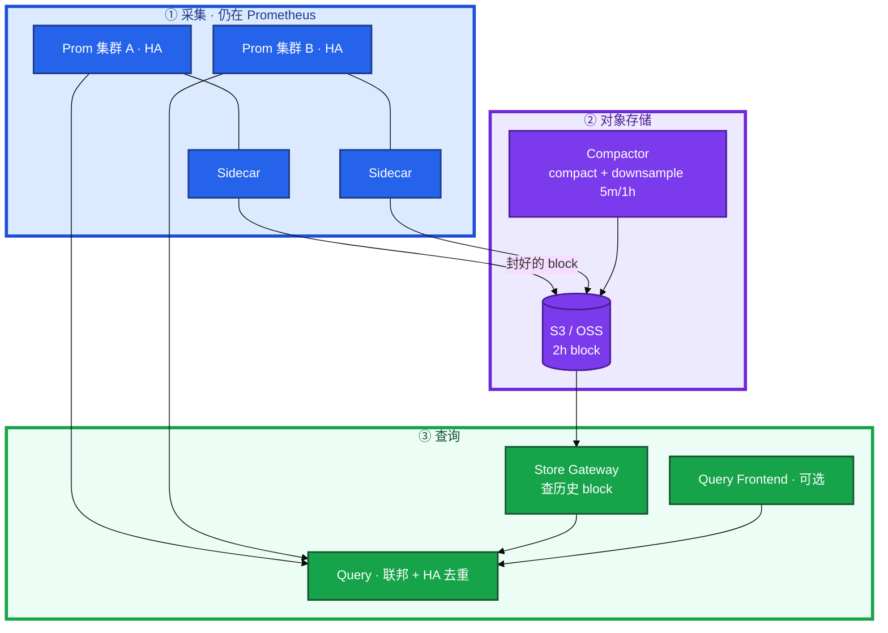
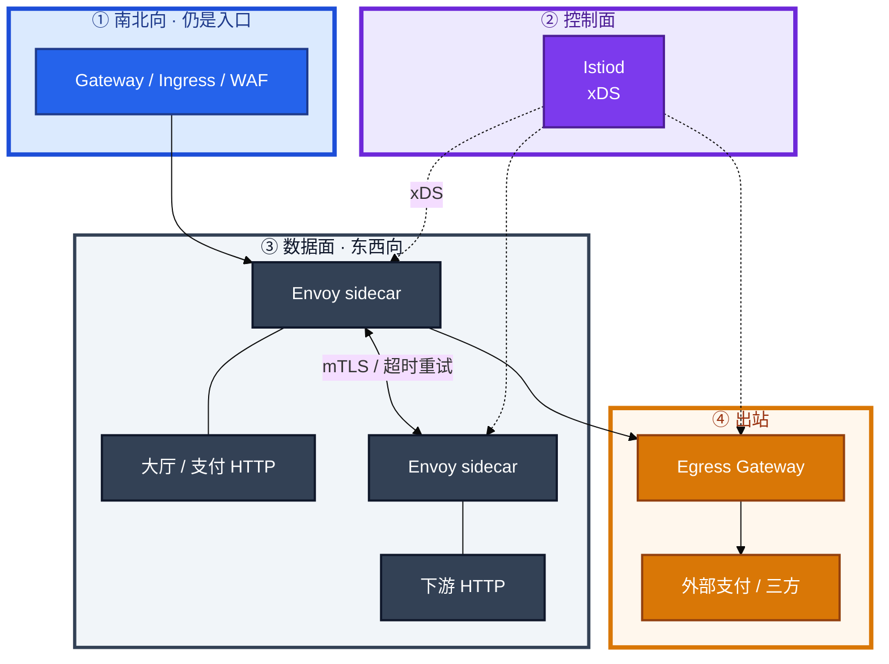
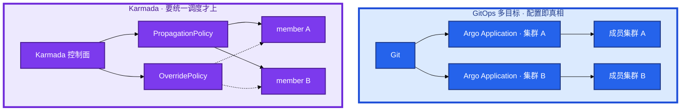
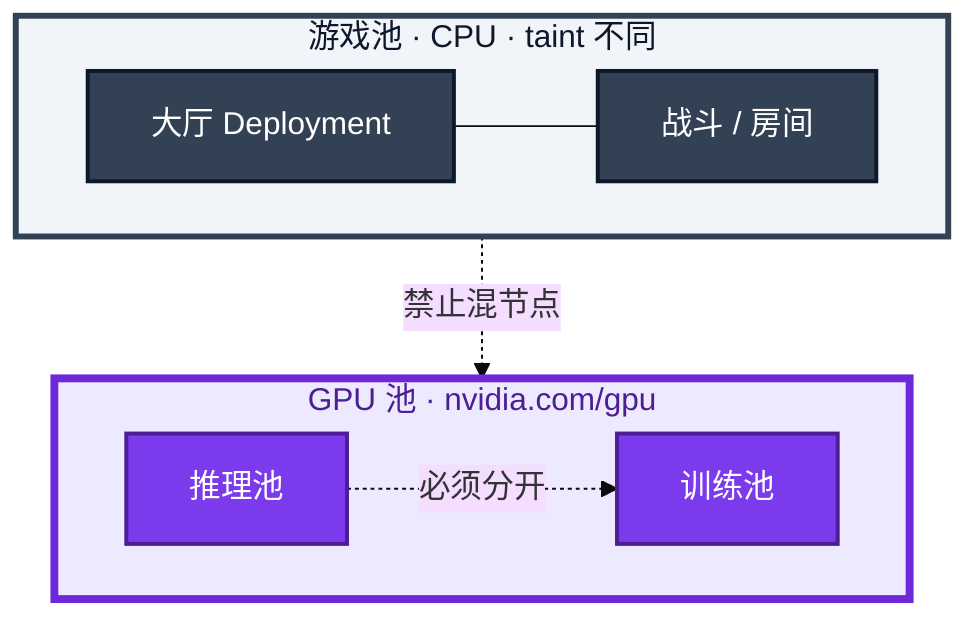
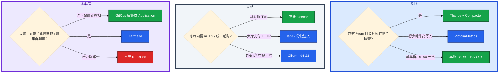
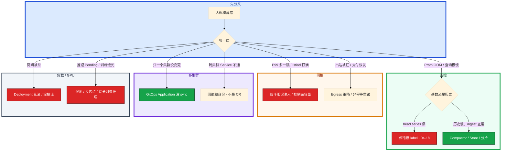

# 大规模可靠性架构


白板：「一万 Pod。监控怎么扛？要不要上网格？多集群用 GitOps 还是联邦？游戏服怎么放？GPU 推理和战斗能不能混节点？」有人开口就画 Istio + Thanos + Karmada + 自研调度器，不问规模、SLO、已有栈。另有人把战斗服抄 Web 的 Deployment 滚动——开服周房间全灭，群里还在讨论 Helm chart 版本。

**本章主线（架构就按这三步想）：**

1. **约束**：先问规模 / SLO / 已有栈，再画图；每框说清解决什么、引入什么故障域。
2. **取舍**：Thanos 管长期查；Istio 东西向；GitOps 多目标 vs Karmada 统一调度。
3. **游戏**：战斗服不用 Deployment 滚动；GPU 池和战斗池隔离；没做过 KruiseGame 不写精通。

**读完你能：** 白板上画出 Thanos 管线、Istio 控制面/数据面、GitOps 多目标 vs Karmada、GPU 池 vs 游戏池；能说 sidecar 为什么贵、战斗服默认不注入；没做过 KruiseGame 不写精通。

## 本章目录

- [1. 基本概念](#1-基本概念)
- [2. 架构图](#2-架构图)
- [3. 原理](#3-原理)
- [4. 落地](#4-落地)
- [5. 核心配置](#5-核心配置)
- [6. 命令与操作](#6-命令与操作)
- [7. 生产排障](#7-生产排障)
- [8. 必会 · 常考](#8-必会--常考)
- [合上书](#合上书问自己)

**本章不讲：** Prometheus 安装、ServiceMonitor、高基数第一刀 → [04-18 监控与可观测性](../../04-Kubernetes/18-监控与可观测性/)；Ingress 灰度 YAML → [04-14](../../04-Kubernetes/14-Ingress与流量管理/)、[04-15](../../04-Kubernetes/15-灰度与回滚/)；Cilium eBPF / Hubble → [04-23](../../04-Kubernetes/23-eBPF与Cilium/)；GPU 显存账、vLLM、TTFT → [09-08](../../09-AI与智能运维/08-GPU与推理服务运维/)；成本扫闲置 → [07-06](../../07-云平台/06-成本治理/)、[02](../02-SLO错误预算与FinOps/)；开合服步骤、摘流热更 → [08 游戏运维](../../08-游戏运维专题/)；Operator 和解循环 → [04-20](../../04-Kubernetes/20-Operator与CRD/)。

---

## 1. 基本概念

大规模可靠性不是「组件越多越稳」。一万 Pod 的集群里，多一个控制面会多一个故障域；少一个隔离会把训练打满推理、把战斗和 GPU 抢同一台机。

**值班里怎么认层**（大规模异常先分叉）：

| 现象 | 可能在哪层 | 第一刀 |
|------|------------|--------|
| Prom OOM / 查询极慢 | 采集 / 基数 | head series 爆？还是历史 Store 慢？ |
| P99 多一跳 / Istiod 打满 | 网格 | 战斗服误注入？控制面容量？ |
| 只一个集群没 sync | 多集群 GitOps | Application 状态？不是 OverridePolicy |
| 跨集群 Service 不通 | 网络 / 身份 | 不是 CR 名字写错 |
| 房间被杀 | 工作负载控制器 | Deployment 乱滚 / 没摘流 |
| GPU Pending 但节点有卡 | 调度隔离 | 污点 / 混池 |

四个不要混：

| 层 | 解决什么 | 不解决什么 |
|----|----------|------------|
| **长期指标** | 留存、全球查、HA 去重 | 已经炸了的 Prometheus ingest |
| **服务网格** | 东西向超时/重试/mTLS/观测 | 南北向入口鉴权、WAF、战斗服房间 |
| **多集群** | 配置分发或统一调度 | 跨集群网络和身份自动变好 |
| **工作负载控制器** | Pod 怎么建、怎么更 | 内存对局、热更协议 |

五个角色不要混：

| 角色 | 干什么 | 面试里常被偷换成 |
|------|--------|------------------|
| **Prometheus** | 拉、算、本地 TSDB | 「监控」整套 |
| **Thanos** | 对象存储上的全局查 + 压缩降采样 | 高基数许可证 |
| **Istiod** | 控制面，xDS 下发 | 数据面自己转发 |
| **Envoy** | 数据面，每跳多一次代理 | 「网格 = 入口」 |
| **Karmada** | 多集群分发 / 差异 / 调度 | 现行的 KubeFed |

**打个比方**：Thanos 像图书馆分馆把书（2h block）寄到总库（对象存储）供全国查；Istio 像每间房门口加保安（sidecar）查身份证（mTLS）；Karmada 像总部调度中心把任务分到各分公司——不是画个框就自动通网。

> **记住**：先问约束（规模、SLO、团队、已有栈），再画图，再取舍。每引入一个系统，必须能说清：解决什么、引入什么故障域、不选它的条件。

**面试怎么说**：「架构面我先问规模、SLO、已有栈，再画图。每框讲解决什么、引入什么故障域、不选的条件。战斗服默认不注入 sidecar，没做过 KruiseGame 不写精通。」

---

## 2. 架构图

先把四张图钉住。后面选型、反模式、白板验收都对着这四张图说话。

### 2.1 Thanos 管线



**读图三句话：**

1. **Sidecar 随 Prometheus**，等本地 TSDB 把 **2h block 封好** 再上传。不是把正在写的 WAL 实时倒进对象存储。
2. **Query 同时打在线 Prometheus 和 Store Gateway**，对 HA 副本按 replica label **去重**。没有去重，双拉会翻倍。
3. **没有 Compactor，长期存储又贵又慢**：小 block 堆满桶，Store 扫不动，也没有 5m/1h 降采样。

### 2.2 Istio 控制面 / 数据面



南北向入口仍是 Gateway / Ingress（14）。网格管 **东西向**。出站要审计、要统一出口，才走 **Egress Gateway**。

### 2.3 多集群：GitOps 多目标 vs Karmada



左边：每集群一份 Application，故障域干净。右边：控制面 + member，`PropagationPolicy` 分发，`OverridePolicy` 做差异。**KubeFed 不要当现行方案。**

### 2.4 GPU 池 vs 游戏池



没有箭头从战斗服指向 GPU。训练打满会饿死在线 SLO；游戏进程和推理抢同一台机，drain / 掉电 / 驱动 Xid 会互相误伤。

---

## 3. 原理

### 3.1 Thanos：组件管线，不是「多一台 Prometheus」

**一句话：** Thanos 解决长期查和 HA 去重；高基数仍要在 Prometheus 第一刀砍。

**打个比方**：Prometheus 是各分店收银台，Thanos Sidecar 是每 2 小时把账本封册寄总库；Query 是总部查账员同时问分店和总库，还得去掉重复记账（去重）。

**现场走一遍**（Grafana 查一年极慢，Prom 刚 OOM 过）：

1. `kubectl -n monitoring get po` → Prometheus **OOMKilled**，重启 3 次。
2. `kubectl exec -n monitoring prom-0 -- promtool tsdb analyze`（或看 metrics）→ head series **2.8M**，软上限约 **200 万**。
3. 查 label：`user_id` 在 scrape 配置里 → **高基数先在 ingest 炸**，不是 Thanos 的锅。
4. 即使上了 Thanos，对象存储里 block 已有 4000+ 小文件，Compactor **CrashLoop** → 历史查询扫不动。
5. 第一刀：drop `user_id` relabel（04-18）→ 修 Compactor → 再谈全球查。

**输出解读**：

| 组件 | 干什么 | 没有它会怎样 |
|------|--------|--------------|
| **Sidecar** | 上传封好的 **2h block** | 只有本地盘留存 |
| **Store Gateway** | 读对象存储历史 block | Query 只能打在线 Prom |
| **Query** | 联邦 + **HA 去重** | 双副本曲线翻倍 |
| **Compactor** | compact + **downsample 5m/1h** | 长期又贵又慢 |
| **Receiver** | remote-write 汇聚 | 和 Sidecar **二选一思路** |

| 屏幕现象 | 定责 | 第一刀 |
|----------|------|--------|
| Prom OOM | ingest / 高基数 | drop label，不是加 Thanos |
| 查一年极慢 | Compactor / 小 block | 修 Compactor + downsample |
| 曲线翻倍 | Query 没去重 | replica label 去重规则 |
| 2.8M series | 超软上限 200 万 | 分片 Prom，不是只加内存 |

**面试怎么说**：「Thanos 救留存和全局查，救不了 ingest。Sidecar 传 2h block 不是实时 WAL；没有 Compactor 对象存储又贵又慢；Query 必须 HA 去重。」

> **记住**：Thanos 救的是留存和全局查。救不了 ingest。没有 Compactor 等于把对象存储当无限坏盘。

### 3.2 Istio：控制面下发，数据面转发

**一句话：** Istiod 下发 xDS；Envoy 每跳多一次代理，战斗服默认不注入。

**打个比方**：Istiod 是交通指挥中心发导航（xDS），Envoy 是每辆车门口多站一个指挥员（sidecar）——车越多指挥员越多，Tick 路径多一站就抖一帧。

**现场走一遍**（战斗 P99 毛刺，刚全集群打开注入）：

1. `kubectl get ns battle --show-labels` → `istio-injection=enabled` **误开**。
2. `kubectl top pod -n battle` → 每个战斗 Pod 旁 sidecar CPU **80–120m**，战斗容器本身 200m。
3. `istioctl proxy-config routes deploy/battle-room -n battle` → 多一跳 mTLS。
4. IC 决策：战斗 NS **关闭注入**；只保留大厅 / 支付 HTTP NS。
5. 回滚后 P99 从 45ms 降到 12ms。

**输出解读**：

| 成本 | 含义 | 一万 Pod 体感 |
|------|------|---------------|
| 每 Pod +CPU/内存 | 一万 Envoy | 控制面 Istiod 也是容量题 |
| 多一跳延迟 | 进出各一次代理 | 战斗 Tick 受不了 |
| 排障面 | 超时在 Envoy 还是应用？ | 多一层替身 |

| 命令 / 对象 | 看什么 |
|-------------|--------|
| `istio-injection=enabled` | NS 注入开关；战斗 NS 应没有 |
| `istioctl proxy-config` | 路由 / 超时在数据面 |
| Gateway / Ingress | **南北向**仍在入口，不是网格替代 |

**面试怎么说**：「Istiod 控制面发 xDS，Envoy 数据面转发。sidecar 每 Pod 加资源加一跳；战斗服默认不注入。VirtualService 是路由不是 WAF；出站走 Egress Gateway。」

> **记住**：网格增强东西向；入口还是入口。战斗服默认不注入。

### 3.3 多集群：GitOps vs Karmada

**一句话：** GitOps 多目标分发配置；Karmada 统一调度——先独立再统一。

**打个比方**：GitOps 像各分公司各自订合同但总部审同一份模板；Karmada 像总部直接调配员和预算到各分公司——没专线和人证对齐，总部再强也调不动人。

**现场走一遍**（集群 B 有变更，集群 A 没有，跨集群调不通）：

1. `kubectl config use-context cluster-a` → `argocd app get prod-a` → **Synced**。
2. 切 cluster-b → `argocd app get prod-b` → **OutOfSync**，上次 sync 3 天前。
3. 先 sync cluster-b → 配置一致了，但 **跨集群 Service 仍 timeout**。
4. `kubectl get svc -A` 两边都有 `pay-svc`，但 DNS 解析到 **本集群 only**。
5. 结论：难的是 **网络和身份**，不是 OverridePolicy 写错。要 MCS / 专线 / 统一入口，不是再加一层 Karmada。

**输出解读**：

| 路径 | 是什么 | 何时 |
|------|--------|------|
| **GitOps 多目标** | 每集群一份 Application | 集群独立、Git 是真相 |
| **KubeFed** | 历史联邦 | **不要当现行方案** |
| **Karmada** | PropagationPolicy + OverridePolicy | 要统一配额 / 故障转移 / 调度 |

| 现象 | 先查 | 别做 |
|------|------|------|
| 一集群没变更 | Argo Application sync 状态 | 改 Karmada CR 当修网 |
| 跨集群 timeout | DNS / 证书 / 专线 | 默认上 Karmada |

**面试怎么说**：「多集群默认 GitOps 每集群 Application，故障域干净。真要统一调度才 Karmada。难的是跨集群 Service 和身份，不是 CR 名字。」

### 3.4 有状态游戏：Deployment 不够

**一句话：** 战斗服要固定 Pod、优雅下线、session 迁移；Deployment 滚动不够。

**打个比方**：Deployment 像换一批临时工——人换了工号也变了，房间里的对局还在旧人脑子里。StatefulSet 有固定工号（`name-N`）和抽屉（盘），但滚动 **照样开除在岗的人**。

**现场走一遍**（开服周滚动更新，玩家掉线）：

1. `kubectl rollout status deploy/battle-room` → `maxUnavailable=25%` 正在删 Pod。
2. `kubectl get po -n battle` → 旧 Pod **Terminated**，新 Pod Running，玩家房间 **全灭**。
3. 查控制器：用的是 **Deployment**，无固定身份，内存对局在进程里。
4. 正确路径：先 **摘流**（08-01）→ 等对局结束 → 再用 STS / OpenKruise 原地升 / GameServerSet 房间级策略。
5. 若只有 STS：有名有盘，但 `kubectl delete pod battle-0` **仍杀进程**——不是游戏热更。

**输出解读**：

| 控制器 | 保证什么 | 不保证什么 |
|--------|----------|------------|
| **Deployment** | 副本可互换、滚动 | **没有身份**；乱滚杀房间 |
| **StatefulSet** | 序号、Headless DNS、盘 | 仍按序杀进程 |
| **OpenKruise** | 原地升级、SidecarSet 独立升 | 仍要摘流 |
| **GameServerSet** | 游戏服集合、网络身份、房间级更新 | 没做过不要写精通 |

**面试怎么说**：「Deployment 无身份不能滚战斗房。STS 有名有盘仍杀进程。OpenKruise 原地升；GameServerSet 对准房间。三者都不替代摘流。」

### 3.5 GPU 池：不要和战斗服混节点

**一句话：** GPU 推理和战斗服分池；混节点会把训练打满推理。

**打个比方**：GPU 池像化学实验室，游戏池像食堂——共用一栋楼，实验室泄漏（Xid / OOM）食堂也得疏散。

**现场走一遍**（推理 Pending，战斗节点标签上有 GPU）：

1. `kubectl describe node game-node-07` → 有 `nvidia.com/gpu: 1` 且 **无 taint**。
2. `kubectl get po -A -o wide \| grep game-node-07` → 战斗 Pod 和 **训练 Job** 同节点。
3. 训练 Job 占满显存 → 推理 Pod **Pending**；同时战斗服因驱动 Xid **重启**。
4. 整改：游戏池 `NoSchedule` taint；GPU 池 `nvidia.com/gpu` + 推理 / 训练 **再分池**。
5. 共享方式：开发用时间切片；生产 **MIG 或整卡**，云 vGPU 问清显存是否硬隔离。

**输出解读**：

| 方式 | 隔离 | 生产怎么用 |
|------|------|------------|
| **时间切片** | 通常 **不硬隔离** 显存 | 开发测试；活动日在线推理不要 |
| **MIG** | 硬件切实例 | 小模型多租、A100/H100 |
| **云 vGPU** | 问清显存 / 算力是否硬隔离 | 按厂商文档验收 |

| 资源名 | 谁上报 |
|--------|--------|
| `nvidia.com/gpu` | NVIDIA Device Plugin |

**面试怎么说**：「训练、推理、战斗三池；污点 + nodeSelector 先行。时间切片不硬隔离显存；MIG 硬隔离。混节点故障域绑死。」

### 3.6 怎么答架构面：先约束再画图

**一句话：** 先问规模/SLO/已有栈，再画图；每框说清解决什么、引入什么故障域。

**打个比方**：像医生开方——先问过敏史和体重，再开药；不问就开 Istio+Thanos+Karmada 三联，等于不看病人贴三张万能膏。

**现场走一遍**（高级面白板 2 分钟）：

1. **问规模**：几个集群？约 **一万 Pod**，要不要查全球一年历史？
   - 要 → Thanos + Compactor；不要 → 本地 15–50 天 + HA 双拉。
2. **问 SLO**：战斗 Tick P99？推理 TTFT？登录 99.99%？
   - 战斗 Tick 敏感 → **不注入 sidecar**。
3. **问团队**：几个人运对象存储和网格证书？
   - < 3 人 → 慎上 Karmada + 全网格。
4. **问已有栈**：已经 Prom + Argo？
   - 是 → GitOps 多目标扩展，不推翻。
5. **画图**，每框三句：解决什么 / 故障域 / 不选条件。
6. **主动说不选**：KubeFed、战斗全 sidecar、GPU 混战斗、没 Compactor 的 Thanos。

**输出解读**（白板验收清单）：

| 约束问题 | 影响选型 |
|----------|----------|
| 全球查一年 | Thanos + Compactor |
| 战斗 Tick | 无 sidecar |
| 集群独立 | GitOps 多 Application |
| 统一故障转移 | 才评估 Karmada |
| 高基数已爆 | 先 04-18，不上 Thanos 当解药 |

**面试怎么说**：「开口先问规模、SLO、团队、已有栈。每引入一框讲解决什么、引入什么故障域、不选条件。画完主动说不选什么。」

---

## 4. 落地

### 4.1 选型决策树（不是 helm install）



| 域 | 选 | 不选 |
|----|----|------|
| 长期指标 | 已有 Prom + 全球对象存储 → Thanos（**必须有 Compactor**） | 用 Thanos 扛高基数 |
| 网格 | HTTP 无状态分批；战斗服不注入 | 一万战斗服全插 sidecar |
| 多集群 | 独立 → GitOps；真调度 → Karmada | KubeFed |
| 游戏服 | 摘流 + STS / Kruise / GSS（做过再写） | Deployment 滚房间 |
| GPU | 独立池 + 污点；训练 / 推理再拆 | 和战斗混节点 |

### 4.2 落地你实际看到什么

| 你该能指着说 | 那是什么 |
|---------------|----------|
| Prometheus 旁的 Sidecar 容器 | 上传 2h block，不是第二个 scrape |
| 对象存储里的 block + Compactor 任务 | 长期存储的真实形态 |
| Namespace 标签 `istio-injection=enabled` | 注入开关；战斗 NS 应没有 |
| `VirtualService` | 东西向路由，不是 WAF |
| `PropagationPolicy` / `OverridePolicy` | Karmada 分发和差异 |
| `GameServerSet` | 游戏服集合；没有就不要装熟 |
| Pod `resources` 里 `nvidia.com/gpu` | Device Plugin 上报的扩展资源 |

---

## 5. 核心配置

| 反模式 | 为什么不该上 | 该怎样 |
|--------|--------------|--------|
| 高基数没治就上 Thanos | ingest 已死 | 先 drop label（04-18） |
| Thanos 不开 Compactor | 小 block 堆满 | compact + 5m/1h downsample |
| Sidecar 和 Receiver 双灌同一套 Query | 重复样本 | 二选一 |
| 全集群默认注入 Istio | 一万 Envoy + Istiod 容量 | NS 白名单；战斗禁止 |
| 用 VirtualService 当入口鉴权 | 路由不是身份 | Gateway / WAF / 认证 |
| 支付 POST 开网格默认重试 | 双发 | 只对幂等 |
| 多集群默认 Karmada | 控制面单点 | 先 GitOps 多目标 |
| 战斗服 Deployment 乱滚 | 无身份，杀房间 | 摘流；STS / Kruise / GSS |
| GPU 和战斗混池 | 故障域绑死 | 分池 + 污点 |
| 时间切片扛活动推理 | 显存不硬隔离 | MIG 或整卡 |
| 生产默认自研 GPU scheduler | 多一个控制面 | 先污点 + nodeSelector |

> **记住**：不该上比该上更常考。每个「上」都要配一个「不上的条件」。

---

## 6. 命令与操作

白板验收问题清单 + 必须写对的名字：

| # | 验收问题 | 过关口径 |
|---|----------|----------|
| 1 | Thanos 各框干什么？ | Sidecar 2h block；Store 历史；Query 去重；Compactor downsample |
| 2 | 高基数谁先死？ | Prometheus ingest |
| 3 | 一万 Pod 监控怎么拆？ | 分片；禁 user_id/pod_ip；recording rule |
| 4 | 控制面数据面？ | Istiod xDS；Envoy 转发 |
| 5 | 怎么注入？战斗服？ | `istio-injection=enabled`；战斗默认不注入 |
| 6 | 多集群三条路？ | GitOps；KubeFed 不现行；Karmada 要调度才上 |
| 7 | 游戏控制器阶梯？ | Deploy → STS → OpenKruise → GameServerSet |
| 8 | GPU 资源名？隔离？ | `nvidia.com/gpu`；时间切片 vs MIG vs vGPU |

```bash
# 注入是否误开
kubectl get ns --show-labels | grep istio-injection

# Prom 旁是否有 Thanos sidecar
kubectl -n monitoring get po -l app=prometheus -o jsonpath='{.items[0].spec.containers[*].name}'

# GPU 节点污点
kubectl describe node <gpu-node> | grep -A3 Taints

# Argo 多集群 sync 状态
argocd app list -o wide
```

典型输出解读：

```text
battle   istio-injection=enabled    ← 战斗 NS 误注入，先关
prometheus-0  prometheus thanos-sidecar   ← Sidecar 随 Prom，不是第二套 scrape
gpu-pool   nvidia.com/gpu=true:NoSchedule   ← GPU 池应有污点
prod-b     OutOfSync  Unknown            ← 集群 B 配置未落地，先 sync 再谈跨集群网
```

### 6.1 万级 Pod 监控怎么拆

先分片和禁高基数，再谈 Thanos。软上限约 **200 万 series / 实例**。

### 6.2 网格分批：先无状态

只给大厅 / 支付 HTTP NS 开注入；战斗显式禁止；出站三方走 Egress Gateway。

### 6.3 多集群：先独立再统一

先每集群 Argo Application；真要统一调度再 Karmada。控制面挂了还要 GitOps 保底。

### 6.4 游戏控制器怎么选

大厅：Deployment + PDB + 摘流。房间：先摘流再动进程。没做过 GSS 就按 STS + 摘流讲。

### 6.5 GPU 池怎么隔离

独立节点池、taint、`nvidia.com/gpu`。推理和训练再拆。战斗节点不配 GPU 容忍。

---

## 7. 生产排障

架构面 **先认层**：炸的是采集、网格控制面、多集群网络，还是调度隔离？



| 现象 | 先认哪层 | 不要做什么 |
|------|----------|------------|
| Prometheus OOM | 高基数 ingest（04-18） | 加 Thanos 当解药 |
| Grafana 查一年极慢 | Compactor / downsample / Store | 只给 Query 加核 |
| 战斗 P99 毛刺、sidecar CPU 高 | 不该注入 | 先给 Istiod 扩一倍 |
| 支付打了两次 | 网格重试 + 非幂等 | 再加一次重试 |
| 跨集群调不通 | 网络 / DNS / 证书 | 改 OverridePolicy 当修网 |
| 房间没了 | 控制器选错 + 没摘流 | 重启更多战斗服 |
| GPU Pending 同时战斗节点有卡 | 污点 / 选择器 / 混池 | 删大厅「腾卡」 |

活动高峰不要上新控制面。先停变更，认层，再回对应章。

---

## 8. 必会 · 常考

| 说法 | 对错 | 口径 |
|------|:----:|------|
| Thanos 能扛 `user_id` 当 label | 错 | 先炸 ingest；远程存储不解决基数 |
| 没有 Compactor 也能长期用对象存储 | 错 | 又贵又慢；要 compact + downsample |
| Sidecar 实时把 WAL 推到 S3 | 错 | 封好的 2h block |
| Query 不用去重 | 错 | HA 双拉会翻倍 |
| 网格 = 入口 | 错 | 南北向仍 Gateway/Ingress |
| 一万 Pod 默认全注入 | 错 | sidecar 成本和 Istiod 容量 |
| 战斗服该插 Envoy 才叫云原生 | 错 | 默认不要 sidecar |
| VirtualService 替代 WAF | 错 | 路由不是鉴权 |
| 多集群默认 Karmada | 错 | 独立配置先 GitOps |
| KubeFed 是现行联邦 | 错 | 不要当现行方案 |
| Deployment 可以滚战斗房 | 错 | 无身份，杀房间 |
| StatefulSet 就是游戏热更 | 错 | 有名有盘，仍杀进程 |
| 没做过也能简历精通 KruiseGame | 错 | 追问即穿 |
| GPU 和战斗混节点省机器 | 错 | 故障域绑死 |
| 时间切片 = MIG | 错 | 隔离粒度不同 |
| 开口就画组件不问规模 | 错 | 先约束再画图再取舍 |

数字和名字：Prometheus 软上限约 **200 万 series**；block **2h**；downsample **5m / 1h**；注入标签 **`istio-injection=enabled`**；资源名 **`nvidia.com/gpu`**；CR：**VirtualService、PropagationPolicy、OverridePolicy、GameServerSet**。

易混：Sidecar vs Receiver；Query 去重 vs Alertmanager 去重；南北向 vs 东西向；GitOps 多目标 vs Karmada；STS vs OpenKruise vs GameServerSet；时间切片 vs MIG vs vGPU；自研调度 vs 污点。

---

## 合上书，问自己

1. Thanos 从 Sidecar 到 Compactor 各解决什么？没有 Compactor 怎样？高基数谁先死？
2. Istiod 和 Envoy 谁控制谁转发？sidecar 成本怎么讲？战斗服为什么默认不注入？
3. 多集群三条路怎么选？为什么难的是网络和身份？KubeFed 还现行吗？
4. Deployment / STS / OpenKruise / GameServerSet 各保证什么、不保证什么？
5. `nvidia.com/gpu` 谁上报？训练、推理、战斗为什么分池？MIG 和 vGPU 面试怎么说隔离？
6. 架构面开口先问哪四类约束？每引入一个系统要讲哪三句？

六题都能口述，这一章就过了。**本模块收到这里。** 操作细节回 04（监控、流量、工作负载、GitOps、Cilium、Operator）、07（多云、成本）、08（游戏摘流、热更、出海）、09（GPU 显存与推理）。
