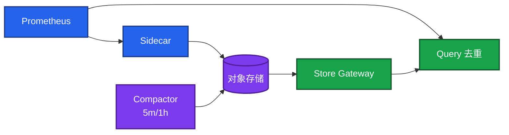
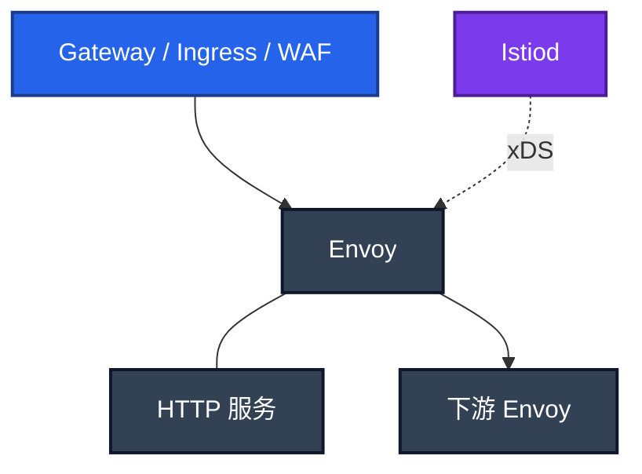
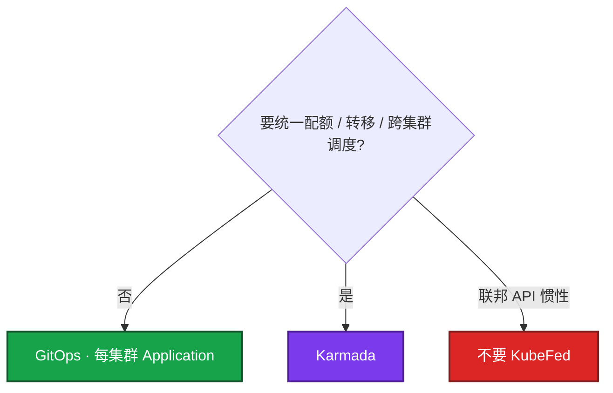
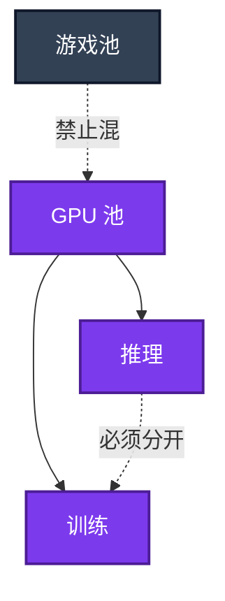

# 04｜大规模可靠性架构 · 练习题

先自己画图或口述，再对照解答。每题标了覆盖范围：

| 标记 | 含义 |
|------|------|
| **核心** | 不懂整章就没建立起来 |
| **必会** | 值班和面试都要能讲 |
| **常用** | 线上会反复碰到 |
| **常考** | 白板和追问的高频口径 |

## 本题目录

- [Q1 Thanos 管线](#q1)
- [Q2 高基数 / 一万 Pod / vs VM](#q2)
- [Q3 Istio 控制面数据面](#q3)
- [Q4 sidecar 成本与盲区](#q4)
- [Q5 GitOps vs Karmada](#q5)
- [Q6 跨集群难在哪](#q6)
- [Q7 游戏控制器阶梯](#q7)
- [Q8 OpenKruise / GameServerSet](#q8)
- [Q9 GPU 池与隔离](#q9)
- [Q10 什么时候不该上](#q10)
- [Q11 架构面怎么开口](#q11)
- [合上书](#合上书)

---

## Q1

**★★★★★｜画出 Thanos 管线。各组件干什么？没有 Compactor？**

**覆盖**：核心 · 必会 · 常考

### 场景

白板：「Prometheus + Thanos。」有人只写「Sidecar 上传 S3」。面试官问 Compactor 和 downsample。简历写精通，生产其实是 VictoriaMetrics。

### 完整解答

Sidecar 随 Prometheus，把封好的 **2h block** 上传对象存储。Store Gateway 查历史 block。Query 联邦在线 Prom + Store，对 HA 副本 **去重**。Compactor 在对象存储里 **compact + downsample（5m / 1h）**。Query Frontend 可选（拆查询、缓存）。Receiver 是 remote-write 汇聚，和 Sidecar **二选一思路**。Ruler 可选。

没有 Compactor：小 block 堆满桶，Store 扫不动，没有降采样，**长期又贵又慢**。

### 再追问

- Sidecar 是实时倒 WAL？——否。封好的 2h block。
- Query 不去重？——HA 双拉曲线翻倍。
- Receiver 和 Sidecar 一起灌？——不要。二选一。

---

## Q2

**★★★★★｜一万 Pod 监控怎么拆？Thanos 能救高基数吗？何时 VM？**

**覆盖**：核心 · 必会 · 常考

### 场景

有人给登录接口加 `http_requests_total{user_id=...}`。Prometheus OOM。有人说上 Thanos 就能扛。另一人要把一台 Prom 刮一万 Pod。

### 完整解答

高基数 **先炸 Prometheus ingest**。Thanos 只是把已经爆炸的 block 搬进对象存储，Query 更慢。先 drop relabel、禁止 `user_id` / `pod_ip`，id 进日志和 Trace。Recording rule 降查询负载，**不降已经炸了的 ingest**。操作细节 → 04-18。

一万 Pod：按 **集群 / 团队分片** Prometheus，不要一台扛全站。HA 双拉 + replica label。软上限大约 **200 万 series / 实例**。

vs VM：已有 Prom、要 **全球查对象存储** → Thanos。想 **少组件、高写入** → VictoriaMetrics。远程存储解决留存和全局查询，**不解决**乱打 label。

### 再追问

- 只加内存？——缓冲，不是根治。
- 单集群 30 天够、没有全球查？——本地 TSDB + HA 即可，不必先上 Thanos。

---

## Q3

**★★★★★｜Istio：谁是控制面、谁转发？南北向还是东西向？怎么注入？**

**覆盖**：核心 · 必会 · 常考

### 场景

白板画「上网格」。有人把 Istio 画成入口，开始背 VirtualService YAML。面试官问 xDS 和注入开关。

### 完整解答

**Istiod** 控制面，把路由/证书编译成 **xDS** 下发。**Envoy sidecar** 数据面，真正转发。注入：Namespace `istio-injection=enabled`，或 Pod 注解 `sidecar.istio.io/inject: "true"`。

能力：超时、重试、mTLS、东西向金丝雀。南北向入口仍是 **Gateway / Ingress**（14）。网格是东西向增强，不是把入口换成一份 CR。

本章不写 YAML cookbook。灰度切流量细节 → 14 / 15。

### 再追问

- 必须上 Istio 才能限流？——否。入口 + SDK + 开关已覆盖大部分（14）。
- Cilium / Ambient？——减 sidecar 的方向，细节 → 04-23。

---

## Q4

**★★★★★｜sidecar 为什么贵？战斗服注不注？Egress 和 VirtualService 盲区？**

**覆盖**：核心 · 必会 · 常考

### 场景

一万 Pod 全开 `istio-injection=enabled`。战斗 Tick P99 毛刺，Istiod CPU 打满。支付出现双发。有人说 VirtualService 已经鉴权了。

### 完整解答

每 Pod **+CPU / 内存**，进出各 **多一跳**。一万 sidecar 是一万个 Envoy；**Istiod 也是容量题**。游戏 **有状态战斗服默认不要 sidecar**；大厅 / 支付 HTTP 可以分批考虑。

盲区（面试官爱问）：

| 点 | 口径 |
|----|------|
| **Egress Gateway** | 管出站：三方、支付回调，统一出口 |
| **VirtualService** | 路由。**不替代**入口鉴权 / WAF |
| 支付 POST 默认重试 | 非幂等会 **双发** |

减 sidecar：Cilium sidecarless / Istio Ambient → 04-23。不要给战斗服做网格实验。

### 再追问

- 全注入再给 Istiod 扩容？——先停战斗 NS 注入，不是先加核当默认。
- 有了 VS 出站就安全？——否。出站看 Egress 和策略。

---

## Q5

**★★★★★｜多集群：GitOps、KubeFed、Karmada 怎么选？**

**覆盖**：核心 · 必会 · 常考

### 场景

「我们要多集群。」有人开口 Karmada，有人把 KubeFed 当现行方案。Git 里已经有 Argo，每套环境一份 overlay。

### 完整解答

三种：

1. **GitOps 多目标**：Argo `Application` **每集群一份**（可用 ApplicationSet）。集群独立，配置即真相。
2. **旧 Federation / KubeFed**：**不要当作现行方案。**
3. **Karmada**：控制面 + member。`PropagationPolicy` 分发，`OverridePolicy` 做副本数/镜像/环境差异。

选型：集群独立、Git 是真相 → **GitOps**。真要统一配额、故障转移、跨集群调度 → 才上 **Karmada**。为了「看起来像一个集群」上控制面，会把网络问题藏进去。

多云名字对照 → 07-04。出海 region → 08-10。GitOps sync 操作 → 04-22。

### 再追问

- ApplicationSet 误删目录？——可能删 App 再 prune（04-22）。生产删目录两人 review。
- Karmada 控制面挂了？——member 本地变更还能否做，要提前设计；GitOps 保底。

---

## Q6

**★★★★☆｜多集群难的是 CR 名字吗？**

**覆盖**：必会 · 常考

### 场景

候选人把 `PropagationPolicy` 背得很熟。面试官问：集群 B 里的 Service 怎么被集群 A 的大厅访问？证书和身份呢？

### 完整解答

难的是 **跨集群网络和身份**，不是 CR 名字。Service 跨集群要 MCS / 多集群 DNS / 专线 / 统一入口之一；工作负载身份、OIDC、成员证书要对齐。CR 只会把对象送过去，**送过去不等于调用通**。

先把每个集群当独立故障域跑稳（GitOps）。网络没打通就上 Karmada，故障会表现为「策略已传播、流量 超时」。

### 再追问

- 出海两个 region 用 Karmada 做流量双活？——游戏通常不做流量双活（07-04 / 08-10）。数据驻留和延迟先认物理。

---

## Q7

**★★★★★｜战斗服为什么不是 Deployment？STS 够不够？**

**覆盖**：核心 · 必会 · 常考

### 场景

公会战，有人把战斗写成 Deployment，`maxUnavailable=25%`，`kubectl rollout restart`。另有人说换了 StatefulSet 就能热更。

### 完整解答

**Deployment 无身份**，副本可互换，滚动新建再删，**房间在内存里就没了**。Web 的 unavailable 公式不能抄到战斗服（08-01、04-05）。

**StatefulSet** 有序号、Headless DNS、盘。滚动 **仍按序杀进程**。它解决名/盘/DNS，**不是游戏热更**。热更协议 → 08-03。有状态发布：先摘流，再动进程。

阶梯：Deploy（大厅）→ STS（要稳定 ID）→ OpenKruise（原地 / sidecar 独立升）→ `GameServerSet`（房间级策略，做过再生写）。

### 再追问

- PDB 能挡住滚动杀房间吗？——PDB 拦自愿中断，拦不住你自己的 RollingUpdate 公式。先摘流。

---

## Q8

**★★★★☆｜OpenKruise 解决什么？GameServerSet 没做过怎么讲？**

**覆盖**：必会 · 常考

### 场景

简历「精通 KruiseGame」。面试官问原地升级还保不保内存对局、SidecarSet 和主容器生命周期、GameServerSet 的网络身份。

### 完整解答

OpenKruise：**原地升级**（尽量保留 Pod 网络身份，换镜像）、**SidecarSet** 独立升日志/网格 sidecar、**AdvancedStatefulSet** 补原生 STS 不好做的不可用度 / 原地。仍要摘流——原地换容器也会重启进程，**不替代房间协议**。

KruiseGame / **`GameServerSet`**：游戏服集合、网络身份、更新策略对准房间（没人再删、等待对局）。**没 Owner 过生产，不要简历写精通。** 白板可以说「我会按 STS + 摘流设计，GSS 的价值是房间级更新和网络身份」，把边界讲清。

### 再追问

- 只升 Envoy 不碰战斗主容器？——这是 SidecarSet 的点；战斗 NS 更不该有 Envoy。
- Operator 和解循环？——回 04-20，本章不展开。

---

## Q9

**★★★★★｜GPU：谁上报 `nvidia.com/gpu`？三池怎么拆？MIG / vGPU / 时间切片？**

**覆盖**：核心 · 必会 · 常考

### 场景

推理 Pending。有人要删大厅 Deployment「把卡腾出来」。训练和在线推理同一批 GPU 节点。活动日用时间切片硬塞两个模型。有人开口自研 scheduler。

### 完整解答

NVIDIA **Device Plugin** 上报扩展资源 **`nvidia.com/gpu`**。删大厅腾不出卡——卡不在游戏池。

三池：**游戏 CPU 池、推理 GPU 池、训练 GPU 池**。不要和战斗服混节点。训练打满会饿死在线 SLO。

隔离粒度（面试要能说这句，不背一个云厂商名当全部）：**算力 / 显存是否硬隔离。**

| 方式 | 口径 |
|------|------|
| 时间切片 | 通常 **不硬隔离** 显存；测试可以，活动推理不要 |
| **MIG** | 硬件实例，算力/显存硬隔离 |
| 云厂商 **vGPU** | 产品名不同；问清显存是否硬隔离、算力是否共享 |

生产先 **污点 + nodeSelector**。自研 scheduler 是加分项不是默认。显存账、TTFT、vLLM → 09-08。闲置成本 → 07-06、10-02。

### 再追问

- HPA 按 CPU 扩推理？——GPU 100% 时 CPU 仍可能很低，扩错信号（09-08）。
- 自定义调度什么时候加分？——已经有队列、抢占、公平共享需求；不是空白集群的第一步。

---

## Q10

**★★★★☆｜给出现象，你说该上还是不该上？**

**覆盖**：必会 · 常用 · 常考

### 场景

四句话：① 高基数没治先上 Thanos ② 一万战斗服全注入 ③ 多集群默认 Karmada ④ GPU 和战斗混节点省钱。

### 完整解答

| # | 该不该 | 口径 |
|---|--------|------|
| ① | **不该** | 先停 ingest；Thanos 救不了基数。上 Thanos 还要 **Compactor** |
| ② | **不该** | sidecar 成本 + Istiod 容量；战斗默认不注入 |
| ③ | **不该当默认** | 独立配置先 GitOps；要统一调度才 Karmada；KubeFed 不现行 |
| ④ | **不该** | 故障域绑死；训练/推理还要再拆 |

每引入一个系统：解决什么、引入什么故障域、不选它的条件。不该上比该上更常考。

### 再追问

Sidecar 和 Receiver 双开？——不要双灌。支付网格默认重试？——非幂等会双发。STS 当热更？——仍杀进程。

---

## Q11

**★★★★☆｜架构面开口怎么讲？画一张「一万 Pod 可靠性」不要堆组件。**

**覆盖**：核心 · 必会 · 常考

### 场景

45 分钟白板。候选人第一分钟画出 Istio + Thanos + Karmada + 自研 GPU 调度 + GameServerSet。面试官改口：「我们 3 个集群、已有 Prometheus 和 Argo，战斗服 C++ 长连接。」图没法改。

### 完整解答

先约束再画图再取舍。开口只问：

1. **规模**：集群数、Pod 数、要不要全球查。
2. **SLO**：查询延迟、网格 P99、战斗 Tick、推理 TTFT。
3. **团队**：谁 Owner 对象存储 / 证书 / 多集群网。
4. **已有栈**：Prom？Argo？云网格？

对已有 Prom + Argo、3 集群、C++ 战斗的合理取舍：**分片 Prometheus → 需要全球历史再 Thanos（带 Compactor）**；**GitOps 每集群 Application，不上 Karmada**；**战斗不注入，大厅 HTTP 才评估网格**；**游戏池 / GPU 池拆开，调度先污点**；战斗控制器讲 STS + 摘流，不装精通 GSS。

每引入一个框讲三句：解决什么、引入什么故障域、不选它的条件。对方改数字，你改图。

### 再追问

功能堆组件只算及格。主动说 **不选什么** 才像高级。操作细节被追问，指回 04 / 07 / 08 / 09，不要在白板上 helm。

---

## 合上书

- [ ] 能画出 Thanos：Sidecar / Store / Query / Compactor；没有 Compactor 又贵又慢
- [ ] 能说高基数先炸 ingest；一万 Pod 分片；Thanos vs VM
- [ ] 能画出 Istiod xDS + Envoy；注入标签；南北向 vs 东西向
- [ ] 能讲 sidecar 成本、战斗服默认不注入、Egress、VS ≠ WAF
- [ ] 能选 GitOps 多目标 vs Karmada；KubeFed 不现行；难的是网络和身份
- [ ] 能讲 Deploy / STS / OpenKruise / GameServerSet 各保证什么；没做过不写精通
- [ ] 能讲 `nvidia.com/gpu`、三池、MIG/vGPU/时间切片的隔离粒度；先污点不是自研调度
- [ ] 能用反模式表判断不该上；开口先问规模 / SLO / 团队 / 已有栈
