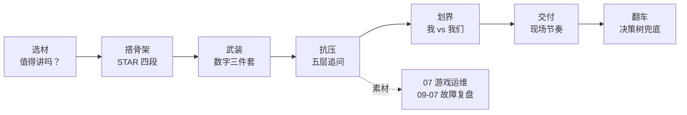
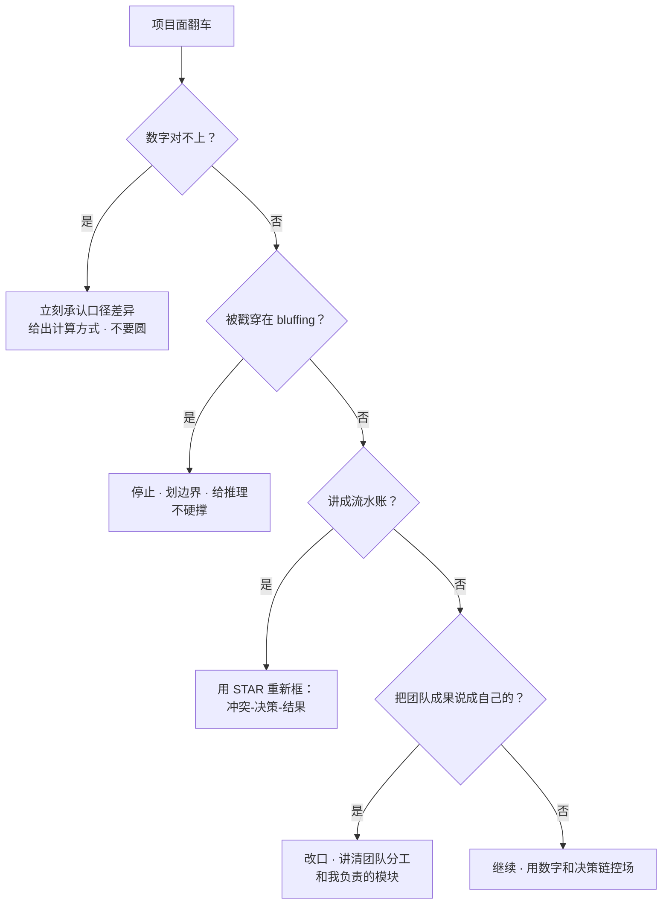

# STAR 项目话术

> 面试官说「介绍一个你最有成就感的项目」，你讲了十分钟，他追问五层后你发现：数字对不上、边界说不清、功劳分不清。旁边有人喊「再多讲技术细节」「按时间线从头来」「全说我们团队」——三句都不对。
> **本章回答**：怎么把项目故事讲成有深度、有数字、有反思的 STAR 叙事，让面试官每层追问都有落点。
> **不讲**：具体技术细节 → 各技术章；系统设计答题框架 → [02](../02-系统设计答题框架/)、[03](../03-游戏SRE系统设计实战/)；行为面通用题 → [04](../04-自我介绍与行为面/)；红线与不会题 → [05](../05-谈薪与红线/)。

**标记**：🎯重点 · 🔥难点 · ⭐常考 · 🔧实操
---

## 一、一张图：一个项目故事在面试中的一生

> 🎯 **一句话**：面试官不是想听你做过什么，而是借项目测你能不能讲清「为什么这样选、怎么量化、出了问题怎么办」。



- 📖 **读图**
  - 🛤️ 主线：选材 → 骨架 → 数字 → 五层追问 → 划界 → 交付 → 翻车
  - 🎣 卡在哪一段决定掉哪分：选材空 → 没得聊；数字虚 → L4 穿；划界糊 → 品格扣分

> ⚠️ **别混**：STAR 不是「按 S-T-A-R 顺序背答案」的模板，而是让故事有起承转合的结构。生套模板、按时间线流水账背，第三层追问就会露馅。

本节对应练习题 Q1、Q14。主线有了——先谈选材。

---

## 二、选材：什么故事值得讲

> 🎯 **一句话**：值得讲的故事必须同时满足三条——有技术深度、有业务结果、你是主导或核心执行。

### 📏 选材三标准 ⭐

- 🧠 **有技术深度**：故事里至少有一处需要你**做判断、做取舍**（不是造轮子）
  - 开服压测模型和线上对不上，你怎么修正
  - MySQL 主从延迟导致回退，你怎么兜底
  - K8s 滚动时战斗服不能集体重启，你怎么保状态
- 📈 **有业务结果**：运维项目最易讲成「我搭了监控」——不讲结果等于没讲
  - 开服成功率 92% → 99.5%；MTTR 40 分钟 → 8 分钟
  - 版本发布 4 小时 → 35 分钟；回滚人工 30 分钟 → 一键 90 秒
- 🧭 **你是主导或核心执行**：方案你提 / 关键模块你负责 / 数字你牵头 / 复盘你主写
  - 「参与了一个大项目」只能当陪衬，撑不起主故事

> 📝 **面试**：选项目前三把尺——「我有没有做关键判断？」「业务指标变好了多少？」「没我这件事会不会卡壳？」至少两问能答，才值得讲。⭐

### 🍱 3 个故事组合策略 🔥

资深 SRE 通常备 **3 个项目故事**，撑三种能力画像：

```text
故事一：一个大项目撑深度（体系/架构/从 0 到 1）
        → 系统设计、全局把控、长期建设
故事二：一次故障/应急撑临场（止血/根因/治理）
        → 压力判断、快速恢复、复盘闭环
故事三：一个优化/建设撑主动（提效/降本/质量）
        → 问题嗅觉、推动力、数据意识
```

- 🏔️ **故事一要够深**：游戏服上 K8s、监控体系重建、开服自动化、发布系统重构——能连问五层
- ⚡ **故事二要够险**：发现时间、止血、根因、治理、防再犯——重点是**你做了什么判断**，不是敲了什么命令
- 🔬 **故事三要够细**：checklist 47→9 步、告警 noisy 70%→12%、灰度改成门禁自动化

> 💡 **打个比方**：三个故事像三顿饭。故事一是主菜撑场面；故事二是汤看火候；故事三是小菜看出品习惯。三顿都有，画像才立体。

#### ❓ 为什么不能只讲一个「最大的项目」？

- ❌ **只讲一个大项目**：面试官只能看到一种能力切片——建设力有了，临场和主动嗅觉空白
- ❌ **三个全是成功建设**：缺故障与失败，显得不真实，L5 复盘无处落脚
- ✅ **深度 + 临场 + 主动**：三种压力源各备一则，五层追问才有素材库可调

### 🚫 反面教材

- 流水账：「公司让我上 K8s，我就上了，后来能用了」——无冲突、无取舍、无数字
- 纯执行：「让我扩容 100 台，我扩了」——只有执行，没有判断
- 技术炫技：「上了很新的 Service Mesh」——说不清为什么、收益、坑
- 太大而空：「我负责整个游戏稳定性」——无模块、无边界、没法追问

> ⚠️ **别混**：项目大 ≠ 你厉害。面试官要的是你在大项目中的**具体切片**。

口诀：**「有深度、有结果、你是核心」**。练习题 Q1、Q2、Q12。材选好了，搭 STAR。

---

## 三、搭骨架：STAR 各段职责与时长配比

> 🎯 **一句话**：Situation 给背景、Task 给冲突、Action 给决策链、Result 给数字——四段职责不能串。

### 🧱 四段职责 ⭐

- **Situation（背景）**：面试官理解故事所需的最小上下文——哪项目、什么业务、处在什么阶段；不铺公司史
- **Task（任务/冲突）**：你要解决什么、约束是什么——故事的钩子
  - 好例：「开服自动化从 0 到 1，每天开 N 组服、失败 5 分钟内可回滚」
  - 坏例：「后来项目组想上 K8s」（无张力）
- **Action（行动）**：故事的肉身，≥ 50% 时长；按**决策链**讲，不按时间线流水账
  - 「我先做了 X 而不是 Y，因为约束是 Z」
  - 「团队有过分歧，我主张 A，原因是 B」
- **Result（结果）**：必须有数字——业务结果（MTTR、成功率）+ 工程结果（自动化率、人效）

### ⏱️ 时长配比 🔥

| 段落 | 建议占比 | 核心职责 |
|------|----------|----------|
| S + T | ≤ 30% | 入戏，不抢戏 |
| A | ≥ 50% | 判断、取舍、执行 |
| R | 必须有数字 | 证明价值 |

- 5 分钟版：S+T ≤ 1 分钟，A 讲 2.5–3 分钟，R 30 秒～1 分钟
- 2 分钟版：S+T 合并一句，A 讲 1 分钟，R 一句数字收尾

> 📝 **面试**：讲完 S+T 用过渡句拉进 Action：「背景说完，真正难的是下面三个决策点。」暗示重点，帮面试官跟上节奏。⭐

#### ❓ 为什么 A 不能按时间线流水账？

- ❌ **时间线**：「周一学了 K8s，周三写了 YAML，周五上了线」——面试官听不到判断
- ✅ **决策链**：「先迁无状态网关 → 再 StatefulSet 迁战斗服 → 最后补回滚」——每步带约束与取舍
- 🎯 面试官要听的是**思考**，不是项目文档的 changelog

### 🎭 反面骨架对照

```text
❌ 旧讲法：
「我在上一家公司做运维。后来想上 K8s，我就去学了，写了 YAML，
部署了服务，搞了监控。现在挺稳定。」

✅ 新讲法：
「我负责 XX 从 0 到 1 上 K8s（S）。难点是有状态战斗服不能按
Deployment 随便滚动，且两周内上线不能影响现有区服（T）。
方案分三期：先迁无状态网关与配置中心；再用 StatefulSet + 本地盘
+ Pod 管理 ID 迁战斗服；最后补发布流水线与回滚（A）。
3 个月完成 12 区服平滑迁移，发布失败率 15%→1.2%，滚动 0 掉线（R）。」
```

> ⚠️ **别混**：A 不是「我做了什么」的清单，而是「我做了什么判断」的链条。

口诀：**「A = 决策链，不是 TODO 列表」**。练习题 Q3、Q4。骨架有了，武装数字。

---

## 四、武装：数字三件套脱口而出

> 🎯 **一句话**：故事能不能顶住追问，关键看你能不能在三秒内说出三类数字：规模、难度、结果。

### 📐 规模 · 难度 · 结果 ⭐

- 📏 **规模**（这事有多大）——校准经验等级
  - 并发：峰值 QPS、CCU、DAU、区服数
  - 机器：物理机/VM/Pod、集群、跨可用区
  - 数据：总量、日增、备份窗口、日志量
  - 口径例：「峰值 CCU 12 万，36 区服，华东两可用区」
- 🧱 **难度**（这事为什么难）——从「量大」变成「有挑战」
  - 时间：两周内上线、春节活动前必须完成
  - 业务：不能停服、不能丢数据、不能影响充值
  - 资源：预算只够 60%、不能加人、跨部门协调
  - 口径例：「迁移必须在两周年庆前完成，期间区服不能停机」
- 🏁 **结果**（从 X 到 Y）——最好成对出现
  - 速度：MTTR 40→8 分钟；发布 4 小时→35 分钟
  - 稳定：月故障 7→1.5 次；开服成功率 92%→99.5%
  - 效率/成本：开服人效 2→0.3 人日/服；机器成本 −30%

> 📝 **面试**：只说「降到 8 分钟」没体感；说「从 40 分钟降到 8 分钟」才有冲击力。⭐

### 🔬 每个数字都要能答「怎么算的」🔥

面试官会追：「MTTR 怎么定义？」「QPS 是业务还是接口？」「成功率怎么统计？」

每个数字带三个元数据：

```text
定义：指标叫什么、口径是什么
采集：日志 / 监控 / 数据库 / 手工统计
计算：分子分母、时间窗口、是否去重
```

- 例 MTTR：「从告警发出到服务恢复」；分子=每次恢复时间，分母=故障次数；PagerDuty + 监控，6 个月，去变更窗口小波动
- 例开服成功率：成功开服区服数 / 计划开服区服数；成功标准=「玩家可登录且核心玩法无报错」；由自动化最终健康检查判定

#### ❓ 为什么估算数字和实测数字不能混着说？

- 🧪 **压测算出来的容量** = 估算；**线上真实峰值** = 实测
- 💣 混着说 → L4 连问两层就崩：「你说峰值 4 万，监控里为什么只有 3.2 万？」
- ✅ 讲清边界：「压测按 3 万同时点击设计；线上业务层峰值实测 3.2 万，接口层 4.1 万（含网关合并）」

> ⚠️ **别混**：一个讲不清口径的数字，比没有数字还糟糕。

### 📋 数字准备清单 🔧

```text
规模：峰值 CCU / DAU / QPS / 区服数 / 机器数 / Pod 数 / 跨可用区数
难度：时间窗口 / 不能停服 / 预算上限 / 人力约束 / 历史债务
结果：从 X 到 Y 的 MTTR / 成功率 / 发布时长 / 人效 / 故障数 / 成本
每个后面跟一句：怎么算 / 怎么测
```

口诀：**「规模 / 难度 / 结果」**。练习题 Q5。数字外，扛追问。

---

## 五、抗压：五层追问推演

> 🎯 **一句话**：追问不是刁难，是确认「这个项目里哪些是你真正懂的」——提前把答案铺到第五层。

### 🪜 五层追问模型 ⭐🔥

```text
L1 做了什么 —— 项目目标和你的职责
L2 怎么做的 —— 关键步骤和技术选型
L3 为什么这么选 / 方案 B 为什么不选 —— 决策理由和 trade-off
L4 数字与细节验证 —— 指标口径、容量计算、故障现场
L5 重来一次怎么改 / 推广性 —— 复盘、反思、迁移能力
```

- L1–L2 = 基本功；L3 开始分层；L4–L5 决定定级
- 口诀：**「L3 看取舍，L4 看口径，L5 看复盘」**

#### ❓ 为什么卡在 L3「为什么不选 B」不等于被刁难？

- 🎭 很多人觉得「被刁难」——**错了**。他在确认哪一层是你真懂的
- ✅ L3 答得出 = 你做过判断；答不出 = 你只是执行清单
- 🧭 备法：每个关键决策提前写「选 A 的约束 + 排除 B 的原因 + trade-off」

### 🎮 实例：开服排队治理被追五层 ⭐

素材可来自 [07-02](../../07-游戏运维专题/02-登录排队与选服/)、[07-03](../../07-游戏运维专题/03-活动高峰与压测/)、[07-06](../../07-游戏运维专题/06-开服合服/)。

- **L1**：负责新服开放时排队过长、部分玩家被卡掉；牵头排队策略优化与容量兜底（两个版本）
- **L2**：与策划对齐「高峰 5 分钟内进游转化 ≥ 85%」；三件事——动态放行（按登录服负载与 DB 连接池调速）、排队态从轮询改 WebSocket 推送、补「开服瞬间 3 万人同时点击」脉冲压测
- **L3**：不直接扩登录服——根因是 DB 写入热点，扩登录只会更快压垮 DB；不用「无限制放行+熔断」——策划要求优先付费体验；动态放行削平压力曲线并保留 VIP 通道
- **L4**：改造前排队 P99=9 分钟 → 后 2.5 分钟；放行调参周期 5 秒；VIP 占放行量 15%；**3 万是同时点击，不是同时在线**——在线峰值按 1.8 万设计
- **L5**：会更早介入压测模型（当初假设均匀进入，真实是脉冲，上线第一周微调两次）；适合同类 MMO 开服，不适合大逃杀「一局拉满」；脉冲系数做成可配置项

> 📝 **面试**：讲的时候只讲 L1–L2，面试官会自己问到 L3–L5；你提前备好，眼神和语速都会更稳。⭐

### 🎯 追问常见落点

每个项目故事提前备这六个词的答案：

```text
取舍：为什么不选另一个方案
挑战：当时最大的阻力是什么
冲突：团队内有没有分歧，你怎么推动
失败：有没有没做好的地方
复盘：上线后有没有反转，你怎么改的
主导：这件事没你会不会发生
```

练习题 Q7、Q8。抗压外，划「我 vs 我们」。

---

## 六、划界：我 vs 我们

> 🎯 **一句话**：贪功和隐身都扣分——面试官要的是「你在团队中的精确坐标」。

### 📍 按模块划界 ⭐

```text
团队层面：项目目标、整体方案、最终结果一起定
个人层面：我负责 X 模块；我提出的关键判断是 Y；我牵头拿到的数字是 Z
```

- 「整体方案团队一起定，我主要负责发布流水线：灰度策略和一键回滚」
- 「告警降噪想法是我提的，规则是值班同学一起梳；降噪率 70%→12% 是我牵头统计的」
- 「故障止血我主导切换与沟通；根因是研发+SRE 一起；复盘报告我主写」

> 📝 **面试**：背熟骨架——「**我负责 X 模块，方案是团队一起定的，关键数字是我牵头统计的。**」⭐

面试官问「是不是你一个人做的」是压力测试：

> 「不是。涉及运维、研发、测试、策划。我是运维侧负责人，具体负责容量评估、发布流程和故障预案。方案大家评审通过，执行层面的 timeline 和兜底是我主盯的。」

#### ❓ 为什么「主导」不等于「全是我干的」？

- ❌ 「这个项目全靠我」——除非真一人完成，否则不可信
- ❌ 「我们也没什么特别的」——那凭什么录用你
- ❌ 「我负责协调」——太虚，落不到模块和数字
- ✅ **主导** = 你推动了关键决策、承担了结果责任、掌握了关键数字

> ⚠️ **别混**：「主导」≠「全是我干的」。见上 ❓。

练习题 Q9、Q13。划界外，失败故事。

---

## 七、复盘：失败故事怎么讲

> 🎯 **一句话**：一个讲得好的失败故事，比十个吹上天的成功故事更能体现判断力。

### 💥 失败故事结构 ⭐🔥

结构必须是：

```text
失败 + 我判断错了什么 + 机制上怎么改的
```

- **第一步：失败是什么**（具体，不轻描淡写）
  - 「灰度 5% 没触发 bug，全量后 30 分钟内出现玩家数据回退」
- **第二步：我判断错了什么**（最难，也最想听）
  - 「灰度样本没覆盖跨天结算玩家」；「把『灰度没报错』当成『没有风险』，没坚持补数据一致性校验」
- **第三步：机制上怎么改**（不是「下次注意」）
  - 灰度样本覆盖所有付费档位与活跃时段；发布前加数据一致性 diff；全量拆两批，批间留 15 分钟观察——写进发布规范

> 📝 **面试**：收尾落在「机制上怎么改」，不是「我当时太年轻」。前者是系统思维，后者是情绪。⭐

### 🚫 不能讲的失败

- 责任全推给前同事/前公司 → 红线，见 [05](../05-谈薪与红线/)
- 还没解决、不知道怎么改 → 显得没复盘
- 太小：「有一次我迟到了」→ 浪费时间

练习题 Q6、Q10。失败外，现场节奏。

---

## 八、交付：现场节奏

> 🎯 **一句话**：现场表达不是临场发挥，而是提前备好 2 分钟版、5 分钟版和被打断后的接话点。

### 🎙️ 2 分钟版 vs 5 分钟版 ⭐

- **2 分钟版**（开场第一项目 / 时间紧）：一句背景 + 一句冲突 + 三个决策点 + 一句结果

> 「我负责把游戏服发布从 Perl 脚本重构为流水线（S）。旧系统失败率高、回滚慢、文档缺失（T）。三个判断：先不动旧脚本只在新服试点；发布拆成预检查/灰度/全量/回滚并加门禁；用 Ansible 做幂等（A）。失败率 15%→1.2%，回滚 30 分钟→90 秒（R）。」

- **5 分钟版**（「详细讲讲」）：在 2 分钟版上展开 L3–L5——每个决策为什么、方案 B、数字口径、重来怎么改

切换信号：

- 「简单介绍一下」/开场第一题 → 2 分钟版，留钩子
- 「详细讲讲」「为什么这样选」 → 5 分钟版
- 沉默或点头 → 继续当前版，随时准备被打断

> 📝 **面试**：2 分钟版不是 5 分钟版的加速版，而是只保留冲突、决策、结果的骨架版——两套都要单独练。⭐

### 🔌 被打断怎么接 🔧

- **追问型**：「为什么不用 Kubernetes？」→ 先肯定再答：「评估过；战斗服有状态绑本地盘，迁移成本高；先把无状态网关上 K8s，战斗服仍物理机+发布系统管」
- **提醒型**：「结果有没有数字？」→ 立刻给：「MTTR 40→8 分钟，口径是告警发出到服务恢复，周期 6 个月」
- **答完想继续**：问「接着刚才讲，还是先展开这个点？」

### 🛟 讲到不会怎么办 🔧

红线：不撒谎、不硬撑。标准话术 = **说边界 + 给推理**：

> 「这部分我当时没有直接参与。如果让我做，我会先查 X 再试 Y，但没实际落地过，不敢说一定最优。」

> 「这个细节我现在记不清了。但能说清当时为什么选这个方向：约束是 A，所以排除 B，最后选 C。」

详细红线见 [05](../05-谈薪与红线/)。

> 📝 **面试**：提前标记「灰色地带」——哪些数字确定、哪些只是参与、哪些不太熟。问到灰色地带时主动划界，比被戳穿体面一百倍。

练习题 Q9、Q10、Q11。节奏外——翻车急救。

---

## 九、翻车：常见翻车现场决策树

> 🎯 **一句话**：翻车根源不是项目不够好，而是故事没备好、数字没对齐、边界没划清。



- 📖 **读图**
  - 🚪 四条主根：数字对不上 / bluffing / 流水账 / 抢功
  - 🛠️ 四条动作：承认口径 → 停止划界 → 重框 STAR → 改口讲分工

### 🧯 四条现场剧本 🔧

- **数字对不上**：「刚才说 QPS 4 万，现在又说 3 万？」
  - → 不圆，立刻分口径：「4 万是接口层，3.2 万是业务逻辑层，中间有网关合并和缓存命中」
- **被戳穿 bluffing**：不熟处连追两层开始含糊
  - → 「这部分我没直接负责，不敢给确定答案。若推测，我会先看 X，因为……」
- **讲成流水账**：对方看手机 /「讲重点」
  - → 「我重新组织一下：核心冲突是 X，我做了 Y，结果是 Z」
- **抢功**：「方案具体谁提的？」答不上来
  - → 「整体方案团队评审定的，我主要落地 X。若让您觉得我做了全部，是我的表述问题」

> ⚠️ **别混**：翻车不可怕，可怕的是继续 bluffing。诚实和判断力，远高于多答对一个技术细节。

练习题 Q13、Q14。现在回开头那个现场。

---

**回到开头那个现场**：讲了十分钟，五层追问后数字对不上、边界说不清。正确剧本是：选材三标准 → STAR 时长配比 → 数字三件套能答口径 → L1～L5 提前铺好 → 「我 vs 我们」划清。

## 十、收口

### 话术速查 🔧

```text
开场：
  「我选这个项目讲，是因为它有技术取舍、有业务结果、我负责关键模块。」

讲 Action：
  「这里的关键判断是……」
  「当时有两个方案，我选 A 是因为……，没有选 B 是因为……」
  「这个 decision 的 trade-off 是……」

讲 Result：
  「结果是……，从 X 降到/提到 Y。」
  「这个数字的口径是……，计算方式是……」

被追问：
  「这是个好问题，我当时也是这么想的……」
  「这部分我没有直接参与，如果让我做我会先……」

收尾：
  「如果重来一次，我会在……阶段更早做……」
  「这个项目沉淀下来的机制/工具是……」
```

### 面试锚点

| 问 | 30 秒答 |
|----|---------|
| 介绍一个最有成就感的项目 | 项目名 + 冲突 + 我负责的模块 + 一个结果数字 |
| 你具体负责什么 | 我负责 X；方案团队一起定；数字我牵头统计 |
| 为什么选方案 A | 约束是什么；A 满足哪些；B 为什么被排除 |
| 数字怎么来的 | 指标定义 + 数据源 + 计算方式 + 时间窗口 |
| 如果重来怎么改 | 早期介入点 + 可配置/可推广项 + 机制改进 |
| 讲一个失败 | 失败 + 我判断错了什么 + 机制上怎么改的 |
| 团队里有分歧怎么办 | 先对齐目标；用数据和风险讲 trade-off；保留记录 |
| 上线后出问题了怎么办 | 止血第一；保留现场；定位根因；写复盘；改机制 |
| 和应聘岗位有什么关系 | 岗位需要的 X 能力，在这个项目里我练过 |
| 被打断怎么接 | 先回答问题；问是否继续；必要时重新框 STAR |
| 三个故事怎么搭配 | 深度（从 0 到 1）+ 临场（故障）+ 主动（优化） |
| 灰色地带怎么处理 | 提前标记不确定的数字和参与度；主动划界 |
| Action 讲多少 | ≥ 50%；S+T ≤ 30%；R 必须有数字 |

### 易错一句话对照

- 项目很大 = 我厉害 → 要讲清你的具体切片
- 我们团队很牛 → 面试官要听你的坐标
- 技术很先进 → 先进不重要，重要的是解决了什么问题
- 结果挺好 → 要有从 X 到 Y
- 我负责协调 → 太虚，落到模块和数字
- 这个项目很成功 → 没有失败故事显得不真实
- 失败是因为别人 → 违反红线，显得不反思
- 记不清数字 → 提前备好三类数字
- 我不会但我会学 → 要给推理，不是只表态
- 我们当时就那么做了 → 要讲为什么这样选
- 数字只说「降到 Y」→ 必须说「从 X 降到 Y」
- 三个故事全是成功 → 缺失败/故障显得不真实
- 失败讲完没机制改进 → 只讲了情绪没讲系统思维
- 只讲「我们」/只讲「我」→ 不知坐标 / 显得抢功
- 2 分钟版当 5 分钟加速版 → 骨架不同，要单独备

### 数字墙

> 项目故事至少备 3 个 · S+T ≤ 30% · A ≥ 50% · R 必须有数字 · 每个数字带定义/采集/计算 · 追问准备到 L5 · 失败故事 1 个 · 个人贡献话术 1 句 · 2 分钟版 + 5 分钟版各 1 套 · 灰色地带提前标记

### 口述模板

**【30 秒】**「选项目三标准：有技术取舍、有业务数字、我是核心执行。STAR——S 一句背景、T 一句冲突、A 决策链占 50%、R 必须有从 X 到 Y。每个数字能答口径：定义+采集+计算。五层追问备到 L5：做什么→怎么做→为什么选/不选 B→数字验证→重来怎么改。」

**【2 分钟】** 选材三标准 → STAR 骨架与时长 → 数字三件套（规模/难度/结果+口径）→ 五层追问 → 我 vs 我们 → 失败结构（失败+判断错在哪+机制怎么改）→ 2/5 分钟版切换 → 翻车四条退路。

**【常见追问】**

| 追问 | 答法 |
|------|------|
| 项目里你具体做了什么 | 按模块划界：我负责 X；方案团队定；数字我牵头 |
| 数字怎么算的 | 定义+数据源+计算方式+时间窗口 |
| 为什么不选方案 B | 讲约束+trade-off；不只说 B 不好 |
| 上线后出问题怎么办 | 止血第一+保留现场+定位根因+改机制 |
| 讲一个失败 | 失败+我判断错了什么+机制怎么改的 |

---

## 合上书

- [ ] **默画一节的图**：选材 → 搭骨架 → 武装 → 抗压 → 划界 → 交付 → 翻车
- [ ] **口述选材三标准**：有技术深度、有业务结果、你是主导或核心执行；3 个故事撑深度/临场/主动
- [ ] **口述 STAR 四段**：S 背景、T 冲突、A 决策链、R 数字；S+T≤30%、A≥50%
- [ ] **默背数字三件套**：规模 / 难度 / 结果；每个能说清定义/采集/计算
- [ ] **口述五层追问**：L1→L2→L3 取舍→L4 口径→L5 重来怎么改
- [ ] **演练开服排队实例**：从 L1 讲到 L5
- [ ] **口述我 vs 我们**：「我负责 X，方案团队定，数字我牵头」
- [ ] **口述失败结构**：失败 + 判断错了什么 + 机制怎么改
- [ ] **口述 2/5 分钟版**：能按面试官节奏切换
- [ ] **口述被打断接法**：先答 → 问是否继续 → 必要时重框 STAR
- [ ] **口述不会题**：说边界 + 给推理；不撒谎、不硬撑
- [ ] **默背翻车决策树**：数字对不上 / bluffing / 流水账 / 抢功各走哪条

下一章：[02 系统设计答题框架](../02-系统设计答题框架/)。素材库：[07-游戏运维专题](../../07-游戏运维专题/) · [09-07 故障管理与复盘](../../09-可观测性与SRE方法论/07-故障管理与复盘/)。
