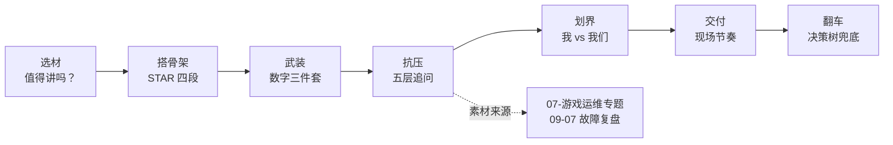
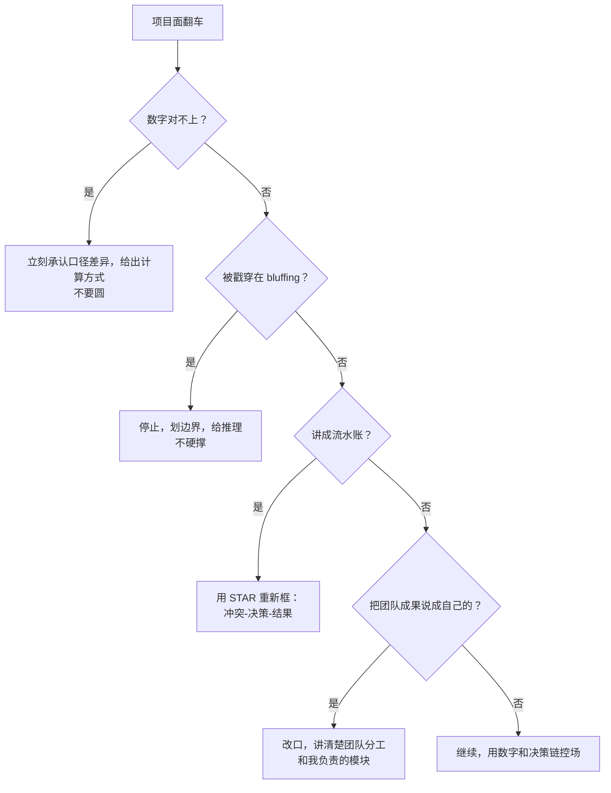

# STAR 项目话术

> 大家好，欢迎来到这次分享。开讲之前，先带大家回到一个很多同学都经历过的现场：
> 面试官说「介绍一个你最有成就感的项目」，你讲了十分钟，他追问五层后你发现：数字对不上、边界说不清、功劳分不清。
> 这一章讲完，你会知道那十分钟为什么被五层追问打穿，以及 STAR 该怎么提前铺到第五层。
> **本章回答**：怎么把项目故事讲成有深度、有数字、有反思的 STAR 叙事，让面试官每层追问都有落点。
> **不讲**：具体技术细节 → 各技术章；系统设计题答题框架 → [02](../02-系统设计答题框架/)、[03](../03-游戏SRE系统设计实战/)；行为面通用题 → [04](../04-自我介绍与行为面/)；红线与不会题的应对 → [05](../05-谈薪与红线/)。这些都有专门的章节，本章只在用到时点到为止。

**标记**：🎯重点 · 🔥难点 · ⭐常考 · 🔧实操

**怎么听这场分享**：咱们先看第一节「一个项目故事在面试中的一生」，把选材 → STAR 骨架 → 数字武装 → 五层追问 → 划界 → 交付装进脑子；后面用开服排队实例把 L1～L5 走一遍；翻车节拆数字对不上、流水账、抢功。每一节讲完都会提示对应练习题。

---

## 一、一张图：一个项目故事在面试中的一生

> 🎯 **一句话**：面试官不是想听你做过什么，而是想借你的项目，测试你能不能讲清「为什么这样选、怎么量化的、出了问题怎么办」。



**读图**：主线是一个项目故事从被选出来、到讲完、到被追问的完整生命周期。每个阶段都是面试真实会考的：选材决定有没有得聊，骨架决定讲不讲得清，数字决定深不深得下去，五层追问决定能不能顶住压力，划界决定品格分，现场节奏决定你能不能控场。

> ⚠️ **别混**：STAR 不是「按 S-T-A-R 顺序背答案」的模板，而是**让故事有起承转合的结构**。生套模板、按时间线流水账背，面试官会在第三层追问就让你露馅。


练习题 Q1、Q14。主线有了——先谈选材。

---

## 二、选材：什么故事值得讲

> 🎯 **一句话**：值得讲的故事必须同时满足三条——有技术深度、有业务结果、你是主导或核心执行。

### 选材三标准 ⭐

面试现场常见的错误选材有两种：一种是「技术有亮点但说不出业务价值」，另一种是「项目很大但只当了螺丝钉」。两条都扣分。

**标准一：有技术深度**。不是要你造轮子，而是故事里至少有一处需要你**做判断、做取舍**。例如：开服高峰时压测模型和线上对不上，你怎么修正；MySQL 主从延迟导致玩家数据回退，你怎么设计兜底；K8s 滚动更新时战斗服不能集体重启，你怎么保状态。

**标准二：有业务结果**。运维项目最容易讲成「我搭了监控、我做了发布系统」，但不讲业务结果等于没讲。结果可以是：开服成功率从 92% 提到 99.5%；故障 MTTR 从 40 分钟降到 8 分钟；版本发布时间从 4 小时缩到 35 分钟；发布失败回滚从人工 30 分钟到一键 90 秒。

**标准三：你是主导或核心执行**。核心执行的意思是：方案是你提的、关键模块是你负责的、数字是你牵头统计的、复盘是你主写的。如果只是「参与了一个大项目」，那这个故事只能当陪衬。

> 📝 **面试**：选项目前先用三把尺卡一下——「这个项目里我有没有做关键判断？」「业务指标变好了多少？」「没我这件事会不会卡壳？」三问至少两问能答，才值得讲。

### 3 个故事组合策略 🔥

资深 SRE 岗位通常要求准备 **3 个项目故事**，分别撑起三种能力画像：

```text
故事一：一个大项目撑深度（体系/架构/从 0 到 1）
        → 体现系统设计、全局把控、长期建设
故事二：一次故障/应急撑临场（止血/根因/治理）
        → 体现压力判断、快速恢复、复盘闭环
故事三：一个优化/建设撑主动（提效/降本/质量改进）
        → 体现问题嗅觉、推动力、数据意识
```

**故事一要够深**。最好是从 0 到 1 的建设：游戏服上 K8s、监控告警体系重建、开服自动化平台、发布系统重构。这类故事能让面试官连问五层：为什么选这个架构？容量怎么估？失败场景怎么设计？推广时遇到什么阻力？

**故事二要够险**。故障故事是最能体现 SRE 现场能力的素材。要讲清楚：发现时间、止血动作、根因定位、治理动作、防止再犯的机制。重点是**你做了什么判断**，而不是你敲了什么命令。

**故事三要够细**。优化类故事适合展示数据敏感度和推动力。比如：把开服 checklist 从 47 步砍到 9 步、把告警 noisy 率从 70% 降到 12%、把灰度发布从人工审批改成自动化门禁。

> 💡 **打个比方**：三个故事像三顿饭。故事一是主菜，撑场面；故事二是汤，看火候和应急；故事三是小菜，看出品细节和习惯。三顿都有，面试官对你的画像才立体。

### 反面教材

- **流水账项目**：「公司让我上 K8s，我就上了，后来能用了。」——没有冲突、没有取舍、没有数字。
- **纯执行项目**：「需求方让我扩容 100 台机器，我扩了。」——只体现执行力，不体现判断。
- **技术炫技型**：「我用了一种很新的 Service Mesh。」——但说不清为什么要用、业务收益是什么、有没有坑。
- **太大而空的项目**：「我负责整个游戏稳定性。」——没有具体模块、没有边界、没法追问。

> ⚠️ **别混**：项目大 ≠ 你厉害。面试官要的是你在大项目中的**具体切片**。


口诀：**「有深度、有结果、你是核心」**。练习题 Q1、Q2。材选好了，搭 STAR。

---

## 三、搭骨架：STAR 各段职责与时长配比

> 🎯 **一句话**：Situation 给背景、Task 给冲突、Action 给决策链、Result 给数字——四段职责不能串。

### 四段职责 ⭐

**Situation（背景）**：只讲面试官理解这个故事所需的最小上下文。一句话：「这是哪个项目、什么业务、当时处在什么阶段」。不要铺陈公司历史、组织架构、行业背景。

**Task（任务/冲突）**：讲清楚你要解决什么问题、约束条件是什么。这是故事的钩子。好的 Task 自带张力：「开服自动化从 0 到 1，要求每天能开 N 组服、失败 5 分钟内可回滚」「一次充值链路抖动，玩家重复扣款，要在不影响线上服务的前提下止血并定位」。

**Action（行动）**：这是故事的肉身，占 50% 以上时长。要按**决策链**讲，不要按时间线流水账。每个关键动作都要带理由：「我先做了 X，而不是 Y，因为当时约束是 Z」「这里我们团队有过分歧，我主张 A，原因是 B」。

**Result（结果）**：必须有数字。如果没有量化结果，Action 就是自嗨。结果分两类：**业务结果**（MTTR、成功率、发布时长、故障数）和**工程结果**（覆盖率、自动化率、人效提升）。

### 时长配比 🔥

| 段落 | 建议占比 | 核心职责 |
|------|----------|----------|
| S + T | ≤ 30% | 让面试官入戏，不抢戏 |
| A | ≥ 50% | 展示判断、取舍、执行 |
| R | 必须有数字 | 证明价值，收尾有力 |

这意味着 5 分钟版本里，S+T 控制在 1 分钟内，A 讲 2.5–3 分钟，R 讲 30 秒到 1 分钟。2 分钟版本里，S+T 合并成一句，A 讲 1 分钟，R 一句数字收尾。

🔥 高频错答：把 S 讲成公司介绍、把 A 讲成流水账。大白话：**背景短、决策长、结果必须有数**。

> 📝 **面试**：讲完 S+T 后，用一句过渡语把面试官拉进 Action：「背景说完，真正难的是下面三个决策点。」这能暗示你接下来要讲重点，也能帮面试官跟上节奏。

### 一个反面骨架

```text
错误：旧讲法：
「我当时在上一家公司，公司做 SLG 手游，我负责运维。后来项目组想上 K8s，
我就去学了 K8s，然后写了 YAML，部署了服务，搞了监控。现在服务跑着挺稳定的。」

✅ 新讲法：
「我负责 XX 项目从 0 到 1 上 K8s（S）。难点是有状态战斗服不能按 Deployment
随便滚动，而项目组希望两周内完成上线且不能影响现有区服（T）。
我的方案是分三期：第一期只迁移无状态网关和配置中心，第二期用 StatefulSet
+ 本地盘 + Pod 管理 ID 迁移战斗服，第三期补全发布流水线和回滚（A，按决策讲）。
结果是 3 个月内完成 12 个区服平滑迁移，发布失败率从 15% 降到 1.2%，
滚动更新时 0 掉线（R）。」
```

> ⚠️ **别混**：STAR 里的 A 不是「我做了什么」的清单，而是「我做了什么判断」的链条。面试官要听的是你的思考，不是项目文档。

口诀：**「A = 决策链，不是 TODO 列表」**。


⭐ S+T≤30%、A≥50%。练习题 Q3、Q4。骨架有了，武装数字。

---

## 四、武装：数字三件套脱口而出

> 🎯 **一句话**：项目故事能不能顶住追问，关键看你能不能在三秒内说出三类数字：规模、难度、结果。

### 规模数字

规模数字回答「这事有多大」。面试官用它校准你的经验等级。

```text
并发规模：峰值 QPS、CCU、DAU、区服数、同时在线房间数
机器规模：物理机/虚拟机/Pod 数量、集群数、跨可用区/区域数
数据规模：数据总量、日增量、备份窗口、日志量、告警量
流程规模：发布频次、变更单量、值班人天、故障单量
```

示例口径：
- 「峰值 CCU 12 万，共 36 个区服，部署在阿里云华东两个可用区。」
- 「网关层峰值 QPS 4.2 万，入口带宽 8Gbps。」
- 「日活 80 万，每天产生 12TB 日志， Prometheus 时序约 450 万条。」

### 难度数字

难度数字回答「这事为什么难」。它让你的项目不只是「量大」，而是「有挑战」。

```text
时间约束：两周内必须上线、必须在春节活动前完成
业务约束：不能停服、不能丢玩家数据、不能影响充值
资源约束：机器预算只够 60%、不能新增人手、跨部门协调
技术约束：必须从 A 架构迁移到 B 架构、历史债务重、没有现成工具
```

示例口径：
- 「整个迁移必须在两周年庆前完成，且期间所有区服不能停机维护。」
- 「当时的机器预算只够目标容量的 70%，所以我必须做分层降级。」
- 「旧发布系统是 7 年前用 Perl 写的，文档缺失，我得先理清楚 3000 行脚本才敢改。」

### 结果数字

结果数字是故事的终点，也是面试官最想听到的部分。最好的结果数字是**前后对比**。

```text
速度类：MTTR 从 40 分钟降到 8 分钟；发布时长从 4 小时缩到 35 分钟
稳定类：故障数从月均 7 次降到 1.5 次；开服成功率从 92% 提到 99.5%
效率类：开服人效从 2 人日/服降到 0.3 人日/服；告警处理时长从 25 分钟降到 6 分钟
成本类：机器成本下降 30%；值班人力减少 40%
```

> 📝 **面试**：结果数字最好成对出现——「从 X 到 Y」。只说「降到 8 分钟」没有体感，说「从 40 分钟降到 8 分钟」才有冲击力。

### 每个数字都要能答「怎么算的/怎么测的」🔥

这是 STAR 故事最容易被戳穿的地方。面试官会追问：「MTTR 怎么定义的？」「这个 QPS 是业务 QPS 还是接口 QPS？」「成功率是怎么统计的？」

准备数字时，每个数字都要带三个元数据：

```text
定义：这个指标叫什么名字、口径是什么
采集：从哪来（日志 / 监控 / 数据库 / 手工统计）
计算：分子分母是什么、时间窗口多长、是否去重
```

示例口径：
- 「MTTR 定义是『从告警发出到服务恢复』。分子是每次故障的恢复时间，分母是故障次数。数据源是 PagerDuty 告警时间 + 监控恢复时间，统计周期是 6 个月，去除了变更窗口期的小波动。」
- 「开服成功率 = 成功开服的区服数 / 计划开服的区服数。成功标准是『玩家可登录且核心玩法无报错』，由开服自动化脚本的最终健康检查决定。」

> ⚠️ **别混**：估算数字和真实数字要说清楚。压测算出来的容量是估算，线上真实峰值是实测，混着说会被追问到崩溃。

### 数字准备清单

面试前把每个项目故事里的数字过一遍，按下面三类整理成一张小表，每个数字都能三秒内说出来：

```text
规模数字：
  峰值 CCU / DAU / QPS / 区服数 / 机器数 / Pod 数 / 跨可用区数
难度数字：
  时间窗口 / 不能停服 / 预算上限 / 人力约束 / 历史债务
结果数字：
  从 X 到 Y 的 MTTR / 成功率 / 发布时长 / 人效 / 故障数 / 成本
```

每个数字后面再跟一句话：「这个数怎么算/怎么测的」。比如：
- 「开服成功率 = 成功开服的区服数 / 计划开服的区服数，由自动化脚本最终健康检查判定。」
- 「MTTR 口径是告警发出到服务恢复，周期 6 个月，去除了变更窗口期的小波动。」

> 📝 **面试**：数字不在多，而在你能讲清楚口径。一个讲不清口径的数字，比没有数字还糟糕。


口诀：**「规模 / 难度 / 结果」**。练习题 Q5、Q6。数字外，扛追问。

---

## 五、抗压：五层追问推演

> 🎯 **一句话**：面试官的追问不是想刁难你，而是想确认「这个项目里哪些是你真正懂的」。五层追问从「做了什么」一路问到「为什么这样设计」，你要提前把答案铺到第五层。

### 五层追问模型 ⭐🔥

```text
L1 做了什么 —— 项目目标和你的职责
L2 怎么做的 —— 关键步骤和技术选型
L3 为什么这么选 / 方案 B 为什么不选 —— 决策理由和 trade-off
L4 数字与细节验证 —— 指标口径、容量计算、故障现场
L5 重来一次怎么改 / 推广性 —— 复盘、反思、迁移能力
```

每一层都要能接得住。L1 和 L2 是基本功，L3 开始分层，L4 和 L5 决定定级。

大家想想：面试官连问「为什么不选 B」「数字怎么算的」，卡壳说明什么？很多人觉得「被刁难」——**错了**。他在确认哪一层是你真懂的。⭐ 口诀：**「L3 看取舍，L4 看口径，L5 看复盘」**。

### 游戏 SRE 实例：开服排队治理被追五层 ⭐

下面用一个具体例子展示五层追问怎么答。这个故事素材可以来自 [07-02](../07-游戏运维专题/02-登录排队与选服/)、[07-03](../07-游戏运维专题/03-活动高峰与压测/)、[07-06](../07-游戏运维专题/06-开服合服/)。

**L1：做了什么？**

> 「我负责解决新服开放时玩家登录排队过长、部分玩家被卡掉的问题。这个项目持续两个版本，我牵头做排队策略优化和容量兜底。」

**L2：怎么做的？**

> 「我先和策划确认了排队目标：高峰 5 分钟内玩家进入游戏的转化率不能低于 85%。然后做了三件事：
> 第一，把原来的『固定放行速度』改成『动态放行』，根据登录服负载和 DB 连接池利用率调整放行速率；
> 第二，把排队状态同步从轮询改成 WebSocket 推送，降低网关层 QPS；
> 第三，和测试一起补了压测场景，特别是『开服瞬间 3 万人同时点击』的脉冲模型。」

**L3：为什么这么选？方案 B 为什么不选？**

> 「我们没有直接扩容登录服，因为根因不是登录服 CPU 不够，而是 DB 写入热点导致响应变慢，扩容登录服只会把压力更快压到 DB。
> 也没有采用『无限制放行+熔断』的方案，因为策划要求优先保证付费玩家的进入体验，完全无限制会打散付费用户。
> 动态放行能把压力曲线削平，同时保留 VIP 通道的优先级设计。」

**L4：数字与细节验证**

> 「开服前我们用线上 1:1 影子流量做了压测，模拟 3 万人同时点击。改造前排队长度的 P99 是 9 分钟，改造后降到 2.5 分钟。
> 放行速率的调整周期是 5 秒一次，依据是登录服 CPU 和 DB 主库写入 QPS。VIP 通道占总放行量的 15%，这部分是策划定的业务规则。
> 有一个数字我要说明：3 万人是同时点击，不是同时在线；同时在线峰值我们按 1.8 万设计。」

**L5：重来一次怎么改？推广性？**

> 「我会更早介入压测模型设计。当时我们用的压测脚本假设玩家均匀进入，但真实开服是脉冲型，导致上线第一周我们微调了两次参数。
> 推广性上，这个方案适合同类型的 MMO 开服，但不适合大逃杀类『一局拉满』的模式，后者更适合预创建房间和分批次匹配。如果再来一次，我会把『脉冲系数』做成可配置项，而不是每次靠经验调。」

> 📝 **面试**：五层追问不是让你背答案，而是让你提前**把故事挖到第五层**。你讲的时候只讲 L1–L2，面试官会自己问到 L3–L5；你提前备好，眼神和语速都会更稳。

### 追问常见落点

面试官的 L3–L5 通常会落在这些关键词上：

```text
取舍（trade-off）：为什么不选另一个方案
挑战：当时最大的阻力是什么
冲突：团队内有没有分歧，你怎么推动
失败：有没有没做好的地方
复盘：上线后有没有反转，你怎么改的
主导：这件事没你会不会发生
```

每个项目故事都要提前准备这六个词的答案。


⭐ 五层追问 L1～L5。练习题 Q7、Q8。抗压外，划「我 vs 我们」。

---

## 六、划界：我 vs 我们

> 🎯 **一句话**：讲项目时，贪功和隐身都扣分——面试官要的是「你在团队中的精确坐标」。

### 个人贡献怎么定位

一个项目故事如果全是「我们」，面试官不知道你做了什么；如果全是「我」，他会怀疑你抢功。正确做法是**按模块划界**：

```text
团队层面：项目目标、整体方案、最终结果是团队一起定的
个人层面：我负责 X 模块；我提出的关键判断是 Y；我牵头拿到的数字是 Z
```

示例口径：
- 「整体方案是团队一起定的，我主要负责发布流水线这部分，包括灰度策略和一键回滚。」
- 「告警降噪这个想法是我提的，但具体规则是值班同学一起梳理的；降噪率从 70% 降到 12% 是我牵头统计的。」
- 「故障止血当时我主导了切换和沟通，根因分析是研发和 SRE 一起做的，复盘报告是我主写的。」

### 话术模板

> 📝 **面试**：背熟这一句骨架——「**我负责 X 模块，方案是团队一起定的，关键数字是我牵头统计的。**」然后根据项目填充 X 和数字。

面试官如果直接问「这个项目是不是你一个人做的」，不要慌，这是压力测试：
- 「不是一个人。这个项目涉及运维、研发、测试、策划四个组。我的角色是运维侧负责人，具体负责容量评估、发布流程和故障预案。方案是大家评审通过的，但执行层面的 timeline 和兜底方案是我主盯的。」

### 反面教材

- 错误：「这个项目全靠我。」——除非真的是你一个人完成的，否则不可信。
- 错误：「我们团队一起做的，我也没什么特别的。」——那面试官凭什么录用你。
- 错误：「我负责协调。」——太虚，要落到具体模块和数字。

> ⚠️ **别混**：「主导」不等于「全是我干的」。主导 = 你推动了关键决策、承担了结果责任、掌握了关键数字。


练习题 Q9。划界外，失败故事。

---

## 七、复盘：失败故事怎么讲

> 🎯 **一句话**：一个讲得好 的失败故事，比十个吹上天的成功故事更能体现判断力。

### 为什么必须讲一个失败

面试官知道项目不可能都成功。你主动讲一个失败，反而显得真实、有反思能力。失败故事的结构必须是：

```text
失败 + 我判断错了什么 + 机制上怎么改的
```

### 失败故事结构

**第一步：交代失败是什么**。不要轻描淡写，要具体。

> 「有一次版本发布，我们认为灰度 5% 就够了，结果灰度期间没有触发 bug，全量后 30 分钟内出现了玩家数据回退。」

**第二步：承认我判断错了什么**。这是最难的一步，也是面试官最想听的。

> 「我当时判断错误的有两点：第一，灰度样本里没有覆盖到跨天结算的玩家；第二，我把『灰度期间没报错』等同于『没有风险』，没有坚持要研发补充数据一致性校验。」

**第三步：机制上怎么改的**。不能只讲「下次注意」，要讲系统性的改进。

> 「后来我们加了三道机制：第一，灰度样本必须覆盖所有付费档位和活跃时段；第二，发布前增加数据一致性 diff 检查，不是只看接口报错；第三，全量发布拆成两批，每批之间留 15 分钟观察期。这三条写进了发布规范。」

> 📝 **面试**：失败故事的收尾一定要落在「机制上怎么改」，而不是「我当时太年轻」。前者展示系统思维，后者只是情绪。

### 不能讲的失败

- 把责任全推给前同事或前公司——违反红线，见 [05](../05-谈薪与红线/)。
- 讲一个还没解决、不知道怎么改的失败——显得你学完没复盘。
- 讲一个太小的失败——「有一次我迟到了」——浪费面试时间。


练习题 Q10。失败外，现场节奏。

---

## 八、交付：现场节奏

> 🎯 **一句话**：STAR 故事的现场表达不是临场发挥，而是提前准备好 2 分钟版、5 分钟版和被打断后的接话点。

### 2 分钟版 vs 5 分钟版

**2 分钟版**用于开场自我介绍后的第一个项目，或面试官时间紧张时。结构是「一句背景 + 一句冲突 + 三个决策点 + 一句结果」。

> 「我负责把游戏服发布系统从 Perl 脚本重构为流水线（S）。当时旧系统失败率高、回滚慢，且文档缺失（T）。我做了三个判断：第一，先不动旧脚本，只在新服试点；第二，把发布拆成预检查、灰度、全量、回滚四个阶段，每个阶段加门禁；第三，用 Ansible 做幂等，避免重复执行出错（A）。结果是发布失败率从 15% 降到 1.2%，回滚时间从 30 分钟缩到 90 秒（R）。」

**5 分钟版**用于面试官说「详细讲讲」时。要在 2 分钟版基础上展开 L3–L5：每个决策点讲为什么这样选、方案 B 是什么、数字怎么来的、重来怎么改。

### 两个版本的切换信号

怎么判断该讲哪个版本？看面试官的反馈：

- 他说「简单介绍一下」或开场第一题 → 用 2 分钟版，留钩子。
- 他说「详细讲讲」「展开说」「为什么这样选」 → 切换到 5 分钟版，逐层展开。
- 他沉默或点头 → 继续用当前版本，但随时准备被他打断。

> 📝 **面试**：2 分钟版不是 5 分钟版的加速版，而是只保留冲突、决策、结果的骨架版。准备时两套都要单独练，不要临场压缩。

### 被打断怎么接

面试官打断你通常是好事——说明他在你讲到的地方有兴趣，或者他发现你没讲到重点。

- **追问型打断**：「等等，你为什么不用 Kubernetes？」
  - 接法：先肯定问题，再直接回答。「好问题。我们当时评估过 K8s，但战斗服是有状态且绑本地盘的，迁移成本太高；所以先只把无状态网关上了 K8s，战斗服用物理机 + 发布系统管理。」
- **提醒型打断**：「你说的结果有没有数字？」
  - 接法：立刻给数字，不要绕。「有。故障 MTTR 从 40 分钟降到 8 分钟，统计口径是告警发出到服务恢复，周期 6 个月。」
- **打断后想继续**：回答完问一句「我接着刚才的地方讲，还是您想先展开这个点？」

### 讲到不会怎么办 🔧

这是所有面试都会遇到的情况。红线是：不撒谎、不硬撑。标准话术是**说边界 + 给推理**：

> 「这部分我当时没有直接参与，是我们组另一位同事负责的。如果让我做，我会先查 X 再试 Y，但因为没实际落地过，我不敢说一定最优。」

或：

> 「这个细节我现在记不清了。但我能说清楚当时我们为什么选这个方向：因为约束是 A，所以排除 B，最后选 C。」

详细的红线处理见 [05](../05-谈薪与红线/)。

> 📝 **面试**：提前标记每个项目故事里的「灰色地带」——哪些数字你确定、哪些你只是参与、哪些你不太熟。面试官问到灰色地带时，主动划界比被戳穿体面一百倍。


练习题 Q11、Q12。节奏外——翻车急救。

---

## 九、翻车：常见翻车现场决策树

> 🎯 **一句话**：项目面翻车的根源不是项目不够好，而是故事没备好、数字没对齐、边界没划清。



**读图**：翻车现场只有四条主根——数字对不上、bluffing 被戳穿、流水账、抢功。对应四条动作：承认口径、停止划界、重新框 STAR、改口讲分工。

### 翻车现场一：数字对不上

现象：面试官说「你刚才说 QPS 4 万，现在又说峰值 3 万？」

对策：不要圆，立刻区分口径。

> 「抱歉，刚才两个数字口径不同。4 万是接口层 QPS，3 万是业务逻辑层 QPS，中间有网关合并和缓存命中。我确认一下：业务逻辑层峰值是 3.2 万，接口层峰值 4.1 万。」

### 翻车现场二：被戳穿 bluffing

现象：面试官在你不熟的地方连追两层，你开始含糊。

对策：主动划界，给推理。

> 「这部分我没直接负责，不敢给确定答案。如果让我推测，我会先看 X，因为……」

### 翻车现场三：讲成流水账

现象：面试官开始看手机、打断你、或说「讲重点」。

对策：立刻用 STAR 重新框。说「我重新组织一下：当时的核心冲突是 X，我做了 Y，结果是 Z。」

### 翻车现场四：把团队成果说成自己的

现象：面试官问「这个方案具体谁提的？」你答不上来或答得含糊。

对策：立刻改口，讲清楚分工。

> 「整体方案是团队评审后定的，我主要负责落地中的 X 部分。如果让您觉得我做了全部，那是我的表述问题。」

> ⚠️ **别混**：翻车不可怕，可怕的是继续 bluffing。面试官对诚实和判断力的看重，远高于你多答对一个技术细节。


练习题 Q13、Q14。现在回开头那个现场。

---

**回到开头那个现场**：讲了十分钟，五层追问后数字对不上、边界说不清。正确剧本是：选材三标准 → STAR 时长配比 → 数字三件套能答口径 → L1～L5 提前铺好 → 「我 vs 我们」划清。现在再看「从头介绍公司业务」的讲法，你知道该怎么改了。

## 十、收口

### 话术速查 🔧

项目面常用可背句式：

```text
开场：
  「我选这个项目讲，是因为它有技术取舍、有业务结果、我负责关键模块。」

讲 Action 时：
  「这里的关键判断是……」
  「当时有两个方案，我选 A 是因为……，没有选 B 是因为……」
  「这个 decision 的 trade-off 是……」

讲 Result 时：
  「结果是……，从 X 降到/提到 Y。」
  「这个数字的口径是……，计算方式是……」

被追问时：
  「这是个好问题，我当时也是这么想的……」
  「这部分我没有直接参与，如果让我做我会先……」

收尾：
  「如果重来一次，我会在……阶段更早做……」
  「这个项目沉淀下来的机制/工具是……」
```

### 面试锚点

遮住右列自问自答，卡壳的行回去重读对应小节——能讲出来才算会：

| 问 | 30 秒答 |
|----|---------|
| 介绍一个最有成就感的项目 | 项目名 + 冲突 + 我负责的模块 + 一个结果数字 |
| 你具体负责什么 | 我负责 X 模块；方案团队一起定；数字我牵头统计 |
| 为什么选方案 A | 约束是什么；A 满足哪些；B 为什么被排除 |
| 数字怎么来的 | 指标定义 + 数据源 + 计算方式 + 时间窗口 |
| 如果重来怎么改 | 早期介入点 + 可配置/可推广项 + 机制改进 |
| 讲一个失败 | 失败 + 我判断错了什么 + 机制上怎么改的 |
| 团队里有分歧怎么办 | 先对齐目标；用数据和风险讲 trade-off；保留记录 |
| 上线后出问题了怎么办 | 止血第一；保留现场；定位根因；写复盘；改机制 |
| 这个项目和应聘岗位有什么关系 | 岗位需要的 X 能力，在这个项目里我练过 |
| 这个项目和应聘岗位有什么关系 | 岗位需要的 X 能力，在这个项目里我练过 |
| 被打断怎么接 | 先回答问题；问是否继续；必要时重新框 STAR |
| 三个故事怎么搭配 | 一个撑深度（从 0 到 1）+一个撑临场（故障）+一个撑主动（优化） |
| 灰色地带怎么处理 | 提前标记不确定的数字和参与度；主动划界比被戳穿体面 |
| Action 讲多少 | ≥ 50%；S+T ≤ 30%；R 必须有数字 |

### 易错一句话对照

- 项目很大 = 我厉害 → 要讲清你的具体切片
- 我们团队很牛 → 面试官要听你的坐标
- 技术很先进 → 先进不重要，重要的是解决了什么问题
- 结果挺好 → 挺好没意义，要有从 X 到 Y
- 我负责协调 → 太虚，落到模块和数字
- 这个项目很成功 → 没有失败故事显得不真实
- 失败是因为别人 → 违反红线，显得不反思
- 记不清数字 → 提前备好三类数字
- 我不会但我会学 → 要给推理，不是只表态
- 我们当时就那么做了 → 要讲为什么这样选
- 数字只说「降到 Y」→ 必须说「从 X 降到 Y」才有冲击力
- 三个故事全是成功 → 缺失败故事显得不真实
- 失败故事讲完没机制改进 → 只讲了情绪没讲系统思维
- 只讲「我们」不划界 → 面试官不知你做了什么；只讲「我」→ 显得抢功
- 2 分钟版和 5 分钟版没分开练 → 不是加速版，骨架不同，要单独备

### 数字墙

> 项目故事至少备 3 个 · S+T ≤ 30% · A ≥ 50% · R 必须有数字 · 每个数字带定义/采集/计算 · 追问准备到 L5 · 失败故事 1 个 · 个人贡献话术 1 句 · 2 分钟版 + 5 分钟版各 1 套 · 灰色地带提前标记

### 口述模板

**【30 秒】**「选项目三标准：有技术取舍、有业务数字、我是核心执行。STAR 四段——S 一句背景、T 一句冲突、A 讲决策链占 50%、R 必须有从 X 到 Y 的数字。每个数字能答口径：定义+采集+计算。五层追问提前备到 L5：做什么→怎么做→为什么选/不选 B→数字验证→重来怎么改。」

**【2 分钟】** 沿一个项目故事在面试中的一生：选材三标准→STAR 骨架与时长配比→数字三件套（规模/难度/结果，每个带口径）→五层追问模型→我 vs 我们划界话术→失败故事结构（失败+判断错在哪+机制怎么改）→2 分钟版和 5 分钟版切换信号→翻车决策树四条退路。

**【常见追问】**

| 追问 | 答法 |
|------|------|
| 项目里你具体做了什么 | 按模块划界：我负责 X；方案团队定；数字我牵头 |
| 数字怎么算的 | 定义+数据源+计算方式+时间窗口 |
| 为什么不选方案 B | 讲约束+trade-off；不只说 B 不好 |
| 上线后出问题怎么办 | 止血第一+保留现场+定位根因+改机制 |
| 讲一个失败 | 失败+我判断错了什么+机制怎么改的 |

---

## 合上书

学到这里，先别急着翻下一章。合上书，试试下面这几件事——卡住就回对应小节：

- [ ] **默画一节的图**：选材 → 搭骨架 → 武装 → 抗压 → 划界 → 交付 → 翻车，一个项目故事在面试中的一生。
- [ ] **口述选材三标准**：有技术深度、有业务结果、你是主导或核心执行；3 个故事组合分别撑深度/临场/主动。
- [ ] **口述 STAR 四段职责**：S 给背景、T 给冲突、A 给决策链、R 给数字；时长配比 S+T≤30%、A≥50%。
- [ ] **默背数字三件套**：规模数字、难度数字、结果数字；每个数字能说清定义/采集/计算。
- [ ] **口述五层追问模型**：L1 做什么 → L2 怎么做 → L3 为什么选/不选 B → L4 数字验证 → L5 重来怎么改。
- [ ] **演练一个游戏 SRE 实例**：用「开服排队治理」从 L1 讲到 L5，每个层次都有具体答案。
- [ ] **口述我 vs 我们话术**：「我负责 X 模块，方案是团队一起定的，关键数字是我牵头统计的。」
- [ ] **口述失败故事结构**：失败 + 我判断错了什么 + 机制上怎么改的。
- [ ] **口述 2 分钟版和 5 分钟版**：能根据面试官节奏切换，不打磕绊。
- [ ] **口述被打断接法**：先答问题 → 问是否继续 → 必要时重新框 STAR。
- [ ] **口述不会题处理**：说边界 + 给推理；不撒谎、不硬撑。
- [ ] **默背常见翻车决策树**：数字对不上/被戳穿/流水账/抢功，各走哪条退路。

下一章：[02 系统设计答题框架](../02-系统设计答题框架/)。素材库：[07-游戏运维专题](../07-游戏运维专题/) · [09-07 故障管理与复盘](../../09-可观测性与SRE方法论/07-故障管理与复盘/)。
