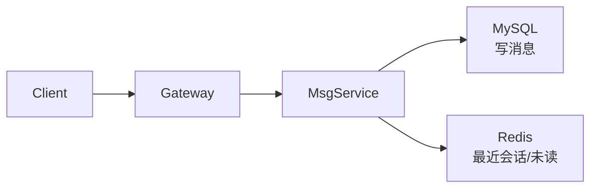
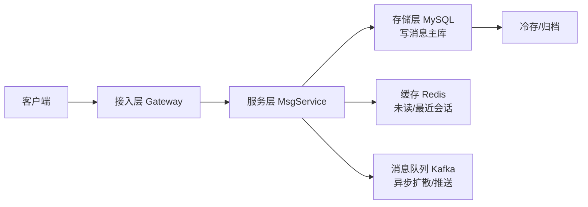
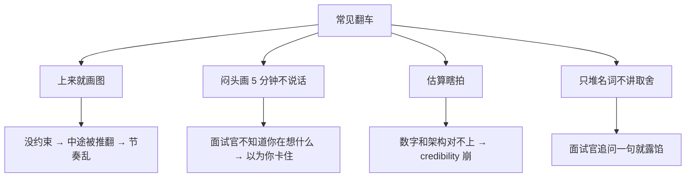

# 02 系统设计答题框架

> 大家好，欢迎来到这次分享。开讲之前，先带大家回到一个很多同学都经历过的现场：
> 面试官说「设计一个 IM 系统」，有人提笔就画，画到 8 分钟才发现不知道要支撑多少人；有人说「这个能扛 10 万 QPS」，却连 QPS 从哪来的都算不清。
> 这一章讲完，你会知道那两个人错在跳过约束和瞎拍数量级，以及 20 分钟该怎么切。
> **本章回答**：怎么用 20 分钟把开放系统设计题答成「有约束、能估算、可扩展、敢取舍」的封闭题。
> **不讲**：具体游戏 SRE 五道实战题的解法 → [03](../03-游戏SRE系统设计实战/)；项目 STAR 话术 → [01](../01-STAR项目话术/)；分布式一致性 → [02-06](../../02-中间件与数据库/06-分布式理论与一致性/)。这些都有专门的章节，本章只在用到时点到为止。

**标记**：🎯重点 · 🔥难点 · ⭐常考 · 🔧实操

**怎么听这场分享**：咱们先看第一节「一道系统设计题的 20 分钟」，把问约束 → 估容量 → 画主干 → 深挖 → 权衡 → 收尾装进脑子；后面用 IM 算例把数字墙走一遍；作战节拆「上来就画 / 闷头画 / 瞎拍 QPS」。每一节讲完都会提示对应练习题。

---

## 一、一张图：一道系统设计题的 20 分钟

> 🎯 **一句话**：系统设计面试不是考你画得多全，而是考你「先问清边界、再分层推进、最后讲清 trade-off」。


**读图**：主线是时间盒，不是概念目录。每一分钟都有产出物：约束清单 → 数字墙 → 一张高层图 → 2–3 个关键决策 → 风险清单 → 一句话收尾。节奏乱了，信息再多也等于没讲。

> 📝 **面试**：开场先说「我先确认几个约束，再画图」——这句话本身就是加分项，说明你不是背模板，而是在工程化地缩小问题空间。


练习题 Q1、Q14。主线有了——先问约束。

---

## 二、0–3 分钟：先问约束再动手

> 🎯 **一句话**：不问约束就画图，等于病人没说话医生先开膛——面试官要的是你的判断力，不是背过的架构图。

### 为什么必须先问约束 ⭐

大家想想：面试官说「设计一个 IM」，提笔就画 Gate——你会不会也想先露一手？很多人觉得「问太多显得不会」——**错了**。不问 DAU/延迟/一致性，后面全是空中楼阁。⭐ 口诀：**「先把开放题问成封闭题」**。

「设计一个 IM」有 100 种答案：可以是千万 DAU 的微信，也可以是 10 人小队的内部客服系统。面试官故意把题说大，看你会不会先拆维度。你问的每一类约束，都在展示工程判断力。

> 💡 **打个比方**：面试官说「设计一座桥」。你不可能直接说「用悬索桥」。你得先问「过人还是过航母」「跨小溪还是跨海峡」「预算多少、能修多久」。系统设计题的约束就是这六个问题。

不问约束直接画的后果：

```text
写到第 8 分钟发现要支持群聊 → 前面架构白画
把存储按 TB 算完 → 面试官说「我们只有 10 万用户」
大谈异地多活 → 面试官说「单机 demo 就行」
```

每出现一次，你的答案就被推翻一次，节奏全乱。所以**前 3 分钟是投资，不是耽误时间**。

### 必问的 6 类约束清单 ⭐🔥

| 约束类 | 你要问的原话 | 为什么它决定设计 |
|--------|--------------|------------------|
| **功能范围** | 「核心场景是什么？群聊/私聊/已读/撤回/文件要不要？」 | 功能多一个，存储、一致性、协议全变 |
| **用户量级** | 「DAU 多少？同时在线多少？」 | 从 DAU 推导 QPS，是容量估算入口 |
| **QPS 与读写比** | 「峰值写消息 QPS 多少？读历史消息是写的几倍？」 | 写扩、读扩、缓存策略完全不同 |
| **存储量与增长** | 「消息保留多久？图片/语音占比？」 | 决定分库分表、归档、冷存 |
| **延迟与可用性** | 「发送延迟 P99 要求？能接受几秒不可用？」 | 一致性模型、多活、降级方案 |
| **特殊约束** | 「合规？出海？弱网？客户端电量？」 | 决定协议选型、数据驻留、边缘部署 |

> ⚠️ **别混**：功能范围 ≠ 功能列表。范围是**边界**——这题做不做群聊、做不做文件传输；不是把「登录、注册、加好友」列一遍。后者是产品需求文档，不是系统设计约束。

### 问约束的话术模板 📝

开口不要背清单，用一个时间盒把问题抛回去：

> 「我先按 3 分钟把题拆一下：功能范围、用户量级和 QPS、存储与保留期、延迟和可用性目标、还有特殊约束比如合规或弱网。您看我先按哪几个假设往下走？」

这句话的好处：

- 展示你有框架（不是乱问）。
- 让面试官给数字或说「你按这个假设」。
- 如果他真说「你自己定」，你就能大胆给假设并继续推进。

### 假设清单模板

面试官不回答时，你要**主动给一个假设清单**并往下走，而不是僵住。下面是一份可套的「IM 系统」默认假设：

| 维度 | 默认值 | 可调方向 |
|------|--------|----------|
| DAU | 1000 万 | ±10 倍只影响机器数 |
| 峰值在线 | 200 万（20% DAU） | 游戏可能更高 |
| 人均日发消息 | 50 条 | 社交高、客服低 |
| 峰值写 QPS | 均值 × 5 | 早高峰/活动峰值 |
| 读:写 | 10:1 | 历史翻页多就更高 |
| 消息保留 | 90 天 | 金融可能永久 |
| 多媒体占比 | 10% | 决定对象存储用量 |
| P99 发送延迟 | < 200 ms | 实时游戏会更严 |
| 可用性目标 | 99.95% | 一年 4 小时 |

> 🎯 **关键直觉**：假设值可以错，但**推导链不能断**。面试官要看的不是你猜的数字准不准，而是你会不会从 DAU 推出 QPS、从 QPS 推出存储、从存储推出分片。


⭐ 六类约束清单。练习题 Q1、Q2。约束清了，估容量。

---

## 三、3–5 分钟：容量估算

> 🎯 **一句话**：容量估算不是算出一个精确数，而是用 5 分钟证明你的设计在数量级上站得住脚。

### back-of-envelope 的标准动作 ⭐🔥

面试官不会因为你说「我觉得 50 台机器」给分。他要的是你手里有一张**数字墙**，从 DAU 一路推到机器数。

🔥 back-of-envelope 大白话：**用数量级证明设计站得住**——1 天≈10⁵ 秒，峰值=均值×3～10，推完再谈组件。

四步：

```text
DAU → 同时在线 → 峰值 QPS
峰值 QPS → 写 QPS / 读 QPS（读写比）
写 QPS → 存储量 = 单条大小 × 条数 × 保留期 × 副本
读 QPS → 带宽 = QPS × 包大小
```

每一步都只要**数量级对**即可。估算不是会计做账。

### 数字墙：先把速算数集中放

> 1 天 ≈ 86400 秒 ≈ 10⁵ 秒 · 1M 请求/天 ≈ 12 QPS · 1 GB ≈ 10⁹ 字节 · 1 条消息 ≈ 100 字节文本 / 10 KB 含小图 · 峰值 = 均值 × 3~10 · 保留 90 天 ≈ 1/4 年

这些数不要求背，但要求**临场能拍**。把数字墙放在脑子里， interviewer 追问时你才能脱口而出。

### 完整算例：设计一个 IM

假设面试官默认你按 DAU 1000 万、峰值在线 200 万往下走：

| 步骤 | 算式 | 结果 |
|------|------|------|
| 人均发消息 | 1000 万 DAU × 50 条/天 | 5 亿条/天 |
| 均值写 QPS | 5 亿 / 10⁵ 秒 | ≈ 5 k QPS |
| 峰值写 QPS | 均值 × 5（早高峰） | ≈ 25 k QPS |
| 读消息比写 | 读历史 / 实时 ≈ 10:1 | 读 ≈ 250 k QPS |
| 单条大小 | 文本 200 B + 头 100 B | ≈ 300 B |
| 日存储增量 | 5 亿 × 300 B | ≈ 150 GB/天 |
| 保留 90 天 | 150 GB × 90 × 3 副本 | ≈ 40 TB |
| 下行带宽（读） | 250 k × 300 B × 8 | ≈ 600 Mbps |

> ⚠️ **别混**：峰值系数不是越大越好。拍 10 倍要说理由（整点活动、开服），拍 3 倍也要说理由（日常业务）。拍 100 倍没有场景支撑，会让面试官怀疑你在凑数。

> 📝 **面试**：说完数字后补一句「这些数字可以按真实业务调，但数量级上写服务是瓶颈、读服务可以靠缓存扛」——把估算结论和设计方向挂上钩。

### 另一组算例：游戏排行榜/邮件

换一个游戏场景，练习「同一套公式换变量」：

| 步骤 | 算式 | 结果 |
|------|------|------|
| DAU | 100 万 | 100 万 |
| 每日领奖/邮件 | 人均 20 次 | 2000 万次/天 |
| 均值写 QPS | 2000 万 / 10⁵ 秒 | ≈ 200 QPS |
| 峰值写 QPS | × 10（活动开服） | ≈ 2 k QPS |
| 读排行榜 QPS | 同时在线 30 万，每 30s 刷新一次 | ≈ 10 k QPS |
| 单条记录 | 玩家 ID + 分数 + 时间 ≈ 100 B | 100 B |
| 全服排行榜 | 100 万玩家 × 100 B | ≈ 100 MB |
| 奖励发放记录保留 | 2 亿条/年 × 200 B × 3 副本 | ≈ 120 GB/年 |

> 🎯 **关键直觉**：游戏场景读往往比写高一个数量级，且集中在开服/活动峰值。这时缓存和预计算比「加 DB 写库」重要得多。

### 读/写/存储的估算陷阱

- **只算峰值不算均值**：峰值决定机器数，均值决定成本。
- **只算 QPS 不算包大小**：包大小决定带宽，带宽在跨境/移动端会直接卡脖子。
- **只算热存储不算归档**：消息类业务 90% 访问是 7 天内，老数据可以冷存，副本数也可以降。
- **忽略读写比**：IM 写少读多，缓存收益大；如果是日志写入，写多读少，缓存几乎没用。

> 🎯 **关键直觉**：容量估算的产出不是「多少台机器」，而是「哪个资源会先爆」。先爆的那个就是后续深挖模块的入口。


口诀：**「数量级对就行，不是会计做账」**。练习题 Q3、Q4。估完了，画主干。

---

## 四、5–8 分钟：高层架构图（主干先行）

> 🎯 **一句话**：先画一条「客户端 → 接入层 → 服务层 → 存储层」的主干线，再补缓存、队列、监控——别一上来就堆 20 个组件。

### 主干先行原则 ⭐

口诀：**「先画数据流主干，再补高可用；组件别超过 10 个」**——上来就画 Kafka+Redis+分库分表全家桶，面试官分不清你的主路径。

面试官在 5–8 分钟要的是**数据流清晰**，不是组件全。常见翻车：

```text
一上来画 15 个框：网关、限流、注册中心、配置中心、Kafka、Redis、MySQL、ES、Prometheus、Grafana、ClickHouse、Nginx、LVS、DNS、CDN、WAF
```

这张图的问题不是错，而是**没有主线**。面试官不知道数据从哪进、到哪出、在哪写、在哪读。

正确画法：



先把主干跑通，再回答「高可用怎么保证」「读怎么加速」。

### 高层架构 mermaid 示例



**读图**：数据从客户端进，经网关到服务层；写消息落主库，未读计数走缓存，需要扩散的场景进队列。先看清这一条主线，后面再谈分库分表、限流、降级。

> 📝 **面试**：画框时嘴里要说用途，不要说名字。「这个框是接入层，负责鉴权、长连接保活、限流」——名字面试官看得见，用途要靠你讲。

### 组件不超过 10 个

如果时间紧，**一张图 6–8 个框**足够。超过 10 个框，面试官的注意力就被分散了。复杂的细节（比如 Prometheus、ES、Kafka 内部 topic）留在深挖阶段单独展开。

### 白板/在线作图的口述技巧 🔧

- **边画边说**：每画一个框，说「这里放 XX，解决 YY 问题」。
- **用手指当指针**：讲数据流时用手跟着箭头走，面试官不会迷路。
- **先横后纵**：先画主流程从左到右，再画高可用/扩展的纵向副本。
- **留白**：预留 20% 空白，后面深挖模块时补细节。

> 🎯 **关键直觉**：高层图是一张地图，不是蓝图。面试官要确认你知道「问题在哪一段」，而不是你真的能盖出这栋楼。


练习题 Q5。主干外，深挖 2～3 模块。

---

## 五、8–15 分钟：深挖 2–3 个模块

> 🎯 **一句话**：深挖不是越深越好，而是跟着面试官兴趣走，每讲一个方案都要讲清 trade-off。

### 怎么选深挖点

从容量估算里找出**最先会爆的资源**，对应一个模块：

```text
写 QPS 高 → 消息存储/分库分表
读 QPS 高 → 缓存/消息队列削峰
延迟敏感 → 接入层长连接/推送协议
可用性要求高 → 多活/一致性
```

一般选 **2–3 个** 深挖。多了超时，少了显得没深度。

### trade-off 话术模板 ⭐🔥

这是区分「背过架构」和「能设计」的关键句型：

> 「**A 方案优点是 X，代价是 Y；B 方案优点是 Z，代价是 W。在本题的 约束 下我选 A，因为…**」

示例（消息存储选 MySQL 还是 Cassandra）：

> 「MySQL 优点是事务成熟、团队熟悉、生态好；代价是单机写上限明显，分库分表后跨分片查询复杂。Cassandra 优点是写吞吐高、天然可扩展；代价是最终一致性，开发心智成本高。在本题『需要支持已读回执、历史消息顺序严格』的约束下，我选 MySQL + 分库分表，因为一致性要求高于写吞吐。」

> 📝 **面试**：每次讲完方案，主动补一句「当然，如果 约束 变成 X，我会换成 Y」。面试官会顺着你的话追问，你就掌握了节奏。

### 深挖模块一：消息存储与分库分表 🔥

假设前面估算出峰值写 25 k QPS，这是最先会爆的点。

**分片键选择 trade-off**：

| 方案 | 分片键 | 优点 | 代价 | 适合场景 |
|------|--------|------|------|----------|
| 按发送方 user_id | user_id | 写均匀，查自己历史快 | 群聊消息要写多个分片 | 私聊为主 |
| 按会话 conversation_id | conv_id | 单群消息紧凑，翻页快 | 热群会打穿单个分片 | 群聊为主 |
| 按时间 / 消息 ID | msg_id | 顺序好，归档方便 | 读某个用户历史要扫全库 | 日志、归档 |

> 🎯 **关键直觉**：分库分表不是把数据切开就完事，**分片键决定查询路径和热点分布**。选错分片键，扩容也没用。

**热群问题**：一个 10 万人大群，每秒发 1000 条，按 conversation_id 分表会把一个分片打穿。解法：

1. **大群单独通道**：大群消息走独立写入队列，按时间分片。
2. **读扩散 vs 写扩散**：小群写扩散（每条消息复制到每个成员的收件箱）；大群读扩散（只在群消息表存一份，读时聚合）。
3. **消息队列削峰**：先写 Kafka，再异步落库，保护主库。

> ⚠️ **别混**：写扩散读快、写重；读扩散写快、读重。IM 小群写扩散体验好，大群必须读扩散，否则存储和写量都爆炸。

### 深挖模块二：未读计数与缓存 ⭐

IM 读:写 ≈ 10:1，未读计数是读热点。

| 方案 | 优点 | 代价 | 一致性 |
|------|------|------|--------|
| Redis 计数器 | 读极快、可水平扩展 | 丢数风险、需要回源校验 | 最终一致 |
| MySQL 计数 | 强一致 | 读竞争大、易成瓶颈 | 强一致 |
| Redis + 异步刷库 | 读快、持久化 | 实现复杂、需要兜底 | 最终一致 |

推荐做法：**Redis 做未读计数 + 异步刷 MySQL 做持久化对账**。允许秒级不一致，但要有兜底：Redis 挂了可以回源 MySQL，只是读慢一点。

> 📝 **面试**：讲完缓存一定要讲「一致性怎么保证」和「缓存挂了怎么办」——只讲快不讲兜底，面试官会认为你没在生产环境踩过坑。

### 深挖模块清单与考点

| 模块 | 常考 trade-off | 追问点 |
|------|----------------|--------|
| 接入层 | 长连接 vs 短连接；TCP vs UDP/WebSocket | 心跳、并发连接数、网关无状态 |
| 消息队列 | Kafka vs RabbitMQ；削峰 vs 延迟 | 顺序、重复消费、积压 |
| 缓存 | Redis Cluster vs 主从；缓存一致性 | 穿透/击穿/雪崩、大 key |
| 存储/分库分表 | 按 user_id 分还是按 conversation_id 分 | 热点、扩容、跨分片聚合 |
| 一致性 | 强一致 vs 最终一致；CAP 怎么选 | 可用性、分区容错、读写模型 |
| 限流降级 | 入口限流 vs 服务间限流 | 熔断、兜底、降级预案 |

> ⚠️ **别混**：深挖不是把知道的技术名词堆一遍。每个名词必须回到「本题约束下为什么选它」。「用 Redis 因为快」是空话；「用 Redis 缓存未读计数，因为读是写的 10 倍、且未读计数可以容忍秒级不一致」才是答案。

### SRE 视角加分项 🔥

普通后端设计到「能跑」就停了，SRE/游戏运维要再补四层：

1. **可观测性**：Metrics（QPS/延迟/错误率）+ Logs（链路 ID）+ Traces（请求链）在哪打。
2. **容量水位**：CPU/内存/连接数/磁盘容量告警阈值，扩缩容触发线。
3. **降级预案**：缓存挂了怎么办？队列满了怎么办？推送服务降级为拉取。
4. **灰度**：新协议/新架构怎么按用户尾号、区服、百分比灰度，出问题一键切流。

> 📝 **面试**：讲完模块后补一句「上线后我会重点看 XX 指标，水位到 YY 就扩，ZZ 情况直接降级为兜底方案」——这几句话能把你的答案从「后端设计」拉到「SRE 设计」。


⭐ trade-off 句型。练习题 Q6～Q9。深挖外，瓶颈与扩展。

---

## 六、15–18 分钟：权衡、瓶颈与扩展

> 🎯 **一句话**：好的设计不是没有问题，而是你知道问题在哪、怎么扩、会怎么挂。

### 瓶颈预判

回到容量估算，指出**最先会爆的瓶颈**：

```text
大概率先爆的是：写消息主库 / 网关并发连接 / 推送通道带宽
小概率但致命的：缓存雪崩 / 队列单 partition 热点 / 单点 scheduler
```

示例：

> 「按前面 25 k 写 QPS 算，单 MySQL 实例写上限约 2 k QPS，所以分 16 个库是安全的；但如果出现热点大群（一个群每秒几千条消息），按 conversation_id 分表会把一个分片打穿，这里需要单独拆出『热群通道』。」

### 扩展方向

| 资源 | 扩展手段 | 注意点 |
|------|----------|--------|
| 读 QPS | 加缓存、加从库 | 缓存一致性、主从延迟 |
| 写 QPS | 分库分表、异步写队列 | 分片键、顺序保证 |
| 连接数 | 网关水平扩展、无状态化 | 状态外迁到 Redis |
| 带宽 | 边缘节点、CDN、压缩 | 弱网场景 |
| 存储 | 冷热分离、归档、压缩 | 保留期、合规 |

> 💡 **打个比方**：扩展不是「加机器」三个字。加机器解决的是「无状态服务」；有状态服务要先做**数据分片**或**状态外迁**，否则加机器只是搬家。

### 灰度与变更控制 🔧

SRE 设计必须回答「怎么上线」：

1. **按用户尾号灰度**：1% → 5% → 20% → 全量。
2. **按区服灰度**：先开一个测试服，再扩到 1 个线上服。
3. **按协议版本灰度**：新消息协议先给新版客户端用，老客户端保持兼容。
4. **一键回滚**：配置中心开关、数据库变更可逆、消息队列版本兼容。

> 📝 **面试**：把灰度说成「上线流程」而不是「测试流程」。生产事故 70% 来自变更，面试官会认可你对变更风险的敏感。

### 会怎么挂：故障模式 📝

主动讲故障模式，是高级 SRE 的标志：

- **MySQL 主库挂**：主从切换，30 秒内丢多少数据？业务能不能接受？
- **Redis 缓存挂**：直接打到 DB 的 QPS 是多少？有没有熔断？
- **Kafka 积压**：消费者 lag 到多少会触发告警？有没有降级为「只推在线用户」？
- **网关单点故障**：LB 后面有几台？session 状态在本地还是 Redis？

> 🎯 **关键直觉**：面试官不怕你说「这里可能挂」，怕的是你答完架构像「永远不坏」。主动暴露风险，再给出监控/降级/扩容方案，分数会更高。


练习题 Q10、Q11。扩展外，收尾三句。

---

## 七、18–20 分钟：收尾与主动暴露不足

> 🎯 **一句话**：最后 2 分钟不是复述，而是用一句话总结设计决策，再主动说「如果时间更多，我会深挖 XX」。

### 收尾三句话模板

1. **核心决策**：「最终设计是 X，因为约束 A、B、C。」
2. **关键取舍**：「为了 Y 牺牲了 Z，在题目约束下这是值得的。」
3. **下一步**：「如果时间更多，我会细化 XX（比如一致性协议、压测方案、降级剧本）。」

示例：

> 「最终采用『长连接网关 + 消息队列异步扩散 + MySQL 分库分表 + Redis 缓存未读』的架构。为了强一致牺牲了部分写吞吐，在 IM 场景下这是可接受的。如果时间更多，我会把热群拆分方案和多活一致性再细化。」

### 主动说不足

不是让你自黑，而是展示边界意识：

> 「这部分我没有实时 push 的经验，所以我的方案偏拉模式；如果团队有成熟的推送通道，我会把 push 改成服务间调用。」

这种表达不会让面试官扣分，反而会让他觉得你可培养、不编造。


练习题 Q12。收尾外——翻车抢救。

---

## 八、作战：常见翻车与抢救

> 🎯 **一句话**：翻车不可怕，可怕的是你不知道自己正在翻车。

### 四大翻车模式



**读图**：四种翻车的根因不是技术不行，是**节奏和表达**失控。每一种都有对应的抢救动作。

### 翻车 · 抢救对照 🔧

| 翻车信号 | 立即做什么 | 不要做什么 |
|----------|-----------|-----------|
| 面试官说「你先画」 | 先口头确认约束：「我先问 3 分钟约束，5 分钟给您第一张图」 | 提笔就画，画完再解释 |
| 画到一半卡壳 | 「我先按 X 假设继续，后面会回来验证」 | 沉默超过 10 秒 |
| 估算被质疑 | 「这个量级我按峰值 ×5 估算，如果实际系数不同，机器数会线性调整」 | 硬撑「 industry 标准就是这样」 |
| 被追问到不会 | 「这个点我没有实操过，我的推理是…」 | 编造 production 经历 |
| 时间只剩 3 分钟 | 直接跳到收尾三句话 | 还在补细节 |

### 追问应对

面试官的追问分两种：

| 追问类型 | 例子 | 应对 |
|----------|------|------|
| **挖深度** | 「如果 Redis 挂了怎么办？」 | 讲降级、熔断、回源、对账 |
| **换约束** | 「DAU 变成 1 亿呢？」 | 说哪部分先爆、怎么扩、数据是否重分片 |
| **考边界** | 「为什么不用 MongoDB？」 | 用 trade-off 句型对比 |
| **压力测试** | 「你这个方案有单点吗？」 | 承认 + 给出消除单点的方案 |

> 📝 **面试**：被打断不是扣分，是加分机会。面试官打断你，说明他对某个点感兴趣，**跟着他走**，不要强行把背完的模板讲完。

### 节奏控制口诀

```text
0–3   问约束，清单出口
3–5   算数字，数字墙亮
5–8   画主干，不超十框
8–15  挖两点，讲 trade-off
15–18 说瓶颈，讲会怎么挂
18–20 做收尾，主动讲不足
```


练习题 Q13、Q14。现在回开头那个现场。

---

**回到开头那个现场**：提笔就画、QPS 说不出从哪来。正确剧本是：0–3 问约束 → 3–5 估容量 → 5–8 主干图 → 8–15 深挖 trade-off → 15–20 瓶颈与收尾。现在再看「我先把架构画完再说」，你知道该怎么拉回来了。

## 九、收口

### 话术速查 🔧

> 本章无命令，把常用话术整理成可背的「开场/约束/估算/收尾」四段。

**开场**

> 「我先花 2–3 分钟确认约束：功能范围、用户量级、QPS 与读写比、存储保留期、延迟和可用性目标、特殊约束。确认完我再画图。」

**约束问法**

```text
功能范围：核心场景是什么？哪些功能可以不做？
用户量级：DAU 多少？峰值在线多少？
QPS：峰值写 QPS？读写比大约多少？
存储：消息保留多久？单条多大？是否含多媒体？
可用性：能接受几秒不可用？要不要多活？
延迟：发送 P99 要求多少？
特殊：合规/出海/弱网/电量？
```

**估算速背**

```text
1 天 ≈ 10⁵ 秒      1M/天 ≈ 12 QPS
峰值 ≈ 均值 × 3~10
存储 = 单条 × 条数 × 保留期 × 副本
带宽 = QPS × 包大小 × 8
```

**trade-off 句型**

> 「A 方案优点是 X，代价是 Y；B 方案优点是 Z，代价是 W。在本题约束下我选 A，因为…如果约束变成 XX，我会换 B。」

**收尾三句**

> 「最终设计是…」「关键取舍是…」「如果时间更多，我会细化…」

### 面试锚点表

遮住右列自问自答，卡壳的行回去重读对应小节——能讲出来才算会：

| 问 | 30 秒答 |
|----|---------|
| 系统设计第一步做什么？ | 先问约束，把开放题问成封闭题；不问约束直接画容易被推翻。 |
| 容量估算算什么？ | DAU→峰值 QPS→存储→带宽；重点是数量级和哪个资源先爆。 |
| 高层图怎么画？ | 主干先行：客户端→接入层→服务层→存储层；再补缓存/队列。 |
| 怎么讲 trade-off？ | 优点/代价/本题约束/如果约束变怎么换。 |
| SRE 视角要补什么？ | 可观测性、容量水位、降级预案、灰度。 |
| 被打断怎么办？ | 跟着他走，这是加分机会。 |
| 时间不够怎么办？ | 跳到收尾三句话，主动说不足。 |
| 深挖哪些模块？ | 从容量估算里找最先会爆的资源：写多读多/延迟/可用性。 |
| 分库分表先定什么？ | 先定分片键，否则热点打穿；常见按 user_id / conv_id / time 分。 |
| 缓存怎么用？ | 读多写少、可容忍最终一致；必须有降级和回源方案。 |
| 主动讲故障模式 | MySQL 挂/缓存挂/队列积压/网关单点——各自怎么降级。 |
| 节奏口诀？ | 0-3 问约束→3-5 算数字→5-8 画主干→8-15 挖模块→15-18 说瓶颈→18-20 收尾。 |
| 估算峰值系数怎么拍 | 要有场景理由：日常 ×3、活动 ×10；拍 100 倍没依据扣分。 |

### 易错一句话对照

- 上来就画图 → 先问约束
- 闷头画不说话 → 边画边说
- 估算只给一个总数 → 要展示推导链
- 峰值系数随便拍 → 要有场景理由
- 只堆组件不讲用途 → 每个框都要解决一个问题
- trade-off 只说优点 → 必须讲代价
- 「这个不会坏」 → 主动讲会怎么挂、怎么降级
- 被追问硬撑 → 说边界再给推理
- 缓存解决一切 → 写多读少的场景缓存收益低
- 分库分表就是水平拆分 → 先定分片键，否则热点打穿
- 多活等于高可用 → 一致性代价要先讲
- 限流只在入口做 → 服务间限流和降级同样重要
- 收尾复述一遍 → 用一句话总结 + 主动说不足
- 只谈功能不谈可用性 → SRE 设计必须有降级和容量水位
- 灰度是测试的事 → 变更是生产事故主因，灰度是上线流程
- 估算只给一个总数 → 要展示 DAU→QPS→存储→带宽的推导链
- 组件画 15 个框 → 主干先行 6-8 个，细节留在深挖阶段

### 数字墙

> 1 天 ≈ **86400** 秒 ≈ **10⁵** 秒 · 1M 请求/天 ≈ **12** QPS · 1 GB ≈ **10⁹** 字节 · 峰值 = 均值 × **3~10** · 单条消息 ≈ **100 B**（文本）/ **10 KB**（含小图）· 保留期 × 副本 = 真实存储 · 带宽 = QPS × 包大小 × **8**

### 口述模板

**【30 秒】**「系统设计面试 20 分钟六段：0-3 问约束把开放题变封闭题→3-5 容量估算 DAU 到 QPS 到存储到带宽→5-8 高层架构主干先行不超十框→8-15 深挖 2-3 模块讲 trade-off→15-18 说瓶颈和会怎么挂→18-20 收尾主动说不足。SRE 再补可观测性、容量水位、降级预案、灰度四层。」

**【2 分钟】** 沿一道系统设计题的 20 分钟：先问六类约束（功能范围/用户量/QPS/存储/延迟/特殊）→假设清单→back-of-envelope 四步推导→主干图组件≤10→深挖从先爆资源选模块→trade-off 句型「A 优点 X 代价 Y，B 优点 Z 代价 W，本题约束选 A」→瓶颈预判+灰度+故障模式→收尾三句话。

---

## 合上书

学到这里，先别急着翻下一章。合上书，试试下面这几件事——卡住就回对应小节：

- [ ] **口述 20 分钟主线**：0–3 问约束 → 3–5 容量估算 → 5–8 高层架构 → 8–15 深挖模块 → 15–18 瓶颈扩展 → 18–20 收尾。
- [ ] **默写 6 类约束清单**：功能范围 / 用户量级 / QPS 与读写比 / 存储量与增长 / 延迟与可用性 / 特殊约束。
- [ ] **口述容量估算推导链**：DAU → 峰值 QPS → 读/写 QPS → 存储 → 带宽，每个公式举一个数字例子。
- [ ] **口述高层图原则**：主干先行、组件不超过 10 个、先画数据流再补高可用。
- [ ] **口述 trade-off 句型**：A 优点 X 代价 Y，B 优点 Z 代价 W，本题约束下选 A，约束变 XX 换 B。
- [ ] **口述 SRE 四层加分项**：可观测性、容量水位、降级预案、灰度。
- [ ] **口述分库分表关键**：先选分片键；私聊/群聊/日志分别适合 user_id / conv_id / time；热群要单独通道或读扩散。
- [ ] **口述缓存使用原则**：读多写少、最终一致、必须有降级回源；缓存挂了不能直接把 DB 打死。
- [ ] **口述瓶颈与扩展**：从估算里找先爆的资源；读扩/写扩/连接数/带宽/存储各自用什么手段。
- [ ] **口述四大翻车信号与抢救**：上来就画、闷头画、估算瞎拍、只堆名词——各怎么救。
- [ ] **口述收尾三句话**：最终设计是什么、关键取舍是什么、下一步细化什么。
- [ ] **口述联动入口**：具体游戏五题 → [03](../03-游戏SRE系统设计实战/)；STAR 话术 → [01](../01-STAR项目话术/)；分布式一致性 → [02-06](../../02-中间件与数据库/06-分布式理论与一致性/)；分库分表 → [02-07](../../02-中间件与数据库/07-分库分表与中间件/)；容量模型细节 → [07-04](../../07-游戏运维专题/04-全链路压测与容量模型/)；高可用 → [01-33](../../01-基础底座/33-高可用与容灾/)。
