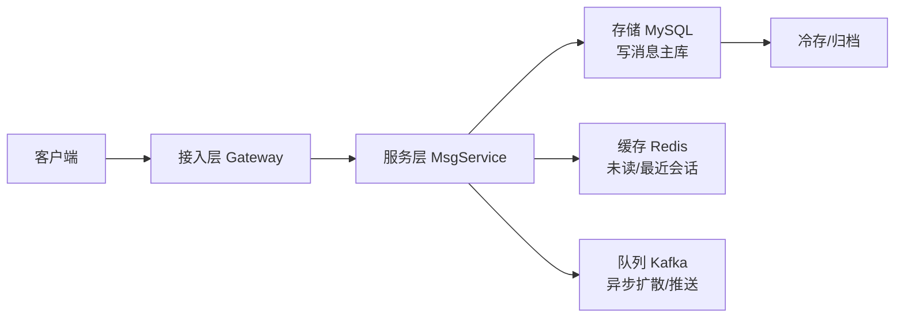
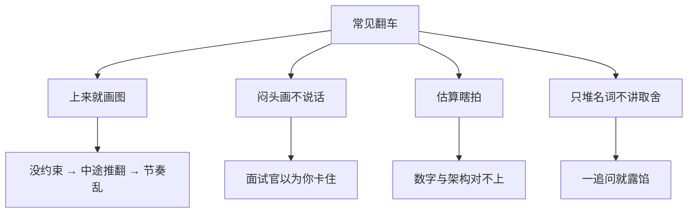

# 系统设计答题框架

> 面试官说「设计一个 IM」，有人提笔就画，画到第 8 分钟才发现不知道要支撑多少人；有人甩「能扛 10 万 QPS」，却说不清数字从哪来。三个人分别喊「先画全家桶」「先背微信架构」「先拍机器数」，三句都不对。
> **本章回答**：怎么用 20 分钟把开放系统设计题答成「有约束、能估算、可扩展、敢取舍」的封闭题。
> **不讲**：游戏 SRE 五道实战题解法 → [03](../03-游戏SRE系统设计实战/)；项目 STAR → [01](../01-STAR项目话术/)；分布式一致性细节 → [06](../../02-中间件与数据库/06-分布式理论与一致性/)。

**标记**：🎯重点 · 🔥难点 · ⭐常考 · 🔧实操
---

## 一、一张图：一道题的 20 分钟

> 🎯 **一句话**：系统设计面试不考「画得多全」，考「先问清边界、再分层推进、最后讲清 trade-off」。


- 📖 **读图**
  - 🛤️ 主线是时间盒：约束清单 → 数字墙 → 主干图 → 关键决策 → 风险 → 一句话收尾
  - ⏱️ 每一段都有产出物；节奏乱了，信息再多也等于没讲（Q1、Q14）

> 📝 **面试**：开场先说「我先确认几个约束，再画图」——这句话本身就是加分项。⭐

本节对应练习题 Q1、Q14。主线有了——先问约束。

---

## 二、0–3 分钟：先问约束再动手

> 🎯 **一句话**：不问约束就画图，等于病人没说话医生先开膛——面试官要的是判断力，不是背过的架构图。

### 🎭 开放题为什么必须先问 ⭐

- 🎭 **小剧场**：面试官说「设计一个 IM」，提笔就画 Gate——很多人觉得「问太多显得不会」。**错了**。不问 DAU/延迟/一致性，后面全是空中楼阁。
- 🔑 **口诀**：先把开放题问成封闭题。「设计一个 IM」可以是千万 DAU 微信，也可以是 10 人内部客服——面试官故意说大，看你会不会拆维度。

> 💡 **打个比方**：面试官说「设计一座桥」。你不能直接说「用悬索桥」——要先问过人还是过航母、跨小溪还是跨海峡、预算和工期。六类约束就是这六个问题。

#### ❓ 为什么不问约束直接画会翻车？

- ❌ **不问**：写到第 8 分钟才发现要群聊 → 前面白画；存完 TB 面试官说「只有 10 万用户」→ 推翻；大谈多活对方说「单机 demo」→ 节奏全乱
- ✅ **先问 3 分钟**：是投资，不是耽误时间；每一类约束都在展示工程判断力
- 🎯 **产出**：一张边界清单（做/不做 + 量级假设），后面估算和架构都挂在这张单上

### 📋 必问的 6 类约束 ⭐🔥

| 约束类 | 你要问的原话 | 为什么它决定设计 |
|--------|--------------|------------------|
| **功能范围** | 「核心场景？群聊/私聊/已读/撤回/文件要不要？」 | 功能多一个，存储、一致性、协议全变 |
| **用户量级** | 「DAU？同时在线？」 | 从 DAU 推 QPS，容量入口 |
| **QPS 与读写比** | 「峰值写 QPS？读是写的几倍？」 | 写扩、读扩、缓存策略不同 |
| **存储与增长** | 「保留多久？图片/语音占比？」 | 分库分表、归档、冷存 |
| **延迟与可用性** | 「发送 P99？能接受几秒不可用？」 | 一致性模型、多活、降级 |
| **特殊约束** | 「合规？出海？弱网？电量？」 | 协议、数据驻留、边缘 |

> ⚠️ **别混**：功能范围 ≠ 功能列表。范围是**边界**（做不做群聊/文件）；不是把「登录、注册、加好友」列一遍。

### 🗣️ 问约束话术 📝

> 「我先按 3 分钟把题拆一下：功能范围、用户量级和 QPS、存储与保留期、延迟和可用性、还有特殊约束。您看我先按哪几个假设往下走？」

- ✅ 展示框架（不是乱问）
- ✅ 让面试官给数字，或说「你按这个假设」
- ✅ 他说「你自己定」→ 大胆给假设并继续，不要僵住

### 📐 假设清单模板（面试官不答时）

| 维度 | 默认值 | 可调方向 |
|------|--------|----------|
| DAU | 1000 万 | ×10 只影响机器数 |
| 峰值在线 | 200 万（20% DAU） | 游戏可能更高 |
| 人均日发消息 | 50 条 | 社交高、客服低 |
| 峰值写 QPS | 均值 × 5 | 早高峰/活动 |
| 读:写 | 10:1 | 历史翻页多就更高 |
| 消息保留 | 90 天 | 金融可能永久 |
| 多媒体占比 | 10% | 对象存储用量 |
| P99 发送延迟 | < 200 ms | 实时游戏更严 |
| 可用性 | 99.95% | 一年约 4 小时 |

> 🎯 **关键直觉**：假设可以错，**推导链不能断**。面试官看的是你会不会从 DAU→QPS→存储→分片，不是猜的数字准不准。

本节对应练习题 Q1、Q2。约束清了，估容量。

---

## 三、3–5 分钟：容量估算

> 🎯 **一句话**：容量估算不是算出精确数，而是用 5 分钟证明设计在数量级上站得住。

### 🧮 back-of-envelope 四步 ⭐🔥

- 🔥 **大白话**：用数量级证明设计站得住——1 天≈10⁵ 秒，峰值=均值×3～10，推完再谈组件。

```text
DAU → 同时在线 → 峰值 QPS
峰值 QPS → 写 QPS / 读 QPS（读写比）
写 QPS → 存储 = 单条大小 × 条数 × 保留期 × 副本
读 QPS → 带宽 = QPS × 包大小
```

- 📖 **读图**：每一步只要数量级对；产出不是「多少台机器」，而是「哪个资源会先爆」——先爆的就是后面深挖入口。

### 🧱 数字墙（临场能拍）

> 1 天 ≈ 86400 秒 ≈ **10⁵** 秒 · 1M 请求/天 ≈ **12** QPS · 1 GB ≈ **10⁹** 字节 · 峰值 = 均值 × **3~10** · 单条消息 ≈ **100 B**（文本）/ **10 KB**（含小图） · 带宽 = QPS × 包大小 × **8**

### 📊 完整算例：IM（DAU 1000 万）

| 步骤 | 算式 | 结果 |
|------|------|------|
| 人均发消息 | 1000 万 × 50 条/天 | 5 亿条/天 |
| 均值写 QPS | 5 亿 / 10⁵ | ≈ 5 k |
| 峰值写 QPS | × 5（早高峰） | ≈ 25 k |
| 读:写 ≈ 10:1 | 读历史/实时 | 读 ≈ 250 k |
| 单条大小 | 文本 200 B + 头 100 B | ≈ 300 B |
| 日增量 | 5 亿 × 300 B | ≈ 150 GB/天 |
| 保留 90 天 × 3 副本 | 150 × 90 × 3 | ≈ 40 TB |
| 下行带宽 | 250 k × 300 B × 8 | ≈ 600 Mbps |

#### ❓ 为什么峰值系数不能随便拍？

- ❌ **拍 100 倍没场景**：面试官怀疑你在凑数
- ✅ **拍要有理由**：日常 ×3、活动/开服 ×10；说完数字再挂设计方向——「数量级上写是瓶颈、读靠缓存扛」
- ⚠️ **别混**：峰值决定机器数，均值决定成本；只算峰值不算均值、只算 QPS 不算包大小、忽略读写比——都是估算陷阱

> 📝 **面试**：说完数字补一句「这些可按真实业务调，但数量级上写服务是瓶颈、读可靠缓存」——估算结论挂设计方向。⭐（Q3、Q4）

### 🎮 换变量练手：游戏排行榜/邮件

| 步骤 | 算式 | 结果 |
|------|------|------|
| DAU | 100 万 | — |
| 日领奖/邮件 | 人均 20 次 | 2000 万次/天 |
| 均值写 | / 10⁵ | ≈ 200 QPS |
| 峰值写 | × 10（开服） | ≈ 2 k |
| 读排行榜 | 在线 30 万，每 30s 刷 | ≈ 10 k |
| 全服榜 | 100 万 × 100 B | ≈ 100 MB |

- 🎯 **游戏直觉**：读常比写高一个数量级，且扎堆开服/活动——缓存和预计算比「加 DB 写库」重要得多。

本节对应练习题 Q3、Q4。估完了，画主干。

---

## 四、5–8 分钟：高层架构（主干先行）

> 🎯 **一句话**：先画「客户端 → 接入 → 服务 → 存储」主干，再补缓存、队列、监控——别一上来堆 20 个组件。

### 🗺️ 主干先行 ⭐

- 🔑 **口诀**：先画数据流主干，再补高可用；组件别超过 10 个
- ❌ **翻车图**：一上来 15 个框（网关、限流、注册中心、Kafka、Redis、MySQL、ES、Prometheus…）——没错，但**没有主线**，面试官不知道数据从哪进到哪出



- 📖 **读图**
  - 🚪 数据从客户端进，经网关到服务；写落主库，未读走缓存，扩散进队列
  - 🌿 先看清这一条主线，再谈分库分表、限流、降级

#### ❓ 为什么不能一上来画全家桶？

- ❌ **框太多**：注意力散了，主路径淹没在枝叶里
- ✅ **6–8 个框够用**：复杂细节（Prometheus、ES、Kafka topic）留在深挖阶段展开
- 🗣️ **边画边说用途**：「这个框是接入层，负责鉴权、长连接保活、限流」——名字看得见，用途靠你讲

### 🔧 白板口述技巧 🔧

- 边画边说：每画一框说「放 XX，解决 YY」
- 手指当指针：讲数据流跟着箭头走
- 先横后纵：主流程左→右，再补副本/扩展
- 留白约 20%：深挖时补细节

> 🎯 **关键直觉**：高层图是地图，不是蓝图。面试官要确认你知道「问题在哪一段」，不是你真能盖出这栋楼。

本节对应练习题 Q5。主干外，深挖 2～3 模块。

---

## 五、8–15 分钟：深挖 2–3 个模块

> 🎯 **一句话**：深挖不是越深越好，而是跟着面试官兴趣走；每讲一个方案都要讲清 trade-off。

### 🎯 怎么选深挖点

```text
写 QPS 高 → 消息存储 / 分库分表
读 QPS 高 → 缓存 / 队列削峰
延迟敏感 → 接入长连接 / 推送协议
可用性高 → 多活 / 一致性
```

- 一般 **2–3 个**；多了超时，少了没深度
- 入口永远是：容量估算里**最先会爆的资源**

### ⚖️ trade-off 句型 ⭐🔥

> 「**A 优点 X，代价 Y；B 优点 Z，代价 W。在本题约束下我选 A，因为…**」

示例（消息存储 MySQL vs Cassandra）：

> 「MySQL 事务成熟、团队熟；代价是单机写上限、分片后跨片查询复杂。Cassandra 写吞吐高、易扩展；代价是最终一致、心智成本高。本题『已读回执 + 历史顺序严格』→ 选 MySQL + 分库分表，一致性优先于写吞吐。」

> 📝 **面试**：讲完主动补「如果约束变成 X，我会换 Y」——掌握追问节奏。

### 🗄️ 深挖一：消息存储与分片键 🔥

峰值写 25 k 时，最先爆的往往是写库。

| 方案 | 分片键 | 优点 | 代价 | 适合 |
|------|--------|------|------|------|
| 按发送方 | user_id | 写均匀，查自己历史快 | 群聊要写多片 | 私聊为主 |
| 按会话 | conv_id | 单群紧凑，翻页快 | 热群打穿一片 | 群聊为主 |
| 按时间/消息 ID | msg_id | 顺序好，归档易 | 查用户历史扫全库 | 日志/归档 |

#### ❓ 为什么分片键选错，扩容也救不了？

- 🔑 **分片键决定查询路径和热点分布**——切开不等于均匀
- 🔥 **热群**：10 万人大群每秒 1000 条，按 `conv_id` 分会打穿一片
  - 大群单独通道（按时间分片）
  - 小群**写扩散**（复制到成员收件箱）/ 大群**读扩散**（群表一份，读时聚合）
  - 先写 Kafka 再异步落库，保护主库
- ⚠️ **别混**：写扩散读快写重；读扩散写快读重。小群写扩散体验好，大群必须读扩散，否则存储和写量爆炸

### 📬 深挖二：未读计数与缓存 ⭐

读:写 ≈ 10:1 时，未读是读热点。

| 方案 | 优点 | 代价 | 一致性 |
|------|------|------|--------|
| Redis 计数 | 极快、可扩 | 丢数风险、需回源 | 最终 |
| MySQL 计数 | 强一致 | 读竞争、易成瓶颈 | 强 |
| Redis + 异步刷库 | 读快、可持久 | 复杂、要兜底 | 最终 |

- ✅ **推荐**：Redis 未读 + 异步刷 MySQL 对账；允许秒级不一致；Redis 挂了回源 MySQL（变慢但不挂死）
- 📝 讲完缓存必须讲「一致性」和「挂了怎么办」——只讲快不讲兜底减分

### 🧭 深挖模块清单（常考 trade-off）

| 模块 | 常考取舍 | 追问点 |
|------|----------|--------|
| 接入层 | 长连 vs 短连；TCP vs WebSocket | 心跳、连接数、网关无状态 |
| 消息队列 | Kafka vs RabbitMQ；削峰 vs 延迟 | 顺序、重复、积压 |
| 缓存 | Cluster vs 主从；一致性 | 穿透/击穿/雪崩、大 key |
| 存储 | user_id vs conv_id | 热点、扩容、跨片聚合 |
| 一致性 | 强 vs 最终；CAP | 可用性、分区、读写模型 |
| 限流降级 | 入口 vs 服务间 | 熔断、兜底预案 |

> ⚠️ **别混**：深挖不是堆名词。「用 Redis 因为快」是空话；「读是写的 10 倍、未读可秒级不一致 → Redis + 回源」才是答案。

### 🛡️ SRE 视角四层加分 🔥

1. **可观测性**：Metrics（QPS/延迟/错误率）+ Logs（链路 ID）+ Traces
2. **容量水位**：CPU/内存/连接/磁盘阈值与扩缩触发线
3. **降级预案**：缓存挂？队列满？推送降级为拉取
4. **灰度**：尾号/区服/百分比；出问题一键切流

> 📝 **面试**：补「上线后重点看 XX，水位到 YY 扩，ZZ 直接降级」——从后端设计拉到 SRE 设计。

本节对应练习题 Q6～Q9。深挖外，瓶颈与扩展。

---

## 六、15–18 分钟：瓶颈、扩展与会怎么挂

> 🎯 **一句话**：好的设计不是没有问题，而是你知道问题在哪、怎么扩、会怎么挂。

### 💥 瓶颈预判

```text
大概率先爆：写消息主库 / 网关并发连接 / 推送通道带宽
小概率但致命：缓存雪崩 / 单 partition 热点 / 单点 scheduler
```

- 示例：「25 k 写 QPS，单实例写约 2 k → 分 16 库安全；热群按 conv_id 仍会打穿一片 → 要单独热群通道。」

### 📈 扩展方向

| 资源 | 手段 | 注意 |
|------|------|------|
| 读 QPS | 缓存、从库 | 一致性、主从延迟 |
| 写 QPS | 分库分表、异步队列 | 分片键、顺序 |
| 连接数 | 网关水平扩、无状态化 | 状态外迁 Redis |
| 带宽 | 边缘、CDN、压缩 | 弱网 |
| 存储 | 冷热分离、归档 | 保留期、合规 |

> 💡 **打个比方**：扩展不是「加机器」三字。无状态能加；有状态要先**分片**或**状态外迁**，否则加机器只是搬家。

### 🚦 灰度与变更 🔧

1. 用户尾号：1% → 5% → 20% → 全量
2. 区服：测试服 → 一个线上服 → 扩
3. 协议版本：新客户端先用，老端兼容
4. 一键回滚：配置开关、库变更可逆、队列版本兼容

> 📝 **面试**：灰度是**上线流程**不是测试流程。生产事故大半来自变更。

### 🪦 主动讲故障模式 📝

- MySQL 主挂：切换多久？丢多少数据？业务能否接受？
- Redis 挂：打到 DB 的 QPS？有没有熔断？
- Kafka 积压：lag 告警线？降级为「只推在线」？
- 网关单点：LB 后几台？session 在本地还是 Redis？

> 🎯 **关键直觉**：面试官不怕你说「这里可能挂」，怕你答完像「永远不坏」。

本节对应练习题 Q10、Q11。扩展外，收尾。

---

## 七、18–20 分钟：收尾与暴露不足

> 🎯 **一句话**：最后 2 分钟不是复述，而是一句话总结决策，再主动说「时间更多会深挖 XX」。

### 收尾三句

1. **核心决策**：「最终设计是 X，因为约束 A、B、C。」
2. **关键取舍**：「为了 Y 牺牲了 Z，在题目约束下值得。」
3. **下一步**：「时间更多会细化 XX（一致性/压测/降级剧本）。」

示例：

> 「最终采用『长连接网关 + 队列异步扩散 + MySQL 分库分表 + Redis 未读』。为强一致牺牲部分写吞吐，IM 场景可接受。时间更多会细化热群拆分与多活。」

### 主动说不足

> 「这部分我没有实时 push 经验，方案偏拉模式；若团队有成熟推送通道，我会改成服务间 push。」

- 不是自黑，是边界意识；不编造 production 经历

本节对应练习题 Q12。收尾外——翻车抢救。

---

## 八、作战：常见翻车与抢救

> 🎯 **一句话**：翻车不可怕，可怕的是你不知道自己正在翻车。



- 📖 **读图**：四种翻车根因是**节奏和表达**失控，不是技术不行；各有抢救动作

### 🚑 翻车 · 抢救对照 🔧

| 翻车信号 | 立即做 | 不要做 |
|----------|--------|--------|
| 「你先画」 | 口头确认：「先问 3 分钟约束，5 分钟给第一张图」 | 提笔就画 |
| 画到一半卡壳 | 「先按 X 假设继续，后面回来验证」 | 沉默 >10 秒 |
| 估算被质疑 | 「量级按峰值 ×5；系数不同则机器数线性调」 | 硬撑「industry 标准」 |
| 追问到不会 | 「这点没实操，我的推理是…」 | 编造经历 |
| 只剩 3 分钟 | 跳收尾三句 | 还在补细节 |

#### ❓ 为什么被打断是加分机会？

- 🎯 面试官打断 = 他对某点感兴趣 → **跟着他走**
- ❌ 强行把背完的模板讲完 = 扣分节奏
- ✅ 挖深度 → 讲降级/熔断/回源；换约束 → 说哪先爆怎么扩；考边界 → trade-off 句型

### 节奏口诀

```text
0–3   问约束，清单出口
3–5   算数字，数字墙亮
5–8   画主干，不超十框
8–15  挖两点，讲 trade-off
15–18 说瓶颈，讲会怎么挂
18–20 做收尾，主动讲不足
```

本节对应练习题 Q13、Q14。

---

**回到开头**：提笔就画、QPS 说不出从哪来。正确剧本：0–3 问约束 → 3–5 估容量 → 5–8 主干图 → 8–15 深挖 trade-off → 15–20 瓶颈与收尾。再听「我先把架构画完再说」，你知道怎么拉回来了。

## 九、收口

### 话术速查 🔧

**开场**

> 「我先花 2–3 分钟确认约束：功能范围、用户量级、QPS 与读写比、存储保留期、延迟和可用性、特殊约束。确认完再画图。」

**估算速背**

```text
1 天 ≈ 10⁵ 秒      1M/天 ≈ 12 QPS
峰值 ≈ 均值 × 3~10
存储 = 单条 × 条数 × 保留期 × 副本
带宽 = QPS × 包大小 × 8
```

**trade-off**

> 「A 优点 X 代价 Y；B 优点 Z 代价 W。本题约束选 A；约束变 XX 换 B。」

**收尾三句**

> 「最终设计是…」「关键取舍是…」「时间更多会细化…」

### 面试锚点表

| 问 | 30 秒答 |
|----|---------|
| 第一步做什么？ | 先问约束，开放题变封闭题 |
| 容量估什么？ | DAU→峰值 QPS→存储→带宽；找先爆资源 |
| 高层图怎么画？ | 主干：客户端→接入→服务→存储；再补缓存/队列 |
| 怎么讲 trade-off？ | 优点/代价/本题约束/约束变怎么换 |
| SRE 补什么？ | 可观测性、水位、降级、灰度 |
| 被打断？ | 跟着他走，加分机会 |
| 时间不够？ | 跳收尾三句，主动说不足 |
| 深挖哪些？ | 估算里先爆的：写/读/延迟/可用性 |
| 分库分表先定？ | 先定分片键；热群单独通道或读扩散 |
| 缓存怎么用？ | 读多写少、可最终一致；必须有回源降级 |

### 易错一句话对照

- 上来就画 → 先问约束
- 闷头不说话 → 边画边说
- 只给一个总数 → 展示 DAU→QPS→存储→带宽推导链
- 峰值系数乱拍 → 要有场景理由
- 只堆组件 → 每框解决一个问题
- trade-off 只说优点 → 必须讲代价
- 「不会坏」 → 主动讲会挂、怎么降级
- 被追问硬撑 → 说边界再给推理
- 缓存解决一切 → 写多读少场景收益低
- 分库分表=切开 → 先定分片键
- 多活=高可用 → 先讲一致性代价
- 灰度是测试的事 → 变更是事故主因，灰度是上线流程
- 收尾复述一遍 → 一句话总结 + 主动说不足

### 数字墙

> 1 天 ≈ **86400** 秒 ≈ **10⁵** · 1M/天 ≈ **12** QPS · 峰值 × **3~10** · 单条 ≈ **100 B** / **10 KB** · 带宽 = QPS × 包 × **8** · 保留期 × 副本 = 真实存储

### 口述模板

**【30 秒】**「系统设计 20 分钟六段：0-3 问约束→3-5 容量估算→5-8 主干图≤10 框→8-15 深挖 2-3 模块讲 trade-off→15-18 瓶颈与会挂→18-20 收尾说不足。SRE 再补可观测性、水位、降级、灰度。」

**【2 分钟】** 六类约束 → 假设清单 → 四步估算 → 主干图 → 从先爆资源选深挖 → trade-off 句型 → 瓶颈+灰度+故障模式 → 收尾三句。

---

## 合上书

- [ ] **口述 20 分钟主线**：问约束 → 估容量 → 主干 → 深挖 → 瓶颈 → 收尾
- [ ] **默写 6 类约束**：功能范围 / 用户量 / QPS 读写比 / 存储 / 延迟可用性 / 特殊
- [ ] **口述估算链**：DAU → 峰值 QPS → 读写 → 存储 → 带宽，带一个数字例子
- [ ] **口述主干原则**：先数据流、≤10 框、再补高可用
- [ ] **口述 trade-off 句型**：A/B 优缺点 + 本题约束选谁 + 约束变怎么换
- [ ] **口述 SRE 四层**：可观测性、水位、降级、灰度
- [ ] **口述分片键**：私聊 user_id / 群聊 conv_id / 日志 time；热群读扩散或单独通道
- [ ] **口述四大翻车抢救**：上来就画、闷头画、瞎拍、堆名词——各怎么救
- [ ] **口述收尾三句**：最终设计 / 关键取舍 / 下一步细化
- [ ] **联动**：游戏五题 → [03](../03-游戏SRE系统设计实战/)；STAR → [01](../01-STAR项目话术/)；一致性 → [06](../../02-中间件与数据库/06-分布式理论与一致性/)；分库分表 → [07](../../02-中间件与数据库/07-分库分表与中间件/)；容量模型 → [04](../../07-游戏运维专题/04-全链路压测与容量模型/)；高可用 → [33](../../01-基础底座/33-高可用与容灾/)
